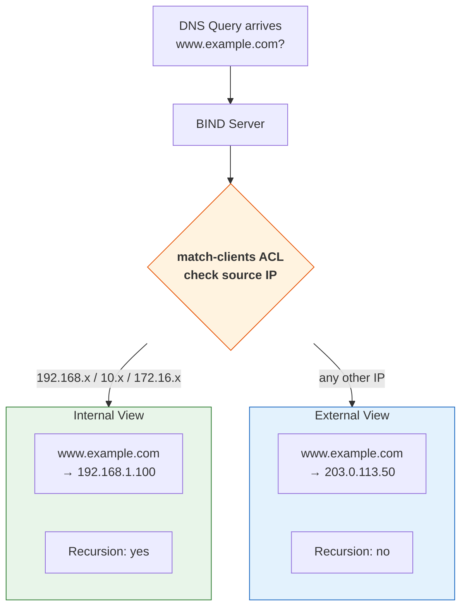

# BIND

This guide covers BIND - the reference implementation of DNS and the most widely deployed DNS server software in the world. You'll learn to configure it as a caching recursive resolver, an authoritative server, and in primary/secondary configurations with TSIG authentication.

---

## What BIND Is

[**BIND**](https://bind9.readthedocs.io/en/stable/) (Berkeley Internet Name Domain) was written in 1984 by four graduate students at UC Berkeley as part of a DARPA grant. It's maintained by the [**Internet Systems Consortium (ISC)**](https://www.isc.org/) and remains the reference implementation against which other DNS software is measured.

BIND 9 (the current major version, in development since 2000) is a complete rewrite of earlier versions. It handles both authoritative and recursive DNS, supports DNSSEC, TSIG, views (split-horizon), Response Policy Zones (RPZ), and virtually every DNS feature that exists.

When to choose BIND:

- You need a single server that does both authoritative and recursive DNS
- You need advanced features like views, RPZ, or DNSSEC with automated key rollover
- You want the widest community support and documentation
- You need to match the behavior of the DNS reference implementation

When to consider alternatives:

- You need maximum authoritative performance (NSD is faster for pure authoritative serving)
- You want a database backend (PowerDNS supports MySQL, PostgreSQL, SQLite)
- You want separate authority and recursion with minimal attack surface (NSD + Unbound)

### Architecture

BIND 9 underwent a significant internal change in version 9.20: the data structure for the in-memory zone database was replaced from a **Red-Black Tree** to a **QP-trie** (Quadbit Patricia trie). The QP-trie provides faster lookups and better memory efficiency for large zones. This is transparent to configuration - no settings changed - but it explains why BIND 9.20+ handles large zones measurably better than earlier versions.

---

## Installation and File Layout

### Installation

**RHEL / AlmaLinux / Rocky:**

```bash
sudo dnf install bind bind-utils
sudo systemctl enable --now named
```

**Debian / Ubuntu:**

```bash
sudo apt install bind9 bind9-utils
sudo systemctl enable --now named
```

### Key Files

| Path | Purpose |
|------|---------|
| `/etc/named.conf` (RHEL) or `/etc/bind/named.conf` (Debian) | Main configuration |
| `/var/named/` (RHEL) or `/var/cache/bind/` (Debian) | Zone files directory |
| `/etc/named/` or `/etc/bind/` | Additional config files |
| `/var/log/named/` | Logs (if configured) |
| `/etc/rndc.key` or `/etc/bind/rndc.key` | `rndc` authentication key |

### named.conf Structure

`named.conf` is organized into blocks:

```
options { ... };       // Global server settings
logging { ... };       // Log channels and categories
acl name { ... };      // Named access control lists
zone "name" { ... };   // Zone definitions
view "name" { ... };   // Split-horizon views (contain zone blocks)
key "name" { ... };    // TSIG keys for authentication
```

You can split the configuration across multiple files using `include`:

```
include "/etc/named/zones.conf";
include "/etc/named/acls.conf";
```

---

## Configuring a Caching Recursive Resolver

A caching resolver accepts queries from your network, resolves them iteratively, and caches the results. This is the simplest useful BIND configuration.

```
// /etc/named.conf - Caching recursive resolver

acl "trusted" {
    192.168.1.0/24;       // office network
    10.0.0.0/8;           // internal network
    localhost;
    localnets;
};

options {
    directory "/var/named";
    pid-file "/run/named/named.pid";

    // Listen on localhost and the internal interface
    listen-on    { 127.0.0.1; 192.168.1.1; };
    listen-on-v6 { ::1; };

    // Only allow recursion for trusted networks
    allow-recursion { trusted; };
    allow-query     { trusted; };

    // Forward unresolved queries to upstream resolvers (optional)
    // forwarders { 8.8.8.8; 1.1.1.1; };
    // forward only;  // "only" means don't try iterative if forwarders fail

    // DNSSEC validation
    dnssec-validation auto;

    // Hide the BIND version from queries
    version "not disclosed";

    // Rate limiting to mitigate amplification attacks
    rate-limit {
        responses-per-second 10;
    };
};

logging {
    channel default_log {
        file "/var/log/named/default.log" versions 3 size 5m;
        severity info;
        print-time yes;
        print-severity yes;
    };
    channel query_log {
        file "/var/log/named/queries.log" versions 5 size 10m;
        severity info;
        print-time yes;
    };

    category default  { default_log; };
    category queries  { query_log; };
};
```

Key decisions in this configuration:

**`allow-recursion`** restricts who can use this server as a resolver. Without this, you're running an open resolver - a vector for DNS amplification attacks. Only allow your own networks.

**`dnssec-validation auto`** enables DNSSEC validation using the built-in root trust anchor. BIND ships with the root zone's KSK and updates it automatically via [RFC 5011](https://datatracker.ietf.org/doc/html/rfc5011) trust anchor management.

**`forwarders`** (commented out) - uncomment if you want BIND to ask upstream resolvers instead of doing full iterative resolution. `forward only` means if the forwarders don't respond, BIND gives up. Without `forward only`, BIND falls back to iterative resolution.

After editing, always validate and reload:

```bash
named-checkconf                      # validate configuration syntax
sudo systemctl reload named          # apply changes without restart
sudo rndc status                     # verify the server is running
```

---

## Configuring an Authoritative Server

An authoritative server hosts zone data and answers queries from that data. It does not perform recursion.

### Zone Definition

Add a zone to `named.conf`:

```
zone "example.com" {
    type primary;
    file "zones/example.com.zone";
    allow-transfer { none; };           // restrict zone transfers
    notify yes;                         // notify secondaries on changes
};
```

### Zone File

Create the zone file at `/var/named/zones/example.com.zone` (see the [Zone Files and Records](zone-files-and-records.md) guide for full syntax):

```
$TTL 3600
$ORIGIN example.com.

@   IN  SOA ns1.example.com. admin.example.com. (
            2025011501  ; serial
            3600        ; refresh
            900         ; retry
            1209600     ; expire
            300         ; minimum
)

@           IN  NS      ns1.example.com.
@           IN  NS      ns2.example.com.
ns1         IN  A       198.51.100.1
ns2         IN  A       198.51.100.2

@           IN  A       198.51.100.10
www         IN  CNAME   example.com.
mail        IN  A       198.51.100.20
@           IN  MX      10 mail.example.com.
@           IN  TXT     "v=spf1 ip4:198.51.100.0/24 -all"
```

### Validation and Reload

Always validate before reloading:

```bash
# Check configuration syntax
named-checkconf

# Check zone file syntax and data consistency
named-checkzone example.com /var/named/zones/example.com.zone
```

`named-checkzone` catches trailing-dot errors, duplicate records, CNAME conflicts, and other common mistakes:

```
zone example.com/IN: loaded serial 2025011501
OK
```

If there's an error:

```
zone example.com/IN: mail.example.com/MX 'mail.example.com.example.com' is a CNAME (illegal)
zone example.com/IN: not loaded due to errors.
```

Reload the zone without restarting BIND:

```bash
sudo rndc reload example.com          # reload a specific zone
sudo rndc reload                      # reload all zones
```

---

## Primary/Secondary Configuration

A **primary** server holds the master copy of zone data. A **secondary** server receives zone data from the primary via zone transfer and serves it identically. Secondaries provide redundancy and distribute query load.

### Primary Configuration

On the primary server, allow zone transfers to the secondary's IP:

```
zone "example.com" {
    type primary;
    file "zones/example.com.zone";
    allow-transfer { 203.0.113.2; };    // secondary server IP
    also-notify    { 203.0.113.2; };    // actively notify on changes
};
```

### Secondary Configuration

On the secondary server:

```
zone "example.com" {
    type secondary;
    file "zones/example.com.zone";
    primaries { 198.51.100.1; };        // primary server IP
    allow-transfer { none; };
};
```

When the secondary starts (or when it receives a NOTIFY from the primary), it checks the primary's SOA serial. If the serial is higher, it initiates a zone transfer.

### Testing Zone Transfers

You can test zone transfers manually with `dig`:

```bash
dig @198.51.100.1 example.com AXFR
```

```
example.com.        3600    IN  SOA ns1.example.com. admin.example.com. 2025011501 ...
example.com.        3600    IN  NS  ns1.example.com.
example.com.        3600    IN  NS  ns2.example.com.
example.com.        3600    IN  A   198.51.100.10
;; [... all records in the zone ...]
example.com.        3600    IN  SOA ns1.example.com. admin.example.com. 2025011501 ...
```

AXFR transfers the entire zone. The SOA record appears at both the beginning and end - that's the protocol's way of marking the transfer boundaries.

### TSIG Authentication

Plain IP-based access control is vulnerable to spoofing. **TSIG (Transaction Signature)** adds cryptographic authentication to zone transfers and `rndc` commands.

Generate a shared key:

```bash
tsig-keygen example-transfer-key
```

```
key "example-transfer-key" {
    algorithm hmac-sha256;
    secret "jF3K8vQ2+xN7wP5dR9mB0kT4yH1cA6uZ...";
};
```

Add this key block to `named.conf` on both servers.

**Primary** - require TSIG for transfers:

```
zone "example.com" {
    type primary;
    file "zones/example.com.zone";
    allow-transfer { key "example-transfer-key"; };
    also-notify    { 203.0.113.2; };
};
```

**Secondary** - authenticate with TSIG:

```
server 198.51.100.1 {
    keys { "example-transfer-key"; };
};

zone "example.com" {
    type secondary;
    file "zones/example.com.zone";
    primaries { 198.51.100.1; };
};
```

Test the authenticated transfer:

```bash
dig @198.51.100.1 example.com AXFR -y hmac-sha256:example-transfer-key:jF3K8vQ2+xN7wP...
```

---

## Views (Split-Horizon DNS)

**Views** let a single BIND server return different answers depending on who's asking. The most common use case is returning internal IP addresses for internal clients and public IP addresses for everyone else.



```
acl "internal" {
    192.168.0.0/16;
    10.0.0.0/8;
    172.16.0.0/12;
};

view "internal" {
    match-clients { internal; };
    recursion yes;

    zone "example.com" {
        type primary;
        file "zones/example.com.internal.zone";
    };
};

view "external" {
    match-clients { any; };
    recursion no;

    zone "example.com" {
        type primary;
        file "zones/example.com.external.zone";
    };
};
```

The internal zone file might have:

```
www     IN  A   192.168.1.100       ; internal web server
```

While the external zone file has:

```
www     IN  A   203.0.113.50        ; public IP
```

**Important:** when using views, *every* zone must be inside a view - including the root hints and localhost zones. You can't mix view and non-view zone statements. The views are evaluated in order, and a client matches the first view whose `match-clients` ACL includes them.

---

## Security and Hardening

### Restrict Recursion

If your server is authoritative-only, disable recursion entirely:

```
options {
    recursion no;
    allow-query { any; };       // authoritative servers should answer everyone
};
```

If it serves both roles, restrict recursion to trusted networks (shown in the caching resolver config above).

### Rate Limiting

Mitigate DNS amplification attacks with response rate limiting:

```
options {
    rate-limit {
        responses-per-second 10;
        window 5;
    };
};
```

This drops responses when a single source receives more than 10 identical responses per second. Legitimate clients rarely trigger this, but it significantly limits amplification attacks.

### Version Hiding

By default, BIND responds to `dig version.bind chaos txt` with its version number. Attackers use this to identify vulnerable versions. Hide it:

```
options {
    version "not disclosed";
};
```

### Response Policy Zones (RPZ)

**RPZ** lets you override DNS responses based on policy - essentially a DNS-level firewall. You can block known malicious domains, redirect them, or return NXDOMAIN:

```
options {
    response-policy {
        zone "rpz.example.com";
    };
};

zone "rpz.example.com" {
    type primary;
    file "zones/rpz.example.com.zone";
};
```

RPZ zone file:

```
$TTL 300
@   IN  SOA localhost. admin.example.com. ( 1 3600 900 604800 300 )
@   IN  NS  localhost.

; Block a known malicious domain
malware.bad-domain.com   IN  CNAME  .        ; return NXDOMAIN
; Redirect another domain
phishing-site.com        IN  A      127.0.0.1 ; redirect to localhost
```

Several threat intelligence providers publish RPZ feeds that you can use as secondary zones for automatic protection.

---

## Operational Commands Reference

`rndc` (Remote Name Daemon Control) manages a running BIND server:

| Command | Action |
|---------|--------|
| `rndc status` | Show server status |
| `rndc reload` | Reload all zones |
| `rndc reload example.com` | Reload a specific zone |
| `rndc reconfig` | Re-read `named.conf` for new/removed zones (without reloading existing zones) |
| `rndc flush` | Clear the entire cache |
| `rndc flush example.com` | Clear cache for one domain |
| `rndc dumpdb -cache` | Dump the cache to a file for inspection |
| `rndc querylog on` | Enable query logging |
| `rndc querylog off` | Disable query logging |
| `rndc retransfer example.com` | Force a secondary to re-transfer a zone |
| `rndc notify example.com` | Send NOTIFY to secondaries for a zone |
| `rndc signing -list example.com` | List DNSSEC signing operations in progress |
| `rndc zonestatus example.com` | Show zone status details |

`rndc` authenticates to `named` using a shared key. If `rndc` commands fail with "connection refused," check that `rndc.key` exists and matches between `rndc.conf` and `named.conf`.

---

## Further Reading

- [BIND 9 Administrator Reference Manual](https://bind9.readthedocs.io/en/stable/) - ISC's official comprehensive documentation
- [ISC BIND](https://www.isc.org/bind/) - downloads and release notes
- [RFC 5936](https://datatracker.ietf.org/doc/html/rfc5936) - DNS Zone Transfer Protocol (AXFR)
- [RFC 1996](https://datatracker.ietf.org/doc/html/rfc1996) - DNS NOTIFY mechanism
- [RFC 8945](https://datatracker.ietf.org/doc/html/rfc8945) - Secret Key Transaction Authentication (TSIG)

---

**Previous:** [DNS Tools and Troubleshooting](dns-tools.md) | **Next:** [NSD and Unbound](nsd-and-unbound.md) | [Back to Index](README.md)
