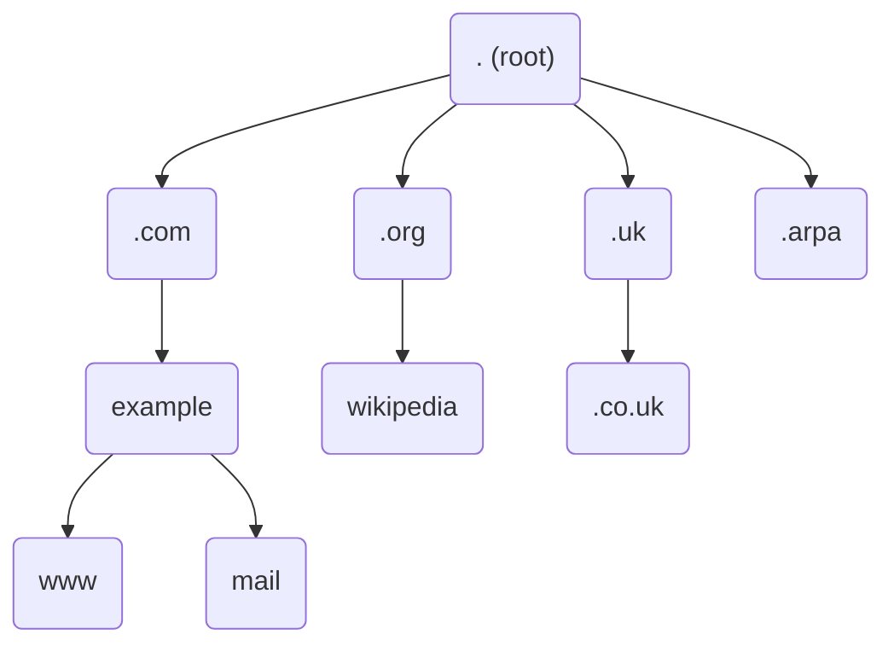
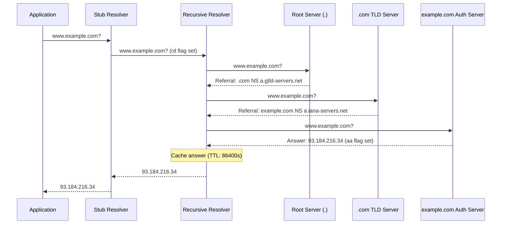
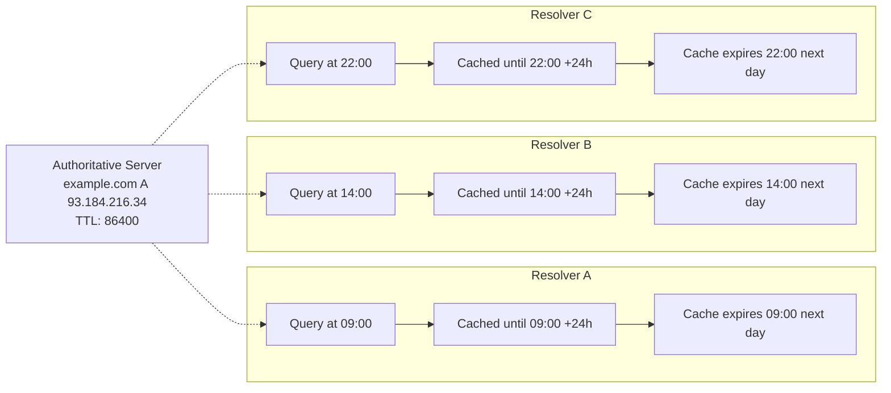
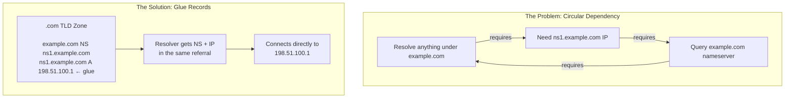

# DNS Fundamentals

This guide covers what DNS actually is, how it evolved from a single text file into the largest distributed database on Earth, and how every name resolution works from root servers down to the answer your browser needs.

---

## Before DNS: The HOSTS.TXT Era

Before DNS existed, the entire internet ran on a single text file.

Every machine on the ARPANET had a file called `HOSTS.TXT` that mapped hostnames to IP addresses - the same concept as `/etc/hosts` on your machine today. The Stanford Research Institute's Network Information Center (SRI-NIC) maintained the master copy. If you added a new host to the network, you called SRI-NIC on the phone (during California business hours), asked them to add your entry, and then every other site on the network would periodically FTP the updated file from SRI-NIC.

By the early 1980s this system was falling apart. The ARPANET was growing exponentially, and HOSTS.TXT had fundamental problems:

- **No scalability** - a single file can't track thousands of hosts
- **No delegation** - SRI-NIC had to approve every name
- **No consistency** - sites fetched updates at different times, so different machines had different views of the network
- **Name collisions** - nothing prevented two sites from claiming the same hostname

<figure class="photo-frame photo-right" style="max-width: 250px;">

<figcaption>
Paul Mockapetris, inventor of DNS, at a conference in Barcelona.
<span class="photo-credit">Photo: <a href="https://commons.wikimedia.org/wiki/File:Paul_Mockapetris.JPG">Jordiipa</a>, <a href="https://creativecommons.org/licenses/by-sa/3.0/">CC BY-SA 3.0</a></span>
</figcaption>
</figure>

In 1983, Paul Mockapetris at USC's Information Sciences Institute published [RFC 882](https://datatracker.ietf.org/doc/html/rfc882) and [RFC 883](https://datatracker.ietf.org/doc/html/rfc883), proposing a distributed, hierarchical naming system. His first implementation was called "Jeeves." Two years later, he refined the design into [RFC 1034](https://datatracker.ietf.org/doc/html/rfc1034) and [RFC 1035](https://datatracker.ietf.org/doc/html/rfc1035) - the specifications that still define DNS today.

---

## What DNS Actually Does

DNS is a **distributed hierarchical database** that maps names to data. Most people think of it as "the phone book of the internet" that converts domain names to IP addresses, but that undersells it significantly.

DNS handles:

- **Name-to-address mapping** - `example.com` to `93.184.216.34` (A records)
- **Mail routing** - which servers accept email for a domain (MX records)
- **Service discovery** - where to find SIP, LDAP, or XMPP servers (SRV records)
- **TLS certificate validation** - which certificate authorities can issue certs for a domain (CAA records)
- **Email authentication** - SPF, DKIM, and DMARC policies (TXT records)
- **Delegation** - which servers are authoritative for a zone (NS records)
- **Reverse lookups** - IP address to hostname (PTR records)

Every HTTPS connection, every email delivery, every API call starts with a DNS query. DNS processes an estimated 2 trillion queries per day worldwide. It's the most queried database in existence.

---

## The DNS Hierarchy

DNS organizes names into a tree structure, read from right to left. The name `www.example.com.` (note the trailing dot) breaks down like this:



### The Root Zone

At the top of the tree is the **root zone**, represented by a single dot (`.`). This is the starting point for every DNS resolution.

You'll often hear that there are "13 root servers," named `a.root-servers.net` through `m.root-servers.net`. That's technically true but deeply misleading. The number 13 is a legacy constraint - early DNS responses had to fit in a single 512-byte UDP packet, and 13 sets of A and AAAA records was the maximum that would fit.

In reality, those 13 identities are served by roughly **1,954 instances** deployed worldwide using **anycast** routing. Anycast means the same IP address is announced from multiple physical locations, and your query reaches whichever instance is closest in network terms. Verisign alone operates over 290 instances for `a.root-servers.net` and `j.root-servers.net`.

The root servers are operated by 12 independent organizations:

| Letter | Operator |
|--------|----------|
| A | Verisign |
| B | USC-ISI |
| C | Cogent Communications |
| D | University of Maryland |
| E | NASA Ames Research Center |
| F | Internet Systems Consortium (ISC) |
| G | U.S. Department of Defense (DISA) |
| H | U.S. Army Research Lab |
| I | Netnod (Sweden) |
| J | Verisign |
| K | RIPE NCC (Netherlands) |
| L | ICANN |
| M | WIDE Project (Japan) |

NASA and the U.S. Army Research Lab each operate a root server. The geographic and organizational diversity is deliberate - no single failure, attack, or political action can take down DNS.

### Top-Level Domains

Below the root are **top-level domains (TLDs)**. These fall into several categories:

**Generic TLDs (gTLDs)** - `.com`, `.net`, `.org`, `.info`, and since 2012, thousands of new gTLDs like `.app`, `.dev`, and `.io`.

**Country-code TLDs (ccTLDs)** - two-letter codes assigned by [ISO 3166](https://www.iso.org/iso-3166-country-codes.html): `.uk`, `.de`, `.jp`, `.au`. Some ccTLDs have taken on broader use - `.io` (British Indian Ocean Territory) became popular with tech companies, and `.tv` (Tuvalu) earns that country millions in licensing revenue.

Country-code TLDs occasionally outlive their countries. The `.su` TLD was assigned to the Soviet Union and is still active over 34 years after the USSR dissolved. Yugoslavia's `.yu` survived through multiple wars and name changes before finally being retired in 2010.

**Infrastructure TLD** - `.arpa` is used for reverse DNS lookups and other infrastructure purposes.

### Zones vs Domains

These terms are often confused, but the distinction matters when you're running DNS servers.

A **domain** is a name in the hierarchy. `example.com` is a domain. `mail.example.com` is a subdomain of `example.com`.

A **zone** is the portion of the DNS tree that a particular server is authoritative for. If `example.com` delegates `mail.example.com` to a different set of nameservers, then `example.com` and `mail.example.com` are two separate zones even though they're part of the same domain.

A zone always starts at a **delegation point** (where NS records hand authority to specific nameservers) and extends down the tree until it hits another delegation point.

---

## How DNS Resolution Works

When you type `www.example.com` into a browser, a chain of queries and responses happens in milliseconds. Understanding this process is essential for troubleshooting DNS issues.

### The Players

**Stub resolver** - the DNS client built into your operating system. When an application calls `getaddrinfo()` or similar functions, the stub resolver handles it. The stub resolver is simple - it sends a query to a configured recursive resolver and waits for the final answer. Check your configured resolver with:

```bash
# Linux
cat /etc/resolv.conf

# macOS
scutil --dns | head -20
```

**Recursive resolver** - the server that does the actual work of chasing down answers. Your ISP runs one, and public options include Google (`8.8.8.8`), Cloudflare (`1.1.1.1`), and Quad9 (`9.9.9.9`). When you point your machine at `8.8.8.8`, you're telling your stub resolver to use Google's recursive resolver.

**Authoritative nameserver** - a server that holds the actual DNS data for a zone and can answer queries about it without asking anyone else.

### The Resolution Process

Here's what happens when your recursive resolver needs to look up `www.example.com` and has nothing cached:



**Step 1 - Query the root.** The resolver picks a root server and asks: "What are the nameservers for `www.example.com`?" The root server doesn't know the final answer, but it knows who handles `.com`. It responds with a **referral** - the NS records and IP addresses for the `.com` TLD servers.

**Step 2 - Query the TLD.** The resolver asks a `.com` TLD server the same question. The TLD server doesn't know the final answer either, but it knows who handles `example.com`. It responds with another referral - the NS records for `example.com`'s authoritative nameservers.

**Step 3 - Query the authoritative server.** The resolver asks `example.com`'s nameserver for the A record for `www.example.com`. This server owns the data, so it responds with the answer: `93.184.216.34`.

**Step 4 - Return and cache.** The resolver sends the answer back to your stub resolver and caches it according to the response's TTL.

You can watch this entire process yourself with:

```bash
dig +trace www.example.com
```

```
; <<>> DiG 9.18.28 <<>> +trace www.example.com
;; global options: +cmd
.                       515195  IN      NS      a.root-servers.net.
.                       515195  IN      NS      b.root-servers.net.
;; [... other root servers ...]
;; Received 525 bytes from 127.0.0.1#53(127.0.0.1) in 0 ms

com.                    172800  IN      NS      a.gtld-servers.net.
com.                    172800  IN      NS      b.gtld-servers.net.
;; [... other .com servers ...]
;; Received 1170 bytes from 198.41.0.4#53(a.root-servers.net) in 24 ms

example.com.            172800  IN      NS      a.iana-servers.net.
example.com.            172800  IN      NS      b.iana-servers.net.
;; Received 326 bytes from 192.5.6.30#53(a.gtld-servers.net) in 12 ms

www.example.com.        86400   IN      A       93.184.216.34
;; Received 56 bytes from 199.43.135.53#53(a.iana-servers.net) in 88 ms
```

Each section shows a hop in the resolution chain. The IP addresses in the `from` field show you which server answered each step.

```quiz
question: "In what order does a recursive resolver look up a domain name like www.example.com?"
type: multiple-choice
options:
  - text: "Ask example.com nameserver → ask .com TLD → ask root server"
    feedback: "The resolution works top-down from the root, not bottom-up. The resolver starts at the root of the DNS hierarchy."
  - text: "Ask root server → ask .com TLD server → ask example.com authoritative server"
    correct: true
    feedback: "Correct! Resolution follows the hierarchy: root servers know where .com lives, .com TLD servers know where example.com lives, and example.com's authoritative server has the actual records."
  - text: "Ask the local /etc/hosts file → ask the ISP → ask Google DNS"
    feedback: "While /etc/hosts is checked first by the OS, the DNS resolution hierarchy is root → TLD → authoritative. ISP and Google DNS are recursive resolvers, not part of the delegation chain."
  - text: "Ask all DNS servers simultaneously and use the fastest response"
    feedback: "DNS resolution is sequential and hierarchical, not parallel. Each server in the chain refers the resolver to the next level down."
```

```terminal
title: Tracing DNS Resolution with dig +trace
steps:
  - command: "dig +trace www.example.com"
    output: |
      ; <<>> DiG 9.18.18 <<>> +trace www.example.com
      ;; global options: +cmd
      .                   86400   IN  NS  a.root-servers.net.
      .                   86400   IN  NS  b.root-servers.net.
      ;; Received 239 bytes from 127.0.0.53#53(127.0.0.53) in 1 ms

      com.                172800  IN  NS  a.gtld-servers.net.
      com.                172800  IN  NS  b.gtld-servers.net.
      ;; Received 892 bytes from 198.41.0.4#53(a.root-servers.net) in 24 ms

      example.com.        172800  IN  NS  a.iana-servers.net.
      example.com.        172800  IN  NS  b.iana-servers.net.
      ;; Received 266 bytes from 192.5.6.30#53(a.gtld-servers.net) in 32 ms

      www.example.com.    86400   IN  A   93.184.216.34
      ;; Received 56 bytes from 199.43.135.53#53(a.iana-servers.net) in 88 ms
    narration: "dig +trace performs iterative resolution from the root. Step 1: Root server (198.41.0.4) refers us to .com TLD servers. Step 2: .com TLD (192.5.6.30) refers us to example.com's nameservers. Step 3: Authoritative server (199.43.135.53) returns the final A record: 93.184.216.34."
```

```exercise
title: Trace DNS Resolution Manually
difficulty: beginner
scenario: |
  Use `dig` to manually trace the resolution of a domain name step by step.
  Pick any real domain (e.g., your company's website or a popular site).

  1. Query a root server for the TLD nameservers
  2. Query the TLD nameserver for the domain's authoritative nameservers
  3. Query the authoritative nameserver for the final A record
  4. Compare the result to a simple `dig domain.com` query
hints:
  - "Start with: dig NS com. @a.root-servers.net to find .com TLD servers"
  - "Then: dig NS example.com @a.gtld-servers.net to find the domain's nameservers"
  - "Finally: dig A www.example.com @a.iana-servers.net to get the IP"
  - "Use dig +trace domain.com to do all steps automatically and verify"
solution: |
  ```bash
  # Step 1: Ask root server for .com TLD nameservers
  dig NS com. @a.root-servers.net +norecurse

  # Step 2: Ask .com TLD for example.com's nameservers
  dig NS example.com @a.gtld-servers.net +norecurse

  # Step 3: Ask authoritative server for the A record
  dig A www.example.com @a.iana-servers.net

  # Verify with automatic trace
  dig +trace www.example.com

  # Compare with simple query (uses your local resolver)
  dig www.example.com
  ```

  The manual steps mirror exactly what a recursive resolver does automatically.
  Each server only knows about its own level of the hierarchy and refers you
  to the next level down.
```

### Caching and TTLs



Each resolver's TTL countdown starts independently from when it first queried. There is no synchronization between them - this is why "DNS propagation" is a myth. It's really **independent cache expiration**.

If your resolver had to chase every query from the root, DNS would be unbearably slow. **Caching** makes the system practical.

Every DNS response includes a **TTL (Time To Live)** - a number in seconds that tells the resolver how long to cache the answer. When you query for `example.com` and get a TTL of 86400, your resolver will serve that cached answer for the next 24 hours without asking anyone.

You can watch TTLs count down by querying the same name repeatedly:

```bash
dig example.com | grep -A1 "ANSWER SECTION"
```

```
;; ANSWER SECTION:
example.com.            86400   IN      A       93.184.216.34
```

Wait a few seconds and query again - the TTL will be lower. Your resolver is counting down until it expires and needs to ask again.

**There is no "DNS propagation."** This is one of the most misunderstood concepts in DNS. When you change a DNS record, there is no mechanism that pushes the change to resolvers around the world. What actually happens is **cache expiration** - resolvers everywhere are holding the old answer with a countdown timer. As each resolver's cache expires, it asks your authoritative server and gets the new answer.

This is why lowering your TTL *before* making a change is standard practice. If your TTL is 86400 (24 hours) and you change an A record, some resolvers may serve the old answer for up to 24 hours. If you lower the TTL to 300 (5 minutes) a day before the change, all caches will expire within 5 minutes after you make the switch.

### Negative Caching

Resolvers also cache **negative answers**. When a name doesn't exist, the authoritative server returns an NXDOMAIN response. The resolver caches this too, based on the SOA record's minimum TTL field (see the [Zone Files and Records](zone-files-and-records.md) guide). This prevents repeated queries for names that don't exist.

[RFC 2308](https://datatracker.ietf.org/doc/html/rfc2308) defines negative caching behavior. It's worth knowing this exists because it explains a common gotcha: if you query a name *before* you've created the record, the NXDOMAIN gets cached, and you may have to wait for that negative cache to expire before the new record is visible.

```quiz
question: "If a DNS record has a TTL of 3600, what does that mean?"
type: multiple-choice
options:
  - text: "The record expires and is deleted after 3600 queries"
    feedback: "TTL is time-based, not query-based. It's measured in seconds, not request count."
  - text: "Resolvers can cache the record for 3600 seconds (1 hour) before re-querying"
    correct: true
    feedback: "Correct! TTL (Time to Live) tells caching resolvers how long to store the answer. After 3600 seconds, they must query the authoritative server again. Lower TTLs mean faster propagation of changes but more DNS traffic."
  - text: "The record was created 3600 seconds ago"
    feedback: "TTL indicates how long the record can be cached, not when it was created. Each time a resolver fetches the record, the TTL countdown starts fresh."
  - text: "The maximum number of hops the DNS query can traverse"
    feedback: "That's the IP TTL concept (hop count). DNS TTL is about cache duration in seconds."
```

---

## Authoritative vs Recursive

These are two fundamentally different roles, and understanding the distinction prevents a whole category of configuration mistakes.

An **authoritative server** owns the data. It has the zone file (or database) for a domain and answers queries from that data. When it answers, it sets the `aa` (authoritative answer) flag in the response. If it's asked about a domain it doesn't own, it doesn't try to find the answer - it simply refuses or returns a referral.

A **recursive resolver** owns nothing. It receives queries from clients, chases referrals from root to TLD to authoritative, caches the results, and returns the final answer. It never sets the `aa` flag (unless it happens to also be authoritative for the queried zone).

You can see the difference with `dig`:

```bash
# Query an authoritative server directly - note the "aa" flag
dig @a.iana-servers.net example.com

;; flags: qr aa rd; QUERY: 1, ANSWER: 1

# Query a recursive resolver - no "aa" flag
dig @8.8.8.8 example.com

;; flags: qr rd ra; QUERY: 1, ANSWER: 1
```

The `aa` flag is present in the first response and absent in the second. `rd` means "recursion desired" (the client asked for recursion), and `ra` means "recursion available" (the server supports it).

### Why Not Both on the Same IP?

Running authoritative and recursive services on the same server at the same IP address creates problems:

- **Security** - a recursive resolver must accept queries from clients, but an authoritative server should accept queries from anyone. Combining them makes access control difficult.
- **Attack surface** - recursive resolvers are targets for DNS amplification attacks. If your authoritative server is also an open resolver, attackers can use it to amplify DDoS attacks against third parties.
- **Performance** - recursive resolution is CPU-intensive (chasing referrals, validating DNSSEC). Authoritative serving is I/O-bound (reading zone data). Mixing them causes unpredictable resource contention.

Many ISPs run resolvers that also happen to be authoritative for customer reverse DNS zones. That works because access is already restricted to their customers. But if you're building your own DNS infrastructure, keep them separate.

### Open Resolvers

An **open resolver** is a recursive server that accepts queries from anyone on the internet. This is dangerous because DNS responses are larger than queries - an attacker can send a small query with a spoofed source IP, and the resolver sends a large response to the victim. A typical DNS amplification attack achieves 50x amplification: a 1 Mbps query stream becomes 50 Mbps hitting the target.

ISPs routinely operate resolvers, but they restrict access to their own customers' IP ranges. If you run your own recursive resolver, restrict it to your network with ACLs.

Some ISPs also hijack NXDOMAIN responses. Instead of telling your browser that a domain doesn't exist, they redirect you to a search/advertising page. This violates DNS standards ([RFC 4924](https://datatracker.ietf.org/doc/html/rfc4924) Section 2.5.2.3) and breaks applications that rely on NXDOMAIN behavior. Public resolvers like `1.1.1.1` and `9.9.9.9` don't do this.

```quiz
question: "What is the difference between a recursive and an iterative DNS query?"
type: multiple-choice
options:
  - text: "Recursive queries are faster; iterative queries are more secure"
    feedback: "The difference isn't about speed or security, but about who does the work of following referrals."
  - text: "In a recursive query, the server does the full lookup; in an iterative query, it returns a referral"
    correct: true
    feedback: "Correct! A recursive resolver does all the work - it follows referrals from root to TLD to authoritative and returns the final answer. An iterative query just returns 'ask this other server instead' (a referral), making the client do the follow-up."
  - text: "Recursive queries use TCP; iterative queries use UDP"
    feedback: "Both can use either UDP or TCP. The protocol choice depends on response size and reliability needs, not the query type."
  - text: "Iterative queries repeat until they get an answer; recursive queries only try once"
    feedback: "It's roughly the opposite. The recursive server follows the chain. In iterative mode, the client receives referrals and must follow them itself."
```

---

## Registrars, Registries, and Glue Records

When you "buy" a domain name, you're interacting with a specific chain of organizations:

A **registry** operates a TLD. Verisign operates the `.com` registry. The registry maintains the authoritative database of all domain names in that TLD. You never interact with the registry directly.

A **registrar** is an organization accredited to sell domain names. GoDaddy, Namecheap, Cloudflare Registrar, and Google Domains (now Squarespace) are registrars. When you register a domain through a registrar, they submit the registration to the registry on your behalf using the Extensible Provisioning Protocol (EPP).

The **WHOIS** system (and its modern replacement, [**RDAP**](https://about.rdap.org/)) lets you look up registration information for a domain:

```bash
whois example.com
```

```
   Domain Name: EXAMPLE.COM
   Registry Domain ID: 2336799_DOMAIN_COM-VRSN
   Registrar WHOIS Server: whois.iana.org
   Updated Date: 2024-08-14T07:01:34Z
   Creation Date: 1995-08-14T04:00:00Z
   Registry Expiry Date: 2025-08-13T04:00:00Z
   Registrar: RESERVED-Internet Assigned Numbers Authority
   Name Server: A.IANA-SERVERS.NET
   Name Server: B.IANA-SERVERS.NET
   DNSSEC: signedDelegation
```

### The Trailing Dot

Every fully qualified domain name (FQDN) ends with a dot: `www.example.com.` - that final dot represents the root zone. Most software adds it implicitly, so you never type it. But inside DNS zone files, the trailing dot is critical. Without it, the name is treated as relative and the zone's origin is appended.

This creates one of the most common DNS bugs. In a zone file for `example.com`:

```
www     IN  CNAME   other.example.com     ; WRONG - becomes other.example.com.example.com.
www     IN  CNAME   other.example.com.    ; RIGHT - the dot makes it absolute
```

This distinction also matters in Kubernetes. A pod looking up `example.com` (without a trailing dot) may first try `example.com.mycluster.local`, `example.com.svc.cluster.local`, and other search domain suffixes before trying the actual name. Adding the trailing dot (`example.com.`) skips the search list and goes straight to the intended name.

### Glue Records

There's a chicken-and-egg problem in DNS. Suppose `example.com` uses `ns1.example.com` as its nameserver. To resolve *anything* under `example.com`, you need to reach `ns1.example.com`. But to find the IP address of `ns1.example.com`, you need to query... the nameserver for `example.com`. That's circular.

**Glue records** break this cycle. When `example.com` is registered, the parent zone (`.com`) stores not just the NS record (`example.com NS ns1.example.com`) but also an A record for the nameserver itself (`ns1.example.com A 198.51.100.1`). These A records in the parent zone are the "glue" that bootstraps the delegation.



Glue is only needed when a nameserver's name is *within* the zone it serves. If `example.com` uses `ns1.dnsprovider.net` as its nameserver, no glue is needed - the resolver can find `ns1.dnsprovider.net` by following the normal delegation chain through `.net`.

You can see glue records in the additional section of a DNS referral:

```bash
dig +norec @a.gtld-servers.net example.com NS
```

```
;; AUTHORITY SECTION:
example.com.        172800  IN  NS  a.iana-servers.net.
example.com.        172800  IN  NS  b.iana-servers.net.

;; ADDITIONAL SECTION:
a.iana-servers.net. 172800  IN  A   199.43.135.53
b.iana-servers.net. 172800  IN  A   199.43.133.53
```

The AUTHORITY section says "these are the nameservers." The ADDITIONAL section says "and here are their IP addresses so you don't have to look them up separately." That's glue.

---

## DNS Transport

DNS traditionally uses **UDP on port 53** for queries under 512 bytes and **TCP on port 53** for larger responses and zone transfers. The 512-byte UDP limit was a practical constraint from the 1980s when network reliability was poor and UDP was faster.

The **Extension Mechanisms for DNS ([EDNS0](https://datatracker.ietf.org/doc/html/rfc6891))** specification raised the effective UDP message size. Modern resolvers advertise a buffer size of 1232-4096 bytes, allowing larger responses (like DNSSEC-signed answers) to travel over UDP.

Newer transport protocols are emerging for privacy:

- **DNS over TLS (DoT)** - DNS queries encrypted with TLS on port 853
- **DNS over HTTPS (DoH)** - DNS queries sent as HTTPS requests on port 443, making them indistinguishable from normal web traffic
- **DNS over QUIC (DoQ)** - DNS queries over the QUIC protocol, offering TLS encryption with lower latency than DoT

These encrypted transports prevent ISPs and network operators from seeing (or tampering with) your DNS queries. They don't change how DNS *resolution* works - they just encrypt the transport between your stub resolver and the recursive resolver.

```quiz
question: "What problem does DNSSEC solve?"
type: multiple-choice
options:
  - text: "It encrypts DNS queries so ISPs can't see which domains you look up"
    feedback: "DNSSEC provides authentication, not encryption. DNS queries and responses are still visible. DNS-over-HTTPS (DoH) and DNS-over-TLS (DoT) provide encryption."
  - text: "It verifies that DNS responses haven't been tampered with (authenticity and integrity)"
    correct: true
    feedback: "Correct! DNSSEC uses digital signatures to prove that a DNS response came from the legitimate authoritative server and wasn't modified in transit. It prevents cache poisoning and man-in-the-middle attacks on DNS."
  - text: "It prevents DDoS attacks against DNS servers"
    feedback: "DNSSEC doesn't prevent DDoS. In fact, DNSSEC responses are larger (due to signatures), which can actually amplify DDoS. Its purpose is response authentication."
  - text: "It speeds up DNS resolution by using faster algorithms"
    feedback: "DNSSEC actually adds overhead (larger responses, signature verification). Its purpose is security (proving response authenticity), not performance."
```

---

## Further Reading

- [RFC 1034](https://datatracker.ietf.org/doc/html/rfc1034) - Domain Names: Concepts and Facilities
- [RFC 1035](https://datatracker.ietf.org/doc/html/rfc1035) - Domain Names: Implementation and Specification
- [RFC 9499](https://datatracker.ietf.org/doc/rfc9499/) - DNS Terminology (current, supersedes RFC 8499)
- [RFC 2308](https://datatracker.ietf.org/doc/html/rfc2308) - Negative Caching of DNS Queries
- [IANA Root Servers](https://www.iana.org/domains/root/servers) - official root server list
- [root-servers.org](https://root-servers.org/) - root server instance map and statistics
- [Cloudflare Learning Center: What is DNS?](https://www.cloudflare.com/learning/dns/what-is-dns/) - accessible overview with diagrams

---

**Next:** [Zone Files and Records](zone-files-and-records.md) | [Back to Index](README.md)
