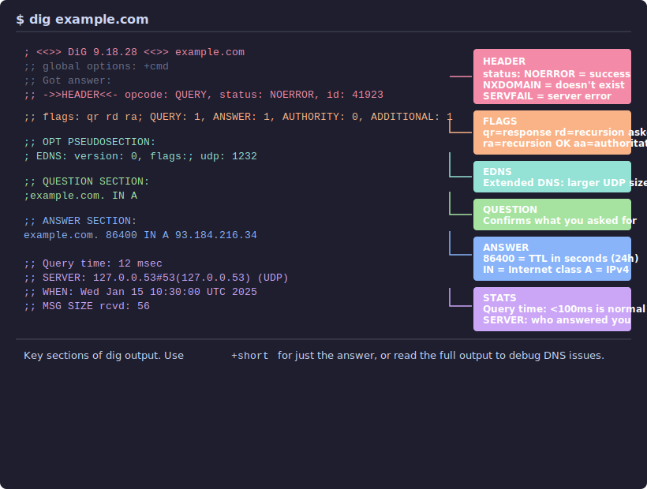

# DNS Tools and Troubleshooting

This guide covers the essential tools for querying, diagnosing, and debugging DNS. You'll learn to read `dig` output fluently, trace the full resolution path, and work through systematic troubleshooting playbooks for the most common DNS failures.

---

## dig: The Swiss Army Knife

[**`dig`**](https://www.isc.org/bind/) (Domain Information Groper) is the most powerful DNS query tool. It's part of the BIND package and available on virtually every system. If you learn one DNS tool well, make it `dig`.

### Basic Queries

```bash
dig example.com                  # query the default record type (A)
dig example.com AAAA             # query a specific record type
dig example.com MX               # mail exchange records
dig example.com ANY              # request all available record types
dig example.com +short           # just the answer, nothing else
```

### Reading Full Output

Most people use `+short` and miss the information that actually matters. The annotated diagram below shows each section of a full `dig` response:



Here's what a full `dig` response looks like:

```bash
dig example.com
```

```
; <<>> DiG 9.18.28 <<>> example.com
;; global options: +cmd
;; Got answer:
;; ->>HEADER<<- opcode: QUERY, status: NOERROR, id: 41923
;; flags: qr rd ra; QUERY: 1, ANSWER: 1, AUTHORITY: 0, ADDITIONAL: 1

;; OPT PSEUDOSECTION:
; EDNS: version: 0, flags:; udp: 1232
;; QUESTION SECTION:
;example.com.                   IN      A

;; ANSWER SECTION:
example.com.            86400   IN      A       93.184.216.34

;; Query time: 12 msec
;; SERVER: 127.0.0.53#53(127.0.0.53) (UDP)
;; WHEN: Wed Jan 15 10:30:00 UTC 2025
;; MSG SIZE  rcvd: 56
```

Breaking this down section by section:

**HEADER** - `status: NOERROR` means the query succeeded. Other values you'll see: `NXDOMAIN` (name doesn't exist), `SERVFAIL` (the server failed to process the query), `REFUSED` (the server refused to answer).

**Flags** - these single letters tell you what happened:
- `qr` - this is a response (query response)
- `rd` - recursion was requested (recursion desired)
- `ra` - the server supports recursion (recursion available)
- `aa` - this is an authoritative answer (the server owns the data)

The `aa` flag is one of the most important things to check. If you're querying your own authoritative server and `aa` is missing, something is wrong - the server doesn't think it's authoritative for that zone.

**QUESTION SECTION** - confirms what you asked.

**ANSWER SECTION** - the actual response. The number `86400` is the TTL in seconds (24 hours). `IN` means the Internet class. `A` is the record type. `93.184.216.34` is the data.

**Query time** - how long the query took. Under 100ms is normal. Over 1000ms suggests a problem.

**SERVER** - which resolver answered your query. Critical when troubleshooting - you need to know who you're asking.

### Querying Specific Servers

By default, `dig` queries whatever resolver your system is configured to use. You can query any server directly with `@`:

```bash
dig @8.8.8.8 example.com              # query Google's resolver
dig @1.1.1.1 example.com              # query Cloudflare's resolver
dig @ns1.example.com example.com      # query an authoritative server directly
```

Comparing results from different servers is a fundamental debugging technique. If your authoritative server has the right answer but `8.8.8.8` has the wrong one, the old answer is cached at Google and you need to wait for TTL expiration.

### Tracing Resolution

`+trace` replays the entire resolution process from root to answer:

```bash
dig +trace www.example.com
```

```
.                       507399  IN      NS      a.root-servers.net.
.                       507399  IN      NS      b.root-servers.net.
.                       507399  IN      NS      c.root-servers.net.
;; Received 525 bytes from 127.0.0.53#53(127.0.0.53) in 0 ms

com.                    172800  IN      NS      a.gtld-servers.net.
com.                    172800  IN      NS      b.gtld-servers.net.
;; Received 1170 bytes from 199.7.83.42#53(l.root-servers.net) in 20 ms

example.com.            172800  IN      NS      a.iana-servers.net.
example.com.            172800  IN      NS      b.iana-servers.net.
;; Received 326 bytes from 192.5.6.30#53(a.gtld-servers.net) in 16 ms

www.example.com.        86400   IN      A       93.184.216.34
;; Received 56 bytes from 199.43.135.53#53(a.iana-servers.net) in 88 ms
```

Each block is one hop in the resolution chain. The `from` line tells you which server responded and how long it took. `+trace` bypasses your local cache entirely, so you always see the current state of DNS - not what was cached hours ago.

Use `+trace` when you want to know whether the *authoritative* answer is correct, regardless of what your local resolver has cached.

### Other Useful dig Options

```bash
dig example.com +norecurse          # ask without requesting recursion (iterative query)
dig example.com +dnssec             # request DNSSEC records along with the answer
dig example.com +tcp                # force TCP instead of UDP
dig example.com +nsid               # request the server's identity (if supported)
dig -x 93.184.216.34                # reverse DNS lookup
dig example.com SOA +multiline      # SOA in readable format
dig @ns1.example.com example.com AXFR  # attempt a full zone transfer
```

The `-x` flag for reverse lookups is a shortcut. `dig -x 93.184.216.34` is equivalent to `dig 34.216.184.93.in-addr.arpa. PTR` - it reverses the octets and appends `.in-addr.arpa.` for you.

### Batch Mode

You can put multiple queries in a file and run them all at once:

```bash
# queries.txt
example.com A
example.com MX
example.com TXT

dig -f queries.txt +short
```

---

## drill and delv

### drill

[**`drill`**](https://nlnetlabs.nl/projects/ldns/about/) is a DNS query tool from NLnet Labs, built on the **ldns** library. It's functionally similar to `dig` with a slightly different output format.

```bash
drill example.com                   # basic query
drill -T example.com                # trace (like dig +trace)
drill -S example.com                # chase DNSSEC signatures
```

`drill` shines for DNSSEC debugging. `drill -S` (chase) follows the entire DNSSEC trust chain from the root, validating each link:

```bash
drill -S example.com
```

```
;; Number of trusted keys: 1
;; Chasing: example.com. A
;; DNSSEC Trust tree:
example.com. (A)
|---example.com. (DNSKEY keytag: 31406 alg: 13 flags: 256)
    |---example.com. (DS keytag: 31406 digest type: 2)
        |---com. (DNSKEY keytag: 19718 alg: 13 flags: 256)
            |---com. (DS keytag: 19718 digest type: 2)
                |---. (DNSKEY keytag: 20326 alg: 8 flags: 257)
;; Chase successful
```

### delv

**`delv`** (Domain Entity Lookup and Validation) is ISC's DNSSEC-aware debugging tool, included with BIND. Unlike `drill`, `delv` does full DNSSEC validation internally rather than relying on the resolver:

```bash
delv example.com
```

```
; fully validated
example.com.        86400   IN  A   93.184.216.34
example.com.        86400   IN  RRSIG   A 13 2 86400 ...
```

The key output is the first line: "fully validated" means the DNSSEC chain is intact. If validation fails, `delv` tells you exactly where:

```bash
delv @8.8.8.8 dnssec-failed.org
```

```
;; resolution failed: SERVFAIL
;; validating dnssec-failed.org/A: no valid signature found
```

Use `delv` when `dig` gives you a SERVFAIL and you suspect DNSSEC is the cause.

---

## host and nslookup

### host

**`host`** is the simplest DNS lookup tool. Good for quick checks:

```bash
host example.com                    # A record lookup
host -t MX example.com              # specific record type
host -t TXT example.com             # TXT records
host 93.184.216.34                  # reverse lookup
host -a example.com                 # all records (verbose)
```

`host` output is human-readable sentences rather than the structured format `dig` uses:

```
example.com has address 93.184.216.34
example.com has IPv6 address 2606:2800:21f:cb07:6820:80da:af6b:8b2c
example.com mail is handled by 0 .
```

### nslookup

**`nslookup`** is the oldest of these tools and has an interactive mode:

```bash
nslookup example.com                  # basic lookup
nslookup -type=MX example.com         # specific record type
nslookup example.com 8.8.8.8          # use a specific server
```

Interactive mode:

```bash
nslookup
> server 8.8.8.8
> set type=MX
> example.com
> exit
```

`nslookup` uses its own resolver logic rather than the system resolver, which can give different results than `dig`. For troubleshooting, prefer `dig` - it gives you more control and more information.

---

## whois

**`whois`** queries domain registration databases. It tells you who owns a domain, when it was registered, when it expires, and which nameservers it uses.

```bash
whois example.com
```

```
   Domain Name: EXAMPLE.COM
   Registrar: RESERVED-Internet Assigned Numbers Authority
   Creation Date: 1995-08-14T04:00:00Z
   Registry Expiry Date: 2025-08-13T04:00:00Z
   Name Server: A.IANA-SERVERS.NET
   Name Server: B.IANA-SERVERS.NET
   DNSSEC: signedDelegation
```

Key fields:

- **Registrar** - who the domain was registered through
- **Name Server** - the authoritative nameservers (this is what the TLD has on file)
- **Registry Expiry Date** - when the domain expires (expired domains stop resolving)
- **DNSSEC** - whether the domain has a signed delegation

**Domain status codes** tell you about the domain's state:

| Status | Meaning |
|--------|---------|
| `clientTransferProhibited` | Registrar has locked the domain against transfers |
| `serverTransferProhibited` | Registry has locked the domain |
| `clientDeleteProhibited` | Domain can't be deleted |
| `redemptionPeriod` | Domain has expired and is in a grace period |
| `pendingDelete` | Domain will be released soon |

[**RDAP**](https://about.rdap.org/) (Registration Data Access Protocol) is the modern replacement for WHOIS. It returns structured JSON instead of free-form text and supports authenticated access. Most registries now serve RDAP, and tools are catching up.

---

## Troubleshooting Playbook

### Domain Not Resolving

When a domain doesn't resolve, work through this systematically:

**Step 1 - Check what the error actually is:**

```bash
dig example.com
```

Look at `status:` in the header. `NXDOMAIN` means the name doesn't exist. `SERVFAIL` means the server couldn't process the query (often a DNSSEC issue). `REFUSED` means the server won't answer your query.

**Step 2 - Check if the domain is registered:**

```bash
whois example.com | grep -i "name server\|status\|expir"
```

If the domain has expired or has no nameservers listed, that's your problem.

**Step 3 - Query the authoritative server directly:**

```bash
# Find the authoritative nameservers
dig example.com NS +short

# Query one of them directly
dig @ns1.example.com example.com
```

If the authoritative server has the right answer, the problem is caching or connectivity between your resolver and the authoritative server.

**Step 4 - Trace the full resolution path:**

```bash
dig +trace example.com
```

Watch for where the chain breaks. If the root and TLD respond correctly but the authoritative server doesn't, the problem is at the authoritative server. If the TLD returns the wrong nameservers, the NS records at the registrar are wrong.

**Step 5 - Check from multiple resolvers:**

```bash
dig @8.8.8.8 example.com +short
dig @1.1.1.1 example.com +short
dig @9.9.9.9 example.com +short
```

If one resolver has the right answer and another doesn't, the wrong resolver has stale cached data.

### DNS Changes Not Showing Up

**Step 1 - Verify the change is on the authoritative server:**

```bash
dig @ns1.example.com example.com A +short
```

If the authoritative server doesn't have the new value, the zone file wasn't reloaded or the serial wasn't incremented.

**Step 2 - Check the TTL on the old cached answer:**

```bash
dig example.com A
```

The TTL in the response tells you how many seconds until the cache expires. If it says 3600, you'll wait up to an hour.

**Step 3 - Check if secondaries are in sync:**

```bash
dig @ns1.example.com example.com SOA +short
dig @ns2.example.com example.com SOA +short
```

If the serial numbers don't match, zone transfer hasn't happened. Check that the primary is notifying the secondary and that zone transfers are allowed.

### Email Going to Spam

Email deliverability issues are almost always DNS problems. Run this audit:

```bash
# Step 1: Check MX records
dig example.com MX +short
# Expected: priority and hostname for your mail server(s)

# Step 2: Check SPF
dig example.com TXT +short | grep spf
# Expected: "v=spf1 ..." listing your sending IPs/includes

# Step 3: Check DKIM
dig selector1._domainkey.example.com TXT +short
# Expected: "v=DKIM1; k=rsa; p=..." with the public key
# (replace "selector1" with your actual DKIM selector)

# Step 4: Check DMARC
dig _dmarc.example.com TXT +short
# Expected: "v=DMARC1; p=..." with your policy

# Step 5: Check reverse DNS on the sending IP
dig -x 198.51.100.10 +short
# Expected: hostname that matches or relates to your domain

# Step 6: Verify the PTR hostname resolves back
dig $(dig -x 198.51.100.10 +short) A +short
# Expected: should resolve back to 198.51.100.10 (forward-confirmed reverse DNS)
```

If any step returns empty or wrong results, that's where to focus.

### SERVFAIL Responses

SERVFAIL is the most frustrating DNS error because it tells you almost nothing. Common causes:

**DNSSEC validation failure** - the most common cause. Test by disabling validation:

```bash
dig example.com                    # SERVFAIL
dig +cd example.com                # bypass DNSSEC validation
```

If `+cd` (checking disabled) gives you an answer, the problem is DNSSEC. See the [DNSSEC](dnssec.md) guide for debugging.

**Authoritative server unreachable** - the recursive resolver can't reach any authoritative server for the zone:

```bash
dig +trace example.com
```

Watch for timeouts in the trace output.

**Broken delegation** - the TLD points to nameservers that don't actually serve the zone:

```bash
# What the TLD says
dig @a.gtld-servers.net example.com NS +short

# Test if those servers actually respond
dig @ns1.example.com example.com SOA
```

### Inconsistent Answers

When different resolvers return different answers:

```bash
dig @8.8.8.8 example.com +short
dig @1.1.1.1 example.com +short
dig @ns1.example.com example.com +short
```

If the authoritative answer is correct but resolvers disagree, it's a caching issue - each resolver cached at a different time. Wait for TTL expiration.

If authoritative servers disagree with each other, check zone transfer status:

```bash
dig @ns1.example.com example.com SOA +short
dig @ns2.example.com example.com SOA +short
```

Different serial numbers mean the secondary is out of sync.

---

## DNS as a Covert Channel

A security note: DNS can be used as a data exfiltration channel. Tools like [**`iodine`**](https://code.kryo.se/iodine/) tunnel IP traffic inside DNS queries, encoding data in subdomain labels. An exfiltration query might look like:

```
dGhpcyBpcyBzZWNyZXQ.tunnel.attacker.com
```

That base64-encoded subdomain carries data to the attacker's authoritative server for `tunnel.attacker.com`. This works even on heavily firewalled networks because DNS (port 53) is almost never blocked.

If you run a recursive resolver, watch for unusually long query names, high query volumes to a single domain, or queries with high-entropy labels. These are signatures of DNS tunneling.

---

## Further Reading

- [ISC BIND / dig](https://www.isc.org/bind/) - dig is distributed with BIND
- [ldns / drill](https://nlnetlabs.nl/projects/ldns/about/) - DNS library and drill tool from NLnet Labs
- [iodine](https://code.kryo.se/iodine/) - IP over DNS tunnel
- [DNSViz](https://dnsviz.net/) - DNSSEC visualization and analysis
- [RDAP](https://about.rdap.org/) - modern replacement for WHOIS
- [Cloudflare Learning Center: DNS Troubleshooting](https://www.cloudflare.com/learning/dns/dns-server-types/) - visual DNS explanations

---

**Previous:** [Zone Files and Records](zone-files-and-records.md) | **Next:** [BIND](bind.md) | [Back to Index](README.md)
