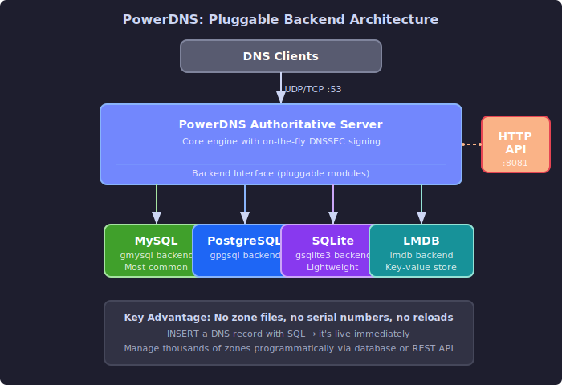

# PowerDNS

This guide covers PowerDNS - a DNS server that stores zone data in databases instead of flat files, and exposes a full HTTP API for automation. You'll learn to set up the authoritative server with MySQL and SQLite backends, manage zones through the API, and configure the recursor.

---

## What Makes PowerDNS Different

[**PowerDNS**](https://doc.powerdns.com/) takes a fundamentally different approach to DNS than BIND or NSD. Instead of reading zone files from disk, PowerDNS uses **backends** - pluggable modules that can read zone data from MySQL, PostgreSQL, SQLite, LDAP, plain files, or even custom scripts.



This makes PowerDNS the natural choice when DNS data needs to be managed programmatically. Hosting providers, cloud platforms, and any system where DNS records change frequently through automation benefit from the database-backed model. You can `INSERT` a DNS record with SQL and it's live immediately - no zone file editing, no serial incrementing, no reload.

PowerDNS effectively replaces MyDNS, a database-backed DNS server that was popular in the hosting industry but hasn't been maintained since 2008.

Like NLnet Labs' approach, PowerDNS separates authority from recursion into two distinct programs:

- **PowerDNS Authoritative Server** (`pdns`) - serves zone data from backends
- **PowerDNS Recursor** (`pdns-recursor`) - recursive resolution and caching

Key features:

- **Database backends** - MySQL, PostgreSQL, SQLite, LMDB, and more
- **HTTP API** - full RESTful API with OpenAPI/Swagger documentation for managing zones and records
- **Built-in DNSSEC** - sign zones with a single command
- **Lua scripting** - customize query processing in the recursor
- **Split-horizon** - PowerDNS 5.0 (2025) added views, one of its most requested features for years

```quiz
question: "What is the main advantage of PowerDNS's backend architecture?"
type: multiple-choice
options:
  - text: "It can only use flat files, making it simpler than BIND"
    feedback: "PowerDNS supports many backends, not just flat files. Its strength is the variety of data sources it can use."
  - text: "It can store DNS records in various databases (MySQL, PostgreSQL, LDAP, etc.) instead of zone files"
    correct: true
    feedback: "Correct! PowerDNS's backend system lets you store records in relational databases, LDAP directories, or any supported backend. This makes it ideal for environments with thousands of zones, dynamic records, or integration with existing infrastructure databases."
  - text: "Backends make PowerDNS faster than all other DNS servers"
    feedback: "Performance depends on the backend choice and configuration. A database backend adds query overhead compared to in-memory zone files. The advantage is flexibility, not raw speed."
  - text: "It eliminates the need for zone transfers between servers"
    feedback: "While database replication can replace zone transfers in some setups, backends don't eliminate transfers entirely. The primary advantage is flexible record storage."
```

---

## PowerDNS Authoritative Server

### Installation

**RHEL / AlmaLinux / Rocky:**

```bash
sudo dnf install pdns pdns-backend-mysql     # or pdns-backend-sqlite
sudo systemctl enable --now pdns
```

**Debian / Ubuntu:**

```bash
sudo apt install pdns-server pdns-backend-mysql    # or pdns-backend-sqlite3
sudo systemctl enable --now pdns
```

### MySQL Backend Setup

The MySQL (or MariaDB) backend is the most common choice for production deployments.

**Create the database and user:**

```sql
CREATE DATABASE powerdns CHARACTER SET utf8mb4;
CREATE USER 'pdns'@'localhost' IDENTIFIED BY 'your-secure-password';
GRANT ALL ON powerdns.* TO 'pdns'@'localhost';
```

**Import the schema:**

```bash
mysql -u root -p powerdns < /usr/share/doc/pdns-backend-mysql/schema.mysql.sql
```

The schema creates tables for domains, records, comments, cryptokeys (for DNSSEC), and domain metadata.

**Configure PowerDNS:**

```ini
# /etc/pdns/pdns.conf

# Backend
launch=gmysql
gmysql-host=127.0.0.1
gmysql-port=3306
gmysql-dbname=powerdns
gmysql-user=pdns
gmysql-password=your-secure-password
gmysql-dnssec=yes

# Network
local-address=0.0.0.0, ::
local-port=53

# General
daemon=yes
guardian=yes
setuid=pdns
setgid=pdns
```

### SQLite Backend

For smaller deployments or development, SQLite requires no separate database server:

```ini
# /etc/pdns/pdns.conf
launch=gsqlite3
gsqlite3-database=/var/lib/pdns/powerdns.sqlite3
gsqlite3-dnssec=yes
```

Initialize the database:

```bash
sqlite3 /var/lib/pdns/powerdns.sqlite3 < /usr/share/doc/pdns-backend-sqlite3/schema.sqlite3.sql
sudo chown pdns:pdns /var/lib/pdns/powerdns.sqlite3
```

### Managing Zones with pdnsutil

[**`pdnsutil`**](https://doc.powerdns.com/authoritative/manpages/pdnsutil.1.html) is the command-line tool for managing PowerDNS zones and records.

**Create a zone:**

```bash
pdnsutil create-zone example.com ns1.example.com
```

This creates the zone with a default SOA record.

**Add records:**

```bash
pdnsutil add-record example.com . A 3600 198.51.100.10
pdnsutil add-record example.com www A 3600 198.51.100.10
pdnsutil add-record example.com . MX 3600 "10 mail.example.com."
pdnsutil add-record example.com mail A 3600 198.51.100.20
pdnsutil add-record example.com . TXT 3600 '"v=spf1 ip4:198.51.100.0/24 -all"'
pdnsutil add-record example.com . NS 3600 ns1.example.com.
pdnsutil add-record example.com . NS 3600 ns2.example.com.
pdnsutil add-record example.com ns1 A 3600 198.51.100.1
pdnsutil add-record example.com ns2 A 3600 198.51.100.2
```

Note the `.` for the zone apex and the trailing dots on FQDNs in record data.

**List and check zones:**

```bash
pdnsutil list-all-zones
pdnsutil list-zone example.com
pdnsutil check-zone example.com
```

`pdnsutil list-zone` output:

```
example.com.    3600    IN      SOA     ns1.example.com. hostmaster.example.com. 2025011501 10800 3600 604800 3600
example.com.    3600    IN      NS      ns1.example.com.
example.com.    3600    IN      NS      ns2.example.com.
example.com.    3600    IN      A       198.51.100.10
example.com.    3600    IN      MX      10 mail.example.com.
example.com.    3600    IN      TXT     "v=spf1 ip4:198.51.100.0/24 -all"
www.example.com.        3600    IN      A       198.51.100.10
mail.example.com.       3600    IN      A       198.51.100.20
ns1.example.com.        3600    IN      A       198.51.100.1
ns2.example.com.        3600    IN      A       198.51.100.2
```

**Other useful commands:**

```bash
pdnsutil edit-zone example.com          # open zone in $EDITOR
pdnsutil delete-rrset example.com www A # delete specific records
pdnsutil replace-rrset example.com www A 3600 198.51.100.11  # replace records
pdnsutil increase-serial example.com    # manually bump the serial
pdnsutil check-all-zones                # validate all zones
```

```quiz
question: "What is pdnsutil primarily used for?"
type: multiple-choice
options:
  - text: "Starting and stopping the PowerDNS service"
    feedback: "Service management uses systemctl or the init system. pdnsutil manages zone data and DNSSEC operations."
  - text: "Managing zones, records, and DNSSEC operations from the command line"
    correct: true
    feedback: "Correct! pdnsutil is the command-line tool for PowerDNS zone administration: creating zones, adding/editing records, managing DNSSEC keys, checking zone correctness, and performing key rollovers. It works directly with the backend database."
  - text: "Monitoring DNS query traffic in real time"
    feedback: "Real-time monitoring uses pdns_control or the HTTP API statistics. pdnsutil is for zone and record management."
  - text: "Converting BIND zone files to PowerDNS format"
    feedback: "While PowerDNS can import BIND zones (zone2sql), pdnsutil's primary role is managing zones and DNSSEC operations directly."
```

```terminal
title: PowerDNS Zone Management with pdnsutil
steps:
  - command: "pdnsutil create-zone example.com ns1.example.com"
    output: "Creating empty zone 'example.com'"
    narration: "Create a new zone with ns1.example.com as the primary nameserver. This sets up the SOA and initial NS record."
  - command: "pdnsutil add-record example.com '' A 3600 203.0.113.10"
    output: "New rrset:\nexample.com. 3600 IN A 203.0.113.10"
    narration: "Add an A record at the zone apex (empty name = apex). The empty string '' means the record is for example.com itself."
  - command: "pdnsutil add-record example.com www A 3600 203.0.113.10"
    output: "New rrset:\nwww.example.com. 3600 IN A 203.0.113.10"
    narration: "Add an A record for www.example.com. pdnsutil automatically appends the zone name."
  - command: "pdnsutil add-record example.com '' MX 3600 '10 mail.example.com.'"
    output: "New rrset:\nexample.com. 3600 IN MX 10 mail.example.com."
    narration: "Add an MX record. The content includes the priority (10) and mail server. Note the trailing dot on the hostname."
  - command: "pdnsutil check-zone example.com"
    output: "Checked 4 records of 'example.com', 0 errors, 0 warnings."
    narration: "Always check your zone after changes. This validates record syntax, CNAME conflicts, missing glue records, and other common mistakes."
```

---

## The HTTP API

PowerDNS includes a built-in REST API that can do everything `pdnsutil` does and more. The API serves OpenAPI/Swagger documentation, making it easy to integrate with automation tools.

### Enabling the API

```ini
# /etc/pdns/pdns.conf
api=yes
api-key=your-api-key-here
webserver=yes
webserver-address=127.0.0.1
webserver-port=8081
webserver-allow-from=127.0.0.1,::1
```

Restart PowerDNS after enabling the API:

```bash
sudo systemctl restart pdns
```

### API Operations

**List all zones:**

```bash
curl -s -H "X-API-Key: your-api-key-here" \
    http://127.0.0.1:8081/api/v1/servers/localhost/zones | python3 -m json.tool
```

**Create a zone:**

```bash
curl -s -X POST -H "X-API-Key: your-api-key-here" \
    -H "Content-Type: application/json" \
    -d '{
        "name": "newdomain.com.",
        "kind": "Native",
        "nameservers": ["ns1.newdomain.com.", "ns2.newdomain.com."],
        "rrsets": [
            {
                "name": "newdomain.com.",
                "type": "A",
                "ttl": 3600,
                "records": [{"content": "198.51.100.50", "disabled": false}]
            }
        ]
    }' \
    http://127.0.0.1:8081/api/v1/servers/localhost/zones
```

**Add or update records (PATCH):**

```bash
curl -s -X PATCH -H "X-API-Key: your-api-key-here" \
    -H "Content-Type: application/json" \
    -d '{
        "rrsets": [
            {
                "name": "www.newdomain.com.",
                "type": "A",
                "ttl": 3600,
                "changetype": "REPLACE",
                "records": [
                    {"content": "198.51.100.50", "disabled": false},
                    {"content": "198.51.100.51", "disabled": false}
                ]
            }
        ]
    }' \
    http://127.0.0.1:8081/api/v1/servers/localhost/zones/newdomain.com.
```

`changetype` can be `REPLACE` (replace all records of that name and type) or `DELETE` (remove them).

**Query zone data:**

```bash
curl -s -H "X-API-Key: your-api-key-here" \
    http://127.0.0.1:8081/api/v1/servers/localhost/zones/newdomain.com. | python3 -m json.tool
```

**Delete a zone:**

```bash
curl -s -X DELETE -H "X-API-Key: your-api-key-here" \
    http://127.0.0.1:8081/api/v1/servers/localhost/zones/newdomain.com.
```

The API returns JSON for all operations, making it straightforward to integrate with configuration management tools, CI/CD pipelines, or custom provisioning systems.

```quiz
question: "What can you do with the PowerDNS HTTP API?"
type: multiple-choice
options:
  - text: "Only view zone information (read-only)"
    feedback: "The API supports full CRUD operations: create zones, add/modify/delete records, and query statistics."
  - text: "Create, modify, and delete zones and records programmatically"
    correct: true
    feedback: "Correct! The PowerDNS HTTP API enables full zone and record management via REST endpoints. You can create zones, add/modify/delete records, retrieve statistics, and integrate DNS management into automation pipelines - all without editing zone files or running CLI commands."
  - text: "Only manage DNSSEC keys"
    feedback: "DNSSEC key management is one capability, but the API covers all zone and record operations plus server statistics."
  - text: "Proxy DNS queries through HTTP"
    feedback: "The API manages the DNS server (zones, records, config), not DNS query traffic. DNS-over-HTTPS (DoH) proxies queries, but that's a different feature."
```

```command-builder
base: curl
description: Build a PowerDNS HTTP API request
options:
  - flag: "-X"
    type: select
    label: "Operation"
    explanation: "HTTP method for the API action"
    choices:
      - ["GET", "GET (read/list)"]
      - ["POST", "POST (create)"]
      - ["PATCH", "PATCH (modify records)"]
      - ["DELETE", "DELETE (remove)"]
  - flag: ""
    type: select
    label: "Endpoint"
    explanation: "API endpoint to target"
    choices:
      - ["http://localhost:8081/api/v1/servers/localhost/zones", "List all zones"]
      - ["http://localhost:8081/api/v1/servers/localhost/zones/example.com.", "Specific zone"]
      - ["http://localhost:8081/api/v1/servers/localhost/statistics", "Server statistics"]
  - flag: "-H"
    type: select
    label: "Authentication"
    explanation: "API key header for authentication"
    choices:
      - ["'X-API-Key: your-api-key'", "API key auth"]
  - flag: ""
    type: select
    label: "Data"
    explanation: "Request body for create/modify operations"
    choices:
      - ["", "No body (GET/DELETE)"]
      - ["-d '{\"rrsets\": [{\"name\": \"www.example.com.\", \"type\": \"A\", \"ttl\": 3600, \"changetype\": \"REPLACE\", \"records\": [{\"content\": \"203.0.113.10\", \"disabled\": false}]}]}'", "Update A record"]
```

---

## PowerDNS Recursor

The [**PowerDNS Recursor**](https://doc.powerdns.com/recursor/) is a separate binary (`pdns_recursor`) that handles recursive DNS resolution. It's independent from the authoritative server and can run alongside it or on a different machine.

### Installation

```bash
# RHEL
sudo dnf install pdns-recursor

# Debian/Ubuntu
sudo apt install pdns-recursor
```

### Basic Configuration

```ini
# /etc/pdns-recursor/recursor.conf

# Network
local-address=127.0.0.1, 192.168.1.1
local-port=53

# Access control
allow-from=127.0.0.0/8, 192.168.0.0/16, 10.0.0.0/8

# DNSSEC
dnssec=validate

# Performance
threads=2
max-cache-entries=500000

# Logging
quiet=yes
trace=no
```

### Forwarding to Local Authoritative Server

If you run the PowerDNS authoritative server on the same machine, forward your own zones to it:

```ini
# Forward your zones to the local authoritative server
forward-zones=example.com=127.0.0.1:5300, 100.51.198.in-addr.arpa=127.0.0.1:5300
```

### Lua Scripting

The recursor supports [Lua scripts](https://doc.powerdns.com/recursor/lua-scripting/index.html) for custom query processing. This is a powerful feature for implementing custom filtering, logging, or response modification:

```lua
-- /etc/pdns-recursor/filter.lua

function preresolve(dq)
    -- Block a specific domain
    if dq.qname:equal("blocked.example.com.") then
        dq.rcode = pdns.REFUSED
        return true
    end
    return false
end
```

Enable the script in `recursor.conf`:

```ini
lua-dns-script=/etc/pdns-recursor/filter.lua
```

---

## Primary/Secondary with PowerDNS

PowerDNS supports two replication modes:

### Native Replication

With **native** replication, both servers read from the same database (or a replicated database). Both are authoritative, and zone data is synchronized at the database level (MySQL replication, PostgreSQL streaming replication, etc.). No AXFR zone transfers are involved.

```ini
# Both servers
launch=gmysql
gmysql-host=db-primary.internal
```

Set the zone type to `Native`:

```bash
pdnsutil set-kind example.com native
```

This is the simplest approach when you already have database replication infrastructure.

### AXFR-Based Replication

For traditional zone transfer replication:

**Primary:**

```ini
# /etc/pdns/pdns.conf
allow-axfr-ips=203.0.113.2/32
also-notify=203.0.113.2
```

```bash
pdnsutil set-kind example.com primary
```

**Secondary:**

```ini
# /etc/pdns/pdns.conf
autosecondary=yes
```

Or configure each zone explicitly:

```bash
pdnsutil create-secondary-zone example.com 198.51.100.1
```

Check transfer status:

```bash
pdnsutil list-zone example.com
pdnsutil check-zone example.com
```

### Supermaster/Superslave

PowerDNS has a **supermaster** feature where a secondary automatically creates zone entries for any zone the primary notifies it about. This is useful when managing many zones - add a zone to the primary and the secondary picks it up automatically.

On the secondary, configure the primary as a supermaster:

```sql
INSERT INTO supermasters (ip, nameserver, account)
VALUES ('198.51.100.1', 'ns1.example.com', 'admin');
```

```ini
# Secondary pdns.conf
autosecondary=yes
```

---

## DNSSEC with PowerDNS

PowerDNS makes DNSSEC signing remarkably simple compared to managing it manually.

**Sign a zone:**

```bash
pdnsutil secure-zone example.com
```

That's it. PowerDNS generates the KSK and ZSK, signs all records, and serves DNSSEC responses. No key generation commands, no signing commands, no cron jobs.

**View DNSSEC status:**

```bash
pdnsutil show-zone example.com
```

```
Zone is actively secured
Zone has NSEC semantics
keys:
ID = 1 (CSK), flags = 257, tag = 31406, algo = 13 (ECDSAP256SHA256), bits = 256
Active   Published   ( CSK )
```

PowerDNS defaults to a single **Combined Signing Key (CSK)** using ECDSAP256SHA256 (algorithm 13), which is the current best practice for most zones.

**Get the DS record for your registrar:**

```bash
pdnsutil export-zone-ds example.com
```

```
example.com. IN DS 31406 13 2 abc123def456...
```

Submit this DS record to your registrar to complete the DNSSEC chain.

**Rectify zone data:**

```bash
pdnsutil rectify-zone example.com
```

Rectification ensures NSEC/NSEC3 chains and other DNSSEC metadata are consistent. Run this if you modify zone data directly in the database.

For a deeper dive into DNSSEC concepts and how the trust chain works, see the [DNSSEC](dnssec.md) guide.

---

## Further Reading

- [PowerDNS Authoritative Documentation](https://doc.powerdns.com/authoritative/) - official auth server docs
- [PowerDNS Recursor Documentation](https://doc.powerdns.com/recursor/) - official recursor docs
- [PowerDNS HTTP API Reference](https://doc.powerdns.com/authoritative/http-api/) - API endpoints and examples
- [PowerDNS GitHub](https://github.com/PowerDNS/pdns) - source code and issue tracker
- [PowerDNS DNSSEC Guide](https://doc.powerdns.com/authoritative/dnssec/intro.html) - DNSSEC-specific documentation

---

**Previous:** [NSD and Unbound](nsd-and-unbound.md) | **Next:** [DNSSEC](dnssec.md) | [Back to Index](README.md)
