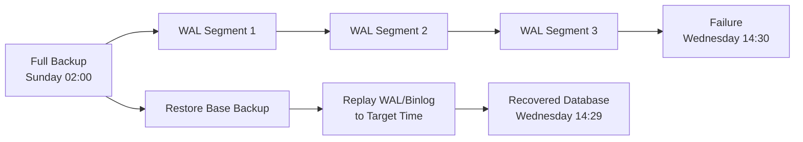

# Backup & Recovery Strategies

Your database is only as reliable as your ability to restore it. A backup you have never tested is not a backup - it is a hope. This guide covers the tools, techniques, and strategies for protecting MySQL and PostgreSQL data against every failure mode from accidental `DELETE` to total disk loss.

---

## Logical vs Physical Backups

<div class="diagram-container"></div>

Every backup method falls into one of two categories, and understanding the trade-offs determines which tools you reach for.

A **logical backup** exports data as SQL statements or delimited text. You get a portable, human-readable file that can be loaded into any compatible database version. The trade-off is speed - logical backups read every row through the SQL layer, and restoring means re-executing every `INSERT`. For a 500 GB database, that can take hours or days.

A **physical backup** copies the raw data files (tablespace files, WAL segments, redo logs) at the filesystem or storage level. These are fast to create and fast to restore because they skip the SQL layer entirely. The trade-off is portability - a physical backup is tied to the exact database version, architecture, and often the same configuration.

| Factor | Logical | Physical |
|--------|---------|----------|
| Speed (backup) | Slow - reads through SQL | Fast - copies raw files |
| Speed (restore) | Slow - re-executes SQL | Fast - copies files back |
| Size | Smaller (text, compresses well) | Larger (raw pages, internal fragmentation) |
| Portability | High - works across versions and platforms | Low - same version and architecture |
| Granularity | Per-table, per-database, or full | Usually full instance (some tools support incremental) |
| Consistency | Snapshot via transactions or locking | Requires coordination (flush, freeze, or hot backup tool) |
| PITR support | No (without binary log/WAL) | Yes (with log replay) |

When to use each:

- **Logical**: migrating between versions, exporting specific tables, small-to-medium databases, cross-platform transfers
- **Physical**: large databases where restore speed matters, disaster recovery, setting up replicas, when you need point-in-time recovery

Most production environments use both - nightly physical backups for fast disaster recovery, plus periodic logical backups for portability and schema versioning.

```quiz
question: "A 200 GB production MySQL database needs disaster recovery with a maximum 30-minute restore window. Which backup type is most appropriate?"
type: multiple-choice
options:
  - text: "Logical backup with mysqldump"
    feedback: "Restoring a 200 GB logical backup takes hours because every INSERT must be re-executed through the SQL layer. This would not meet a 30-minute restore window."
  - text: "Physical backup with Percona XtraBackup or filesystem snapshot"
    correct: true
    feedback: "Correct. Physical backups restore by copying raw data files back into place, which is dramatically faster than replaying SQL statements. For a 200 GB database, a physical restore can complete in minutes rather than hours."
  - text: "Logical backup with mydumper for parallel speed"
    feedback: "mydumper parallelizes the backup and restore process, but restoring 200 GB of SQL still takes far longer than copying raw files. Physical backup is the right choice for tight restore windows."
  - text: "No backup needed if replication is configured"
    feedback: "Replication is not a backup. A DROP TABLE or accidental DELETE replicates to all replicas instantly. You need independent backups regardless of replication topology."
```

---

## MySQL Backup Tools

### mysqldump

[**`mysqldump`**](https://dev.mysql.com/doc/refman/8.0/en/mysqldump.html) is the standard logical backup tool shipped with MySQL. It produces SQL output that recreates the schema and data.

A basic full backup:

```bash
mysqldump --single-transaction --routines --triggers --events \
  --all-databases > full_backup.sql
```

The flags that matter:

| Flag | Purpose |
|------|---------|
| `--single-transaction` | Takes a consistent snapshot using a transaction (InnoDB only, no table locks) |
| `--routines` | Includes stored procedures and functions |
| `--triggers` | Includes triggers (on by default in MySQL 5.7+, but be explicit) |
| `--events` | Includes scheduled events |
| `--all-databases` | Dumps every database |
| `--flush-logs` | Rotates binary logs after the dump, useful for PITR |
| `--source-data=2` | Records the binary log position as a comment (MySQL 8.0+, replaces `--master-data`) |
| `--set-gtid-purged=OFF` | Prevents GTID-related errors when restoring to a non-GTID server |

!!! warning "MyISAM and --single-transaction"
    `--single-transaction` only provides consistency for InnoDB tables. If your database contains MyISAM tables, you need `--lock-all-tables` instead, which blocks all writes during the dump. On modern MySQL, you should be using InnoDB for everything.

Restoring a `mysqldump` backup:

```bash
mysql < full_backup.sql
```

For large restores, disable checks to speed up the import:

```bash
mysql -e "SET GLOBAL innodb_flush_log_at_trx_commit=2; SET GLOBAL sync_binlog=0;"
mysql < full_backup.sql
mysql -e "SET GLOBAL innodb_flush_log_at_trx_commit=1; SET GLOBAL sync_binlog=1;"
```

```command-builder
base: mysqldump
description: Build a mysqldump command for MySQL logical backups
options:
  - flag: ""
    type: select
    label: "Scope"
    explanation: "What to back up"
    choices:
      - ["--all-databases", "All databases"]
      - ["--databases db1 db2", "Specific databases"]
      - ["dbname tablename", "Single table"]
  - flag: ""
    type: select
    label: "Consistency"
    explanation: "How to ensure a consistent snapshot"
    choices:
      - ["--single-transaction", "InnoDB snapshot (no locking)"]
      - ["--lock-all-tables", "Global read lock (MyISAM or mixed engines)"]
      - ["--lock-tables", "Per-table locks (default)"]
  - flag: ""
    type: select
    label: "Include objects"
    explanation: "Include stored routines, triggers, and events"
    choices:
      - ["--routines --triggers --events", "All objects (routines, triggers, events)"]
      - ["--routines --triggers", "Routines and triggers only"]
      - ["", "Data and schema only"]
  - flag: ""
    type: select
    label: "Binary log position"
    explanation: "Record the binary log position for PITR"
    choices:
      - ["", "Do not record position"]
      - ["--source-data=2", "Record as comment (MySQL 8.0+)"]
      - ["--flush-logs", "Rotate logs after dump"]
  - flag: ""
    type: select
    label: "Compression"
    explanation: "Compress the output"
    choices:
      - ["", "No compression (pipe to gzip separately)"]
      - ["--compress", "Compress data in transit (client-server)"]
```

### mydumper and myloader

[**`mydumper`**](https://github.com/mydumper/mydumper) is a third-party tool that parallelizes logical backups. Where `mysqldump` uses a single thread, `mydumper` can dump multiple tables simultaneously and splits large tables into chunks. The companion tool `myloader` restores in parallel.

```bash
# Parallel backup with 4 threads
mydumper --threads 4 --compress --outputdir /backup/mysql/daily

# Parallel restore
myloader --threads 4 --directory /backup/mysql/daily
```

For a 100 GB database, `mydumper`/`myloader` can be 4-8x faster than `mysqldump`/`mysql` depending on hardware and table count.

### mysqlpump

[**`mysqlpump`**](https://dev.mysql.com/doc/refman/8.0/en/mysqlpump.html) is MySQL's built-in parallel dump tool (introduced in 5.7). It supports parallel processing and progress reporting but has seen less adoption than `mydumper` and was deprecated in MySQL 8.0.3 in favor of MySQL Shell's dump utilities.

```bash
mysqlpump --default-parallelism=4 --all-databases > backup.sql
```

---

## PostgreSQL Backup Tools

### pg_dump

[**`pg_dump`**](https://www.postgresql.org/docs/current/app-pgdump.html) is the standard logical backup tool for PostgreSQL. Unlike `mysqldump`, it supports multiple output formats.

| Format | Flag | Description |
|--------|------|-------------|
| Plain SQL | `-Fp` | SQL text output (default), restored with `psql` |
| Custom | `-Fc` | Compressed, supports selective restore, restored with `pg_restore` |
| Directory | `-Fd` | One file per table, supports parallel dump and restore |
| Tar | `-Ft` | Tar archive, restored with `pg_restore` |

The **custom format** (`-Fc`) is the best default choice - it compresses automatically, supports selective table restore, and allows parallel restore with `pg_restore -j`.

```bash
# Custom format (recommended)
pg_dump -Fc mydb > mydb.dump

# Directory format with parallel dump (4 jobs)
pg_dump -Fd -j 4 mydb -f /backup/mydb_dir

# Plain SQL (human-readable)
pg_dump -Fp mydb > mydb.sql
```

Restoring:

```bash
# From custom or tar format
pg_restore -d mydb mydb.dump

# Parallel restore (4 jobs, custom or directory format only)
pg_restore -d mydb -j 4 mydb.dump

# From plain SQL
psql -d mydb -f mydb.sql

# Restore specific tables only
pg_restore -d mydb -t orders -t customers mydb.dump
```

### pg_dumpall

[**`pg_dumpall`**](https://www.postgresql.org/docs/current/app-pg-dumpall.html) dumps the entire cluster including **roles**, **tablespaces**, and other global objects that `pg_dump` does not capture.

```bash
# Full cluster dump (roles + all databases)
pg_dumpall > cluster_backup.sql

# Globals only (roles and tablespaces, no data)
pg_dumpall --globals-only > globals.sql
```

A common pattern is to use `pg_dumpall --globals-only` for roles and `pg_dump -Fc` per database for data. This gives you the flexibility of custom format for data while still capturing global objects.

### pg_basebackup

[**`pg_basebackup`**](https://www.postgresql.org/docs/current/app-pgbasebackup.html) creates a **physical backup** by streaming a copy of the entire PostgreSQL data directory. This is the foundation for setting up streaming replicas and for physical backup strategies.

```bash
# Stream a physical backup to a directory
pg_basebackup -D /backup/pg_base -Fp -Xs -P -R

# Create a compressed tar backup
pg_basebackup -D /backup/pg_base -Ft -Xf -z
```

| Flag | Purpose |
|------|---------|
| `-D` | Destination directory |
| `-Fp` | Plain format (data directory copy) |
| `-Ft` | Tar format |
| `-Xs` | Stream WAL during backup (recommended) |
| `-Xf` | Fetch WAL after backup completes |
| `-z` | Compress output (tar format only) |
| `-P` | Show progress |
| `-R` | Write `standby.signal` and connection settings for replica setup |

```quiz
question: "What is the advantage of pg_dump -Fc (custom format) over pg_dump -Fp (plain SQL)?"
type: multiple-choice
options:
  - text: "Custom format is human-readable while plain SQL is not"
    feedback: "It is the opposite. Plain SQL (-Fp) is human-readable text. Custom format (-Fc) is a compressed binary format that requires pg_restore to read."
  - text: "Custom format supports automatic compression, selective restore of individual tables, and parallel restore"
    correct: true
    feedback: "Correct. Custom format compresses by default, allows pg_restore to extract specific tables with -t, and supports parallel restore with -j. Plain SQL must be replayed sequentially with psql and cannot selectively restore individual objects."
  - text: "Custom format is the only format that captures roles and tablespaces"
    feedback: "No format of pg_dump captures roles or tablespaces. Those are cluster-level objects that require pg_dumpall --globals-only."
  - text: "Custom format creates a physical backup while plain SQL creates a logical backup"
    feedback: "Both are logical backups. pg_dump always exports data through the SQL layer regardless of format. Physical backups require pg_basebackup."
```

```terminal
title: MySQL and PostgreSQL Logical Backup Workflow
steps:
  - command: "mysqldump --single-transaction --routines --triggers --events --all-databases > /backup/mysql_full_$(date +%Y%m%d).sql"
    output: |
      -- MySQL dump 10.13  Distrib 8.0.36
    narration: "Run a full MySQL logical backup with --single-transaction for InnoDB consistency. The --routines, --triggers, and --events flags capture stored procedures, triggers, and scheduled events that are easy to forget."
  - command: "ls -lh /backup/mysql_full_*.sql"
    output: |
      -rw-r--r-- 1 root root 2.4G Feb 19 02:00 /backup/mysql_full_20260219.sql
    narration: "A 2.4 GB SQL file for this database. Compressing with gzip typically reduces this by 80-90%."
  - command: "gzip /backup/mysql_full_20260219.sql && ls -lh /backup/mysql_full_*.sql.gz"
    output: |
      -rw-r--r-- 1 root root 312M Feb 19 02:03 /backup/mysql_full_20260219.sql.gz
    narration: "Compressed from 2.4 GB to 312 MB. Always compress backups to save storage and transfer time."
  - command: "pg_dump -Fc -d myapp > /backup/pg_myapp_$(date +%Y%m%d).dump"
    output: ""
    narration: "PostgreSQL backup using custom format (-Fc). This format compresses automatically and supports selective restore with pg_restore."
  - command: "pg_dumpall --globals-only > /backup/pg_globals_$(date +%Y%m%d).sql"
    output: ""
    narration: "Separately dump roles and tablespace definitions. pg_dump does not capture these cluster-level objects, so you need pg_dumpall --globals-only alongside your per-database dumps."
  - command: "pg_restore --list /backup/pg_myapp_20260219.dump | head -10"
    output: |
      ;
      ; Archive created at 2026-02-19 02:05:00 UTC
      ;     dbname: myapp
      ;     TOC Entries: 142
      ;     Compression: -1
      ;     Dump Version: 1.14-0
      ;     Format: CUSTOM
      ;     Integer: 4 bytes
      ;     Offset: 8 bytes
      ;     Dumped from database version: 16.2
    narration: "Use pg_restore --list to inspect a custom format backup without restoring it. This shows metadata and a table of contents listing every object in the backup."
```

---

## Percona XtraBackup

[**Percona XtraBackup**](https://docs.percona.com/percona-xtrabackup/8.0/) creates **hot physical backups** of InnoDB without locking tables or interrupting transactions. It copies the InnoDB data files while tracking the redo log to capture changes made during the copy. This makes it the standard tool for MySQL physical backups in production.

### Full Backup

```bash
# Create a full backup
xtrabackup --backup --target-dir=/backup/base

# Prepare the backup (apply redo log for consistency)
xtrabackup --prepare --target-dir=/backup/base

# Restore (MySQL must be stopped)
systemctl stop mysql
rm -rf /var/lib/mysql/*
xtrabackup --copy-back --target-dir=/backup/base
chown -R mysql:mysql /var/lib/mysql
systemctl start mysql
```

The **prepare** step is critical. A raw XtraBackup is not consistent - it contains data files from different points in time plus redo log entries. The prepare step replays the redo log to bring all data files to a consistent state, just like InnoDB crash recovery.

### Incremental Backups

XtraBackup supports **incremental backups** that only copy pages changed since the last backup. This dramatically reduces backup time and storage for large databases.

```bash
# Full base backup (Sunday)
xtrabackup --backup --target-dir=/backup/base

# Incremental backup (Monday) - only changed pages
xtrabackup --backup --target-dir=/backup/inc1 \
  --incremental-basedir=/backup/base

# Incremental backup (Tuesday)
xtrabackup --backup --target-dir=/backup/inc2 \
  --incremental-basedir=/backup/inc1
```

Restoring an incremental chain requires preparing each increment in order:

```bash
# Prepare base (with --apply-log-only to preserve uncommitted transactions)
xtrabackup --prepare --apply-log-only --target-dir=/backup/base

# Apply incremental backups in order
xtrabackup --prepare --apply-log-only --target-dir=/backup/base \
  --incremental-dir=/backup/inc1

xtrabackup --prepare --apply-log-only --target-dir=/backup/base \
  --incremental-dir=/backup/inc2

# Final prepare (without --apply-log-only)
xtrabackup --prepare --target-dir=/backup/base

# Restore
systemctl stop mysql
rm -rf /var/lib/mysql/*
xtrabackup --copy-back --target-dir=/backup/base
chown -R mysql:mysql /var/lib/mysql
systemctl start mysql
```

!!! tip "The --apply-log-only flag"
    Use `--apply-log-only` during intermediate prepare steps. Without it, XtraBackup rolls back uncommitted transactions, which makes subsequent incremental applies fail. Only omit `--apply-log-only` on the final prepare step.

---

## Point-in-Time Recovery (PITR)

Backups give you a snapshot. **Point-in-time recovery** fills the gap between the snapshot and the moment of failure (or the moment before an accidental change). PITR replays transaction logs from the backup's position forward to a specific timestamp or log position.



### MySQL: Binary Log Replay

MySQL's **binary log** records every data-modifying statement or row change. PITR replays these logs with [**`mysqlbinlog`**](https://dev.mysql.com/doc/refman/8.0/en/mysqlbinlog.html).

**Step 1**: Restore from the most recent full backup.

```bash
mysql < /backup/mysql_full_20260218.sql
```

**Step 2**: Identify the binary logs created after the backup.

```bash
ls -la /var/lib/mysql/binlog.*
```

**Step 3**: Replay binary logs up to the target time (just before the accidental operation).

```bash
mysqlbinlog --stop-datetime="2026-02-19 14:30:00" \
  /var/lib/mysql/binlog.000042 \
  /var/lib/mysql/binlog.000043 | mysql
```

To skip a specific bad transaction, use `--start-position` and `--stop-position` to replay around it:

```bash
# Replay everything up to the bad statement
mysqlbinlog --stop-position=12345 /var/lib/mysql/binlog.000042 | mysql

# Skip the bad statement and continue from after it
mysqlbinlog --start-position=12400 /var/lib/mysql/binlog.000042 | mysql
```

!!! danger "Binary logging must be enabled BEFORE disaster"
    PITR only works if `log_bin` is enabled and binary logs exist from the backup point forward. Verify with `SHOW VARIABLES LIKE 'log_bin'`. If binary logging was not enabled, you can only restore to the backup snapshot - everything after it is lost.

### PostgreSQL: WAL Archiving and Recovery

PostgreSQL's equivalent is **Write-Ahead Log (WAL) archiving**. Every change is written to WAL segments before it reaches the data files. By archiving these segments, you can replay them to recover to any point in time.

**Step 1**: Configure WAL archiving in `postgresql.conf`:

```ini
wal_level = replica
archive_mode = on
archive_command = 'cp %p /backup/wal_archive/%f'
```

**Step 2**: Take a base backup:

```bash
pg_basebackup -D /backup/pg_base -Fp -Xs -P
```

**Step 3**: When recovery is needed, copy the base backup into position and configure recovery:

```bash
# Stop PostgreSQL
systemctl stop postgresql

# Replace the data directory with the backup
rm -rf /var/lib/postgresql/16/main
cp -a /backup/pg_base /var/lib/postgresql/16/main

# Configure recovery target
cat >> /var/lib/postgresql/16/main/postgresql.auto.conf <<EOF
restore_command = 'cp /backup/wal_archive/%f %p'
recovery_target_time = '2026-02-19 14:30:00'
EOF

# Create the recovery signal file
touch /var/lib/postgresql/16/main/recovery.signal

# Start PostgreSQL - it will replay WAL to the target time
chown -R postgres:postgres /var/lib/postgresql/16/main
systemctl start postgresql
```

PostgreSQL replays archived WAL segments using `restore_command` until it reaches `recovery_target_time`, then pauses. You verify the data and promote to normal operation:

```sql
SELECT pg_wal_replay_resume();
```

```terminal
title: Point-in-Time Recovery with MySQL Binary Logs
steps:
  - command: "mysql -e \"SHOW BINARY LOGS\" | tail -5"
    output: |
      binlog.000041  1073742056  No
      binlog.000042   536871234  No
      binlog.000043   268435712  No
      binlog.000044    12345678  No
      binlog.000045     4567890  No
    narration: "First, check which binary logs are available. You need logs that cover the period from your last backup to the target recovery point. The size column shows bytes written to each log."
  - command: "mysqlbinlog --start-datetime='2026-02-19 14:00:00' --stop-datetime='2026-02-19 14:35:00' /var/lib/mysql/binlog.000044 | grep -i 'drop\\|delete\\|truncate' | head -5"
    output: |
      # at 9876543
      #260219 14:32:15 server id 1  end_log_pos 9876610  Query   thread_id=42  exec_time=0  error_code=0
      DROP TABLE orders
    narration: "Search the binary logs to find the exact position of the accidental statement. Here a DROP TABLE happened at position 9876543 in binlog.000044 at 14:32:15."
  - command: "mysql < /backup/mysql_full_20260219.sql"
    output: ""
    narration: "Restore the most recent full backup. This brings the database to the state at backup time. Everything after that point needs to be replayed from binary logs."
  - command: "mysqlbinlog /var/lib/mysql/binlog.000042 /var/lib/mysql/binlog.000043 /var/lib/mysql/binlog.000044 --stop-position=9876543 | mysql"
    output: ""
    narration: "Replay all binary logs from after the backup up to (but not including) the accidental DROP TABLE at position 9876543. This recovers the database to exactly one transaction before the disaster."
  - command: "mysql -e 'SELECT COUNT(*) AS order_count FROM orders' mydb"
    output: |
      +-------------+
      | order_count |
      +-------------+
      |       48721 |
      +-------------+
    narration: "Verify the orders table exists and contains data. The recovery successfully restored the database to the state just before the accidental DROP TABLE."
```

```quiz
question: "You restored a MySQL backup taken at midnight and need to recover to 14:30. Binary logs binlog.000042 through binlog.000045 exist. What is the correct mysqlbinlog command?"
type: multiple-choice
options:
  - text: "mysqlbinlog --stop-datetime='14:30:00' binlog.000045 | mysql"
    feedback: "This only replays binlog.000045 and misses all changes recorded in binlog.000042 through binlog.000044. You must replay all logs in sequence from the backup point forward."
  - text: "mysqlbinlog --stop-datetime='2026-02-19 14:30:00' binlog.000042 binlog.000043 binlog.000044 binlog.000045 | mysql"
    correct: true
    feedback: "Correct. List all binary logs in order from the backup point forward. mysqlbinlog concatenates them and --stop-datetime halts replay at the target time across all logs. Use the full datetime format including the date."
  - text: "mysqlbinlog --start-datetime='00:00:00' --stop-datetime='14:30:00' binlog.000042 | mysql"
    feedback: "This only processes one log file and misses changes in subsequent logs. You need all binary logs from the backup point through the recovery target."
  - text: "mysqlbinlog binlog.000042 binlog.000043 binlog.000044 binlog.000045 | mysql"
    feedback: "Without --stop-datetime, this replays everything including the event you are trying to recover from. You must specify where to stop."
```

---

## Backup Verification

A backup that has never been restored is an untested assumption. Schedule regular verification to ensure your backups actually work.

### Restore to a Test Instance

The most reliable verification is a full restore to a separate server or container:

```bash
# MySQL: restore to a test instance
mysql -h test-db-host < /backup/mysql_full_20260219.sql
mysql -h test-db-host -e "SELECT COUNT(*) FROM mydb.orders"

# PostgreSQL: restore to a test database
createdb -h test-db-host mydb_test
pg_restore -d mydb_test -h test-db-host /backup/pg_myapp_20260219.dump
psql -h test-db-host -d mydb_test -c "SELECT COUNT(*) FROM orders"
```

### Checksum Validation

Verify backup file integrity before and after transfer:

```bash
# Generate checksums at backup time
sha256sum /backup/mysql_full_20260219.sql.gz > /backup/mysql_full_20260219.sha256

# Verify after transfer to offsite storage
sha256sum -c /backup/mysql_full_20260219.sha256
```

For XtraBackup, the `--prepare` step itself validates consistency. If prepare succeeds, the backup is restorable.

### Automated Verification Script

```bash
#!/bin/bash
# verify_backup.sh - restore and validate the latest backup

BACKUP_FILE=$(ls -t /backup/mysql_full_*.sql.gz | head -1)
TEST_DB="backup_verify_$(date +%Y%m%d)"

# Create test database and restore
mysql -e "CREATE DATABASE ${TEST_DB}"
zcat "${BACKUP_FILE}" | mysql "${TEST_DB}"

# Run validation queries
TABLES=$(mysql -NBe "SELECT COUNT(*) FROM information_schema.tables WHERE table_schema='${TEST_DB}'")
ROWS=$(mysql -NBe "SELECT SUM(table_rows) FROM information_schema.tables WHERE table_schema='${TEST_DB}'")

echo "Backup: ${BACKUP_FILE}"
echo "Tables: ${TABLES}"
echo "Total rows: ${ROWS}"

# Compare against expected minimums
if [ "${TABLES}" -lt 10 ]; then
  echo "ALERT: Table count below threshold" >&2
  exit 1
fi

# Cleanup
mysql -e "DROP DATABASE ${TEST_DB}"
echo "Verification passed"
```

!!! tip "Automate verification weekly"
    Run backup verification on a schedule, not just when you suspect a problem. A cron job that restores to a test instance and checks row counts catches silent backup failures before they become disasters.

---

## Scheduling and Rotation

### Cron-Based Backup Scripts

A production backup script handles compression, logging, error reporting, and cleanup:

```bash
#!/bin/bash
# mysql_backup.sh - daily MySQL backup with rotation

set -euo pipefail

BACKUP_DIR="/backup/mysql"
DATE=$(date +%Y%m%d_%H%M%S)
LOG_FILE="${BACKUP_DIR}/backup_${DATE}.log"
RETENTION_DAYS=30

exec > >(tee -a "${LOG_FILE}") 2>&1
echo "Backup started: $(date)"

# Full logical backup
mysqldump --single-transaction --routines --triggers --events \
  --all-databases | gzip > "${BACKUP_DIR}/full_${DATE}.sql.gz"

# Generate checksum
sha256sum "${BACKUP_DIR}/full_${DATE}.sql.gz" > "${BACKUP_DIR}/full_${DATE}.sha256"

# Remove backups older than retention period
find "${BACKUP_DIR}" -name "full_*.sql.gz" -mtime +${RETENTION_DAYS} -delete
find "${BACKUP_DIR}" -name "full_*.sha256" -mtime +${RETENTION_DAYS} -delete
find "${BACKUP_DIR}" -name "backup_*.log" -mtime +${RETENTION_DAYS} -delete

echo "Backup completed: $(date)"
echo "Size: $(du -h "${BACKUP_DIR}/full_${DATE}.sql.gz" | cut -f1)"
```

Schedule with cron:

```bash
# Daily at 2:00 AM
0 2 * * * /usr/local/bin/mysql_backup.sh

# Weekly XtraBackup full + daily incrementals
0 3 * * 0 /usr/local/bin/xtrabackup_full.sh
0 3 * * 1-6 /usr/local/bin/xtrabackup_incremental.sh
```

### Grandfather-Father-Son Rotation

The **GFS rotation** strategy balances retention depth with storage costs:

| Level | Frequency | Retention | Purpose |
|-------|-----------|-----------|---------|
| **Son** (daily) | Every day | 7-14 days | Recent recovery, accidental changes |
| **Father** (weekly) | Every Sunday | 4-5 weeks | Weekly recovery points |
| **Grandfather** (monthly) | First of month | 12 months | Monthly recovery, compliance |
| **Yearly** | January 1 | 3-7 years | Regulatory, legal holds |

A 500 GB database with GFS rotation:

- 14 daily backups: 14 x 500 GB = 7 TB (or ~700 GB compressed)
- 4 weekly: 4 x 500 GB = 2 TB (or ~200 GB compressed)
- 12 monthly: 12 x 500 GB = 6 TB (or ~600 GB compressed)
- Total: ~1.5 TB compressed storage for a full year of recovery points

---

## Cloud and Snapshot Backups

### Filesystem Snapshots

**Filesystem snapshots** (LVM, ZFS, EBS) create near-instant point-in-time copies of the underlying storage. They are the fastest backup method because they operate below the filesystem level.

!!! tip "See also"
    Filesystem-level backups often use LVM snapshots. For LVM concepts, snapshot creation, and filesystem management, see [Disk and Filesystem](../Linux Essentials/disk-and-filesystem.md).

**LVM snapshots**:

```bash
# Flush tables and acquire read lock
mysql -e "FLUSH TABLES WITH READ LOCK; SYSTEM lvcreate -L 10G -s -n mysql_snap /dev/vg0/mysql_data"

# Release the lock
mysql -e "UNLOCK TABLES"

# Mount and copy the snapshot
mkdir /mnt/snap
mount /dev/vg0/mysql_snap /mnt/snap
rsync -a /mnt/snap/ /backup/mysql_snapshot/
umount /mnt/snap
lvremove -f /dev/vg0/mysql_snap
```

**ZFS snapshots**:

```bash
# Flush and snapshot (ZFS snapshots are atomic and instant)
mysql -e "FLUSH TABLES WITH READ LOCK"
zfs snapshot tank/mysql@backup_$(date +%Y%m%d)
mysql -e "UNLOCK TABLES"

# Send snapshot to remote for offsite storage
zfs send tank/mysql@backup_20260219 | ssh backup-host zfs recv backup/mysql
```

**AWS EBS snapshots**:

```bash
# Flush tables
mysql -e "FLUSH TABLES WITH READ LOCK"

# Create EBS snapshot
aws ec2 create-snapshot --volume-id vol-0123456789abcdef0 \
  --description "MySQL backup $(date +%Y%m%d)"

mysql -e "UNLOCK TABLES"
```

!!! warning "Consistency during snapshots"
    Without flushing tables and acquiring a lock (or using `xtrabackup`), a filesystem snapshot captures data files in an inconsistent state - some pages may be half-written. InnoDB's crash recovery can fix this on startup (similar to recovering from a power failure), but it is safer to flush first. For PostgreSQL, use `pg_backup_start()` and `pg_backup_stop()` (or `pg_start_backup()`/`pg_stop_backup()` on versions before 15) to ensure WAL consistency.

### Consistency Considerations

| Database | Snapshot Method | Consistency Approach |
|----------|----------------|---------------------|
| MySQL/InnoDB | LVM/ZFS/EBS | `FLUSH TABLES WITH READ LOCK` then snapshot, or use XtraBackup |
| PostgreSQL | LVM/ZFS/EBS | `pg_backup_start()` / `pg_backup_stop()` + archive WAL |
| Any | Application-level | Quiesce writes at application layer before snapshot |

---

## Retention Policies

How long you keep backups depends on three factors: recovery requirements, regulatory obligations, and storage budget.

### Recovery Requirements

Define your **Recovery Point Objective** (RPO) and **Recovery Time Objective** (RTO):

- **RPO**: How much data loss is acceptable? An RPO of 1 hour means you need backups or log archiving at least every hour.
- **RTO**: How quickly must you restore service? An RTO of 30 minutes rules out logical backups for large databases.

### Regulatory Requirements

Some industries mandate specific retention periods:

| Regulation | Retention Requirement |
|------------|----------------------|
| PCI DSS | 1 year minimum for audit logs |
| HIPAA | 6 years for health records |
| SOX | 7 years for financial records |
| GDPR | Only as long as necessary (minimum retention) |

GDPR is the outlier - it requires you to delete data you no longer need, which can conflict with long backup retention. Consult your compliance team.

### Storage Cost Optimization

Strategies for managing backup storage costs:

- **Tiered storage**: keep recent backups on fast storage (SSD/NVMe), move older backups to cheaper storage (HDD, object storage like S3 Glacier)
- **Incremental chains**: store one full backup per week and incrementals daily (reduces storage by 60-80%)
- **Compression**: `gzip` reduces logical backups by 80-90%; `zstd` offers better compression ratios at similar speed
- **Deduplication**: tools like `borgbackup` or ZFS deduplication eliminate redundant blocks across backup versions

```bash
# Example: tiered storage with S3
# Recent backups on local disk
/backup/mysql/daily/     # last 7 days

# Weekly backups pushed to S3 Standard
aws s3 cp /backup/mysql/weekly/ s3://mycompany-db-backups/weekly/ --recursive

# Monthly backups moved to S3 Glacier
aws s3 cp /backup/mysql/monthly/ s3://mycompany-db-backups/monthly/ \
  --storage-class GLACIER --recursive
```

---

## Backup Strategy Design

```exercise
title: Design a Backup Strategy
type: scenario
scenario: |
  You manage a PostgreSQL 16 database for an e-commerce platform:
  - Database size: 80 GB and growing 2 GB/month
  - Transaction volume: ~5,000 transactions/day
  - RPO: maximum 15 minutes of data loss
  - RTO: restore within 1 hour
  - Compliance: PCI DSS (1-year retention for financial data)
  - Budget: moderate (can afford separate backup server but not enterprise solutions)
  - Current setup: no backups (you inherited this)

  Design a complete backup strategy covering tools, schedules, retention, verification, and PITR.
tasks:
  - task: "Which backup tools would you use and why? Consider both logical and physical backups."
    hint: "Think about the RPO and RTO requirements. Which backup type meets the 1-hour RTO for 80 GB? How do you achieve 15-minute RPO?"
    answer: "Use pg_basebackup for physical backups (meets 1-hour RTO since physical restores are fast for 80 GB). Use pg_dump -Fc for logical backups as a secondary portable copy. Enable WAL archiving with archive_command to meet the 15-minute RPO through continuous log shipping. Use pg_dumpall --globals-only to capture roles."
  - task: "Define the backup schedule and retention policy."
    hint: "Apply GFS rotation. Consider PCI DSS requirements and the 15-minute RPO."
    answer: "Daily: pg_basebackup at 2 AM, retain 14 days. Weekly: promote Sunday backup to weekly, retain 5 weeks. Monthly: promote first-of-month backup to monthly, retain 13 months (PCI DSS). Continuous: WAL archiving (every completed WAL segment, typically every few minutes under load). Daily: pg_dump -Fc at 3 AM as secondary logical backup, retain 7 days. pg_dumpall --globals-only daily."
  - task: "How would you verify backups and set up monitoring?"
    hint: "Automated verification is essential. What would you check?"
    answer: "Weekly automated restore of the latest pg_basebackup to a test instance. Run validation queries comparing row counts against production. Checksum verification (sha256sum) after backup and after any transfer. Monitor WAL archiving lag (if archive_command fails, PITR breaks). Set up alerting for backup script failures via exit codes and log monitoring. Test PITR recovery quarterly by restoring to a random point in the past week."
  - task: "Document the PITR recovery procedure for a scenario where someone accidentally dropped a table at 14:30 today."
    hint: "Walk through each step from the last backup to recovery."
    answer: "1. Stop the application to prevent further writes. 2. Copy the current data directory as a safety net. 3. Restore the most recent pg_basebackup (2 AM today). 4. Configure recovery: set restore_command to copy from WAL archive, set recovery_target_time to '2026-02-19 14:29:59'. 5. Create recovery.signal. 6. Start PostgreSQL and let it replay WAL. 7. Verify the table exists and data looks correct. 8. Run SELECT pg_wal_replay_resume() to promote to normal mode. 9. Re-enable the application."
```

---

## Further Reading

- [MySQL Backup and Recovery Documentation](https://dev.mysql.com/doc/refman/8.0/en/backup-and-recovery.html) - official MySQL backup reference covering all built-in tools and strategies
- [PostgreSQL Continuous Archiving and Point-in-Time Recovery](https://www.postgresql.org/docs/current/continuous-archiving.html) - official PostgreSQL PITR documentation with WAL archiving setup
- [Percona XtraBackup Documentation](https://docs.percona.com/percona-xtrabackup/8.0/) - full reference for hot InnoDB backups, incremental strategies, and restore procedures
- [mydumper Project](https://github.com/mydumper/mydumper) - parallel MySQL logical backup tool documentation and usage
- [pgBackRest](https://pgbackrest.org/) - production-grade PostgreSQL backup tool with parallel backup/restore, incremental backups, and S3 support
- [Barman by EnterpriseDB](https://www.pgbarman.org/) - backup and recovery manager for PostgreSQL with remote backup, WAL archiving, and retention policies

---

**Previous:** [Redis](redis.md) | **Next:** [Database Security](database-security.md) | [Back to Index](README.md)
