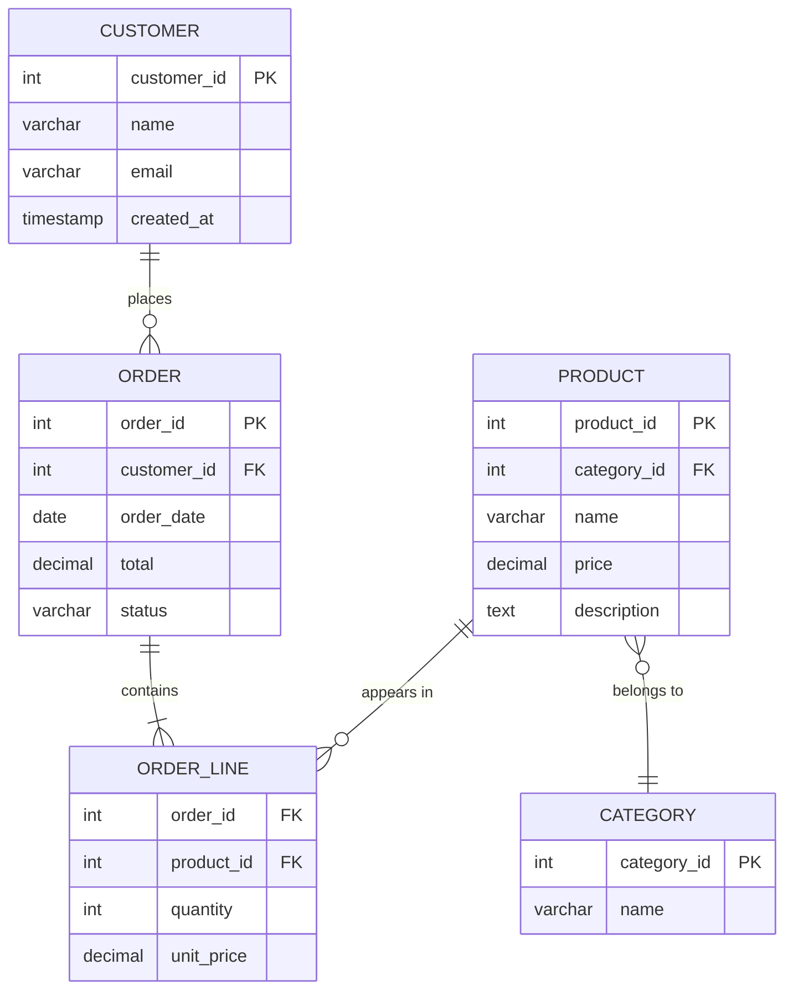
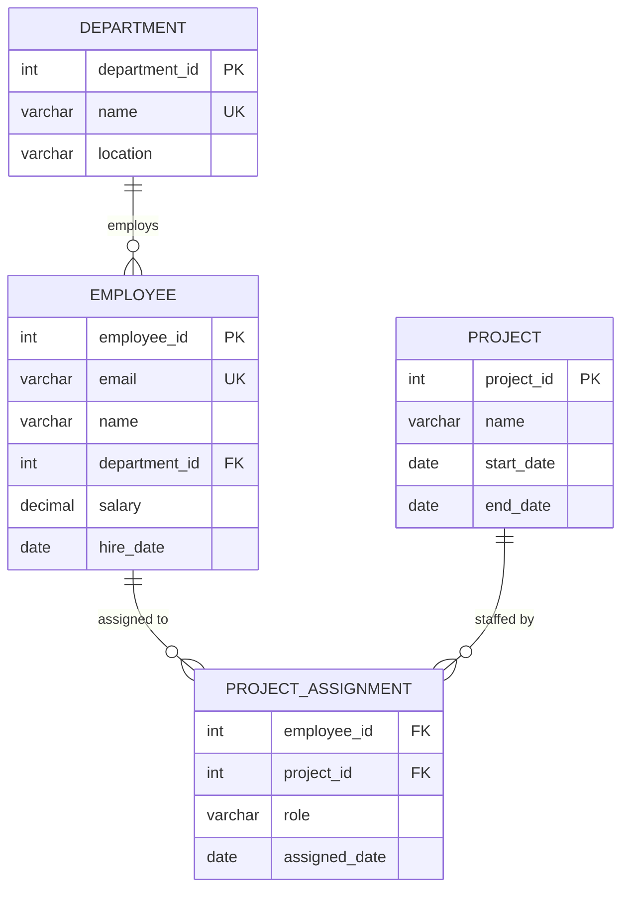

# Database Design & Modeling

Good schema design is the foundation that everything else rests on - query performance, data integrity, application complexity, and operational burden. A poorly designed schema creates problems that no amount of indexing or hardware can fix. A well-designed one makes queries obvious, constraints enforceable, and future changes manageable.

This guide covers the full lifecycle of turning requirements into schema: modeling entities and relationships, normalizing to eliminate redundancy, choosing when to denormalize for performance, selecting appropriate data types, enforcing integrity through constraints, and building indexes that make your queries fast.

---

## Entity-Relationship Modeling

Before writing any `CREATE TABLE` statements, you need a clear picture of what your data looks like and how the pieces connect. **Entity-Relationship (ER) diagrams** are the standard tool for this. They capture the nouns in your system (entities), the attributes those nouns have, and the connections (relationships) between them.

### Entities and Attributes

An **entity** is a thing your system tracks - a customer, an order, a product, an employee. Each entity has **attributes**: a customer has a name and email, an order has a date and total, a product has a price and description.

In a relational database, each entity becomes a table. Each attribute becomes a column.

### Relationships and Cardinality

Entities connect to each other through relationships, and those relationships have **cardinality** - rules about how many of one entity can relate to another:

| Cardinality | Meaning | Example |
|---|---|---|
| One-to-one (1:1) | Each row in A matches exactly one row in B | User and user profile |
| One-to-many (1:N) | Each row in A matches zero or more rows in B | Customer and orders |
| Many-to-many (M:N) | Rows in A can match multiple rows in B and vice versa | Students and courses |

Many-to-many relationships require a **junction table** (also called a join table or associative table) to implement in a relational database. The junction table holds foreign keys pointing to both sides.

### Reading an ER Diagram

Here is an ER diagram for a simple e-commerce system. Each line represents a relationship, and the symbols at each end indicate cardinality:



The notation works like this:

- `||` means "exactly one"
- `o{` means "zero or more"
- `|{` means "one or more"

So `CUSTOMER ||--o{ ORDER` reads as: each customer places zero or more orders, and each order belongs to exactly one customer.

!!! tip "Start with the diagram"
    Sketch your ER diagram before writing SQL. It forces you to think about relationships and cardinality up front, and catches design mistakes that are painful to fix after tables are populated with data.

```quiz
question: "In the e-commerce ER diagram above, why does ORDER_LINE exist as a separate table instead of putting product details directly in ORDER?"
type: multiple-choice
options:
  - text: "It's purely optional - you could store product IDs as a comma-separated list in ORDER"
    feedback: "Storing multiple values in a single column violates first normal form and makes querying, indexing, and enforcing referential integrity impossible. You could not JOIN to products or enforce that each product_id is valid."
  - text: "ORDER_LINE is a junction table that resolves the many-to-many relationship between ORDER and PRODUCT"
    correct: true
    feedback: "Correct! An order can contain multiple products, and a product can appear in multiple orders. That is a many-to-many relationship. ORDER_LINE (the junction table) holds a row for each product in each order, with its own attributes like quantity and unit_price."
  - text: "It exists only for performance reasons - it would work fine as columns on ORDER"
    feedback: "This is not a performance optimization. An order can contain a variable number of products. You cannot represent that with a fixed set of columns on ORDER without an arbitrary limit and massive waste of space."
  - text: "ORDER_LINE is needed because SQL does not support arrays"
    feedback: "While standard SQL lacks arrays (PostgreSQL has them as an extension), the real reason is relational modeling. Even with array support, you would lose referential integrity, querying flexibility, and the ability to store per-line attributes like quantity and unit_price."
```

---

## Normalization

**Normalization** is the process of organizing columns and tables to reduce data redundancy and prevent update anomalies. Each **normal form** builds on the previous one, imposing stricter rules about how data is structured.

The goal is not normalization for its own sake. The goal is a schema where each fact is stored exactly once, so updates cannot create inconsistencies.

### First Normal Form (1NF)

A table is in **first normal form** if:

1. Every column contains atomic (indivisible) values - no lists, sets, or nested structures
2. Each row is unique (the table has a primary key)

**Problem - a table violating 1NF:**

| order_id | customer | products |
|---|---|---|
| 1 | Alice | Widget, Gadget, Sprocket |
| 2 | Bob | Gadget |

The `products` column contains a comma-separated list. You cannot query for all orders containing "Widget" without string parsing. You cannot count products per order without splitting strings. You cannot enforce that each product name is valid.

**Fix - split into atomic values with a proper relationship:**

| order_id | customer |
|---|---|
| 1 | Alice |
| 2 | Bob |

| order_id | product |
|---|---|
| 1 | Widget |
| 1 | Gadget |
| 1 | Sprocket |
| 2 | Gadget |

Now each cell holds one value, each row is unique, and you can query, index, and constrain the data properly.

### Second Normal Form (2NF)

A table is in **second normal form** if:

1. It is in 1NF
2. Every non-key column depends on the **entire** primary key, not just part of it

2NF only matters for tables with composite primary keys. If your primary key is a single column, 1NF compliance automatically gives you 2NF.

**Problem - a table violating 2NF:**

| order_id | product_id | product_name | quantity |
|---|---|---|---|
| 1 | 10 | Widget | 3 |
| 1 | 20 | Gadget | 1 |
| 2 | 10 | Widget | 5 |

The primary key is (`order_id`, `product_id`). But `product_name` depends only on `product_id`, not on the full composite key. If you rename "Widget" to "Super Widget", you must update every row where `product_id = 10`. Miss one and your data is inconsistent.

**Fix - move partial dependencies to their own table:**

**order_lines:**

| order_id | product_id | quantity |
|---|---|---|
| 1 | 10 | 3 |
| 1 | 20 | 1 |
| 2 | 10 | 5 |

**products:**

| product_id | product_name |
|---|---|
| 10 | Widget |
| 20 | Gadget |

Now `product_name` is stored once and referenced by `product_id`.

### Third Normal Form (3NF)

A table is in **third normal form** if:

1. It is in 2NF
2. No non-key column depends on another non-key column (no **transitive dependencies**)

**Problem - a table violating 3NF:**

| employee_id | name | department_id | department_name | department_location |
|---|---|---|---|---|
| 1 | Alice | 10 | Engineering | Building A |
| 2 | Bob | 10 | Engineering | Building A |
| 3 | Carol | 20 | Marketing | Building B |

Here, `department_name` and `department_location` depend on `department_id`, not on `employee_id`. If Engineering moves to Building C, you update multiple rows. Miss one and you have Engineering in two buildings.

**Fix - extract the transitive dependency:**

**employees:**

| employee_id | name | department_id |
|---|---|---|
| 1 | Alice | 10 |
| 2 | Bob | 10 |
| 3 | Carol | 20 |

**departments:**

| department_id | department_name | department_location |
|---|---|---|
| 10 | Engineering | Building A |
| 20 | Marketing | Building B |

The department fact is stored once. Updates happen in one place.

### Boyce-Codd Normal Form (BCNF)

**Boyce-Codd Normal Form** is a stricter version of 3NF. A table is in BCNF if every determinant (a column or set of columns that other columns depend on) is a candidate key.

The difference from 3NF is subtle and only surfaces in tables with multiple overlapping candidate keys. Here is a classic example:

**Problem - a table in 3NF but not BCNF:**

Consider a university where each subject is taught by one professor, but a professor can teach only one subject. Students can enroll in multiple subjects.

| student_id | subject | professor |
|---|---|---|
| 1 | Math | Dr. Smith |
| 1 | Physics | Dr. Jones |
| 2 | Math | Dr. Smith |

The candidate keys are (`student_id`, `subject`) and (`student_id`, `professor`). But `subject` determines `professor` and `professor` determines `subject` - and neither is a candidate key on its own. If Dr. Smith switches from Math to Chemistry, you update multiple rows.

**Fix - decompose so every determinant is a candidate key:**

**professor_subjects:**

| professor | subject |
|---|---|
| Dr. Smith | Math |
| Dr. Jones | Physics |

**student_enrollments:**

| student_id | professor |
|---|---|
| 1 | Dr. Smith |
| 1 | Dr. Jones |
| 2 | Dr. Smith |

Now the `professor -> subject` dependency lives in a table where `professor` is the key.

!!! warning "Normalization is a tool, not a religion"
    In practice, most production schemas aim for 3NF. BCNF violations are rare and usually harmless. Going beyond 3NF (there are 4NF, 5NF, and even 6NF) brings diminishing returns and increasing complexity. Know the rules so you can make informed decisions about when to follow them and when to break them.

```quiz
question: "A table has columns (order_id, product_id, product_name, quantity) with primary key (order_id, product_id). product_name depends only on product_id. Which normal form does this table violate?"
type: multiple-choice
options:
  - text: "1NF - because product_name is not atomic"
    feedback: "product_name is a single value per row, so it is atomic. The table satisfies 1NF."
  - text: "2NF - because product_name depends on only part of the composite key"
    correct: true
    feedback: "Correct! Second normal form requires that every non-key column depends on the entire primary key. Here, product_name depends only on product_id, not on the full key (order_id, product_id). This partial dependency means the table violates 2NF."
  - text: "3NF - because of a transitive dependency"
    feedback: "Transitive dependencies involve a non-key column depending on another non-key column. Here, product_name depends on product_id, which is part of the key. This is a partial dependency (a 2NF violation), not a transitive one."
  - text: "BCNF - because product_id is a determinant but not a candidate key"
    feedback: "While this is technically true, the more precise answer is that it violates 2NF. BCNF violations are about determinants that are not candidate keys in tables that otherwise satisfy 3NF. This table does not even reach 2NF."
```

---

## Denormalization

Fully normalized schemas store each fact once, which is excellent for writes and data integrity. But reads can suffer because answering a single question may require joining five or six tables. **Denormalization** is the deliberate introduction of redundancy to speed up reads.

### When to Denormalize

Denormalization makes sense when:

- A query is run frequently and the joins are measurably slow
- The data changes rarely but is read constantly (high read-to-write ratio)
- Reporting queries need pre-aggregated data to avoid scanning millions of rows
- You have measured the problem with `EXPLAIN` and confirmed that joins are the bottleneck

Denormalization does not make sense when:

- You are guessing about performance before measuring
- Write consistency is critical and you cannot tolerate stale duplicated data
- The application is write-heavy

### Common Denormalization Strategies

**Pre-computed columns.** Store a calculated value directly on the row instead of computing it at query time:

```sql
-- Instead of SUM(order_lines.quantity * order_lines.unit_price) every time:
ALTER TABLE orders ADD COLUMN total_amount DECIMAL(10,2);
```

You update `total_amount` whenever an order line changes. The trade-off is that your application code (or a trigger) must keep it in sync.

**Duplicated columns.** Copy a frequently accessed column from a related table:

```sql
-- Instead of joining to customers for every order display:
ALTER TABLE orders ADD COLUMN customer_name VARCHAR(255);
```

If the customer's name changes, every order must be updated. This is acceptable if name changes are rare and order listing queries are constant.

**Summary tables.** Maintain a separate table with pre-aggregated data:

```sql
CREATE TABLE daily_sales_summary (
    summary_date DATE PRIMARY KEY,
    total_orders INT NOT NULL,
    total_revenue DECIMAL(12,2) NOT NULL,
    avg_order_value DECIMAL(10,2) NOT NULL
);
```

Populated by a nightly batch job or maintained by triggers. Dashboard queries hit this table instead of scanning the entire orders table.

!!! danger "Denormalization creates maintenance burden"
    Every piece of duplicated data is a consistency risk. When you denormalize, document which columns are derived, what the source of truth is, and how synchronization happens (trigger, application code, batch job). If you cannot answer those questions, do not denormalize.

---

## Index Theory

Indexes are separate data structures that help the database find rows without scanning every page in the table. Without an index, a query against a million-row table reads every row. With the right index, it reads a handful of pages.

### B-tree Indexes

The **B-tree** (balanced tree) is the default index structure in virtually every relational database. It keeps data sorted in a tree structure where:

- The root node points to intermediate nodes
- Intermediate nodes point to leaf nodes
- Leaf nodes contain the indexed values and pointers to the actual table rows
- All leaf nodes are at the same depth, so lookup time is consistent

B-tree indexes support:

- Exact match lookups: `WHERE email = 'alice@example.com'`
- Range scans: `WHERE price BETWEEN 10 AND 50`
- Prefix matching: `WHERE name LIKE 'Ali%'`
- Sorting: `ORDER BY created_at DESC`
- Min/max: `SELECT MIN(price) FROM products`

They do **not** efficiently support:

- Suffix or infix matching: `WHERE name LIKE '%ice'`
- Functions on the indexed column: `WHERE YEAR(created_at) = 2025` (unless you create a functional index)

**Composite indexes** (multi-column) follow the **leftmost prefix rule**. An index on `(country, city, zipcode)` can satisfy queries on `country`, `country + city`, or `country + city + zipcode`, but not `city` alone or `zipcode` alone.

### Hash Indexes

**Hash indexes** use a hash function to map values to buckets. They are fast for exact equality lookups (`=` and `IN`) but cannot help with range queries, sorting, or prefix matching.

In MySQL, the MEMORY storage engine supports explicit hash indexes. InnoDB uses an internal **adaptive hash index** that it builds automatically on top of B-tree indexes for frequently accessed pages - you do not create it manually.

In PostgreSQL, you can create hash indexes explicitly:

```sql
CREATE INDEX idx_sessions_token ON sessions USING HASH (token);
```

Hash indexes in PostgreSQL were not crash-safe until version 10. If you are on PostgreSQL 10+, they are a reasonable choice for columns that are only ever queried with `=`.

### GIN and GiST Indexes (PostgreSQL)

[**PostgreSQL**](https://www.postgresql.org/docs/current/indexes-types.html) offers specialized index types for non-scalar data:

**GIN (Generalized Inverted Index)** is designed for values that contain multiple elements - arrays, JSONB documents, and full-text search vectors. A GIN index on a JSONB column lets you query for documents containing specific keys or values efficiently:

```sql
CREATE INDEX idx_metadata ON events USING GIN (metadata);
-- Now this query uses the index:
SELECT * FROM events WHERE metadata @> '{"type": "click"}';
```

**GiST (Generalized Search Tree)** supports geometric data, ranges, and full-text search. It is the index type for PostGIS spatial queries and range type operations:

```sql
CREATE INDEX idx_location ON stores USING GIST (location);
-- Spatial query using the index:
SELECT * FROM stores WHERE location <-> point '(40.7, -74.0)' < 0.1;
```

| Index Type | Best For | Range Queries | Equality | Multi-Value |
|---|---|---|---|---|
| B-tree | Most columns | Yes | Yes | No |
| Hash | Equality-only lookups | No | Yes | No |
| GIN | JSONB, arrays, full-text | No | Yes | Yes |
| GiST | Spatial, ranges, full-text | Yes | Yes | Yes |

```terminal
title: Creating Indexes and Reading EXPLAIN Output
steps:
  - command: "CREATE TABLE users (\n    user_id SERIAL PRIMARY KEY,\n    email VARCHAR(255) NOT NULL,\n    name VARCHAR(255),\n    created_at TIMESTAMP DEFAULT NOW()\n);"
    output: |
      CREATE TABLE
    narration: "Create a users table. The PRIMARY KEY automatically creates a B-tree index on user_id."
  - command: "INSERT INTO users (email, name) SELECT\n    'user' || g || '@example.com',\n    'User ' || g\nFROM generate_series(1, 100000) AS g;"
    output: |
      INSERT 0 100000
    narration: "Insert 100,000 rows so the query planner has meaningful data to work with. On small tables, PostgreSQL often ignores indexes in favor of sequential scans."
  - command: "EXPLAIN ANALYZE SELECT * FROM users WHERE email = 'user50000@example.com';"
    output: |
      Seq Scan on users  (cost=0.00..2137.00 rows=1 width=31) (actual time=12.841..25.693 rows=1 loops=1)
        Filter: ((email)::text = 'user50000@example.com'::text)
        Rows Removed by Filter: 99999
      Planning Time: 0.082 ms
      Execution Time: 25.721 ms
    narration: "Without an index on email, PostgreSQL does a sequential scan - it reads every row in the table and checks the filter condition. It removed 99,999 rows to find the one match. Execution took about 26 ms."
  - command: "CREATE INDEX idx_users_email ON users (email);"
    output: |
      CREATE INDEX
    narration: "Create a B-tree index on the email column."
  - command: "EXPLAIN ANALYZE SELECT * FROM users WHERE email = 'user50000@example.com';"
    output: |
      Index Scan using idx_users_email on users  (cost=0.42..8.44 rows=1 width=31) (actual time=0.032..0.034 rows=1 loops=1)
        Index Cond: ((email)::text = 'user50000@example.com'::text)
      Planning Time: 0.108 ms
      Execution Time: 0.053 ms
    narration: "With the index, PostgreSQL uses an index scan. It traverses the B-tree to find the matching entry directly. Execution dropped from 26 ms to 0.05 ms - roughly 500 times faster. The cost estimate dropped from 2137 to 8.44."
  - command: "EXPLAIN ANALYZE SELECT * FROM users WHERE email LIKE '%50000%';"
    output: |
      Seq Scan on users  (cost=0.00..2137.00 rows=10 width=31) (actual time=12.205..30.118 rows=1 loops=1)
        Filter: ((email)::text ~~ '%50000%'::text)
        Rows Removed by Filter: 99999
      Planning Time: 0.095 ms
      Execution Time: 30.144 ms
    narration: "A LIKE pattern with a leading wildcard cannot use the B-tree index. The database falls back to a sequential scan because it cannot use sorted order to find values containing '50000' in the middle. This is a fundamental B-tree limitation."
```

!!! tip "Index only what you query"
    Every index speeds up reads but slows down writes because the database must update the index on every `INSERT`, `UPDATE`, and `DELETE`. Do not create indexes speculatively. Look at your actual query patterns, identify slow queries with `EXPLAIN`, and add indexes to address specific bottlenecks.

```quiz
question: "You have a composite B-tree index on (country, city, zipcode). Which of these queries can use the index?"
type: multiple-choice
options:
  - text: "WHERE city = 'Portland' (skipping country)"
    feedback: "A composite B-tree index follows the leftmost prefix rule. The index is sorted first by country, then by city within each country. Skipping country means the database cannot efficiently navigate the tree to find a specific city - it would need to scan every country section."
  - text: "WHERE country = 'US' AND city = 'Portland'"
    correct: true
    feedback: "Correct! This query uses the two leftmost columns of the index in order (country, then city). The B-tree index can efficiently narrow to country = 'US' first, then find city = 'Portland' within that section. It does not need the third column (zipcode) to be useful."
  - text: "WHERE zipcode = '97201' (skipping country and city)"
    feedback: "The index is sorted by country first, then city, then zipcode. Without knowing the country and city, the database cannot navigate to a specific zipcode efficiently. You would need a separate index on zipcode for this query."
  - text: "WHERE city = 'Portland' AND zipcode = '97201' (skipping country)"
    feedback: "Even though you have two of the three columns, you are missing the leftmost column (country). The B-tree index cannot skip the first column in its sort order. This query would not use the composite index."
```

---

## Data Type Selection

Choosing the right data type affects storage size, query performance, and the correctness of your application. The wrong type can waste disk space, prevent useful optimizations, or silently lose precision.

### Integers

| Type | Storage | Range | Use When |
|---|---|---|---|
| `TINYINT` / `SMALLINT` | 1-2 bytes | Up to 32,767 (signed) | Status codes, small enumerations |
| `INT` | 4 bytes | Up to ~2.1 billion | Most primary keys, counters, foreign keys |
| `BIGINT` | 8 bytes | Up to ~9.2 quintillion | Tables expected to exceed 2 billion rows, timestamps as epoch milliseconds |

Use `INT` for primary keys unless you have a concrete reason for `BIGINT`. A table with a `BIGINT` primary key and three `BIGINT` foreign keys uses 16 bytes more per row than the `INT` equivalent. Over 100 million rows, that is 1.6 GB of extra storage just for those four columns - and the indexes are larger too, which means more memory pressure and slower scans.

Use `BIGINT` when you know the table will grow past 2 billion rows, or when you are storing values like Unix timestamps in milliseconds or external IDs from systems that use 64-bit identifiers.

### Strings

| Type | Behavior | Use When |
|---|---|---|
| `CHAR(N)` | Fixed-length, padded with spaces | Codes with known length (country codes, currency codes) |
| `VARCHAR(N)` | Variable-length, stores only what you need | Most string data (names, emails, addresses) |
| `TEXT` | Variable-length, no practical limit | Large content (descriptions, comments, articles) |

In PostgreSQL, there is no performance difference between `VARCHAR(N)` and `TEXT`. The length limit on `VARCHAR(N)` is purely a constraint - if you want to enforce a maximum length, use it. If you do not need a maximum, `TEXT` is simpler.

In MySQL, `VARCHAR` columns longer than a threshold (roughly 768 bytes for InnoDB) cannot be fully included in B-tree indexes. Keep indexed `VARCHAR` columns reasonably sized.

### Numeric Precision

| Type | Behavior | Use When |
|---|---|---|
| `DECIMAL(P,S)` / `NUMERIC(P,S)` | Exact arithmetic | Money, financial calculations, anything where rounding errors are unacceptable |
| `FLOAT` / `DOUBLE` | Approximate (IEEE 754 floating point) | Scientific measurements, coordinates, values where small rounding errors are acceptable |

Never store money as `FLOAT` or `DOUBLE`. The value `0.1` cannot be represented exactly in binary floating point:

```sql
-- This might not return your row:
SELECT * FROM accounts WHERE balance = 0.10;

-- Use DECIMAL instead:
CREATE TABLE accounts (
    account_id INT PRIMARY KEY,
    balance DECIMAL(12,2) NOT NULL DEFAULT 0.00
);
```

### Timestamps

| Type | Stores | Use When |
|---|---|---|
| `TIMESTAMP` | Date and time, usually UTC-aware | Event times, `created_at`, `updated_at` |
| `DATETIME` (MySQL) | Date and time, no timezone conversion | Scheduling (you want the literal date/time stored) |
| `TIMESTAMPTZ` (PostgreSQL) | Timestamp with timezone awareness | Almost always - PostgreSQL converts to UTC on storage and back to the session timezone on retrieval |
| `DATE` | Date only | Birthdays, due dates, report dates |

!!! tip "Always store timestamps in UTC"
    Store all timestamps in UTC and convert to local time in the application layer. Mixing timezones in the database leads to subtle bugs that are extraordinarily painful to debug. In PostgreSQL, use `TIMESTAMPTZ`. In MySQL, set your server to `UTC` and use `TIMESTAMP`.

### Boolean and Enumeration Types

For columns with a small fixed set of values, you have options:

- `BOOLEAN` (or `TINYINT(1)` in MySQL) for true/false flags
- `ENUM` types for small fixed sets - convenient but creates schema coupling (adding a new value requires `ALTER TABLE`)
- A `VARCHAR` column with a `CHECK` constraint - more flexible than `ENUM` and easier to extend
- A separate lookup table with a foreign key - the most normalized approach, best when the set of values may grow or has its own attributes

---

## Constraints

**Constraints** are rules enforced by the database engine that prevent invalid data from entering your tables. They are your last line of defense against application bugs, bad imports, and manual mistakes.

### PRIMARY KEY

Every table should have a **primary key** - a column or combination of columns that uniquely identifies each row. The database enforces uniqueness and creates an index automatically.

```sql
CREATE TABLE products (
    product_id INT PRIMARY KEY,
    name VARCHAR(255) NOT NULL
);

-- Composite primary key:
CREATE TABLE order_lines (
    order_id INT,
    product_id INT,
    quantity INT NOT NULL,
    PRIMARY KEY (order_id, product_id)
);
```

### FOREIGN KEY

A **foreign key** constraint ensures that a value in one table references a valid row in another table. It prevents orphaned records and enforces referential integrity.

The `ON DELETE` and `ON UPDATE` clauses control what happens when the referenced row changes:

| Action | Behavior |
|---|---|
| `CASCADE` | Delete/update the child rows automatically |
| `SET NULL` | Set the foreign key column to `NULL` |
| `SET DEFAULT` | Set the foreign key column to its default value |
| `RESTRICT` | Block the delete/update if child rows exist (checked immediately) |
| `NO ACTION` | Same as `RESTRICT` in most databases (checked at end of statement in PostgreSQL) |

```sql
CREATE TABLE orders (
    order_id INT PRIMARY KEY,
    customer_id INT NOT NULL,
    FOREIGN KEY (customer_id) REFERENCES customers(customer_id)
        ON DELETE RESTRICT
        ON UPDATE CASCADE
);
```

This means: if you try to delete a customer who has orders, the database blocks it (`RESTRICT`). If you change a customer's ID, the change propagates to all their orders (`CASCADE`).

### UNIQUE, CHECK, NOT NULL, and DEFAULT

```sql
CREATE TABLE employees (
    employee_id INT PRIMARY KEY,
    email VARCHAR(255) NOT NULL UNIQUE,
    name VARCHAR(255) NOT NULL,
    department_id INT REFERENCES departments(department_id),
    salary DECIMAL(10,2) CHECK (salary > 0),
    hire_date DATE NOT NULL DEFAULT CURRENT_DATE,
    status VARCHAR(20) NOT NULL DEFAULT 'active'
        CHECK (status IN ('active', 'inactive', 'terminated'))
);
```

- `NOT NULL` prevents missing values - use it on every column that should always have a value
- `UNIQUE` prevents duplicates - use it for natural identifiers like email, username, or SKU
- `CHECK` enforces arbitrary conditions - salaries must be positive, status must be one of a known set
- `DEFAULT` provides a value when one is not specified during insert

### Putting It All Together

Here is a complete schema demonstrating constraints, data types, and relationships. The following ER diagram shows the structure:



```code-walkthrough
language: sql
title: Complete Schema with Constraints
code: |
  CREATE TABLE departments (
      department_id INT GENERATED ALWAYS AS IDENTITY PRIMARY KEY,
      name VARCHAR(100) NOT NULL UNIQUE,
      location VARCHAR(255)
  );

  CREATE TABLE employees (
      employee_id INT GENERATED ALWAYS AS IDENTITY PRIMARY KEY,
      email VARCHAR(255) NOT NULL UNIQUE,
      name VARCHAR(255) NOT NULL,
      department_id INT NOT NULL REFERENCES departments(department_id)
          ON DELETE RESTRICT ON UPDATE CASCADE,
      salary DECIMAL(10,2) NOT NULL CHECK (salary > 0),
      hire_date DATE NOT NULL DEFAULT CURRENT_DATE
  );

  CREATE TABLE projects (
      project_id INT GENERATED ALWAYS AS IDENTITY PRIMARY KEY,
      name VARCHAR(255) NOT NULL,
      start_date DATE NOT NULL,
      end_date DATE,
      CHECK (end_date IS NULL OR end_date >= start_date)
  );

  CREATE TABLE project_assignments (
      employee_id INT REFERENCES employees(employee_id)
          ON DELETE CASCADE,
      project_id INT REFERENCES projects(project_id)
          ON DELETE CASCADE,
      role VARCHAR(50) NOT NULL DEFAULT 'member'
          CHECK (role IN ('lead', 'member', 'reviewer')),
      assigned_date DATE NOT NULL DEFAULT CURRENT_DATE,
      PRIMARY KEY (employee_id, project_id)
  );
annotations:
  - line: 2
    text: "GENERATED ALWAYS AS IDENTITY is the SQL standard way to create auto-incrementing primary keys. PostgreSQL supports this directly. In MySQL, you would use AUTO_INCREMENT instead."
  - line: 3
    text: "NOT NULL UNIQUE on name ensures every department has a name and no two departments share one. UNIQUE creates an implicit index."
  - line: 8
    text: "The email column is both NOT NULL (required) and UNIQUE (no duplicates). This combination is common for natural identifiers."
  - line: 10
    text: "Foreign key with ON DELETE RESTRICT prevents deleting a department that still has employees. ON UPDATE CASCADE propagates any department_id changes to employees."
  - line: 11
    text: "DECIMAL(10,2) stores exact values with up to 10 digits total and 2 decimal places. The CHECK constraint ensures salaries are positive."
  - line: 12
    text: "DEFAULT CURRENT_DATE means inserts that omit hire_date automatically get today's date."
  - line: 18
    text: "A CHECK constraint spanning multiple columns: end_date must be NULL (ongoing project) or on/after start_date. This prevents logically impossible date ranges."
  - line: 21
    text: "ON DELETE CASCADE on both foreign keys means that when an employee or project is deleted, their assignments are automatically removed. This makes sense here because an assignment has no meaning without both its employee and project."
  - line: 23
    text: "CHECK constraint limits role to a known set of values. This acts like an ENUM but is standard SQL and easier to modify."
  - line: 25
    text: "Composite primary key on (employee_id, project_id) ensures each employee is assigned to each project at most once and creates a covering index for lookups by employee."
```

---

## Design Decisions in Practice

Real schema design involves trade-offs. Here is a summary of the key decisions and when each option wins:

| Decision | Option A | Option B | Choose A When | Choose B When |
|---|---|---|---|---|
| Normalization level | 3NF (fully normalized) | Denormalized with redundancy | Write-heavy, data integrity critical | Read-heavy dashboards, rare updates |
| Primary key type | Natural key (email, SSN) | Surrogate key (auto-increment INT) | Key is truly immutable and unique | Natural keys can change or are large |
| `INT` vs `BIGINT` | `INT` (4 bytes) | `BIGINT` (8 bytes) | Table stays under 2B rows | Table will exceed 2B rows |
| `VARCHAR(N)` vs `TEXT` | `VARCHAR(N)` | `TEXT` | You want a length constraint | No meaningful max length |
| `DECIMAL` vs `FLOAT` | `DECIMAL` | `FLOAT`/`DOUBLE` | Money, exact arithmetic | Scientific data, acceptable rounding |
| `ENUM` vs `CHECK` | `ENUM` type | `VARCHAR` + `CHECK` | MySQL with stable small sets | PostgreSQL, or sets that may grow |
| `CASCADE` vs `RESTRICT` | `ON DELETE CASCADE` | `ON DELETE RESTRICT` | Child rows meaningless without parent | Child rows should block parent deletion |

```exercise
title: Normalize a Flat Table
type: scenario
scenario: |
  You have inherited a flat "course registration" table used by a university system. Here is the current structure:

  | student_id | student_name | student_email         | course_code | course_title          | professor      | professor_email        | grade | semester    |
  |------------|-------------|-----------------------|-------------|----------------------|----------------|------------------------|-------|-------------|
  | 101        | Alice Wang  | alice@university.edu  | CS101       | Intro to CS          | Dr. Smith      | smith@university.edu   | A     | Fall 2025   |
  | 101        | Alice Wang  | alice@university.edu  | MATH201     | Linear Algebra       | Dr. Jones      | jones@university.edu   | B+    | Fall 2025   |
  | 102        | Bob Chen    | bob@university.edu    | CS101       | Intro to CS          | Dr. Smith      | smith@university.edu   | B     | Fall 2025   |
  | 103        | Carol Davis | carol@university.edu  | CS101       | Intro to CS          | Dr. Smith      | smith@university.edu   | A-    | Spring 2026 |
  | 103        | Carol Davis | carol@university.edu  | MATH201     | Linear Algebra       | Dr. Jones      | jones@university.edu   | A     | Spring 2026 |

  This table has redundancy problems:
  - Alice's name and email are repeated for each course she takes
  - CS101's title and professor are repeated for each student enrolled
  - Dr. Smith's email is repeated for every student in every course they teach
tasks:
  - task: "Identify which normal forms this table violates and what the specific violations are."
    hint: "Look at the composite primary key (student_id, course_code, semester). Which non-key columns depend on only part of this key? Which non-key columns depend on other non-key columns?"
    answer: "The table violates 2NF because student_name and student_email depend only on student_id (not the full key), and course_title, professor, and professor_email depend only on course_code (not the full key). It also violates 3NF because professor_email depends on professor, which is not part of any key - it is a transitive dependency through a non-key column."
  - task: "Decompose this into a set of normalized tables (at least 3NF). List each table with its columns and primary key."
    hint: "Each fact should be stored exactly once. Students, courses, professors, and enrollments should each have their own table. Think about which columns belong to which entity."
    answer: "Four tables: (1) students(student_id PK, student_name, student_email), (2) professors(professor_id PK, professor_name, professor_email), (3) courses(course_code PK, course_title, professor_id FK), (4) enrollments(student_id FK, course_code FK, semester, grade, PRIMARY KEY(student_id, course_code, semester)). Student data is stored once per student. Course data is stored once per course. Professor data is stored once per professor. Enrollment connects them with the grade for that specific student-course-semester combination."
  - task: "Draw out the relationships between your normalized tables: what is the cardinality of each relationship?"
    hint: "Think about how many courses a professor teaches, how many students enroll in a course, and how a student can take the same course in different semesters."
    answer: "Professor to Course is one-to-many (one professor teaches multiple courses, each course has one professor). Student to Enrollment is one-to-many (one student has many enrollments). Course to Enrollment is one-to-many (one course has many enrollments). The enrollments table resolves the many-to-many between students and courses, with semester as part of the key to allow retakes."
```

---

## Further Reading

- [Database Normalization Basics](https://opentextbc.ca/dbdesign01/chapter/chapter-12-normalization/) - Open textbook chapter with detailed worked examples through 3NF
- [Use The Index, Luke](https://use-the-index-luke.com/) - The definitive free resource on SQL indexing and query performance, covering B-tree internals, composite indexes, and execution plans
- [PostgreSQL Index Types](https://www.postgresql.org/docs/current/indexes-types.html) - Official documentation on B-tree, Hash, GIN, GiST, SP-GiST, and BRIN index types
- [MySQL Data Types](https://dev.mysql.com/doc/refman/8.0/en/data-types.html) - Official MySQL reference for storage requirements and behavior of each data type
- [SQL Constraints on W3Schools](https://www.w3schools.com/sql/sql_constraints.asp) - Quick reference for PRIMARY KEY, FOREIGN KEY, UNIQUE, CHECK, NOT NULL, and DEFAULT

---

**Previous:** [SQL Essentials](sql-essentials.md) | **Next:** [MySQL Installation & Configuration](mysql-installation-and-configuration.md) | [Back to Index](README.md)
