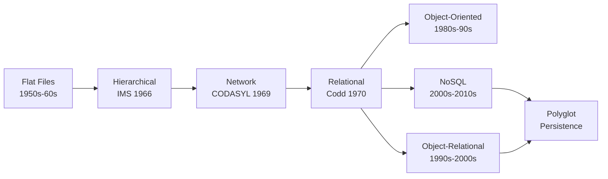

# Database Fundamentals

Every application you use - from the banking app on your phone to the search engine returning this page - depends on a database. But databases did not spring into existence fully formed. They evolved over decades, shaped by real engineering failures, shifting hardware constraints, and a few landmark academic papers. Understanding that evolution gives you a vocabulary and mental model that makes every subsequent guide in this course easier to absorb.

---

## The Evolution of Data Management

Before databases existed, programs stored data in **flat files** - plain text or binary files on disk, each structured however the programmer saw fit. A payroll system might write employee records as fixed-width lines in a `.dat` file. A different department's inventory system used a different format. There was no standard way to query, update, or relate data across systems. If the file format changed, every program that read it broke.

This worked when computers served one department and ran one program at a time. It fell apart the moment organizations needed to share data across applications. The problems were predictable: data duplication across files led to inconsistencies, concurrent access caused corruption, and there was no mechanism for enforcing data integrity. If two programs tried to update the same file simultaneously, the result depended on timing - a problem known as a **race condition**.

### Hierarchical Model: IMS

<figure class="photo-frame photo-right" style="max-width: 280px;">
  
  <figcaption>
    Saturn V first stage components at NASA's Michoud Assembly Facility, 1967. Tracking millions of parts like these drove the creation of IMS.
    <span class="photo-credit">Photo: <a href="https://commons.wikimedia.org/wiki/File:Saturn_V_Production_at_MIchoud_Assembly_Facility_-1967_(MAF_19671005_ViewtoWest).jpg">NASA</a>, public domain</span>
  </figcaption>
</figure>

In 1966, IBM and North American Aviation (now part of Boeing) built [**IMS**](https://www.ibm.com/products/ims) (Information Management System) to manage the bill of materials for the Saturn V rocket. IMS organized data as a tree - parent records owned child records, which owned grandchild records, and so on. Navigating from a rocket stage to its components to their suppliers meant walking down the tree.

The **hierarchical model** was fast for the access patterns it was designed for. If your queries always started at the root and walked downward, IMS performed well. But if you needed to query across branches - "show me all suppliers who provide parts to more than one stage" - you were stuck writing complex application code to traverse multiple trees and correlate the results.

### Network Model: CODASYL

The **CODASYL** (Conference on Data Systems Languages) committee proposed the **network model** in 1969 to address the hierarchical model's rigidity. Instead of trees, data was organized as a graph: records could have multiple parent-child relationships through **sets** (essentially pointers linking record types). A supplier record could be linked to multiple part records across different assemblies.

This was more flexible than IMS, but the programmer had to navigate the graph manually - following pointers from record to record. Queries were imperative: "start at this record, follow this set, move to the next member." If the data relationships changed, the navigation code changed too. The database and the application were tightly coupled.

### The Relational Revolution: Codd

<figure class="photo-frame photo-right" style="max-width: 250px;">
  <a href="https://www.seas.upenn.edu/~zives/03f/cis550/codd.pdf" target="_blank">
    
  </a>
  <figcaption>
    The first page of Codd's landmark 1970 paper in <em>Communications of the ACM</em>.
    <span class="photo-credit"><a href="https://www.seas.upenn.edu/~zives/03f/cis550/codd.pdf" target="_blank">Read the full paper (PDF)</a></span>
  </figcaption>
</figure>

In June 1970, Edgar F. Codd, a researcher at IBM's San Jose lab, published "A Relational Model of Data for Large Shared Data Banks" in Communications of the ACM. The paper proposed something radical: separate the logical organization of data from its physical storage. Data would be organized into **relations** (tables), and users would declare *what* data they wanted, not *how* to navigate to it.

This was the birth of the **relational model**, and it changed everything. Instead of writing imperative navigation code, you would write declarative queries. The database system would figure out the optimal access path. This separation meant that the physical storage could change - indexes added or removed, data reorganized on disk - without breaking application code.

<figure class="photo-frame photo-right" style="max-width: 250px;">
  
  <figcaption>
    Michael Stonebraker at UC Berkeley, co-creator of Ingres and the 2014 Turing Award recipient.
    <span class="photo-credit">Photo: <a href="https://commons.wikimedia.org/wiki/File:Michael_Stonebraker_1.jpg">Dcoetzee</a>, <a href="https://creativecommons.org/publicdomain/zero/1.0/">CC0</a></span>
  </figcaption>
</figure>

IBM was slow to commercialize Codd's ideas (IMS was a cash cow), but two Berkeley researchers, Michael Stonebraker and Eugene Wong, built [**Ingres**](https://en.wikipedia.org/wiki/Ingres_(database)) in the mid-1970s. Larry Ellison read Codd's papers and built what became [**Oracle**](https://www.oracle.com/database/). IBM eventually shipped **System R**, which evolved into [**DB2**](https://www.ibm.com/products/db2). The SQL language emerged from System R and was standardized in 1986.

<figure class="photo-frame photo-right" style="max-width: 250px;">
  
  <figcaption>
    Larry Ellison, co-founder of Oracle, on stage at Oracle OpenWorld 2009.
    <span class="photo-credit">Photo: <a href="https://www.flickr.com/photos/43156897@N06/4013705452">Oracle Corporate Communications</a>, <a href="https://creativecommons.org/licenses/by/2.0/">CC BY 2.0</a></span>
  </figcaption>
</figure>

### Object-Oriented and Object-Relational Databases

In the late 1980s and 1990s, as object-oriented programming gained traction, some argued that the "impedance mismatch" between objects in code and tables in databases required a new approach. **Object-oriented databases** (OODBs) like GemStone, ObjectStore, and Versant stored objects directly, preserving inheritance and encapsulation.

OODBs never displaced relational systems in the mainstream. The relational model's mathematical foundation, mature tooling, and the practical effectiveness of object-relational mapping (ORM) layers proved "good enough." The ORM approach - mapping objects to rows through libraries like Hibernate (Java), SQLAlchemy (Python), and ActiveRecord (Ruby) - became the standard way to bridge the gap.

However, the object-oriented movement influenced relational databases in lasting ways. PostgreSQL added support for user-defined types, table inheritance, and eventually JSON/JSONB columns - blurring the line between relational and object storage. MySQL 5.7 added a native JSON type. SQL Server added XML and JSON support. The relational model absorbed the useful ideas and kept its position.

### The NoSQL Movement

By the mid-2000s, web-scale companies hit walls that traditional RDBMS systems were not built for. Google published the **Bigtable** paper (2006). Amazon published the **Dynamo** paper (2007). These systems sacrificed some relational guarantees - joins, rigid schemas, multi-row transactions - in exchange for horizontal scalability and availability across distributed clusters.

The term **NoSQL** (sometimes backronymed as "Not Only SQL") became an umbrella for a diverse set of systems: document stores like [**MongoDB**](https://www.mongodb.com/), key-value stores like [**Redis**](https://redis.io/), wide-column stores like [**Apache Cassandra**](https://cassandra.apache.org/), and graph databases like [**Neo4j**](https://neo4j.com/). Each traded away different relational features to optimize for specific access patterns or scale requirements.

Today, the industry has largely moved past the "NoSQL vs. SQL" debate. Most organizations practice **polyglot persistence** - using whichever database best fits each workload. A single application might use PostgreSQL for transactional data, Redis for caching and session state, and Elasticsearch for full-text search.



```quiz
question: "Why did Edgar Codd's relational model represent such a fundamental shift from hierarchical and network databases?"
type: multiple-choice
options:
  - text: "It stored data in files instead of in memory"
    feedback: "All three models ultimately store data on disk. The key innovation was the separation of logical data organization from physical storage and the shift from imperative navigation to declarative queries."
  - text: "It separated logical data organization from physical storage, allowing declarative queries instead of imperative navigation"
    correct: true
    feedback: "Correct! Codd's relational model meant you declared what data you wanted (SELECT, JOIN) rather than writing code to navigate pointers and trees. The database optimizer determined the access path, so physical storage changes did not break applications."
  - text: "It was faster than IMS and CODASYL systems"
    feedback: "Early relational systems were actually slower than IMS for the specific workloads IMS was tuned for. The advantage was flexibility and data independence, not raw speed."
  - text: "It eliminated the need for indexes"
    feedback: "Relational databases use indexes extensively. The innovation was that adding or removing indexes changes performance, not correctness - applications do not need to know which indexes exist."
```

---

## The Relational Model

The relational model is the foundation for MySQL, PostgreSQL, Oracle, SQL Server, SQLite, and every other RDBMS. Even if you work primarily with NoSQL systems, understanding relational concepts gives you a baseline for evaluating trade-offs.

### Tables, Rows, and Columns

A **table** (or **relation** in formal terminology) is a structured collection of data about a single entity type. An `employees` table stores data about employees. An `orders` table stores data about orders.

Each **row** (or **tuple**) represents one instance of that entity - one employee, one order. Each **column** (or **attribute**) represents one property of that entity - name, hire date, salary, order total.

```sql
CREATE TABLE employees (
    employee_id   INT PRIMARY KEY,
    first_name    VARCHAR(50) NOT NULL,
    last_name     VARCHAR(50) NOT NULL,
    department_id INT,
    hire_date     DATE NOT NULL,
    salary        DECIMAL(10,2)
);
```

Every column has a **data type** that constrains what values it can hold. `INT` stores integers. `VARCHAR(50)` stores variable-length strings up to 50 characters. `DATE` stores calendar dates. `DECIMAL(10,2)` stores numbers with up to 10 digits and 2 decimal places. Choosing the right data type matters for storage efficiency, query performance, and data integrity.

### Keys

A **primary key** uniquely identifies each row in a table. No two rows can share the same primary key value, and the value cannot be `NULL`. In the example above, `employee_id` is the primary key.

A **foreign key** is a column (or set of columns) in one table that references the primary key of another table. It establishes a relationship between the two tables and enforces **referential integrity** - the database refuses to insert a row with a foreign key value that does not exist in the referenced table.

```sql
CREATE TABLE departments (
    department_id  INT PRIMARY KEY,
    department_name VARCHAR(100) NOT NULL
);

-- The foreign key links employees to departments
ALTER TABLE employees
ADD CONSTRAINT fk_department
FOREIGN KEY (department_id) REFERENCES departments(department_id);
```

A **composite key** uses multiple columns together as the primary key. An `enrollments` table might use `(student_id, course_id)` as its composite primary key - neither column alone identifies a unique enrollment, but together they do.

A **candidate key** is any column or combination of columns that could serve as the primary key. An `employees` table might have both `employee_id` (a surrogate key) and `email` (a natural key) as candidate keys. You pick one as the primary key; the others can be enforced with `UNIQUE` constraints.

### Relationships

Tables relate to each other through three patterns:

**One-to-many** is the most common. One department has many employees. The "many" side holds the foreign key: `employees.department_id` references `departments.department_id`.

**Many-to-many** uses a junction table (also called a join table or associative table). Students enroll in many courses; courses have many students. The `enrollments` table holds foreign keys to both `students` and `courses`.

```sql
CREATE TABLE enrollments (
    student_id  INT REFERENCES students(student_id),
    course_id   INT REFERENCES courses(course_id),
    enrolled_at TIMESTAMP DEFAULT CURRENT_TIMESTAMP,
    PRIMARY KEY (student_id, course_id)
);
```

**One-to-one** is less common. A `users` table and a `user_profiles` table might have a one-to-one relationship where each user has exactly one profile. This is often done to separate frequently accessed columns from rarely accessed ones, or to isolate sensitive data (like billing information) into a table with different access controls.

```quiz
question: "An `order_items` table has columns `order_id` and `product_id` that together form a composite primary key. What does this enforce?"
type: multiple-choice
options:
  - text: "Each order can contain only one product"
    feedback: "A composite key of (order_id, product_id) allows the same order_id to appear in multiple rows - each with a different product_id. It prevents the same product from appearing twice in the same order."
  - text: "Each product can only be ordered once across all orders"
    feedback: "The composite key allows the same product_id in multiple rows - each with a different order_id. The constraint is within a single order, not across all orders."
  - text: "The same product cannot appear twice in the same order, but can appear in different orders"
    correct: true
    feedback: "Correct! The composite primary key (order_id, product_id) ensures uniqueness of the combination. Order 1001 can contain product 42, and order 1002 can also contain product 42, but order 1001 cannot list product 42 twice."
  - text: "Both order_id and product_id must be unique across the entire table"
    feedback: "That would be the case if each column had its own UNIQUE constraint. A composite primary key enforces uniqueness of the combination, not of each column individually."
```

---

## ACID Properties

When you transfer money between bank accounts, you need guarantees. The transfer should either complete fully or not happen at all. The account balances should remain consistent. Concurrent transfers should not corrupt each other. And once confirmed, the transfer should survive a power failure.

These guarantees have a name: **ACID**. Every transaction in a relational database is expected to satisfy all four properties.

### Atomicity

**Atomicity** means a transaction is all-or-nothing. If a transaction contains five SQL statements and the third one fails, the first two are rolled back. The database never reflects a partial transaction.

Consider a bank transfer:

```sql
BEGIN TRANSACTION;
UPDATE accounts SET balance = balance - 500 WHERE account_id = 1001;
UPDATE accounts SET balance = balance + 500 WHERE account_id = 1002;
COMMIT;
```

If the system crashes after the first `UPDATE` but before the `COMMIT`, atomicity guarantees the first debit is rolled back. The $500 does not vanish.

### Consistency

**Consistency** means a transaction brings the database from one valid state to another. It cannot violate constraints - primary keys, foreign keys, check constraints, unique constraints, or any rules defined in the schema. If a transaction would leave the database in an invalid state, the database rejects it.

For example, if a `CHECK` constraint requires `balance >= 0`, a withdrawal that would push the balance below zero is rejected - even if the SQL is syntactically correct.

```sql
ALTER TABLE accounts ADD CONSTRAINT positive_balance CHECK (balance >= 0);

-- This transaction is rejected because it violates the CHECK constraint
BEGIN TRANSACTION;
UPDATE accounts SET balance = balance - 10000 WHERE account_id = 1001;
-- ERROR: new row for relation "accounts" violates check constraint "positive_balance"
ROLLBACK;
```

### Isolation

**Isolation** determines how concurrent transactions interact. Without isolation, two simultaneous transactions could read and write the same rows, producing results that neither transaction intended.

SQL defines four **isolation levels**, each trading correctness for performance:

| Isolation Level | Dirty Reads | Non-Repeatable Reads | Phantom Reads |
|----------------|:-----------:|:--------------------:|:-------------:|
| Read Uncommitted | Possible | Possible | Possible |
| Read Committed | Prevented | Possible | Possible |
| Repeatable Read | Prevented | Prevented | Possible |
| Serializable | Prevented | Prevented | Prevented |

A **dirty read** sees data from another transaction that has not yet committed (and might be rolled back). A **non-repeatable read** means re-reading a row within the same transaction returns different values because another transaction modified and committed it in between. A **phantom read** means a query returns different rows on re-execution because another transaction inserted or deleted matching rows.

Most production databases default to **Read Committed** (PostgreSQL, Oracle) or **Repeatable Read** (MySQL/InnoDB). Serializable provides the strongest guarantees but reduces concurrency.

!!! warning "Isolation is not free"
    Higher isolation levels reduce concurrency. Serializable isolation can cause transactions to wait or abort due to conflicts. Choose the lowest isolation level that provides the correctness guarantees your application requires. Most OLTP workloads run fine at Read Committed.

### Durability

**Durability** means that once a transaction is committed, the data persists even if the system crashes, loses power, or the operating system panics. Databases achieve this through **write-ahead logging** (WAL) - changes are written to a sequential log on durable storage before being applied to the actual data files. On recovery, the database replays the log to reconstruct any committed transactions that had not yet been flushed to the data files.

!!! tip "WAL is everywhere"
    Write-ahead logging is not unique to databases. Journaling filesystems like ext4 and XFS use the same principle. The idea is ancient in computing terms: write your intentions to a sequential log before modifying the actual data structure. If you crash, replay the log.

```quiz
question: "A banking application executes a transfer: debit account A, then credit account B. The system crashes after the debit but before the credit is committed. What ACID property ensures the debit is rolled back?"
type: multiple-choice
options:
  - text: "Consistency"
    feedback: "Consistency ensures the database moves between valid states, but the property that guarantees an uncommitted partial transaction is rolled back on crash is Atomicity."
  - text: "Isolation"
    feedback: "Isolation governs how concurrent transactions see each other's changes. The property that makes transactions all-or-nothing is Atomicity."
  - text: "Durability"
    feedback: "Durability ensures committed transactions survive crashes. An uncommitted transaction being rolled back is the domain of Atomicity - the all-or-nothing guarantee."
  - text: "Atomicity"
    correct: true
    feedback: "Correct! Atomicity guarantees that a transaction is indivisible. If any part fails or the transaction is not committed before a crash, the entire transaction is rolled back. The debit is undone, and the accounts remain in their pre-transfer state."
```

---

## CAP Theorem

In 2000, Eric Brewer proposed the **CAP theorem** (formally proved by Gilbert and Lynch in 2002), which states that a distributed data system can provide at most two of three guarantees simultaneously:

- **Consistency** - every read receives the most recent write (all nodes see the same data at the same time)
- **Availability** - every request receives a response (no timeouts, even if some nodes are down)
- **Partition tolerance** - the system continues to operate despite network partitions between nodes

Since network partitions are inevitable in distributed systems (cables get cut, switches fail, cloud availability zones lose connectivity), the practical choice is between **CP** (consistency + partition tolerance) and **AP** (availability + partition tolerance).

!!! danger "CAP Consistency is not ACID Consistency"
    These are different definitions of "consistency." ACID consistency means a transaction does not violate database constraints. CAP consistency (also called **linearizability**) means all nodes in a distributed system agree on the current value of every piece of data at any given moment. A single-node PostgreSQL instance provides ACID consistency but the CAP theorem does not apply to it because it is not distributed.

### Real-World CAP Trade-offs

**CP systems** prioritize consistency over availability. If a network partition occurs, the system refuses to serve requests on the side that cannot confirm it has the latest data, rather than risk returning stale results.

- [**etcd**](https://etcd.io/) and [**ZooKeeper**](https://zookeeper.apache.org/) - coordination services that use consensus protocols (Raft, ZAB) to ensure all reads return the latest write. During a partition, the minority side becomes unavailable.
- **HBase** - a wide-column store built on HDFS that provides strong consistency for row-level operations.
- Traditional RDBMS clusters with synchronous replication behave as CP systems.

**AP systems** prioritize availability over consistency. During a partition, all nodes continue serving requests, but some may return stale data.

- [**Cassandra**](https://cassandra.apache.org/) - a wide-column store designed for write-heavy workloads across multiple data centers. With tunable consistency levels, Cassandra defaults to eventual consistency but can be configured for stronger guarantees per query.
- [**DynamoDB**](https://aws.amazon.com/dynamodb/) - Amazon's managed key-value and document store, designed from the Dynamo paper's principles. Eventually consistent reads are the default; strongly consistent reads are available at higher cost.
- **CouchDB** - a document store designed around eventual consistency and multi-master replication.

In practice, CAP is a spectrum, not a strict three-way partition. Systems like Cassandra offer **tunable consistency** - you can request `QUORUM` reads (a majority of replicas must agree) to get stronger guarantees at the cost of higher latency and reduced availability during partitions.

| System | CAP Category | Consistency Model | Use Case |
|--------|:---:|---|---|
| PostgreSQL (single node) | N/A (not distributed) | Strong (ACID) | Transactional workloads |
| etcd / ZooKeeper | CP | Linearizable | Cluster coordination, config |
| Cassandra | AP (tunable) | Eventual to strong | Write-heavy, multi-DC |
| DynamoDB | AP (tunable) | Eventual or strong | Managed key-value at scale |
| MongoDB (replica set) | CP | Linearizable (with majority reads) | Document storage |
| CockroachDB | CP | Serializable | Distributed SQL |

```quiz
question: "A globally distributed e-commerce platform needs a database for shopping cart data. Carts are accessed by session ID, must remain available even during network partitions between data centers, and brief staleness is acceptable. Which CAP category best fits this requirement?"
type: multiple-choice
options:
  - text: "CP - consistency and partition tolerance"
    feedback: "CP systems sacrifice availability during partitions. If a network partition cuts off a data center, users in that region would not be able to access their carts. For shopping carts, availability is more important than perfect consistency."
  - text: "CA - consistency and availability"
    feedback: "CA systems do not tolerate network partitions, which are inevitable in a globally distributed system. In practice, you must choose between C and A when partitions occur."
  - text: "AP - availability and partition tolerance"
    correct: true
    feedback: "Correct! Shopping cart data is temporary, accessed by a known key (session ID), and brief staleness is acceptable - showing a slightly outdated cart is far better than showing an error page. An AP system like DynamoDB or Cassandra keeps carts available during partitions, with eventual consistency resolving differences when connectivity is restored."
  - text: "The CAP theorem does not apply to shopping carts"
    feedback: "The CAP theorem applies to any distributed data system. Shopping carts in a multi-region deployment are distributed data, and the CAP trade-offs are directly relevant."
```

---

## Storage Engine Landscape

The storage engine is the component that actually writes data to disk, reads it back, manages indexes, and handles concurrency. The same database server can sometimes use different storage engines for different tables.

### B-Trees and B+ Trees

The **B-tree** (and its variant the **B+ tree**) is the dominant index structure in relational databases. It keeps data sorted and allows searches, insertions, and deletions in O(log n) time. B+ trees store all data in leaf nodes and link them together, making range scans efficient - you find the starting leaf and follow pointers to traverse sequential values.

Almost every RDBMS uses B+ trees for its primary index structure: InnoDB, PostgreSQL, Oracle, SQL Server, and SQLite. The [Database Design](database-design.md) guide covers index internals in depth.

### InnoDB (MySQL)

[**InnoDB**](https://dev.mysql.com/doc/refman/8.0/en/innodb-storage-engine.html) is the default storage engine for MySQL and MariaDB. It is a **clustered index** engine: the table data is physically stored in primary key order within a B+ tree. Secondary indexes store a copy of the primary key value and require a lookup back to the clustered index to retrieve the full row.

Key characteristics:

- Full ACID compliance with row-level locking
- Multi-version concurrency control (MVCC) for non-locking reads
- Write-ahead logging (the **redo log**) for crash recovery
- The **buffer pool** caches data and index pages in memory
- **Doublewrite buffer** prevents torn pages on crash
- Foreign key support

### MyISAM (MySQL - Legacy)

**MyISAM** was the default MySQL engine before version 5.5. It uses table-level locking, has no transaction support, and does not enforce foreign keys. MyISAM stores data in a **heap file** (rows in insertion order) with separate B-tree index files.

MyISAM still exists but is rarely appropriate for new applications. It appears in legacy systems and in MySQL's `system` tablespace for internal tables (though MySQL 8.0 moved those to InnoDB as well).

!!! warning "MyISAM is not crash-safe"
    If MySQL crashes while MyISAM is writing data, the table can become corrupted and require repair with `myisamchk` or `REPAIR TABLE`. InnoDB's write-ahead log and doublewrite buffer prevent this class of failure. If you encounter MyISAM tables in a legacy system, migrating them to InnoDB is almost always worthwhile.

### PostgreSQL's Heap Storage

PostgreSQL uses a **heap-based** storage engine. Table rows are stored in an unordered heap, and all indexes (including the primary key index) are secondary indexes that point to the row's physical location via a **tuple identifier** (TID - a page number and offset).

Key characteristics:

- MVCC implemented through **tuple versioning** - old row versions coexist with new ones in the heap
- **VACUUM** reclaims space from dead tuples left by updates and deletes
- **TOAST** (The Oversized-Attribute Storage Technique) transparently compresses and out-of-line stores large values
- All indexes are equal - there is no clustered index by default (though `CLUSTER` can reorder the heap once)

### LSM-Trees

**Log-Structured Merge-trees** (LSM-trees) optimize for write-heavy workloads. Instead of updating data in place (as B-trees do), LSM-trees write everything sequentially to an in-memory buffer (the **memtable**), then flush it as sorted immutable files (called **SSTables** or **sorted string tables**) to disk. Background processes periodically merge and compact these files.

LSM-trees power:

- **RocksDB** (developed by Facebook, used as an embedded engine in many systems)
- **Cassandra** (each node's local storage)
- **LevelDB** (Google's original implementation)
- **MyRocks** (an LSM-tree storage engine for MySQL, based on RocksDB)

The trade-off: LSM-trees have faster writes and better space efficiency for write-heavy workloads, but reads can be slower because they may need to check multiple SSTables. **Bloom filters** are used to skip SSTables that definitely do not contain the requested key.

| Property | B+ Tree (InnoDB, PostgreSQL) | LSM-Tree (RocksDB, Cassandra) |
|----------|:---:|:---:|
| Write pattern | Random I/O (update in place) | Sequential I/O (append-only) |
| Read pattern | Single lookup (O(log n)) | May check multiple files |
| Write throughput | Moderate | High |
| Read latency | Low and predictable | Higher, varies with compaction |
| Space amplification | Lower (one copy of data) | Higher (multiple copies during compaction) |
| Best for | Read-heavy, OLTP | Write-heavy, time-series, logs |

```terminal
title: Exploring a MySQL Database
steps:
  - command: "mysql -u root -p"
    output: |
      Enter password:
      Welcome to the MySQL monitor.  Commands end with ; or \g.
      Your MySQL connection id is 42
      Server version: 8.0.36 MySQL Community Server - GPL

      mysql>
    narration: "Connect to the MySQL server. The -u flag specifies the user, and -p prompts for the password."
  - command: "CREATE DATABASE runbook_demo;"
    output: "Query OK, 1 row affected (0.01 sec)"
    narration: "Create a new database. In MySQL, CREATE DATABASE and CREATE SCHEMA are synonymous."
  - command: "USE runbook_demo;"
    output: "Database changed"
    narration: "Switch to the new database. All subsequent SQL statements run against this database."
  - command: "CREATE TABLE departments (dept_id INT PRIMARY KEY AUTO_INCREMENT, dept_name VARCHAR(100) NOT NULL);"
    output: "Query OK, 0 rows affected (0.03 sec)"
    narration: "Create a departments table with an auto-incrementing primary key and a required department name."
  - command: "CREATE TABLE employees (emp_id INT PRIMARY KEY AUTO_INCREMENT, name VARCHAR(100) NOT NULL, dept_id INT, salary DECIMAL(10,2), FOREIGN KEY (dept_id) REFERENCES departments(dept_id));"
    output: "Query OK, 0 rows affected (0.04 sec)"
    narration: "Create an employees table with a foreign key referencing departments. InnoDB enforces this constraint - you cannot insert an employee with a dept_id that does not exist in departments."
  - command: "INSERT INTO departments (dept_name) VALUES ('Engineering'), ('Marketing'), ('Finance');"
    output: "Query OK, 3 rows affected (0.01 sec)\nRecords: 3  Duplicates: 0  Warnings: 0"
    narration: "Insert three departments. AUTO_INCREMENT assigns dept_id values 1, 2, and 3 automatically."
  - command: "INSERT INTO employees (name, dept_id, salary) VALUES ('Alice Chen', 1, 95000), ('Bob Kumar', 1, 88000), ('Carol Santos', 2, 76000), ('Dave Okafor', 3, 92000);"
    output: "Query OK, 4 rows affected (0.01 sec)\nRecords: 4  Duplicates: 0  Warnings: 0"
    narration: "Insert four employees across the three departments. Each dept_id must match an existing department."
  - command: "SELECT e.name, d.dept_name, e.salary FROM employees e JOIN departments d ON e.dept_id = d.dept_id ORDER BY e.salary DESC;"
    output: |
      +---------------+--------------+----------+
      | name          | dept_name    | salary   |
      +---------------+--------------+----------+
      | Alice Chen    | Engineering  | 95000.00 |
      | Dave Okafor   | Finance      | 92000.00 |
      | Bob Kumar     | Engineering  | 88000.00 |
      | Carol Santos  | Marketing    | 76000.00 |
      +---------------+--------------+----------+
      4 rows in set (0.00 sec)
    narration: "A JOIN query combines data from both tables. The ON clause specifies how the tables relate. This is the core operation of relational databases - combining normalized data at query time."
  - command: "SELECT d.dept_name, COUNT(*) AS headcount, AVG(e.salary) AS avg_salary FROM employees e JOIN departments d ON e.dept_id = d.dept_id GROUP BY d.dept_name;"
    output: |
      +--------------+-----------+-------------+
      | dept_name    | headcount | avg_salary  |
      +--------------+-----------+-------------+
      | Engineering  |         2 | 91500.00000 |
      | Finance      |         1 | 92000.00000 |
      | Marketing    |         1 | 76000.00000 |
      +--------------+-----------+-------------+
      3 rows in set (0.00 sec)
    narration: "GROUP BY aggregates rows by department. COUNT and AVG are aggregate functions. This single query replaces what would require manual iteration in a flat-file system."
  - command: "SHOW TABLE STATUS\\G"
    output: |
      *************************** 1. row ***************************
                 Name: departments
               Engine: InnoDB
              Version: 10
           Row_format: Dynamic
                 Rows: 3
       Avg_row_length: 5461
          Data_length: 16384
      *************************** 2. row ***************************
                 Name: employees
               Engine: InnoDB
              Version: 10
           Row_format: Dynamic
                 Rows: 4
       Avg_row_length: 4096
          Data_length: 16384
    narration: "SHOW TABLE STATUS reveals the storage engine for each table. Both tables use InnoDB, which is the default in modern MySQL. The \\G flag formats output vertically for readability."
```

---

## RDBMS vs. NoSQL: A Decision Framework

The choice between a relational database and a NoSQL system is not about which technology is "better." It is about which set of trade-offs fits your workload, consistency requirements, and operational constraints.

### When to Choose an RDBMS

Relational databases are the right default when:

- **Your data has clear relationships.** Orders have line items. Customers have addresses. Products belong to categories. The relational model expresses these naturally with foreign keys and joins.
- **You need ACID transactions across multiple entities.** Transferring funds, placing orders with inventory checks, updating a user and their permissions in one atomic operation - these require multi-statement transactions with rollback.
- **Your schema is relatively stable.** If you know your entities and their attributes up front and they change slowly, a defined schema protects data quality and enables the optimizer to generate efficient query plans.
- **You need ad-hoc queries.** SQL is expressive enough to answer questions you did not anticipate when designing the schema. Business intelligence, reporting, and analytics workflows depend on this flexibility.
- **Your data fits on a single server (or a small cluster).** Most applications never outgrow what a single well-provisioned PostgreSQL or MySQL instance can handle. Vertical scaling is simpler than distributed systems.

### When to Choose NoSQL

NoSQL systems earn their keep when:

- **Your data is semi-structured or schema-less.** Product catalogs where each item has different attributes. User-generated content with varying fields. Configuration data that evolves rapidly. Document stores handle this naturally.
- **You need horizontal scalability for write-heavy workloads.** Time-series data, event logs, IoT sensor data, clickstream analytics - workloads that generate millions of writes per second across distributed nodes.
- **Your access patterns are known and narrow.** Key-value stores excel when you always look up data by a known key. If 95% of your queries are "get user profile by user_id," a key-value or document store may serve that pattern with lower latency than a relational join.
- **Availability trumps consistency.** If your system must remain responsive even during network partitions (a global CDN, a shopping cart that should never return an error), an AP system like Cassandra or DynamoDB may be appropriate.
- **You need specialized data models.** Graph databases for social networks and recommendation engines. Time-series databases for metrics and monitoring. Search engines for full-text queries. These are purpose-built tools, not general-purpose replacements for an RDBMS.

### The Hybrid Approach

Most production architectures use both. A common pattern:

- **PostgreSQL or MySQL** as the system of record for transactional data
- **Redis** as a caching layer and for session storage
- **Elasticsearch** or **OpenSearch** for search and log analytics
- **A message queue** (Kafka, RabbitMQ) for decoupling writes between systems

!!! tip "Start relational, add NoSQL when you have evidence"
    If you are starting a new project and are unsure which database to use, start with PostgreSQL or MySQL. They are well-documented, widely supported, and handle most workloads. Add specialized NoSQL systems later when you have concrete evidence that a specific workload needs different trade-offs - not because you anticipate scaling problems that may never materialize.

---

## Putting It All Together

```exercise
title: Choosing the Right Database
type: scenario
scenario: |
  You are the lead engineer at a startup building a food delivery platform. The system needs to handle:

  1. **User accounts and restaurants** - profiles, menus, pricing, addresses, payment methods
  2. **Order processing** - placing orders, payment capture, inventory adjustment, order status updates (all must succeed or fail together)
  3. **Real-time driver tracking** - GPS coordinates updated every 2 seconds for hundreds of active drivers
  4. **Menu search** - customers search for dishes by name, cuisine type, dietary restrictions, and proximity
  5. **Session and cart data** - shopping carts that persist across page refreshes but do not need to survive indefinitely

  For each workload, recommend a database type (RDBMS, document store, key-value store, search engine, or time-series database) and justify your choice based on the concepts covered in this guide.
tasks:
  - task: "Which database type should handle user accounts, restaurants, and order processing? Why?"
    hint: "Think about the relationships between entities and the transactional requirements of order processing."
    answer: "An RDBMS (PostgreSQL or MySQL). User accounts, restaurants, menus, and orders have clear relationships (foreign keys) and order processing requires ACID transactions - debiting a payment, adjusting restaurant inventory, and creating the order record must all succeed or fail together. The relational model expresses these relationships naturally, and ACID guarantees prevent partial orders."
  - task: "What would you use for real-time driver tracking? What trade-offs matter?"
    hint: "Consider the write pattern (frequent small updates) and whether you need the full history or just the latest position."
    answer: "A time-series database (like InfluxDB or TimescaleDB) for historical tracking data, or Redis with geospatial commands (GEOADD, GEORADIUS) for real-time 'where is my driver now' queries. The write pattern is high-frequency small updates, and the latest position is more important than full history for real-time display. Redis provides sub-millisecond reads for the current position. A time-series DB stores the historical trajectory for analytics."
  - task: "What should power the menu search feature? What makes this workload different from standard queries?"
    hint: "Think about what users expect from search - fuzzy matching, relevance ranking, and filtering."
    answer: "A search engine like Elasticsearch or OpenSearch. Menu search requires full-text capabilities: fuzzy matching ('pzza' should find 'pizza'), relevance ranking, faceted filtering (cuisine type, dietary restrictions), and geospatial queries (restaurants within 5 miles). SQL LIKE queries cannot provide these features efficiently. The search index is populated from the RDBMS as the source of truth."
  - task: "Where should session and cart data live? What CAP trade-off is acceptable here?"
    hint: "Carts are temporary. What happens if a cart is lost versus what happens if a cart is briefly stale?"
    answer: "Redis (key-value store). Cart data is temporary, accessed by a single key (session ID), and read/written frequently. Losing a cart is annoying but not catastrophic - the customer can re-add items. An AP trade-off is acceptable: availability matters more than perfect consistency for cart data. Redis provides sub-millisecond access and built-in TTL for automatic expiration of abandoned carts."
```

---

## Further Reading

- [A Relational Model of Data for Large Shared Data Banks - E.F. Codd (1970)](https://www.seas.upenn.edu/~zives/03f/cis550/codd.pdf) - the paper that started the relational revolution
- [Designing Data-Intensive Applications - Martin Kleppmann](https://dataintensive.net/) - the best modern overview of database internals, distributed systems, and data engineering trade-offs
- [Use The Index, Luke - Markus Winand](https://use-the-index-luke.com/) - a practical guide to SQL indexing and B-tree internals
- [CAP Twelve Years Later: How the "Rules" Have Changed - Eric Brewer](https://www.infoq.com/articles/cap-twelve-years-later-how-the-rules-have-changed/) - Brewer's own retrospective on the CAP theorem
- [MySQL InnoDB Storage Engine Documentation](https://dev.mysql.com/doc/refman/8.0/en/innodb-storage-engine.html) - official reference for InnoDB internals
- [PostgreSQL Documentation - Chapter 70: Database Physical Storage](https://www.postgresql.org/docs/current/storage.html) - how PostgreSQL organizes data on disk

---

**Next:** [SQL Essentials](sql-essentials.md) | [Back to Index](README.md)
