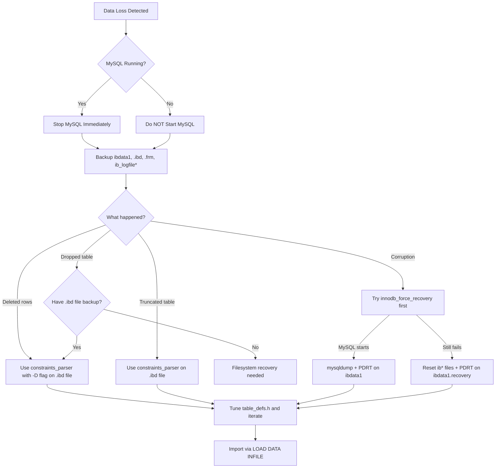

# InnoDB Recovery with PDRT

!!! danger "Active Data Loss?"
    If you have identified data loss on your server, skip directly to the [First Response](#first-response) section immediately. The longer MySQL remains online writing to your data files, the less likely recovery becomes. Every second counts.

[**Percona**](https://www.percona.com/) provides a set of tools for recovering lost or corrupted MySQL data from [**InnoDB**](https://dev.mysql.com/doc/refman/8.0/en/innodb-storage-engine.html) data files. The **Percona Data Recovery Tool** (PDRT) is freely available, and with some setup, can retrieve data that would otherwise be lost permanently or recover from InnoDB corruption that `innodb_force_recovery` cannot resolve.

PDRT is most useful in these scenarios:

- A mistaken `DROP TABLE`, `DELETE`, `TRUNCATE`, or `UPDATE`
- Deletion of the data file at the filesystem level
- Partial corruption where InnoDB cannot start, even with `innodb_force_recovery` set to its maximum value

This guide walks through the complete PDRT recovery workflow in a [**cPanel**](https://cpanel.net/)/WHM environment, though the core techniques apply to any MySQL installation.

---

## InnoDB File Architecture

Before attempting recovery, you need to understand what you are recovering from. InnoDB stores data across several file types, and knowing which files matter determines your recovery strategy.

### The System Tablespace: `ibdata1`

The **system tablespace** (`ibdata1`) is InnoDB's central file. It always exists, regardless of configuration. It contains:

- The **data dictionary** - metadata about every InnoDB table, index, and column
- The **doublewrite buffer** - a crash-recovery mechanism that prevents partial page writes
- The **change buffer** - cached changes to secondary indexes
- **Undo logs** - records needed to roll back uncommitted transactions

When `innodb_file_per_table` is disabled (the pre-MySQL 5.6 default), `ibdata1` also stores all table data and indexes. This makes it the single target for recovery - but also means it grows indefinitely and cannot be shrunk without rebuilding.

### Per-Table Files: `.ibd` and `.frm`

With `innodb_file_per_table=ON` (the default since MySQL 5.6 and the standard on all cPanel servers), each table gets its own `.ibd` file containing that table's data and indexes. The `.frm` file stores the table's structure definition.

This per-table layout simplifies some recovery scenarios because each table's data is isolated. However, it complicates `DROP TABLE` recovery because dropping a table removes both the `.ibd` and `.frm` files from the filesystem entirely.

!!! tip "MySQL 8.0 changes"
    MySQL 8.0 replaced the `.frm` files with a transactional data dictionary stored inside InnoDB itself. The recovery techniques in this guide still apply to the data files, but `.frm`-based schema extraction only works for MySQL 5.x and MariaDB.

### InnoDB Log Files: `ib_logfile*`

The **redo logs** (`ib_logfile0`, `ib_logfile1`) record every change before it reaches the data files. InnoDB replays these logs after a crash to bring the data files up to date. Deleting these files without understanding the server's state can cause permanent data loss if uncommitted transactions needed for recovery are still in the logs.

```quiz
question: "What is the relationship between ibdata1 and .ibd files in InnoDB?"
type: multiple-choice
options:
  - text: "ibdata1 is the main data file; .ibd files are backup copies"
    feedback: ".ibd files are not backups. They are the per-table data files used when innodb_file_per_table is enabled."
  - text: "ibdata1 is the system tablespace (metadata, undo logs); .ibd files store individual table data when file-per-table is enabled"
    correct: true
    feedback: "Correct! With innodb_file_per_table=ON (default since MySQL 5.6), each table gets its own .ibd file for data and indexes. ibdata1 always exists and contains the system tablespace: data dictionary, undo logs, change buffer, and doublewrite buffer. Without file-per-table, all table data lives in ibdata1."
  - text: "ibdata1 stores indexes; .ibd files store row data"
    feedback: "Both ibdata1 and .ibd files can contain both data and indexes. The split depends on whether file-per-table is enabled, not on data type."
  - text: ".ibd files are only used by Percona Server, not standard MySQL"
    feedback: ".ibd files are standard InnoDB (both MySQL and Percona Server). They are created when innodb_file_per_table is enabled, which is the default in modern MySQL."
```

---

## The PDRT Toolkit

PDRT includes three core utilities. If you are in an active data-loss scenario, skip to [First Response](#first-response) and come back here after your files are backed up.

### `constraints_parser`

The primary recovery tool. It scans raw InnoDB data files (either `ibdata1` or individual `.ibd` files) and extracts rows that match a defined table structure.

```bash
constraints_parser -4|-5|-6 [-dDV] -f <InnoDB page or dir> [-T N:M] [-b <external pages dir>]
```

| Flag | Purpose |
|------|---------|
| `-4` | REDUNDANT row format (MySQL 4.x) |
| `-5` | COMPACT row format (MySQL 5.0+) |
| `-6` | MySQL 5.6+ format |
| `-f` | Path to the InnoDB data file or directory of pages |
| `-d` | Process only pages that may contain deleted records |
| `-D` | Recover deleted rows only |
| `-U` | Recover undeleted rows only (default) |
| `-V` | Verbose mode with debug information |
| `-T N:M` | Filter to a specific index ID |
| `-b <dir>` | Directory for external BLOB pages |
| `-p prefix` | Prefix for the dump directory in LOAD DATA output |
| `-o <file>` | Save dump to a specific file |

### `page_parser`

Splits a tablespace file into individual pages grouped by index ID. This is needed when recovering from `ibdata1` in shared-tablespace configurations where you need to isolate specific table data.

```bash
page_parser -4|-5 [-dDhcCV] -f <innodb_datafile> [-T N:M] [-s size] [-t size]
```

| Flag | Purpose |
|------|---------|
| `-c` | Count pages and group by index ID |
| `-C` | Count pages, ignoring invalid index IDs |
| `-s size` | Disk cache size (e.g., `1G`, `10M`, default `100M`) |
| `-t size` | Override tablespace size detection |

### `create_defs.pl`

A Perl script that connects to a running MySQL instance and generates the `table_defs.h` header file that `constraints_parser` uses to identify row structures.

```bash
create_defs.pl --host=localhost --user=root --password=PASS --db=DATABASE --table=TABLE
```

```quiz
question: "What does constraints_parser do?"
type: multiple-choice
options:
  - text: "It repairs the InnoDB tablespace file in place"
    feedback: "constraints_parser does not repair files. It extracts data from them by scanning for valid row patterns."
  - text: "It scans InnoDB data files and extracts rows matching a defined table structure"
    correct: true
    feedback: "Correct! constraints_parser reads raw InnoDB tablespace files (ibdata1 or .ibd files) and uses a table definition file to identify and extract valid rows. It can recover data even from severely corrupted tablespaces where MySQL itself cannot start."
  - text: "It checks foreign key constraints and removes invalid references"
    feedback: "Despite the name, constraints_parser does not manage foreign keys. It uses 'constraints' (column definitions) to identify and extract row data from raw InnoDB pages."
  - text: "It converts InnoDB tables to MyISAM format for easier recovery"
    feedback: "constraints_parser does not convert formats. It extracts raw data from InnoDB files into tab-separated output that can be imported into a new database."
```

---

## First Response

Every data-loss scenario is different, but this section covers the critical first steps from the perspective of someone who has just discovered the loss and needs to act fast. As time passes after data loss, the likelihood of full recovery decreases - deleted data pages get reused, and the window for recovery closes.

### Step 1: Stop MySQL

If MySQL is still running, stop it immediately:

```bash
systemctl stop mysql
# Or on older systems:
/etc/init.d/mysql stop
```

The goal is to prevent new writes from overwriting space in the data files that still contains recoverable data. Deleted data is marked as free space, and InnoDB will reuse it for new writes.

### Step 2: Back Up InnoDB Data Files

Create a working copy of your data files. All recovery work should happen against copies, never the originals:

```bash
mkdir /root/innodb.bak
cd /var/lib/mysql
dd if=ibdata1 of=ibdata1.recovery conv=noerror
cp ibdata1.recovery /root/innodb.bak/
cp ib_logfile* /root/innodb.bak/
```

The `dd` command with `conv=noerror` creates a copy even if there are read errors on disk, which is essential when dealing with filesystem-level corruption.

### Step 3: Back Up the Database Directory

Copy the database directory containing the per-table `.ibd` and `.frm` files (replace `$db_name` with your database name):

```bash
cd /var/lib/mysql
cp -a ./$db_name /root/innodb.bak/
```

On cPanel servers, `innodb_file_per_table=1` is the default, so each table has its own `.ibd` file. This makes per-table recovery possible but also means a `DROP TABLE` removes the `.ibd` file entirely - recovery from a dropped table requires filesystem-level file recovery tools, which is beyond PDRT's scope.

### Step 4: Restart MySQL and Dump

With copies safely made, you can restart MySQL if it is able to start:

```bash
systemctl start mysql
```

If MySQL starts, take full dumps immediately:

```bash
mysqldump --single-transaction --all-databases > /root/dump_wtrans.sql
mysqldump --all-databases > /root/dump.sql
```

The `--single-transaction` flag takes a consistent snapshot without locking tables, which is important for InnoDB. Run both variants - if the InnoDB data is partially corrupted, one may succeed where the other fails.

!!! warning "Filesystem corruption"
    If you are dealing with filesystem-level corruption, copy your backup files to a different disk drive or a remote host. Do not keep your only copies on the potentially failing drive.

```quiz
question: "What should be your first action when discovering a corrupted InnoDB database?"
type: multiple-choice
options:
  - text: "Immediately run mysqlcheck --repair on all databases"
    feedback: "mysqlcheck --repair works for MyISAM tables. For InnoDB corruption, running repair commands without preparation can make things worse."
  - text: "Stop MySQL and make a full copy of the data directory before attempting any recovery"
    correct: true
    feedback: "Correct! Always preserve the original data before any recovery attempt. Copy the entire MySQL data directory (especially ibdata1, ib_logfile*, and the database directories). Recovery tools work against the raw files, and without a backup, a failed recovery attempt can destroy your only copy."
  - text: "Delete the ib_logfile files and restart MySQL"
    feedback: "Deleting InnoDB log files without understanding the state can cause data loss. The logs may contain uncommitted transactions needed for recovery."
  - text: "Restore from the most recent backup immediately"
    feedback: "Restoring from backup is often the best path, but first preserve the current data directory. The backup might be outdated, and you may need the current files for recovering recent data."
```

---

## Assessing the Situation

With your files backed up, the immediate time pressure is over. Take stock of what you are dealing with before proceeding.

### Data Loss Severity

| Scenario | Recovery Outlook |
|----------|-----------------|
| Deleted rows | Good - recoverable if MySQL was stopped quickly |
| Truncated table | Moderate - partial to full recovery depending on time elapsed |
| Widespread corruption | Surprisingly recoverable - PDRT can succeed where `innodb_force_recovery` fails |
| Dropped table (file-per-table on) | Difficult - requires filesystem-level recovery of the deleted `.ibd` file first |

### Existing Backups

If you have older backups or dumps, they are valuable even if outdated. The table structure from an old backup can serve as the template for PDRT's `table_defs.h`, which is essential for the recovery process.

If the table still exists in a running MySQL instance, capture its structure now:

```bash
mysql -NBe "SHOW CREATE TABLE table_name" database_name
```

### MySQL Version

Check your MySQL version - it determines which `constraints_parser` format flag to use:

```bash
mysql -V
```

| Version | Format Flag |
|---------|-------------|
| MySQL 4.x (REDUNDANT format) | `-4` |
| MySQL 5.0 - 5.5 (COMPACT format) | `-5` |
| MySQL 5.6+ / MariaDB 10.x+ | `-6` |

---

## Installing PDRT

The PDRT source is available from [Percona's GitHub repository](https://github.com/percona/percona-data-recovery-tool-for-innodb). The original Bazaar/Launchpad repository is no longer maintained.

### Download and Compile

```bash
cd /root
git clone https://github.com/percona/percona-data-recovery-tool-for-innodb.git pdrt
cd pdrt/mysql-source
./configure
cd ..
make
```

### Install Perl Dependencies

The `create_defs.pl` script requires the `DBD::mysql` Perl module. Check if it is installed:

```bash
perl -MDBD::mysql -e 1
```

If this prints an error about not finding `DBD/mysql.pm`, install it. On cPanel servers:

```bash
/scripts/perlinstaller DBD::mysql
```

On other systems:

```bash
cpanm DBD::mysql
# Or via package manager:
apt install libdbd-mysql-perl    # Debian/Ubuntu
dnf install perl-DBD-MySQL       # RHEL/Fedora
```

---

## Getting Your Table Structure

Recovery requires a table definition that tells `constraints_parser` what row structure to look for. How you obtain this depends on whether MySQL is running.

### If MySQL Is Running

**1. Create a recovery database:**

```bash
mysql -e "CREATE DATABASE mydb_recovered"
```

**2. Extract the table structure:**

```bash
mysql -NBe "SHOW CREATE TABLE customer" mydb
```

This produces the full `CREATE TABLE` statement. Save it - you will need it to recreate the table in your recovery database.

**3. Recreate the table in the recovery database:**

```sql
mysql mydb_recovered
SET foreign_key_checks=0;
CREATE TABLE `customer` (
  `customer_id` smallint(5) unsigned NOT NULL AUTO_INCREMENT,
  `store_id` tinyint(3) unsigned NOT NULL,
  `first_name` varchar(45) NOT NULL,
  `last_name` varchar(45) NOT NULL,
  `email` varchar(50) DEFAULT NULL,
  `address_id` smallint(5) unsigned NOT NULL,
  `active` tinyint(1) NOT NULL DEFAULT '1',
  `create_date` datetime NOT NULL,
  `last_update` timestamp NOT NULL DEFAULT CURRENT_TIMESTAMP ON UPDATE CURRENT_TIMESTAMP,
  PRIMARY KEY (`customer_id`),
  KEY `idx_fk_store_id` (`store_id`),
  KEY `idx_fk_address_id` (`address_id`),
  KEY `idx_last_name` (`last_name`),
  CONSTRAINT `fk_customer_address` FOREIGN KEY (`address_id`)
    REFERENCES `address` (`address_id`) ON UPDATE CASCADE,
  CONSTRAINT `fk_customer_store` FOREIGN KEY (`store_id`)
    REFERENCES `store` (`store_id`) ON UPDATE CASCADE
) ENGINE=InnoDB DEFAULT CHARSET=utf8;
```

!!! tip "Disabling foreign key checks"
    `SET foreign_key_checks=0` is required when recreating tables that reference other tables. Without it, `CREATE TABLE` fails if the referenced tables do not exist yet in the recovery database.

### If MySQL Will Not Start

**1. Try `innodb_force_recovery`:**

Add to `my.cnf` under `[mysqld]`:

```ini
innodb_force_recovery = 1
```

Start MySQL and try increasing the value from 1 through 6 until it starts. See the [MySQL documentation on forcing recovery](https://dev.mysql.com/doc/refman/8.0/en/forcing-innodb-recovery.html) for what each level does.

**2. Reset the InnoDB files as a last resort:**

If no recovery level works, move the InnoDB files aside so MySQL recreates fresh ones:

```bash
cd /var/lib/mysql
mv ibdata1 ibdata1.bak
mv ib_logfile0 ib_logfile0.bak
mv ib_logfile1 ib_logfile1.bak
systemctl start mysql
```

**3. Extract structure from `.frm` files:**

If you have the `.frm` file but MySQL cannot read the table, copy the `.frm` to a working MySQL instance (into a database directory where you have created a placeholder table with the same name), restart MySQL, and run `SHOW CREATE TABLE`.

Alternatively, the [MySQL Utilities](https://dev.mysql.com/doc/mysql-utilities/1.6/en/) package includes `mysqlfrm` for extracting structure directly from `.frm` files.

---

## Recovering Data

At this point you should have:

- A copy of `ibdata1.recovery` and/or the relevant `.ibd` files
- MySQL running with a recovery database containing the target table structures
- PDRT compiled and ready

### Automated Recovery

Generate the table definitions, compile, and run `constraints_parser` in one workflow:

```bash
cd /root/pdrt

# Generate table definitions from the recovery database
DB=mydb_recovered
TBL=customer
perl create_defs.pl \
  --host=localhost \
  --user=root \
  --password="$(grep pass /root/.my.cnf | cut -d= -f2 | sed -e 's/^"//' -e 's/"$//')" \
  --db=$DB \
  --table=$TBL > include/table_defs.h

# Recompile with the new definitions
make clean all

# Run constraints_parser against the data file
mkdir -p dumps/default
./constraints_parser -5 -f /root/innodb.bak/mydb/customer.ibd > dumps/default/customer
```

The output file `dumps/default/customer` contains tab-separated values for every row that matched the table definition. It will include both valid data and noise - rows where random data happened to match the column structure.

```terminal
title: Running constraints_parser for Data Recovery
steps:
  - command: "cd /root/pdrt && ./constraints_parser -5 -f /var/lib/mysql/ibdata1.recovery"
    output: |
      -- Parsing InnoDB tablespace: /var/lib/mysql/ibdata1.recovery
      -- Page size: 16384 bytes
      -- Scanning pages...
      -- Found 15234 candidate rows
      -- 14891 rows passed all constraints
      -- Output written to dumps/default/customer
    narration: "constraints_parser scans the raw tablespace file using the compiled table definition to identify valid rows. The -5 flag selects COMPACT row format for MySQL 5.x. 14891 of 15234 candidate rows passed validation. The 343 failures are likely corrupted or irrelevant pages."
  - command: "head -3 dumps/default/customer"
    output: |
      customer	1	1	"MARY"	"SMITH"	"MARY.SMITH@sakilacustomer.org"	5	1	"2006-02-14 22:04:36"	"2006-02-15 04:57:20"
      customer	2	1	"PATRICIA"	"JOHNSON"	"PATRICIA.JOHNSON@sakilacustomer.org"	6	1	"2006-02-14 22:04:36"	"2006-02-15 04:57:20"
      customer	3	1	"LINDA"	"WILLIAMS"	"LINDA.WILLIAMS@sakilacustomer.org"	7	1	"2006-02-14 22:04:36"	"2006-02-15 04:57:20"
    narration: "Output is tab-separated values matching the table definition columns. Each line starts with the table name. This can be loaded into a fresh MySQL table with LOAD DATA INFILE."
  - command: "mysql -e \"LOAD DATA LOCAL INFILE 'dumps/default/customer' INTO TABLE customer FIELDS TERMINATED BY '\\t' OPTIONALLY ENCLOSED BY '\\\"' LINES STARTING BY 'customer\\t'\" mydb_recovered"
    output: "Query OK, 14891 rows affected (0.42 sec)"
    narration: "Import the recovered data into the recovery database. The LINES STARTING BY clause skips the table name prefix. Verify row counts and spot-check data integrity after import."
```

### Manual Method with Custom Definitions

If the automated approach produces too much noise, you can run the tools manually with more control. Generate the table definitions:

```bash
cd /root/pdrt
DB=mydb_recovered; TBL=customer
perl create_defs.pl --host=localhost --user=root \
  --password="$(grep pass /root/.my.cnf | cut -d= -f2 | sed 's/^"//;s/"$//')" \
  --db=$DB --table=$TBL > include/table_defs.h
```

Recompile and run:

```bash
make clean all
./constraints_parser -5 -f /var/lib/mysql/ibdata1.recovery > recovery_output.tsv
```

To search specifically for deleted records, add the `-D` flag:

```bash
./constraints_parser -5 -Df /root/innodb.bak/mydb/customer.ibd
```

---

## Tuning Table Definitions

The default `table_defs.h` generated by `create_defs.pl` uses broad constraints that match many false positives. Tightening the constraints dramatically reduces noise in the recovery output.

Here is the auto-generated definition for a `first_name` column:

```c
{ /* varchar(45) */
    name: "first_name",
    type: FT_CHAR,
    min_length: 0,
    max_length: 135,

    has_limits: FALSE,
    limits: {
        can_be_null: FALSE,
        char_min_len: 0,
        char_max_len: 135,
        char_ascii_only: TRUE
    },

    can_be_null: FALSE
},
```

The key field is `has_limits: FALSE` - with limits disabled, `constraints_parser` accepts any data that structurally fits the column type. Enabling limits and tightening them filters out garbage data:

| Field | Default | Tuned | Reasoning |
|-------|---------|-------|-----------|
| `has_limits` | `FALSE` | `TRUE` | Enable constraint checking |
| `can_be_null` | `FALSE` | `FALSE` | Every customer has a first name |
| `char_min_len` | `0` | `2` | No single-character first names in this dataset |
| `char_max_len` | `135` | `30` | No first name exceeds 30 characters |
| `char_ascii_only` | `TRUE` | `TRUE` | Names in this table are ASCII |

The tuned definition:

```c
{ /* varchar(45) */
    name: "first_name",
    type: FT_CHAR,
    min_length: 0,
    max_length: 135,

    has_limits: TRUE,
    limits: {
        can_be_null: FALSE,
        char_min_len: 2,
        char_max_len: 30,
        char_ascii_only: TRUE
    },

    can_be_null: FALSE
},
```

After editing `include/table_defs.h`, recompile and run again:

```bash
cd /root/pdrt && make clean all
./constraints_parser -5 -Df /root/innodb.bak/mydb/customer.ibd
```

With tightened constraints, a search that previously returned thousands of false positives may return exactly the rows you need.

```quiz
question: "What effect does setting has_limits to TRUE in table_defs.h have on constraints_parser output?"
type: multiple-choice
options:
  - text: "It makes the recovery process faster by skipping pages"
    feedback: "has_limits does not affect which pages are scanned. It affects which candidate rows pass validation after being found."
  - text: "It enables the constraint fields (char_min_len, char_max_len, can_be_null) to filter out rows that do not match your expected data patterns"
    correct: true
    feedback: "Correct! With has_limits set to TRUE, constraints_parser uses the limits block to validate each candidate row. Rows where a column value falls outside the specified min/max length, contains nulls when not allowed, or has non-ASCII characters when ascii_only is set are filtered out. This dramatically reduces false positives in the output."
  - text: "It prevents constraints_parser from overwriting existing data files"
    feedback: "constraints_parser is a read-only tool. It never writes to the source data files regardless of the has_limits setting."
  - text: "It changes the output format from tab-separated to CSV"
    feedback: "The output format is always tab-separated. has_limits only affects which rows are included in the output."
```

---

## Importing Recovered Data

Once you have clean recovery output, you need to import it back into MySQL. The `constraints_parser` output includes both the data (on stdout) and the `LOAD DATA INFILE` SQL statement (on stderr).

### Splitting Output and SQL

```bash
mkdir -p /root/pdrt/dumps/mydb_recovered

./constraints_parser -5 -Df /root/innodb.bak/mydb/customer.ibd -p mydb_recovered \
  > dumps/mydb_recovered/customer \
  2> customer.sql

# Remove progress lines from the SQL file
sed -i '/done/d' customer.sql
```

The `-p mydb_recovered` flag sets the dump path prefix in the generated `LOAD DATA` statement. The SQL file will contain something like:

```sql
SET FOREIGN_KEY_CHECKS=0;
LOAD DATA INFILE '/root/pdrt/dumps/mydb_recovered/customer'
  REPLACE INTO TABLE `customer`
  FIELDS TERMINATED BY '\t' OPTIONALLY ENCLOSED BY '"'
  LINES STARTING BY 'customer\t'
  (`customer_id`, `store_id`, `first_name`, `last_name`, `email`,
   `address_id`, `active`, `create_date`, `last_update`);
```

The `LINES STARTING BY 'customer\t'` clause is important - it skips all the page metadata comments in the dump file and only imports lines that begin with the table name followed by a tab.

### Running the Import

```bash
mysql mydb_recovered < /root/pdrt/customer.sql
```

If you get an error about being unable to stat the dump file:

```
ERROR 13 (HY000) at line 2: Can't get stat of '/root/pdrt/dumps/mydb_recovered/customer' (Errcode: 13)
```

Change `LOAD DATA INFILE` to `LOAD DATA LOCAL INFILE`:

```bash
sed -i 's/LOAD DATA INFILE/LOAD DATA LOCAL INFILE/g' /root/pdrt/customer.sql
mysql mydb_recovered < /root/pdrt/customer.sql
```

### Verifying the Results

```bash
mysql mydb_recovered -e "SELECT COUNT(*) FROM customer"
mysql mydb_recovered -e "SELECT * FROM customer LIMIT 5"
```

Compare row counts and spot-check data against any existing backups or dumps you have.

```code-walkthrough
language: bash
title: Complete PDRT Recovery Workflow
code: |
  systemctl stop mysql
  cp -a /var/lib/mysql /var/lib/mysql.backup
  cd /root/pdrt
  perl create_defs.pl --host=localhost --user=root --db=mydb_recovered --table=customer > include/table_defs.h
  make clean all
  mkdir -p dumps/mydb_recovered
  ./constraints_parser -5 -Df /var/lib/mysql.backup/mydb/customer.ibd -p mydb_recovered > dumps/mydb_recovered/customer 2> customer.sql
  sed -i '/done/d' customer.sql
  sed -i 's/LOAD DATA INFILE/LOAD DATA LOCAL INFILE/g' customer.sql
  mysql mydb_recovered < customer.sql
annotations:
  - line: 1
    text: "Stop MySQL first. Preventing new writes protects recoverable data from being overwritten."
  - line: 2
    text: "Copy the entire data directory BEFORE any recovery attempt. cp -a preserves permissions and ownership. This is your safety net."
  - line: 4
    text: "create_defs.pl generates the table_defs.h header from the MySQL schema. If MySQL will not start, you need to write this manually from a backup of the schema."
  - line: 5
    text: "Recompile PDRT with the new table definitions. The constraints are compiled into the binary, so this step is required after every table_defs.h change."
  - line: 7
    text: "Run constraints_parser against the .ibd file (file-per-table) or ibdata1 (shared tablespace). The -5 flag selects COMPACT page format. The -D flag targets deleted rows specifically."
  - line: 8
    text: "Strip progress percentage lines from the SQL file. Only valid SQL statements should remain."
  - line: 9
    text: "Fix the LOCAL INFILE issue that occurs on most MySQL installations. Without LOCAL, MySQL tries to read the file as the mysqld process, which usually lacks permission."
  - line: 10
    text: "Import the recovered data into the recovery database. Verify row counts and spot-check data integrity after import."
```

---

## Recovery Decision Flowchart

Use this to determine your recovery path based on the scenario:



---

## Practical Exercise

```exercise
title: PDRT Recovery Planning
type: scenario
scenario: |
  You are a sysadmin on a cPanel server running MySQL 5.7 with innodb_file_per_table=ON. A developer accidentally ran `DELETE FROM orders WHERE status = 'pending'` without a WHERE clause on the date column, deleting 3 months of pending orders (approximately 50,000 rows). The developer noticed the mistake 2 minutes later and contacted you. MySQL is still running. The `orders` table still exists with its remaining data (completed and shipped orders are unaffected).

  Plan your recovery steps.
tasks:
  - task: "What is your first action and why?"
    hint: "Think about what is happening to the deleted data right now while MySQL is running."
    answer: "Stop MySQL immediately with `systemctl stop mysql`. The deleted rows are marked as free space in the .ibd file, and InnoDB will reuse those pages for new writes. Every second MySQL runs increases the chance of overwriting recoverable data."
  - task: "Which files do you need to back up, and what commands would you use?"
    hint: "Consider which InnoDB files contain the data you need to recover."
    answer: "Back up the orders table .ibd file and the system tablespace: `mkdir /root/recovery && cd /var/lib/mysql && dd if=ibdata1 of=/root/recovery/ibdata1.recovery conv=noerror && cp -a ./mydb/orders.ibd /root/recovery/ && cp -a ./mydb/orders.frm /root/recovery/`"
  - task: "Which constraints_parser flags would you use and why?"
    hint: "Consider the MySQL version and whether you want deleted rows specifically."
    answer: "Use `-5 -Df`: `-5` for MySQL 5.7 COMPACT format, `-D` to specifically target deleted rows (the rows you want to recover were DELETEd), and `-f` to specify the .ibd file path. Run against the backup copy: `./constraints_parser -5 -Df /root/recovery/orders.ibd`"
  - task: "After recovering the data, how would you verify the recovery was successful?"
    hint: "Think about what you know about the deleted data."
    answer: "Compare the recovered row count against the expected ~50,000 deleted rows. Check that all recovered rows have status='pending'. Verify date ranges look correct. Cross-reference with any application logs that recorded order IDs. Import into the recovery database and run `SELECT COUNT(*), MIN(order_date), MAX(order_date) FROM orders WHERE status='pending'` to sanity-check the data."
```

---

## Further Reading

- [MySQL InnoDB Storage Engine Documentation](https://dev.mysql.com/doc/refman/8.0/en/innodb-storage-engine.html) - official InnoDB reference for file formats, recovery, and configuration
- [Percona Data Recovery Tool (GitHub)](https://github.com/percona/percona-data-recovery-tool-for-innodb) - PDRT source code and documentation
- [InnoDB Recovery with innodb_force_recovery](https://dev.mysql.com/doc/refman/8.0/en/forcing-innodb-recovery.html) - MySQL documentation on the force recovery levels
- [Percona XtraBackup](https://docs.percona.com/percona-xtrabackup/8.0/) - hot backup tool for InnoDB that avoids the need for PDRT in many scenarios
- [How to Recover a Single InnoDB Table from a Full Backup](https://www.percona.com/blog/how-to-recover-a-single-innodb-table-from-a-full-backup/) - Percona blog on targeted table recovery

---

**Previous:** [Scaling & Architecture Patterns](scaling-and-architecture.md) | [Back to Index](README.md)
