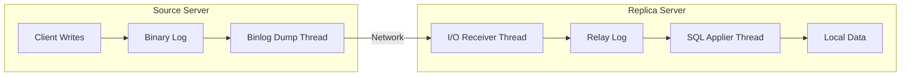
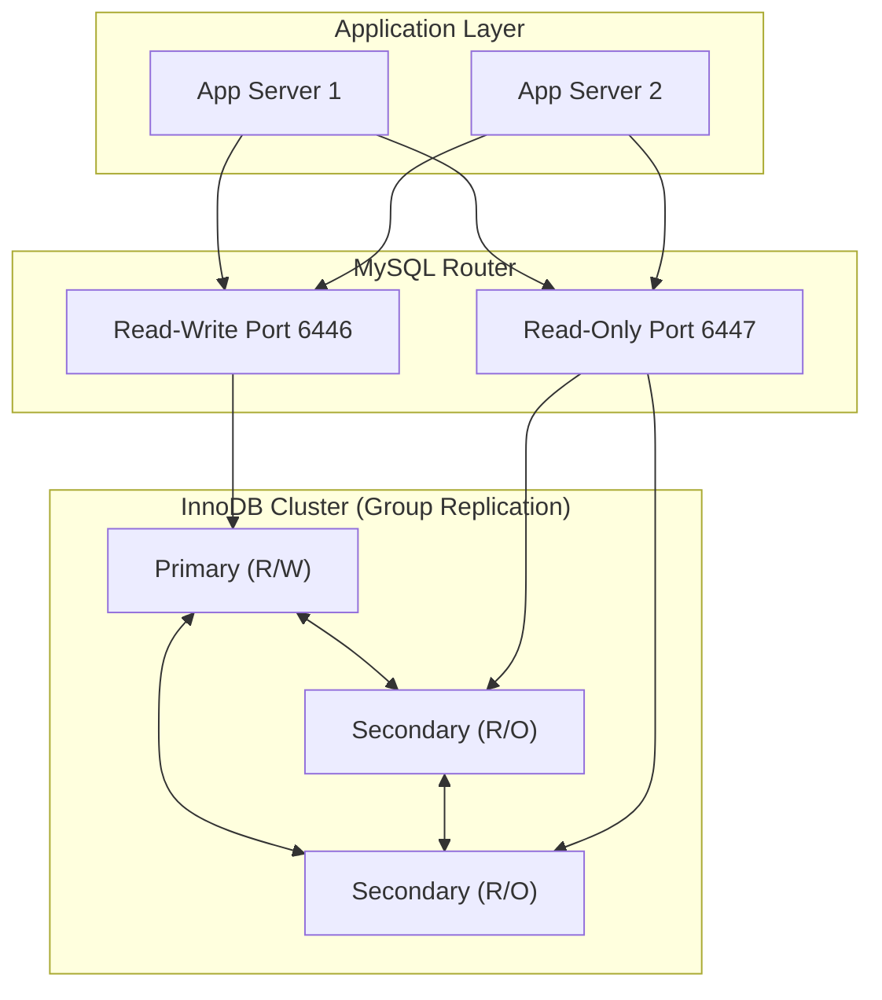

# MySQL Replication & High Availability

A single MySQL server is a single point of failure. Every production database needs a plan for scaling reads, surviving hardware failures, and minimizing downtime during maintenance. MySQL provides several replication mechanisms - from basic binary log replication to fully automated clustering - and the right choice depends on your availability requirements, data consistency needs, and operational complexity budget.

This guide covers the replication landscape from the ground up: how binary log replication works, modern GTID-based topologies, semi-synchronous durability guarantees, Group Replication for automatic failover, and the tooling that ties it all together.

---

## Binary Log Replication

**Binary log replication** is the foundation of all MySQL replication. Every other replication method builds on this mechanism. The concept is straightforward: the source server writes every data-modifying event to a binary log, and one or more replica servers read those events and replay them locally.

### How It Works

The replication process involves three threads:

1. **Binlog dump thread** (on the source) - reads the binary log and sends events to the replica
2. **I/O receiver thread** (on the replica) - connects to the source, receives events, and writes them to the **relay log**
3. **SQL applier thread** (on the replica) - reads events from the relay log and executes them against the local database



The relay log acts as a buffer. If the SQL applier thread falls behind, the I/O thread can continue receiving events without blocking the source. This separation means a slow replica does not slow down the source server.

### Binary Log Formats

MySQL supports three **binlog formats**, controlled by the `binlog_format` variable:

| Format | How It Logs | Pros | Cons |
|--------|-------------|------|------|
| `STATEMENT` | The SQL statement itself | Small log size, human-readable | Non-deterministic functions (`NOW()`, `UUID()`) can produce different results on replicas |
| `ROW` | The before/after image of each modified row | Deterministic, safe for all queries | Larger log size, especially for bulk updates |
| `MIXED` | Statement-based by default, switches to row-based when needed | Balances size and safety | Harder to predict which format is used |

!!! tip "Use ROW format"
    `ROW` is the default since MySQL 5.7.7 and the recommended format for all new deployments. The deterministic behavior eliminates an entire class of replication bugs. The increased log size is a worthwhile trade-off for reliability.

### Configuring the Source

On the source server, enable the binary log and assign a unique server ID in `my.cnf`:

```ini
[mysqld]
server-id         = 1
log-bin           = mysql-bin
binlog-format     = ROW
sync-binlog       = 1
```

Setting `sync_binlog = 1` forces the binary log to disk on every commit. This prevents data loss if the source crashes, at the cost of additional disk I/O.

Create a replication user with the required privilege:

```sql
CREATE USER 'repl'@'10.0.0.%' IDENTIFIED BY 'strong_password_here';
GRANT REPLICATION SLAVE ON *.* TO 'repl'@'10.0.0.%';
```

### Configuring the Replica

On the replica, set a unique server ID and configure the connection to the source:

```ini
[mysqld]
server-id         = 2
relay-log         = relay-bin
read-only         = ON
```

Then point the replica at the source using the binary log file and position:

```sql
CHANGE REPLICATION SOURCE TO
    SOURCE_HOST = '10.0.0.1',
    SOURCE_USER = 'repl',
    SOURCE_PASSWORD = 'strong_password_here',
    SOURCE_LOG_FILE = 'mysql-bin.000001',
    SOURCE_LOG_POS = 154;

START REPLICA;
```

The `SOURCE_LOG_FILE` and `SOURCE_LOG_POS` values come from `SHOW MASTER STATUS` on the source (or from a backup's metadata). Getting these wrong means the replica starts reading from the wrong position - it will either skip transactions or try to replay events that have already been applied.

!!! warning "File-and-position pitfalls"
    Binary log file names and positions are fragile. They change after log rotation, are specific to a single source, and make it difficult to re-point a replica to a new source after failover. GTID replication (covered next) eliminates these problems.

```quiz
question: "In MySQL binary log replication, what is the role of the relay log on the replica?"
type: multiple-choice
options:
  - text: "It stores the binary log events received from the source before the SQL applier thread executes them"
    correct: true
    feedback: "Correct! The relay log acts as a buffer between the I/O receiver thread and the SQL applier thread. The I/O thread writes events from the source's binary log into the relay log, and the SQL applier thread reads from the relay log to execute them locally. This decoupling means a slow applier does not block event reception."
  - text: "It is a backup copy of the source's binary log for disaster recovery"
    feedback: "The relay log is not a backup mechanism. It is a local staging area for replication events that the replica has received but not yet applied. It is automatically purged after events are applied."
  - text: "It records all read queries on the replica for auditing purposes"
    feedback: "The relay log only contains write events from the source's binary log. Read queries are not logged in the relay log or the binary log."
  - text: "It prevents the replica from accepting direct writes"
    feedback: "Read-only mode (read_only=ON) prevents direct writes to the replica. The relay log is purely a replication data channel, not an access control mechanism."
```

---

## GTID Replication

**Global Transaction Identifiers** (GTIDs) replace file-and-position tracking with a globally unique identifier for every transaction. Each GTID has the format `server_uuid:transaction_id` - for example, `3E11FA47-71CA-11E1-9E33-C80AA9429562:42`.

The `server_uuid` is automatically generated when MySQL initializes and stored in `auto.cnf`. The `transaction_id` is a monotonically increasing integer per server. Together, they guarantee that every transaction across the entire replication topology has a unique identity.

### Why GTIDs Matter

With file-and-position replication, each replica tracks where it is reading from a specific source's binary log. If that source fails and you need to point the replica at a different server, you have to manually calculate the equivalent position in the new server's binary log. This is error-prone and often requires tools like [**`mysqlbinlog`**](https://dev.mysql.com/doc/refman/8.0/en/mysqlbinlog.html) to correlate positions.

With GTIDs, every server knows exactly which transactions it has executed (tracked in `gtid_executed`). When you point a replica at a new source, it simply says "I've executed these GTIDs, send me everything I'm missing." The source computes the difference and starts streaming.

### Enabling GTID Replication

On both source and replica, add to `my.cnf`:

```ini
[mysqld]
gtid-mode                = ON
enforce-gtid-consistency = ON
log-bin                  = mysql-bin
log-replica-updates      = ON
```

`enforce_gtid_consistency` blocks statements that cannot be safely represented as a single GTID (such as `CREATE TABLE ... SELECT` or transactions mixing InnoDB and non-transactional engines). This restriction is the trade-off for GTID's reliability.

`log_replica_updates` makes replicas write received events to their own binary log, which is required for chained replication (replica of a replica) and for any replica to serve as a failover candidate.

### Configuring a GTID Replica

With GTIDs, the `CHANGE REPLICATION SOURCE` command is simpler because you do not need file names or positions:

```sql
CHANGE REPLICATION SOURCE TO
    SOURCE_HOST = '10.0.0.1',
    SOURCE_USER = 'repl',
    SOURCE_PASSWORD = 'strong_password_here',
    SOURCE_AUTO_POSITION = 1;

START REPLICA;
```

`SOURCE_AUTO_POSITION = 1` tells the replica to use GTID-based auto-positioning. The replica sends its `gtid_executed` set to the source, and the source determines what to send.

### Inspecting GTID State

Check which transactions have been executed:

```sql
SELECT @@gtid_executed;
-- 3E11FA47-71CA-11E1-9E33-C80AA9429562:1-42
```

Check which transactions have been received but not yet applied:

```sql
SELECT RECEIVED_TRANSACTION_SET
FROM performance_schema.replication_connection_status;
```

```quiz
question: "What is the primary advantage of GTID replication over traditional file-and-position replication?"
type: multiple-choice
options:
  - text: "GTIDs make replication faster by compressing binary log events"
    feedback: "GTIDs do not affect the speed or compression of binary log events. They change the tracking mechanism, not the transport mechanism."
  - text: "GTIDs allow a replica to automatically determine which transactions it needs from any source, simplifying failover"
    correct: true
    feedback: "Correct! Each GTID is globally unique (server_uuid:transaction_id). A replica tracks its gtid_executed set and can request missing transactions from any server that has them. This makes re-pointing replicas after failover straightforward - no need to manually calculate binary log positions."
  - text: "GTIDs eliminate the need for binary logs entirely"
    feedback: "GTIDs still use binary logs to transport events. The GTID is metadata attached to each binary log event. You must have log-bin enabled for GTID replication."
  - text: "GTIDs guarantee zero replication lag"
    feedback: "GTIDs do not affect replication lag. Lag depends on network speed, replica hardware, and query complexity. GTIDs improve topology management and failover, not performance."
```

---

## Semi-Synchronous Replication

Standard MySQL replication is **asynchronous** - the source commits a transaction and returns success to the client without waiting for any replica to acknowledge receipt. If the source crashes immediately after committing, committed transactions may be lost because no replica received them.

**Semi-synchronous replication** addresses this gap. With semi-sync enabled, the source waits after each commit until at least one replica acknowledges that it has received and written the event to its relay log. Only then does the source return success to the client.

### The Durability Guarantee

Semi-sync does not guarantee that replicas have applied the transaction - only that they have received and persisted it in the relay log. This is enough to guarantee that the transaction survives a source crash, because at least one replica has the data and can be promoted.

### The Performance Trade-off

Every transaction now includes a network round trip to at least one replica. On a local network, this adds sub-millisecond latency. Across data centers, it can add tens of milliseconds per commit. For write-heavy workloads, this overhead can be significant.

If no replica acknowledges within `rpl_semi_sync_source_timeout` milliseconds (default: 10000), the source falls back to asynchronous replication. This prevents a replica failure from hanging the source indefinitely.

### Configuration

Install and enable the semi-sync plugins on the source:

```sql
INSTALL PLUGIN rpl_semi_sync_source SONAME 'semisync_source.so';
SET GLOBAL rpl_semi_sync_source_enabled = 1;
SET GLOBAL rpl_semi_sync_source_timeout = 5000;  -- 5 seconds before fallback
```

On each replica:

```sql
INSTALL PLUGIN rpl_semi_sync_replica SONAME 'semisync_replica.so';
SET GLOBAL rpl_semi_sync_replica_enabled = 1;
```

Make these persistent by adding to `my.cnf`:

```ini
# Source
[mysqld]
rpl_semi_sync_source_enabled = 1
rpl_semi_sync_source_timeout = 5000

# Replica
[mysqld]
rpl_semi_sync_replica_enabled = 1
```

Monitor semi-sync status:

```sql
SHOW STATUS LIKE 'Rpl_semi_sync%';
```

Key variables to watch:

| Variable | Meaning |
|----------|---------|
| `Rpl_semi_sync_source_status` | `ON` if semi-sync is active, `OFF` if fallen back to async |
| `Rpl_semi_sync_source_no_tx` | Transactions committed without semi-sync acknowledgment |
| `Rpl_semi_sync_source_yes_tx` | Transactions committed with semi-sync acknowledgment |
| `Rpl_semi_sync_source_avg_wait_time` | Average time waiting for replica acknowledgment |

!!! note "MySQL 8.0.26+ naming"
    MySQL 8.0.26 renamed the semi-sync plugin from `rpl_semi_sync_master`/`rpl_semi_sync_slave` to `rpl_semi_sync_source`/`rpl_semi_sync_replica`. The old names still work as aliases but are deprecated.

---

## Group Replication

[**MySQL Group Replication**](https://dev.mysql.com/doc/refman/8.0/en/group-replication.html) goes beyond traditional source-replica topologies. It provides a fault-tolerant replication mechanism where a group of servers coordinate through a **consensus protocol** (based on Paxos). If a server fails, the remaining members automatically reconfigure the group - no external failover tool needed.

### How It Works

Every server in a Group Replication cluster is a full member of the group. When a member commits a transaction, the transaction is broadcast to all members through the group communication system. The group uses a consensus protocol to agree on the ordering of transactions. Only after a majority of members acknowledge the transaction is it considered committed.

This majority-based consensus means a group of `N` members can tolerate up to `(N-1)/2` failures. A 3-member group tolerates 1 failure; a 5-member group tolerates 2.

### Single-Primary vs Multi-Primary

Group Replication supports two modes:

**Single-primary mode** (default and recommended): One member is elected as the primary and accepts writes. All other members are read-only secondaries. If the primary fails, the group automatically elects a new primary from the remaining members.

**Multi-primary mode**: All members accept writes simultaneously. The group uses certification-based conflict detection to identify conflicting transactions. If two members modify the same row concurrently, one transaction is rolled back. This mode is useful for write-heavy workloads distributed across multiple locations, but conflict handling adds complexity.

| Feature | Single-Primary | Multi-Primary |
|---------|---------------|---------------|
| Write endpoint | One server | Any server |
| Conflict handling | Not needed | Certification-based rollback |
| Complexity | Lower | Higher |
| Best for | Most workloads | Geographically distributed writes |

### Basic Configuration

Each member needs Group Replication configured in `my.cnf`:

```ini
[mysqld]
server-id                          = 1
gtid-mode                          = ON
enforce-gtid-consistency           = ON
log-bin                            = mysql-bin
log-replica-updates                = ON
binlog-checksum                    = NONE
relay-log-info-repository          = TABLE
transaction-write-set-extraction   = XXHASH64

# Group Replication settings
plugin-load-add                    = group_replication.so
group_replication_group_name       = "aaaaaaaa-bbbb-cccc-dddd-eeeeeeeeeeee"
group_replication_start_on_boot    = OFF
group_replication_local_address    = "10.0.0.1:33061"
group_replication_group_seeds      = "10.0.0.1:33061,10.0.0.2:33061,10.0.0.3:33061"
group_replication_single_primary_mode = ON
```

The `group_replication_group_name` is a UUID that identifies the group. All members must use the same value. Generate one with `SELECT UUID()`.

Bootstrap the group on the first member:

```sql
SET GLOBAL group_replication_bootstrap_group = ON;
START GROUP_REPLICATION;
SET GLOBAL group_replication_bootstrap_group = OFF;
```

Then join additional members:

```sql
START GROUP_REPLICATION;
```

!!! danger "Never bootstrap twice"
    Only bootstrap the group once, on the first member. Bootstrapping a second time creates a split-brain situation - two separate groups with the same name, each believing it is authoritative.

```quiz
question: "In a 5-member MySQL Group Replication cluster, how many member failures can the cluster tolerate while still accepting writes?"
type: multiple-choice
options:
  - text: "1 failure"
    feedback: "A 5-member group can tolerate more than 1 failure. The formula is (N-1)/2, so (5-1)/2 = 2."
  - text: "2 failures"
    correct: true
    feedback: "Correct! Group Replication uses majority-based consensus. A group of N members needs a majority (more than N/2) to form a quorum. With 5 members, the majority is 3, so the group can lose 2 members and still have a quorum of 3 to accept writes."
  - text: "3 failures"
    feedback: "With only 2 surviving members out of 5, the group cannot form a majority (needs 3). The cluster would become read-only."
  - text: "4 failures"
    feedback: "A single remaining member cannot form a majority. The cluster would be completely non-functional."
```

---

## InnoDB Cluster

**InnoDB Cluster** is MySQL's integrated high-availability solution. It combines three components into a managed stack:

1. **Group Replication** - provides the underlying data replication and automatic failover
2. [**MySQL Shell**](https://dev.mysql.com/doc/mysql-shell/8.0/en/) - provides the administration interface for creating and managing the cluster
3. [**MySQL Router**](https://dev.mysql.com/doc/mysql-router/8.0/en/) - provides transparent connection routing so applications do not need to know which server is the primary



### Setup Workflow

The typical setup uses MySQL Shell's AdminAPI:

**Step 1**: Prepare each server instance:

```javascript
// In MySQL Shell (mysqlsh)
dba.configureInstance('root@10.0.0.1:3306');
dba.configureInstance('root@10.0.0.2:3306');
dba.configureInstance('root@10.0.0.3:3306');
```

This checks and applies the configuration requirements (GTID mode, binary logging, etc.).

**Step 2**: Create the cluster on the first instance:

```javascript
shell.connect('root@10.0.0.1:3306');
var cluster = dba.createCluster('production');
```

**Step 3**: Add the remaining instances:

```javascript
cluster.addInstance('root@10.0.0.2:3306');
cluster.addInstance('root@10.0.0.3:3306');
```

**Step 4**: Check cluster status:

```javascript
cluster.status();
```

**Step 5**: Bootstrap MySQL Router on each application server:

```bash
mysqlrouter --bootstrap root@10.0.0.1:3306 --directory /opt/mysqlrouter
/opt/mysqlrouter/start.sh
```

MySQL Router automatically discovers the cluster topology and routes read-write connections to the primary and read-only connections to the secondaries. When the primary fails and Group Replication elects a new one, Router detects the change and reroutes traffic - no application changes needed.

### Checking Cluster Health

```javascript
// In MySQL Shell
shell.connect('root@10.0.0.1:3306');
var cluster = dba.getCluster();
cluster.status();
```

The output shows the status of each member, its role (PRIMARY or SECONDARY), and any replication issues.

---

## ProxySQL

[**ProxySQL**](https://proxysql.com/) is a high-performance proxy that sits between your application and MySQL. It provides connection pooling, read/write splitting, query routing, and query caching without modifying application code.

### Connection Routing

ProxySQL maintains two **hostgroups**: one for writes (the primary) and one for reads (the replicas). Applications connect to ProxySQL on a single port, and ProxySQL routes queries to the appropriate hostgroup based on configurable rules.

### Basic Setup

ProxySQL uses its own admin interface (default port 6032) for configuration. All configuration is stored in a SQLite database and applied at runtime.

Add your MySQL servers:

```sql
-- Connect to ProxySQL admin interface
-- mysql -u admin -padmin -h 127.0.0.1 -P 6032

-- Hostgroup 0 = writes (primary), Hostgroup 1 = reads (replicas)
INSERT INTO mysql_servers (hostgroup_id, hostname, port) VALUES
    (0, '10.0.0.1', 3306),
    (1, '10.0.0.2', 3306),
    (1, '10.0.0.3', 3306);

LOAD MYSQL SERVERS TO RUNTIME;
SAVE MYSQL SERVERS TO DISK;
```

### Read/Write Splitting

Configure query rules to route `SELECT` queries to the read hostgroup:

```sql
-- Route all SELECTs to hostgroup 1 (replicas)
INSERT INTO mysql_query_rules (rule_id, active, match_pattern, destination_hostgroup)
    VALUES (1, 1, '^SELECT.*', 1);

-- Route SELECT ... FOR UPDATE to hostgroup 0 (primary) since it acquires locks
INSERT INTO mysql_query_rules (rule_id, active, match_pattern, destination_hostgroup)
    VALUES (2, 1, '^SELECT.*FOR UPDATE', 0);

LOAD MYSQL QUERY RULES TO RUNTIME;
SAVE MYSQL QUERY RULES TO DISK;
```

Rules are evaluated in `rule_id` order. More specific rules should have lower `rule_id` values if you want them evaluated first, or use the `flagIN`/`flagOUT` chaining mechanism for complex routing logic.

### User Configuration

Add MySQL users that ProxySQL will use:

```sql
INSERT INTO mysql_users (username, password, default_hostgroup)
    VALUES ('app_user', 'app_password', 0);

LOAD MYSQL USERS TO RUNTIME;
SAVE MYSQL USERS TO DISK;
```

The `default_hostgroup` is used when no query rule matches (typically set to the write hostgroup so unclassified queries go to the primary).

!!! tip "ProxySQL vs MySQL Router"
    MySQL Router is the simpler choice when using InnoDB Cluster - it integrates tightly and requires minimal configuration. ProxySQL is more powerful for custom routing, query caching, connection multiplexing, and mixed environments where you need fine-grained control over how traffic reaches your databases.

---

## Failover Patterns

When a source server fails, you need a plan to promote a replica. The complexity of this process depends on your replication topology and tooling.

### Manual Failover

With basic binary log replication, failover is a manual process:

1. Identify the most up-to-date replica (the one with the highest executed GTID set, or the most recent relay log position)
2. Ensure the replica has applied all events in its relay log
3. Promote the replica: `STOP REPLICA; RESET REPLICA ALL;`
4. Disable read-only mode: `SET GLOBAL read_only = OFF;`
5. Re-point remaining replicas to the new source
6. Update application connection strings or DNS records

With GTID replication, step 5 is straightforward - each replica uses `SOURCE_AUTO_POSITION = 1` and automatically catches up from the new source. Without GTIDs, you must calculate the correct binary log position on the new source for each remaining replica.

### Automatic Failover with InnoDB Cluster

InnoDB Cluster handles failover automatically. When the primary fails:

1. Group Replication detects the failure (typically within seconds)
2. The remaining members elect a new primary based on a configurable weight
3. MySQL Router detects the topology change and reroutes write traffic
4. Applications continue without intervention

### Automatic Failover with Orchestrator

[**Orchestrator**](https://github.com/openark/orchestrator) is an external topology manager for MySQL replication. It continuously monitors the replication topology, detects failures, and can perform automated failover. Orchestrator is widely used in environments that run traditional (non-Group Replication) topologies and need automated recovery.

Orchestrator works by:

- Periodically polling each MySQL instance for its replication status
- Maintaining a topology map in its own backend database
- Running configurable recovery hooks (promotion scripts, DNS updates, VIP failover) when a failure is detected

### Split-Brain Prevention

**Split-brain** occurs when two servers both believe they are the primary and accept writes simultaneously. This causes divergent data that is difficult or impossible to reconcile.

Prevention strategies:

| Strategy | How It Works |
|----------|-------------|
| Quorum-based consensus | Group Replication requires a majority of members to agree before accepting writes. A partitioned minority cannot form quorum and stops accepting writes. |
| Fencing | Before promoting a new primary, ensure the old primary is truly down (STONITH - "Shoot The Other Node In The Head"). This can mean powering off the old server via IPMI/iLO or revoking its network access. |
| Lease-based leadership | The primary holds a time-limited lease (in a consensus store like etcd). If it cannot renew the lease, it stops accepting writes. Only a server holding a valid lease can serve as primary. |

---

## Monitoring Replication Lag

Replication lag - the delay between a transaction committing on the source and being applied on the replica - is the most important replication health metric. A lagging replica serves stale data, which can cause application bugs that are difficult to diagnose.

### Seconds_Behind_Master

The built-in metric from `SHOW REPLICA STATUS`:

```sql
SHOW REPLICA STATUS\G
```

Look for the `Seconds_Behind_Source` field (historically `Seconds_Behind_Master`). This value represents the difference between the replica's clock and the timestamp of the event it is currently applying.

The problem: this metric is unreliable. It resets to `0` when the SQL thread is idle (even if the I/O thread is behind), jumps erratically during large transactions, and does not account for clock drift between servers.

### Heartbeat Tables

A more reliable approach: write a timestamp to a table on the source at regular intervals and measure the difference on the replica.

Create the heartbeat table:

```sql
CREATE TABLE IF NOT EXISTS replication_heartbeat (
    id        INT PRIMARY KEY,
    ts        TIMESTAMP(6) NOT NULL,
    server_id INT NOT NULL
);
```

On the source, update the timestamp periodically (via a cron job or daemon):

```sql
REPLACE INTO replication_heartbeat (id, ts, server_id) VALUES (1, NOW(6), @@server_id);
```

On the replica, measure the lag:

```sql
SELECT TIMESTAMPDIFF(MICROSECOND, ts, NOW(6)) / 1000000 AS lag_seconds
FROM replication_heartbeat
WHERE id = 1;
```

### pt-heartbeat

[**`pt-heartbeat`**](https://docs.percona.com/percona-toolkit/pt-heartbeat.html) from Percona Toolkit automates the heartbeat approach. It is the industry standard for measuring replication lag:

Start the daemon on the source:

```bash
pt-heartbeat --update --database percona --create-table --daemonize
```

Monitor lag from the replica:

```bash
pt-heartbeat --monitor --database percona --master-server-id 1
```

Or get a single reading:

```bash
pt-heartbeat --check --database percona --master-server-id 1
# Output: 0.02 (seconds of lag)
```

```terminal
title: Checking Replication Status and Lag
steps:
  - command: "mysql -e \"SHOW REPLICA STATUS\\G\" | grep -E 'Replica_IO_Running|Replica_SQL_Running|Seconds_Behind'"
    output: |
      Replica_IO_Running: Yes
      Replica_SQL_Running: Yes
      Seconds_Behind_Source: 0
    narration: "Start by checking the basic replication status. Both the I/O and SQL threads should be running. Seconds_Behind_Source of 0 looks good, but this metric can be misleading."
  - command: "mysql -e \"SELECT @@gtid_executed\\G\""
    output: |
      @@gtid_executed: 3E11FA47-71CA-11E1-9E33-C80AA9429562:1-15847
    narration: "Check the GTID executed set. This tells you exactly which transactions this server has applied. Compare this with the source to identify gaps."
  - command: "mysql -e \"SELECT * FROM performance_schema.replication_applier_status_by_worker\\G\" | head -20"
    output: |
      CHANNEL_NAME:
      WORKER_ID: 0
      THREAD_ID: 48
      SERVICE_STATE: ON
      LAST_ERROR_NUMBER: 0
      LAST_ERROR_MESSAGE:
      LAST_ERROR_TIMESTAMP: 0000-00-00 00:00:00.000000
      LAST_APPLIED_TRANSACTION: 3E11FA47-71CA-11E1-9E33-C80AA9429562:15847
      APPLYING_TRANSACTION:
      LAST_APPLIED_TRANSACTION_END_APPLY_TIMESTAMP: 2025-03-15 14:22:01.332847
    narration: "The Performance Schema tables give detailed applier status. LAST_APPLIED_TRANSACTION shows the most recently applied GTID, and the timestamp tells you exactly when it was applied."
  - command: "pt-heartbeat --check --database percona --master-server-id 1"
    output: "0.02"
    narration: "pt-heartbeat gives you the actual lag in seconds by comparing heartbeat timestamps. This is far more reliable than Seconds_Behind_Source. A value of 0.02 means the replica is only 20 milliseconds behind."
  - command: "mysql -e \"SELECT ts, TIMESTAMPDIFF(MICROSECOND, ts, NOW(6))/1000000 AS lag_seconds FROM percona.heartbeat\\G\""
    output: |
      ts: 2025-03-15 14:22:01.445123
      lag_seconds: 0.0200
    narration: "You can also query the heartbeat table directly. This shows the last heartbeat timestamp written by the source and the computed lag. Consistent sub-second lag means replication is healthy."
  - command: "mysql -e \"SHOW STATUS LIKE 'Rpl_semi_sync%'\" | grep -E 'status|yes_tx|no_tx'"
    output: |
      Rpl_semi_sync_source_status	ON
      Rpl_semi_sync_source_no_tx	0
      Rpl_semi_sync_source_yes_tx	15847
    narration: "On the source, check semi-sync status. All 15847 transactions were acknowledged by at least one replica (yes_tx), and none were committed without acknowledgment (no_tx). Semi-sync is active and healthy."
```

---

## Choosing a Topology

The right replication topology depends on your requirements:

| Requirement | Recommended Topology |
|-------------|---------------------|
| Read scaling for a single application | Source with 1-3 async replicas |
| Zero committed-transaction loss | Semi-synchronous replication |
| Automatic failover without external tools | Group Replication or InnoDB Cluster |
| Application-transparent routing | InnoDB Cluster (Router) or ProxySQL |
| Fine-grained query routing and caching | ProxySQL |
| Multi-data-center writes | Group Replication in multi-primary mode (with careful conflict handling) |
| Maximum simplicity | InnoDB Cluster (manages Group Replication, Router, and administration in one stack) |

For most production deployments, start with InnoDB Cluster if you are running MySQL 8.0+. It provides automatic failover, transparent routing, and a management interface out of the box. Add ProxySQL if you need advanced query routing, connection multiplexing, or query caching on top.

```exercise
title: Design a Replication Topology
difficulty: intermediate
scenario: |
  You are architecting the database layer for an e-commerce platform with these requirements:

  - The application performs 80% reads and 20% writes
  - You need to survive the failure of any single database server without manual intervention
  - There is a reporting system that runs long analytical queries, and it must not impact production read latency
  - The application uses MySQL 8.0
  - You have 5 servers available

  Design a replication topology that meets these requirements. For each server, specify:

  1. Its role (primary, secondary, dedicated reporting replica, etc.)
  2. The replication method connecting it (Group Replication, async, semi-sync)
  3. How applications connect (directly, through Router, through ProxySQL)
  4. What happens when the primary server fails
  5. How you isolate the reporting workload from production reads
hints:
  - "Consider InnoDB Cluster for the core group - how many members do you need for automatic failover?"
  - "A dedicated reporting replica can use asynchronous replication from one of the cluster members"
  - "Think about which connection router serves which traffic type"
  - "Group Replication needs an odd number of members for clean majority quorum"
solution: |
  **Topology:**

  - **Servers 1-3**: InnoDB Cluster (3-node Group Replication, single-primary mode)
    - Server 1: Primary (read-write)
    - Servers 2-3: Secondaries (read-only)
    - MySQL Router on each app server routes writes to port 6446 (primary) and reads to port 6447 (secondaries)

  - **Server 4**: Dedicated reporting replica
    - Connected via asynchronous replication from the InnoDB Cluster primary
    - Not part of the Group Replication group (does not participate in consensus)
    - Reporting applications connect directly to this server
    - Can lag behind production without impacting the cluster

  - **Server 5**: ProxySQL (or a second Router instance for redundancy)
    - Routes application traffic to the InnoDB Cluster
    - Provides connection pooling and optional query caching
    - Can direct reporting queries to Server 4 using query rules

  **Failover behavior:**
  When Server 1 (primary) fails, Group Replication automatically elects Server 2 or 3 as the new primary. MySQL Router detects the change and reroutes write traffic. The reporting replica needs to be re-pointed to the new primary (or use GTID auto-positioning to connect to any cluster member).

  **Why this works:**
  - The 3-node cluster tolerates 1 failure with automatic recovery
  - Read scaling is handled by the secondaries through Router
  - Reporting isolation is achieved by a separate async replica outside the cluster
  - ProxySQL adds connection pooling and fine-grained routing control

  ```
  InnoDB Cluster (Group Replication)
  ┌──────────────────────────────────────────────────┐
  │  Server 1 (Primary) ←→ Server 2 (Secondary)     │
  │         ↕                     ↕                  │
  │              Server 3 (Secondary)                │
  └──────────────────────────────────────────────────┘
       │                    │
       │ async repl         │ MySQL Router
       ↓                    ↓
  Server 4              App Servers
  (Reporting)           (via Router/ProxySQL on Server 5)
  ```
```

---

## Further Reading

- [MySQL Replication Documentation](https://dev.mysql.com/doc/refman/8.0/en/replication.html) - Official reference covering all replication modes, configuration, and troubleshooting
- [MySQL Group Replication](https://dev.mysql.com/doc/refman/8.0/en/group-replication.html) - Detailed documentation on consensus protocol, conflict detection, and operational procedures
- [MySQL InnoDB Cluster](https://dev.mysql.com/doc/mysql-shell/8.0/en/mysql-innodb-cluster.html) - MySQL Shell AdminAPI reference for cluster setup and management
- [ProxySQL Documentation](https://proxysql.com/documentation/) - Configuration reference for query rules, hostgroups, and connection pooling
- [Percona Toolkit: pt-heartbeat](https://docs.percona.com/percona-toolkit/pt-heartbeat.html) - Accurate replication lag measurement tool documentation
- [Orchestrator](https://github.com/openark/orchestrator) - Topology management and automated failover for MySQL replication

---

**Previous:** [MySQL Performance & Optimization](mysql-performance.md) | **Next:** [PostgreSQL Fundamentals](postgresql-fundamentals.md) | [Back to Index](README.md)
