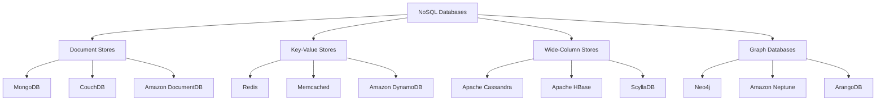

# NoSQL Concepts & Architecture

Relational databases dominated for decades, and for good reason - they provide strong guarantees, a mature query language, and well-understood operational patterns. But the web changed what "normal" looks like for data. Social networks generating billions of events per day, e-commerce catalogs with wildly different product attributes, real-time gaming leaderboards, IoT sensor streams - these workloads pushed relational systems to their limits and created demand for alternatives.

**NoSQL** ("Not Only SQL") is not a single technology. It is a family of database systems that relax one or more relational constraints - fixed schemas, JOIN-heavy queries, single-node scaling, ACID transactions - in exchange for benefits like horizontal scalability, schema flexibility, or specialized data models. The term emerged around 2009, but the ideas go back further: key-value stores like BerkeleyDB existed in the 1990s.

The core motivations behind NoSQL adoption:

- **Horizontal scaling** - distribute data across commodity servers instead of buying increasingly expensive hardware
- **Schema flexibility** - store documents with varying structures without ALTER TABLE migrations
- **Developer productivity** - work with data models that map directly to application objects
- **Specialized query patterns** - graph traversals, time-series aggregations, and full-text search that relational systems handle poorly
- **High availability** - stay operational even when individual nodes fail

!!! warning "NoSQL does not mean "no SQL" or "better than SQL""
    NoSQL databases are not replacements for relational systems. They are alternatives optimized for specific access patterns. Most production applications use both relational and NoSQL databases together. Choosing the wrong database type for your workload causes more pain than the problem you were trying to solve.

---

## NoSQL Database Categories

NoSQL databases fall into four major categories, each built around a different data model and optimized for different access patterns.



---

## Document Stores

A **document store** organizes data as self-contained documents - typically JSON, BSON (binary JSON), or XML. Each document holds all the data for a single entity, including nested objects and arrays. Documents are grouped into **collections** (analogous to tables), but unlike rows in a relational table, documents in the same collection can have completely different fields.

### The Document Model

Consider a product catalog. In a relational database, you might need a `products` table, a `product_attributes` table, a `product_images` table, and JOINs to reassemble them. In a document store, each product is a single document:

```json
{
  "_id": "prod_8842",
  "name": "Mechanical Keyboard",
  "brand": "KeyCraft",
  "price": 149.99,
  "specs": {
    "switch_type": "Cherry MX Brown",
    "layout": "TKL",
    "backlight": "RGB",
    "connectivity": ["USB-C", "Bluetooth 5.0"]
  },
  "images": [
    {"url": "/img/kb-front.jpg", "alt": "Front view"},
    {"url": "/img/kb-side.jpg", "alt": "Side profile"}
  ],
  "reviews_count": 342,
  "avg_rating": 4.6
}
```

This document embeds everything the application needs in a single read. No JOINs, no multi-table lookups. The `specs` object has fields specific to keyboards - a document for headphones in the same collection would have entirely different spec fields, and that is perfectly valid.

### Strengths and Trade-offs

| Strength | Trade-off |
|----------|-----------|
| Schema flexibility - add fields without migrations | No enforced schema means the application must handle inconsistencies |
| Nested data reduces JOINs | Deep nesting creates update complexity (changing a nested value requires rewriting the document) |
| Developer-friendly JSON mapping | Cross-document queries (equivalent to JOINs) are expensive or unsupported |
| Horizontal scaling via sharding | Denormalized data means updates may need to touch multiple documents |

### Major Document Stores

[**MongoDB**](https://www.mongodb.com/docs/) is the most widely used document database. It stores BSON documents, supports rich queries with an aggregation pipeline, and provides replica sets for high availability and sharding for horizontal scaling. You will work with MongoDB in depth in the next guide.

[**CouchDB**](https://docs.couchdb.org/) uses a RESTful HTTP API and stores plain JSON. It pioneered multi-master replication with eventual consistency - useful for offline-first applications that sync when connectivity returns.

```quiz
question: "What is the primary advantage of the document data model over a relational model for a product catalog with varying attributes?"
type: multiple-choice
options:
  - text: "Documents are always faster than relational tables"
    feedback: "Speed depends on the query pattern, not the data model itself. Relational databases with proper indexes can be very fast for structured queries."
  - text: "Each document can have different fields, so products with different attributes do not require schema changes or sparse columns"
    correct: true
    feedback: "Correct! In a relational model, adding a new product category with unique attributes means altering the schema or using a generic key-value attributes table. Document stores let each document define its own structure, so a keyboard document and a headphone document can coexist in the same collection with completely different fields."
  - text: "Documents automatically enforce data integrity better than foreign keys"
    feedback: "Document stores generally provide weaker integrity guarantees than relational databases. There are no foreign keys or cross-document constraints in most document stores."
  - text: "Document stores do not require indexes"
    feedback: "Document stores absolutely use indexes. Without indexes, queries on large collections perform full collection scans, just like a relational database without indexes."
```

---

## Key-Value Stores

A **key-value store** is the simplest NoSQL model. You store a value (a string, a number, a serialized object, a blob) under a unique key, and you retrieve it by that key. The database treats the value as opaque - it does not parse or index the contents. This simplicity enables extreme performance.

### The Data Model

```
Key                          Value
─────────────────────────    ────────────────────────────────
session:abc123               {"user_id": 7042, "role": "admin", "expires": 1735689600}
cache:product:8842           {"name": "Mechanical Keyboard", "price": 149.99, ...}
feature:dark-mode            "enabled"
rate-limit:192.168.1.50      "47"
```

Every operation is a `GET(key)`, `SET(key, value)`, or `DELETE(key)`. Some key-value stores add atomic counters, expiration (TTL), and basic data structures, but the core model stays the same.

### Use Cases

- **Caching** - store expensive query results or rendered page fragments with a TTL
- **Session management** - fast read/write for user session data
- **Feature flags** - simple key lookups to toggle application behavior
- **Rate limiting** - atomic increment counters per IP or API key
- **Leaderboards** - sorted sets (in stores like Redis that support them)

### Major Key-Value Stores

[**Redis**](https://redis.io/docs/) goes well beyond simple key-value. It supports strings, hashes, lists, sets, sorted sets, streams, and more - all held in memory for sub-millisecond latency. Redis is covered in its own guide later in this course.

[**Memcached**](https://memcached.org/) is a pure in-memory cache with a simpler feature set than Redis. It excels at distributed caching for web applications and has been a staple since the mid-2000s.

[**Amazon DynamoDB**](https://docs.aws.amazon.com/amazondynamodb/latest/developerguide/) is a managed key-value and document database. Despite supporting richer queries than a pure key-value store, its core access pattern is key-based lookup, and it scales horizontally with minimal operational overhead.

!!! tip "Key design matters"
    In key-value stores, the key is your only query mechanism. Design keys with namespaces and hierarchies (`user:7042:preferences`, `cache:v2:product:8842`) so you can reason about your data and implement expiration policies per namespace.

---

## Wide-Column Stores

A **wide-column store** (sometimes called a column-family store) organizes data into rows and columns, but unlike a relational table, each row can have a different set of columns. Columns are grouped into **column families**, and the database is optimized for reading and writing entire column families efficiently.

### The Data Model

Think of a wide-column store as a two-dimensional key-value store: a row key maps to a set of column-family entries, and each column family contains a dynamic set of columns.

| Row Key | `profile` (column family) | `activity` (column family) |
|---------|--------------------------|---------------------------|
| `user:1001` | `name: "Alice"`, `email: "alice@example.com"` | `last_login: "2025-03-15"`, `page_views: 4821` |
| `user:1002` | `name: "Bob"`, `org: "Acme Corp"` | `last_login: "2025-03-14"` |
| `user:1003` | `name: "Charlie"`, `email: "charlie@dev.io"`, `phone: "+1-555-0199"` | `last_login: "2025-03-15"`, `page_views: 127`, `api_calls: 9483` |

Notice that `user:1001` has no `phone` column, `user:1002` has an `org` column the others lack, and `user:1003` has `api_calls` that the others do not. This sparsity is the defining characteristic - you do not waste storage on NULL columns, and adding a new column does not require a schema migration.

### Use Cases

- **Time-series data** - sensor readings, application metrics, event logs (row key = sensor ID + time bucket)
- **Analytics** - aggregation queries over large datasets where you read specific column families
- **Content management** - storing metadata alongside content with varying attributes
- **IoT data ingestion** - high write throughput for millions of devices

### Major Wide-Column Stores

[**Apache Cassandra**](https://cassandra.apache.org/doc/latest/) is designed for massive write throughput and high availability across multiple data centers. It uses a peer-to-peer architecture with no single point of failure, tunable consistency per query, and a SQL-like query language called CQL.

[**Apache HBase**](https://hbase.apache.org/book.html) runs on top of Hadoop's HDFS and provides strong consistency with a single-master architecture. It is commonly used for random read/write access to large datasets in the Hadoop ecosystem.

[**ScyllaDB**](https://docs.scylladb.com/) is a Cassandra-compatible database rewritten in C++ for lower latency. It provides the same CQL interface with significantly better performance per node.

```quiz
question: "What distinguishes a wide-column store from a relational database?"
type: multiple-choice
options:
  - text: "Wide-column stores use columns and relational databases use rows"
    feedback: "Both use rows and columns. The difference is in how columns are structured - relational tables have a fixed schema where every row has the same columns, while wide-column stores allow each row to have a different set of columns."
  - text: "Wide-column stores do not support any query language"
    feedback: "Many wide-column stores have query languages. Cassandra has CQL (Cassandra Query Language) which resembles SQL. The distinguishing feature is schema flexibility, not query capability."
  - text: "Each row can have a different set of columns, and columns are grouped into column families rather than a fixed schema"
    correct: true
    feedback: "Correct! In a relational table, every row has the same columns (with NULLs for missing data). In a wide-column store, each row independently defines which columns it contains, and related columns are grouped into column families. This sparse structure avoids wasting storage and eliminates schema migrations when adding new attributes."
  - text: "Wide-column stores cannot handle more than one column per row"
    feedback: "Wide-column stores handle many columns per row - that is the 'wide' in the name. Individual rows can have thousands of columns. The key feature is that each row decides which columns it has."
```

---

## Graph Databases

A **graph database** stores data as **nodes** (entities), **edges** (relationships), and **properties** (attributes on both nodes and edges). The relationships are first-class citizens - stored directly as pointers between nodes rather than computed via JOINs at query time. This makes traversing connections fast regardless of dataset size.

### The Data Model

In a social network:

- **Nodes**: `User("Alice")`, `User("Bob")`, `Post("Graph databases are underrated")`
- **Edges**: `Alice -[:FOLLOWS]-> Bob`, `Alice -[:AUTHORED]-> Post`, `Bob -[:LIKED]-> Post`
- **Properties**: `FOLLOWS {since: "2024-01-15"}`, `User {name: "Alice", joined: "2023-06-01"}`

A query like "find all users who follow someone who liked a post authored by Alice" requires three JOINs in a relational database but is a direct graph traversal:

```
(Alice)-[:AUTHORED]->(post)<-[:LIKED]-(liker)<-[:FOLLOWS]-(follower)
```

This traversal stays fast because following an edge is a pointer lookup, not a table scan. In relational databases, each additional JOIN multiplies the cost. In graph databases, each additional hop is roughly constant time.

### Use Cases

- **Social networks** - friend recommendations, mutual connections, influence analysis
- **Recommendation engines** - "users who bought X also bought Y" via shared purchase patterns
- **Fraud detection** - identifying clusters of accounts with suspicious relationship patterns
- **Knowledge graphs** - connecting entities across domains (products, categories, suppliers, regulations)
- **Network topology** - modeling infrastructure dependencies, routing, impact analysis

### Major Graph Databases

[**Neo4j**](https://neo4j.com/docs/) is the most established graph database. Its query language, **Cypher**, reads almost like English: `MATCH (a:User)-[:FOLLOWS]->(b:User) WHERE a.name = "Alice" RETURN b.name`. Neo4j uses native graph storage - relationships are stored as direct pointers, not looked up in an index.

[**Amazon Neptune**](https://docs.aws.amazon.com/neptune/latest/userguide/) is a managed graph database supporting both property graph (Gremlin) and RDF (SPARQL) query models.

!!! tip "When to use a graph database"
    If your queries are primarily about relationships between entities - especially multi-hop traversals - a graph database will dramatically outperform a relational database. If your queries are primarily about filtering and aggregating attributes of individual entities, a relational or document database is the better choice.

---

## SQL vs. Document Query Comparison

To make the difference concrete, here is the same data retrieval in SQL (relational) and in a MongoDB-style document query. The scenario: find all orders for a specific customer, including product details.

```terminal
title: Querying Relational vs. Document Data Models
steps:
  - command: "cat relational_query.sql"
    output: |
      -- Relational: 3-table JOIN to assemble an order with products
      SELECT o.order_id, o.order_date, o.total,
             c.name AS customer_name, c.email,
             p.name AS product_name, p.price, oi.quantity
      FROM orders o
      JOIN customers c ON o.customer_id = c.customer_id
      JOIN order_items oi ON o.order_id = oi.order_id
      JOIN products p ON oi.product_id = p.product_id
      WHERE c.email = 'alice@example.com'
      ORDER BY o.order_date DESC;
    narration: "In a relational database, customer data, orders, order line items, and products live in separate normalized tables. Assembling a complete order requires JOINing four tables. This is clean and avoids data duplication, but the JOIN cost grows with data volume."
  - command: "cat document_query.js"
    output: |
      // Document store: single collection query, no JOINs
      db.orders.find(
        { "customer.email": "alice@example.com" },
        { order_id: 1, order_date: 1, total: 1,
          "customer.name": 1, "items.product_name": 1,
          "items.price": 1, "items.quantity": 1 }
      ).sort({ order_date: -1 })
    narration: "In a document store, each order document embeds the customer info and line items directly. The query hits a single collection with no JOINs. The trade-off: if Alice changes her email, you need to update it in every order document that references her."
  - command: "cat document_sample.json"
    output: |
      {
        "order_id": "ord_20251",
        "order_date": "2025-03-10",
        "total": 329.97,
        "customer": {
          "name": "Alice Chen",
          "email": "alice@example.com"
        },
        "items": [
          {"product_name": "Mechanical Keyboard", "price": 149.99, "quantity": 1},
          {"product_name": "USB-C Hub", "price": 89.99, "quantity": 2}
        ]
      }
    narration: "This is what the stored document looks like. All order information is self-contained. Reading this document returns everything the application needs in a single disk seek. The denormalization trade-off is explicit: customer data is duplicated across orders."
```

---

## The CAP Theorem

The **CAP theorem** (formalized by Eric Brewer in 2000, proven by Seth Gilbert and Nancy Lynch in 2002) states that a distributed data store can provide at most two of these three guarantees simultaneously:

- **Consistency** (C) - every read receives the most recent write or an error
- **Availability** (A) - every request receives a non-error response (though it may not contain the most recent write)
- **Partition tolerance** (P) - the system continues operating despite network partitions between nodes

### Why Only Two?

In any distributed system, network partitions will happen - switches fail, cables get cut, cloud availability zones lose connectivity. During a partition, the system must make a choice:

**Choose CP (Consistency + Partition Tolerance)**: When a partition occurs, the system blocks or returns errors for requests it cannot guarantee are consistent. Nodes that cannot confirm they have the latest data refuse to serve reads. You get correct data or no data.

**Choose AP (Availability + Partition Tolerance)**: When a partition occurs, every node continues serving requests using whatever data it has locally. Reads might return stale data, but the system never goes down. Nodes reconcile differences after the partition heals.

**CA (Consistency + Availability)**: Only possible when there are no partitions - meaning a single-node system. The moment you distribute data across a network, you must handle partitions, and CA is off the table.

### Real-World CAP Classifications

| System | CAP Choice | Behavior During Partition |
|--------|-----------|--------------------------|
| [**HBase**](https://hbase.apache.org/book.html) | CP | Regions on the partitioned side become unavailable until partition heals |
| MongoDB (majority write concern) | CP | Writes require acknowledgment from a majority of replica set members; partitioned minority cannot accept writes |
| [**Cassandra**](https://cassandra.apache.org/doc/latest/) | AP | All nodes continue accepting reads and writes; conflicts resolved by timestamp after partition heals |
| DynamoDB | AP | Continues serving requests across partitions; eventual consistency by default |
| PostgreSQL (single node) | CA | No partitions possible on a single node; both consistent and available |

!!! warning "CAP is about partitions, not normal operation"
    CAP choices only matter during a network partition. Under normal operation, well-designed distributed databases provide all three properties. The CAP classification describes what the system sacrifices *when things go wrong*, not its everyday behavior.

```quiz
question: "A distributed database is configured to always return the most recent write, even if that means some requests fail during a network partition. Which CAP properties does it guarantee?"
type: multiple-choice
options:
  - text: "CA - Consistency and Availability"
    feedback: "CA requires no partitions. Since the question describes a distributed database experiencing partitions, CA is not possible."
  - text: "AP - Availability and Partition Tolerance"
    feedback: "AP systems prioritize availability, meaning they serve requests even with potentially stale data. A system that always returns the most recent write is prioritizing consistency over availability."
  - text: "CP - Consistency and Partition Tolerance"
    correct: true
    feedback: "Correct! The system guarantees consistency (most recent write) and tolerates partitions (continues to operate). The cost is availability: during a partition, some requests fail because the system refuses to return potentially stale data. HBase and MongoDB with majority write concern behave this way."
  - text: "CAP - all three simultaneously"
    feedback: "The CAP theorem proves that all three are impossible during a partition. You must sacrifice at least one."
```

---

## Consistency Models

CAP describes a binary choice during failures. In practice, distributed databases offer a spectrum of **consistency models** that determine how up-to-date your reads are relative to writes, even during normal operation.

### Strong Consistency

Every read sees the result of the most recent write. After a write completes, all subsequent reads from any node return that value. This is what relational databases provide by default within a transaction.

**Cost**: Higher latency (writes must propagate before reads can proceed), lower throughput, reduced availability during partitions.

**Example**: A bank transfer. After moving $500 from checking to savings, reading either account balance from any node must reflect the transfer.

### Eventual Consistency

If no new writes occur, all nodes will *eventually* converge to the same value. There is no guarantee about how long "eventually" takes - it could be milliseconds or seconds.

**Cost**: Reads may return stale data. The application must tolerate temporarily inconsistent views.

**Example**: A social media "like" count. If Alice likes a post, Bob might see the old count for a few seconds. This is acceptable because the counter will converge, and the brief inconsistency has no real consequence.

### Causal Consistency

If operation A causally precedes operation B (B depends on or was influenced by A), then every node sees A before B. Operations with no causal relationship may appear in different orders on different nodes.

**Example**: In a comment thread, a reply always appears after the message it replies to, but independent top-level comments may appear in different orders on different nodes.

### Read-Your-Writes Consistency

After you perform a write, your subsequent reads are guaranteed to see that write. Other users may still see stale data.

**Example**: After updating your profile picture, you immediately see the new picture. Other users might briefly see your old picture. This is usually implemented by routing your reads to the same node that accepted your write.

### Monotonic Reads

Once you read a value, subsequent reads will never return an older value. Your view of the data only moves forward in time, never backward.

**Example**: If you read a post that has 47 likes, the next time you read it you will see 47 or more likes, never 45. Without monotonic reads, load-balanced reads across replicas with different lag could show the count jumping backward.

### Choosing a Consistency Level

Most distributed databases let you choose consistency per operation. Cassandra, for example, lets you specify `ONE`, `QUORUM`, or `ALL` for each read or write:

| Cassandra Level | Behavior | Latency | Consistency |
|----------------|----------|---------|-------------|
| `ONE` | Read/write acknowledged by a single node | Lowest | Weakest (eventual) |
| `QUORUM` | Acknowledged by majority of replicas | Medium | Strong if read + write quorum > replication factor |
| `ALL` | Acknowledged by every replica | Highest | Strongest, but one node failure blocks the operation |

The formula for strong consistency: if `R + W > N` (read replicas + write replicas > total replicas), reads are guaranteed to overlap with at least one node that has the latest write.

---

## Polyglot Persistence

**Polyglot persistence** means using multiple database technologies within a single application, choosing each based on the access pattern of the data it stores.

Consider an e-commerce platform:

| Data | Database | Reasoning |
|------|----------|-----------|
| Product catalog | MongoDB | Varying attributes per product category, flexible schema |
| User sessions | Redis | Sub-millisecond reads, automatic TTL expiration |
| Order transactions | PostgreSQL | ACID guarantees for financial data, complex reporting queries |
| Product recommendations | Neo4j | Traversing purchase history graphs for "also bought" suggestions |
| Search index | Elasticsearch | Full-text search with fuzzy matching and faceted navigation |
| Event stream | Apache Kafka | High-throughput append-only log for analytics pipeline |

Each database handles the workload it was designed for. The alternative - forcing all data into a single relational database - means fighting against the database for workloads it was not optimized for.

### The Costs of Polyglot Persistence

This approach is not free:

- **Operational complexity** - every database engine is another system to monitor, patch, back up, and recover
- **Data synchronization** - keeping data consistent across systems requires event-driven architecture or change data capture
- **Team expertise** - your team needs operational knowledge of each database
- **Transaction boundaries** - distributed transactions across different databases are hard; most teams use eventual consistency between systems

!!! tip "Start simple"
    Begin with a single well-chosen database. Add specialized databases only when you have a measurable problem - not because an architecture diagram looks impressive with more boxes. Most applications work fine with one relational database for years.

```quiz
question: "An e-commerce platform stores product catalog data in MongoDB, user sessions in Redis, and financial transactions in PostgreSQL. What is this pattern called?"
type: multiple-choice
options:
  - text: "Database sharding"
    feedback: "Sharding splits a single database across multiple servers. This scenario uses three entirely different database systems for different data types."
  - text: "Polyglot persistence"
    correct: true
    feedback: "Correct! Polyglot persistence means choosing different database technologies for different data access patterns within one application. MongoDB handles the flexible product schema, Redis provides sub-millisecond session lookups, and PostgreSQL guarantees ACID properties for financial data."
  - text: "Multi-master replication"
    feedback: "Multi-master replication is a high-availability pattern within a single database system. This scenario uses three different database engines."
  - text: "Database normalization"
    feedback: "Normalization is a relational design technique for eliminating data redundancy. This pattern is about choosing different database technologies, not about schema design within one database."
```

---

## Decision Framework: Relational vs. NoSQL

Choosing a database is not about ideology. It is about matching your workload to the system designed for it. Work through these criteria:

### Data Structure

| Your data looks like... | Consider |
|------------------------|---------|
| Highly structured, well-defined relationships between entities | Relational (PostgreSQL, MySQL) |
| Semi-structured with varying attributes per record | Document store (MongoDB, CouchDB) |
| Simple lookups by identifier, no complex queries | Key-value (Redis, DynamoDB) |
| Sparse columns, high-volume append writes | Wide-column (Cassandra, HBase) |
| Heavily interconnected with multi-hop relationship queries | Graph (Neo4j, Neptune) |

### Query Patterns

| You mostly need to... | Consider |
|----------------------|---------|
| Run ad-hoc queries with complex filters, JOINs, aggregations | Relational |
| Fetch complete entities by ID or simple filters | Document or key-value |
| Write massive volumes with simple reads by partition key | Wide-column |
| Traverse relationships between entities | Graph |

### Consistency Requirements

| You need... | Consider |
|-------------|---------|
| ACID transactions across multiple tables | Relational |
| Strong consistency for financial or inventory data | Relational or CP-configured NoSQL |
| Eventual consistency is acceptable | AP NoSQL (Cassandra, DynamoDB) |
| Tunable consistency per operation | Cassandra, DynamoDB, MongoDB |

### Scale Requirements

| Your scale is... | Consider |
|-----------------|---------|
| Single server handles the load | Relational (simplest operational model) |
| Read-heavy, needs read replicas | Relational with replicas, or any NoSQL |
| Write-heavy, needs horizontal partitioning | Wide-column or sharded document store |
| Global distribution across data centers | Cassandra, DynamoDB, CockroachDB |

### The Default Choice

If you are unsure, start with PostgreSQL. It handles JSON documents (via JSONB), full-text search, and horizontal read scaling with replicas. You can add specialized databases later when you have concrete evidence that PostgreSQL is not meeting a specific need.

---

## Practical Exercise

```exercise
title: Choose the Right Database
type: scenario
scenario: |
  You are the lead engineer designing the data layer for a new application. For each scenario below, recommend a specific database type and name a concrete product. Justify your choice based on the data model, query patterns, consistency needs, and scale.
tasks:
  - task: "Scenario 1: A real-time multiplayer game needs a leaderboard showing the top 100 players globally, updated on every score change. Peak load is 50,000 score updates per second. Players query their rank and the top-N list."
    hint: "Think about what data structure naturally supports ranked ordering with fast inserts and lookups."
    answer: "Redis with sorted sets. The ZADD command inserts/updates a score in O(log N), ZREVRANGE retrieves the top-N in O(log N + N), and ZREVRANK returns a player's position in O(log N). Redis handles 50K+ operations per second easily from memory. A relational database would require ORDER BY on every leaderboard query, which is far slower at this update frequency."
  - task: "Scenario 2: A hospital system stores patient medical records. Each record includes demographics, visit history, prescriptions, lab results, and insurance claims. Records must be queryable by patient, date range, diagnosis code, and prescribing doctor. Incorrect data could endanger lives."
    hint: "Think about the consistency and integrity requirements, and the need for complex cross-entity queries."
    answer: "PostgreSQL (relational). Medical records require ACID transactions, strict data integrity via foreign keys and constraints, and complex cross-entity queries (find all patients prescribed drug X by doctor Y in date range Z). The regulatory environment demands auditability and strong consistency. The query patterns are relational in nature - relationships between patients, doctors, prescriptions, and diagnoses are central to the data model."
  - task: "Scenario 3: A social platform needs to show friend-of-friend recommendations, detect fake account clusters, and display the shortest connection path between any two users. The network has 50 million users with an average of 200 connections each."
    hint: "Think about what operations involve traversing many levels of connections."
    answer: "Neo4j (graph database). Friend-of-friend is a 2-hop traversal. Shortest path is a native graph algorithm. Detecting fake account clusters uses community detection algorithms. These are all graph problems. In a relational database, a 3-hop connection query on 50 million users with 200 connections each would require self-JOINing a 10-billion-row edges table multiple times - this would be extremely slow. Neo4j stores relationships as direct pointers, making each hop a constant-time operation."
  - task: "Scenario 4: An IoT platform ingests telemetry from 500,000 sensors, each reporting temperature, humidity, and pressure every 10 seconds. Data must be queryable by sensor ID and time range. Total write throughput is 150,000 writes per second."
    hint: "Think about what database type is designed for high-volume time-series writes with partition-key-based reads."
    answer: "Apache Cassandra (wide-column store). The partition key is the sensor ID, and the clustering key is the timestamp, giving efficient range scans per sensor. Cassandra's architecture handles 150K+ writes/sec by distributing across a cluster with no single bottleneck. The data model is naturally append-heavy with reads by partition key and time range - exactly what Cassandra optimizes for. The data is non-transactional (a slightly stale sensor reading has no consequence), so eventual consistency is acceptable."
```

---

## Further Reading

- [Martin Kleppmann - Designing Data-Intensive Applications](https://dataintensive.net/) - the definitive reference on distributed systems, consistency models, and database internals
- [Eric Brewer's CAP Theorem](https://www.infoq.com/articles/cap-twelve-years-later-how-the-rules-have-changed/) - Brewer's own retrospective on CAP, twelve years after the original conjecture
- [MongoDB Documentation](https://www.mongodb.com/docs/) - official docs for the most widely used document database
- [Redis Documentation](https://redis.io/docs/) - official docs covering data structures, persistence, clustering, and use patterns
- [Apache Cassandra Architecture](https://cassandra.apache.org/doc/latest/cassandra/architecture/) - how Cassandra implements its peer-to-peer, tunable-consistency design
- [Neo4j Graph Database Concepts](https://neo4j.com/docs/getting-started/appendix/graphdb-concepts/) - introduction to property graphs and the Cypher query language

---

**Previous:** [PostgreSQL Advanced Features](postgresql-advanced.md) | **Next:** [MongoDB](mongodb.md) | [Back to Index](README.md)
