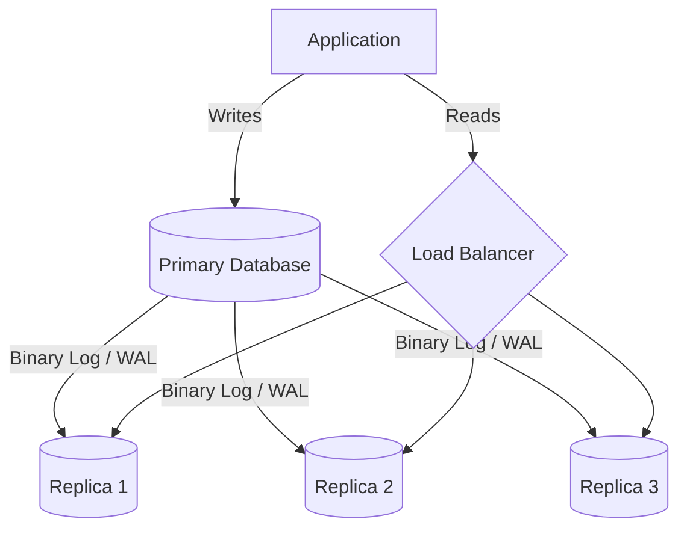
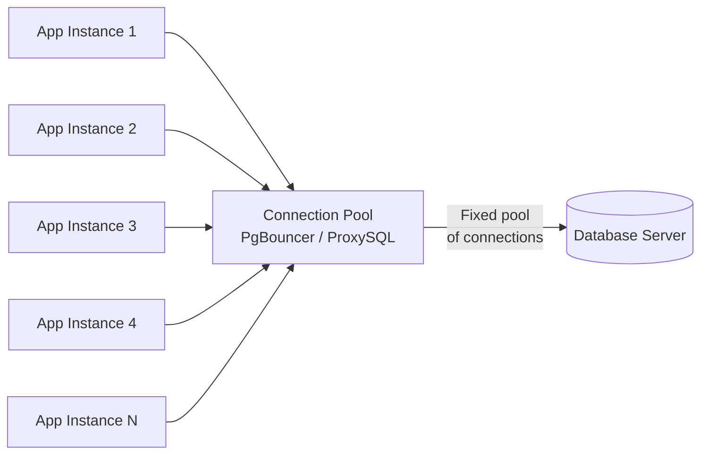
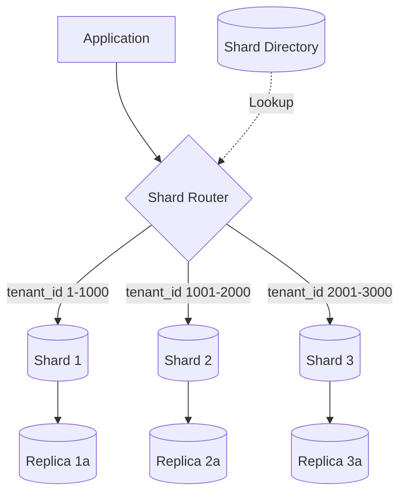

# Scaling & Architecture Patterns

Your single-server database handles the first million users. Then queries slow down, connections pile up, and you start eyeing the credit card limit on your cloud account. Scaling a database is not just about throwing hardware at the problem - it requires understanding which bottleneck you are hitting and choosing the right architectural pattern to address it.

This guide covers the spectrum from simple read replicas through sharding, connection pooling, and the distributed data patterns that appear in microservices architectures.

---

## Read Replicas

A **read replica** is a copy of your primary database that receives changes asynchronously and serves read-only queries. Most production workloads are read-heavy (often 80-90% reads), so offloading those reads to replicas is the first scaling move for nearly every application.

### How Replication Works

The primary server records every write operation in a log - the **binary log** in MySQL, the **write-ahead log** (WAL) in PostgreSQL. Replicas connect to the primary, stream the log entries, and apply them locally:



In MySQL, **binary log replication** ships row-level or statement-level changes. In PostgreSQL, **streaming replication** sends WAL records. Both achieve the same result: replicas converge toward the primary's state.

### Routing Reads vs Writes

Your application needs to send writes to the primary and reads to replicas. There are three common approaches:

**Application-level routing** - your code explicitly chooses a connection. Simple but couples routing logic to application code:

```python
def get_user(user_id):
    # Read from replica
    with replica_pool.connection() as conn:
        return conn.execute("SELECT * FROM users WHERE id = %s", (user_id,))

def update_user(user_id, name):
    # Write to primary
    with primary_pool.connection() as conn:
        conn.execute("UPDATE users SET name = %s WHERE id = %s", (name, user_id))
```

**Proxy-based routing** - a middleware layer like [**ProxySQL**](https://proxysql.com/) or [**PgBouncer**](https://www.pgbouncer.org/) with [**Pgpool-II**](https://pgpool.net/) inspects queries and routes them automatically. The application connects to a single endpoint.

**DNS-based routing** - separate DNS entries for read and write endpoints (e.g., `db-write.internal` and `db-read.internal`). AWS RDS and Aurora use this pattern with their cluster endpoints.

### Consistency Trade-offs

Replicas lag behind the primary. A user writes a comment, the next page load hits a replica that has not received the change yet, and the comment appears missing. This is **replication lag**, and you need a strategy for it:

- **Read-your-writes consistency** - after a write, route that user's subsequent reads to the primary for a short window (a few seconds)
- **Monotonic reads** - pin a user's session to a single replica so they never see data go backward
- **Semi-synchronous replication** - the primary waits for at least one replica to acknowledge the write before confirming to the client. Reduces lag at the cost of write latency

### Monitoring Replica Lag

In MySQL, check `Seconds_Behind_Master` (or `Seconds_Behind_Source` in MySQL 8.0.22+):

```sql
SHOW REPLICA STATUS\G
-- Look for: Seconds_Behind_Source: 0
```

In PostgreSQL, compare WAL positions:

```sql
-- On the primary
SELECT client_addr,
       state,
       pg_wal_lsn_diff(pg_current_wal_lsn(), replay_lsn) AS replay_lag_bytes
FROM pg_stat_replication;
```

!!! warning "Lag is not just a number"
    `Seconds_Behind_Source` measures the timestamp difference between the event on the primary and when the replica processed it. It does not account for events still in transit. A replica can show 0 seconds of lag while being thousands of transactions behind if it is processing them quickly but the primary is generating them faster.

```quiz
question: "A user posts a comment on your site, then immediately refreshes the page and sees their comment missing. What is the most likely cause?"
type: multiple-choice
options:
  - text: "The write failed silently"
    feedback: "If the write failed, the user would typically see an error. The scenario describes successful writes that are not yet visible."
  - text: "Replication lag - the read hit a replica that has not yet received the write"
    correct: true
    feedback: "Correct! This is the classic replication lag problem. The write goes to the primary, but the subsequent read is routed to a replica that has not yet applied the change. Solutions include read-your-writes consistency (routing the user's reads to the primary briefly after a write) or semi-synchronous replication."
  - text: "The database cache is stale"
    feedback: "Database caches (like the InnoDB buffer pool) reflect the current state of the database instance they belong to. If the write succeeded on the primary, the primary's cache is current. The issue is which instance the read hits."
  - text: "The comment table is locked by another transaction"
    feedback: "A lock would delay the read, not return stale data. The user would see a slow response, not missing data."
```

```terminal
title: Monitoring Replication Lag and Read Replica Status
steps:
  - command: "mysql -u admin -p -e \"SHOW REPLICA STATUS\\G\" | grep -E 'Replica_IO_Running|Replica_SQL_Running|Seconds_Behind_Source|Retrieved_Gtid_Set|Executed_Gtid_Set'"
    output: |
                   Replica_IO_Running: Yes
                  Replica_SQL_Running: Yes
              Seconds_Behind_Source: 0
             Retrieved_Gtid_Set: 3E11FA47-71CA-11E1-9E33-C80AA9429562:1-847
              Executed_Gtid_Set: 3E11FA47-71CA-11E1-9E33-C80AA9429562:1-847
    narration: "On a MySQL replica, SHOW REPLICA STATUS reveals the health of replication. Replica_IO_Running and Replica_SQL_Running must both be Yes - the IO thread fetches binary log events from the primary, and the SQL thread applies them. Seconds_Behind_Source at 0 indicates the replica is caught up. The GTID sets show which transactions have been received versus applied."
  - command: "mysql -u admin -p -e \"SHOW REPLICA STATUS\\G\" | grep -E 'Replica_IO_Running|Replica_SQL_Running|Seconds_Behind_Source'"
    output: |
                   Replica_IO_Running: Yes
                  Replica_SQL_Running: Yes
              Seconds_Behind_Source: 142
    narration: "A Seconds_Behind_Source value of 142 means the replica is applying events that the primary generated 142 seconds ago. This level of lag may cause stale reads. Common causes include long-running queries on the replica, single-threaded SQL apply on the replica while the primary uses parallel writes, or insufficient replica hardware."
  - command: "psql -U postgres -d myapp -c \"SELECT client_addr, state, sent_lsn, replay_lsn, pg_wal_lsn_diff(sent_lsn, replay_lsn) AS replay_lag_bytes, pg_wal_lsn_diff(pg_current_wal_lsn(), sent_lsn) AS send_lag_bytes FROM pg_stat_replication;\""
    output: |
        client_addr   |   state   |  sent_lsn   | replay_lsn  | replay_lag_bytes | send_lag_bytes
      ----------------+-----------+-------------+-------------+------------------+----------------
       10.0.1.12      | streaming | 0/5A3B8C10  | 0/5A3B8C10  |                0 |              0
       10.0.1.13      | streaming | 0/5A3B8C10  | 0/5A3B7F28  |             3304 |              0
       10.0.1.14      | streaming | 0/5A3B8C10  | 0/5A3B8C10  |                0 |              0
    narration: "On a PostgreSQL primary, pg_stat_replication shows each connected replica. The state column confirms active streaming. replay_lag_bytes compares what was sent to what the replica has applied - replica 10.0.1.13 is 3,304 bytes behind. send_lag_bytes compares the primary's current WAL position to what has been sent - 0 means the network is keeping up. Both lag metrics should stay near zero under normal load."
  - command: "psql -U postgres -d myapp -c \"SELECT now() - pg_last_xact_replay_timestamp() AS replication_delay;\""
    output: |
       replication_delay
      -------------------
       00:00:00.003217
    narration: "Run this on a PostgreSQL replica to see replication delay as a time interval. This replica is 3.2 milliseconds behind the primary. If this value climbs to seconds or minutes, the replica is falling behind. This query only works on replicas - on the primary it returns NULL because pg_last_xact_replay_timestamp() only applies to standby servers."
```

---

## Connection Pooling

Every database connection consumes memory - typically 5-10 MB per connection in PostgreSQL, somewhat less in MySQL. A server with 4 GB of RAM dedicated to connections supports a few hundred at most. When your application spawns thousands of short-lived connections (common with PHP, serverless functions, or microservices), the overhead of creating and tearing down connections becomes a bottleneck before you run out of query capacity.

A **connection pooler** sits between your application and the database, maintaining a pool of persistent connections and multiplexing client requests across them. One hundred application instances sharing twenty database connections is common.



### ProxySQL for MySQL

[**ProxySQL**](https://proxysql.com/documentation/) handles connection pooling, query routing, and query caching for MySQL. It operates as a transparent proxy - your application connects to ProxySQL on port 6033 instead of MySQL on port 3306.

Key capabilities:

- **Connection multiplexing** - thousands of client connections share a smaller pool of backend connections
- **Query routing** - sends reads to replicas and writes to the primary based on query rules
- **Query caching** - caches SELECT results for configurable TTLs
- **Query rewriting** - modifies queries in-flight (adding hints, rewriting patterns)

Configuration is stored in ProxySQL's internal SQLite database and managed through its admin interface on port 6032:

```sql
-- Add backend servers
INSERT INTO mysql_servers (hostgroup_id, hostname, port, weight)
VALUES (10, 'primary.db.internal', 3306, 1000);

INSERT INTO mysql_servers (hostgroup_id, hostname, port, weight)
VALUES (20, 'replica1.db.internal', 3306, 500);

INSERT INTO mysql_servers (hostgroup_id, hostname, port, weight)
VALUES (20, 'replica2.db.internal', 3306, 500);

-- Route reads to hostgroup 20, writes to hostgroup 10
INSERT INTO mysql_query_rules (rule_id, active, match_pattern, destination_hostgroup)
VALUES (1, 1, '^SELECT.*FOR UPDATE', 10);

INSERT INTO mysql_query_rules (rule_id, active, match_pattern, destination_hostgroup)
VALUES (2, 1, '^SELECT', 20);

-- Apply changes
LOAD MYSQL SERVERS TO RUNTIME;
LOAD MYSQL QUERY RULES TO RUNTIME;
SAVE MYSQL SERVERS TO DISK;
SAVE MYSQL QUERY RULES TO DISK;
```

### PgBouncer for PostgreSQL

[**PgBouncer**](https://www.pgbouncer.org/) is a lightweight connection pooler for PostgreSQL. It supports three pooling modes:

| Mode | Behavior | Use Case |
|------|----------|----------|
| **Session** | Connection assigned for the full client session | Applications using session-level features (prepared statements, temp tables) |
| **Transaction** | Connection assigned per transaction | Most web applications - best multiplexing ratio |
| **Statement** | Connection assigned per query | Simple query patterns with no multi-statement transactions |

Transaction pooling gives the best multiplexing ratio. A pool of 20 PostgreSQL connections can serve hundreds of application instances because each instance only holds a connection for the duration of a transaction.

### Pool Sizing

The optimal pool size is smaller than you think. PostgreSQL's documentation recommends:

```
pool_size = (core_count * 2) + effective_spindle_count
```

For a server with 8 cores and SSDs (effectively 1 spindle), that is `(8 * 2) + 1 = 17` connections. More connections means more context switching, more lock contention, and worse throughput - not better.

!!! tip "The connection pool paradox"
    Adding more connections past the optimal point makes your database slower. If 20 connections can handle your workload with 50ms average query time, 200 connections will compete for the same CPU and disk, increasing average query time to 500ms. The database does more work per second with fewer concurrent connections.

```terminal
title: Configuring PgBouncer Connection Pooling
steps:
  - command: "cat /etc/pgbouncer/pgbouncer.ini"
    output: |
      [databases]
      myapp = host=127.0.0.1 port=5432 dbname=myapp

      [pgbouncer]
      listen_addr = 0.0.0.0
      listen_port = 6432
      auth_type = md5
      auth_file = /etc/pgbouncer/userlist.txt
      pool_mode = transaction
      default_pool_size = 20
      max_client_conn = 1000
      min_pool_size = 5
      reserve_pool_size = 5
      reserve_pool_timeout = 3
      server_idle_timeout = 600
      log_connections = 1
      log_disconnections = 1
    narration: "PgBouncer's configuration file. The [databases] section maps connection names to actual PostgreSQL instances. pool_mode is set to transaction, meaning connections are returned to the pool after each transaction completes. default_pool_size of 20 sets the number of server-side connections per database/user pair. max_client_conn of 1000 allows up to 1000 application connections to share those 20 backend connections."
  - command: "psql -h 127.0.0.1 -p 6432 -U myapp_user pgbouncer -c 'SHOW POOLS;'"
    output: |
       database |   user    | cl_active | cl_waiting | sv_active | sv_idle | sv_used | sv_tested | sv_login | maxwait | pool_mode
      ----------+-----------+-----------+------------+-----------+---------+---------+-----------+----------+---------+-----------
       myapp    | myapp_user|        47 |          0 |         8 |      12 |       0 |         0 |        0 |       0 | transaction
    narration: "The SHOW POOLS command displays the current state. cl_active shows 47 client connections currently in a transaction. sv_active shows only 8 server-side connections are actually busy - the rest are idle in the pool. cl_waiting at 0 means no clients are blocked waiting for a connection. This is a healthy pool state."
  - command: "psql -h 127.0.0.1 -p 6432 -U myapp_user pgbouncer -c 'SHOW STATS;'"
    output: |
       database | total_xact_count | total_query_count | total_received | total_sent | total_xact_time | total_query_time | total_wait_time | avg_xact_count | avg_query_count | avg_xact_time | avg_query_time | avg_wait_time
      ----------+------------------+-------------------+----------------+------------+-----------------+------------------+-----------------+----------------+-----------------+---------------+----------------+--------------
       myapp    |          1284503 |           3829471 |     2048374912 | 5739102847 |     19283746521 |      12847291038 |         1938274 |           4281 |           12764 |         15012 |           3355 |            1
    narration: "SHOW STATS reveals query throughput and timing. avg_wait_time of 1 microsecond means clients are almost never waiting for a connection - the pool is well-sized. If avg_wait_time climbs, you may need to increase default_pool_size (but refer to the pool sizing formula first)."
```

```quiz
question: "You have a PostgreSQL server with 4 CPU cores and SSD storage. Using the recommended pool sizing formula, what is the optimal connection pool size?"
type: multiple-choice
options:
  - text: "100 connections"
    feedback: "Too many. More connections than the formula suggests leads to CPU context switching and lock contention that slows overall throughput."
  - text: "4 connections"
    feedback: "Too few. This only accounts for the core count without the multiplier. The formula is (core_count * 2) + effective_spindle_count."
  - text: "9 connections"
    correct: true
    feedback: "Correct! The formula is (core_count * 2) + effective_spindle_count. With 4 cores and SSDs (1 effective spindle): (4 * 2) + 1 = 9. This may feel low, but PostgreSQL achieves higher throughput with fewer connections competing for resources."
  - text: "32 connections"
    feedback: "This is 4 * 8, which is not the recommended formula. The correct formula is (core_count * 2) + effective_spindle_count, giving (4 * 2) + 1 = 9 for SSD storage."
```

---

## Horizontal vs Vertical Scaling

When your database hits its limits, you have two directions to grow.

**Vertical scaling** (scaling up) means giving your existing server more resources - more CPU, more RAM, faster storage. It is the simplest path: no code changes, no architectural complexity. You upgrade the instance type, restart, and your database handles more load.

**Horizontal scaling** (scaling out) means spreading data across multiple servers. This includes read replicas (covered above), sharding (covered below), and distributed databases. It introduces significant complexity but removes the ceiling imposed by a single machine's hardware.

### Trade-offs

| Factor | Vertical | Horizontal |
|--------|----------|------------|
| **Complexity** | Minimal - same architecture | High - application changes, data routing |
| **Downtime** | Brief restart for upgrades | Can be zero-downtime with proper orchestration |
| **Cost curve** | Exponential - top-tier hardware is disproportionately expensive | Linear - commodity hardware scales predictably |
| **Ceiling** | Hard limit at largest available instance | Theoretically unlimited |
| **Consistency** | Strong - single node | Requires careful design for consistency guarantees |
| **Operational burden** | One server to manage | Many servers, network partitions, coordination |

### When Each Is Appropriate

Scale vertically first. It buys you time without the operational overhead of distributed systems. A single server with 64 cores, 512 GB RAM, and NVMe storage handles more than most applications need. Switch to horizontal scaling when:

- Your dataset exceeds what a single server's storage can hold
- Your write throughput exceeds what a single server's I/O can handle
- Your availability requirements demand geographic distribution
- Your cost curve goes parabolic on the next vertical tier

!!! note "The single-server sweet spot"
    Many high-traffic applications run on a single primary with read replicas far longer than their engineering teams expect. Stack Overflow served 1.3 billion page views per month from a small cluster of SQL Server instances. Vertical scaling combined with read replicas handles more load than most applications will ever reach.

---

## Sharding Strategies

**Sharding** splits a single logical database across multiple physical databases, each holding a subset of the data. Each subset is a **shard**. Unlike read replicas (which hold full copies), shards hold partitions - a given row exists on exactly one shard.

Sharding is the most operationally complex scaling strategy. It should be your last resort after exhausting vertical scaling, read replicas, caching, and query optimization.

### Hash-Based Sharding

Compute a hash of the **shard key** (typically the primary key or tenant ID) and use modulo arithmetic to assign rows to shards:

```
shard_number = hash(shard_key) % number_of_shards
```

This distributes data evenly. The problem arises when you add shards - changing the modulus remaps most keys, requiring a massive data migration.

**Consistent hashing** solves this. Instead of `hash % N`, consistent hashing maps both keys and shard nodes onto a hash ring. When you add a shard, only the keys between the new node and its neighbor move. This minimizes data migration during resharding.

### Range-Based Sharding

Assign rows to shards based on value ranges of the shard key:

| Shard | Range |
|-------|-------|
| Shard 1 | user_id 1 - 1,000,000 |
| Shard 2 | user_id 1,000,001 - 2,000,000 |
| Shard 3 | user_id 2,000,001 - 3,000,000 |

Range-based sharding supports efficient range queries (all users in a given range hit a single shard). The downside is **hotspots** - if most activity comes from recently created users, the latest shard handles disproportionate load.

### Directory-Based Sharding

A separate **lookup service** maps each shard key to its shard location. The application queries the directory first, then routes to the appropriate shard.

This is the most flexible approach - you can move individual tenants between shards without changing the hashing or range logic. The directory itself becomes a critical dependency and potential bottleneck, so it is typically a fast key-value store like Redis.

### Choosing a Shard Key

The shard key determines how data is distributed and which queries can be satisfied by a single shard. A good shard key:

- **Distributes data evenly** - avoids hotspot shards
- **Aligns with query patterns** - queries that filter on the shard key hit a single shard
- **Has high cardinality** - enough distinct values to distribute across many shards
- **Is immutable** - changing a shard key requires moving the row between shards

For multi-tenant SaaS applications, `tenant_id` is often the ideal shard key. All of a tenant's data lives on one shard, so most queries stay within a single shard.

### Cross-Shard Queries

Queries that span multiple shards are expensive. A `JOIN` between a user on Shard 1 and their orders on Shard 3 cannot be executed by either shard alone. The application (or a query coordinator) must:

1. Query each relevant shard independently
2. Merge results in the application layer
3. Handle pagination, sorting, and aggregation across partial results

This is why shard key selection matters so much - you want the queries your application runs most often to hit a single shard.



!!! danger "Sharding is a one-way door"
    Unsharding (merging shards back into a single database) is significantly harder than sharding in the first place. Before sharding, exhaust every other option: better indexes, query optimization, caching, read replicas, vertical scaling. Each of these is reversible. Sharding is not.

```quiz
question: "You are building a multi-tenant SaaS application where each tenant has users, orders, and invoices. Which shard key gives you the best balance of even distribution and single-shard query efficiency?"
type: multiple-choice
options:
  - text: "order_id - it has high cardinality and distributes evenly"
    feedback: "While order_id distributes data evenly, most queries in a SaaS app filter by tenant. With order_id as the shard key, a query like 'get all orders for tenant X' would scatter across every shard."
  - text: "tenant_id - all of a tenant's data stays on one shard"
    correct: true
    feedback: "Correct! tenant_id keeps each tenant's users, orders, and invoices on the same shard. Most queries in a SaaS app are tenant-scoped, so they hit a single shard. The trade-off is potential hotspots if tenants vary dramatically in size, which you can address by assigning large tenants to dedicated shards."
  - text: "created_at - range queries are efficient on timestamps"
    feedback: "Timestamp-based sharding creates severe hotspots because all new writes go to the latest shard. It also scatters a single tenant's data across many shards as time passes."
  - text: "A composite key of user_id + order_id for maximum cardinality"
    feedback: "High cardinality does not automatically make a good shard key. This composite key would scatter a single tenant's data across many shards, making tenant-scoped queries expensive cross-shard operations."
```

```quiz
question: "Your application uses hash-based sharding with 4 shards (shard = hash(user_id) % 4). You need to expand to 6 shards to handle growth. What is the primary problem with this approach?"
type: multiple-choice
options:
  - text: "The hash function will produce collisions on 6 shards"
    feedback: "Hash collisions happen regardless of shard count - collisions map multiple keys to the same shard, which is expected behavior. The problem is about key-to-shard reassignment during expansion."
  - text: "Most existing keys will remap to different shards, requiring massive data migration"
    correct: true
    feedback: "Correct! Changing the modulus from 4 to 6 causes the majority of keys to compute a different shard number. For example, a user_id whose hash is 17 maps to shard 1 with mod 4 (17 % 4 = 1) but shard 5 with mod 6 (17 % 6 = 5). Consistent hashing solves this by mapping keys and nodes onto a ring, so adding a node only moves keys between the new node and its immediate neighbor."
  - text: "Six shards cannot distribute data evenly because 6 is not a power of 2"
    feedback: "Modulo-based distribution works with any shard count, not just powers of 2. A good hash function distributes keys uniformly regardless of the divisor."
  - text: "Cross-shard queries become impossible with more than 4 shards"
    feedback: "Cross-shard queries are expensive at any shard count, but they are not impossible. The application or query coordinator can fan out to multiple shards and merge results. The real problem with changing the modulus is data redistribution."
```

---

## Microservices Data Patterns

When your application splits into microservices, the database architecture must split too. Getting data boundaries wrong is the most common source of pain in microservices systems.

### Database-per-Service

Each microservice owns its data store. The Orders service has its own database. The Inventory service has its own database. No service directly queries another service's database - it goes through that service's API.

This provides:

- **Independent deployability** - schema changes do not ripple across services
- **Technology freedom** - the Orders service can use PostgreSQL while the Search service uses Elasticsearch
- **Fault isolation** - one service's database problems do not cascade to others
- **Clear ownership** - one team owns the data, the schema, and the access patterns

The cost is that operations that previously required a single `JOIN` now require API calls across services.

### The Shared Database Anti-Pattern

Multiple services reading and writing the same database tables is the **shared database** pattern. It feels simpler at first - no API calls, just queries. But it creates tight coupling:

- Schema changes in one service break other services
- Lock contention between services causes unpredictable performance
- No clear ownership - who is responsible for data consistency?
- Services cannot be deployed independently if they share migration timelines

Shared databases are appropriate when the "services" are really modules of a monolith that happen to deploy separately. For genuinely independent services, database-per-service is the path to operational sanity.

### Data Ownership Boundaries

Each piece of data should have exactly one authoritative service. The Customers service owns customer profiles. The Orders service owns order records. When the Orders service needs customer data (like a name for an invoice), it has two options:

- **Synchronous API call** - query the Customers service at render time. Simple but creates runtime coupling
- **Event-driven data replication** - the Customers service publishes `CustomerUpdated` events, and the Orders service stores a local copy of the fields it needs. Decoupled but eventually consistent

### API Composition for Cross-Service Queries

A dashboard that shows "customer name, recent orders, payment status" spans three services. An **API composition** layer (sometimes called a BFF - Backend for Frontend) queries each service and assembles the response:

```python
async def get_customer_dashboard(customer_id):
    customer, orders, payments = await asyncio.gather(
        customer_service.get(customer_id),
        order_service.list_by_customer(customer_id),
        payment_service.get_status(customer_id),
    )
    return {
        "customer": customer,
        "recent_orders": orders[:5],
        "payment_status": payments,
    }
```

This works for simple aggregations. For complex queries involving filtering and sorting across service boundaries, you need CQRS or a dedicated read model.

---

## CQRS

**Command Query Responsibility Segregation** (CQRS) uses separate models for reading and writing data. The **command side** handles writes (creates, updates, deletes) and optimizes for data integrity and business rule enforcement. The **query side** handles reads and optimizes for the specific views your application needs.

### Why Separate Read and Write Models?

In a traditional architecture, the same database schema serves both reads and writes. This forces compromises:

- Normalization optimizes writes (no duplicated data to keep in sync) but makes reads expensive (joins across many tables)
- Denormalization optimizes reads (pre-joined data) but makes writes complex (update multiple places)

CQRS eliminates this compromise. The write model is normalized for integrity. The read model is denormalized - pre-computed views that match exactly what the UI needs.

### Projections

A **projection** transforms command-side events into read-side views. When a new order is placed, the projection updates:

- The customer's order list view
- The product's sales count view
- The daily revenue summary view

Each view is a **read model** optimized for a specific query pattern. No joins at read time - the data is pre-aggregated.

### Eventual Consistency

The read model lags behind the write model. After a write, there is a delay before the projection updates the read views. This is **eventual consistency** between the command and query sides.

For most use cases, this delay is milliseconds to seconds - imperceptible to users. For cases where it matters (like showing a user their just-submitted order), use the same read-your-writes pattern described in the replicas section: route immediately post-write reads to the command side.

### When CQRS Adds Value

CQRS is worth the complexity when:

- Read and write patterns are dramatically different (many more reads than writes, or reads requiring heavy aggregation)
- You need different scaling profiles for reads and writes
- Multiple services need different views of the same data
- Your read queries require joins across many tables that are expensive at query time

CQRS is unnecessary complexity when:

- Your application is a straightforward CRUD app
- Read and write patterns are similar
- You have a small team and the operational overhead of maintaining two models outweighs the benefits

!!! tip "CQRS without event sourcing"
    CQRS does not require event sourcing. You can implement CQRS with a standard relational database: writes go to normalized tables, and background processes or database triggers maintain denormalized read views. Start here before introducing an event store.

---

## Event Sourcing Overview

**Event sourcing** stores every state change as an immutable event rather than overwriting the current state. Instead of a `users` table with the current name and email, you have an event stream:

```
UserCreated    { id: 42, name: "Alice", email: "alice@example.com", timestamp: "2024-01-15T10:00:00Z" }
EmailChanged   { id: 42, email: "alice@newdomain.com", timestamp: "2024-03-22T14:30:00Z" }
NameChanged    { id: 42, name: "Alice Smith", timestamp: "2024-06-01T09:15:00Z" }
AccountLocked  { id: 42, reason: "Too many login failures", timestamp: "2024-07-10T23:45:00Z" }
```

The current state is derived by replaying all events for that entity. The **event store** is the system of record - append-only and immutable.

### Event Store

The event store is an append-only log. Events are never updated or deleted. Each event has:

- **Stream ID** - identifies the entity (e.g., user 42)
- **Event type** - what happened (e.g., `EmailChanged`)
- **Payload** - the data associated with the event
- **Timestamp** - when it happened
- **Sequence number** - ordering within the stream

Purpose-built event stores include [**EventStoreDB**](https://www.eventstore.com/) and [**Axon Server**](https://developer.axoniq.io/axon-server). You can also build event sourcing on top of PostgreSQL, Kafka, or DynamoDB, though you lose some purpose-built features like stream subscriptions and projections.

### Projections and Materializers

Since the event store holds raw events, you need **projections** (also called **materializers**) to build queryable views. A projection subscribes to the event stream and maintains a read-optimized representation:

```python
class UserProfileProjection:
    def handle(self, event):
        if event.type == "UserCreated":
            db.execute(
                "INSERT INTO user_profiles (id, name, email) VALUES (%s, %s, %s)",
                (event.data["id"], event.data["name"], event.data["email"])
            )
        elif event.type == "EmailChanged":
            db.execute(
                "UPDATE user_profiles SET email = %s WHERE id = %s",
                (event.data["email"], event.data["id"])
            )
        elif event.type == "NameChanged":
            db.execute(
                "UPDATE user_profiles SET name = %s WHERE id = %s",
                (event.data["name"], event.data["id"])
            )
```

### Replay Capability

The most powerful feature of event sourcing is replay. Because the event store contains the complete history, you can:

- **Rebuild read models** - if a projection has a bug, fix it and replay all events to rebuild the view from scratch
- **Add new projections** - need a new report? Create a new projection and replay history to backfill it
- **Debug production issues** - replay the exact sequence of events that led to a bug
- **Audit everything** - the event log is a complete, immutable audit trail

### Relationship with CQRS

Event sourcing and CQRS pair naturally. The event store serves as the write model (command side), and projections build the read models (query side). However, they are independent patterns:

- CQRS without event sourcing: writes go to normalized tables, projections build denormalized views
- Event sourcing without CQRS: events are the source of truth, but you might query by replaying events (impractical at scale - you almost always want projections)

!!! warning "Event sourcing trade-offs"
    Event sourcing adds significant complexity: event schema evolution is harder than database migrations, eventual consistency between the event store and projections requires careful handling, and querying by replaying events is expensive without projections. Use it when the audit trail, replay capability, and temporal queries justify the cost - financial systems, collaborative editing, and compliance-heavy domains.

---

## Architecture Topologies

Here are three common production topologies, each suited to different scale and availability requirements.

### Single Primary with Replicas

The most common starting topology. One primary handles all writes; multiple replicas handle reads. A proxy or load balancer routes traffic:

```
Primary (writes) --> Replica 1 (reads)
                 --> Replica 2 (reads)
                 --> Replica 3 (reads)
```

**Best for**: Applications with read-heavy workloads and moderate write volume. Handles the vast majority of production use cases.

### Multi-Region

For global applications needing low latency and high availability across regions. Each region has a primary or a local read replica, with cross-region replication:

| Component | US-East | EU-West | AP-Southeast |
|-----------|---------|---------|--------------|
| Primary | Yes | No | No |
| Replica | Yes | Yes | Yes |
| Proxy | ProxySQL | ProxySQL | ProxySQL |
| Writes | Local | Routed to US-East | Routed to US-East |
| Reads | Local | Local | Local |

Write latency for non-primary regions equals the network round-trip to the primary. Some systems (like CockroachDB, YugabyteDB, or Aurora Global Database) support multi-primary writes with conflict resolution, trading consistency for latency.

### Sharded with Replicas

For datasets too large for a single server. Each shard is itself a primary with replicas:

```
Shard 1: Primary --> Replica 1a, Replica 1b
Shard 2: Primary --> Replica 2a, Replica 2b
Shard 3: Primary --> Replica 3a, Replica 3b

Shard Router: directs queries to the correct shard
```

This is the most operationally complex topology. Each shard needs its own monitoring, backup strategy, and failover configuration. Tools like [**Vitess**](https://vitess.io/) (for MySQL) and [**Citus**](https://www.citusdata.com/) (for PostgreSQL) provide sharding infrastructure that simplifies management.

---

## Putting It All Together

Scaling decisions should follow a progression, not jump to the most complex solution:

1. **Optimize queries and indexes** - free performance on existing hardware
2. **Scale vertically** - bigger instance, more RAM, faster storage
3. **Add read replicas** - offload read traffic
4. **Add connection pooling** - handle more concurrent clients with existing capacity
5. **Introduce caching** - Redis/Memcached for frequently accessed data
6. **Consider CQRS** - separate read and write models when query patterns diverge significantly
7. **Shard as a last resort** - when write throughput or dataset size exceeds single-server limits

Each step up adds operational complexity. Do not skip ahead - every level handles more scale than most applications ever reach.

```exercise
title: Design a Scaling Strategy
difficulty: intermediate
scenario: |
  You are the database architect for an e-commerce platform with the following characteristics:

  - 50 million registered users
  - 2 million daily active users
  - 500,000 orders per day
  - Product catalog of 10 million items
  - Read-to-write ratio of approximately 20:1
  - Current setup: single PostgreSQL 16 instance, 32 cores, 256 GB RAM, NVMe storage
  - Current pain points: search queries are slow (2-3 seconds), checkout occasionally times out during flash sales, connection count spikes to 800+ during peak hours

  Design a scaling strategy that addresses these pain points. Specify:

  1. What you would add first and why
  2. How you would handle the connection spike problem
  3. Whether sharding is necessary and your reasoning
  4. What your target architecture looks like in 6 months
hints:
  - "The 20:1 read-to-write ratio tells you where the bottleneck is"
  - "800 connections on a 32-core server is well past the optimal pool size"
  - "Search is a specialized workload - does it need to run on the same database?"
  - "Flash sale timeouts suggest write contention during bursts, not sustained write limits"
solution: |
  **Step 1: Connection pooling with PgBouncer (immediate)**

  800+ connections on a 32-core server is causing context switching overhead.
  Optimal pool size: (32 * 2) + 1 = 65 connections. Deploy PgBouncer in
  transaction mode with default_pool_size = 65. This alone may resolve
  the checkout timeouts by reducing backend connection contention.

  ```
  # PgBouncer config
  pool_mode = transaction
  default_pool_size = 65
  max_client_conn = 2000
  ```

  **Step 2: Read replicas (week 1-2)**

  With a 20:1 read-to-write ratio, add 2-3 read replicas using PostgreSQL
  streaming replication. Route product catalog browsing, user profile
  reads, and order history queries to replicas. Keep checkout and order
  placement on the primary.

  **Step 3: Offload search (week 2-4)**

  Move product search to Elasticsearch or a dedicated search service.
  The product catalog search workload (full-text search, faceted filtering,
  relevance ranking) is better served by a purpose-built search engine
  than PostgreSQL. Sync data via change data capture or periodic indexing.

  **Step 4: Evaluate after 3 months**

  - Flash sale timeouts: likely resolved by connection pooling. If not,
    consider a write queue (orders go to a message queue, workers process
    them against the database at a controlled rate).
  - Sharding: NOT necessary at this scale. 500K orders/day is roughly
    6 per second sustained. A single PostgreSQL instance handles thousands
    of writes per second. The problem was connection overhead, not write
    throughput.

  **6-month target architecture:**

  ```
  Application --> PgBouncer --> Primary PostgreSQL (writes)
              --> PgBouncer --> Replica 1 (reads)
              --> PgBouncer --> Replica 2 (reads)
              --> Elasticsearch (search)
              --> Redis (session cache, product cache)
  ```

  This handles the stated requirements without sharding, CQRS, or
  event sourcing - all of which would add operational complexity
  without addressing the actual bottlenecks.
```

---

## Further Reading

- [ProxySQL Documentation](https://proxysql.com/documentation/) - connection pooling, query routing, and caching for MySQL
- [PgBouncer Documentation](https://www.pgbouncer.org/) - lightweight connection pooling for PostgreSQL
- [Vitess - Scalable MySQL Clustering](https://vitess.io/docs/) - sharding infrastructure used at YouTube, Slack, and Square
- [Martin Kleppmann - Designing Data-Intensive Applications](https://dataintensive.net/) - the definitive reference on distributed data systems
- [CQRS Pattern - Microsoft Architecture Guide](https://learn.microsoft.com/en-us/azure/architecture/patterns/cqrs) - when and how to implement CQRS
- [EventStoreDB Documentation](https://developers.eventstore.com/) - purpose-built event sourcing database

---

**Previous:** [Database Security](database-security.md) | **Next:** [InnoDB Recovery with PDRT](innodb-recovery-pdrt.md) | [Back to Index](README.md)
