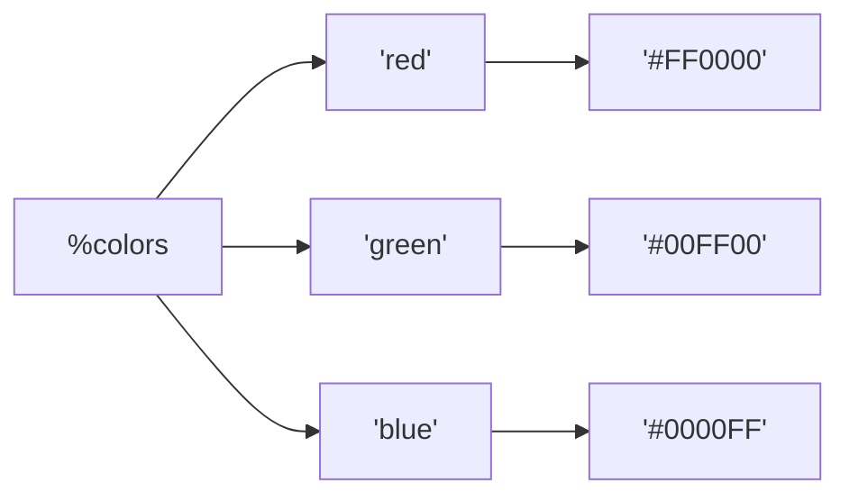
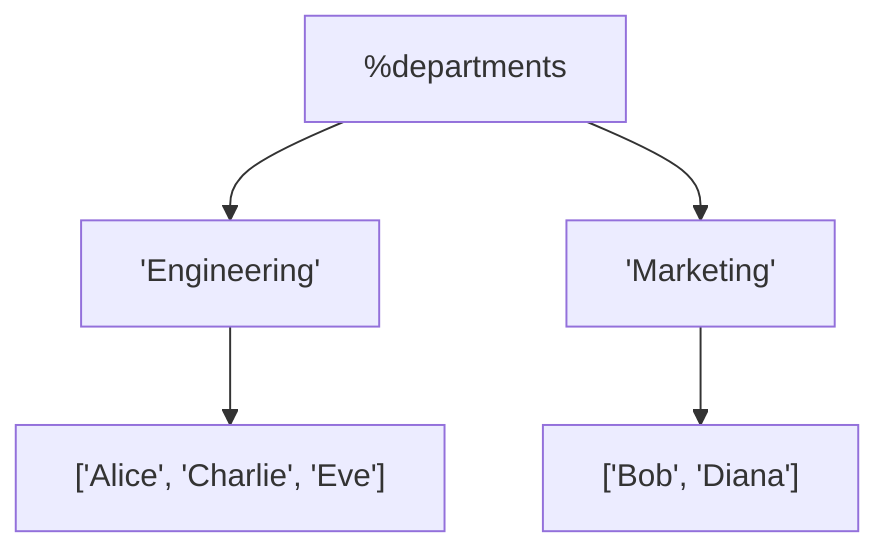

# Arrays, Hashes, and Lists

## Collecting and Organizing Data

**Version:** 1.0\
**Year:** 2025

---

## Copyright Notice

Copyright (c) 2025-2026 Ryan Thomas Robson / Robworks Software LLC. Licensed under [CC BY-NC-ND 4.0](../../LICENSE-CONTENT). You may share this material for non-commercial purposes with attribution, but you may not distribute modified versions.

---

Scalars hold a single value. That gets you surprisingly far, but real programs need collections - ordered lists of items, and named lookups that map keys to values. Perl gives you two aggregate data types for this: **arrays** and **hashes**. Everything else - lists, slices, iteration patterns, and nested structures - builds on top of these two.

This guide covers the tools you need to collect, organize, filter, transform, and iterate over data in Perl.

---

## Arrays

An [**array**](https://perldoc.perl.org/perldata#Array-value-constructors) is an ordered collection of scalars, identified by the `@` sigil. Each element has a numeric index starting at 0.

### Creating Arrays

```perl
# List assignment
my @colors = ('red', 'green', 'blue');

# qw() - quote words, splits on whitespace
my @days = qw(Monday Tuesday Wednesday Thursday Friday);

# Range operator
my @nums = (1..10);       # 1, 2, 3, ... 10
my @letters = ('a'..'z'); # a, b, c, ... z

# Empty array
my @empty = ();
```

The [**`qw()`**](https://perldoc.perl.org/perlop#qw/STRING/) operator is a shorthand for quoting a list of words. It splits on whitespace and returns a list of strings - no commas or quotes needed.

### Accessing Elements

When you access a single element from an array, you use the `$` sigil because a single element is a scalar:

```perl
my @fruits = ('apple', 'banana', 'cherry', 'date');

print $fruits[0];   # apple  (first element)
print $fruits[2];   # cherry (third element)
print $fruits[-1];  # date   (last element)
print $fruits[-2];  # cherry (second from last)
```

**Negative indices** count backwards from the end. `-1` is the last element, `-2` is second-to-last, and so on.

### Array Length and Last Index

Two common operations: getting the number of elements and getting the last valid index.

```perl
my @arr = ('a', 'b', 'c', 'd');

# Last index: $#array
print $#arr;           # 3 (indices 0..3)

# Element count: scalar @array
print scalar @arr;     # 4

# These are equivalent ways to access the last element
print $arr[$#arr];     # d
print $arr[-1];        # d
```

[**`$#array`**](https://perldoc.perl.org/perldata#Scalar-values) returns the index of the last element (one less than the count). **`scalar @array`** forces the array into [**scalar context**](https://perldoc.perl.org/perldata#Context), where an array evaluates to its element count. Any situation that expects a single value triggers scalar context automatically - `if (@array)` is true when the array is non-empty.

!!! tip "Array in Boolean Context"
    An empty array evaluates to `0` (false) in boolean context, and a non-empty array evaluates to its element count (true). This means `if (@array) { ... }` is the idiomatic way to check whether an array has elements.

```terminal
title: Working with Arrays
steps:
  - command: "perl -e 'my @colors = (\"red\", \"green\", \"blue\"); print \"$colors[0]\\n\";'"
    output: "red"
    narration: "Arrays use the @ sigil for the whole array, but $ when accessing a single element. Index 0 is the first element."
  - command: "perl -e 'my @nums = (1..10); print \"Last: $nums[-1], Count: \", scalar @nums, \"\\n\";'"
    output: "Last: 10, Count: 10"
    narration: "Negative indices count from the end. -1 is the last element. scalar @array forces scalar context, returning the element count."
  - command: "perl -e 'my @arr = (10, 20, 30); push @arr, 40; print \"@arr\\n\";'"
    output: "10 20 30 40"
    narration: "push adds elements to the end of an array. When you interpolate @arr in double quotes, elements are joined with spaces."
  - command: "perl -e 'my @arr = (10, 20, 30); my $last = pop @arr; print \"Popped: $last, Left: @arr\\n\";'"
    output: "Popped: 30, Left: 10 20"
    narration: "pop removes and returns the last element. push/pop treat the array as a stack (LIFO). shift/unshift work from the front."
```

```quiz
question: "Given my @arr = ('a', 'b', 'c', 'd'); what is the value of $#arr?"
type: multiple-choice
options:
  - text: "4 (the number of elements)"
    feedback: "$#arr is the last index, not the count. For the count, use scalar @arr. Since indexing starts at 0, the last index is 3."
  - text: "3 (the index of the last element)"
    correct: true
    feedback: "Correct! $#arr returns the highest index of @arr. With 4 elements indexed 0-3, the last index is 3. The element count is scalar @arr which is 4."
  - text: "'d' (the last element)"
    feedback: "$#arr gives the last index number (3), not the last element. Use $arr[-1] or $arr[$#arr] to get the last element itself."
  - text: "An error because you used $ with an array name"
    feedback: "The $ sigil is correct here. $#arr is a special syntax meaning 'last index of @arr'. You also use $ when accessing single elements: $arr[0]."
```

---

## Array Operations

Perl provides built-in functions to add, remove, and rearrange array elements without manual index management.

### Adding and Removing Elements

```perl
my @stack = (1, 2, 3);

# push/pop: work on the END of the array
push @stack, 4;          # @stack = (1, 2, 3, 4)
push @stack, 5, 6;       # @stack = (1, 2, 3, 4, 5, 6)
my $top = pop @stack;    # $top = 6, @stack = (1, 2, 3, 4, 5)

# shift/unshift: work on the BEGINNING of the array
my $first = shift @stack;    # $first = 1, @stack = (2, 3, 4, 5)
unshift @stack, 0;           # @stack = (0, 2, 3, 4, 5)
unshift @stack, -2, -1;      # @stack = (-2, -1, 0, 2, 3, 4, 5)
```

[**`push`**](https://perldoc.perl.org/perlfunc#push-ARRAY,LIST) and [**`pop`**](https://perldoc.perl.org/perlfunc#pop-ARRAY) make the array behave like a stack (last-in, first-out). [**`shift`**](https://perldoc.perl.org/perlfunc#shift-ARRAY) and [**`unshift`**](https://perldoc.perl.org/perlfunc#unshift-ARRAY,LIST) work from the front - useful for queues (first-in, first-out). All four modify the array in place.

### Splice: The Swiss Army Knife

[**`splice`**](https://perldoc.perl.org/perlfunc#splice-ARRAY,OFFSET,LENGTH,LIST) can insert, remove, or replace elements at any position:

```perl
my @arr = ('a', 'b', 'c', 'd', 'e');

# splice(ARRAY, OFFSET, LENGTH, REPLACEMENT_LIST)

# Remove 2 elements starting at index 1
my @removed = splice(@arr, 1, 2);
# @removed = ('b', 'c'), @arr = ('a', 'd', 'e')

# Insert without removing (LENGTH = 0)
splice(@arr, 1, 0, 'x', 'y');
# @arr = ('a', 'x', 'y', 'd', 'e')

# Replace 1 element at index 2
splice(@arr, 2, 1, 'z');
# @arr = ('a', 'x', 'z', 'd', 'e')
```

Think of `splice` as the generalized form. `push`, `pop`, `shift`, and `unshift` are just convenient shortcuts for common splice operations.

### Reverse and Sort

```perl
my @letters = ('c', 'a', 'd', 'b');

# reverse returns a new list in reversed order
my @backwards = reverse @letters;  # ('b', 'd', 'a', 'c')

# sort returns a new list in sorted order (alphabetical by default)
my @sorted = sort @letters;        # ('a', 'b', 'c', 'd')

# Neither modifies the original
print "@letters\n";  # c a d b
```

[**`reverse`**](https://perldoc.perl.org/perlfunc#reverse-LIST) and [**`sort`**](https://perldoc.perl.org/perlfunc#sort-SUBNAME-LIST) return new lists - the original array stays untouched unless you assign back to it: `@letters = sort @letters;`

!!! warning "Sort Is Alphabetical by Default"
    `sort` compares elements as strings by default. This means `sort (10, 2, 30)` produces `(10, 2, 30)` because the string `"10"` comes before `"2"` in ASCII order. You need a custom comparator for numeric sorting - covered in the Sorting section below.

---

## Lists and List Assignment

A **list** is an ordered sequence of scalars. It is not a data type - it is a temporary construct that exists during evaluation. Arrays store lists, but a list and an array are not the same thing.

```perl
# This is a list literal
(1, 2, 3)

# Assigned to an array, it becomes the array's contents
my @nums = (1, 2, 3);

# List assignment to scalars
my ($x, $y, $z) = (10, 20, 30);
print "$x $y $z\n";  # 10 20 30
```

### Swapping Variables

List assignment makes variable swapping trivial - no temporary variable needed:

```perl
my ($a, $b) = ('first', 'second');
($a, $b) = ($b, $a);
print "$a $b\n";  # second first
```

Perl evaluates the right side completely before assigning to the left side, so the swap works without a temp.

### Array Slices

An **array slice** extracts multiple elements at once, returning a list. Use the `@` sigil because you are getting multiple values:

```perl
my @arr = ('zero', 'one', 'two', 'three', 'four');

# Slice: specific indices
my @subset = @arr[1, 3];       # ('one', 'three')

# Slice: range
my @middle = @arr[1..3];       # ('one', 'two', 'three')

# Slice assignment
@arr[0, 4] = ('ZERO', 'FOUR');
print "@arr\n";  # ZERO one two three FOUR
```

The sigil change is a common source of confusion: `$arr[0]` (one element, scalar) vs. `@arr[0,2]` (multiple elements, list). The sigil indicates what you are getting back, not what the variable is.

### Context in Assignment

When a list has more values than variables, extras are discarded. When it has fewer, remaining variables get `undef`:

```perl
# Extra values discarded
my ($first, $second) = (10, 20, 30, 40);
# $first = 10, $second = 20 (30 and 40 are lost)

# Missing values become undef
my ($a, $b, $c) = (1, 2);
# $a = 1, $b = 2, $c = undef

# An array in a list absorbs everything remaining
my ($head, @rest) = (1, 2, 3, 4, 5);
# $head = 1, @rest = (2, 3, 4, 5)
```

!!! danger "Array Absorbs All Remaining Values"
    If you put an array in the middle of a list assignment, it will consume all remaining values and leave subsequent variables as `undef`:

    ```perl
    my (@arr, $last) = (1, 2, 3, 4);
    # @arr = (1, 2, 3, 4), $last = undef  <-- probably not what you wanted
    ```

    Always put arrays and hashes at the **end** of a list assignment.

---

## Iteration

### foreach / for

The most common way to iterate over an array is [**`foreach`**](https://perldoc.perl.org/perlsyn#Foreach-Loops):

```perl
my @names = qw(Alice Bob Charlie);

foreach my $name (@names) {
    print "Hello, $name!\n";
}
```

`foreach` and `for` are interchangeable when used with a list - Perl treats them identically:

```perl
# These are the same
foreach my $item (@list) { ... }
for my $item (@list) { ... }
```

Most Perl programmers use `for` (shorter) for list iteration and reserve the C-style syntax when they actually need it.

### The Default Variable: $_

If you omit the loop variable, Perl uses [**`$_`**](https://perldoc.perl.org/perlvar#$_), the **default variable**:

```perl
my @words = qw(hello world);

for (@words) {
    print "Word: $_\n";
}
```

Many built-in functions operate on `$_` by default: `print`, `chomp`, `split`, `lc`, `uc`, and others. This makes `$_` the implicit "it" that flows through your code.

### C-Style for Loop

When you need an index counter, use the C-style form:

```perl
my @items = qw(alpha beta gamma);

for (my $i = 0; $i <= $#items; $i++) {
    print "$i: $items[$i]\n";
}
```

Output:

```
0: alpha
1: beta
2: gamma
```

### Modifying Elements During Iteration

The loop variable in `for` is an alias to the actual array element, not a copy. Modifying it changes the array:

```perl
my @nums = (1, 2, 3, 4);

for my $n (@nums) {
    $n *= 10;
}

print "@nums\n";  # 10 20 30 40
```

!!! tip "Alias Behavior"
    This alias behavior is intentional and efficient - Perl does not copy the element. But it also means you can accidentally modify your data. If you need a copy, assign to a new variable inside the loop: `my $copy = $n;`

### while with Arrays

You can drain an array with `while` and `shift`:

```perl
my @queue = qw(first second third);

while (my $item = shift @queue) {
    print "Processing: $item\n";
}
# @queue is now empty
```

This pattern treats the array as a queue: process the front element, then remove it.

---

## Sorting

Default sort compares elements as strings using Perl's `cmp` operator. For anything else, you supply a comparison block.

### Default Sort (Alphabetical)

```perl
my @words = qw(banana cherry apple date);
my @sorted = sort @words;
print "@sorted\n";  # apple banana cherry date
```

### Numeric Sort

The [**spaceship operator `<=>`**](https://perldoc.perl.org/perlop#Equality-Operators) compares two numbers and returns -1, 0, or 1:

```perl
my @nums = (42, 5, 17, 100, 3);
my @sorted = sort { $a <=> $b } @nums;
print "@sorted\n";  # 3 5 17 42 100

# Descending: swap $a and $b
my @desc = sort { $b <=> $a } @nums;
print "@desc\n";  # 100 42 17 5 3
```

Inside the sort block, `$a` and `$b` are special package variables that Perl sets to the two elements being compared. The block must return a negative number, zero, or positive number to indicate ordering.

### Case-Insensitive Sort

```perl
my @names = qw(Charlie alice Bob);
my @sorted = sort { lc($a) cmp lc($b) } @names;
print "@sorted\n";  # alice Bob Charlie
```

The [**`cmp`**](https://perldoc.perl.org/perlop#Equality-Operators) operator does string comparison (like `<=>` does numeric comparison). Wrapping in `lc()` normalizes case before comparing.

### Multi-Key Sort

Chain comparisons with `||` (or) to break ties:

```perl
my @people = (
    { name => 'Alice',   age => 30 },
    { name => 'Bob',     age => 25 },
    { name => 'Charlie', age => 30 },
);

my @sorted = sort {
    $a->{age} <=> $b->{age}       # primary: age ascending
    ||
    $a->{name} cmp $b->{name}     # secondary: name ascending
} @people;

for my $p (@sorted) {
    print "$p->{name}: $p->{age}\n";
}
# Bob: 25
# Alice: 30
# Charlie: 30
```

The `||` short-circuits: if the first comparison returns non-zero, that result is used. If it returns zero (equal ages), the second comparison breaks the tie.

### The Schwartzian Transform

When sorting by a computed value, you do not want to recompute it on every comparison. The **Schwartzian transform** caches the sort key:

```perl
# Sort files by size (compute stat only once per file)
my @sorted =
    map  { $_->[0] }                    # 3. extract filename
    sort { $a->[1] <=> $b->[1] }        # 2. sort by size
    map  { [$_, -s $_] }                # 1. pair filename with size
    @files;
```

This reads bottom-to-top: wrap each element with its computed key, sort by the key, then unwrap. Named after Randal Schwartz, who popularized the pattern on Usenet.

```terminal
title: Sorting Arrays
steps:
  - command: "perl -e 'my @words = qw(banana cherry apple); print join(\", \", sort @words), \"\\n\";'"
    output: "apple, banana, cherry"
    narration: "Default sort is alphabetical (ASCIIbetical). qw() creates a list of strings without quotes or commas."
  - command: "perl -e 'my @nums = (10, 2, 30, 1); print join(\", \", sort @nums), \"\\n\";'"
    output: "1, 10, 2, 30"
    narration: "Default sort treats values as strings. '10' comes before '2' because '1' < '2' in ASCII. This is a common trap."
  - command: "perl -e 'my @nums = (10, 2, 30, 1); print join(\", \", sort { $a <=> $b } @nums), \"\\n\";'"
    output: "1, 2, 10, 30"
    narration: "The <=> operator (spaceship) compares numerically. $a and $b are special sort variables. Now 10 correctly comes after 2."
  - command: "perl -e 'my @names = qw(Bob alice Charlie); print join(\", \", sort { lc($a) cmp lc($b) } @names), \"\\n\";'"
    output: "alice, Bob, Charlie"
    narration: "cmp compares strings. Wrapping $a and $b in lc() makes the sort case-insensitive."
```

---

## Hashes

A [**hash**](https://perldoc.perl.org/perldata#Hashes-(Associative-Arrays)) (also called an associative array) is an unordered collection of key-value pairs, identified by the `%` sigil. Keys are always strings. Values are scalars.

### Creating Hashes

```perl
# Fat comma (=>) auto-quotes the left side
my %person = (
    name => 'Alice',
    age  => 30,
    city => 'Portland',
);

# Equivalent using plain commas (but less readable)
my %person = ('name', 'Alice', 'age', 30, 'city', 'Portland');
```

The [**fat comma `=>`**](https://perldoc.perl.org/perlop#Comma-Operator) is syntactically identical to a comma, but it auto-quotes the word on its left side. This makes hash initialization readable and eliminates the need for quotes on simple keys.

### Hash Structure

A hash maps string keys to scalar values. Unlike arrays, there is no defined order:



### Accessing Values

Use the `$` sigil (you are retrieving a single scalar value) with curly braces:

```perl
my %data = (name => 'Alice', age => 30, city => 'Portland');

print $data{name};    # Alice
print $data{age};     # 30

# Assigning a new key-value pair
$data{email} = 'alice@example.com';

# Overwriting an existing value
$data{age} = 31;
```

!!! tip "Sigil Summary"
    The sigil tells you what you are getting back, not what the variable is:

    | Expression | Sigil | Meaning |
    |-----------|-------|---------|
    | `%hash` | `%` | The entire hash |
    | `$hash{key}` | `$` | One scalar value |
    | `@hash{@keys}` | `@` | A list of values (hash slice) |

### Testing and Deleting Keys

```perl
my %config = (debug => 1, verbose => 0, timeout => 30);

# exists: does the key exist? (regardless of value)
if (exists $config{debug}) {
    print "debug key exists\n";
}

# defined: is the value defined? (not undef)
if (defined $config{verbose}) {
    print "verbose is defined (value: $config{verbose})\n";  # prints, value is 0
}

# delete: remove a key-value pair
delete $config{timeout};
print exists $config{timeout} ? "yes" : "no";  # no
```

[**`exists`**](https://perldoc.perl.org/perlfunc#exists-EXPR) checks whether a key is present. [**`defined`**](https://perldoc.perl.org/perlfunc#defined-EXPR) checks whether the value is not `undef`. [**`delete`**](https://perldoc.perl.org/perlfunc#delete-EXPR) removes the key-value pair entirely. The distinction matters: a key can exist with a value of `undef`, `0`, or an empty string - all of which are valid.

### Hash Slices

Like array slices, you can extract multiple values at once:

```perl
my %scores = (math => 95, english => 88, science => 92, history => 78);

# Hash slice: returns a list of values
my @subset = @scores{qw(math science)};
print "@subset\n";  # 95 92

# Hash slice assignment
@scores{qw(art music)} = (85, 90);
```

Note the `@` sigil on the slice - you are getting back a list of values, not a single scalar.

```quiz
question: "Given my %data = (name => 'Alice', age => 30); how do you access the age value?"
type: multiple-choice
options:
  - text: "%data{age}"
    feedback: "The % sigil is for the whole hash. When accessing a single value, use the $ sigil: $data{age}."
  - text: "$data{age}"
    correct: true
    feedback: "Correct! Use $ when accessing a single hash value (it's a scalar). The key goes in curly braces. The => (fat comma) auto-quotes the left side, so name => 'Alice' is the same as 'name', 'Alice'."
  - text: "$data[age]"
    feedback: "Square brackets are for arrays. Hashes use curly braces: $data{age}. This is a common mistake when coming from other languages."
  - text: "$data{'age'}"
    feedback: "This works but is unnecessary. Perl auto-quotes simple hash keys, so $data{age} and $data{'age'} are identical. Use the shorter form."
```

---

## Hash Iteration

Hashes have no inherent order, but Perl gives you several ways to walk through all key-value pairs.

### keys, values, each

```perl
my %inventory = (apples => 12, bananas => 6, cherries => 50);

# keys: returns a list of all keys
my @fruits = keys %inventory;
print "@fruits\n";  # (order not guaranteed)

# values: returns a list of all values
my @counts = values %inventory;
print "@counts\n";  # (order not guaranteed)

# each: returns the next (key, value) pair
while (my ($fruit, $count) = each %inventory) {
    print "$fruit: $count\n";
}
```

[**`keys`**](https://perldoc.perl.org/perlfunc#keys-HASH) and [**`values`**](https://perldoc.perl.org/perlfunc#values-HASH) return complete lists. [**`each`**](https://perldoc.perl.org/perlfunc#each-HASH) returns one pair at a time and maintains an internal iterator - useful for very large hashes where you do not want to build the entire key list in memory.

!!! warning "Avoid `each` in Most Code"
    The `each` function has a hidden internal iterator tied to the hash. If you exit a `while (each)` loop early, the iterator is not reset, and the next call to `each` resumes where you left off. This causes subtle bugs. Prefer `for my $key (keys %hash)` unless you have a specific reason to use `each`.

### Sorted Iteration

Since hash order is unpredictable, sort the keys when you need consistent output:

```perl
my %capitals = (
    France  => 'Paris',
    Germany => 'Berlin',
    Japan   => 'Tokyo',
    Brazil  => 'Brasilia',
);

for my $country (sort keys %capitals) {
    printf "%-10s => %s\n", $country, $capitals{$country};
}
```

Output:

```
Brazil     => Brasilia
France     => Paris
Germany    => Berlin
Japan      => Tokyo
```

You can also sort by value:

```perl
# Sort by value (alphabetical)
for my $key (sort { $capitals{$a} cmp $capitals{$b} } keys %capitals) {
    print "$key: $capitals{$key}\n";
}
```

```code-walkthrough
language: perl
title: Word Frequency Counter
code: |
  use strict;
  use warnings;

  my %count;
  while (my $line = <STDIN>) {
      chomp $line;
      for my $word (split /\s+/, lc $line) {
          $count{$word}++;
      }
  }

  for my $word (sort { $count{$b} <=> $count{$a} } keys %count) {
      printf "%-20s %d\n", $word, $count{$word};
  }
annotations:
  - line: 4
    text: "Declare an empty hash. No need to initialize it - Perl creates entries on first use (autovivification)."
  - line: 5
    text: "Read lines from STDIN. The diamond operator <STDIN> reads one line at a time, including the trailing newline."
  - line: 6
    text: "chomp removes the trailing newline from $line. Always chomp after reading input."
  - line: 7
    text: "split breaks the line on whitespace (\\s+). lc lowercases the line first so 'The' and 'the' count together."
  - line: 8
    text: "The ++ operator auto-creates the hash entry with value 0 on first access, then increments. No 'if exists' check needed."
  - line: 12
    text: "Sort keys by their count values in descending order. $count{$b} <=> $count{$a} reverses the sort (highest first)."
  - line: 13
    text: "printf formats output in columns. %-20s left-aligns the word in a 20-character field. %d prints the integer count."
```

```exercise
title: Simple CSV Processor
difficulty: beginner
scenario: |
  Write a Perl script that processes this CSV data (hardcoded as an array of lines):

  ```
  name,department,salary
  Alice,Engineering,95000
  Bob,Marketing,72000
  Charlie,Engineering,88000
  Diana,Marketing,78000
  Eve,Engineering,102000
  ```

  Your script should:
  1. Skip the header line
  2. Split each line on commas into fields
  3. Store the data in appropriate variables
  4. Print each person's name and department
  5. Calculate and print the average salary
hints:
  - "Store the lines in an array: my @lines = ('name,department,salary', 'Alice,...', ...);"
  - "Use shift @lines to remove and skip the header"
  - "Split each line: my ($name, $dept, $salary) = split /,/, $line;"
  - "Keep a running total: $total += $salary; and count with $count++"
solution: |
  ```perl
  use strict;
  use warnings;

  my @lines = (
      'name,department,salary',
      'Alice,Engineering,95000',
      'Bob,Marketing,72000',
      'Charlie,Engineering,88000',
      'Diana,Marketing,78000',
      'Eve,Engineering,102000',
  );

  shift @lines;  # Remove header

  my $total = 0;
  my $count = 0;

  for my $line (@lines) {
      my ($name, $dept, $salary) = split /,/, $line;
      printf "%-10s %s\n", $name, $dept;
      $total += $salary;
      $count++;
  }

  printf "\nAverage salary: \$%.2f\n", $total / $count;
  ```

  Output:
  ```
  Alice      Engineering
  Bob        Marketing
  Charlie    Engineering
  Diana      Marketing
  Eve        Engineering

  Average salary: $87000.00
  ```
```

---

## Powerful List Operations

Perl provides several built-in functions for transforming and filtering lists without explicit loops. These are the workhorses of idiomatic Perl code.

### grep: Filter a List

[**`grep`**](https://perldoc.perl.org/perlfunc#grep-BLOCK-LIST) returns elements where the block evaluates to true:

```perl
my @numbers = (1..20);

# Keep only even numbers
my @even = grep { $_ % 2 == 0 } @numbers;
print "@even\n";  # 2 4 6 8 10 12 14 16 18 20

# Keep non-empty strings
my @words = ('hello', '', 'world', '', 'perl');
my @nonempty = grep { length $_ } @words;
print "@nonempty\n";  # hello world perl

# grep with a regex
my @errors = grep { /error/i } @log_lines;
```

`grep` is Perl's list filter. The block runs once for each element, with `$_` set to the current element. Elements where the block returns true are included in the result.

### map: Transform a List

[**`map`**](https://perldoc.perl.org/perlfunc#map-BLOCK-LIST) applies a transformation to every element and returns the results:

```perl
my @names = qw(alice bob charlie);

# Capitalize each name
my @upper = map { ucfirst $_ } @names;
print "@upper\n";  # Alice Bob Charlie

# Square each number
my @nums = (1, 2, 3, 4, 5);
my @squares = map { $_ ** 2 } @nums;
print "@squares\n";  # 1 4 9 16 25

# map can return multiple values per element
my @pairs = map { ($_, $_ * 2) } (1, 2, 3);
print "@pairs\n";  # 1 2 2 4 3 6
```

`map` is the transformation counterpart to `grep`. The block runs for each element and returns whatever it produces. If the block returns a list, those values are flattened into the result.

### split and join

[**`split`**](https://perldoc.perl.org/perlfunc#split-/PATTERN/,EXPR,LIMIT) breaks a string into a list. [**`join`**](https://perldoc.perl.org/perlfunc#join-EXPR,LIST) combines a list into a string:

```perl
# split: string -> list
my $csv = "Alice,30,Portland";
my @fields = split /,/, $csv;
print "$fields[0]\n";   # Alice
print "$fields[1]\n";   # 30

# join: list -> string
my @parts = ('usr', 'local', 'bin');
my $path = join '/', @parts;
print "$path\n";         # usr/local/bin

# Split on whitespace (default behavior)
my $line = "  hello   world  ";
my @words = split ' ', $line;    # ('hello', 'world')
```

!!! tip "split with a String vs. Regex"
    `split ' ', $str` (with a literal space string, not a regex) has special behavior: it splits on any whitespace and discards leading whitespace. This matches `awk`'s default field splitting. `split /\s+/, $str` does not discard leading whitespace and may produce an empty first field.

### Chaining Operations

Combine `map`, `grep`, `sort`, and `join` to build data pipelines:

```perl
my @raw = qw(banana APPLE cherry apple BANANA Cherry);

# Normalize, deduplicate, sort, and format
my @result =
    sort
    grep { !$seen{$_}++ }
    map  { lc $_ }
    @raw;

print join(', ', @result), "\n";
# apple, banana, cherry
```

Read from bottom to top: `map` lowercases everything, `grep` keeps only the first occurrence of each value (using `%seen` to track duplicates), `sort` orders alphabetically.

```perl
# Sum of squares of even numbers from 1-20
my $sum = 0;
$sum += $_ for
    map  { $_ ** 2 }
    grep { $_ % 2 == 0 }
    (1..20);

print "$sum\n";  # 1540
```

```quiz
question: "What does this code produce? my @nums = (1..10); my @even = grep { $_ % 2 == 0 } @nums; print \"@even\";"
type: multiple-choice
options:
  - text: "1 3 5 7 9"
    feedback: "Those are the odd numbers. The condition $_ % 2 == 0 selects even numbers (where the remainder when divided by 2 is zero)."
  - text: "2 4 6 8 10"
    correct: true
    feedback: "Correct! grep filters a list, keeping elements where the block returns true. $_ % 2 == 0 is true for even numbers. grep is Perl's list-filtering tool, similar to the Unix grep command but for data structures."
  - text: "0 0 0 0 0"
    feedback: "grep returns the elements themselves, not the result of the condition. It keeps elements where the block is true."
  - text: "An error because grep is for files, not arrays"
    feedback: "Perl's grep function works on lists and arrays, not files. It's inspired by the Unix grep command but operates on in-memory data."
```

```command-builder
base: perl -lane
description: Build a one-liner for field extraction and processing
options:
  - flag: ""
    type: select
    label: "Processing"
    explanation: "What to do with the input fields"
    choices:
      - ["'print $F[0]'", "Print first field"]
      - ["'print $F[-1]'", "Print last field"]
      - ["'print join \",\", @F[0,2]'", "Print fields 1 and 3 as CSV"]
      - ["'$sum += $F[1]; END { print $sum }'", "Sum second field"]
  - flag: ""
    type: select
    label: "Input file"
    explanation: "Source file to process"
    choices:
      - ["/etc/passwd", "/etc/passwd"]
      - ["access.log", "access.log"]
      - ["data.csv", "data.csv"]
```

---

## Nested Data Structures

So far, arrays hold scalars and hashes map strings to scalars. But what if you need an array of arrays, or a hash whose values are arrays? Perl handles this with **references** - scalar values that point to other data structures. A full treatment of references comes in a later guide, but you need the basics here to build real-world data structures.

### References in Brief

A **reference** is a scalar that holds the memory address of another variable. Create one with `\` and dereference with the appropriate sigil or arrow notation:

```perl
my @colors = ('red', 'green', 'blue');
my $ref = \@colors;       # $ref is a reference to @colors

print $ref->[0];           # red (arrow notation)
print ${$ref}[1];          # green (block dereference)
```

Anonymous references skip the named variable:

```perl
my $arr_ref = ['red', 'green', 'blue'];   # anonymous array ref
my $hash_ref = { name => 'Alice', age => 30 };  # anonymous hash ref
```

Square brackets `[]` create an anonymous array reference. Curly braces `{}` (in a value context) create an anonymous hash reference.

### Arrays of Arrays

```perl
my @matrix = (
    [1, 2, 3],
    [4, 5, 6],
    [7, 8, 9],
);

# Access element at row 1, column 2
print $matrix[1][2], "\n";    # 6
print $matrix[1]->[2], "\n";  # 6 (same thing - arrow is optional between brackets)

# Iterate
for my $row (@matrix) {
    print join(', ', @$row), "\n";
}
# 1, 2, 3
# 4, 5, 6
# 7, 8, 9
```

Each element of `@matrix` is a reference to an anonymous array. `$matrix[1]` gives you the reference, and `[2]` indexes into the array it points to.

### Hashes of Arrays

Group related lists under named keys:

```perl
my %departments = (
    Engineering => ['Alice', 'Charlie', 'Eve'],
    Marketing   => ['Bob', 'Diana'],
    Support     => ['Frank', 'Grace', 'Hank'],
);

# Access a specific person
print $departments{Engineering}[0], "\n";  # Alice

# Add to a department
push @{$departments{Marketing}}, 'Ivan';

# Iterate
for my $dept (sort keys %departments) {
    my @members = @{$departments{$dept}};
    print "$dept: ", join(', ', @members), "\n";
}
# Engineering: Alice, Charlie, Eve
# Marketing: Bob, Diana, Ivan
# Support: Frank, Grace, Hank
```

### Nested Data Structure

Here is how a hash of arrays looks in memory:



Each key points to a reference, and each reference points to an array of scalars.

### Hashes of Hashes

The most common nested structure for record-like data:

```perl
my %users = (
    alice => {
        email => 'alice@example.com',
        role  => 'admin',
        age   => 30,
    },
    bob => {
        email => 'bob@example.com',
        role  => 'user',
        age   => 25,
    },
);

# Access nested value
print $users{alice}{email}, "\n";   # alice@example.com

# Add a new user
$users{charlie} = {
    email => 'charlie@example.com',
    role  => 'user',
    age   => 28,
};

# Iterate over all users
for my $name (sort keys %users) {
    my $info = $users{$name};
    printf "%-10s %-25s %s\n", $name, $info->{email}, $info->{role};
}
```

Output:

```
alice      alice@example.com         admin
bob        bob@example.com           user
charlie    charlie@example.com       user
```

### Arrow Notation

When chaining dereferences, the arrow `->` between adjacent brackets is optional:

```perl
my %data = (
    servers => [
        { name => 'web1', ip => '10.0.0.1' },
        { name => 'web2', ip => '10.0.0.2' },
    ],
);

# All three are equivalent
print $data{servers}->[0]->{name};  # web1 (explicit arrows)
print $data{servers}[0]{name};      # web1 (arrows optional between brackets)
print ${$data{servers}}[0]{name};   # web1 (block dereference)
```

The arrow-between-brackets rule applies only between adjacent subscripts. The first arrow after a variable name is still required: `$ref->[0]` (not `$ref[0]`, which would access `@ref`).

!!! warning "Autovivification"
    Perl automatically creates intermediate data structures when you access a nested path that does not exist yet:

    ```perl
    my %data;
    $data{a}{b}{c} = 'deep';
    # Perl silently created $data{a} as a hashref, and $data{a}{b} as a hashref
    ```

    This is convenient but can mask typos. The [**`autovivification`**](https://metacpan.org/pod/autovivification) pragma on CPAN lets you disable it selectively.

```exercise
title: Phone Book Application
difficulty: intermediate
scenario: |
  Build a Perl script that implements a simple phone book using a hash of hashes.

  Requirements:
  1. Store contacts with name, phone, and email in a hash
  2. Pre-populate with at least 3 contacts
  3. Print all contacts sorted alphabetically by name
  4. Look up a specific contact by name and print their details
  5. Add a new contact
  6. Delete a contact
  7. Print the updated contact list

  Each contact should be stored as: $contacts{name} = { phone => '...', email => '...' }
hints:
  - "Create the hash: my %contacts = (Alice => {phone => '555-0101', email => 'alice\\@example.com'});"
  - "Access nested values: $contacts{Alice}{phone}"
  - "Delete with: delete $contacts{Alice}"
  - "Iterate sorted: for my $name (sort keys %contacts) { ... }"
solution: |
  ```perl
  use strict;
  use warnings;

  my %contacts = (
      Alice   => { phone => '555-0101', email => 'alice@example.com' },
      Bob     => { phone => '555-0102', email => 'bob@example.com' },
      Charlie => { phone => '555-0103', email => 'charlie@example.com' },
  );

  # Print all contacts
  print "=== Phone Book ===\n";
  for my $name (sort keys %contacts) {
      printf "%-10s Phone: %-10s Email: %s\n",
          $name, $contacts{$name}{phone}, $contacts{$name}{email};
  }

  # Look up a contact
  my $lookup = 'Bob';
  if (exists $contacts{$lookup}) {
      print "\nLookup $lookup: $contacts{$lookup}{phone}\n";
  }

  # Add a new contact
  $contacts{Diana} = { phone => '555-0104', email => 'diana@example.com' };
  print "\nAdded Diana\n";

  # Delete a contact
  delete $contacts{Charlie};
  print "Deleted Charlie\n";

  # Print updated list
  print "\n=== Updated Phone Book ===\n";
  for my $name (sort keys %contacts) {
      printf "%-10s Phone: %-10s Email: %s\n",
          $name, $contacts{$name}{phone}, $contacts{$name}{email};
  }
  ```
```

---

## Putting It All Together

Here is a complete example that combines arrays, hashes, list operations, sorting, and nested structures to solve a practical problem:

```perl
use strict;
use warnings;

# Log entries: timestamp, severity, message
my @log = (
    { time => '09:01', level => 'INFO',  msg => 'Server started' },
    { time => '09:05', level => 'WARN',  msg => 'Disk usage at 80%' },
    { time => '09:12', level => 'ERROR', msg => 'Connection refused to db1' },
    { time => '09:15', level => 'INFO',  msg => 'Backup completed' },
    { time => '09:22', level => 'ERROR', msg => 'Connection refused to db2' },
    { time => '09:30', level => 'WARN',  msg => 'Memory usage at 75%' },
    { time => '09:45', level => 'ERROR', msg => 'Timeout on api endpoint' },
);

# Count entries by severity
my %counts;
$counts{$_->{level}}++ for @log;

print "Summary:\n";
for my $level (sort keys %counts) {
    printf "  %-8s %d entries\n", $level, $counts{$level};
}

# Extract error messages
my @errors = map  { "$_->{time} - $_->{msg}" }
             grep { $_->{level} eq 'ERROR' }
             @log;

print "\nErrors:\n";
print "  $_\n" for @errors;

# Group messages by severity
my %by_level;
for my $entry (@log) {
    push @{$by_level{$entry->{level}}}, $entry->{msg};
}

print "\nGrouped:\n";
for my $level (sort keys %by_level) {
    print "  $level:\n";
    print "    - $_\n" for @{$by_level{$level}};
}
```

Output:

```
Summary:
  ERROR    3 entries
  INFO     2 entries
  WARN     2 entries

Errors:
  09:12 - Connection refused to db1
  09:22 - Connection refused to db2
  09:45 - Timeout on api endpoint

Grouped:
  ERROR:
    - Connection refused to db1
    - Connection refused to db2
    - Timeout on api endpoint
  INFO:
    - Server started
    - Backup completed
  WARN:
    - Disk usage at 80%
    - Memory usage at 75%
```

This pattern - filter with `grep`, transform with `map`, group into hashes, sort for output - is the core of practical Perl data processing.

---

## Quick Reference

| Operation | Syntax | Description |
|-----------|--------|-------------|
| Create array | `my @arr = (1, 2, 3)` | Ordered list of scalars |
| Access element | `$arr[0]` | Single element (scalar context) |
| Last index | `$#arr` | Highest valid index |
| Count | `scalar @arr` | Number of elements |
| Add to end | `push @arr, $val` | Append element(s) |
| Remove from end | `pop @arr` | Remove and return last |
| Add to front | `unshift @arr, $val` | Prepend element(s) |
| Remove from front | `shift @arr` | Remove and return first |
| Array slice | `@arr[1,3,5]` | Multiple elements |
| Create hash | `my %h = (k => 'v')` | Key-value pairs |
| Access value | `$h{key}` | Single value (scalar context) |
| Key exists? | `exists $h{key}` | Boolean test |
| Delete key | `delete $h{key}` | Remove pair |
| All keys | `keys %h` | List of keys |
| All values | `values %h` | List of values |
| Hash slice | `@h{qw(a b)}` | Multiple values |
| Filter list | `grep { ... } @list` | Keep matching elements |
| Transform list | `map { ... } @list` | Apply block to each |
| Sort list | `sort { ... } @list` | Custom ordering |
| Split string | `split /,/, $str` | String to list |
| Join list | `join ',', @list` | List to string |

---

## Further Reading

- [perldata](https://perldoc.perl.org/perldata) - Perl data types: scalars, arrays, and hashes
- [perlfunc](https://perldoc.perl.org/perlfunc) - complete list of Perl built-in functions
- [perlref](https://perldoc.perl.org/perlref) - Perl references and nested data structures
- [perldsc](https://perldoc.perl.org/perldsc) - Perl data structures cookbook (arrays of arrays, hashes of hashes, etc.)
- [perllol](https://perldoc.perl.org/perllol) - manipulating arrays of arrays
- [perlop](https://perldoc.perl.org/perlop) - Perl operators including `<=>`, `cmp`, `=>`, and `qw()`
- [Learning Perl, Chapter 3-6](https://www.oreilly.com/library/view/learning-perl-8th/9781492094944/) - the "Llama Book" coverage of lists, arrays, hashes, and I/O
- [Intermediate Perl](https://www.oreilly.com/library/view/intermediate-perl-2nd/9781449343781/) - the "Alpaca Book," focused on references and data structures

---

**Previous:** [Scalars, Strings, and Numbers](scalars-strings-numbers.md) | **Next:** [Control Flow](control-flow.md) | [Back to Index](README.md)
