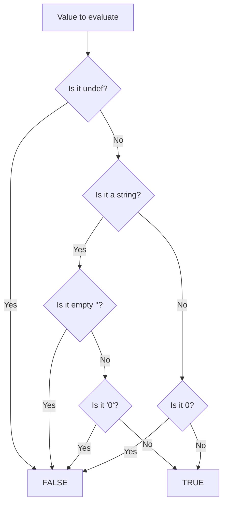
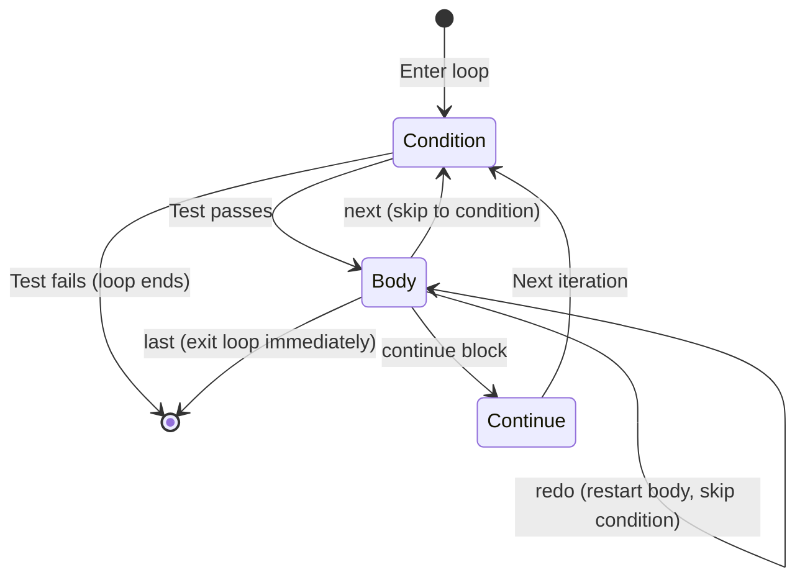

# Control Flow

## Directing Program Logic

**Version:** 1.0
**Year:** 2026

---

## Copyright Notice

Copyright (c) 2025-2026 Ryan Thomas Robson / Robworks Software LLC. Licensed under [CC BY-NC-ND 4.0](../../LICENSE-CONTENT). You may share this material for non-commercial purposes with attribution, but you may not distribute modified versions.

---

## Conditionals: if/elsif/else

Every program needs to make decisions. In Perl, the primary tool for branching is [**`if`**](https://perldoc.perl.org/perlsyn#Compound-Statements):

```perl
my $temperature = 95;

if ($temperature > 100) {
    print "Boiling!\n";
} elsif ($temperature > 80) {
    print "Hot\n";
} elsif ($temperature > 60) {
    print "Comfortable\n";
} else {
    print "Cold\n";
}
```

A few things stand out immediately:

- The condition must be in parentheses.
- The body must be in braces, even for a single statement. Perl does not allow braceless `if` blocks (unlike C or JavaScript).
- `elsif` has no second `e`. This trips up every newcomer exactly once.

### Comparison Operators

Perl has two complete sets of comparison operators - one for numbers and one for strings. Using the wrong set is one of the most common Perl bugs.

| Operation | Numeric | String |
|-----------|---------|--------|
| Equal | `==` | `eq` |
| Not equal | `!=` | `ne` |
| Less than | `<` | `lt` |
| Greater than | `>` | `gt` |
| Less or equal | `<=` | `le` |
| Greater or equal | `>=` | `ge` |
| Comparison (three-way) | `<=>` | `cmp` |

The three-way operators (`<=>` and `cmp`) return -1, 0, or 1. They are essential for custom `sort` comparators:

```perl
my @sorted = sort { $a <=> $b } @numbers;    # numeric ascending
my @alpha  = sort { $a cmp $b } @strings;     # alphabetical
```

!!! warning "String vs. Numeric Comparison"
    `"apple" == "banana"` evaluates to **true** because `==` forces both strings to numeric context, converting them to `0`. Use `eq` for string comparison. If `use warnings` is enabled (and it should be), Perl will warn you about this mistake.

### Compound Conditions

Combine conditions with logical operators. Perl provides two styles:

| Meaning | Symbol (high precedence) | Word (low precedence) |
|---------|--------------------------|----------------------|
| AND | `&&` | `and` |
| OR | `\|\|` | `or` |
| NOT | `!` | `not` |

```perl
# Symbol style - common in conditions
if ($age >= 18 && $age <= 65) {
    print "Working age\n";
}

# Word style - common in flow control
open my $fh, '<', $file or die "Cannot open $file: $!";
```

The word operators (`and`, `or`, `not`) have lower precedence than assignment, which is why `open ... or die` works without parentheses. The symbol operators (`&&`, `||`, `!`) bind more tightly and are the standard choice inside conditionals.

!!! tip "Precedence Rule of Thumb"
    Use `&&`/`||`/`!` inside `if` conditions. Use `and`/`or`/`not` for flow control at the statement level (like `open ... or die`). Mixing them in the same expression leads to surprises.

```terminal
title: Conditional Expressions
steps:
  - command: "perl -e 'my $x = 10; if ($x > 5) { print \"big\\n\" } else { print \"small\\n\" }'"
    output: "big"
    narration: "Basic if/else. The condition is in parentheses, the body in braces. Perl requires braces even for single statements (unlike C)."
  - command: "perl -e 'my $name = \"Perl\"; if ($name eq \"Perl\") { print \"match\\n\" }'"
    output: "match"
    narration: "Use eq for string comparison, not ==. Using == on strings compares their numeric value (usually 0), which is almost never what you want."
  - command: "perl -e 'my $x = 10; print \"positive\\n\" if $x > 0; print \"even\\n\" if $x % 2 == 0;'"
    output: "positive\neven"
    narration: "Statement modifiers put the condition after the action. Read it as: 'print positive if x is greater than 0.' Concise for single statements."
  - command: "perl -e 'my $val = 42; my $type = ($val % 2 == 0) ? \"even\" : \"odd\"; print \"$val is $type\\n\";'"
    output: "42 is even"
    narration: "The ternary operator is a compact if/else in an expression. Useful for assignments, not for complex logic."
```

---

## unless

[**`unless`**](https://perldoc.perl.org/perlsyn#Compound-Statements) is a negated `if`. It executes the block when the condition is **false**:

```perl
unless ($user_authenticated) {
    redirect_to_login();
}
```

This reads more naturally than `if (!$user_authenticated)` in many cases. But there are clear rules about when `unless` helps readability:

**Use `unless` when:**

- The condition is a simple boolean or single test
- The English reads naturally: "unless the user is authenticated, redirect"

**Avoid `unless` when:**

- You need an `elsif` or `else` branch - `unless/else` reads backwards and confuses everyone
- The condition is compound (`unless ($a && !$b)` is a logic puzzle)
- You are using double negatives (`unless (!$found)` - just use `if ($found)`)

```perl
# Good - reads naturally
die "File not found" unless -e $filename;

# Bad - unless with else is confusing
unless ($ready) {
    wait_more();
} else {
    proceed();   # Wait, so this runs when $ready is true?
}

# Better - just use if
if ($ready) {
    proceed();
} else {
    wait_more();
}
```

---

## The Ternary Operator

The **ternary operator** (`?:`) is an expression-level if/else. It evaluates to one of two values based on a condition:

```perl
my $status = ($count > 0) ? "active" : "empty";
```

This is equivalent to:

```perl
my $status;
if ($count > 0) {
    $status = "active";
} else {
    $status = "empty";
}
```

The ternary operator shines in assignments, function arguments, and print statements - anywhere you need a value, not a block:

```perl
printf "Found %d %s\n", $count, ($count == 1) ? "item" : "items";

my $label = $is_admin ? "Administrator" : "User";
```

You can nest ternaries, but deep nesting becomes unreadable quickly:

```perl
# One level of nesting is sometimes acceptable
my $grade = ($score >= 90) ? "A"
          : ($score >= 80) ? "B"
          : ($score >= 70) ? "C"
          :                  "F";

# More than two levels? Use if/elsif instead.
```

!!! tip
    If a ternary expression does not fit on one line or requires nesting more than two levels deep, switch to `if`/`elsif`. The few saved lines are not worth the readability cost.

---

## Statement Modifiers

Perl supports **postfix conditionals** - you can put `if`, `unless`, `while`, `until`, `for`, or `foreach` after a single statement:

```perl
print "Found it!\n" if $found;
warn "Disk full\n"  unless $space_available;
print $_ while <STDIN>;
$total += $_ for @values;
```

Statement modifiers work only with a **single statement** on the left side. You cannot put a block before a modifier:

```perl
# This is a syntax error
{
    print "hello\n";
    print "world\n";
} if $greet;

# Do this instead
if ($greet) {
    print "hello\n";
    print "world\n";
}
```

The common modifiers and when to use them:

| Modifier | Meaning | Example |
|----------|---------|---------|
| `if` | Execute when true | `return $cached if exists $cache{$key};` |
| `unless` | Execute when false | `die "Required" unless defined $value;` |
| `while` | Loop while true | `print <$fh> while defined($_ = <$fh>);` |
| `until` | Loop until true | `sleep 1 until -e $lockfile;` |
| `for`/`foreach` | Loop over list | `print "$_\n" for @names;` |

Statement modifiers read like English and reduce visual clutter for simple operations. The convention is: use the modifier form when the action is more important than the condition, and the whole thing fits on one line.

```perl
# Modifier form - emphasizes the action
next if $line =~ /^#/;

# Block form - emphasizes the condition
if ($line =~ /^#/) {
    $comment_count++;
    push @comments, $line;
    next;
}
```

```exercise
title: FizzBuzz in Perl
difficulty: beginner
scenario: |
  Write the classic FizzBuzz program in Perl:

  For numbers 1 through 30:
  - Print "Fizz" if the number is divisible by 3
  - Print "Buzz" if the number is divisible by 5
  - Print "FizzBuzz" if divisible by both 3 and 5
  - Otherwise print the number itself

  Each value should be on its own line.
hints:
  - "Use a for loop: for my $n (1..30) { ... }"
  - "Check divisible-by-both first: if ($n % 15 == 0) - because 15 is 3*5"
  - "Use elsif for the remaining cases"
  - "The modulo operator % gives the remainder: 15 % 3 == 0 means 15 is divisible by 3"
solution: |
  ```perl
  use strict;
  use warnings;

  for my $n (1..30) {
      if ($n % 15 == 0) {
          print "FizzBuzz\n";
      } elsif ($n % 3 == 0) {
          print "Fizz\n";
      } elsif ($n % 5 == 0) {
          print "Buzz\n";
      } else {
          print "$n\n";
      }
  }
  ```

  The check for 15 (3*5) must come first. If you check for 3 first,
  numbers like 15 and 30 would print "Fizz" instead of "FizzBuzz"
  because the first matching branch wins.
```

```quiz
question: "What does this code do? print \"found it!\\n\" and exit if $x == 42;"
type: multiple-choice
options:
  - text: "Prints 'found it!' and exits only if $x is 42"
    correct: true
    feedback: "Correct! The postfix 'if' applies to the entire statement before it. The 'and' chains two actions: print then exit. Read it as: 'print and exit, if x equals 42.' This is idiomatic Perl for early returns."
  - text: "Always prints 'found it!', then exits if $x is 42"
    feedback: "The postfix 'if' applies to the whole statement, not just the exit. Nothing happens unless $x == 42."
  - text: "A syntax error because you can't chain with 'and' before 'if'"
    feedback: "This is valid Perl. The 'and' operator chains the print and exit into one statement, and the postfix 'if' conditionally executes both."
  - text: "Prints 'found it!' if $x is 42, but always exits"
    feedback: "The postfix 'if' applies to the entire expression including the 'and exit'. If $x is not 42, nothing happens at all."
```

---

## Perl's Truth Rules

Truth in Perl is simple once you learn the four false values. Understanding truthiness is fundamental to every conditional, loop, and short-circuit operator in the language.

**A value is false if it is:**

1. [**`undef`**](https://perldoc.perl.org/perlfunc#undef) - no value at all
2. `""` - the empty string
3. `0` - the number zero
4. `"0"` - the string containing just the character zero

**Everything else is true.** This includes `"0E0"`, `" "` (a space), `"00"`, `0.0` (which stringifies to `"0"`), empty arrays in scalar context (they evaluate to `0`), and references (always true).

```perl
# All false
if (undef)  { ... }   # false
if ("")     { ... }   # false
if (0)      { ... }   # false
if ("0")    { ... }   # false

# All true (some surprise people)
if ("0E0")  { ... }   # true - non-empty string that isn't "0"
if (" ")    { ... }   # true - contains a space
if ("00")   { ... }   # true - two characters, not the string "0"
if (0.0)    { ... }   # false - 0.0 is numeric 0
if (\0)     { ... }   # true - it's a reference
if ([])     { ... }   # true - it's a reference to an empty array
```

!!! warning "The \"0E0\" Trick"
    The DBI module returns `"0E0"` for queries that succeed but affect zero rows. This evaluates to true in boolean context (it is a non-empty string that is not `"0"`) but to `0` in numeric context (it is zero in scientific notation). This lets you distinguish "zero rows affected" (true, `"0E0"`) from "query failed" (false, `undef`).

The following diagram shows how Perl evaluates truthiness:



In practice, Perl internally converts between strings and numbers freely, so the evaluation is more nuanced. A value like `0.0` is numeric zero, which is false. A value like `"00"` is the string "00", not "0", so it is true. The rules above cover every case you will encounter in real code.

```quiz
question: "Which of these values is TRUE in Perl?"
type: multiple-choice
options:
  - text: "The string \"0\""
    feedback: "The string \"0\" is one of Perl's false values. This surprises many programmers - both numeric 0 and the string \"0\" are false."
  - text: "The string \"0E0\""
    correct: true
    feedback: "Correct! \"0E0\" is true because it's a non-empty string that isn't \"0\". Numerically it equals 0 (zero in scientific notation), but Perl checks string truthiness first. DBI uses this trick to return 'true but zero' for queries that affect 0 rows."
  - text: "The empty string \"\""
    feedback: "The empty string is false in Perl. The false values are: undef, \"\" (empty string), 0 (the number), and \"0\" (the string)."
  - text: "undef"
    feedback: "undef is Perl's 'no value' and is always false. It's one of the four false values along with \"\", 0, and \"0\"."
```

---

## while and until Loops

The [**`while`**](https://perldoc.perl.org/perlsyn#Loop-Statements) loop repeats a block as long as the condition is true:

```perl
my $count = 10;
while ($count > 0) {
    print "$count...\n";
    $count--;
}
print "Liftoff!\n";
```

The [**`until`**](https://perldoc.perl.org/perlsyn#Loop-Statements) loop is the opposite - it repeats until the condition becomes true:

```perl
my $response;
until (defined $response && $response eq "yes") {
    print "Continue? (yes/no): ";
    $response = <STDIN>;
    chomp $response;
}
```

### do-while and do-until

If you need the body to execute at least once before checking the condition, use `do`:

```perl
my $input;
do {
    print "Enter a number (1-10): ";
    $input = <STDIN>;
    chomp $input;
} while ($input < 1 || $input > 10);
```

!!! warning "do-while Is Not a True Loop"
    A `do { ... } while` block is not a real loop in Perl's eyes. The `next`, `last`, and `redo` loop control statements do not work inside it. If you need loop control, use a regular `while` loop with the exit condition at the end.

### Infinite Loops

`while (1)` creates an infinite loop. You break out of it with `last`:

```perl
while (1) {
    print "Command: ";
    my $cmd = <STDIN>;
    chomp $cmd;
    last if $cmd eq "quit";
    process_command($cmd);
}
```

### Reading Input with while

One of Perl's most common patterns is reading input line by line:

```perl
while (my $line = <STDIN>) {
    chomp $line;
    print "Got: $line\n";
}
```

Perl has special magic here: the `while (<STDIN>)` construct automatically checks for `defined` rather than truth, so it correctly handles lines containing just `"0"`. Writing `while (defined(my $line = <STDIN>))` is equivalent, but the short form is idiomatic.

The same pattern works for files:

```perl
open my $fh, '<', 'data.txt' or die "Cannot open: $!";
while (my $line = <$fh>) {
    chomp $line;
    # process $line
}
close $fh;
```

---

## for and foreach Loops

Perl has two loop styles: C-style `for` and list-iteration `foreach`. In practice, Perl treats `for` and `foreach` as interchangeable keywords - you can use either for both styles. Most Perl programmers use `for` exclusively.

### C-style for

```perl
for (my $i = 0; $i < 10; $i++) {
    print "$i\n";
}
```

The three-part header works exactly like C: initialize, test, increment. The loop variable `$i` is lexically scoped to the loop when declared with `my`.

### List Iteration with for/foreach

The far more common style iterates over a list:

```perl
my @fruits = ("apple", "banana", "cherry");

for my $fruit (@fruits) {
    print "I like $fruit\n";
}
```

If you omit the loop variable, Perl uses `$_`:

```perl
for (@fruits) {
    print "I like $_\n";
}
```

!!! tip "Aliasing, Not Copying"
    The loop variable is an **alias** for the current element, not a copy. Modifying the loop variable modifies the original array:

    ```perl
    my @nums = (1, 2, 3);
    for (@nums) {
        $_ *= 2;
    }
    # @nums is now (2, 4, 6)
    ```

    This is powerful but can cause bugs if you forget about it. Use a named variable (`for my $item (@array)`) to make the aliasing visible and intentional.

### The Range Operator

The **range operator** (`..`) generates a list of consecutive values:

```perl
for my $n (1..10) {
    print "$n\n";
}

# Also works with characters
for my $letter ('a'..'z') {
    print "$letter ";
}
```

### Reverse Iteration

To iterate in reverse:

```perl
for my $i (reverse 1..10) {
    print "$i...\n";
}
```

### Iterating with Index

When you need both the index and the value:

```perl
my @items = ("first", "second", "third");

for my $i (0..$#items) {
    print "$i: $items[$i]\n";
}
```

`$#items` gives the last index of the array.

---

## Loop Control

Three statements control loop execution from inside the body: [**`next`**](https://perldoc.perl.org/perlfunc#next), [**`last`**](https://perldoc.perl.org/perlfunc#last), and [**`redo`**](https://perldoc.perl.org/perlfunc#redo).

| Statement | Effect | Equivalent in C/Python |
|-----------|--------|----------------------|
| `next` | Skip to the next iteration | `continue` / `continue` |
| `last` | Exit the loop entirely | `break` / `break` |
| `redo` | Restart the current iteration (no re-check) | No equivalent |

```perl
for my $n (1..20) {
    next if $n % 2 == 0;    # skip even numbers
    last if $n > 15;         # stop after 15
    print "$n\n";            # prints 1, 3, 5, 7, 9, 11, 13, 15
}
```

### redo

`redo` restarts the current iteration without re-evaluating the loop condition or advancing the iterator. It is useful for retry logic:

```perl
for my $server (@servers) {
    my $response = ping($server);
    unless ($response) {
        warn "Retrying $server...\n";
        sleep 1;
        redo;   # try the same $server again
    }
    print "$server is up\n";
}
```

!!! danger "Infinite redo"
    Without a counter or other exit condition, `redo` can create an infinite loop. Always include a way to eventually stop retrying:

    ```perl
    my $attempts = 0;
    for my $server (@servers) {
        $attempts = 0;
        RETRY: {
            my $response = ping($server);
            unless ($response) {
                $attempts++;
                redo RETRY if $attempts < 3;
                warn "Giving up on $server\n";
                next;
            }
        }
        print "$server is up\n";
    }
    ```

The following diagram shows how each loop control keyword changes the flow within a single loop iteration:



### Labeled Loops

When you have nested loops, `next` and `last` affect the **innermost** loop by default. **Labels** let you target an outer loop:

```perl
OUTER: for my $i (1..10) {
    for my $j (1..10) {
        next OUTER if $j == 5;    # skip to next $i
        last OUTER if $i == 3;    # exit both loops
        print "$i.$j ";
    }
}
```

Labels are uppercase by convention. They go before the loop keyword followed by a colon. You can use any label name, but `OUTER`, `LINE`, `ROW`, and `FILE` are common choices that describe what the loop iterates over.

```terminal
title: Loop Control with Labels
steps:
  - command: "perl -e 'for my $i (1..5) { next if $i == 3; print \"$i \"; } print \"\\n\";'"
    output: "1 2 4 5 "
    narration: "next skips the current iteration. When $i is 3, the print is skipped and the loop continues with 4."
  - command: "perl -e 'for my $i (1..10) { last if $i > 5; print \"$i \"; } print \"\\n\";'"
    output: "1 2 3 4 5 "
    narration: "last exits the loop entirely. Once $i exceeds 5, the loop stops. This is like 'break' in C or Python."
  - command: "perl -e 'OUTER: for my $i (1..3) { for my $j (1..3) { next OUTER if $j == 2; print \"$i.$j \"; } } print \"\\n\";'"
    output: "1.1 2.1 3.1 "
    narration: "The OUTER label lets next skip the outer loop's iteration, not just the inner one. Without the label, next would only skip the inner loop."
  - command: "perl -e 'my $tries = 0; ATTEMPT: { $tries++; print \"Try $tries\\n\"; redo ATTEMPT if $tries < 3; }'"
    output: "Try 1\nTry 2\nTry 3"
    narration: "redo restarts the current block without re-checking the condition. Useful for retry logic. This block runs 3 times."
```

```code-walkthrough
language: perl
title: Log File Processor with Loop Control
code: |
  use strict;
  use warnings;

  my @log = (
      "2025-01-15 INFO  Server started",
      "2025-01-15 DEBUG Connection pool initialized",
      "2025-01-15 WARN  Disk usage at 85%",
      "2025-01-15 ERROR Database timeout",
      "2025-01-15 INFO  Request processed",
      "2025-01-15 ERROR Out of memory",
  );

  my $error_count = 0;
  LINE: for my $line (@log) {
      next LINE if $line =~ /DEBUG/;

      if ($line =~ /ERROR/) {
          $error_count++;
          print "ALERT: $line\n";
          last LINE if $error_count >= 2;
      }

      print "  $line\n" unless $line =~ /ERROR/;
  }

  print "\nErrors found: $error_count\n";
annotations:
  - line: 14
    text: "The LINE: label names this loop. Labels are uppercase by convention. They let next and last target a specific loop."
  - line: 15
    text: "next LINE skips DEBUG lines entirely. The loop immediately moves to the next element without executing any code below."
  - line: 17
    text: "The =~ operator tests if $line matches the regex /ERROR/. If it matches, the block executes."
  - line: 19
    text: "Print the error line with an ALERT prefix. This runs only for ERROR lines."
  - line: 20
    text: "last LINE exits the loop entirely after finding 2 errors. Without the label, last exits the innermost loop."
  - line: 23
    text: "Postfix unless skips printing for ERROR lines (they were already printed with ALERT). Statement modifiers read naturally."
```

---

## Short-Circuit Operators

Perl's logical operators do not just return true or false - they return the **value** that determined the result. This makes them powerful control flow tools beyond simple boolean logic.

### || and && as Value Selectors

The [**`||` (logical or)**](https://perldoc.perl.org/perlop#C-style-Logical-Or) operator evaluates the left side. If true, it returns that value. If false, it evaluates and returns the right side:

```perl
my $name = $user_input || "Anonymous";
# If $user_input is truthy, $name gets that value
# If $user_input is false (empty string, undef, 0), $name gets "Anonymous"
```

The [**`&&` (logical and)**](https://perldoc.perl.org/perlop#C-style-Logical-And) operator evaluates the left side. If false, it returns that value. If true, it evaluates and returns the right side:

```perl
my $result = $data && process($data);
# Only calls process() if $data is truthy
```

### The Defined-Or Operator: //

The `||` operator has a problem: it treats `0` and `""` as false, which is often not what you want for defaults. The [**`//` (defined-or)**](https://perldoc.perl.org/perlop#Logical-Defined-Or) operator checks for `defined` instead of truth:

```perl
my $port = $config{port} // 8080;
# Uses 8080 only if $config{port} is undef
# If $config{port} is 0, it keeps 0 (unlike ||)
```

This is critical for numeric defaults where `0` is a legitimate value:

```perl
my $count = $args{count} || 10;    # Bug: count of 0 becomes 10
my $count = $args{count} // 10;    # Correct: only undef becomes 10
```

### Assignment Shortcuts

Both `||` and `//` have assignment forms:

```perl
$x ||= "default";     # $x = $x || "default"
$x //= "default";     # $x = $x // "default"
```

`$x //= "default"` is the standard pattern for setting defaults. It assigns `"default"` only if `$x` is `undef`, leaving `0`, `""`, and other false-but-defined values alone.

### Error Handling with or

The `or` operator (low-precedence version of `||`) is Perl's idiom for error handling:

```perl
open my $fh, '<', $filename or die "Cannot open $filename: $!";
chdir $directory            or die "Cannot chdir to $directory: $!";
mkdir $path                 or warn "Cannot create $path: $!";
```

This works because `open` returns a truthy value on success and false (`undef`) on failure. When `open` succeeds, `or` short-circuits and `die` never executes. When `open` fails, `or` evaluates the right side and `die` terminates the program with an error message.

!!! tip "or vs || for Error Handling"
    Use `or` (not `||`) with `die`/`warn` because of precedence. `open $fh, '<', $file || die ...` is parsed as `open $fh, '<', ($file || die ...)`, which passes the result of `$file || die` as the filename. The `or` operator's low precedence ensures the `open` call completes first.

```exercise
title: Menu-Driven Calculator
difficulty: intermediate
scenario: |
  Build an interactive calculator that:

  1. Displays a menu: Add, Subtract, Multiply, Divide, Quit
  2. Reads the user's choice
  3. For math operations, reads two numbers
  4. Performs the calculation and prints the result
  5. Loops back to the menu until the user quits
  6. Handles invalid input (non-numeric values, division by zero, invalid menu choice)

  Use a while loop with last for quitting, and next for invalid input.
hints:
  - "Use while (1) for the main loop and last when the user chooses quit"
  - "Read input with: my $choice = <STDIN>; chomp $choice;"
  - "Validate numbers: next unless $num =~ /^-?\\d+\\.?\\d*$/;"
  - "Check for division by zero: if ($op eq '/' && $b == 0) { warn \"Cannot divide by zero\\n\"; next; }"
solution: |
  ```perl
  use strict;
  use warnings;

  while (1) {
      print "\n--- Calculator ---\n";
      print "1. Add\n2. Subtract\n3. Multiply\n4. Divide\n5. Quit\n";
      print "Choice: ";

      my $choice = <STDIN>;
      chomp $choice;

      last if $choice eq '5';

      unless ($choice =~ /^[1-4]$/) {
          print "Invalid choice\n";
          next;
      }

      print "First number: ";
      my $a = <STDIN>;
      chomp $a;

      print "Second number: ";
      my $b = <STDIN>;
      chomp $b;

      unless ($a =~ /^-?\d+\.?\d*$/ && $b =~ /^-?\d+\.?\d*$/) {
          print "Invalid number\n";
          next;
      }

      if ($choice eq '4' && $b == 0) {
          print "Cannot divide by zero\n";
          next;
      }

      my %ops = ('1' => '+', '2' => '-', '3' => '*', '4' => '/');
      my $result = $choice eq '1' ? $a + $b
                 : $choice eq '2' ? $a - $b
                 : $choice eq '3' ? $a * $b
                 :                  $a / $b;

      printf "%.2f %s %.2f = %.2f\n", $a, $ops{$choice}, $b, $result;
  }

  print "Goodbye!\n";
  ```

  The calculator uses while(1)/last for the menu loop, next for
  input validation, and chained ternary operators for choosing
  the operation.
```

---

## given/when (Experimental)

Perl 5.10 introduced [**`given`/`when`**](https://perldoc.perl.org/perlsyn#Switch-Statements) as a switch/case mechanism:

```perl
# Historical syntax - DO NOT USE in new code
use feature 'switch';
given ($status) {
    when ("active")   { process_active()   }
    when ("pending")  { process_pending()   }
    when ("inactive") { process_inactive()  }
    default           { handle_unknown()    }
}
```

!!! danger "Deprecated and Unreliable"
    `given`/`when` has been **experimental** since its introduction and produces deprecation warnings in Perl 5.38+. The smartmatch operator (`~~`) that powers it has complex, surprising behavior that even experienced Perl developers find confusing. The feature is expected to be removed in a future Perl release.

    Use `if`/`elsif` chains instead:

    ```perl
    if ($status eq "active") {
        process_active();
    } elsif ($status eq "pending") {
        process_pending();
    } elsif ($status eq "inactive") {
        process_inactive();
    } else {
        handle_unknown();
    }
    ```

    For dispatch tables (mapping values to actions), use a hash of code references:

    ```perl
    my %dispatch = (
        active   => \&process_active,
        pending  => \&process_pending,
        inactive => \&process_inactive,
    );

    my $handler = $dispatch{$status} // \&handle_unknown;
    $handler->();
    ```

---

## Putting It All Together

Control flow in Perl is about choosing the right tool for each situation:

- **`if`/`elsif`/`else`** for multi-way branching
- **`unless`** for simple negated conditions
- **Ternary** for inline value selection
- **Statement modifiers** for concise single-statement conditions
- **`while`/`until`** for condition-driven loops
- **`for`/`foreach`** for iterating over lists
- **`next`/`last`/`redo`** for fine-grained loop control
- **Labels** for controlling nested loops
- **`||`/`//`/`&&`** for short-circuit logic and defaults
- **`or`/`and`** for statement-level flow control and error handling

The key is readability. Perl gives you many ways to express the same logic. Pick the one that makes intent clearest to someone reading your code six months from now - including yourself.

---

## Further Reading

- [perlsyn - Perl Syntax](https://perldoc.perl.org/perlsyn) - official documentation for all Perl control structures
- [perlop - Perl Operators](https://perldoc.perl.org/perlop) - complete operator reference including precedence table
- [Learning Perl, Chapter 10: More Control Structures](https://www.oreilly.com/library/view/learning-perl-8th/9781492094944/) - the "Llama Book" covers control flow in depth
- [Perl Best Practices, Chapter 6: Control Structures](https://www.oreilly.com/library/view/perl-best-practices/0596001738/) - Damian Conway's style recommendations
- [Modern Perl, Chapter 3](http://modernperlbooks.com/books/modern_perl_2016/) - control flow in modern Perl style

---

**Previous:** [Arrays, Hashes, and Lists](arrays-hashes-lists.md) | **Next:** [Regular Expressions](regular-expressions.md) | [Back to Index](README.md)
