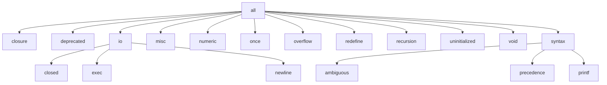

# Error Handling and Debugging

## Writing Resilient Code and Finding Bugs

**Version:** 1.0\
**Year:** 2025

---

## Copyright Notice

Copyright (c) 2025-2026 Ryan Thomas Robson / Robworks Software LLC. Licensed under [CC BY-NC-ND 4.0](../../LICENSE-CONTENT). You may share this material for non-commercial purposes with attribution, but you may not distribute modified versions.

---

Perl programs fail. Files go missing, networks drop, users provide garbage input, and code has bugs. The difference between a script that crashes cryptically and one that reports exactly what went wrong comes down to how you handle errors. This guide covers Perl's error handling mechanisms, the debugging toolkit, and the profiling tools that help you write resilient code.

---

## die, warn, and the Carp Family

### die and warn

[**`die`**](https://perldoc.perl.org/functions/die) terminates the program (unless caught by `eval`) and prints to `STDERR`. [**`warn`**](https://perldoc.perl.org/functions/warn) prints to `STDERR` but does not terminate:

```perl
die "Configuration file not found\n";   # Program stops
warn "Disk usage above 90%\n";          # Program continues
```

If the string does not end with a newline, Perl appends the filename and line number automatically:

```perl
die "Configuration file not found";
# Output: Configuration file not found at script.pl line 12.
```

`die` can also throw a reference - an object, hash, or any scalar. This is the basis for structured exception handling:

```perl
die { code => 404, message => "Not found", path => $file };
```

### Carp: Better Error Reporting

The built-in [**`Carp`**](https://perldoc.perl.org/Carp) module provides versions of `warn` and `die` that report errors from the caller's perspective:

```perl
use Carp;

sub validate_age {
    my ($age) = @_;
    croak "Age must be a positive number" unless $age && $age > 0;
}

validate_age(-5);
# Output: Age must be a positive number at caller.pl line 10.
```

| Function | Behavior |
|----------|----------|
| `carp` | Warns from caller's perspective |
| `croak` | Dies from caller's perspective |
| `cluck` | Warns with full stack trace |
| `confess` | Dies with full stack trace |

Use `carp`/`croak` in modules - the error should point to the caller's code, not your internal validation. Use `confess`/`cluck` when you need the complete call stack.

```terminal
title: die, warn, and Carp Behavior
steps:
  - command: "perl -e 'warn \"low disk space\"; print \"still running\\n\";'"
    output: "low disk space at -e line 1.\nstill running"
    narration: "warn prints to STDERR but does not terminate the program. Execution continues on the next line."
  - command: "perl -e 'die \"fatal error\"; print \"never reached\\n\";'"
    output: "fatal error at -e line 1."
    narration: "die terminates the program immediately. The print statement after die never executes."
  - command: "perl -e 'eval { die \"caught!\\n\" }; print \"error was: $@\";'"
    output: "error was: caught!"
    narration: "eval traps the die. The error message is stored in the special variable $@. The program continues after the eval block."
  - command: "perl -e 'use Carp; sub inner { croak \"bad input\" } sub outer { inner() } outer();'"
    output: "bad input at -e line 1."
    narration: "croak reports the error at the caller's location, not where croak was actually called. This is why Carp is essential for module authors."
```

---

## eval Blocks and $@

The [**`eval`**](https://perldoc.perl.org/functions/eval) block is Perl's built-in mechanism for catching exceptions. When code inside `eval` calls `die`, the error is caught and stored in [**`$@`**](https://perldoc.perl.org/perlvar#$@):

```perl
eval {
    open my $fh, '<', $file or die "Cannot open $file: $!";
    process(<$fh>);
    close $fh;
};
if ($@) {
    warn "Processing failed: $@";
}
```

!!! warning "eval BLOCK vs. eval STRING"
    The **block form** (`eval { ... }`) compiles at compile time and is safe. The **string form** (`eval "..."`) compiles arbitrary code at runtime - it is a security risk. Never use `eval STRING` unless you have an extremely specific reason.

### The $@ Problem

`$@` has a well-known flaw: it can be clobbered between the `eval` block and your error check. Destructors (DESTROY methods) that run when objects go out of scope can reset `$@` if they use `eval` internally:

```perl
eval {
    my $obj = SomeClass->new();  # $obj has a DESTROY method
    die "Something failed";
};
# $obj's DESTROY runs here - may reset $@ to ""
if ($@) {
    # This might not execute even though die was called!
}
```

```mermaid
flowchart TD
    A[Code calls die] --> B{Inside eval block?}
    B -->|No| C[Program terminates\nError printed to STDERR]
    B -->|Yes| D[eval block exits]
    D --> E[Error stored in $@]
    E --> F{Destructors run\nbefore if check}
    F -->|DESTROY uses eval| G[$@ may be clobbered\nError lost]
    F -->|No interference| H[if $@ catches error]
    H --> I[Error handled]
    G --> J[Error silently ignored]
    J --> K[Use Try::Tiny\nto avoid this]
```

```quiz
question: "What is the main problem with the common pattern: eval { ... }; if ($@) { handle_error($@) }?"
type: multiple-choice
options:
  - text: "eval blocks are slow and should not be used for error handling"
    feedback: "eval blocks have minimal overhead. The performance concern is not the issue - the problem is about $@ reliability."
  - text: "$@ can be reset to empty by destructors or other eval calls that run between the eval block and the if check"
    correct: true
    feedback: "Correct. When objects go out of scope at the end of the eval block, their DESTROY methods run. If a DESTROY method uses eval internally (even successfully), it resets $@ to the empty string, causing your error check to miss the original error."
  - text: "eval cannot catch die calls - it only catches syntax errors"
    feedback: "eval catches both die calls and compilation errors. It is Perl's primary mechanism for trapping exceptions."
  - text: "$@ only contains the first line of the error message"
    feedback: "$@ contains the complete error message. The problem is that $@ can be clobbered, not truncated."
```

---

## Try::Tiny

[**`Try::Tiny`**](https://metacpan.org/pod/Try::Tiny) is the standard CPAN solution for safe exception handling. It avoids the `$@` clobbering problem:

```perl
use Try::Tiny;

try {
    open my $fh, '<', $file or die "Cannot open $file: $!";
    process($fh);
    close $fh;
}
catch {
    warn "Failed to process $file: $_";    # Error is in $_, not $@
}
finally {
    cleanup_resources();
};    # <-- Semicolon required! try/catch is a function call
```

`Try::Tiny` works by checking whether `eval` returned true (via a trailing `1`) rather than checking `$@` directly. This reliably detects errors even when `$@` is clobbered.

!!! danger "The Trailing Semicolon"
    `try`/`catch`/`finally` are function calls, not language keywords. You must end the chain with a semicolon. Forgetting it produces confusing error messages.

| Situation | Use |
|-----------|-----|
| Simple scripts with no objects | `eval` block is fine |
| Code with DESTROY methods | `Try::Tiny` |
| Libraries and modules | `Try::Tiny` |
| Performance-critical inner loops | `eval` block (slight overhead per call) |

```code-walkthrough
language: perl
title: Error Handling Pipeline with Try::Tiny
code: |
  use strict;
  use warnings;
  use Try::Tiny;
  use JSON::PP;

  sub load_config {
      my ($path) = @_;

      my $content;
      try {
          open my $fh, '<', $path
              or die "Cannot open $path: $!";
          local $/;
          $content = <$fh>;
          close $fh;
      }
      catch {
          die "Config read failed: $_";
      };

      my $config;
      try {
          $config = decode_json($content);
      }
      catch {
          die "Config parse failed: $_";
      };

      validate_config($config);
      return $config;
  }

  sub validate_config {
      my ($config) = @_;
      die "Missing 'host' field"
          unless exists $config->{host};
      die "Port must be 1-65535"
          unless $config->{port}
              && $config->{port} =~ /^\d+$/
              && $config->{port} <= 65535;
  }

  try {
      my $cfg = load_config('app.json');
      print "Loaded: $cfg->{host}:$cfg->{port}\n";
  }
  catch {
      warn "Startup failed: $_";
      exit 1;
  };
annotations:
  - line: 10
    text: "First try block handles file I/O errors. If the file does not exist, the die inside the or clause triggers the catch block."
  - line: 14
    text: "local $/ undefines the input record separator, causing the diamond operator to slurp the entire file into $content as a single string."
  - line: 17
    text: "The catch block re-throws with additional context. Wrapping errors ('Config read failed:') builds an error chain that traces the problem to its source."
  - line: 22
    text: "Second try block handles JSON parsing errors. decode_json dies on malformed JSON, and catch adds context about which stage failed."
  - line: 33
    text: "validate_config uses die with descriptive messages for each rule violation. Callers can wrap this in try/catch to handle the errors."
  - line: 42
    text: "The top-level try/catch catches anything that propagated up. The error chain might read: 'Startup failed: Config read failed: Cannot open app.json: No such file or directory'."
```

---

## Exception Objects

Since `die` accepts any scalar, you can throw objects that carry error codes and context:

```perl
package App::Error;
use overload '""' => sub {
    sprintf "%s (code %d) at %s line %d",
        $_[0]->{message}, $_[0]->{code}, $_[0]->{file}, $_[0]->{line};
};

sub new {
    my ($class, %args) = @_;
    bless {
        message => $args{message} // 'Unknown error',
        code    => $args{code}    // 500,
        file    => (caller(0))[1],
        line    => (caller(0))[2],
    }, $class;
}
sub message { $_[0]->{message} }
sub code    { $_[0]->{code} }
```

For larger systems, define a hierarchy and dispatch on type:

```perl
package App::Error::IO;
use parent -norequire, 'App::Error';

package App::Error::Auth;
use parent -norequire, 'App::Error';

# In a catch block:
catch {
    if (ref $_ && $_->isa('App::Error::Auth')) {
        redirect_to_login();
    } elsif (ref $_ && $_->isa('App::Error::IO')) {
        retry_with_fallback();
    } else {
        log_and_show_generic_error($_);
    }
};
```

!!! tip "Exception Modules on CPAN"
    For production applications, consider [**`Throwable`**](https://metacpan.org/pod/Throwable) (a Moo role) or [**`Exception::Class`**](https://metacpan.org/pod/Exception::Class) (a hierarchy builder). Both handle stack traces and stringification without boilerplate.

---

## use strict and use warnings Deep Dive

### use strict

[**`use strict`**](https://perldoc.perl.org/strict) enables three restrictions:

| Restriction | What It Catches |
|-------------|----------------|
| `strict 'vars'` | Undeclared variables (typos like `$naem` instead of `$name`) |
| `strict 'refs'` | Symbolic references (`$$varname` where `$varname` is a string) |
| `strict 'subs'` | Bareword strings used as values without quotes |

### Warning Categories

[**`use warnings`**](https://perldoc.perl.org/warnings) enables runtime warnings organized into a category hierarchy:



You can enable or disable specific categories:

```perl
use warnings;                             # Enable all
use warnings qw(uninitialized numeric);   # Specific categories only
no warnings 'uninitialized';              # Suppress in current scope
```

| Category | Triggered By |
|----------|-------------|
| `uninitialized` | Using `undef` in an operation |
| `numeric` | Non-numeric string in numeric context |
| `once` | Variable used only once |
| `redefine` | Redefining a subroutine |
| `recursion` | Deep recursion (100+ levels) |
| `void` | Useless expression in void context |

### perl -w vs. use warnings

| Feature | `perl -w` | `use warnings` |
|---------|-----------|----------------|
| Scope | Global (entire program + all modules) | Lexical (current file/block only) |
| Granularity | All or nothing | Per-category control |

`perl -w` enables warnings everywhere, including inside modules that intentionally suppress them. `use warnings` affects only the current lexical scope. Always prefer `use warnings`.

!!! tip "Making Warnings Fatal"
    Promote warnings to errors with `use warnings FATAL => 'all'` or target specific categories with `use warnings FATAL => 'uninitialized'`. Useful in test suites but potentially disruptive in production.

---

## The Perl Debugger

Perl ships with an interactive debugger invoked with `perl -d script.pl`. This drops you into a session where you can step through code, set breakpoints, and evaluate expressions.

### Essential Debugger Commands

| Command | Action |
|---------|--------|
| `n` | Execute next line (step over) |
| `s` | Step into subroutine call |
| `c` / `c LINE` | Continue to next breakpoint or specific line |
| `r` | Return from current subroutine |
| `b LINE` / `b SUB` | Set breakpoint at line or subroutine |
| `B *` | Delete all breakpoints |
| `p EXPR` | Print expression value |
| `x EXPR` | Dump expression (like Data::Dumper) |
| `l` / `l SUB` | List source code |
| `T` | Print stack trace |
| `q` | Quit |

Conditional breakpoints trigger only when a condition is true: `b 42 $count > 100`. Watchpoints (`w $total`) break when a variable changes.

```terminal
title: Using the Perl Debugger
steps:
  - command: "echo -e 'use strict;\\nuse warnings;\\nmy @nums = (10, 20, 30);\\nmy $total = 0;\\nfor my $n (@nums) {\\n    $total += $n;\\n}\\nprint \"Total: $total\\n\";' > /tmp/debug_demo.pl && perl -d /tmp/debug_demo.pl <<< $'l\\nn\\nn\\nn\\np @nums\\nn\\nx $total\\nc\\nq'"
    output: "  1:  use strict;\n  2:  use warnings;\n  3:  my @nums = (10, 20, 30);\n  4:  my $total = 0;\n  5:  for my $n (@nums) {\n  6:      $total += $n;\n  7:  }\n  8:  print \"Total: $total\\n\";\nDB<1> (10, 20, 30)\nDB<2> 0  $total = 10\nDB<3> Total: 60"
    narration: "The l command lists source code. n steps forward one line. p prints a value. x provides a formatted dump. c continues to the end."
  - command: "perl -de 0 <<< $'p 2 ** 10\\np join(\", \", map { $_ * 2 } 1..5)\\nq'"
    output: "1024\n2, 4, 6, 8, 10"
    narration: "perl -de 0 launches the debugger with no script, making it a Perl REPL. You can evaluate any expression interactively."
  - command: "echo -e 'use strict;\\nuse warnings;\\nsub factorial {\\n    my ($n) = @_;\\n    return 1 if $n <= 1;\\n    return $n * factorial($n - 1);\\n}\\nprint factorial(5), \"\\n\";' > /tmp/fact.pl && perl -d /tmp/fact.pl <<< $'b factorial\\nc\\nT\\nc\\nq'"
    output: "  @ = main::factorial(5) called from file '/tmp/fact.pl' line 8\nDB<3> 120"
    narration: "b factorial sets a breakpoint on the subroutine entry. T prints the call stack trace showing how you reached the current point."
```

```command-builder
base: perl -d
description: Build a Perl debugger command to debug a script with specific options
options:
  - flag: ""
    type: select
    label: "Debug mode"
    explanation: "Choose how to start the debugger"
    choices:
      - ["script.pl", "Debug a script file"]
      - ["-e 0", "Launch interactive REPL (no script)"]
      - ["-e 'use Module; Module::function()'", "Debug a specific module function"]
  - flag: ""
    type: select
    label: "Common first command"
    explanation: "Suggested first command to type at the DB prompt"
    choices:
      - ["l    # list source code", "List source around current line"]
      - ["b main::function_name    # set breakpoint", "Break at a function"]
      - ["c    # run to first breakpoint or end", "Continue execution"]
      - ["n    # step over (next line)", "Step to next line"]
      - ["s    # step into subroutine", "Step into function calls"]
```

---

## Profiling and Coverage

### Devel::NYTProf

[**`Devel::NYTProf`**](https://metacpan.org/pod/Devel::NYTProf) is the gold standard Perl profiler. It records per-line timings, subroutine call counts, and generates HTML reports:

```bash
perl -d:NYTProf script.pl    # Profile
nytprofhtml --open            # Generate HTML report
```

For large applications, control profiling programmatically with `DB::disable_profile()` and `DB::enable_profile()`.

!!! tip "Profile Before Optimizing"
    Intuition about performance is unreliable. Always profile first - the bottleneck is rarely where you expect it.

### Devel::Cover

[**`Devel::Cover`**](https://metacpan.org/pod/Devel::Cover) measures which parts of your code are exercised by tests:

```bash
cover -test            # Run tests with coverage
cover cover_db         # Generate report
```

It reports statement, branch, condition, and subroutine coverage. Target 80-90% for most projects.

---

## Data::Dumper for Inspection

[**`Data::Dumper`**](https://perldoc.perl.org/Data::Dumper) prints any data structure in a readable format:

```perl
use Data::Dumper;
local $Data::Dumper::Sortkeys = 1;
warn Dumper(\%config);    # Quick debug: warn goes to STDERR immediately
```

For colored, human-friendly output, [**`Data::Printer`**](https://metacpan.org/pod/Data::Printer) is an alternative:

```perl
use DDP;
p %config;    # Colored output to STDERR
```

---

## Logging Strategies

### Log::Any

[**`Log::Any`**](https://metacpan.org/pod/Log::Any) separates the logging interface from the output destination. Modules log through `Log::Any`; the main script decides where messages go:

```perl
# In your module
use Log::Any '$log';
$log->info("Connecting to $dsn");
$log->error("Connection failed: $@");

# In your main script
use Log::Any::Adapter ('File', '/var/log/myapp.log');
```

### Log::Log4perl

[**`Log::Log4perl`**](https://metacpan.org/pod/Log::Log4perl) provides hierarchical loggers, multiple appenders, and pattern layouts (modeled after Java's Log4j):

```perl
use Log::Log4perl;
Log::Log4perl->init(\q{
    log4perl.rootLogger = DEBUG, Screen
    log4perl.appender.Screen = Log::Log4perl::Appender::Screen
    log4perl.appender.Screen.layout = PatternLayout
    log4perl.appender.Screen.layout.ConversionPattern = %d [%p] %F{1}:%L %m%n
});
my $log = Log::Log4perl->get_logger();
$log->info("Application started");
```

| Need | Solution |
|------|----------|
| Script debugging | `warn` with `Data::Dumper` |
| Reusable module | `Log::Any` (no adapter dependency) |
| Complex log routing | `Log::Log4perl` |

---

## Practical Patterns

### The or die Idiom

```perl
open my $fh, '<', $file   or die "Cannot open $file: $!\n";
chdir $dir                 or die "Cannot chdir to $dir: $!\n";
```

Always include `$!` - it contains the OS error message.

### Layered Error Context

Each layer adds context so the final message traces back to the root cause:

```perl
sub read_user_data {
    my ($user_id) = @_;
    my $path = "/data/users/$user_id.json";
    try {
        open my $fh, '<', $path or die "Cannot open: $!";
        local $/;
        my $content = <$fh>;
        close $fh;
        return decode_json($content);
    }
    catch {
        die "Failed to read user $user_id: $_";
    };
}
# Error: "Failed to read user 42: Cannot open: No such file or directory"
```

### Retry with Backoff

```perl
sub retry {
    my (%args) = @_;
    my $tries = $args{tries} // 3;
    my $delay = $args{delay} // 1;
    for my $attempt (1 .. $tries) {
        my $result;
        try { $result = $args{code}->() }
        catch {
            die "Failed after $tries attempts: $_" if $attempt == $tries;
            warn "Attempt $attempt failed, retrying in ${delay}s\n";
            sleep $delay;
            $delay *= 2;
        };
        return $result if defined $result;
    }
}
```

```exercise
title: Add Error Handling to a File Processor
difficulty: beginner
scenario: |
  The following script reads a CSV file and prints a summary, but has no error handling:

  ```perl
  my $file = $ARGV[0];
  open my $fh, '<', $file;
  my $header = <$fh>;
  chomp $header;
  my @columns = split /,/, $header;
  my $count = 0;
  while (my $line = <$fh>) {
      chomp $line;
      $count++;
  }
  close $fh;
  print "Columns: @columns\nData rows: $count\n";
  ```

  Make it robust:
  1. Check that a filename was provided on the command line
  2. Verify the file exists and is readable
  3. Use `or die` with `$!` on the `open` call
  4. Handle the case where the file is empty (no header)
  5. Wrap the operation in a Try::Tiny block
hints:
  - "Check for arguments: die \"Usage: $0 <csvfile>\\n\" unless @ARGV;"
  - "Test the file: die \"Not found: $file\\n\" unless -e $file;"
  - "Check for empty: die \"Empty file\\n\" unless defined $header;"
  - "Wrap with: try { ... } catch { warn \"Error: $_\"; exit 1; };"
solution: |
  ```perl
  use strict;
  use warnings;
  use Try::Tiny;

  die "Usage: $0 <csvfile>\n" unless @ARGV;
  my $file = $ARGV[0];

  try {
      die "File not found: $file\n" unless -e $file;
      die "Not readable: $file\n"   unless -r $file;

      open my $fh, '<', $file or die "Cannot open $file: $!\n";
      my $header = <$fh>;
      die "File is empty\n" unless defined $header;
      chomp $header;
      my @columns = split /,/, $header;

      my $count = 0;
      while (<$fh>) { $count++ }
      close $fh;

      print "Columns: @columns\nData rows: $count\n";
  }
  catch {
      warn "Error: $_";
      exit 1;
  };
  ```

  The solution validates arguments, checks file access, handles empty
  files, and wraps everything in try/catch for clean error reporting.
```

```exercise
title: Build a Custom Exception Class Hierarchy
difficulty: intermediate
scenario: |
  Create an exception hierarchy for a web application:

  - `WebApp::Error` (base) - `message`, `code`, `timestamp` attributes; stringifies to `[TIMESTAMP] Error CODE: MESSAGE`
  - `WebApp::Error::NotFound` - default code 404, additional `resource` attribute
  - `WebApp::Error::Validation` - default code 422, additional `field` and `errors` (array ref) attributes

  Test by throwing each type and catching with `isa` checks.
hints:
  - "Use overload '\"\"' for stringification"
  - "Store timestamp with localtime or POSIX::strftime"
  - "Check type: if (ref $_ && $_->isa('WebApp::Error::NotFound'))"
  - "Use 'use parent -norequire' for in-file inheritance"
solution: |
  ```perl
  use strict;
  use warnings;
  use Try::Tiny;

  package WebApp::Error;
  use overload '""' => sub {
      my $s = $_[0];
      "[$s->{timestamp}] Error $s->{code}: $s->{message}";
  };
  sub new {
      my ($class, %a) = @_;
      bless { message => $a{message} // 'Error', code => $a{code} // 500,
              timestamp => scalar localtime }, $class;
  }
  sub message { $_[0]->{message} }
  sub code    { $_[0]->{code} }

  package WebApp::Error::NotFound;
  use parent -norequire, 'WebApp::Error';
  sub new {
      my ($class, %a) = @_;
      $a{code} //= 404;
      my $self = $class->SUPER::new(%a);
      $self->{resource} = $a{resource} // 'unknown';
      return $self;
  }
  sub resource { $_[0]->{resource} }

  package WebApp::Error::Validation;
  use parent -norequire, 'WebApp::Error';
  sub new {
      my ($class, %a) = @_;
      $a{code} //= 422;
      my $self = $class->SUPER::new(%a);
      $self->{field}  = $a{field}  // '';
      $self->{errors} = $a{errors} // [];
      return $self;
  }
  sub field  { $_[0]->{field} }
  sub errors { $_[0]->{errors} }

  package main;
  try {
      die WebApp::Error::NotFound->new(
          message => 'Page not found', resource => '/users/99');
  }
  catch {
      if (ref $_ && $_->isa('WebApp::Error')) {
          print "Caught: $_\n";
      }
  };
  ```

  The hierarchy uses SUPER::new for constructor reuse and overload
  for stringification. isa checks let you catch by base type or
  specific subclass.
```

---

## Further Reading

- [perldiag](https://perldoc.perl.org/perldiag) - complete list of Perl diagnostic messages
- [perldebtut](https://perldoc.perl.org/perldebtut) - Perl debugging tutorial
- [perldebug](https://perldoc.perl.org/perldebug) - full debugger reference
- [Try::Tiny documentation](https://metacpan.org/pod/Try::Tiny) - safe exception handling
- [Devel::NYTProf documentation](https://metacpan.org/pod/Devel::NYTProf) - profiling guide
- [Log::Any documentation](https://metacpan.org/pod/Log::Any) - logging API
- [Perl Best Practices, Chapter 13](https://www.oreilly.com/library/view/perl-best-practices/0596001738/) - error handling recommendations

---

**Previous:** [Object-Oriented Perl](object-oriented-perl.md) | **Next:** [Testing](testing.md) | [Back to Index](README.md)
