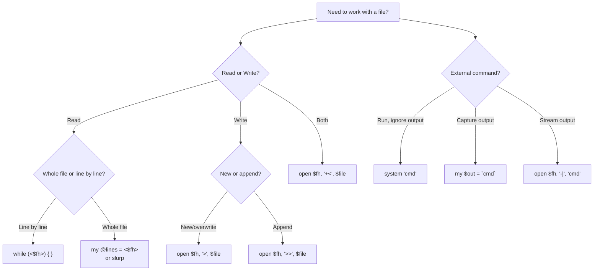

# File I/O and System Interaction

## Reading, Writing, and Talking to the OS

**Version:** 1.1
**Year:** 2026

---

## Copyright Notice

Copyright (c) 2025-2026 Ryan Thomas Robson / Robworks Software LLC. Licensed under [CC BY-NC-ND 4.0](../../LICENSE-CONTENT). You may share this material for non-commercial purposes with attribution, but you may not distribute modified versions.

---

Perl was built for text processing on Unix systems. Its file I/O is not an afterthought bolted onto a language - it is woven into the core. Reading files, writing output, testing file attributes, running external commands, and managing processes all use simple, consistent syntax that maps directly to the underlying operating system calls.

This guide covers everything from opening your first file to forking child processes. By the end, you will be able to read and write files safely, navigate directories, run system commands, and build the kind of file-processing scripts that Perl is famous for.

---

## Opening Files

The [**`open`**](https://perldoc.perl.org/perlfunc#open-FILEHANDLE,MODE,EXPR) function connects a filehandle to a file. Modern Perl uses the **three-argument form**:

```perl
open my $fh, '<', 'data.txt' or die "Cannot open data.txt: $!";
```

Three things happen here:

1. `my $fh` declares a **lexical filehandle** - a variable that holds the connection to the file.
2. `'<'` is the **mode** - read-only in this case.
3. `'data.txt'` is the filename, completely separate from the mode.

The `or die` idiom terminates the program with an error message if `open` fails. [**`$!`**](https://perldoc.perl.org/perlvar#%24!) contains the operating system's error message (like "No such file or directory" or "Permission denied").

### File Modes

| Mode | Meaning | Creates file? | Truncates? |
|------|---------|--------------|------------|
| `<` | Read only | No | No |
| `>` | Write (create/truncate) | Yes | Yes |
| `>>` | Append | Yes | No |
| `+<` | Read and write | No | No |
| `+>` | Read and write (truncate) | Yes | Yes |
| `+>>` | Read and append | Yes | No |

The most common modes by far are `<` (read), `>` (write), and `>>` (append). Read/write modes (`+<`, `+>`, `+>>`) are rare in practice - most programs read from one file and write to another.

### Why Three-Argument open?

Perl also supports a two-argument form:

```perl
# Two-argument open - DO NOT USE
open(FH, $filename);
```

This is dangerous because the mode is parsed from the filename string itself. If `$filename` comes from user input and contains `"> /etc/passwd"`, Perl will happily open that file for writing. The three-argument form keeps mode and filename separate, preventing injection attacks:

```perl
# Safe: mode and filename are separate arguments
open my $fh, '<', $filename or die "Cannot open $filename: $!";
```

### Lexical vs. Bareword Filehandles

Older Perl code uses bareword (uppercase) filehandles:

```perl
# Old style - bareword filehandle (global)
open(INFILE, '<', 'data.txt') or die "Cannot open: $!";
print INFILE "data";  # Oops: INFILE is open for reading, not writing
close INFILE;
```

Bareword filehandles are global, meaning they can collide across subroutines and modules. **Lexical filehandles** (stored in `my` variables) are scoped to the block where they are declared and automatically close when they go out of scope:

```perl
# Modern style - lexical filehandle (scoped)
{
    open my $fh, '<', 'data.txt' or die "Cannot open: $!";
    # ... use $fh ...
}   # $fh goes out of scope, file is automatically closed
```

Always use lexical filehandles. The only bareword filehandles you should use are the built-in ones: `STDIN`, `STDOUT`, and `STDERR`.

### Closing Files

Call [**`close`**](https://perldoc.perl.org/perlfunc#close-FILEHANDLE) when you are done:

```perl
close $fh or warn "Error closing file: $!";
```

Checking the return value of `close` matters for write handles - it is the point where buffered output is flushed to disk. A full disk will cause `close` to fail even if all `print` calls succeeded. Lexical filehandles auto-close when they go out of scope, but explicit `close` makes intent clear and catches errors.

```quiz
question: "Why is the three-argument form of open safer than the two-argument form?"
type: multiple-choice
options:
  - text: "It runs faster because Perl can optimize the separate arguments"
    feedback: "Performance is not the issue. The three-argument form prevents a security vulnerability."
  - text: "The mode is separated from the filename, so user input in the filename cannot change the open mode"
    correct: true
    feedback: "Correct. With two-argument open, a filename like '> /etc/passwd' would be opened for writing. The three-argument form treats the filename as a literal string, not as a mode+filename combination."
  - text: "It supports more file modes than the two-argument form"
    feedback: "Both forms support the same modes. The difference is about safety, not capability."
  - text: "Lexical filehandles only work with three-argument open"
    feedback: "Lexical filehandles work with both forms, but three-argument open is safer regardless of filehandle type."
```

---

## Reading Files

### Line by Line

The most common pattern reads a file one line at a time using the [**diamond operator**](https://perldoc.perl.org/perlop#I/O-Operators) `<$fh>` inside a `while` loop:

```perl
open my $fh, '<', 'server.log' or die "Cannot open: $!";

while (my $line = <$fh>) {
    chomp $line;          # Remove trailing newline
    print ">> $line\n";
}

close $fh;
```

[**`chomp`**](https://perldoc.perl.org/perlfunc#chomp-VARIABLE) removes the trailing newline from a string. Without it, every line ends with `\n`, which causes double-spacing when you `print` with your own newline.

!!! tip "Why `while` and not `for`?"
    `while (<$fh>)` reads one line at a time, keeping memory usage constant regardless of file size. `for my $line (<$fh>)` reads the entire file into memory first, then iterates. For a 10 GB log file, `while` uses a few kilobytes; `for` needs 10 GB of RAM.

### The Default Variable: $_

When you omit the variable in the `while` loop, Perl reads into `$_`:

```perl
while (<$fh>) {
    chomp;               # chomp operates on $_ by default
    print if /ERROR/;    # print and regex match also use $_
}
```

This is idiomatic Perl. The `$_` variable is the default for dozens of built-in functions - `chomp`, `print`, `split`, `lc`, `uc`, and most regex operations.

### Reading into an Array

To load all lines at once:

```perl
open my $fh, '<', 'names.txt' or die "Cannot open: $!";
my @lines = <$fh>;
close $fh;

chomp @lines;   # chomp works on arrays too - removes newline from each element
print "Read ", scalar @lines, " lines\n";
```

Each element in `@lines` includes the trailing newline until you `chomp` the array.

### Slurping an Entire File

Sometimes you need the whole file as a single string - for regex matching across lines, for instance:

```perl
# Method 1: local $/
my $content;
{
    open my $fh, '<', 'config.txt' or die "Cannot open: $!";
    local $/;              # Undefine the input record separator
    $content = <$fh>;      # Read everything as one string
    close $fh;
}

# Method 2: File::Slurper (recommended for production)
use File::Slurper 'read_text';
my $content = read_text('config.txt');
```

[**`$/`**](https://perldoc.perl.org/perlvar#%24/) is the **input record separator** - by default, it is `"\n"`, which is why `<$fh>` reads one line at a time. Setting it to `undef` makes `<$fh>` read the entire remaining file. The `local` keyword ensures `$/` reverts to its original value when the block exits.

### The Diamond Operator: <>

The bare diamond operator `<>` (with no filehandle) reads from files named on the command line, or from `STDIN` if no files are given:

```perl
# script.pl - processes any files passed as arguments
while (<>) {
    chomp;
    print "Line $.: $_\n";
}
```

```bash
# Reads from file1.txt and file2.txt:
perl script.pl file1.txt file2.txt

# Reads from standard input:
echo "hello" | perl script.pl
```

[**`$.`**](https://perldoc.perl.org/perlvar#%24.) holds the current line number. It resets to 1 at the start of each file when using `<>`.

The diamond operator looks at [**`@ARGV`**](https://perldoc.perl.org/perlvar#%40ARGV), which contains the command-line arguments. It `open`s each filename in `@ARGV` in sequence. If `@ARGV` is empty, it reads from `STDIN`. This is exactly how Unix utilities like `cat`, `grep`, and `sed` work - and Perl borrowed the pattern directly.

!!! tip "See also"
    Perl's filehandle model mirrors Unix standard streams. For the underlying OS concepts of STDIN, STDOUT, STDERR, and redirection, see [Streams and Redirection](../../Linux Essentials/streams-and-redirection.md).

```terminal
title: Reading Files in Perl
steps:
  - command: "echo -e 'apple\\nbanana\\ncherry' > /tmp/fruits.txt && perl -e 'open my $fh, \"<\", \"/tmp/fruits.txt\" or die $!; while (<$fh>) { chomp; print \"Line $.: $_\\n\"; } close $fh;'"
    output: "Line 1: apple\nLine 2: banana\nLine 3: cherry"
    narration: "Open a file for reading with '<', then loop with while (<$fh>). chomp removes the trailing newline. $. gives the current line number."
  - command: "perl -e 'open my $fh, \"<\", \"/tmp/fruits.txt\" or die $!; my @lines = <$fh>; close $fh; chomp @lines; print \"Got \", scalar @lines, \" lines: @lines\\n\";'"
    output: "Got 3 lines: apple banana cherry"
    narration: "Reading <$fh> in list context loads all lines into an array at once. chomp on an array removes newlines from every element."
  - command: "perl -e 'open my $fh, \"<\", \"/tmp/fruits.txt\" or die $!; local $/; my $all = <$fh>; close $fh; print \"Length: \", length($all), \" chars\\n\";'"
    output: "Length: 20 chars"
    narration: "Setting $/ to undef (with local $/) makes the diamond operator slurp the entire file as one string. Useful for multi-line regex matching."
  - command: "echo -e 'one\\ntwo\\nthree' | perl -ne 'chomp; print \">> $_\\n\";'"
    output: ">> one\n>> two\n>> three"
    narration: "The -n flag wraps your code in while (<>) { }, reading from STDIN or files on the command line. The diamond operator is the backbone of Perl one-liners."
```

---

## Writing Files

### print and say

Write to a filehandle with [**`print`**](https://perldoc.perl.org/perlfunc#print-FILEHANDLE-LIST):

```perl
open my $fh, '>', 'output.txt' or die "Cannot open for writing: $!";

print $fh "First line\n";
print $fh "Second line\n";

close $fh or die "Error closing: $!";
```

!!! warning "No Comma After the Filehandle"
    `print $fh "text"` has **no comma** between `$fh` and `"text"`. Writing `print $fh, "text"` is a common mistake - Perl interprets it as printing both `$fh` and `"text"` to `STDOUT`.

The [**`say`**](https://perldoc.perl.org/perlfunc#say-FILEHANDLE-LIST) function (requires `use feature 'say'` or `use v5.10`) is identical to `print` but adds a newline automatically:

```perl
use feature 'say';

open my $fh, '>', 'output.txt' or die "Cannot open: $!";
say $fh "First line";      # Equivalent to: print $fh "First line\n";
say $fh "Second line";
close $fh;
```

### Formatted Output with printf

[**`printf`**](https://perldoc.perl.org/perlfunc#printf-FILEHANDLE-FORMAT,-LIST) works like C's `printf` - format string with placeholders:

```perl
printf $fh "%-20s %8.2f\n", $name, $price;
```

Common format specifiers:

| Specifier | Meaning | Example |
|-----------|---------|---------|
| `%s` | String | `"hello"` |
| `%d` | Integer | `42` |
| `%f` | Float | `3.14` |
| `%e` | Scientific | `3.14e+00` |
| `%x` | Hexadecimal | `2a` |
| `%%` | Literal `%` | `%` |

Width and precision: `%10s` (right-align in 10 chars), `%-10s` (left-align), `%.2f` (2 decimal places), `%08d` (zero-pad to 8 digits).

[**`sprintf`**](https://perldoc.perl.org/perlfunc#sprintf-FORMAT,-LIST) returns the formatted string instead of printing it:

```perl
my $line = sprintf "%-20s %8.2f", $item, $cost;
```

### Binary Mode

By default, Perl may translate line endings on some platforms. For binary files (images, compressed data, executables), use [**`binmode`**](https://perldoc.perl.org/perlfunc#binmode-FILEHANDLE):

```perl
open my $fh, '<', 'image.png' or die "Cannot open: $!";
binmode $fh;

# Read raw bytes
my $bytes_read = read $fh, my $buffer, 1024;
close $fh;
```

For UTF-8 text files, use the encoding layer:

```perl
open my $fh, '<:encoding(UTF-8)', 'unicode.txt' or die $!;
# or:
open my $fh, '<', 'unicode.txt' or die $!;
binmode $fh, ':encoding(UTF-8)';
```

```exercise
title: File Word Counter
difficulty: beginner
scenario: |
  Write a Perl script that works like the Unix `wc` command. Given a filename,
  it should count and print:

  1. Number of lines
  2. Number of words
  3. Number of characters (bytes)

  Format the output like wc does: right-justified columns.

  Example output for a file:
  ```
      12     45    312  data.txt
  ```

  If no filename is given, read from STDIN.
hints:
  - "Open with: open my $fh, '<', $file or die \"Cannot open $file: $!\""
  - "Count words by splitting each line: my @words = split /\\s+/, $line"
  - "Track characters with: $chars += length($line) (before chomping)"
  - "Use printf for formatted output: printf \"%8d %6d %6d  %s\\n\", $lines, $words, $chars, $file"
solution: |
  ```perl
  use strict;
  use warnings;

  my $file = shift @ARGV;
  my $fh;

  if (defined $file) {
      open $fh, '<', $file or die "Cannot open $file: $!";
  } else {
      $fh = \*STDIN;
      $file = '-';
  }

  my ($lines, $words, $chars) = (0, 0, 0);

  while (my $line = <$fh>) {
      $chars += length $line;
      $lines++;
      my @w = split /\s+/, $line;
      # split on whitespace can produce empty first element
      @w = grep { length $_ } @w;
      $words += scalar @w;
  }

  close $fh if defined $file && $file ne '-';

  printf "%8d %6d %6d  %s\n", $lines, $words, $chars, $file;
  ```

  The script opens the file (or STDIN if no argument), then loops
  line by line. It tracks characters before chomping (since newlines
  count as characters in wc), splits on whitespace for word count,
  and increments the line counter. printf formats the output with
  right-justified columns.
```

---

## File Tests

Perl provides a full set of [**file test operators**](https://perldoc.perl.org/perlfunc#-X-FILEHANDLE) - single-character flags prefixed with a hyphen that check properties of files and directories.

### Common File Tests

```perl
my $file = '/etc/passwd';

if (-e $file) { print "Exists\n" }
if (-f $file) { print "Is a regular file\n" }
if (-d $file) { print "Is a directory\n" }
if (-r $file) { print "Is readable\n" }
if (-w $file) { print "Is writable\n" }
if (-x $file) { print "Is executable\n" }
```

| Operator | Tests for |
|----------|-----------|
| `-e` | File exists |
| `-f` | Regular file (not directory or device) |
| `-d` | Directory |
| `-l` | Symbolic link |
| `-r` | Readable by effective uid |
| `-w` | Writable by effective uid |
| `-x` | Executable by effective uid |
| `-s` | File size in bytes (returns size, false if zero) |
| `-z` | File has zero size |
| `-T` | File looks like a text file |
| `-B` | File looks like a binary file |

### Timestamps

Three operators return file age in days (fractional) since the script started:

| Operator | Measures |
|----------|----------|
| `-M` | Time since last modification |
| `-A` | Time since last access |
| `-C` | Time since inode change |

```perl
my $age = -M '/var/log/syslog';
printf "Log file last modified %.1f days ago\n", $age;

# Find files modified in the last 24 hours
if (-M $file < 1) {
    print "$file was modified today\n";
}
```

### The _ Cache Filehandle

Each file test performs a `stat` system call. When you chain multiple tests on the same file, use the special `_` filehandle to reuse the cached stat data:

```perl
if (-f $file && -r _ && -s _) {
    print "$file is a readable file with non-zero size\n";
}
```

The `_` uses the result from the most recent file test or `stat` call, avoiding redundant system calls. Without `_`, the three tests above would `stat` the file three times.

### Stacking Tests (Perl 5.10+)

Perl 5.10 and later allow stacking file tests:

```perl
# These are equivalent:
if (-f $file && -r $file && -w $file) { ... }
if (-f -r -w $file) { ... }   # Stacked - reads right to left
```

Stacked tests read **right to left**: `-f -r -w $file` tests writable first, then readable, then regular file. They also use the `_` cache automatically.

```terminal
title: File Test Operators
steps:
  - command: "perl -e 'my $f = \"/etc/passwd\"; print \"exists\\n\" if -e $f; print \"file\\n\" if -f $f; print \"readable\\n\" if -r $f;'"
    output: "exists\nfile\nreadable"
    narration: "File test operators return true or false. -e checks existence, -f checks if it is a regular file, -r checks readability."
  - command: "perl -e 'my $f = \"/etc/passwd\"; printf \"Size: %d bytes\\n\", -s $f;'"
    output: "Size: 6804 bytes"
    narration: "The -s operator returns the file size in bytes. It is false (0) for empty files, so it doubles as both a size check and an existence check for non-empty files."
  - command: "perl -e 'printf \"Age: %.2f days\\n\", -M \"/etc/passwd\";'"
    output: "Age: 3.42 days"
    narration: "The -M operator returns the file age in fractional days since the script started. Useful for finding recently modified files."
  - command: "perl -e 'my $f = \"/etc/passwd\"; if (-f $f && -r _ && -s _) { print \"readable file with content\\n\" }'"
    output: "readable file with content"
    narration: "The _ (underscore) filehandle reuses the stat cache from the previous test. This avoids three separate stat system calls - important when testing many files."
```

---

## stat and File Information

The [**`stat`**](https://perldoc.perl.org/perlfunc#stat-FILEHANDLE) function returns a 13-element list with detailed information about a file:

```perl
my @info = stat('data.txt');
```

| Index | Field | Description |
|-------|-------|-------------|
| 0 | `dev` | Device number |
| 1 | `ino` | Inode number |
| 2 | `mode` | File mode (permissions and type) |
| 3 | `nlink` | Number of hard links |
| 4 | `uid` | User ID of owner |
| 5 | `gid` | Group ID of owner |
| 6 | `rdev` | Device identifier (special files) |
| 7 | `size` | File size in bytes |
| 8 | `atime` | Last access time (epoch seconds) |
| 9 | `mtime` | Last modification time (epoch seconds) |
| 10 | `ctime` | Inode change time (epoch seconds) |
| 11 | `blksize` | Preferred block size for I/O |
| 12 | `blocks` | Number of blocks allocated |

Remembering indices is painful. The [**`File::stat`**](https://perldoc.perl.org/File::stat) module provides named access:

```perl
use File::stat;

my $st = stat('data.txt') or die "Cannot stat: $!";
printf "Size: %d bytes\n", $st->size;
printf "Owner UID: %d\n", $st->uid;
printf "Modified: %s\n", scalar localtime($st->mtime);
printf "Permissions: %04o\n", $st->mode & 07777;
```

### lstat for Symbolic Links

[**`lstat`**](https://perldoc.perl.org/perlfunc#lstat-FILEHANDLE) is identical to `stat` but returns information about the symlink itself rather than the file it points to:

```perl
if (-l '/usr/local/bin/python') {
    my @link_info = lstat('/usr/local/bin/python');
    my @target_info = stat('/usr/local/bin/python');
    printf "Link size: %d, Target size: %d\n", $link_info[7], $target_info[7];
}
```

### Timestamps and Formatting

Convert epoch timestamps to readable dates with `localtime` or the `POSIX::strftime` function:

```perl
use POSIX 'strftime';

my $mtime = (stat 'data.txt')[9];
my $formatted = strftime "%Y-%m-%d %H:%M:%S", localtime($mtime);
print "Last modified: $formatted\n";
```

---

## Directory Operations

### opendir/readdir/closedir

The [**`opendir`**](https://perldoc.perl.org/perlfunc#opendir-DIRHANDLE,EXPR)/[**`readdir`**](https://perldoc.perl.org/perlfunc#readdir-DIRHANDLE)/[**`closedir`**](https://perldoc.perl.org/perlfunc#closedir-DIRHANDLE) trio works like `open`/`<$fh>`/`close` but for directories:

```perl
opendir my $dh, '/var/log' or die "Cannot open directory: $!";
my @entries = readdir $dh;
closedir $dh;

# readdir returns ALL entries, including . and ..
my @files = grep { $_ ne '.' && $_ ne '..' } @entries;

print "$_\n" for sort @files;
```

!!! warning "readdir Returns Names, Not Paths"
    `readdir` returns bare filenames, not full paths. To use the results with `open`, `stat`, or file tests, prepend the directory path:

    ```perl
    my $dir = '/var/log';
    opendir my $dh, $dir or die $!;
    while (my $entry = readdir $dh) {
        next if $entry =~ /^\./;           # Skip dotfiles
        my $path = "$dir/$entry";          # Build full path
        printf "%-30s %d bytes\n", $entry, -s $path if -f $path;
    }
    closedir $dh;
    ```

### Filtering Directory Contents

Combine `readdir` with `grep` and file tests:

```perl
opendir my $dh, $dir or die $!;

# Only regular files
my @files = grep { -f "$dir/$_" } readdir $dh;

# Rewind to read again
rewinddir $dh;

# Only directories (excluding . and ..)
my @subdirs = grep { -d "$dir/$_" && $_ !~ /^\./ } readdir $dh;

closedir $dh;
```

### glob and Filename Expansion

The [**`glob`**](https://perldoc.perl.org/perlfunc#glob-EXPR) function expands shell-style wildcards and returns full paths:

```perl
# Find all .txt files in current directory
my @txt_files = glob('*.txt');

# Find all .log files in /var/log
my @logs = glob('/var/log/*.log');

# Multiple patterns
my @code = glob('*.pl *.pm *.t');

# Angle bracket syntax (same as glob)
my @configs = <~/.config/*.conf>;
```

`glob` returns full paths (or relative to the current directory), unlike `readdir` which returns bare names. For simple wildcard matching, `glob` is more convenient than `opendir`/`readdir`.

### Recursive Traversal with File::Find

For walking directory trees, use [**`File::Find`**](https://perldoc.perl.org/File::Find):

```perl
use File::Find;

find(sub {
    return unless -f;           # Skip non-files
    return unless /\.pm$/;      # Only .pm files
    print "$File::Find::name\n";  # Full path
}, '/usr/lib/perl5');
```

`File::Find` calls your subroutine once for each file and directory found. Inside the callback:

- `$_` is the bare filename
- `$File::Find::name` is the full path
- `$File::Find::dir` is the current directory

### Creating and Removing Directories

```perl
mkdir 'output'        or die "Cannot create directory: $!";
mkdir 'output', 0755  or die "Cannot create directory: $!";   # with permissions

rmdir 'output'        or die "Cannot remove directory: $!";   # must be empty
```

[**`rmdir`**](https://perldoc.perl.org/perlfunc#rmdir-FILENAME) only removes empty directories. For recursive removal, use `File::Path`:

```perl
use File::Path qw(make_path remove_tree);

make_path('a/b/c/d');     # Like mkdir -p
remove_tree('a');          # Like rm -rf
```

### Changing Directory

[**`chdir`**](https://perldoc.perl.org/perlfunc#chdir-EXPR) changes the current working directory:

```perl
chdir '/tmp' or die "Cannot chdir: $!";
```

!!! tip "Avoid chdir in Libraries"
    `chdir` affects the entire process. In subroutines and modules, use full paths instead of changing directories. If you must `chdir`, save and restore the original directory:

    ```perl
    use Cwd;
    my $original = getcwd();
    chdir $target or die "Cannot chdir: $!";
    # ... do work ...
    chdir $original or die "Cannot return: $!";
    ```

### File I/O Decision Tree

When choosing how to interact with files and commands, this decision tree covers the most common paths:



```code-walkthrough
language: perl
title: Log File Rotation Script
code: |
  use strict;
  use warnings;
  use File::Copy 'move';

  sub rotate_logs {
      my ($base, $max) = @_;
      $max //= 5;

      # Remove the oldest log if it exists
      my $oldest = "$base.$max";
      unlink $oldest if -f $oldest;

      # Shift each log file up by one
      for my $i (reverse 1 .. $max - 1) {
          my $old = "$base.$i";
          my $new = "$base." . ($i + 1);
          move($old, $new) if -f $old;
      }

      # Rotate the current log to .1
      move($base, "$base.1") if -f $base;

      # Create a fresh empty log file
      open my $fh, '>', $base
          or die "Cannot create $base: $!";
      close $fh;

      return 1;
  }

  # Usage
  rotate_logs('/var/log/app.log', 5);
annotations:
  - line: 3
    text: "File::Copy provides move() which works across filesystems, unlike rename() which only works within the same filesystem."
  - line: 7
    text: "The //= operator assigns a default of 5 only if $max is undef. This lets callers omit the second argument."
  - line: 11
    text: "Delete the oldest rotated log first. If app.log.5 exists, it gets removed to make room. unlink returns the number of files removed."
  - line: 14
    text: "Work backwards: move .4 to .5, then .3 to .4, and so on. Reverse order prevents overwriting files that have not been moved yet."
  - line: 16
    text: "Build the old and new filenames with string concatenation. The parentheses around ($i + 1) ensure addition happens before concatenation."
  - line: 17
    text: "Only move if the source file exists. Not all rotation slots may be filled - if this is the third rotation, .4 does not exist yet."
  - line: 21
    text: "Move the current active log to .1. After this, the original log file no longer exists."
  - line: 24
    text: "Create a fresh, empty log file. The '>' mode truncates if the file exists (it should not at this point) or creates it new."
  - line: 26
    text: "Always close filehandles explicitly on write operations. Errors during flush only surface at close time."
```

```exercise
title: Directory Tree Walker
difficulty: intermediate
scenario: |
  Write a Perl script that recursively walks a directory tree and produces a report:

  1. Print a tree-like structure showing directories and files with their sizes
  2. Calculate the total size of all files
  3. Find and display the 5 largest files
  4. Print a summary with file count, directory count, and total size

  Example output:
  ```
  myproject/
    src/
      main.pl          (2,450 bytes)
      utils.pm         (1,200 bytes)
    tests/
      test_main.t      (890 bytes)
    README.md          (350 bytes)

  === Top 5 Largest Files ===
  src/main.pl          2,450 bytes
  src/utils.pm         1,200 bytes
  tests/test_main.t      890 bytes
  README.md              350 bytes

  Total: 4 files, 2 directories, 4,890 bytes
  ```

  Use File::Find or write your own recursive function.
hints:
  - "Use opendir/readdir inside a recursive sub, or use File::Find"
  - "Store file info in an array of hashes: push @files, {path => $path, size => -s $path}"
  - "Sort by size descending: sort { $b->{size} <=> $a->{size} } @files"
  - "Track depth for indentation: print '  ' x $depth"
  - "Format sizes with commas: use a regex like s/(\\d{1,3}(?=(\\d{3})+(?!\\d)))/\\$1,/g"
solution: |
  ```perl
  use strict;
  use warnings;

  my $root = shift @ARGV || '.';
  my @all_files;
  my $dir_count = 0;

  sub walk_dir {
      my ($dir, $depth) = @_;
      opendir my $dh, $dir or do {
          warn "Cannot open $dir: $!";
          return;
      };

      my @entries = sort grep { $_ ne '.' && $_ ne '..' } readdir $dh;
      closedir $dh;

      for my $entry (@entries) {
          my $path = "$dir/$entry";
          my $indent = '  ' x $depth;

          if (-d $path) {
              print "${indent}${entry}/\n";
              $dir_count++;
              walk_dir($path, $depth + 1);
          } elsif (-f $path) {
              my $size = -s $path;
              printf "%s%-20s (%s bytes)\n", $indent, $entry, commify($size);
              push @all_files, { path => $path, size => $size };
          }
      }
  }

  sub commify {
      my $n = reverse $_[0];
      $n =~ s/(\d{3})(?=\d)/$1,/g;
      return scalar reverse $n;
  }

  # Print the tree
  print "$root/\n";
  walk_dir($root, 1);

  # Top 5 largest files
  my @sorted = sort { $b->{size} <=> $a->{size} } @all_files;
  my @top = @sorted[0 .. ($#sorted < 4 ? $#sorted : 4)];

  print "\n=== Top 5 Largest Files ===\n";
  for my $f (@top) {
      printf "%-30s %s bytes\n", $f->{path}, commify($f->{size});
  }

  # Summary
  my $total = 0;
  $total += $_->{size} for @all_files;
  printf "\nTotal: %d files, %d directories, %s bytes\n",
      scalar @all_files, $dir_count, commify($total);
  ```

  The script uses a recursive subroutine that calls opendir/readdir
  at each level. Files are collected into @all_files for the summary.
  The commify function adds thousands separators for readability.
```

---

## Running External Commands

Perl gives you several ways to run external programs. Each one has a different purpose, and choosing the right one matters.

### system()

[**`system`**](https://perldoc.perl.org/perlfunc#system-LIST) runs a command and waits for it to finish. It returns the **exit status**, not the output:

```perl
my $status = system('ls', '-la', '/tmp');

if ($status == 0) {
    print "Command succeeded\n";
} else {
    warn "Command failed with status: ", $status >> 8, "\n";
}
```

The return value is the raw wait status. To get the actual exit code, shift right by 8: `$status >> 8`. Or check `$?` after the call:

```perl
system('make', 'install');
if ($? == -1) {
    die "Failed to execute: $!";
} elsif ($? & 127) {
    die "Killed by signal ", $? & 127;
} else {
    printf "Exited with value %d\n", $? >> 8;
}
```

!!! danger "Shell Injection"
    `system` with a single string argument passes it through the shell:

    ```perl
    system("ls -la $dir");   # DANGEROUS if $dir contains shell metacharacters
    ```

    Always use the list form to bypass the shell:

    ```perl
    system('ls', '-la', $dir);   # Safe: no shell interpretation
    ```

### Backticks and qx()

Backticks and [**`qx()`**](https://perldoc.perl.org/perlop#qx/STRING/) capture the command's standard output as a string:

```perl
my $output = `ls -la /tmp`;
# or equivalently:
my $output = qx(ls -la /tmp);

# In list context, returns one element per line
my @lines = `ls -1 /tmp`;
chomp @lines;
```

The exit status is available in `$?` after the backtick expression.

### open with Pipes

For streaming data to or from a command, use [**`open`**](https://perldoc.perl.org/perlfunc#open-FILEHANDLE,MODE,EXPR) with pipe modes:

```perl
# Read from a command (like backticks but streaming)
open my $reader, '-|', 'find', '/var/log', '-name', '*.log'
    or die "Cannot run find: $!";

while (<$reader>) {
    chomp;
    print "Found: $_\n";
}
close $reader;

# Write to a command
open my $writer, '|-', 'mail', '-s', 'Report', 'admin@example.com'
    or die "Cannot run mail: $!";

print $writer "Today's report:\n";
print $writer "All systems operational.\n";
close $writer;
```

The `-|` mode opens a pipe for reading from the command. The `|-` mode opens a pipe for writing to the command's `STDIN`. The three-argument form with list arguments avoids shell interpretation.

### exec()

[**`exec`**](https://perldoc.perl.org/perlfunc#exec-LIST) replaces the current Perl process entirely with the new command:

```perl
exec('vim', $filename) or die "Cannot exec vim: $!";
# This line NEVER executes - exec replaces the process
print "You will never see this\n";
```

`exec` is typically used after `fork` (covered in the next section) to run a command in the child process. If you just want to run a command and continue your Perl script, use `system` instead.

### Comparison Table

| Method | Captures output? | Returns to Perl? | Shell involved? |
|--------|-----------------|-------------------|-----------------|
| `system('cmd')` | No (goes to terminal) | Yes (returns exit status) | Yes (single string) |
| `system('cmd', @args)` | No | Yes | No (list form) |
| `` `cmd` `` / `qx(cmd)` | Yes (returns stdout) | Yes | Yes |
| `open $fh, '-\|', 'cmd'` | Yes (via filehandle) | Yes | No (list form) |
| `exec('cmd')` | N/A | No (replaces process) | Yes (single string) |
| `exec('cmd', @args)` | N/A | No | No (list form) |

!!! tip "IPC::Open3 for Full Control"
    When you need separate access to a command's STDIN, STDOUT, and STDERR, the [**`IPC::Open3`**](https://perldoc.perl.org/IPC::Open3) module gives you filehandles for all three streams:

    ```perl
    use IPC::Open3;
    my $pid = open3(my $stdin, my $stdout, my $stderr, 'some_command');
    ```

```quiz
question: "You need to run an external command, capture its output into a variable, and then continue executing your Perl script. Which approach should you use?"
type: multiple-choice
options:
  - text: "system('command')"
    feedback: "system() runs the command but does NOT capture its output. The output goes directly to the terminal. system() returns the exit status, not the output."
  - text: "exec('command')"
    feedback: "exec() replaces the current Perl process with the command. Your Perl script stops running entirely - there is nothing to 'continue' with."
  - text: "my $output = `command`"
    correct: true
    feedback: "Correct. Backticks (or qx()) run the command and return its standard output as a string. The exit status is available in $? afterward."
  - text: "open my $fh, '|-', 'command'"
    feedback: "The |- mode opens a pipe for WRITING to the command's STDIN. For reading output, you would use '-|'. But backticks are simpler when you just need to capture all output at once."
```

---

## Process Control

### fork()

[**`fork`**](https://perldoc.perl.org/perlfunc#fork) creates a copy of the current process. The parent gets the child's PID; the child gets 0:

```perl
my $pid = fork();

die "Fork failed: $!" unless defined $pid;

if ($pid) {
    # Parent process
    print "Parent ($$): spawned child $pid\n";
    waitpid($pid, 0);    # Wait for child to finish
    print "Child exited with status: ", $? >> 8, "\n";
} else {
    # Child process
    print "Child ($$): doing work...\n";
    sleep 2;
    exit 0;     # Child exits - DO NOT continue into parent's code
}
```

!!! warning "Always exit or exec in the Child"
    After `fork`, the child process has a full copy of the parent's code. If you forget to `exit` or `exec`, the child will fall through and execute the parent's remaining code - leading to duplicate output, double database connections, and other chaos.

### wait and waitpid

[**`wait`**](https://perldoc.perl.org/perlfunc#wait) blocks until any child process exits. [**`waitpid`**](https://perldoc.perl.org/perlfunc#waitpid-PID,FLAGS) waits for a specific child:

```perl
# Wait for any child
my $finished_pid = wait();

# Wait for a specific child
waitpid($pid, 0);           # Block until $pid exits

# Non-blocking check
use POSIX ':sys_wait_h';
my $result = waitpid($pid, WNOHANG);
if ($result == 0) {
    print "Child still running\n";
} elsif ($result > 0) {
    print "Child finished\n";
}
```

### The fork-exec Pattern

The classic Unix pattern for running a command in a subprocess:

```perl
my $pid = fork();
die "Fork failed: $!" unless defined $pid;

if ($pid == 0) {
    # Child: replace with the desired command
    exec('sort', '-u', 'data.txt') or die "Cannot exec: $!";
}

# Parent: wait for the child
waitpid($pid, 0);
my $exit_code = $? >> 8;
```

### Signals with kill

Send signals to processes with [**`kill`**](https://perldoc.perl.org/perlfunc#kill-SIGNAL,-LIST):

```perl
kill 'TERM', $pid;     # Polite termination request
kill 'KILL', $pid;     # Forceful kill (cannot be caught)
kill 'HUP', $pid;      # Hangup (often means "reload config")
kill 0, $pid;          # Check if process exists (signal 0)
```

Signal 0 is a useful trick - it does not actually send a signal but returns true if the process exists and you have permission to signal it:

```perl
if (kill 0, $pid) {
    print "Process $pid is alive\n";
} else {
    print "Process $pid is gone\n";
}
```

### Capturing Child Exit Status

The [**`$?`**](https://perldoc.perl.org/perlvar#%24%3F) variable holds the status of the last child process. It packs three pieces of information:

```perl
system('some_command');

my $exit_code = $? >> 8;        # Bits 8-15: exit code (0-255)
my $signal    = $? & 127;       # Bits 0-6: signal that killed it
my $core_dump = $? & 128;       # Bit 7: core dump flag

if ($? == -1) {
    print "Failed to execute: $!\n";
} elsif ($signal) {
    printf "Died from signal %d%s\n", $signal, $core_dump ? " (core dumped)" : "";
} else {
    printf "Exited with code %d\n", $exit_code;
}
```

---

## Environment and Filesystem

### %ENV

The [**`%ENV`**](https://perldoc.perl.org/perlvar#%25ENV) hash gives you direct access to environment variables:

```perl
# Read environment variables
my $home = $ENV{HOME};
my $path = $ENV{PATH};
my $user = $ENV{USER} // 'unknown';

# Set environment variables (affects child processes)
$ENV{DEBUG} = 1;
$ENV{DATABASE_URL} = 'postgres://localhost/mydb';

# Remove an environment variable
delete $ENV{DEBUG};

# Print all environment variables
for my $key (sort keys %ENV) {
    print "$key=$ENV{$key}\n";
}
```

Changes to `%ENV` affect any child processes spawned by `system`, backticks, or `fork`/`exec`. They do not affect the parent shell that launched your Perl script.

### Program Identity

```perl
print "Script: $0\n";                     # Program name/path
print "PID: $$\n";                        # Process ID
print "Effective UID: $>\n";              # Effective user ID
print "Effective GID: $)\n";              # Effective group ID
```

[**`$0`**](https://perldoc.perl.org/perlvar#%240) contains the script name as it was invoked. You can assign to `$0` to change what shows up in `ps` output - useful for long-running daemons.

### Portable Path Handling

Hardcoding `/` as the directory separator breaks on Windows. Use [**`File::Spec`**](https://perldoc.perl.org/File::Spec) for portable path construction:

```perl
use File::Spec;

my $path = File::Spec->catfile('usr', 'local', 'bin', 'perl');
# Unix: usr/local/bin/perl
# Windows: usr\local\bin\perl

my ($volume, $dir, $file) = File::Spec->splitpath('/usr/local/bin/perl');
# $volume = ''  $dir = '/usr/local/bin/'  $file = 'perl'

my $abs = File::Spec->rel2abs('lib/My/Module.pm');
# Converts relative path to absolute
```

### File::Basename

[**`File::Basename`**](https://perldoc.perl.org/File::Basename) extracts filename components:

```perl
use File::Basename;

my $path = '/home/user/documents/report.pdf';

my $name = basename($path);        # report.pdf
my $dir  = dirname($path);         # /home/user/documents
my ($base, $dirpart, $ext) = fileparse($path, qr/\.[^.]*/);
# $base = 'report'  $dirpart = '/home/user/documents/'  $ext = '.pdf'
```

### Essential File Utilities

| Module | Purpose |
|--------|---------|
| [**`Cwd`**](https://perldoc.perl.org/Cwd) | Get current working directory (`getcwd`, `abs_path`) |
| [**`File::Copy`**](https://perldoc.perl.org/File::Copy) | Copy and move files (`copy`, `move`) |
| [**`File::Path`**](https://perldoc.perl.org/File::Path) | Create/remove directory trees (`make_path`, `remove_tree`) |
| [**`File::Temp`**](https://perldoc.perl.org/File::Temp) | Create temporary files and directories |
| [**`File::Spec`**](https://perldoc.perl.org/File::Spec) | Portable path manipulation |
| [**`File::Basename`**](https://perldoc.perl.org/File::Basename) | Extract path components |

```perl
use Cwd 'getcwd';
use File::Copy qw(copy move);
use File::Temp 'tempfile';

# Current directory
my $cwd = getcwd();

# Copy a file
copy('source.txt', 'backup.txt') or die "Copy failed: $!";

# Move (rename) a file
move('old.txt', 'new.txt') or die "Move failed: $!";

# Create a temporary file (auto-deleted when $fh goes out of scope)
my ($fh, $tempname) = tempfile(UNLINK => 1);
print $fh "Temporary data\n";
print "Temp file: $tempname\n";
```

---

## Practical Patterns

### In-Place Editing

Perl can modify files directly with the `-i` flag - the same capability `sed -i` provides:

```bash
# Replace all occurrences of "foo" with "bar" in file.txt
perl -i -pe 's/foo/bar/g' file.txt

# Same, but keep a backup with .bak extension
perl -i.bak -pe 's/foo/bar/g' file.txt
```

From within a script, use `$^I` and `@ARGV`:

```perl
local $^I = '.bak';          # Set backup extension (empty string = no backup)
local @ARGV = ('file.txt');  # Files to process

while (<>) {
    s/foo/bar/g;
    print;                    # Prints to the modified file, not STDOUT
}
```

### File Locking with flock

When multiple processes access the same file, use [**`flock`**](https://perldoc.perl.org/perlfunc#flock-FILEHANDLE,OPERATION) to prevent corruption:

```perl
use Fcntl ':flock';    # Import LOCK_SH, LOCK_EX, LOCK_NB, LOCK_UN

open my $fh, '>>', 'counter.txt' or die "Cannot open: $!";

# Exclusive lock - blocks until acquired
flock($fh, LOCK_EX) or die "Cannot lock: $!";

# Now safe to write
print $fh "Entry at " . localtime() . "\n";

# Lock is released when filehandle is closed
close $fh;
```

Lock types:

| Constant | Value | Meaning |
|----------|-------|---------|
| `LOCK_SH` | 1 | Shared lock (multiple readers) |
| `LOCK_EX` | 2 | Exclusive lock (single writer) |
| `LOCK_NB` | 4 | Non-blocking (combine with `\|`) |
| `LOCK_UN` | 8 | Unlock |

```perl
# Non-blocking lock attempt
if (flock($fh, LOCK_EX | LOCK_NB)) {
    print "Got the lock\n";
    # ... do work ...
} else {
    print "File is locked by another process\n";
}
```

!!! warning "flock Caveats"
    `flock` is **advisory** - it only works if all processes accessing the file use `flock`. A process that opens the file without locking will ignore locks entirely. Also, `flock` does not work over NFS on many systems.

### Atomic Writes

Writing directly to a file risks corruption if the script crashes mid-write. The safe pattern is write-to-temp-then-rename:

```perl
use File::Temp 'tempfile';
use File::Copy 'move';

my $target = 'config.json';

# Write to a temporary file in the same directory
my ($tmp_fh, $tmp_name) = tempfile(DIR => '.', UNLINK => 0);
print $tmp_fh '{"setting": "new_value"}';
close $tmp_fh or die "Error closing temp file: $!";

# Atomic rename (on the same filesystem)
move($tmp_name, $target) or die "Cannot rename: $!";
```

The `rename` (or `move` on the same filesystem) operation is atomic on Unix - the file either has the old content or the new content, never a partial write. Creating the temp file in the same directory as the target ensures they are on the same filesystem.

### Log Rotation

A practical pattern combining file tests, directory operations, and file manipulation:

```perl
use strict;
use warnings;
use File::Copy 'move';

sub rotate_log {
    my ($logfile, $max_rotations) = @_;
    $max_rotations //= 5;

    # Delete the oldest
    unlink "$logfile.$max_rotations" if -f "$logfile.$max_rotations";

    # Shift existing rotated files up
    for my $n (reverse 1 .. $max_rotations - 1) {
        my $src = "$logfile.$n";
        my $dst = "$logfile." . ($n + 1);
        move($src, $dst) if -f $src;
    }

    # Rotate the current log
    if (-f $logfile) {
        move($logfile, "$logfile.1") or warn "Cannot rotate $logfile: $!";
    }

    # Create fresh log
    open my $fh, '>', $logfile or die "Cannot create $logfile: $!";
    close $fh;
}

# Rotate if log exceeds 10 MB
if (-s '/var/log/app.log' > 10 * 1024 * 1024) {
    rotate_log('/var/log/app.log', 7);
}
```

```command-builder
base: perl -i
description: Build an in-place editing one-liner to find and replace text in files
options:
  - flag: ""
    type: text
    label: "Backup suffix"
    explanation: "File extension for backup copy (e.g., .bak). Leave empty for no backup."
    placeholder: ".bak"
  - flag: -pe
    type: select
    label: "Substitution pattern"
    explanation: "The search-and-replace operation to perform"
    choices:
      - ["'s/old_text/new_text/g'", "Replace all occurrences of old_text with new_text"]
      - ["'s/\\bfoo\\b/bar/g'", "Replace whole word foo with bar"]
      - ["'s/^#\\s*//'", "Uncomment lines (remove leading #)"]
      - ["'s/^/# /'", "Comment out all lines (add leading #)"]
      - ["'s/\\s+$//'", "Remove trailing whitespace"]
      - ["'s/\\t/    /g'", "Convert tabs to 4 spaces"]
  - flag: ""
    type: select
    label: "Target file"
    explanation: "The file to modify in-place"
    choices:
      - ["config.txt", "config.txt"]
      - ["*.pl", "All Perl files"]
      - ["*.conf", "All config files"]
      - ["logfile.log", "logfile.log"]
```

---

## Quick Reference

### File Open Modes

| Mode | Meaning |
|------|---------|
| `open $fh, '<', $f` | Read |
| `open $fh, '>', $f` | Write (truncate) |
| `open $fh, '>>', $f` | Append |
| `open $fh, '+<', $f` | Read/write |
| `open $fh, '-\|', @cmd` | Read from command |
| `open $fh, '\|-', @cmd` | Write to command |

### File Test Operators

| Test | Meaning |
|------|---------|
| `-e` | Exists |
| `-f` | Regular file |
| `-d` | Directory |
| `-r`/`-w`/`-x` | Readable/writable/executable |
| `-s` | Size in bytes |
| `-z` | Zero size |
| `-l` | Symlink |
| `-M`/`-A`/`-C` | Modification/access/change age (days) |

### External Commands

| Syntax | Purpose |
|--------|---------|
| `system(@cmd)` | Run command, get exit status |
| `` `cmd` `` | Run command, capture output |
| `open $fh, '-\|', @cmd` | Stream output from command |
| `open $fh, '\|-', @cmd` | Stream input to command |
| `exec(@cmd)` | Replace current process |
| `fork()` | Create child process |

### Essential Modules

| Module | Purpose |
|--------|---------|
| `File::Copy` | `copy`, `move` |
| `File::Path` | `make_path`, `remove_tree` |
| `File::Temp` | Temporary files/directories |
| `File::Find` | Recursive directory traversal |
| `File::Spec` | Portable path building |
| `File::Basename` | `basename`, `dirname`, `fileparse` |
| `File::Slurper` | Read/write entire files |
| `Fcntl` | File locking constants |
| `Cwd` | Current working directory |
| `IPC::Open3` | Full subprocess I/O control |

---

## Further Reading

- [perlopentut](https://perldoc.perl.org/perlopentut) - Perl open tutorial with examples for every mode
- [perlio](https://perldoc.perl.org/perlio) - PerlIO layers (encoding, buffering, compression)
- [perlfunc](https://perldoc.perl.org/perlfunc) - complete built-in function reference
- [perlvar](https://perldoc.perl.org/perlvar) - special variables (`$!`, `$?`, `$/`, `$.`, `$_`)
- [perlipc](https://perldoc.perl.org/perlipc) - interprocess communication (signals, pipes, sockets, fork)
- [File::Find documentation](https://perldoc.perl.org/File::Find) - recursive directory traversal
- [Learning Perl, Chapter 11: Filehandles and File Tests](https://www.oreilly.com/library/view/learning-perl-8th/9781492094944/) - the "Llama Book" covers file I/O fundamentals
- [Intermediate Perl, Chapter 14: Process Management](https://www.oreilly.com/library/view/intermediate-perl-2nd/9781449343781/) - fork, exec, signals, and IPC

---

**Previous:** [Subroutines and References](subroutines-references.md) | **Next:** [Modules and CPAN](modules-and-cpan.md) | [Back to Index](README.md)
