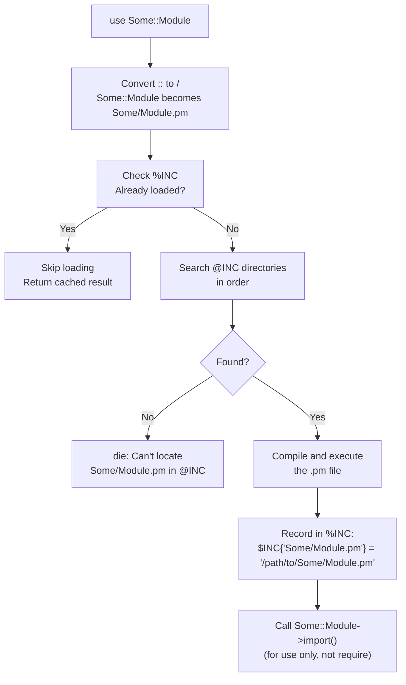
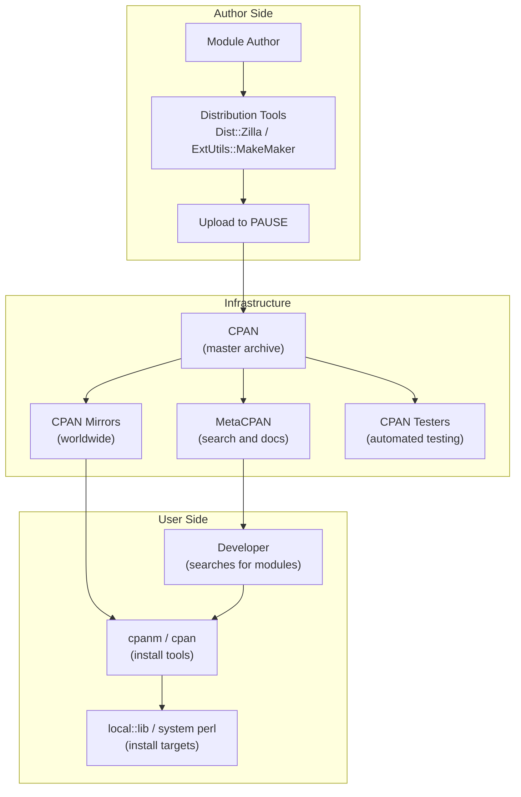

# Modules and CPAN

## Code Organization and the Perl Ecosystem

**Version:** 1.0\
**Year:** 2025

---

## Copyright Notice

Copyright (c) 2025-2026 Ryan Thomas Robson / Robworks Software LLC. Licensed under [CC BY-NC-ND 4.0](../../LICENSE-CONTENT). You may share this material for non-commercial purposes with attribution, but you may not distribute modified versions.

---

Modules are Perl's unit of code organization - a file that declares a namespace, exports functions, and can be loaded by any script or other module. The [**Comprehensive Perl Archive Network (CPAN)**](https://www.cpan.org/) hosts over 200,000 modules covering everything from date parsing to web frameworks. Knowing how to write modules, find the right CPAN library, and manage dependencies is what separates scripts from maintainable software.

---

## use vs. require

Perl provides two mechanisms for loading external code: [**`use`**](https://perldoc.perl.org/functions/use) and [**`require`**](https://perldoc.perl.org/functions/require). They look similar but behave differently.

### use

`use` loads a module at **compile time** - before your program's runtime code executes. Under the hood, `use Module` is equivalent to `BEGIN { require Module; Module->import(); }`:

```perl
use File::Basename;              # loads and imports at compile time
use Carp qw(croak confess);     # imports only croak and confess
```

The `BEGIN` block forces execution at compile time, and `import()` brings the module's exported symbols into your namespace.

### require

`require` loads a module at **runtime** without calling `import()`. You must use fully-qualified names to access its functions:

```perl
require File::Basename;
my $base = File::Basename::basename($path);   # full package name required
```

Use `require` for conditional or optional loading:

```perl
if ($needs_xml) {
    require XML::LibXML;
    my $parser = XML::LibXML->new();
}

# Optional dependency with fallback
my $has_json_xs = eval { require JSON::XS; 1 };
my $json = $has_json_xs ? JSON::XS->new() : do { require JSON::PP; JSON::PP->new() };
```

```quiz
question: "What is the key difference between use and require in Perl?"
type: multiple-choice
options:
  - text: "use loads at compile time and calls import(); require loads at runtime without import()"
    correct: true
    feedback: "Correct! use is equivalent to BEGIN { require Module; Module->import() }. The compile-time loading catches errors early, and import() brings exported symbols into your namespace."
  - text: "use is for object-oriented modules; require is for procedural modules"
    feedback: "Both use and require can load any type of module. The difference is timing (compile vs. runtime) and whether import() is called automatically."
  - text: "use loads the module once; require loads it every time"
    feedback: "Both use and require load a module only once. Perl tracks loaded modules in %INC and skips subsequent loads of the same file."
  - text: "There is no difference - they are synonyms"
    feedback: "They have important differences. use runs at compile time and calls import(). require runs at runtime and does not call import(). This affects when errors are caught and which symbols are available."
```

---

## @INC and Module Search Path

When you write `use Some::Module`, Perl needs to find the file `Some/Module.pm` on disk. It searches through the directories listed in the special array [**`@INC`**](https://perldoc.perl.org/perlvar#@INC).

### Default @INC

Perl populates `@INC` from these sources (searched in order): `-I` command-line flags, the `PERL5LIB` environment variable, site-specific directories (where `cpanm` installs), vendor directories, and core Perl library directories.

```perl
# Print your @INC to see the search path
perl -e 'print join("\n", @INC), "\n";'
```

### Modifying @INC

The [**`use lib`**](https://perldoc.perl.org/lib) pragma is the standard way to add paths inside scripts. It prepends paths to `@INC` at compile time:

```perl
use lib '/home/user/lib';       # inside your script
use lib './lib';                 # relative path
```

Other approaches:

```bash
perl -I/home/user/lib script.pl          # command-line flag
export PERL5LIB=/home/user/lib           # environment variable
```

!!! warning "Current directory removed from @INC"
    Since Perl 5.26, `.` is no longer in `@INC` by default. If your script loads modules from the current directory, you must add `use lib '.'` explicitly. This was a security fix to prevent malicious `.pm` files in the working directory from hijacking module loading.

Perl converts `::` separators to directory separators and appends `.pm` - so `File::Basename` becomes `File/Basename.pm`.

### The Module Loading Process



Perl checks `%INC` before searching `@INC`, so each module is loaded only once per interpreter.

```quiz
question: "Since Perl 5.26, what happens if you run `use MyModule;` and MyModule.pm is in the current directory but `use lib '.'` was not specified?"
type: multiple-choice
options:
  - text: "Perl loads it normally - the current directory is always searched"
    feedback: "Since Perl 5.26, the current directory (.) is no longer in @INC by default. This was a security change to prevent hijacking via malicious .pm files in the working directory."
  - text: "Perl throws an error: Can't locate MyModule.pm in @INC"
    correct: true
    feedback: "Correct! Without '.' in @INC, Perl cannot find modules in the current directory. You must add use lib '.' or use lib './lib' explicitly, or set PERL5LIB."
  - text: "Perl loads it but prints a deprecation warning"
    feedback: "Perl 5.26 removed '.' from @INC entirely - it does not produce a warning and fallback. The module simply fails to load."
  - text: "Perl checks the current directory last, after all other @INC entries"
    feedback: "The current directory is not in @INC at all since Perl 5.26. It is not checked at any position in the search order unless explicitly added."
```

---

## Writing Modules

A Perl module is a `.pm` file that declares a [**package**](https://perldoc.perl.org/functions/package) (namespace) and returns a true value when loaded.

### Minimal Module

```perl
# File: lib/Greeting.pm
package Greeting;

use strict;
use warnings;

sub hello {
    my $name = shift // 'World';
    return "Hello, $name!";
}

1;
```

Three essential elements: `package Greeting` declares the namespace (all subs after this line belong to `Greeting`); `1;` at the end returns a true value (without it, loading fails); and `use strict; use warnings` for safety.

### Using Your Module

```perl
# File: script.pl
use lib './lib';
use Greeting;

print Greeting::hello("Alice"), "\n";   # Hello, Alice!
```

Without Exporter (covered below), you must use the fully-qualified name `Greeting::hello()`.

### Packages and Namespaces

A [**package**](https://perldoc.perl.org/functions/package) creates a separate namespace. Identically-named items in different packages do not collide:

```perl
package Database;
sub connect { ... }    # Database::connect

package WebServer;
sub connect { ... }    # WebServer::connect - no conflict
```

A single file can contain multiple `package` declarations, but the convention is one package per file, with the file path matching the package name.

### Nested Namespaces

Use `::` to create hierarchy. The file path must match:

| Package name | File path |
|-------------|-----------|
| `My::App::Config` | `lib/My/App/Config.pm` |
| `Database::Pool` | `lib/Database/Pool.pm` |

!!! tip "The 1; Return Value"
    The `1;` at the end of a module is required because Perl evaluates the file and checks whether it returned a true value. If you forget it, you get the error "Module.pm did not return a true value." Some developers use `__END__` after the code and put documentation there, but `1;` must come before `__END__`.

```code-walkthrough
language: perl
title: Building a Simple Module with Exporter
code: |
  package StringUtils;

  use strict;
  use warnings;
  use Exporter 'import';

  our @EXPORT_OK = qw(trim titlecase truncate_str);

  sub trim {
      my $str = shift;
      $str =~ s/^\s+|\s+$//g;
      return $str;
  }

  sub titlecase {
      my $str = shift;
      $str =~ s/(\w+)/\u\L$1/g;
      return $str;
  }

  sub truncate_str {
      my ($str, $max) = @_;
      $max //= 80;
      return length($str) > $max
          ? substr($str, 0, $max - 3) . '...'
          : $str;
  }

  1;
annotations:
  - line: 1
    text: "The package declaration sets the namespace. All subs defined here belong to StringUtils::."
  - line: 5
    text: "Importing Exporter's import method directly into this package. This is the modern approach - no need to inherit from Exporter with @ISA or use base."
  - line: 7
    text: "@EXPORT_OK lists functions that callers can request by name: use StringUtils qw(trim titlecase). Unlike @EXPORT, these are not exported automatically."
  - line: 9
    text: "The trim function removes leading and trailing whitespace. The regex s/^\\s+|\\s+$//g handles both ends in one substitution."
  - line: 15
    text: "titlecase capitalizes the first letter of each word. \\u uppercases one character, \\L lowercases the rest. The \\w+ captures each word."
  - line: 21
    text: "truncate_str shortens a string to a maximum length, appending '...' if truncated. The //= operator provides a default of 80 if $max is undef."
  - line: 28
    text: "The module must return a true value. 1; is the universal convention. Without it, use StringUtils would fail with 'did not return a true value.'"
```

---

## Exporter

When you write `use File::Basename`, the `basename` and `dirname` functions become available in your script without a package prefix. This happens through the [**Exporter**](https://perldoc.perl.org/Exporter) module, which provides the mechanism for injecting symbols into the caller's namespace.

### @EXPORT vs. @EXPORT_OK

Exporter uses two arrays to control what gets exported:

| Array | Behavior | Best practice |
|-------|----------|---------------|
| `@EXPORT` | Symbols exported automatically with `use Module` | Avoid - pollutes the caller's namespace without consent |
| `@EXPORT_OK` | Symbols exported only when explicitly requested | Preferred - caller chooses what to import |

```perl
package MathUtils;
use strict;
use warnings;
use Exporter 'import';

our @EXPORT    = qw(add);                       # auto-exported (avoid this)
our @EXPORT_OK = qw(subtract multiply divide);  # exported on request

sub add      { $_[0] + $_[1] }
sub subtract { $_[0] - $_[1] }
sub multiply { $_[0] * $_[1] }
sub divide   { $_[1] != 0 ? $_[0] / $_[1] : undef }
1;
```

```perl
use MathUtils;                         # imports add() via @EXPORT
use MathUtils qw(subtract multiply);   # imports only subtract() and multiply()
```

### Export Tags

Group related exports with [**`%EXPORT_TAGS`**](https://perldoc.perl.org/Exporter#%25EXPORT_TAGS). Callers import tags with a colon prefix:

```perl
our @EXPORT_OK = qw(read_file write_file slurp_dir list_files);
our %EXPORT_TAGS = (
    io  => [qw(read_file write_file)],
    dir => [qw(slurp_dir list_files)],
    all => \@EXPORT_OK,
);

# Caller:
use FileUtils qw(:io);     # imports read_file, write_file
use FileUtils qw(:all);    # imports everything in @EXPORT_OK
```

!!! warning "Avoid @EXPORT for new modules"
    Putting symbols in `@EXPORT` means every user of your module gets those names injected into their namespace whether they want them or not. This can cause name collisions and makes it hard to trace where a function came from. Use `@EXPORT_OK` and let callers explicitly request what they need.

---

## cpanm: Installing CPAN Modules

[**`cpanm`**](https://metacpan.org/pod/App::cpanminus) (also called `cpanminus`) is the preferred tool for installing modules from CPAN. It is simpler and faster than the older `cpan` shell.

### Installing and Using cpanm

```bash
# Install cpanm itself
curl -L https://cpanmin.us | perl - App::cpanminus

# Install a module
cpanm JSON::XS

# Install a specific version
cpanm JSON::XS@4.03

# Install without running tests (faster)
cpanm --notest DBI

# Install from a cpanfile (dependency file)
cpanm --installdeps .

# Install to a local directory (no root required)
cpanm -l ~/perl5 DateTime
```

```terminal
title: Installing and Using CPAN Modules
steps:
  - command: "cpanm --info JSON::PP"
    output: "MAKAMAKA/JSON-PP-4.16.tar.gz"
    narration: "The --info flag shows the distribution tarball without installing. JSON::PP is a core module but cpanm can still look it up on CPAN."
  - command: "cpanm --notest Try::Tiny"
    output: "--> Working on Try::Tiny\nFetching http://www.cpan.org/authors/id/E/ET/ETHER/Try-Tiny-0.31.tar.gz\nBuilding and testing Try-Tiny-0.31 ... OK\nSuccessfully installed Try-Tiny-0.31"
    narration: "cpanm downloads, builds, and installs the module. The --notest flag skips test execution for faster installs. Remove it when you want to verify the module works on your system."
  - command: "perl -e 'use Try::Tiny; try { die \"oops\" } catch { print \"Caught: $_\" };'"
    output: "Caught: oops at -e line 1."
    narration: "The module is now available. Try::Tiny provides try/catch syntax for exception handling. The error is captured in $_ inside the catch block."
  - command: "perl -e 'use JSON::PP; my $json = JSON::PP->new->pretty; print $json->encode({name => \"Alice\", age => 30}), \"\\n\";'"
    output: "{\n   \"age\" : 30,\n   \"name\" : \"Alice\"\n}\n"
    narration: "JSON::PP is a pure-Perl JSON encoder/decoder included with Perl core. The pretty method produces human-readable output with indentation."
```

---

## Finding Modules on MetaCPAN

[**MetaCPAN**](https://metacpan.org/) is the primary search interface for CPAN. It provides source browsing, documentation rendering, dependency graphs, and quality metrics.

### Evaluating Module Quality

Not all CPAN modules are equal. Search by task ("parse CSV", "send email"), check the `Task::Kensho` curated collection, and look at reverse dependencies to gauge popularity. Before committing to a dependency, check these indicators:

| Indicator | Where to find it | What it tells you |
|-----------|-----------------|-------------------|
| [**CPAN Testers**](http://cpantesters.org/) | MetaCPAN sidebar | Pass/fail across platforms and Perl versions |
| GitHub/GitLab activity | Repository link on MetaCPAN | Recent commits, open issues, maintainer responsiveness |
| Reverse dependencies | MetaCPAN "Reverse Dependencies" tab | How many other modules rely on this one |
| Last release date | MetaCPAN module page | Whether the module is actively maintained |
| Documentation quality | MetaCPAN POD rendering | Clear SYNOPSIS, complete API docs, examples |
| License | META file or POD | Whether it is compatible with your project |

!!! tip "The CPAN Testers Matrix"
    CPAN Testers runs automated tests of every CPAN upload across hundreds of platform/Perl-version combinations. A module with all green results is reliable. Sporadic failures on obscure platforms are normal. Widespread failures are a red flag.

---

## cpanfile for Dependency Management

A [**`cpanfile`**](https://metacpan.org/pod/cpanfile) declares your project's module dependencies in a single file. It serves the same purpose as `requirements.txt` in Python or `package.json` in Node.js.

### Basic cpanfile

```perl
# cpanfile
requires 'perl', '5.020';
requires 'Mojolicious', '>= 9.0';
requires 'DBI';
requires 'JSON::XS';
requires 'Try::Tiny';

on 'test' => sub {
    requires 'Test2::Suite';
};

on 'develop' => sub {
    requires 'Perl::Tidy';
    requires 'Perl::Critic';
};
```

Install with `cpanm --installdeps .` for runtime deps, add `--with-test` for test deps, or `--with-develop` for development tools.

```terminal
title: Creating a cpanfile and Installing Dependencies
steps:
  - command: "cat cpanfile"
    output: "requires 'perl', '5.020';\n\nrequires 'JSON::PP';\nrequires 'File::Slurper';\nrequires 'Try::Tiny';\n\non 'test' => sub {\n    requires 'Test2::V0';\n};"
    narration: "A cpanfile lists all project dependencies. Version constraints are optional. The on 'test' block separates test-only modules from runtime requirements."
  - command: "cpanm --installdeps ."
    output: "--> Working on .\nChecking if you have File::Slurper 0 ... Yes (0.014)\nChecking if you have JSON::PP 0 ... Yes (4.16)\nChecking if you have Try::Tiny 0 ... Yes (0.31)\n--> All dependencies satisfied"
    narration: "cpanm reads the cpanfile, checks which modules are already installed, and installs any that are missing. Here everything is already present."
  - command: "cpanm --installdeps --with-test ."
    output: "--> Working on .\nChecking if you have Test2::V0 0 ... Yes (0.000159)\n--> All dependencies satisfied"
    narration: "The --with-test flag includes dependencies from the on 'test' block. Use --with-develop to include development tools as well."
  - command: "perl -e 'use File::Slurper qw(read_text); print \"Module loaded OK\\n\";'"
    output: "Module loaded OK"
    narration: "After installing dependencies, your code can use them normally. File::Slurper provides clean read_text and write_text functions."
```

---

## local::lib for User-Space Installs

When you do not have root access or want to keep module installations isolated from the system Perl, [**`local::lib`**](https://metacpan.org/pod/local::lib) sets up a personal module directory.

### Setup

```bash
# Install local::lib
cpanm local::lib

# Activate it (add to ~/.bashrc or ~/.zshrc)
eval "$(perl -I$HOME/perl5/lib/perl5 -Mlocal::lib)"
```

Once activated, `cpanm` installs modules into `~/perl5/`, Perl adds `~/perl5/lib/perl5` to `@INC` automatically, and no `sudo` is required.

You can also create project-specific libraries:

```bash
# Install modules into ./local/ instead of ~/perl5
eval "$(perl -Mlocal::lib=./local)"
cpanm --installdeps .
```

!!! tip "Combine with cpanfile"
    The workflow of `cpanfile` + `local::lib` + `cpanm --installdeps .` gives you reproducible, isolated dependency management. New developers clone the repository, run one command, and have everything they need.

---

## CPAN Ecosystem Relationships

The CPAN toolchain is a set of interconnected components that work together to author, distribute, install, and test Perl modules:



Authors upload to **PAUSE**, which distributes to **CPAN mirrors** worldwide. **MetaCPAN** provides search and documentation. **CPAN Testers** runs automated cross-platform tests. Users install via **cpanm**.

---

## Dist::Zilla Overview

[**Dist::Zilla**](https://metacpan.org/pod/Dist::Zilla) (commonly called `dzil`) is a distribution authoring tool. Packaging a module as a proper CPAN distribution requires `Makefile.PL`, `META.json`, `MANIFEST`, a `LICENSE` file, and consistent version numbers. Dist::Zilla generates all of this from a `dist.ini` configuration file.

### Minimal dist.ini

```ini
name    = My-Utils
author  = Your Name <you@example.com>
license = Perl_5
version = 0.001

[@Basic]
```

### Common Workflow

```bash
dzil new My::Utils     # create a new distribution
dzil build             # generate the tarball
dzil test              # run tests
dzil release           # upload to CPAN
```

The standard project layout is `lib/` for module code and `t/` for tests. Dist::Zilla manages everything else.

!!! tip "Dist::Zilla vs. Minilla"
    Dist::Zilla is powerful but has a steep learning curve. [**Minilla**](https://metacpan.org/pod/Minilla) is a lighter alternative that follows conventions over configuration. For a first CPAN upload, Minilla is often the faster path.

---

## Exercises

```exercise
title: Write a Utility Module
difficulty: beginner
scenario: |
  Create a module called `TextTools` that provides three functions:

  1. `word_count($string)` - returns the number of words in a string
  2. `reverse_words($string)` - reverses the order of words (not characters)
  3. `unique_words($string)` - returns a sorted list of unique words (case-insensitive)

  Requirements:
  - Place the module in `lib/TextTools.pm`
  - Use `Exporter` with `@EXPORT_OK` (do not auto-export)
  - Include `use strict` and `use warnings`
  - End with `1;`

  Then write a script `text_demo.pl` that uses your module to process the string:
  `"the quick brown fox jumps over the lazy dog the fox"`
hints:
  - "Split words with split(/\\s+/, $string)"
  - "For unique_words, use a hash to track seen words: my %seen; grep { !$seen{lc $_}++ } @words"
  - "In text_demo.pl, add use lib './lib'; before use TextTools"
  - "Export with: use Exporter 'import'; our @EXPORT_OK = qw(word_count reverse_words unique_words);"
solution: |
  ```perl
  # lib/TextTools.pm
  package TextTools;

  use strict;
  use warnings;
  use Exporter 'import';

  our @EXPORT_OK = qw(word_count reverse_words unique_words);

  sub word_count {
      my $str = shift // '';
      my @words = split /\s+/, $str;
      return scalar @words;
  }

  sub reverse_words {
      my $str = shift // '';
      my @words = split /\s+/, $str;
      return join ' ', reverse @words;
  }

  sub unique_words {
      my $str = shift // '';
      my @words = split /\s+/, $str;
      my %seen;
      return sort grep { !$seen{lc $_}++ } @words;
  }

  1;
  ```

  ```perl
  # text_demo.pl
  use strict;
  use warnings;
  use lib './lib';
  use TextTools qw(word_count reverse_words unique_words);

  my $text = "the quick brown fox jumps over the lazy dog the fox";

  printf "Text: %s\n", $text;
  printf "Word count: %d\n", word_count($text);
  printf "Reversed: %s\n", reverse_words($text);
  printf "Unique words: %s\n", join(', ', unique_words($text));
  ```

  Output:
  ```
  Text: the quick brown fox jumps over the lazy dog the fox
  Word count: 11
  Reversed: fox the dog lazy the over jumps fox brown quick the
  Unique words: brown, dog, fox, jumps, lazy, over, quick, the
  ```
```

```exercise
title: Build a Module with Tests and Install It
difficulty: intermediate
scenario: |
  Create a proper Perl distribution with a module, tests, and a cpanfile.

  **Module: `lib/Validator.pm`**

  The module should provide these validation functions:

  1. `is_email($string)` - returns true if the string looks like an email (contains exactly one `@` with text on both sides)
  2. `is_ipv4($string)` - returns true if the string is a valid IPv4 address (four octets, each 0-255)
  3. `is_port($string)` - returns true if the string is a valid port number (1-65535)
  4. `validate($value, @rules)` - applies multiple validation coderefs and returns a list of error messages

  **Tests: `t/validator.t`**

  Write at least 10 test cases covering:
  - Valid and invalid emails
  - Valid and invalid IP addresses
  - Edge-case ports (0, 1, 65535, 65536)
  - The validate() function with multiple rules

  **cpanfile:**

  List the runtime and test dependencies.
hints:
  - "For is_email, a simple check: return $str =~ /^[^@]+\\@[^@]+$/;"
  - "For is_ipv4, split on dots and check each octet: my @octets = split /\\./, $str; return 0 unless @octets == 4; then check each is 0-255"
  - "For validate, accept coderefs: sub validate { my ($val, @rules) = @_; return grep { defined } map { $_->($val) } @rules; }"
  - "In tests, use Test2::V0 or Test::More: use Test::More tests => 12; ok(is_email('a@b.com'), 'valid email'); ok(!is_email('no-at-sign'), 'no @ sign');"
solution: |
  ```perl
  # lib/Validator.pm
  package Validator;

  use strict;
  use warnings;
  use Exporter 'import';

  our @EXPORT_OK = qw(is_email is_ipv4 is_port validate);

  sub is_email {
      my $str = shift // '';
      return $str =~ /^[^\s@]+\@[^\s@]+\.[^\s@]+$/;
  }

  sub is_ipv4 {
      my $str = shift // '';
      my @octets = split /\./, $str;
      return 0 unless @octets == 4;
      for my $oct (@octets) {
          return 0 unless $oct =~ /^\d{1,3}$/ && $oct >= 0 && $oct <= 255;
      }
      return 1;
  }

  sub is_port {
      my $val = shift // '';
      return 0 unless $val =~ /^\d+$/;
      return $val >= 1 && $val <= 65535;
  }

  sub validate {
      my ($value, @rules) = @_;
      return grep { defined } map { $_->($value) } @rules;
  }

  1;
  ```

  ```perl
  # t/validator.t
  use strict;
  use warnings;
  use Test::More tests => 12;
  use lib './lib';
  use Validator qw(is_email is_ipv4 is_port validate);

  ok( is_email('user@example.com'),  'valid email');
  ok(!is_email('no-at-sign'),        'missing @');
  ok( is_ipv4('192.168.1.1'),        'valid IP');
  ok(!is_ipv4('256.1.1.1'),          'octet > 255');
  ok(!is_ipv4('1.2.3'),              'only three octets');
  ok( is_port(80),                   'port 80');
  ok( is_port(65535),                'max port');
  ok(!is_port(0),                    'port 0 invalid');
  ok(!is_port(65536),                'port > 65535');
  my @errors = validate('abc', sub { 'not a number' });
  is(scalar @errors, 1,              'one validation error');
  @errors = validate('ok@t.co', sub { is_email($_[0]) ? undef : 'bad' });
  is(scalar @errors, 0,              'validation passes');
  ```

  Run with: `prove -l t/`
```

---

## cpanm Command Builder

```command-builder
base: cpanm
description: Build a cpanm command to install Perl modules from CPAN
options:
  - flag: ""
    type: text
    label: "Module name"
    explanation: "The CPAN module to install (e.g., JSON::XS, Moose, DBI)"
    placeholder: "Module::Name"
  - flag: "--notest"
    type: flag
    label: "Skip tests"
    explanation: "Do not run the module's test suite during installation. Faster but less safe - you skip verification that the module works on your system."
  - flag: "-l"
    type: text
    label: "Local lib path"
    explanation: "Install into a specific directory instead of the system or user default (e.g., ~/perl5 or ./local)"
    placeholder: "~/perl5"
  - flag: "--installdeps"
    type: flag
    label: "Install deps only"
    explanation: "Read the cpanfile in the current directory and install its dependencies rather than a named module"
  - flag: "-n"
    type: flag
    label: "Force install"
    explanation: "Install even if tests fail. Use with caution - a failing test suite may indicate real problems."
  - flag: "--mirror"
    type: text
    label: "CPAN mirror URL"
    explanation: "Use a specific CPAN mirror instead of the default. Useful behind firewalls or for faster regional mirrors."
    placeholder: "https://cpan.metacpan.org/"
  - flag: "-v"
    type: flag
    label: "Verbose output"
    explanation: "Show detailed build and test output instead of the default quiet mode"
```

---

## Quick Reference

| Concept | Syntax |
|---------|--------|
| Load at compile time | `use Module` |
| Load at runtime | `require Module` |
| Add search path | `use lib './lib'` |
| Declare package | `package My::Module;` |
| Return true | `1;` (end of every `.pm` file) |
| Export on request | `our @EXPORT_OK = qw(func)` |
| Export tags | `our %EXPORT_TAGS = (tag => [...])` |
| Install module | `cpanm Module::Name` |
| Install from cpanfile | `cpanm --installdeps .` |
| Declare dependency | `requires 'Module'` in cpanfile |
| User-space install | `eval "$(perl -Mlocal::lib)"` |

---

## Further Reading

- [perlmod](https://perldoc.perl.org/perlmod) - Perl modules, packages, and symbol tables
- [perlnewmod](https://perldoc.perl.org/perlnewmod) - preparing a new module for distribution
- [Exporter](https://perldoc.perl.org/Exporter) - Exporter module documentation
- [cpanfile specification](https://metacpan.org/pod/cpanfile) - format reference for dependency files
- [local::lib](https://metacpan.org/pod/local::lib) - create and use a local lib directory
- [MetaCPAN](https://metacpan.org/) - search and browse the CPAN archive
- [Task::Kensho](https://metacpan.org/pod/Task::Kensho) - curated list of recommended CPAN modules
- [Intermediate Perl](https://www.oreilly.com/library/view/intermediate-perl-2nd/9781449343781/) - the "Alpaca Book" covers modules, references, and distribution authoring

---

**Previous:** [File I/O and System Interaction](file-io-and-system.md) | **Next:** [Object-Oriented Perl](object-oriented-perl.md) | [Back to Index](README.md)
