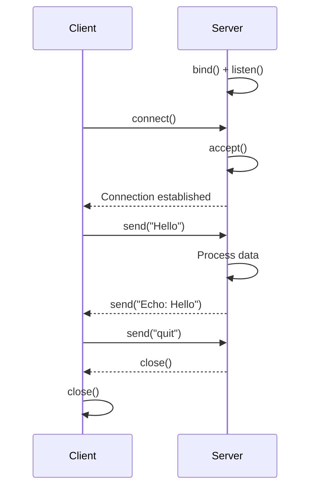
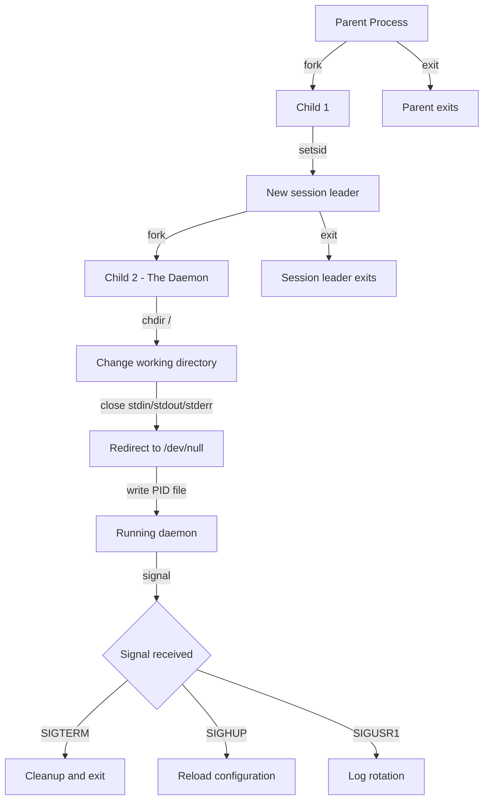

# Networking and Daemons

## System Programming with Perl

**Version:** 1.0\
**Year:** 2025

---

## Copyright Notice

Copyright (c) 2025-2026 Ryan Thomas Robson / Robworks Software LLC. Licensed under [CC BY-NC-ND 4.0](../../LICENSE-CONTENT). You may share this material for non-commercial purposes with attribution, but you may not distribute modified versions.

---

Perl grew up on networked Unix systems. Sockets, forking, and signal handling map directly to system calls that Perl has wrapped since version 1. This guide covers TCP and UDP clients and servers, HTTP requests, JSON encoding, daemon processes, and event-driven frameworks for concurrent I/O.

---

## TCP Sockets with IO::Socket::INET

[**`IO::Socket::INET`**](https://perldoc.perl.org/IO::Socket::INET) provides an object-oriented interface over the raw `socket`/`bind`/`listen`/`accept` system calls. It ships with core Perl.

### TCP Server

A basic TCP server binds to a port, listens for connections, and handles each client:

```perl
use IO::Socket::INET;

my $server = IO::Socket::INET->new(
    LocalPort => 9000,
    Proto     => 'tcp',
    Listen    => 5,
    ReuseAddr => 1,
) or die "Cannot create server: $!\n";

while (my $client = $server->accept()) {
    while (my $line = <$client>) {
        chomp $line;
        print $client "Echo: $line\n";
    }
    close $client;
}
```

`Listen` sets the backlog queue size. `ReuseAddr` lets you restart the server immediately without waiting for the kernel to release the port.

!!! warning "Blocking Accept"
    This server handles one client at a time. While serving client A, client B waits in the backlog queue. For concurrent clients, you need `fork`, threads, or an event loop - covered later in this guide.

### TCP Client

```perl
use IO::Socket::INET;

my $sock = IO::Socket::INET->new(
    PeerHost => 'localhost',
    PeerPort => 9000,
    Proto    => 'tcp',
) or die "Cannot connect: $!\n";

print $sock "Hello, server!\n";
my $reply = <$sock>;
print "Server says: $reply";
close $sock;
```

The socket object is a filehandle. You read from it with `<$sock>` and write with `print $sock` - the same I/O model as regular files.

### TCP Client-Server Flow



```terminal
title: TCP Echo Server and Client
steps:
  - command: "perl -e 'use IO::Socket::INET; my $s = IO::Socket::INET->new(LocalPort=>9900, Proto=>\"tcp\", Listen=>5, ReuseAddr=>1) or die $!; print \"Listening on 9900\\n\"; my $c = $s->accept(); print $c \"Welcome\\n\"; while(<$c>){chomp; last if /^quit$/; print $c \"Echo: $_\\n\"} close $c; close $s;' &"
    output: "Listening on 9900"
    narration: "The server starts and waits for connections on port 9900. The & runs it in the background so we can connect a client."
  - command: "sleep 1 && perl -e 'use IO::Socket::INET; my $s = IO::Socket::INET->new(PeerHost=>\"localhost\", PeerPort=>9900, Proto=>\"tcp\") or die $!; print while <$s>;' <<< $'hello\\nworld\\nquit'"
    output: "Welcome\nEcho: hello\nEcho: world"
    narration: "The client connects, sends three lines, and reads responses. The server echoes each line back with a prefix. Sending quit closes the connection."
  - command: "perl -e 'use IO::Socket::INET; my $s = IO::Socket::INET->new(PeerHost=>\"localhost\", PeerPort=>80, Proto=>\"tcp\", Timeout=>3) or die \"$!\\n\"; print \"Port 80 open\\n\"; close $s;'"
    output: "Port 80 open"
    narration: "The Timeout parameter limits how long the connect call waits. If the connection cannot be established, the constructor returns undef."
```

---

## UDP Sockets

**UDP** is connectionless - no handshake, no guaranteed delivery, no ordering. Each `send` is an independent datagram. This makes UDP appropriate for DNS queries, logging, metrics, and real-time data where dropped packets are acceptable.

A UDP server binds to a port and calls `recv` in a loop. A UDP client specifies the peer at creation time and sends immediately - no handshake:

```perl
# Server
my $srv = IO::Socket::INET->new(LocalPort => 9001, Proto => 'udp')
    or die "Cannot bind: $!\n";
while (1) {
    $srv->recv(my $data, 1024);
    chomp $data;
    $srv->send("ACK: $data\n");
}

# Client
my $cli = IO::Socket::INET->new(
    PeerHost => 'localhost', PeerPort => 9001, Proto => 'udp',
) or die "Cannot create socket: $!\n";
$cli->send("ping\n");
$cli->recv(my $reply, 1024);
print "Got: $reply";
```

!!! tip "When to Use UDP"
    Choose UDP for fire-and-forget scenarios: syslog forwarding, StatsD metrics, DNS lookups, or any situation where retransmission logic lives in your application layer. For everything else, use TCP.

```quiz
question: "What happens when you call IO::Socket::INET->new(Proto => 'tcp', PeerHost => 'example.com', PeerPort => 80)?"
type: multiple-choice
options:
  - text: "It creates a TCP server listening on port 80"
    feedback: "PeerHost and PeerPort specify a remote endpoint to connect to, not a local one to listen on. A server uses LocalPort and Listen."
  - text: "It creates a TCP client connection to example.com port 80"
    correct: true
    feedback: "Correct. PeerHost and PeerPort tell IO::Socket::INET to establish an outgoing TCP connection. The constructor performs the three-way handshake and returns a connected socket (or undef on failure)."
  - text: "It creates a UDP socket that sends datagrams to port 80"
    feedback: "The Proto parameter is explicitly set to 'tcp', so this creates a TCP connection, not a UDP socket."
  - text: "It fails because you need to specify Listen for any TCP socket"
    feedback: "Listen is only required for server sockets. Client sockets connect to a peer - they do not need a listen backlog."
```

---

## HTTP Clients

### HTTP::Tiny

[**`HTTP::Tiny`**](https://metacpan.org/pod/HTTP::Tiny) ships with Perl since version 5.14. No CPAN install needed:

```perl
use HTTP::Tiny;
my $http = HTTP::Tiny->new(timeout => 10);
my $res  = $http->get('https://httpbin.org/get');

if ($res->{success}) {
    print $res->{content};
} else {
    warn "Failed: $res->{status} $res->{reason}\n";
}
```

The response is a hash reference with keys `success`, `status`, `reason`, `content`, and `headers`. POST requests pass a content body and headers:

```perl
my $res = $http->post('https://httpbin.org/post', {
    content => '{"key": "value"}',
    headers => { 'Content-Type' => 'application/json' },
});
```

`HTTP::Tiny` handles redirects, connection keep-alive, and HTTPS if `IO::Socket::SSL` is installed.

### LWP::UserAgent

[**`LWP::UserAgent`**](https://metacpan.org/pod/LWP::UserAgent) is the full-featured HTTP client on CPAN. It supports cookies, authentication, proxies, file uploads, and content negotiation:

```perl
use LWP::UserAgent;

my $ua = LWP::UserAgent->new(timeout => 10);
my $res = $ua->get('https://api.github.com/zen');

if ($res->is_success) {
    print $res->decoded_content, "\n";
} else {
    warn "Error: ", $res->status_line, "\n";
}
```

The response is an [**`HTTP::Response`**](https://metacpan.org/pod/HTTP::Response) object with methods like `is_success`, `status_line`, and `decoded_content`.

| Feature | HTTP::Tiny | LWP::UserAgent |
|---------|-----------|----------------|
| Core Perl | Yes (5.14+) | No (CPAN) |
| HTTPS | Needs IO::Socket::SSL | Needs LWP::Protocol::https |
| Cookies | Manual | Built-in |
| File upload | Manual | Built-in |

### Mojo::UserAgent

[**`Mojo::UserAgent`**](https://docs.mojolicious.org/Mojo/UserAgent) is part of the Mojolicious framework and supports async HTTP with [**promises**](https://docs.mojolicious.org/Mojo/Promise):

```perl
use Mojo::UserAgent;
my $ua = Mojo::UserAgent->new;

# Synchronous
my $res = $ua->get('https://httpbin.org/get')->result;
print $res->json->{origin}, "\n";

# Asynchronous - two requests concurrently
my $p1 = $ua->get_p('https://httpbin.org/delay/1');
my $p2 = $ua->get_p('https://httpbin.org/delay/1');

Mojo::Promise->all($p1, $p2)->then(sub {
    print "Both requests complete\n";
})->catch(sub { warn "Failed: @_\n" })->wait;
```

`Promise->all` runs both requests concurrently - two 1-second requests finish in roughly 1 second instead of 2.

```code-walkthrough
language: perl
title: HTTP API Client with Error Handling
code: |
  use strict;
  use warnings;
  use HTTP::Tiny;
  use JSON::MaybeXS qw(decode_json encode_json);
  use Try::Tiny;

  my $http = HTTP::Tiny->new(
      timeout    => 15,
      agent      => 'PerlAPIClient/1.0',
      verify_SSL => 1,
  );

  sub api_request {
      my (%args) = @_;
      my $method = uc($args{method} // 'GET');
      my $url    = $args{url} or die "URL required\n";

      my %options;
      if ($args{body}) {
          $options{content} = encode_json($args{body});
          $options{headers}{'Content-Type'} = 'application/json';
      }
      $options{headers}{'Accept'} = 'application/json';

      my $response = $http->request($method, $url, \%options);

      unless ($response->{success}) {
          die sprintf "API error: %s %s (URL: %s)\n",
              $response->{status},
              $response->{reason},
              $url;
      }

      return decode_json($response->{content});
  }

  try {
      my $data = api_request(
          url    => 'https://jsonplaceholder.typicode.com/posts/1',
          method => 'GET',
      );
      printf "Title: %s\n", $data->{title};

      my $new = api_request(
          url    => 'https://jsonplaceholder.typicode.com/posts',
          method => 'POST',
          body   => { title => 'Test', body => 'Content', userId => 1 },
      );
      printf "Created post ID: %s\n", $new->{id};
  }
  catch {
      warn "Request failed: $_";
      exit 1;
  };
annotations:
  - line: 4
    text: "JSON::MaybeXS picks the fastest available JSON backend (Cpanel::JSON::XS, JSON::XS, or JSON::PP). It is the recommended way to handle JSON in Perl."
  - line: 8
    text: "Create the HTTP::Tiny instance once and reuse it. This enables connection keep-alive across multiple requests to the same host."
  - line: 11
    text: "verify_SSL enables certificate validation. Without this, HTTPS connections are vulnerable to man-in-the-middle attacks."
  - line: 20
    text: "encode_json converts a Perl hash reference into a JSON string for the request body. Content-Type is set to tell the server what format the body uses."
  - line: 27
    text: "HTTP::Tiny sets success to false for connection errors and 4xx/5xx responses. The status field contains the HTTP status code (or 599 for internal errors like DNS failures)."
  - line: 36
    text: "decode_json parses the JSON response body back into a Perl data structure. Dies if the response is not valid JSON."
  - line: 38
    text: "The try/catch block wraps the entire request sequence. Any die from api_request or JSON parsing is caught here and reported cleanly."
```

---

## JSON Handling

[**`JSON::MaybeXS`**](https://metacpan.org/pod/JSON::MaybeXS) auto-detects the fastest available JSON backend (Cpanel::JSON::XS, JSON::XS, or pure-Perl JSON::PP):

```perl
use JSON::MaybeXS qw(encode_json decode_json);

my $json = encode_json({ name => 'Perl', year => 1987 });
my $data = decode_json($json);
print $data->{name}, "\n";    # Perl
```

For pretty-printed output, use the OO interface with `pretty => 1` and `canonical => 1` (sorted keys).

!!! tip "JSON Boolean Values"
    JSON's `true`/`false` map to `JSON::PP::Boolean` objects (behave like `1`/`0`). To create JSON booleans from Perl, use `JSON::MaybeXS::true`/`JSON::MaybeXS::false`, or `\1`/`\0`.

---

## Writing Daemons

A **daemon** is a long-running background process with no controlling terminal. The classic Unix double-fork ensures the daemon cannot reacquire a controlling terminal:

```perl
use POSIX qw(setsid);

sub daemonize {
    my $pid = fork();
    die "First fork failed: $!\n" unless defined $pid;
    exit 0 if $pid;

    setsid() or die "setsid failed: $!\n";

    $pid = fork();
    die "Second fork failed: $!\n" unless defined $pid;
    exit 0 if $pid;

    chdir '/' or die "Cannot chdir to /: $!\n";
    umask 0;

    open STDIN,  '<', '/dev/null' or die "Cannot redirect STDIN: $!\n";
    open STDOUT, '>', '/dev/null' or die "Cannot redirect STDOUT: $!\n";
    open STDERR, '>', '/dev/null' or die "Cannot redirect STDERR: $!\n";
}
```

### Daemon Lifecycle



### PID File Management

A **PID file** records the daemon's process ID so management scripts can send signals to it. Lock the file with `flock` to prevent duplicate instances:

```perl
use Fcntl ':flock';

sub write_pidfile {
    my ($path) = @_;
    open my $fh, '>', $path or die "Cannot open PID file $path: $!\n";
    flock($fh, LOCK_EX | LOCK_NB)
        or die "Another instance is running (PID file locked)\n";
    print $fh $$;
    return $fh;    # Keep open to hold the lock
}
```

By holding the filehandle open, no other process can acquire the lock until this one exits.

```terminal
title: Daemonizing a Process
steps:
  - command: "perl -e 'use POSIX qw(setsid); my $pid = fork(); die \"fork: $!\" unless defined $pid; if ($pid) { print \"Parent: child is $pid\\n\"; exit 0; } setsid(); print STDERR \"Child: PID $$, SID \", POSIX::getpgrp(), \"\\n\"; sleep 1;'"
    output: "Parent: child is 12345\nChild: PID 12345, SID 12345"
    narration: "After fork, the child calls setsid() to become the leader of a new session. The session ID matches the child PID, confirming it has detached from the parent terminal."
  - command: "perl -e 'use Fcntl \":flock\"; open my $fh, \">\", \"/tmp/test_daemon.pid\" or die $!; flock($fh, LOCK_EX | LOCK_NB) or die \"Already running\\n\"; print $fh $$; print \"Locked PID file with PID $$\\n\"; close $fh; unlink \"/tmp/test_daemon.pid\";'"
    output: "Locked PID file with PID 54321"
    narration: "The PID file is locked with flock. LOCK_NB makes the lock non-blocking - a second instance fails immediately instead of waiting."
  - command: "perl -e 'open STDIN, \"<\", \"/dev/null\"; open STDOUT, \">\", \"/dev/null\"; open STDERR, \">&STDOUT\"; exit 0;' && echo 'Daemon exited cleanly'"
    output: "Daemon exited cleanly"
    narration: "Redirecting standard filehandles to /dev/null is the final step. The daemon produces no terminal output. Logging goes to files or syslog."
```

---

## Proc::Daemon

The [**`Proc::Daemon`**](https://metacpan.org/pod/Proc::Daemon) CPAN module wraps the double-fork pattern into a single method call:

```perl
use Proc::Daemon;

my $daemon = Proc::Daemon->new(
    work_dir     => '/tmp',
    pid_file     => '/tmp/myapp.pid',
    child_STDOUT => '/var/log/myapp.log',
    child_STDERR => '/var/log/myapp.err',
);

my $pid = $daemon->Init();
exit 0 if $pid;    # Parent exits

# Daemon code runs here
while (1) {
    do_work();
    sleep 10;
}
```

`Proc::Daemon` handles forking, session creation, directory change, filehandle redirection, and PID file writing. `Init` returns the child PID to the parent and `0` to the daemon.

---

## Signal Handling in Long-Running Processes

Daemons need to respond to [**signals**](https://perldoc.perl.org/perlipc#Signals) - the Unix mechanism for inter-process communication. Perl exposes signal handlers through the `%SIG` hash:

```perl
my $running = 1;
$SIG{TERM} = sub { warn "SIGTERM received\n"; $running = 0 };
$SIG{HUP}  = sub { warn "SIGHUP received\n";  reload_config() };
$SIG{INT}  = sub { $running = 0 };

while ($running) {
    do_work();
    sleep 1;
}
cleanup();
exit 0;
```

### Common Signals

| Signal | Typical Daemon Use |
|--------|-------------------|
| `SIGTERM` | Graceful shutdown |
| `SIGINT` | Ctrl-C (interactive) |
| `SIGHUP` | Reload configuration |
| `SIGUSR1` | Rotate logs / dump state |
| `SIGCHLD` | Reap child processes |
| `SIGPIPE` | Broken socket (ignore it) |

!!! danger "SIGPIPE Kills Daemons"
    Writing to a closed socket sends `SIGPIPE`, which terminates the process by default. Every network daemon should ignore it: `$SIG{PIPE} = 'IGNORE'`. Then check the return value of `print` or `syswrite` instead.

### Reaping Child Processes

Forking servers must reap children to prevent **zombie processes**. Set a `SIGCHLD` handler with non-blocking `waitpid`:

```perl
use POSIX ':sys_wait_h';
$SIG{CHLD} = sub {
    while ((my $pid = waitpid(-1, WNOHANG)) > 0) { }
};
```

---

## Process Supervision with systemd

Production daemons should be managed by a process supervisor. [**systemd**](https://www.freedesktop.org/software/systemd/man/latest/systemd.service.html) is the standard on modern Linux. A unit file describes how to manage your service:

```ini
[Unit]
Description=My Perl Application
After=network.target

[Service]
Type=simple
ExecStart=/usr/bin/perl /opt/myapp/server.pl
ExecReload=/bin/kill -HUP $MAINPID
Restart=on-failure
RestartSec=5
User=myapp
WorkingDirectory=/opt/myapp
StandardOutput=journal
StandardError=journal

[Install]
WantedBy=multi-user.target
```

Save this as `/etc/systemd/system/myapp.service`, then manage it with `systemctl`:

```bash
sudo systemctl daemon-reload
sudo systemctl enable myapp
sudo systemctl start myapp
```

!!! tip "Type=simple vs. Type=forking"
    With `Type=simple`, systemd expects your process to stay in the foreground - do **not** daemonize. systemd handles backgrounding. With `Type=forking`, systemd expects the process to fork and reads the PID file to track the child. `Type=simple` is preferred for new services.

When using `Type=simple`, your Perl script runs as a foreground process. Set `$| = 1` to unbuffer STDOUT so log lines appear immediately in journald:

```perl
#!/usr/bin/perl
use strict;
use warnings;

$| = 1;
my $running = 1;
$SIG{TERM} = sub { $running = 0 };
$SIG{HUP}  = sub { reload_config() };
$SIG{PIPE} = 'IGNORE';

while ($running) {
    do_work();
    sleep 1;
}
exit 0;
```

---

## Event-Driven Programming

Blocking I/O handles one connection at a time. Event-driven I/O multiplexes many connections in a single process using `select`, `poll`, or `epoll` under the hood.

### AnyEvent

[**`AnyEvent`**](https://metacpan.org/pod/AnyEvent) provides a unified API across multiple event loop backends (EV, Event, POE, or its own pure-Perl loop):

```perl
use AnyEvent;
use AnyEvent::Socket;
use AnyEvent::Handle;

my $cv = AnyEvent->condvar;

tcp_server undef, 9000, sub {
    my ($fh, $host, $port) = @_;
    my $handle = AnyEvent::Handle->new(
        fh       => $fh,
        on_error => sub { $_[0]->destroy },
        on_eof   => sub { $_[0]->destroy },
    );
    $handle->on_read(sub {
        $handle->push_read(line => sub {
            my (undef, $line) = @_;
            $handle->push_write("Echo: $line\n");
        });
    });
};

$cv->recv;    # Enter the event loop
```

The **condition variable** (`$cv`) is the event loop entry point. `$cv->recv` blocks until `$cv->send` is called. Each connection gets its own `AnyEvent::Handle` for async I/O.

### IO::Async

[**`IO::Async`**](https://metacpan.org/pod/IO::Async) is another event-driven framework, structured around a central loop with notifier objects. Where AnyEvent uses bare callbacks, IO::Async wraps everything in objects. It has built-in `Future` support for composing async operations.

```perl
use IO::Async::Loop;
use IO::Async::Listener;

my $loop = IO::Async::Loop->new;

$loop->add(IO::Async::Listener->new(
    on_stream => sub {
        my (undef, $stream) = @_;
        $stream->configure(on_read => sub {
            my ($self, $buffref, $eof) = @_;
            while ($$buffref =~ s/^(.*)\n//) {
                $self->write("Echo: $1\n");
            }
            return 0;
        });
        $loop->add($stream);
    },
));

$loop->listen(
    addr => { family => 'inet', socktype => 'stream', port => 9000 },
)->get;
$loop->run;
```

| Feature | AnyEvent | IO::Async |
|---------|----------|-----------|
| Style | Callback-based | Object notifiers |
| Timer | `AnyEvent->timer(...)` | `$loop->delay_future(...)` |
| Futures | `AnyEvent::Future` | Built-in `Future` |
| Ecosystem | Large (AnyEvent::*) | Growing (Net::Async::*) |

Both frameworks achieve the same goal: handling thousands of concurrent connections in a single process without threads or forks. AnyEvent is callback-centric. IO::Async uses an object hierarchy. Choose whichever fits your mental model.

```exercise
title: HTTP Status Checker Script
difficulty: beginner
scenario: |
  Write a Perl script that checks the HTTP status of a list of URLs.

  Requirements:
  1. Accept URLs as command-line arguments or from STDIN (one per line)
  2. Use HTTP::Tiny to make a HEAD request to each URL
  3. Print each URL with its status code
  4. Print a summary: total checked, successful, failed
hints:
  - "Use HTTP::Tiny with the head() method: my $res = $http->head($url);"
  - "Check $res->{success} for boolean pass/fail"
  - "Status 599 means a client-side error (DNS failure, timeout)"
  - "Use printf for aligned output: printf '%-40s %3d %s', $url, $status, $reason"
solution: |
  ```perl
  use strict;
  use warnings;
  use HTTP::Tiny;

  my $http = HTTP::Tiny->new(timeout => 10);
  my @urls = @ARGV;
  unless (@urls) {
      while (<STDIN>) { chomp; push @urls, $_ if length }
  }
  die "Usage: $0 <url> [url ...]\n" unless @urls;

  my ($ok, $fail) = (0, 0);
  for my $url (@urls) {
      my $res = $http->head($url);
      my $reason = $res->{success} ? $res->{reason} : 'Failed';
      printf "%-40s %3d %s\n", $url, $res->{status}, $reason;
      $res->{success} ? $ok++ : $fail++;
  }
  printf "\nSummary: %d checked, %d OK, %d failed\n",
      scalar @urls, $ok, $fail;
  ```

  HTTP::Tiny's head() sends a HEAD request (no body download). Status
  599 is its internal code for client-side errors (DNS failure, timeout).
```

```exercise
title: Chat Server with Multiple Clients
difficulty: intermediate
scenario: |
  Build a forking TCP chat server in Perl.

  Requirements:
  1. Listen on a configurable port (default 9000)
  2. Accept multiple simultaneous clients using fork
  3. Each client provides a nickname on connection
  4. Broadcast messages from each client to all others
  5. Handle client disconnection gracefully
  6. Respond to SIGTERM for clean shutdown

  Protocol: server sends "NICK?" on connect, client replies with a name,
  server sends "WELCOME <nick>", then broadcasts "<nick>: message" to all.

  Use IO::Select for single-process multiplexing (no forking needed).
hints:
  - "Use IO::Select to multiplex across multiple client sockets in one process"
  - "IO::Select->can_read(0.1) returns sockets with data ready to read"
  - "Store clients in a hash: $clients{$socket} = {nick => $name, sock => $socket}"
  - "Broadcast by iterating all clients except the sender"
  - "Handle disconnection when <$sock> returns undef"
solution: |
  ```perl
  use strict;
  use warnings;
  use IO::Socket::INET;
  use IO::Select;

  my $port = $ARGV[0] // 9000;
  my $server = IO::Socket::INET->new(
      LocalPort => $port, Proto => 'tcp',
      Listen => 10, ReuseAddr => 1,
  ) or die "Cannot create server: $!\n";

  my $select = IO::Select->new($server);
  my %clients;
  $SIG{PIPE} = 'IGNORE';
  $SIG{TERM} = sub {
      print { $clients{$_}{sock} } "QUIT\n" for keys %clients;
      exit 0;
  };

  while (1) {
      for my $sock ($select->can_read(0.1)) {
          if ($sock == $server) {
              my $c = $server->accept();
              $select->add($c);
              print $c "NICK?\n";
              $clients{$c} = { sock => $c, nick => undef };
          } else {
              my $line = <$sock>;
              unless (defined $line) {
                  my $nick = $clients{$sock}{nick} // 'unknown';
                  delete $clients{$sock};
                  $select->remove($sock); close $sock;
                  broadcast("* $nick has left\n", undef);
                  next;
              }
              chomp $line;
              if (!defined $clients{$sock}{nick}) {
                  $clients{$sock}{nick} = $line;
                  print $sock "WELCOME $line\n";
                  broadcast("* $line has joined\n", $sock);
              } else {
                  broadcast("$clients{$sock}{nick}: $line\n", $sock);
              }
          }
      }
  }

  sub broadcast {
      my ($msg, $exclude) = @_;
      for my $k (keys %clients) {
          next if defined $exclude && $clients{$k}{sock} == $exclude;
          next unless defined $clients{$k}{nick};
          print { $clients{$k}{sock} } $msg;
      }
  }
  ```

  IO::Select multiplexes all sockets in one process. The select loop
  checks for readable data, accepts new connections, and broadcasts
  messages from each client to all others.
```

```command-builder
base: perl -MIO::Socket::INET -e
description: Build a Perl socket one-liner for quick network testing
options:
  - flag: ""
    type: select
    label: "Socket operation"
    explanation: "Choose a network operation to perform"
    choices:
      - ["'my $s = IO::Socket::INET->new(PeerHost=>\"localhost\", PeerPort=>80, Proto=>\"tcp\", Timeout=>3) or die \"$!\\n\"; print \"Port 80 open\\n\"; close $s;'", "TCP port check (connect test)"]
      - ["'my $s = IO::Socket::INET->new(PeerHost=>\"localhost\", PeerPort=>80, Proto=>\"tcp\") or die $!; print $s \"GET / HTTP/1.0\\r\\nHost: localhost\\r\\n\\r\\n\"; print while <$s>;'", "Raw HTTP GET request"]
      - ["'my $s = IO::Socket::INET->new(LocalPort=>9999, Proto=>\"tcp\", Listen=>1, ReuseAddr=>1) or die $!; print \"Listening 9999\\n\"; my $c=$s->accept; print while <$c>;'", "Simple TCP listener (receive data)"]
      - ["'my $s = IO::Socket::INET->new(PeerHost=>\"localhost\", PeerPort=>9999, Proto=>\"udp\") or die $!; $s->send(\"ping\"); $s->recv(my $r, 1024); print $r;'", "UDP send and receive"]
  - flag: ""
    type: text
    label: "Target host"
    explanation: "Hostname or IP to connect to (replaces localhost in the command)"
    placeholder: "localhost"
```

---

## Further Reading

- [perlipc](https://perldoc.perl.org/perlipc) - Perl interprocess communication: signals, pipes, sockets
- [IO::Socket::INET documentation](https://perldoc.perl.org/IO::Socket::INET) - TCP/UDP socket interface
- [HTTP::Tiny documentation](https://metacpan.org/pod/HTTP::Tiny) - lightweight HTTP client (core module)
- [LWP::UserAgent documentation](https://metacpan.org/pod/LWP::UserAgent) - full-featured HTTP client
- [Mojo::UserAgent documentation](https://docs.mojolicious.org/Mojo/UserAgent) - async HTTP with promises
- [JSON::MaybeXS documentation](https://metacpan.org/pod/JSON::MaybeXS) - fast, portable JSON handling
- [AnyEvent documentation](https://metacpan.org/pod/AnyEvent) - event-driven programming
- [IO::Async documentation](https://metacpan.org/pod/IO::Async) - asynchronous I/O framework
- [systemd.service man page](https://www.freedesktop.org/software/systemd/man/latest/systemd.service.html) - service unit configuration
- [Network Programming with Perl (Stein)](https://www.oreilly.com/library/view/network-programming-with/0201615711/) - comprehensive reference

---

**Previous:** [Text Processing and One-Liners](text-processing-oneliners.md) | **Next:** [Web Frameworks and APIs](web-frameworks-apis.md) | [Back to Index](README.md)
