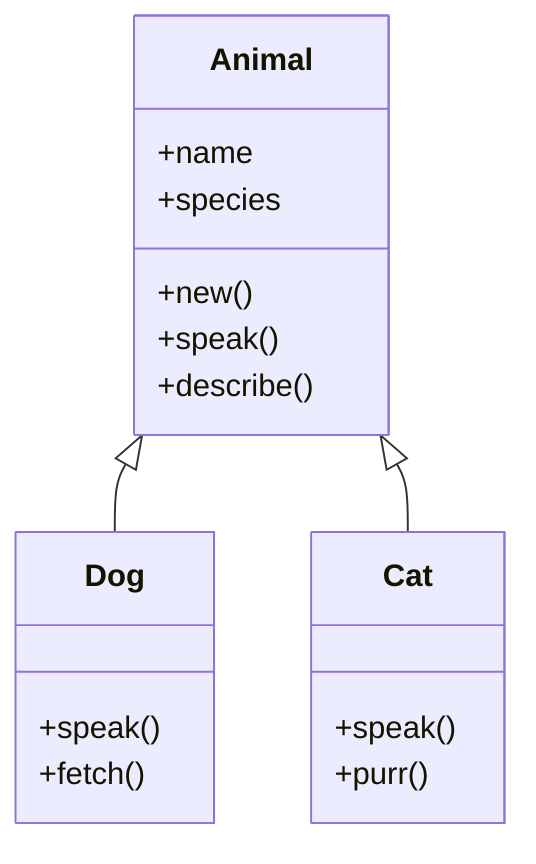
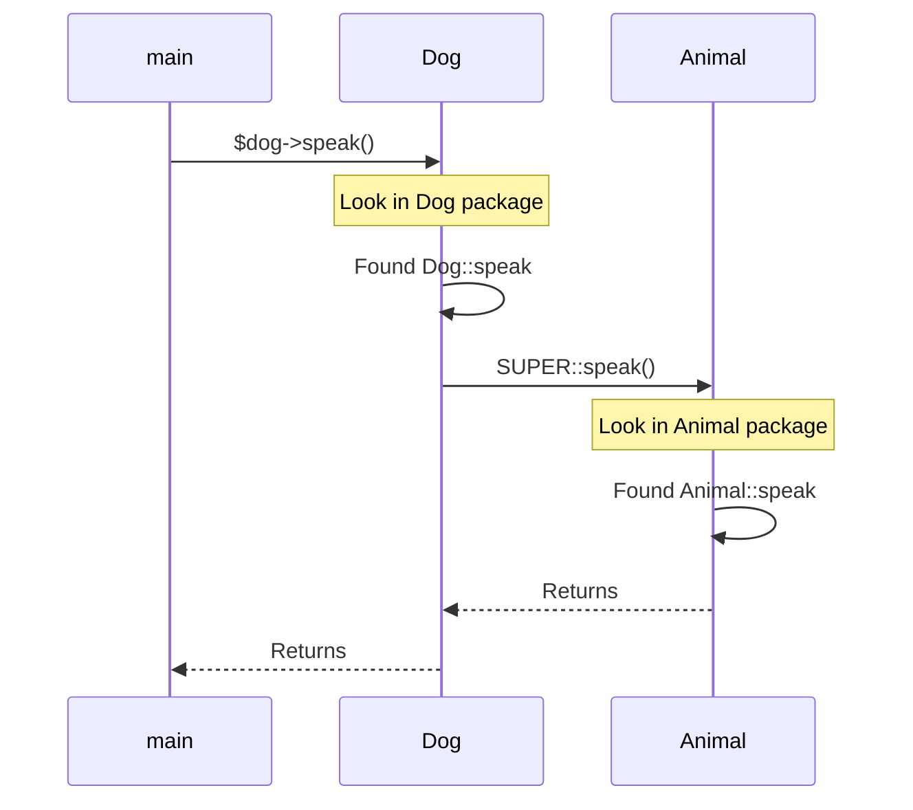

# Object-Oriented Perl

## From bless to Moose: Building Reusable Abstractions

**Version:** 1.1
**Year:** 2026

---

## Copyright Notice

Copyright (c) 2025-2026 Ryan Thomas Robson / Robworks Software LLC. Licensed under [CC BY-NC-ND 4.0](../../LICENSE-CONTENT). You may share this material for non-commercial purposes with attribution, but you may not distribute modified versions.

---

Perl's object system is unlike most languages. There is no `class` keyword, no built-in `new` method, and no special syntax for declaring attributes. Instead, Perl OOP is built on three concepts you already know: packages (namespaces), references (data), and subroutines (behavior). The [**`bless`**](https://perldoc.perl.org/functions/bless) function connects a reference to a package, and that connection is the entire foundation of Perl objects.

This minimal design gives you full control - and full responsibility. You can build a class in five lines or layer on a sophisticated metaobject protocol with [**Moose**](https://metacpan.org/pod/Moose). This guide covers both ends of that spectrum: the manual mechanics that every Perl programmer needs to understand, and the modern tools that make OOP productive.

---

## bless and Constructors

An object in Perl is a reference that has been associated with a package using `bless`. That package becomes the object's class, and its subroutines become the object's methods.

### The bless Function

`bless` takes a reference and a class name (package name) and returns the reference, now tagged with that class:

```perl
package Dog;

sub new {
    my ($class, %args) = @_;
    my $self = {
        name  => $args{name}  // 'Unknown',
        breed => $args{breed} // 'Mixed',
    };
    bless $self, $class;
    return $self;
}
```

Here is what happens step by step:

1. `$class` receives the string `"Dog"` (the invocant - explained below)
2. `%args` absorbs the remaining arguments as key-value pairs
3. `$self` is an anonymous hash reference holding the object's data
4. `bless $self, $class` tags that hash reference as a `Dog` object
5. The blessed reference is returned to the caller

### Calling the Constructor

```perl
my $rex = Dog->new(name => 'Rex', breed => 'Labrador');
print ref($rex);  # "Dog"
```

The [**`ref`**](https://perldoc.perl.org/functions/ref) function returns the class name of a blessed reference, or the reference type (`HASH`, `ARRAY`, etc.) for unblessed references.

!!! tip "Why a hash reference?"
    You can bless any reference - array refs, scalar refs, even code refs. Hash references are the convention because they give you named fields (`$self->{name}`) that are readable and extensible. Array-based objects use less memory but sacrifice clarity.

```terminal
title: Creating a Basic Class with bless
steps:
  - command: "perl -e 'package Dog; sub new { my ($class, %args) = @_; bless { name => $args{name}, breed => $args{breed} }, $class } sub bark { my $self = shift; print \"$self->{name} says: Woof!\\n\" } package main; my $d = Dog->new(name => \"Rex\", breed => \"Lab\"); $d->bark;'"
    output: "Rex says: Woof!"
    narration: "A complete class in one line. The package declares the namespace, new() is the constructor that blesses a hash ref, and bark() is a method that accesses the object's data through $self."
  - command: "perl -e 'package Dog; sub new { my ($class, %args) = @_; bless { name => $args{name} }, $class } package main; my $d = Dog->new(name => \"Rex\"); print ref($d), \"\\n\";'"
    output: "Dog"
    narration: "ref() on a blessed reference returns the class name. On an unblessed hash ref it would return 'HASH'. This is how Perl knows which package to search for methods."
  - command: "perl -e 'package Dog; sub new { my ($class, %args) = @_; bless { name => $args{name} }, $class } package main; my $d = Dog->new(name => \"Rex\"); print $d->{name}, \"\\n\";'"
    output: "Rex"
    narration: "The object is still a hash reference. You can access its fields directly with arrow notation. In production code, use accessor methods instead of reaching into the hash."
  - command: "perl -e 'my $plain = { x => 1 }; print ref($plain), \"\\n\"; bless $plain, \"Point\"; print ref($plain), \"\\n\";'"
    output: "HASH\nPoint"
    narration: "Before bless, ref() returns 'HASH'. After bless, it returns the class name. bless mutates the reference in place - it does not create a copy."
```

---

## Methods and the Invocant

A **method** is a subroutine that expects an object (or class name) as its first argument. Perl passes this automatically when you use arrow notation.

### Instance Methods

When you call `$obj->method()`, Perl translates it to `Package::method($obj)`. The object is passed as the first argument, conventionally called `$self`:

```perl
package Dog;

sub speak {
    my ($self) = @_;
    print "$self->{name} says: Woof!\n";
}

sub describe {
    my ($self) = @_;
    printf "%s is a %s\n", $self->{name}, $self->{breed};
}
```

### Class Methods

Class methods receive the class name as the first argument instead of an object. The constructor `new` is the most common class method:

```perl
package Logger;

sub new {
    my ($class, %args) = @_;
    return bless { level => $args{level} // 'info' }, $class;
}

# Another class method
sub default {
    my ($class) = @_;
    return $class->new(level => 'warn');
}
```

```perl
my $log = Logger->default;  # calls Logger::default("Logger")
```

### shift vs Explicit Unpacking

Two common styles for extracting the invocant:

```perl
# Style 1: shift (common in short methods)
sub name {
    my $self = shift;
    return $self->{name};
}

# Style 2: list unpacking (common when there are other arguments)
sub set_name {
    my ($self, $new_name) = @_;
    $self->{name} = $new_name;
}
```

Both are idiomatic. Use `shift` for simple accessors and list unpacking when you have additional parameters.

---

## Accessor Methods

Direct hash access (`$obj->{name}`) exposes your object's internals. **Accessor methods** provide a controlled interface:

### Read-Only Accessors

```perl
sub name {
    my ($self) = @_;
    return $self->{name};
}

sub breed {
    my ($self) = @_;
    return $self->{breed};
}
```

### Read-Write Accessors

A combined getter/setter uses the argument count to decide behavior:

```perl
sub name {
    my $self = shift;
    if (@_) {
        $self->{name} = shift;
    }
    return $self->{name};
}
```

```perl
print $dog->name;           # getter: returns "Rex"
$dog->name("Buddy");        # setter: changes name to "Buddy"
print $dog->name;           # getter: returns "Buddy"
```

### Generating Accessors

Writing the same accessor pattern for every field is tedious. You can generate them:

```perl
package Animal;

sub new {
    my ($class, %args) = @_;
    return bless \%args, $class;
}

# Generate accessors for each field
for my $field (qw(name species weight)) {
    no strict 'refs';
    *{"Animal::$field"} = sub {
        my $self = shift;
        $self->{$field} = shift if @_;
        return $self->{$field};
    };
}
```

This loop installs a subroutine into the package's symbol table for each field name. The closure captures `$field`, so each generated method accesses the correct hash key.

!!! warning "no strict 'refs'"
    The `no strict 'refs'` directive is required when manipulating the symbol table with string references. Limit its scope to the smallest block possible. In production, prefer Moose or Moo (covered below) which handle accessor generation safely.

```quiz
title: bless and Method Dispatch
question: "What does bless actually do to a reference in Perl?"
type: multiple-choice
options:
  - text: "It copies the reference and attaches class metadata to the copy"
    feedback: "bless does not copy the reference. It modifies the existing reference in place, tagging it with the class name. After bless, the same reference is now an object."
  - text: "It associates the reference with a package so Perl knows where to find methods"
    correct: true
    feedback: "Correct! bless tags a reference with a package name. When you call a method on that reference, Perl looks for the subroutine in the associated package. The reference itself is unchanged - it is still a hash ref (or array ref, etc.) with the same data."
  - text: "It creates a new class and registers it with the Perl interpreter"
    feedback: "Classes are just packages - they exist as soon as you declare them with the package keyword. bless does not create packages. It connects a reference to an existing package."
  - text: "It prevents direct access to the reference's data, enforcing encapsulation"
    feedback: "Perl does not enforce encapsulation. After blessing, you can still access $obj->{key} directly. Encapsulation in Perl is by convention (using accessor methods), not by enforcement."
```

---

## Inheritance

Inheritance in Perl is controlled by the [**`@ISA`**](https://perldoc.perl.org/perlvar#@ISA) array. When you call a method on an object, Perl first looks in the object's class. If the method is not found there, Perl searches through the classes listed in `@ISA`, in order.

### The @ISA Array

```perl
package Animal;

sub new {
    my ($class, %args) = @_;
    return bless \%args, $class;
}

sub speak {
    my ($self) = @_;
    print $self->{name} . " makes a sound\n";
}

sub describe {
    my ($self) = @_;
    printf "%s is a %s\n", $self->{name}, $self->{species};
}

package Dog;
our @ISA = ('Animal');

sub speak {
    my ($self) = @_;
    print $self->{name} . " says: Woof!\n";
}

package Cat;
our @ISA = ('Animal');

sub speak {
    my ($self) = @_;
    print $self->{name} . " says: Meow!\n";
}
```

`Dog` and `Cat` inherit `new` and `describe` from `Animal`, but override `speak` with their own implementations.

### use parent (Preferred)

Manually setting `@ISA` works, but the [**`use parent`**](https://perldoc.perl.org/parent) pragma is the modern way:

```perl
package Dog;
use parent 'Animal';

sub speak {
    my ($self) = @_;
    print $self->{name} . " says: Woof!\n";
}
```

`use parent` sets `@ISA` at compile time and loads the parent module if it has not been loaded yet. An older pragma, `use base`, does the same thing but has quirks around failed module loading. Prefer `use parent`.

### Class Hierarchy Diagram



```code-walkthrough
language: perl
title: Building a Class Hierarchy - Animal, Dog, and Cat
code: |
  package Animal;
  use strict;
  use warnings;

  sub new {
      my ($class, %args) = @_;
      return bless {
          name    => $args{name}    // 'Unknown',
          species => $args{species} // 'Unknown',
      }, $class;
  }

  sub name    { return $_[0]->{name} }
  sub species { return $_[0]->{species} }

  sub speak {
      my ($self) = @_;
      print $self->name . " makes a sound\n";
  }

  sub describe {
      my ($self) = @_;
      printf "%s is a %s\n", $self->{name}, $self->{species};
  }

  package Dog;
  use parent -norequire, 'Animal';

  sub new {
      my ($class, %args) = @_;
      $args{species} = 'Canis familiaris';
      my $self = $class->SUPER::new(%args);
      $self->{tricks} = $args{tricks} // [];
      return $self;
  }

  sub speak {
      my ($self) = @_;
      print $self->name . " says: Woof!\n";
  }

  sub fetch {
      my ($self, $item) = @_;
      print $self->name . " fetches the $item\n";
  }

  package Cat;
  use parent -norequire, 'Animal';

  sub new {
      my ($class, %args) = @_;
      $args{species} = 'Felis catus';
      return $class->SUPER::new(%args);
  }

  sub speak {
      my ($self) = @_;
      print $self->name . " says: Meow!\n";
  }

  sub purr { print $_[0]->name . " purrs...\n" }

  package main;
  my $dog = Dog->new(name => 'Rex');
  my $cat = Cat->new(name => 'Whiskers');

  $dog->speak;
  $cat->speak;
  $dog->describe;
  $cat->purr;
annotations:
  - line: 1
    text: "The base class. Any package can serve as a class - there is no special class keyword in Perl."
  - line: 6
    text: "The constructor receives the class name as the first argument. Using $class instead of hardcoding 'Animal' makes inheritance work - subclasses calling SUPER::new will pass their own class name."
  - line: 14
    text: "Compact accessor style. $_[0] is the invocant ($self). For simple read-only accessors, this one-line form is common."
  - line: 21
    text: "The describe method accesses the object's internal hash directly. Since Dog and Cat inherit from Animal, they get this method for free through @ISA."
  - line: 27
    text: "The -norequire flag tells use parent not to try loading Animal from a file. Needed here because Animal is defined in the same file."
  - line: 29
    text: "Dog's constructor sets the species, then delegates to Animal's constructor via SUPER::new. This ensures the parent's initialization logic runs."
  - line: 33
    text: "After the parent constructor returns, Dog adds its own attribute (tricks). The object is already blessed as a Dog thanks to $class propagation."
  - line: 50
    text: "Cat does not need extra attributes, so its constructor just sets species and delegates entirely to SUPER::new."
  - line: 63
    text: "In package main, we create objects with the subclass constructors. Dog->new and Cat->new both call SUPER::new internally, but the objects are blessed as Dog and Cat respectively."
  - line: 69
    text: "Dog has no describe method, so Perl searches @ISA and finds Animal::describe. Inheritance provides the method automatically."
```

---

## SUPER:: and Method Resolution

When a subclass overrides a parent method but still needs the parent's behavior, use [**`SUPER::`**](https://perldoc.perl.org/perlobj#Method-Resolution-Order):

```perl
package Dog;
use parent 'Animal';

sub speak {
    my ($self) = @_;
    $self->SUPER::speak();       # call Animal::speak
    print "(tail wagging)\n";    # add Dog-specific behavior
}
```

`SUPER::speak()` calls the `speak` method from the current package's parent class. This is resolved at compile time based on the package where `SUPER::` appears, not the class of the object.

!!! warning "SUPER:: is package-relative"
    `SUPER::` looks up the parent based on the package where the call is written, not the runtime class of `$self`. In deep inheritance chains, this distinction matters. For more flexible dispatch, see the `next::method` approach from the `mro` module.

### Method Resolution Order (MRO)

When a class has multiple parents (multiple inheritance), Perl needs a strategy to decide which parent to search first. The default is **depth-first left-to-right (DFS)**, but Perl 5.10 introduced the **C3 linearization** algorithm:

```perl
use mro 'c3';

package Dog;
use parent 'Animal', 'Pet';
```

The [**`mro`**](https://perldoc.perl.org/mro) module controls method resolution order. C3 linearization prevents the "diamond problem" where a class could inherit the same method through two different paths, with ambiguous results.



### isa and can

Two introspection methods tell you about an object's capabilities:

[**`isa`**](https://perldoc.perl.org/UNIVERSAL#$obj-%3Eisa(-TYPE-)) checks whether an object belongs to a class (or inherits from it):

```perl
my $dog = Dog->new(name => 'Rex');
print $dog->isa('Dog');       # 1 (true)
print $dog->isa('Animal');    # 1 (true - Dog inherits from Animal)
print $dog->isa('Cat');       # "" (false)
```

[**`can`**](https://perldoc.perl.org/UNIVERSAL#$obj-%3Ecan(-METHOD-)) checks whether an object has a particular method available:

```perl
print $dog->can('speak');     # returns a code reference (true)
print $dog->can('fly');       # undef (false)

# can() returns the code ref, so you can call it
if (my $method = $dog->can('speak')) {
    $dog->$method();
}
```

Both `isa` and `can` are provided by the [**UNIVERSAL**](https://perldoc.perl.org/UNIVERSAL) class, which is the implicit base class of every Perl object.

```quiz
title: Moose vs Manual OOP
question: "What is the primary advantage of using Moose over manual bless-based OOP?"
type: multiple-choice
options:
  - text: "Moose makes Perl objects faster at runtime"
    feedback: "Moose actually adds startup overhead due to its metaobject protocol. Its advantage is developer productivity and correctness, not runtime speed. For speed-sensitive code, Moo is a lighter alternative."
  - text: "Moose provides declarative syntax for attributes, type constraints, inheritance, and roles - eliminating boilerplate and reducing bugs"
    correct: true
    feedback: "Correct! Moose replaces manual constructor writing, accessor generation, type checking, and inheritance setup with a declarative syntax. has, extends, with, and type constraints handle what would otherwise be dozens of lines of hand-written code."
  - text: "Moose is required for inheritance - manual Perl OOP does not support it"
    feedback: "Manual Perl OOP supports inheritance through @ISA and use parent. Moose makes it more convenient with extends, but it is not required."
  - text: "Moose encrypts object data so fields cannot be accessed directly"
    feedback: "Moose objects are still hash refs under the hood. You can technically reach into the hash directly, though Moose provides proper accessor methods. Encapsulation is still by convention."
```

---

## DESTROY and Destructors

When an object goes out of scope or its last reference is removed, Perl calls the [**`DESTROY`**](https://perldoc.perl.org/perlobj#Destructors) method on it (if one exists). This is the destructor:

```perl
package TempFile;

sub new {
    my ($class, %args) = @_;
    my $self = bless {
        path => $args{path},
    }, $class;
    open $self->{fh}, '>', $self->{path}
        or die "Cannot create $self->{path}: $!\n";
    return $self;
}

sub DESTROY {
    my ($self) = @_;
    close $self->{fh} if $self->{fh};
    unlink $self->{path} if -e $self->{path};
    print "Cleaned up $self->{path}\n";
}
```

```perl
{
    my $tmp = TempFile->new(path => '/tmp/work.dat');
    # ... use $tmp ...
}
# $tmp goes out of scope here - DESTROY is called automatically
```

### DESTROY Rules

- Perl calls `DESTROY` automatically - never call it manually
- `DESTROY` is called on each object exactly once
- The order of destruction for global objects at program exit is undefined
- `die` inside `DESTROY` is silently caught (it sets `$@` but does not propagate)
- If a subclass needs cleanup, call `$self->SUPER::DESTROY()` in its destructor

!!! warning "Circular references prevent DESTROY"
    If object A references object B and object B references object A, neither will be destroyed until the program exits. Use [**`Scalar::Util::weaken`**](https://perldoc.perl.org/Scalar::Util#weaken) to break cycles, or use Moose's `weak_ref` attribute option.

---

## Moose: Modern OOP

[**Moose**](https://metacpan.org/pod/Moose) is a complete metaobject protocol for Perl. It provides declarative syntax for attributes, type constraints, inheritance, roles, and method modifiers. Moose eliminates the boilerplate of manual OOP while adding features that bless-based code cannot easily replicate.

### Your First Moose Class

```perl
package Person;
use Moose;

has 'name' => (
    is       => 'ro',
    isa      => 'Str',
    required => 1,
);

has 'age' => (
    is      => 'rw',
    isa     => 'Int',
    default => 0,
);

has 'email' => (
    is        => 'rw',
    isa       => 'Str',
    predicate => 'has_email',
);

no Moose;
__PACKAGE__->meta->make_immutable;
```

That is equivalent to roughly 40 lines of manual OOP code: a constructor with validation, three accessor methods, a predicate method, and immutability optimization.

### The has Declaration

[**`has`**](https://metacpan.org/pod/Moose#has) declares an attribute with options:

| Option | Purpose | Example |
|--------|---------|---------|
| `is` | Access mode | `'ro'` (read-only), `'rw'` (read-write) |
| `isa` | Type constraint | `'Str'`, `'Int'`, `'ArrayRef[Str]'` |
| `required` | Must be provided to constructor | `1` |
| `default` | Default value (scalar or code ref) | `0`, `sub { [] }` |
| `builder` | Method name that returns default | `'_build_name'` |
| `lazy` | Build default on first access | `1` |
| `predicate` | Generate has_attribute method | `'has_email'` |
| `clearer` | Generate clear_attribute method | `'clear_email'` |
| `trigger` | Callback on attribute write | `sub { ... }` |
| `weak_ref` | Weaken the reference (break cycles) | `1` |

### Type Constraints

Moose provides a hierarchy of [**type constraints**](https://metacpan.org/pod/Moose::Util::TypeConstraints):

```perl
has 'count'    => (is => 'rw', isa => 'Int');
has 'name'     => (is => 'ro', isa => 'Str');
has 'scores'   => (is => 'ro', isa => 'ArrayRef[Int]');
has 'metadata' => (is => 'rw', isa => 'HashRef[Str]');
has 'parent'   => (is => 'ro', isa => 'Maybe[Person]');
```

Common types: `Any`, `Bool`, `Int`, `Num`, `Str`, `ArrayRef`, `HashRef`, `CodeRef`, `RegexpRef`, `Object`, `ClassName`. Parameterized types like `ArrayRef[Int]` check every element. `Maybe[Type]` allows `undef` as well as the specified type.

```perl
my $p = Person->new(name => 'Alice', age => 'thirty');
# Dies: Attribute (age) does not pass the type constraint
# because: Validation failed for 'Int' with value "thirty"
```

### Defaults and Builders

For simple defaults, use `default`. For complex defaults, use `builder`:

```perl
has 'created_at' => (
    is      => 'ro',
    isa     => 'Int',
    default => sub { time() },
);

has 'config' => (
    is      => 'ro',
    isa     => 'HashRef',
    lazy    => 1,
    builder => '_build_config',
);

sub _build_config {
    my ($self) = @_;
    return { timeout => 30, retries => 3 };
}
```

!!! danger "Mutable defaults"
    Always use a code reference for mutable defaults: `default => sub { [] }`. Writing `default => []` would share the same array reference across all instances - modifying one object's array would modify them all.

```terminal
title: Moose Attribute Declarations
steps:
  - command: "perl -e 'package Dog; use Moose; has name => (is => \"ro\", isa => \"Str\", required => 1); has breed => (is => \"rw\", isa => \"Str\", default => \"Mixed\"); no Moose; __PACKAGE__->meta->make_immutable; package main; my $d = Dog->new(name => \"Rex\"); print $d->name, \"\\n\"; print $d->breed, \"\\n\";'"
    output: "Rex\nMixed"
    narration: "Moose generates the constructor and accessors from the has declarations. name is read-only and required. breed is read-write with a default."
  - command: "perl -e 'package Dog; use Moose; has name => (is => \"ro\", isa => \"Str\", required => 1); no Moose; __PACKAGE__->meta->make_immutable; package main; eval { Dog->new() }; print $@;'"
    output: "Attribute (name) is required at ..."
    narration: "Moose enforces required attributes at construction time. Forgetting a required field produces a clear error message."
  - command: "perl -e 'package Dog; use Moose; has name => (is => \"ro\", isa => \"Str\", required => 1); has tricks => (is => \"ro\", isa => \"ArrayRef[Str]\", default => sub { [] }); no Moose; __PACKAGE__->meta->make_immutable; package main; my $d = Dog->new(name => \"Rex\", tricks => [\"sit\", \"shake\"]); print join(\", \", @{$d->tricks}), \"\\n\";'"
    output: "sit, shake"
    narration: "ArrayRef[Str] is a parameterized type - it checks that the value is an array reference and that every element is a string. Moose validates this at construction time."
  - command: "perl -e 'package Dog; use Moose; has name => (is => \"rw\", isa => \"Str\", required => 1); no Moose; __PACKAGE__->meta->make_immutable; package main; my $d = Dog->new(name => \"Rex\"); $d->name(\"Buddy\"); print $d->name, \"\\n\";'"
    output: "Buddy"
    narration: "Read-write (rw) attributes generate both a getter and setter. Calling name() with an argument sets the value. Without an argument, it returns the current value."
```

---

## Moose Inheritance

Moose uses [**`extends`**](https://metacpan.org/pod/Moose#extends) instead of `use parent`:

```perl
package Animal;
use Moose;

has 'name' => (is => 'ro', isa => 'Str', required => 1);
has 'sound' => (is => 'ro', isa => 'Str', default => '...');

sub speak {
    my ($self) = @_;
    printf "%s says: %s\n", $self->name, $self->sound;
}

no Moose;
__PACKAGE__->meta->make_immutable;

package Dog;
use Moose;
extends 'Animal';

has '+sound' => (default => 'Woof!');

sub fetch {
    my ($self, $item) = @_;
    print $self->name . " fetches the $item\n";
}

no Moose;
__PACKAGE__->meta->make_immutable;
```

The `has '+sound'` syntax modifies an inherited attribute - here overriding the default value. This is cleaner than redefining the entire attribute.

### Method Modifiers

Moose provides [**method modifiers**](https://metacpan.org/pod/Moose::Manual::MethodModifiers) - `before`, `after`, and `around` - that wrap existing methods without overriding them:

```perl
package Dog;
use Moose;
extends 'Animal';

before 'speak' => sub {
    my ($self) = @_;
    print "(tail wagging) ";
};

after 'speak' => sub {
    my ($self) = @_;
    print "(sits down)\n";
};
```

```perl
my $dog = Dog->new(name => 'Rex', sound => 'Woof!');
$dog->speak;
# Output: (tail wagging) Rex says: Woof!
# (sits down)
```

`around` gives you full control - you receive the original method as a code reference:

```perl
around 'speak' => sub {
    my ($orig, $self, @args) = @_;
    print "[DEBUG] speak called\n";
    $self->$orig(@args);
    print "[DEBUG] speak finished\n";
};
```

---

## Roles

[**Roles**](https://metacpan.org/pod/Moose::Role) are Perl's answer to mixins and interfaces. A role is a collection of methods and attributes that can be composed into any class. Unlike inheritance, roles do not create an "is-a" relationship - they add capabilities.

```perl
package Printable;
use Moose::Role;

requires 'to_string';

sub print_self {
    my ($self) = @_;
    print $self->to_string . "\n";
}

package Serializable;
use Moose::Role;

requires 'to_hash';

sub to_json {
    my ($self) = @_;
    require JSON::PP;
    return JSON::PP::encode_json($self->to_hash);
}
```

### Consuming Roles with `with`

```perl
package Person;
use Moose;
with 'Printable', 'Serializable';

has 'name' => (is => 'ro', isa => 'Str', required => 1);
has 'age'  => (is => 'ro', isa => 'Int', required => 1);

sub to_string {
    my ($self) = @_;
    return sprintf "%s (age %d)", $self->name, $self->age;
}

sub to_hash {
    my ($self) = @_;
    return { name => $self->name, age => $self->age };
}

no Moose;
__PACKAGE__->meta->make_immutable;
```

The [**`with`**](https://metacpan.org/pod/Moose#with) keyword composes one or more roles into the class. If a role has a `requires` declaration, the consuming class must provide that method - Moose enforces this at compile time.

```perl
my $p = Person->new(name => 'Alice', age => 30);
$p->print_self;                 # Alice (age 30)
print $p->to_json, "\n";       # {"name":"Alice","age":30}
print $p->does('Printable');    # 1
```

!!! tip "Roles vs Inheritance"
    Use inheritance when objects share a genuine "is-a" relationship (a Dog is an Animal). Use roles when objects share behavior without a taxonomic relationship (a Person and a Document can both be Printable, but neither is a subclass of the other).

---

## Moo: Lightweight Moose

[**Moo**](https://metacpan.org/pod/Moo) provides almost the same interface as Moose but without the metaobject protocol. It starts faster, uses less memory, and is compatible with Moose (you can upgrade to Moose later without rewriting your classes).

```perl
package Server;
use Moo;

has 'host' => (
    is       => 'ro',
    required => 1,
);

has 'port' => (
    is      => 'ro',
    default => sub { 8080 },
);

has 'connections' => (
    is      => 'rw',
    default => sub { 0 },
);

sub start {
    my ($self) = @_;
    printf "Server listening on %s:%d\n", $self->host, $self->port;
}

1;
```

### Moo vs Moose: Key Differences

| Feature | Moose | Moo |
|---------|-------|-----|
| Startup time | ~500ms | ~50ms |
| `isa` type constraints | Built-in type system | Accepts code refs or [Type::Tiny](https://metacpan.org/pod/Type::Tiny) |
| Meta-object protocol | Full introspection | None (until Moose is loaded) |
| Method modifiers | `before`, `after`, `around` | Same |
| Roles | `Moose::Role` | `Moo::Role` (compatible) |
| `make_immutable` | Required for performance | Automatic |
| Moose compatibility | N/A | Inflates to Moose on demand |

### Type Checking in Moo

Moo uses code references or [**Type::Tiny**](https://metacpan.org/pod/Type::Tiny) for type checking:

```perl
use Types::Standard qw(Str Int ArrayRef);

has 'name' => (
    is  => 'ro',
    isa => Str,
);

has 'ports' => (
    is  => 'ro',
    isa => ArrayRef[Int],
);
```

Type::Tiny constraints work identically in Moo and Moose, making migration painless.

!!! tip "When to choose Moo vs Moose"
    Start with Moo. It handles 90% of OOP needs with a fraction of the overhead. Switch to Moose only if you need its metaobject protocol (runtime introspection, complex type coercions, or `MooseX::` extensions). The API is compatible enough that switching is straightforward.

---

## When to Use OOP vs Procedural

Not every Perl program needs objects. Choosing between OOP and procedural style depends on what you are building.

### Use OOP When

- You have **entities with state** - objects that hold data and have behavior tied to that data
- Multiple instances of the same type need independent state (database connections, user sessions, HTTP requests)
- Your code has a natural **hierarchy** (Animals, Vehicles, UI widgets)
- You need **polymorphism** - different objects responding to the same method in different ways
- The codebase is **large** and needs clear boundaries between components

### Use Procedural When

- You are writing a **utility script** or one-liner
- The program is a **pipeline** - read input, transform, write output
- Functions operate on passed-in data without maintaining state
- The module is a **collection of functions** (like `File::Path` or `List::Util`)
- Simplicity matters more than extensibility

### Hybrid Approach

Most real Perl programs mix both styles:

```perl
# Procedural: utility function
sub normalize_phone {
    my ($number) = @_;
    $number =~ s/[^\d]//g;
    return $number;
}

# OOP: stateful object
package Contact;
use Moo;

has 'name'  => (is => 'ro', required => 1);
has 'phone' => (is => 'rw');

sub set_phone {
    my ($self, $raw) = @_;
    $self->phone(normalize_phone($raw));
}
```

Functions that do not need state live outside classes. Classes manage the entities that need state and behavior.

```quiz
title: OOP vs Procedural
question: "Which scenario is the BEST fit for object-oriented design in Perl?"
type: multiple-choice
options:
  - text: "A script that reads a CSV file, filters rows, and writes output to STDOUT"
    feedback: "This is a classic pipeline - read, transform, output. Procedural style with map/grep is simpler and more idiomatic. No persistent state or polymorphism is needed."
  - text: "A library that manages database connections with pooling, reconnection, and transaction state"
    feedback: ""
    correct: true
  - text: "A one-liner that extracts IP addresses from a log file"
    feedback: "One-liners are the domain of procedural Perl. Adding OOP to a one-liner would add complexity without benefit."
  - text: "A module that exports math utility functions like factorial() and fibonacci()"
    feedback: "Stateless functions with no shared data are a perfect fit for procedural modules. There is no state to encapsulate and no polymorphism needed."
```

---

## Exercises

### Beginner: Bank Account Class

```exercise
title: Bank Account Class
difficulty: beginner
scenario: |
  Build a `BankAccount` class using manual Perl OOP (bless-based, no Moose).

  Requirements:
  1. Constructor accepts `owner` (required) and `balance` (defaults to 0)
  2. Read-only accessor for `owner`
  3. Read-only accessor for `balance`
  4. `deposit($amount)` method - adds to balance, rejects negative amounts
  5. `withdraw($amount)` method - subtracts from balance, rejects overdrafts
  6. `to_string()` method - returns "Owner: $owner, Balance: $X.XX"

  Test with:
  ```
  my $acct = BankAccount->new(owner => 'Alice', balance => 1000);
  $acct->deposit(500);
  $acct->withdraw(200);
  print $acct->to_string;   # Owner: Alice, Balance: $1300.00
  $acct->withdraw(2000);    # Should print an error message
  ```
hints:
  - "Start with: package BankAccount; sub new { my ($class, %args) = @_; ... }"
  - "Use die or warn for error conditions: die 'Insufficient funds' if $amount > $self->{balance};"
  - "Format currency with sprintf: sprintf('$%.2f', $self->{balance})"
  - "Remember to bless the hash ref and return it from new"
solution: |
  ```perl
  package BankAccount;
  use strict;
  use warnings;

  sub new {
      my ($class, %args) = @_;
      die "owner is required\n" unless defined $args{owner};
      return bless {
          owner   => $args{owner},
          balance => $args{balance} // 0,
      }, $class;
  }

  sub owner   { return $_[0]->{owner} }
  sub balance { return $_[0]->{balance} }

  sub deposit {
      my ($self, $amount) = @_;
      die "Deposit amount must be positive\n" unless $amount > 0;
      $self->{balance} += $amount;
      return $self->{balance};
  }

  sub withdraw {
      my ($self, $amount) = @_;
      die "Withdrawal amount must be positive\n" unless $amount > 0;
      if ($amount > $self->{balance}) {
          warn "Insufficient funds: balance is "
              . sprintf('$%.2f', $self->{balance}) . "\n";
          return;
      }
      $self->{balance} -= $amount;
      return $self->{balance};
  }

  sub to_string {
      my ($self) = @_;
      return sprintf "Owner: %s, Balance: \$%.2f",
          $self->{owner}, $self->{balance};
  }

  package main;
  use strict;
  use warnings;

  my $acct = BankAccount->new(owner => 'Alice', balance => 1000);
  $acct->deposit(500);
  $acct->withdraw(200);
  print $acct->to_string, "\n";    # Owner: Alice, Balance: $1300.00
  $acct->withdraw(2000);            # Warning: Insufficient funds
  ```

  Output:
  ```
  Owner: Alice, Balance: $1300.00
  Insufficient funds: balance is $1300.00
  ```
```

### Intermediate: Task Queue with Roles (Moose)

```exercise
title: Task Queue with Roles
difficulty: intermediate
scenario: |
  Build a task queue system using Moose with roles.

  Create these components:
  1. **Role: Loggable** - provides a `log($message)` method that prints timestamped messages
  2. **Role: Prioritizable** - adds a `priority` attribute (Int, default 0) and requires a `compare_priority` method
  3. **Class: Task** - has `name` (Str, required), `status` (Str, default 'pending'), consumes both roles
  4. **Class: TaskQueue** - has `tasks` (ArrayRef[Task]), provides `add_task`, `next_task` (returns highest priority), and `pending_count`

  Test with:
  ```
  my $queue = TaskQueue->new;
  $queue->add_task(Task->new(name => 'Deploy',  priority => 3));
  $queue->add_task(Task->new(name => 'Test',    priority => 5));
  $queue->add_task(Task->new(name => 'Backup',  priority => 1));

  print $queue->pending_count;            # 3
  my $next = $queue->next_task;
  print $next->name;                      # Test (highest priority)
  print $queue->pending_count;            # 2
  ```
hints:
  - "Role declaration: package Loggable; use Moose::Role;"
  - "Use requires 'method_name' in a role to enforce the consuming class implements that method"
  - "Sort tasks by priority in next_task: sort { $b->priority <=> $a->priority }"
  - "Use splice or grep to remove the returned task from the array"
  - "For the timestamp in log: use POSIX qw(strftime); strftime('%H:%M:%S', localtime)"
solution: |
  ```perl
  package Loggable;
  use Moose::Role;

  sub log {
      my ($self, $message) = @_;
      my @t = localtime;
      printf "[%02d:%02d:%02d] %s\n", $t[2], $t[1], $t[0], $message;
  }

  package Prioritizable;
  use Moose::Role;

  has 'priority' => (
      is      => 'rw',
      isa     => 'Int',
      default => 0,
  );

  requires 'compare_priority';

  package Task;
  use Moose;
  with 'Loggable', 'Prioritizable';

  has 'name' => (
      is       => 'ro',
      isa      => 'Str',
      required => 1,
  );

  has 'status' => (
      is      => 'rw',
      isa     => 'Str',
      default => 'pending',
  );

  sub compare_priority {
      my ($self, $other) = @_;
      return $self->priority <=> $other->priority;
  }

  no Moose;
  __PACKAGE__->meta->make_immutable;

  package TaskQueue;
  use Moose;
  with 'Loggable';

  has 'tasks' => (
      is      => 'ro',
      isa     => 'ArrayRef[Task]',
      default => sub { [] },
  );

  sub add_task {
      my ($self, $task) = @_;
      push @{$self->tasks}, $task;
      $self->log("Added task: " . $task->name
          . " (priority " . $task->priority . ")");
  }

  sub next_task {
      my ($self) = @_;
      return undef unless @{$self->tasks};

      my @sorted = sort { $b->priority <=> $a->priority }
                        @{$self->tasks};
      my $next = $sorted[0];

      $self->{tasks} = [ grep { $_ != $next } @{$self->tasks} ];
      $next->status('running');
      $self->log("Dispatched task: " . $next->name);
      return $next;
  }

  sub pending_count {
      my ($self) = @_;
      return scalar @{$self->tasks};
  }

  # TaskQueue also satisfies Prioritizable's requires if it consumed it,
  # but it only consumes Loggable, so compare_priority is not needed here.

  no Moose;
  __PACKAGE__->meta->make_immutable;

  package main;

  my $queue = TaskQueue->new;
  $queue->add_task(Task->new(name => 'Deploy',  priority => 3));
  $queue->add_task(Task->new(name => 'Test',    priority => 5));
  $queue->add_task(Task->new(name => 'Backup',  priority => 1));

  printf "Pending: %d\n", $queue->pending_count;

  my $next = $queue->next_task;
  printf "Next task: %s (priority %d)\n", $next->name, $next->priority;
  printf "Pending: %d\n", $queue->pending_count;
  ```

  Output:
  ```
  [HH:MM:SS] Added task: Deploy (priority 3)
  [HH:MM:SS] Added task: Test (priority 5)
  [HH:MM:SS] Added task: Backup (priority 1)
  Pending: 3
  [HH:MM:SS] Dispatched task: Test
  Next task: Test (priority 5)
  Pending: 2
  ```
```

---

## Putting It All Together

Perl's OOP model is layered. At the bottom: `bless`, `@ISA`, and subroutines give you complete control over how objects are built and dispatched. At the top: Moose and Moo provide declarative syntax that handles the boilerplate. Here is what you covered:

- **`bless`** associates a reference with a package, turning data into an object
- **Methods** are subroutines that receive the invocant (`$self` or `$class`) as their first argument
- **Accessors** provide controlled access to object data instead of exposing hash internals
- **Inheritance** via `@ISA` and `use parent` lets classes share and override behavior
- **`SUPER::`** delegates to parent methods while adding subclass-specific logic
- **Method resolution order** determines which parent wins in multiple inheritance (use C3)
- **`isa` and `can`** introspect objects at runtime
- **`DESTROY`** handles cleanup when objects are garbage collected
- **Moose** provides `has`, `extends`, `with`, type constraints, and method modifiers
- **Moo** delivers the same API with less overhead - start here for most projects
- **Roles** compose behavior across unrelated classes without inheritance
- **OOP vs procedural** is a design choice - use objects for stateful entities, functions for transformations

The manual approach teaches you what Perl objects really are. Moose and Moo let you stop thinking about the mechanics and focus on your domain.

---

## Further Reading

- [perlobj](https://perldoc.perl.org/perlobj) - Perl's official object-oriented programming reference
- [perlootut](https://perldoc.perl.org/perlootut) - official OOP tutorial for Perl
- [Moose::Manual](https://metacpan.org/pod/Moose::Manual) - comprehensive Moose documentation
- [Moo documentation](https://metacpan.org/pod/Moo) - lightweight Moose alternative
- [Moose::Manual::Roles](https://metacpan.org/pod/Moose::Manual::Roles) - role composition in Moose
- [Type::Tiny](https://metacpan.org/pod/Type::Tiny) - type constraints for Moo and Moose
- [Intermediate Perl](https://www.oreilly.com/library/view/intermediate-perl-2nd/9781449343781/) - Chapters 8-15 cover references, objects, and testing
- [Moose is Perl](https://web.archive.org/web/2024/https://moose.iinteractive.com/) - community resource for Moose patterns and best practices

---

**Previous:** [Modules and CPAN](modules-and-cpan.md) | **Next:** [Error Handling and Debugging](error-handling-debugging.md) | [Back to Index](README.md)
