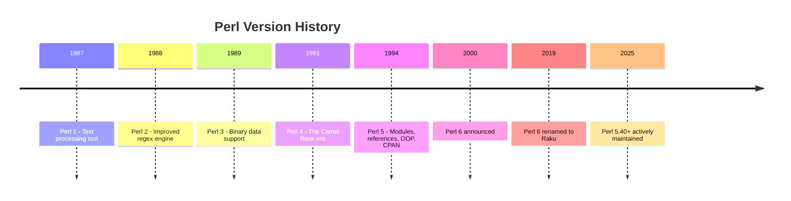
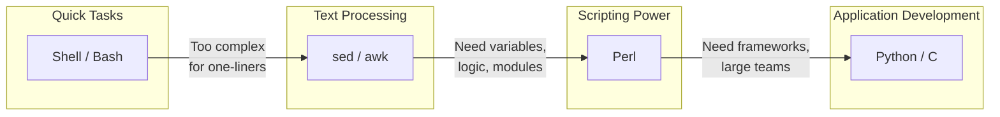

# Perl Developer Introduction

## Why Perl, and Why Unix First

**Version:** 1.5\\\
**Year:** 2025

---

## Copyright Notice

Copyright (c) 2025-2026 Ryan Thomas Robson / Robworks Software LLC. Licensed under [CC BY-NC-ND 4.0](../../LICENSE-CONTENT). You may share this material for non-commercial purposes with attribution, but you may not distribute modified versions.

---

## The Perl Story

[**Perl**](https://www.perl.org/) was created by **Larry Wall** in 1987. Wall was a linguist and Unix system administrator at Unisys who needed a tool that could handle report generation from scattered files across a network. The existing tools - `sed`, `awk`, and shell scripts - couldn't handle the job cleanly, so he built something new.

{ width="300" align="right" }

Wall's background in linguistics shaped Perl's design philosophy. He borrowed the idea that there should be **more than one way to do it** (TMTOWTDI, pronounced "Tim Toady") - just as natural languages offer multiple ways to express the same thought. Perl's syntax draws from C, `sed`, `awk`, and shell scripting, making it feel familiar to Unix practitioners from day one.

### Version History

**Perl 1** (1987) was a text-processing language that replaced Wall's earlier `awk` scripts. **Perl 2** (1988) added a better regex engine. **Perl 3** (1989) added binary data support. **Perl 4** (1991) became the "Camel Book" edition - the version most 1990s sysadmins learned.

**Perl 5** (1994) was a complete rewrite that introduced everything modern Perl developers rely on: lexical scoping with `my`, references for complex data structures, modules, objects (via `bless`), and the [**CPAN**](https://www.cpan.org/) ecosystem. Perl 5 remains the production version of Perl, actively maintained and released regularly.

**Perl 6** was announced in 2000 as an ambitious redesign. After nearly two decades of development, it was renamed to [**Raku**](https://raku.org/) in 2019 to clarify that it is a separate language, not a replacement for Perl 5. The two languages share philosophy but have distinct syntax and runtimes.



!!! tip
    When people say "Perl" today, they mean Perl 5. Raku is its own language with its own community. This course teaches Perl 5.

---

## The Unix Foundation

Before writing a single line of Perl, you need to understand the operating system it was born on. Perl was created by Larry Wall in 1987 as a practical tool for Unix system administration - a "Swiss Army chainsaw" for processing text, managing files, and gluing programs together. Its design reflects Unix philosophy at every level.

### Processes and File Descriptors

Every running program on a Unix system is a **process**. The kernel assigns each process a unique **PID** (process ID) and manages its access to system resources. One of the most fundamental resources is the **file descriptor** - a per-process integer handle that refers to an open file, socket, pipe, or device.

When a process opens a file, the kernel assigns the lowest available integer as its file descriptor. Each process maintains its own file descriptor table, so descriptor 5 in one process is completely independent from descriptor 5 in another.

Three file descriptors are opened automatically when any process starts:

| FD | Name | Purpose | Default |
|----|------|---------|---------|
| 0 | **stdin** | Standard input | Terminal keyboard |
| 1 | **stdout** | Standard output | Terminal screen |
| 2 | **stderr** | Standard error | Terminal screen |

This separation is deliberate. By keeping stdout and stderr as distinct streams, Unix lets you redirect them independently:

```bash
# stdout goes to file, stderr still prints to terminal
./my_script.pl > output.txt

# stderr goes to file, stdout still prints to terminal
./my_script.pl 2> errors.log

# both go to separate files
./my_script.pl > output.txt 2> errors.log
```

You can inspect a running process's open file descriptors through the `/proc` filesystem on Linux:

```bash
ls -la /proc/PID/fd
# 0 -> /dev/pts/0  (stdin - the terminal)
# 1 -> /dev/pts/0  (stdout - the terminal)
# 2 -> /dev/pts/0  (stderr - the terminal)
# 3 -> /path/to/some/open/file
```

This matters for Perl because Perl gives you direct control over file descriptors through `open`, `close`, `dup2`, and the `<>` operator. Understanding what the kernel does underneath makes Perl's I/O model intuitive rather than magical.

```quiz
question: "In Unix, what is the relationship between a process and a file descriptor?"
type: multiple-choice
options:
  - text: "File descriptors are unique IDs assigned to processes by the kernel"
    feedback: "Process IDs (PIDs) identify processes. File descriptors are per-process handles for open files, sockets, and pipes."
  - text: "A file descriptor is a per-process integer handle that refers to an open file, socket, or pipe"
    correct: true
    feedback: "Correct! Each process has its own file descriptor table. FD 0 is stdin, 1 is stdout, 2 is stderr. When a process opens a file, the kernel assigns the lowest available integer as the file descriptor. These are local to each process."
  - text: "File descriptors replace filenames in modern Unix systems"
    feedback: "Filenames and file descriptors serve different purposes. Filenames locate files in the filesystem; file descriptors are runtime handles to open file objects within a process."
  - text: "Each file on disk has exactly one file descriptor"
    feedback: "Multiple processes (or the same process) can open the same file, each getting their own file descriptor. A single file can have many file descriptors pointing to it simultaneously."
```

```quiz
question: "What are the standard file descriptors 0, 1, and 2?"
type: multiple-choice
options:
  - text: "Input file, output file, error log"
    feedback: "Close, but the correct terms are stdin, stdout, and stderr. They're not necessarily files - they can be terminals, pipes, or sockets."
  - text: "stdin (standard input), stdout (standard output), stderr (standard error)"
    correct: true
    feedback: "Correct! Every Unix process starts with these three file descriptors open. stdin (0) reads input, stdout (1) writes normal output, stderr (2) writes error messages. Keeping stdout and stderr separate lets you redirect them independently."
  - text: "Read, write, and execute permissions"
    feedback: "Those are file permission bits, not file descriptors. The standard file descriptors are stdin (0), stdout (1), and stderr (2)."
  - text: "Root, user, and group access levels"
    feedback: "Those relate to file ownership. The standard file descriptors 0, 1, 2 are stdin, stdout, and stderr respectively."
```

### Signals and Process Control

Processes communicate with each other through **signals** - asynchronous notifications sent by the kernel or other processes. The most common:

| Signal | Number | Default Action | Typical Use |
|--------|--------|---------------|-------------|
| `SIGTERM` | 15 | Terminate | Polite shutdown request |
| `SIGKILL` | 9 | Terminate (cannot be caught) | Force kill |
| `SIGINT` | 2 | Terminate | Ctrl+C from terminal |
| `SIGHUP` | 1 | Terminate | Terminal closed / config reload |
| `SIGSTOP` | 19 | Stop (cannot be caught) | Freeze process |
| `SIGCONT` | 18 | Continue | Resume stopped process |

Perl exposes signal handling through the `%SIG` hash, letting you write custom handlers:

```perl
$SIG{INT} = sub { print "Caught Ctrl+C, cleaning up...\n"; exit 0; };
$SIG{TERM} = sub { cleanup(); exit 0; };
```

Understanding signals is critical for writing Perl daemons, long-running scripts, and anything that manages child processes.

```exercise
title: Explore Unix Processes and Signals
difficulty: beginner
scenario: |
  Practice working with Unix processes, signals, and file descriptors to build
  your foundational understanding. Complete these tasks on a Linux system:

  1. Start a background process (e.g., `sleep 300 &`)
  2. Find its PID
  3. List its open file descriptors
  4. Send it a signal to terminate it
  5. Verify it's gone
hints:
  - "Start a background process with: sleep 300 &"
  - "The shell prints the PID when you background a process, or use: echo $!"
  - "List open file descriptors with: ls -la /proc/$PID/fd (Linux only)"
  - "Send SIGTERM with: kill PID"
solution: |
  ```bash
  # Start a background process
  sleep 300 &
  pid=$!
  echo "Started process with PID: $pid"

  # List its file descriptors (Linux)
  ls -la /proc/$pid/fd
  # You'll see: 0 -> /dev/pts/0 (stdin)
  #             1 -> /dev/pts/0 (stdout)
  #             2 -> /dev/pts/0 (stderr)

  # Send SIGTERM
  kill $pid

  # Verify it's gone
  ps -p $pid
  # Should show no process
  ```

  The `/proc/PID/fd` directory shows all open file descriptors for a process.
  Each is a symlink to the actual file, socket, or pipe the descriptor refers to.
  This is invaluable for debugging what files a process has open.

  On macOS, use `lsof -p $pid` instead of the `/proc` filesystem.
```

---

## Why Perl for System Administration

Perl became the dominant sysadmin language in the 1990s and early 2000s for concrete reasons that still hold:

- **First-class regular expressions**: Pattern matching is built into the language syntax (`=~`, `s///`, `m//`), not bolted on as a library. Perl's regex engine remains one of the most powerful available.
- **Text processing by default**: The `<>` diamond operator, `chomp`, `split`, `join`, and autosplit mode (`-a`) make processing structured text (logs, configs, CSVs) trivial.
- **Unix system calls built in**: `fork`, `exec`, `pipe`, `open`, `kill`, `wait`, `stat`, `chmod` - Perl wraps nearly every POSIX system call, giving you C-level control with scripting-level convenience.
- **Glue language**: Perl sits naturally between shell scripts (too limited for complex logic) and C (too verbose for quick tasks). Backticks, `system()`, and `open(my $fh, "-|", ...)` make calling external programs and capturing their output straightforward.
- **CPAN**: The Comprehensive Perl Archive Network has over 200,000 modules. Need to parse JSON, connect to a database, send email, or manage an LDAP directory? Someone already wrote and tested it.

```perl
# Classic Perl one-liner: find lines matching a pattern in a log file
perl -ne 'print if /ERROR.*timeout/' /var/log/syslog

# In-place edit: replace all occurrences across files
perl -pi -e 's/old_server/new_server/g' /etc/myapp/*.conf

# Parse Apache logs: count requests per IP
perl -lane '$count{$F[0]}++; END { print "$count{$_} $_" for sort keys %count }' access.log
```

These one-liners show Perl's sweet spot: tasks too complex for `sed` and `awk`, but not worth writing a full program for. The `-n`, `-p`, `-l`, `-a`, and `-e` flags turn Perl into a turbocharged command-line text processor.

```quiz
question: "What makes Perl particularly well-suited for system administration tasks?"
type: multiple-choice
options:
  - text: "Perl is the fastest programming language available"
    feedback: "While Perl is reasonably fast, raw speed isn't its main advantage. Languages like C and Rust are faster for computation."
  - text: "Built-in regex, text processing, and system call support with Unix philosophy integration"
    correct: true
    feedback: "Correct! Perl was designed for text processing and system administration. First-class regex support, easy file handling, built-in system calls, and the ability to act as a 'glue language' between Unix tools made it the dominant sysadmin language before Python took that role."
  - text: "Perl comes pre-installed on Windows servers"
    feedback: "Perl is standard on Unix/Linux systems, not Windows. Its strength is deep Unix integration, not cross-platform availability."
  - text: "Perl's syntax is simpler than Python or Ruby"
    feedback: "Perl's syntax is famously flexible (and sometimes cryptic). Its strength for sysadmin work is powerful built-in features for text and system operations, not syntactic simplicity."
```

---

## Perl in the Unix Tool Ecosystem

Perl occupies a specific niche between shell scripts and compiled languages. Understanding where it fits helps you choose the right tool for each job.



Shell scripts are perfect for gluing commands together. `sed` and `awk` handle line-by-line text transformation. Perl bridges the gap when you need real data structures, error handling, regular expressions that span multiple lines, or access to thousands of CPAN modules - but don't need the overhead of a compiled language or a full application framework.

In practice, Perl one-liners replace `sed` and `awk` commands that have grown too complex, and Perl scripts replace shell scripts that have grown too long. This positioning is why Perl was called "the duct tape of the Internet" during the 1990s web boom.

---

## Your First Perl Commands

Before writing full scripts, try Perl directly from the command line. The `-e` flag lets you run Perl code without creating a file.

```terminal
title: First Perl Commands
steps:
  - command: "perl -v | head -2"
    output: "This is perl 5, version 38, subversion 2 (v5.38.2) built for x86_64-linux-gnu-thread-multi"
    narration: "perl -v shows your installed version. Perl comes pre-installed on most Unix and Linux systems. Any version 5.16 or later works for this course."
  - command: "perl -e 'print \"Hello, World!\\n\";'"
    output: "Hello, World!"
    narration: "The -e flag runs code from the command line. print sends text to stdout. The \\n is a newline. Every statement ends with a semicolon."
  - command: "perl -e 'my $name = \"Perl\"; print \"Hello, $name!\\n\";'"
    output: "Hello, Perl!"
    narration: "Variables start with $ for scalars. The my keyword declares a new variable. Double quotes interpolate variables - $name becomes its value."
  - command: "perl -ne 'print if /error/i' /var/log/syslog"
    output: "Jan 15 03:22:14 server kernel: [error] disk read failure\nJan 15 09:41:03 server app[1234]: Connection error: timeout"
    narration: "A practical one-liner: -n reads input line by line, print if /error/i prints lines matching the regex (case-insensitive). This replaces grep for complex patterns."
```

---

## Anatomy of a Perl Script

Every well-written Perl script follows a consistent structure. Here is the skeleton you should start every script with.

```code-walkthrough
language: perl
title: Anatomy of a Perl Script
code: |
  #!/usr/bin/env perl
  use strict;
  use warnings;

  my $greeting = "Hello";
  my $target   = "World";

  print "$greeting, $target!\n";
annotations:
  - line: 1
    text: "The shebang line tells the OS to run this file with perl. Using /usr/bin/env perl finds perl in your PATH, which is more portable than hardcoding /usr/bin/perl."
  - line: 2
    text: "use strict forces you to declare all variables with my. Without it, a typo like $greting silently creates a new global variable instead of raising an error."
  - line: 3
    text: "use warnings alerts you to common mistakes: using uninitialized variables, writing to a read-only filehandle, or using a string where a number was expected."
  - line: 5
    text: "my declares a lexical (local) variable. The $ sigil marks it as a scalar - a single value. Perl has three main sigils: $ (scalar), @ (array), % (hash)."
  - line: 6
    text: "Aligning the = signs is a common Perl style convention. It makes assignments easier to scan when you have several in a row."
  - line: 8
    text: "print sends output to stdout. In double quotes, $greeting and $target are replaced with their values. The \\n adds a newline at the end."
```

!!! danger
    Never skip `use strict` and `use warnings`. These two lines catch more bugs than any other practice in Perl. Experienced developers consider code without them to be broken by default.

---

## Next Steps

This introduction covers the Unix concepts that make Perl's design logical and the history behind the language. You're ready to start writing real Perl code - continue to [Scalars, Strings, and Numbers](scalars-strings-numbers.md) for your first deep look at Perl's data types.

---

## Further Reading

- [Perl Official Documentation](https://perldoc.perl.org/) - comprehensive Perl language reference
- [CPAN](https://www.cpan.org/) - Comprehensive Perl Archive Network
- [Perl.org](https://www.perl.org/) - official Perl community site
- [The Unix Programming Environment](https://en.wikipedia.org/wiki/The_Unix_Programming_Environment) - Kernighan and Pike's classic on Unix philosophy
- [Learning Perl](https://www.oreilly.com/library/view/learning-perl-8th/9781492094944/) - the "Llama Book," the standard introduction to Perl
- [The Perl Programming Language](https://en.wikipedia.org/wiki/Perl_(programming_language)) - Wikipedia overview of Perl's history and design
- [Raku](https://raku.org/) - the language formerly known as Perl 6

---

**Next:** [Scalars, Strings, and Numbers](scalars-strings-numbers.md) | [Back to Index](README.md)
