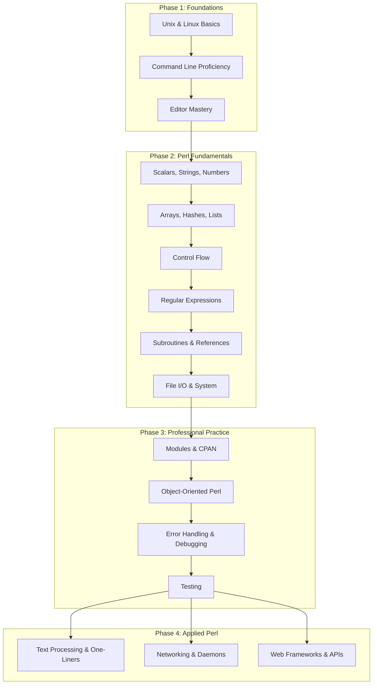
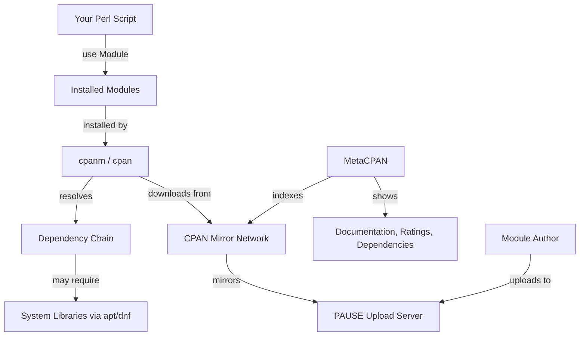

# Perl Developer Career Roadmap

## The Road to Perl Developer Mastery

**Version:** 1.6
**Year:** 2026

---

## Copyright Notice

Copyright (c) 2025-2026 Ryan Thomas Robson / Robworks Software LLC. Licensed under [CC BY-NC-ND 4.0](../../LICENSE-CONTENT). You may share this material for non-commercial purposes with attribution, but you may not distribute modified versions.

---

# Table of Contents

1. [Introduction & Expectations](#introduction-expectations)
2. [Phase 1: The Basics](#phase-1-the-basics)
3. [Phase 2: Beginning Perl](#phase-2-beginning-perl)
4. [Phase 3: Workflows, Testing & Debugging](#phase-3-workflows-testing-debugging)
5. [Bibliography](#bibliography)

---

## Introduction & Expectations

### In it for the Long Haul

Feynman's "computer disease" metaphor illustrates the irresistible drive some people have to solve problems. It's a certain itch—one that refuses to be ignored—and if you've ever felt compelled to keep tinkering until something finally clicks, you may already be halfway down this road. This document exists for people like you.

The journey to mastering Perl isn't just about syntax and tools—it's about cultivating a mindset of curiosity, experimentation, and resilience. Whether you're brand new to programming or transitioning from another language, this roadmap is designed to guide you not just through the how, but the why behind the skills, practices, and philosophies that define great Perl developers.

If that resonates, you might be the right kind of person to become a Perl developer.

### What to Expect

- **Work**: Dedication and completion of assignments, exercises, and experiments.
- **Read**: Books provide structured learning not found in blogs or forums.
- **Communicate**: Engage with community projects and discussions.

### What Not to Expect

- **A Guarantee**: Success is up to your effort and the industry.
- **A Complete Solution**: This is a guide, not a one-stop-shop.
- **A Certification**: Prove your skills through demonstration, not a certificate.

---

## Phase 1: The Basics

### Required Learning

#### Operating Systems

**Why Unix Matters for Perl**

A strong understanding of Unix concepts is essential for mastering Perl. Here's why:

- **Shared Philosophy**: Perl was designed with Unix in mind—embracing small, composable utilities; pipelines; and powerful text processing. These principles align closely with the way Unix works.
- **Direct Mappings**: Key system-level features in Unix—such as file descriptors, piping, and process control—are directly accessible and controllable via Perl.
- **Practical Impact**: Knowing how Unix handles processes, permissions, input/output streams, and the file system empowers you to write code that is not only functional, but idiomatic, efficient, and maintainable.

Mastering these concepts isn't just helpful—it's fundamental to becoming an effective Perl developer in any Unix-like environment.

```quiz
question: "Why does this roadmap start with Unix fundamentals before any Perl syntax?"
type: multiple-choice
options:
  - text: "Perl can only run on Unix systems"
    feedback: "Perl runs on many platforms including Windows. The Unix-first approach is about building the mental model Perl was designed around."
  - text: "Understanding Unix concepts (processes, files, pipes) is essential because Perl was built to automate Unix tasks"
    correct: true
    feedback: "Correct! Perl's design is deeply rooted in Unix philosophy. File descriptors, regular expressions, process control, and pipe-based data flow are all Unix concepts that Perl wraps with powerful syntax. Without this foundation, Perl's features seem arbitrary rather than logical."
  - text: "Unix is easier to learn than Perl"
    feedback: "Difficulty isn't the reason. The roadmap starts with Unix because Perl's features make much more sense when you understand the Unix concepts they're built upon."
  - text: "You need to compile Perl from source, which requires Unix knowledge"
    feedback: "Perl comes pre-installed on most Unix systems and has binary packages for all platforms. The Unix-first approach is about conceptual foundation, not installation."
```

#### Linux Concepts

**Understand the Linux Stack**

Linux is not a complete operating system by itself—it's just the **kernel**, the core part responsible for hardware interaction, memory management, scheduling, and system calls. Everything that sits above the kernel and interacts with users is known as **userland** or **user space**.

- The **Linux kernel** handles low-level tasks such as managing CPU, RAM, I/O devices, and filesystems.
- **Userland tools**, typically provided by the GNU project, include utilities like `ls`, `cp`, `grep`, `bash`, and more. These tools allow users to interact with the system via the command line or scripts.

Understanding the boundary and cooperation between kernel and userland tools is vital for troubleshooting, scripting, and writing system-aware applications in Perl.

#### Examples of Linux Distributions

- **[Ubuntu](https://ubuntu.com)**: A user-friendly, widely adopted Linux distribution. LTS (Long-Term Support) versions offer 5 years of guaranteed security and maintenance updates, making them ideal for both beginners and enterprise environments.
- **[Rocky Linux](https://rockylinux.org)**: A community enterprise OS designed to be a drop-in replacement for CentOS, maintaining bug-for-bug compatibility with RHEL.
- **[AlmaLinux](https://almalinux.org)**: Another CentOS alternative, AlmaLinux is governed by a community foundation and backed by major cloud vendors.
- **[Debian](https://www.debian.org)**: Known for its stability and commitment to free software, Debian serves as the foundation for many other distributions, including Ubuntu.
- **[Fedora](https://getfedora.org)**: Sponsored by Red Hat, Fedora is a cutting-edge distribution that features the latest in open-source software and innovations.
- **[openSUSE](https://www.opensuse.org)**: Offers two main editions—Leap (stable) and Tumbleweed (rolling release). It includes YaST, a powerful configuration tool.
- **[Arch Linux](https://archlinux.org)**: A minimalist, rolling-release distro aimed at advanced users who prefer full control and manual configuration. Its Arch Wiki is considered one of the most comprehensive Linux documentation sources available.

#### Creating a Linux/Unix Learning Lab

To build hands-on experience with Linux systems, set up a virtual lab environment. You can use a variety of local virtualization tools or cloud hosting services depending on your goals and available resources:

Below are some modern tools to help manage and create these environments:

- [VirtualBox](https://www.virtualbox.org): Open-source virtualization software that runs on Windows, macOS, Linux, and Solaris, popular for setting up quick dev environments.
- [VMware Workstation Player](https://www.vmware.com/products/workstation-player.html): A robust and professional-grade virtualization platform for running multiple operating systems on a single machine.
- [Vagrant](https://www.vagrantup.com): A powerful tool for managing virtual machine workflows, especially in development environments, built on top of tools like VirtualBox and VMware.
- [Multipass](https://multipass.run): Lightweight VM manager developed by Canonical (Ubuntu creators), great for quickly launching Ubuntu instances.
- [Docker Desktop](https://www.docker.com/products/docker-desktop): Ideal for containerized environments and lightweight application virtualization.
- [Proxmox VE](https://www.proxmox.com/en/proxmox-ve): A powerful open-source virtualization platform for both KVM virtual machines and LXC containers, great for lab environments.
- [QEMU/KVM](https://www.qemu.org): A low-level virtualization tool offering excellent performance, commonly used in professional Linux environments.

#### Command Line Proficiency

**Essential Online Resources for Command Line Mastery**

Here are some curated resources to help build your command-line proficiency, whether you're learning shell scripting, troubleshooting complex commands, or developing efficient workflows:

- [Explainshell](https://explainshell.com): Breaks down complex shell commands into human-readable components, great for learning command syntax.
- [Commandlinefu](https://www.commandlinefu.com): A community-driven repository of useful one-liners, tricks, and command explanations.
- [Learn Shell](https://www.learnshell.org): An interactive tutorial platform for beginners looking to master the basics of shell scripting.
- [ShellCheck](https://www.shellcheck.net): A popular online shell script analyzer that highlights syntax issues and offers improvement suggestions.
- [Cheat.sh](https://cheat.sh): Access community-maintained command-line cheat sheets from your terminal or browser.

#### Recommended Books

- *[The Linux Command Line, 2nd Edition](https://nostarch.com/tlcl2)* by William Shotts – A comprehensive and beginner-friendly guide to mastering the Linux terminal.
- *[How Linux Works, 3rd Edition](https://nostarch.com/howlinuxworks3)* by Brian Ward – Understand what's happening under the hood of a Linux system, from processes and permissions to networking and filesystems.
- *[Linux Pocket Guide](https://www.oreilly.com/library/view/linux-pocket-guide/9781491927571/)* by Daniel J. Barrett – A concise and portable reference, ideal for quick lookups and essential commands.
- *[Learning the Bash Shell, 3rd Edition](https://www.oreilly.com/library/view/learning-the-bash/0596009658/)* by Cameron Newham – A solid introduction to bash scripting and command-line navigation.
- *[UNIX and Linux System Administration Handbook, 5th Edition](https://www.pearson.com/en-us/subject-catalog/p/unix-and-linux-system-administration-handbook/P200000003496)* by Evi Nemeth et al. – A must-have for anyone managing or working with Linux systems at scale.

### Finding the Right \$EDITOR

#### Vim

**Vim** is the preferred editor for most Unix environments, celebrated for its:

- **Ubiquity**: Available on nearly every Unix-like system by default.
- **Efficiency**: Enables fast navigation and editing with minimal hand movement.
- **Modal Editing**: Operates in distinct modes (e.g., *insert*, *normal*, *visual*) for precise, powerful actions without leaving the keyboard.

While Vim's learning curve is steep, it pays off. Once mastered, Vim becomes a tool that dramatically boosts speed, productivity, and editing comfort—especially for developers who live in the terminal.

To help with the learning process, here are some engaging and helpful resources:

- [Vim Adventures](https://vim-adventures.com) – a game-based way to learn Vim
- [Vimcasts](http://vimcasts.org) – screencasts teaching practical Vim usage
- [Vimbook on GitHub](https://github.com)

Practice regularly, and you'll soon find Vim indispensable.

#### Emacs

**Emacs** is a feature-rich, highly customizable text editor with a deep history in the developer community. While it is less commonly used than Vim in Unix environments, it excels in its extensibility through Emacs Lisp, allowing users to transform it into an IDE, email client, calendar, and more. Once mastered, Emacs offers powerful workflows for programming, writing, and system administration. Notable learning resources include:

- [Absolute Beginner's Guide to Emacs](https://jesshamrick.com/2012/09/10/absolute-beginners-guide-to-emacs/)
- [Emacs Rocks!](https://emacsrocks.com)
- [Mastering Emacs](https://www.masteringemacs.org)

### Additional Learning

**Process/Memory Management**

A foundational understanding of how Unix-like systems handle processes and memory is crucial for writing efficient and reliable applications. This includes learning how the system schedules processes, handles signals, manages memory allocation, and balances system resources under load. For Perl developers especially, this knowledge helps when writing scripts that interact with the OS, spawn child processes, or manage large data sets.

Key topics to explore:

- **Process lifecycle**: from creation (`fork`) to execution (`exec`) and termination (`wait`, `kill`).
- **Scheduling and prioritization**: concepts such as nice values, real-time scheduling, and load balancing.
- **Memory hierarchy**: virtual memory, paging, segmentation, and memory-mapped files.
- **System monitoring**: tools like `ps`, `top`, `htop`, `vmstat`, and `/proc` interfaces.
- **Swap, cache, and buffers**: how the kernel manages memory pressure.

This foundational layer empowers developers to write more performant code, optimize resource usage, and debug complex runtime behavior.

**File Systems and Links**

One of the core strengths of Unix-like systems lies in their powerful and flexible file system structure. Understanding how files and directories are organized, accessed, and linked is essential for anyone writing or maintaining system-level applications, particularly in Perl where working with files is a frequent task.

Key areas to explore:

- **Filesystem Hierarchy**: Learn the purpose of each top-level directory in a Unix system (e.g., `/bin`, `/etc`, `/home`, `/var`).
- **Permissions and Ownership**: Understand how Unix enforces security through file permissions (`rwx`) and ownership by users and groups.
- **Hard vs Soft Links**:
  - *Hard links* reference the same inode as the original file, making them indistinguishable from the original.
  - *Soft (symbolic) links* are pointers to file paths, allowing more flexibility but with limitations (e.g., they break if the target is deleted).
- **Mount Points and Devices**: Discover how different filesystems and storage devices are mounted into a unified tree structure.
- **Extended Attributes and ACLs**: For advanced permission scenarios, explore access control lists and file attributes beyond the standard `rwx` model.

Being fluent in these topics enables more effective scripting, safer automation, and a deeper understanding of how Unix-based systems operate.

**User Interaction**

Understanding how users interact with Unix systems is crucial for developing intuitive tools and scripts. Interaction typically occurs through the shell—whether graphical or command-line—and involves interpreting environment variables, configuring startup files (like `.bashrc` or `.profile`), and handling user input in real-time. For Perl developers, this means writing programs that gracefully accept arguments, produce meaningful output, and respect user environments.

Key areas include:

- Customizing user shells and dotfiles
- Managing terminal I/O (STDIN/STDOUT/STDERR)
- Building interactive CLI tools with argument parsing

**Unix History**

To fully appreciate modern computing, it's important to understand where it came from. Unix, developed in the 1970s at Bell Labs, laid the foundation for nearly every major operating system in use today, including Linux and macOS. Its influence extends to software design principles, scripting languages like Perl, and the very philosophy of modular, interoperable tools.

Recommended reading:

- [The History of Unix](https://en.wikipedia.org/wiki/History_of_Unix)
- *[A Quarter Century of Unix](https://www.oreilly.com/library/view/a-quarter-century/9780133988906/)* by Peter H. Salus
- [The Unix Philosophy](http://catb.org/~esr/writings/taoup/html/) by Eric S. Raymond

```exercise
title: Build Your Phase 1 Learning Plan
difficulty: beginner
scenario: |
  You're starting the Perl developer roadmap. Create a structured learning plan
  for Phase 1 (Unix Foundations) that covers:

  1. Which Unix concepts to learn first and why
  2. Hands-on exercises for each concept
  3. How to verify your understanding before moving to Phase 2
  4. Resources you'll use (man pages, books, online tutorials)

  Prioritize the concepts most relevant to Perl development.
hints:
  - "Start with: file system navigation, file permissions, and stdin/stdout/stderr"
  - "Then: pipes and filters (cat, grep, sed, awk) - these are the concepts Perl extends"
  - "Then: processes, signals, and job control"
  - "Verify by writing shell scripts that combine these concepts"
solution: |
  **Phase 1 Learning Plan:**

  **Week 1: Files and I/O**
  - File navigation (cd, ls, find, locate)
  - File permissions (chmod, chown, umask)
  - File descriptors (stdin=0, stdout=1, stderr=2)
  - Practice: Write a shell script that processes files with error handling

  **Week 2: Text Processing**
  - Pipes and filters (|, cat, grep, sort, uniq, wc)
  - Regular expressions with grep and sed
  - awk for column-based processing
  - Practice: Process a log file to extract statistics

  **Week 3: Processes and System**
  - Process lifecycle (fork, exec, wait)
  - Signals (SIGTERM, SIGKILL, SIGHUP)
  - Environment variables and the shell
  - Practice: Write a script that manages background processes

  **Verification:** Can you write a shell script that:
  - Reads input from a file or stdin
  - Processes text with regex
  - Handles errors (exit codes, stderr)
  - Manages processes (background, signals)

  If yes, you're ready for Phase 2 (Perl fundamentals).
```

---

## Phase 2: Beginning Perl

### Required Learning

#### LAMP Stack

**LAMP Stack and Core Web Services**

A strong Perl developer should have a working knowledge of the services that power modern web applications. While Perl's role has evolved—often found in automation, infrastructure tooling, or legacy applications—its integration with these services remains highly relevant. Mastery of web stack components ensures you're equipped to handle both greenfield and legacy projects with confidence.

Key technologies to understand:

- **[Nginx](https://nginx.org)**: A modern, high-performance web server and reverse proxy widely adopted in today's infrastructure, favored for its scalability, load balancing, and efficiency under high traffic.
- **[Apache](https://httpd.apache.org/)**: Still commonly used in shared hosting and legacy applications. Its extensive module ecosystem and compatibility with `.htaccess` make it a valuable technology to understand.
- **[LiteSpeed](https://www.litespeedtech.com/)**: A commercial alternative to Apache, often used in performance-focused hosting. Supports .htaccess and Apache configuration syntax.
- **[PHP](https://www.php.net/)**: Although not a Perl-centric language, understanding PHP remains important in environments where both are deployed side by side—especially in shared hosting and cPanel-based systems.
- **[MariaDB](https://mariadb.org/)** and **[PostgreSQL](https://www.postgresql.org/)**: The modern standards in relational databases. MariaDB is a MySQL-compatible drop-in replacement, while PostgreSQL is increasingly preferred for new applications due to its compliance and features.
- **[SQLite](https://www.sqlite.org/)**: A serverless, embedded database engine ideal for development, automation tools, and standalone utilities.
- **[Bind](https://www.isc.org/bind/)**: The classic authoritative DNS server, still widely used for managing zones and nameservers.
- **[PowerDNS](https://www.powerdns.com/)**: A dynamic DNS solution with API and database integration, popular in cloud-scale and provider environments.
- **[CoreDNS](https://coredns.io/)**: The default DNS service in Kubernetes and cloud-native environments, vital for understanding service discovery and internal networking in containerized applications.

Familiarity with these services will not only support your scripting and automation tasks but also help you thrive in today's hybrid infrastructure environments—from legacy systems to modern DevOps ecosystems.

### Perl Skills & Milestones

#### Learning the Ropes

**Perl Syntax, Data Types, and Program Structure**

**Perl Syntax, Data Types, and Program Structure**

Developing fluency in Perl starts with a clear understanding of its foundational elements:

- **Data Types**: Gain comfort with scalars (`$`), arrays (`@`), and hashes (`%`), and learn how their behavior changes based on context (scalar vs. list). Start with [Scalars, Strings, and Numbers](scalars-strings-numbers.md), then [Arrays, Hashes, and Lists](arrays-hashes-lists.md).
- **Control Flow**: Master core control structures like `if`, `unless`, `while`, `for`, and `foreach` to direct the logic of your programs. See [Control Flow](control-flow.md).
- **Built-in Functions**: Leverage Perl's rich library of built-in functions for data manipulation, text processing, and file I/O.
- **Code Style**: Perl's expressiveness allows multiple ways to solve problems, making it essential to develop good habits around clarity, consistency, and maintainability.

The goal is not just to write functional code, but to write code that is efficient, idiomatic, and easy to understand—hallmarks of an experienced Perl developer.

**References and Error Handling**

Perl's reference system is essential for working with complex data structures such as arrays of hashes, deeply nested configurations, or dynamically built data trees. You'll need to:

- Understand what a reference is and how to create one.
- Learn how to safely dereference scalars, arrays, and hashes.
- Use references effectively in subroutines to pass complex data structures by reference.
- Apply references when building object-oriented Perl code, where `$self` is typically a reference to a hash.

**Error Handling**

Handling errors gracefully is a hallmark of professional Perl development. While Perl allows for classic error trapping using `eval {}`, this method can lead to confusing behavior and poor readability. Instead, modern Perl favors modules like [`Try::Tiny`](https://metacpan.org/pod/Try::Tiny), which offer cleaner syntax and better scoping.

Key practices include:

- Differentiating between warnings (non-fatal) and errors (fatal).
- Using `warn` and `die` appropriately based on severity.
- Logging or reporting exceptions in ways that are actionable and user-friendly.

Together, references and robust error handling form a critical part of writing maintainable, reusable Perl code.

#### Becoming Adept

**Object-Oriented Perl**

Object-oriented programming (OOP) is a key capability of Perl and is frequently used in larger codebases or frameworks. Learning OOP in Perl involves understanding how packages work, how to bless references into objects, and how to define and use methods. While Perl doesn't enforce an OOP paradigm, it offers full support for it, giving developers the flexibility to design modular, reusable, and maintainable code.

Key resources:

- [Object-Oriented Perl by Damian Conway](https://www.manning.com/books/object-oriented-perl)
- [Modern Perl's Moose framework](https://metacpan.org/pod/Moose) – a postmodern object system for Perl 5.

**System Interaction (fork, exec, file I/O, permissions)**

One of Perl's strengths lies in its tight integration with the underlying operating system. Proficiency in system-level programming is crucial for writing scripts that automate administrative tasks or interact directly with system components.

Essential concepts include:

- `fork`, `exec`, and `wait` for process control.
- Working with filehandles for reading and writing files.
- Interacting with file metadata (permissions, ownership, timestamps) using `stat`, `chmod`, `chown`, and `utime`.
- Redirecting output and managing subprocesses securely.

Resources:

- [perldoc -f open](https://perldoc.perl.org/functions/open)
- [perlipc](https://perldoc.perl.org/perlipc.html) for interprocess communication and process management.

**Modulinos and Concurrency**

A *modulino* is a hybrid Perl script that behaves both as a standalone script and a reusable module. It enables better code reuse and testability. This pattern is common in professional Perl development where tooling needs to be scriptable yet unit-tested.

Concurrency in Perl is typically handled using `fork` for multiprocessing, or by leveraging event-based modules. While threads exist in Perl (`threads.pm`), they are often avoided due to complexity and performance concerns.

Tools and resources:

- [Writing Modulinos with ](https://www.perlmonks.org/?node_id=489861)[`caller`](https://www.perlmonks.org/?node_id=489861)
- [Parallel::ForkManager](https://metacpan.org/pod/Parallel::ForkManager) for simple parallel execution.
- [AnyEvent](https://metacpan.org/pod/AnyEvent) or [IO::Async](https://metacpan.org/pod/IO::Async) for asynchronous programming.

#### Joining the Community

**Engaging with the Perl Community**

Getting involved with the Perl community is not only encouraged—it's essential. Community interaction can accelerate your learning, expose you to real-world problem solving, and keep you current with modern Perl practices.

1. **[PerlMonks](https://www.perlmonks.org)**: A long-established and active community focused entirely on Perl. It remains relevant in 2025 as a place to get answers, learn idioms, and participate in thoughtful programming discussions. Users post questions, tutorials, and code snippets, and receive feedback from veteran developers.
2. **[Perl Mongers](https://www.pm.org/)**: A global network of local Perl user groups that still hold in-person and virtual meetups. While not as active as in past decades, many chapters remain valuable for community support and professional networking. Check the PM.org website or join forums like [https://perl.community](https://perl.community) for modern community hubs.

**Contributing to CPAN (inspired by the CPAN PRC)**: The original [CPAN Pull Request Challenge](https://www.cpanprc.org) ended in 2018, but its legacy lives on. Today, Perl developers are encouraged to contribute to CPAN via GitHub and MetaCPAN. Identify outdated or under-maintained modules, review open issues, and submit pull requests. Tools like [MetaCPAN](https://metacpan.org/) and GitHub's "good first issue" label make it easier than ever to find a way to contribute.

#### Diving Deep

**Contribute to CPAN Modules**

Contributing to CPAN remains one of the most impactful ways to support the Perl ecosystem in 2025. While the landscape has evolved, community-driven development and open collaboration are still central. CPAN continues to power countless applications and tools, and active maintenance is critical to its health.

Modern best practices include:

- Identifying under-maintained or outdated modules via [MetaCPAN](https://metacpan.org) and GitHub.
- Submitting improvements as pull requests: bug fixes, documentation enhancements, modernization (e.g., switching from `Test::Simple` to `Test2::Suite`, or refactoring legacy idioms).
- Respecting semantic versioning and authoring guidelines using tools like `Test::CheckManifest`, `Test::Pod`, and `Perl::Critic` before submission.

New contributors are encouraged to look for issues labeled **good first issue** or **help wanted**, and to follow module-specific contribution guidelines.

**Use Dist::Zilla**

[Dist::Zilla](https://metacpan.org/pod/Dist::Zilla) continues to be a de facto standard for managing modern Perl distributions. It abstracts away much of the manual toil of packaging, releasing, and maintaining modules, making it particularly useful for complex projects or teams that rely on automation.

Updated benefits as of 2025:

- Plugin ecosystem includes integrations for GitHub Actions, GitLab CI, and Docker tagging.
- Pre-release validation (e.g., changelog enforcement, dependency resolution) using community plugins.
- Seamless publishing to PAUSE and GitHub with `dzil release`, integrating test suites, version bumps, and tagging workflows.

For developers looking to streamline and standardize their release cycle while avoiding boilerplate, Dist::Zilla remains an invaluable tool—especially when paired with a modern CI/CD pipeline.

```quiz
question: "What is CPAN and why is it significant for Perl development?"
type: multiple-choice
options:
  - text: "CPAN is Perl's compiler that converts scripts to machine code"
    feedback: "Perl is interpreted, not compiled. CPAN is the Comprehensive Perl Archive Network - a repository of reusable modules."
  - text: "CPAN is a massive repository of reusable Perl modules that provides pre-built solutions for most common tasks"
    correct: true
    feedback: "Correct! CPAN (Comprehensive Perl Archive Network) has over 200,000 modules for everything from web development to bioinformatics. 'There's a module for that' is a Perl mantra. Learning to find and use CPAN modules effectively is as important as learning the language itself."
  - text: "CPAN is Perl's package manager similar to pip or npm"
    feedback: "Close - cpan/cpanm are the package managers that install from CPAN. CPAN itself is the archive/repository of modules (like PyPI is to pip, or npm registry is to npm). The distinction matters: CPAN is the ecosystem, cpanm is the tool."
  - text: "CPAN is only used for Perl's standard library"
    feedback: "The standard library ships with Perl. CPAN is a community-maintained repository of third-party modules - far larger than the standard library."
```

#### Staying Active

**Bug Reporting and Community Interaction**

Staying active in the Perl ecosystem means contributing beyond code. That includes reporting bugs, engaging in issue discussions, and collaborating respectfully with maintainers. Constructive bug reports often include reproduction steps, observed vs. expected behavior, environment details, and a proposed solution or patch. Engage through GitHub, MetaCPAN, or mailing lists like `perl5-porters` to help steer the future of modules you rely on.

- [MetaCPAN Issues](https://metacpan.org/issues)
- [Perl Porters Mailing List](https://lists.perl.org/list/perl5-porters.html)

**Understanding "perldelta"**

The `perldelta` document is released with each new version of Perl and outlines what's changed: new features, deprecations, security fixes, and known issues. It's essential reading for any developer working with modern Perl or maintaining code across versions. Familiarity with `perldelta` helps you adopt features early, avoid deprecated behaviors, and ensure compatibility.

Resources:

- [Latest perldelta on MetaCPAN](https://metacpan.org/pod/perldelta)
- [Perl's development GitHub repo](https://github.com/Perl/perl5) for upcoming changes

#### Ask Yourself

**How Does Perl Relate to Unix, Bash, PHP, etc.?**

Perl has deep historical and technical ties to Unix, Bash, and other scripting languages. Its design was heavily inspired by Unix philosophy: small, modular tools working together with powerful text processing and system integration capabilities.

- **Unix**: Perl was born in the Unix environment, and its syntax and idioms reflect Unix traditions—everything from regular expressions to filehandles and process management. Perl scripts are often used for Unix system administration, automation, and report generation.

- **Bash**: Bash and Perl frequently work together. Bash is great for quick shell automation, while Perl is better suited for complex logic, structured data handling, and modular design. Many developers use Bash to orchestrate and Perl to perform the heavy lifting.

- **PHP**: Perl and PHP have historically served similar roles in web development. While PHP dominates in modern web apps, Perl's use persists in legacy systems, backend automation, and templating. Interestingly, PHP was initially inspired by Perl and borrows from its syntax.

- **Python & Ruby** (modern context): While not listed originally, it's important to note that Perl now coexists with Python and Ruby in many development environments. All three are high-level, interpreted languages used for scripting and automation, with Perl maintaining a niche in text processing and legacy infrastructure.

Understanding these relationships can help you make strategic choices about when to use Perl versus other languages, and how to interface with tools written in them.

#### Important Perl Modules

Familiarity with modern, high-utility Perl modules is critical for writing robust, maintainable code. Below are essential categories and recommended modules to learn and use in your daily development workflow:

**Database Interaction**

- **[DBI](https://metacpan.org/pod/DBI)**: The standard database interface module for Perl, providing a consistent API across various database systems.
- **[DBD::SQLite](https://metacpan.org/pod/DBD::SQLite)**: Lightweight and serverless, ideal for local development or embedded use.
- Also consider: `DBD::Pg` for PostgreSQL and `DBD::mysql` for MariaDB/MySQL.

**Serialization and Configuration**

- **[Cpanel::JSON::XS](https://metacpan.org/pod/Cpanel::JSON::XS)** or **[JSON::MaybeXS](https://metacpan.org/pod/JSON::MaybeXS)**: Efficient, reliable JSON serialization/deserialization.
- **[YAML::XS](https://metacpan.org/pod/YAML::XS)**: Fast YAML support for reading configuration files.
- **[Config::INI](https://metacpan.org/pod/Config::INI)**: Simple parsing of INI-style config files.

**Testing Frameworks**

- **[Test::More](https://metacpan.org/pod/Test::More)**: A core testing module in Perl, forming the foundation of most test suites.
- **[Test::Spec](https://metacpan.org/pod/Test::Spec)**: Enables RSpec-style testing for behavior-driven development (BDD).
- Also explore: `Test2::Suite` for a modern replacement and extensible test ecosystem.

**Code Quality Tools**

- **[perltidy](https://metacpan.org/pod/perltidy)**: Formats Perl code according to customizable style rules.
- **[Perl::Critic](https://metacpan.org/pod/Perl::Critic)**: Analyzes Perl code for maintainability, enforcing best practices based on Damian Conway's *Perl Best Practices*.

Mastering these modules—and understanding when to apply each—will greatly improve your productivity, confidence, and code quality.

### Additional Learning

**Interprocess Communication (IPC) Concepts**

IPC allows different processes to communicate and synchronize their actions. This is particularly important when writing daemon services, managing background workers, or integrating different components of a system. In Perl, IPC can be achieved using built-in functions and specialized modules.

Key mechanisms include:

- **Pipes**: Used for communication between a parent and child process (`open`, `pipe`, `IPC::Open2`, `IPC::Open3`).
- **Sockets**: For networked or local IPC; useful in both client-server and peer-to-peer models (`IO::Socket::INET`, `IO::Socket::UNIX`).
- **Shared memory and semaphores**: Available via `IPC::SysV` or `IPC::Shareable` for more advanced use cases.

**Recommended Resources**:

- [perlipc documentation](https://perldoc.perl.org/perlipc.html)
- [IPC::Run](https://metacpan.org/pod/IPC::Run) – For launching and interacting with external processes

**Daemon Creation**

Writing a daemon involves creating a background service that runs independently of user input. Common uses include job schedulers, monitoring tools, and lightweight APIs. In Perl, daemonizing a script involves steps like forking, detaching from the terminal, setting new session IDs, and handling PID files.

Key considerations:

- Handling logging and signal management (`SIGHUP`, `SIGTERM`)
- Managing process IDs (PIDs) and preventing duplicate instances
- Monitoring via supervision tools like `systemd`, `supervisord`, or `daemontools`

**Recommended Modules**:

- [Proc::Daemon](https://metacpan.org/pod/Proc::Daemon)
- [Daemon::Control](https://metacpan.org/pod/Daemon::Control)

**OSI Model and Perl's Networking Capabilities**

The OSI (Open Systems Interconnection) model defines how communication is structured in networks. Understanding this model helps developers write more effective networking code, troubleshoot connectivity issues, and build systems that communicate reliably.

In Perl, you'll mostly operate at:

- **Layer 4 (Transport)**: Working with TCP/UDP sockets
- **Layer 7 (Application)**: Implementing or consuming protocols like HTTP, FTP, SMTP

Perl modules for networking include:

- [IO::Socket::INET](https://metacpan.org/pod/IO::Socket::INET): TCP/UDP communication
- [LWP::UserAgent](https://metacpan.org/pod/LWP::UserAgent): High-level HTTP client
- [HTTP::Tiny](https://metacpan.org/pod/HTTP::Tiny): Lightweight alternative to LWP
- [Net::Server](https://metacpan.org/pod/Net::Server): Building robust, extensible server applications

Mastering these areas will significantly enhance your ability to build distributed systems, background services, and web-enabled tools using Perl.

---

## Phase 3: Workflows, Testing & Debugging

### Required Learning

#### Testing

Effective testing is the backbone of sustainable Perl development. It ensures reliability, facilitates maintenance, and empowers developers to refactor confidently. While Perl has a long tradition of testing culture, the landscape in 2025 supports both time-tested modules and newer, more flexible frameworks.

**Core Practices**:

- **Unit Testing**: The most fundamental type of test, verifying the behavior of individual components in isolation. This is typically done using:
  - **[Test::More](https://metacpan.org/pod/Test::More)** – the de facto standard and part of the Perl core.
  - **[Test::Simple](https://metacpan.org/pod/Test::Simple)** – a minimalistic base layer.
  - **[Test2::Suite](https://metacpan.org/pod/Test2::Suite)** – a modern, extensible replacement that powers new testing ecosystems.

**Advanced Testing Techniques**:

- **Behavior-Driven Development (BDD)**: Write tests in a style that mirrors expected behavior.

  - **[Test::Spec](https://metacpan.org/pod/Test::Spec)** and **[Test::BDD::Cucumber](https://metacpan.org/pod/Test::BDD::Cucumber)** are popular options.

- **Mocking and Isolation**:

  - **[Test::MockModule](https://metacpan.org/pod/Test::MockModule)** or **[Test::MockObject](https://metacpan.org/pod/Test::MockObject)** can simulate dependencies.

- **Continuous Testing Integration**:

  - Pair with modern CI tools like GitHub Actions, GitLab CI, or CircleCI.
  - Automate coverage reporting with **[Devel::Cover](https://metacpan.org/pod/Devel::Cover)**.

**Best Practices**:

- Write tests before or alongside your code.
- Use descriptive test names and group related tests into subtests.
- Ensure your tests are repeatable and deterministic.

Testing isn't just about proving correctness—it's about building trust in your code, now and in the future.

```quiz
question: "Why does the roadmap emphasize testing (Phase 2) before advanced topics?"
type: multiple-choice
options:
  - text: "Testing is required by the Perl interpreter"
    feedback: "Perl doesn't require tests. The emphasis on early testing is about developing good habits and confidence in your code."
  - text: "Writing tests builds confidence to refactor and tackle complex problems"
    correct: true
    feedback: "Correct! Tests give you a safety net: you can change code and immediately know if you broke something. This is especially important before Phase 3 (complex modules, APIs, system integration) where bugs are harder to track down. The Perl community has a strong testing culture - most CPAN modules include comprehensive test suites."
  - text: "You can't publish to CPAN without 100% test coverage"
    feedback: "CPAN doesn't enforce coverage requirements, though well-tested modules are more trusted by the community. Early testing is about building good habits."
  - text: "Testing is the only way to learn Perl syntax"
    feedback: "You can learn syntax many ways. Testing is emphasized early because it builds a foundation of correctness that makes later phases safer and more productive."
```

#### ### Application Architecture

A modern Perl developer must understand not just the language, but how it integrates with full-stack application architecture. Perl is frequently used for building backend services, consuming APIs, and even serving as glue code between microservices or distributed systems.

**Services**: Services refer to standalone applications or daemons that perform a specific task—like authentication, data processing, or email delivery. These are often exposed over HTTP/HTTPS and must be built to handle concurrency, error resilience, and observability (e.g., logging and metrics).

**APIs**: APIs (Application Programming Interfaces) are the primary interface by which modern services communicate. Perl can both expose APIs (e.g., via frameworks like Mojolicious or Dancer2) and consume them (via LWP::UserAgent or HTTP::Tiny). Understanding RESTful principles and HTTP status codes is key.

**REST**: Representational State Transfer (REST) is the dominant architectural style for designing networked applications. REST relies on stateless communication, meaningful resource URLs, and standard HTTP methods (GET, POST, PUT, DELETE). Modern Perl APIs often follow REST patterns and return JSON responses.

**Recommended Tools & Frameworks**:

- [Mojolicious](https://mojolicious.org): A feature-rich web framework for building RESTful services and full-stack web apps.
- [Dancer2](https://metacpan.org/pod/Dancer2): A lightweight, extensible framework ideal for small- to medium-sized APIs.
- [Plack/PSGI](https://metacpan.org/pod/Plack): Middleware for Perl web applications; the foundation for most modern Perl web frameworks.

Mastering application architecture ensures that your Perl projects scale well, integrate cleanly with other systems, and follow contemporary software development practices.

#### Practicing Workflows

**Contributing to CPAN (Inspired by the CPAN PRC)**

While the original [CPAN Pull Request Challenge (CPAN PRC)](https://www.cpanprc.org) ended in 2018, the concept of monthly contributions to open source Perl modules lives on in spirit. Practicing workflows through regular contribution helps developers gain experience with collaborative development, version control, and best practices in CPAN module structure and testing.

To emulate this experience today:

- Browse [MetaCPAN](https://metacpan.org) or GitHub for active modules that need contributions.
- Filter issues labeled **good first issue**, **help wanted**, or tagged with **hacktoberfest**, which signal beginner-friendly opportunities.
- Use GitHub's fork-and-branch model to propose code changes. Ensure your changes are well-documented and include tests where appropriate.
- Participate in community discussions by commenting on issues, responding to feedback, and reviewing others' pull requests.
- Integrate with continuous integration tools like GitHub Actions or Travis CI to automatically run your test suite and lint your code before submission.
- Familiarize yourself with the [CPAN Pull Request Guide](https://github.com/CPAN-PRC/resources) for additional resources and etiquette.

This modernized process helps you build fluency in CPAN tooling, Git workflows, CI/CD integration, and collaborative open-source development—all essential skills for contributing to the contemporary Perl ecosystem.

**GitHub Collaboration**

GitHub remains the dominant platform for hosting and contributing to Perl projects in 2025. Mastering GitHub collaboration is essential for professional Perl development. Key practices include:

- Forking repositories and creating feature branches.
- Writing meaningful commit messages and pull request descriptions.
- Participating in code reviews and addressing feedback.
- Using CI integrations (GitHub Actions, Travis CI) to validate code.
- Keeping up with upstream changes through rebase/merge workflows.

GitHub collaboration not only builds your technical skills—it builds your reputation. Active contributors are more likely to be recognized and recruited for freelance, contract, and full-time roles.

#### Using Version Control

Version control is an essential part of modern software development, enabling teams and individuals to track changes, collaborate asynchronously, and ensure project stability. For Perl developers, mastering Git is foundational.

**Core Practices**:

- **Git**: Learn essential Git commands such as `clone`, `commit`, `push`, `pull`, `merge`, `rebase`, and `stash`. Understand branching models like Git Flow or trunk-based development.
- **Commit Discipline**: Write clear, concise, and purposeful commit messages. Use atomic commits to keep history readable and revert-friendly.

**Modern Learning Resources**:

- **[GitHub Learning Lab](https://lab.github.com/)** – Offers interactive tutorials on real GitHub repositories.
- **[Pro Git Book](https://git-scm.com/book/en/v2)** – A comprehensive and freely available guide for all levels.
- **[Git Handbook](https://guides.github.com/introduction/git-handbook/)** – A high-level overview of Git and GitHub best practices.

**Tooling & Extensions**:

- Use GitHub CLI for scriptable GitHub workflows.
- Explore visual Git clients like Sourcetree or GitKraken if you prefer a GUI.
- Integrate version control with CI/CD systems to trigger builds, tests, and deployments automatically on code changes.

Staying fluent in Git and GitHub workflows will make you a stronger collaborator, contributor, and maintainer—skills that transcend Perl and apply across nearly every software development ecosystem.

### Debugging Methods

Effective debugging is a skill that separates productive developers from frustrated ones. Perl provides multiple layers of debugging tools, from compile-time checks to interactive debuggers.

**Prevention first**: `use strict` and `use warnings` catch the majority of bugs before your code even runs. Undeclared variables, misused data types, and common mistakes are flagged immediately. See the [Introduction](perl_dev0_introduction.md) for why these two lines are non-negotiable.

**Print debugging**: The simplest approach - add `print` or `warn` statements to trace variable values and execution flow. `warn` writes to STDERR (so it doesn't corrupt program output) and includes the file and line number. `Data::Dumper` displays complex data structures in a readable format:

```perl
use Data::Dumper;
warn Dumper(\%config);  # Prints the entire hash structure to STDERR
```

**The Perl debugger**: Run any script with `perl -d script.pl` to start the interactive debugger. You can set breakpoints (`b`), step through code (`n` for next, `s` for step into), inspect variables (`x $var`), and evaluate expressions. The debugger is invaluable for tracing logic errors in unfamiliar code.

**Devel:: modules**: [**Devel::NYTProf**](https://metacpan.org/pod/Devel::NYTProf) is a powerful profiler that identifies performance bottlenecks. [**Devel::Peek**](https://metacpan.org/pod/Devel::Peek) shows Perl's internal representation of variables. [**Devel::Cover**](https://metacpan.org/pod/Devel::Cover) measures test coverage so you know which code paths remain untested.

For more on debugging strategies, see [Error Handling and Debugging](error-handling-debugging.md).

### Linux Package Managers

Perl development on Linux means working with the system's package manager to install libraries, development headers, and tools that Perl modules depend on.

**RPM-based systems** (RHEL, Rocky Linux, AlmaLinux, Fedora) use `yum` or its successor `dnf`:

```bash
# Install development tools and libraries
sudo dnf groupinstall "Development Tools"
sudo dnf install perl perl-devel perl-CPAN openssl-devel
```

**Debian-based systems** (Ubuntu, Debian) use `apt`:

```bash
sudo apt update
sudo apt install build-essential perl perl-doc cpanminus libssl-dev
```

**Perl module installation** is handled separately from the system package manager. [**cpanm**](https://metacpan.org/pod/App::cpanminus) (cpanminus) is the recommended tool:

```bash
cpanm Mojolicious           # Install from CPAN
cpanm --installdeps .       # Install dependencies from cpanfile
```

Use the system package manager for system libraries (like `libssl-dev`) and `cpanm` for Perl modules. Mixing the two (installing Perl modules via `apt`) can cause version conflicts.

### Application Security Awareness

Writing secure code is a professional responsibility. Perl applications face the same security threats as any web-facing software, plus some language-specific concerns.

**Cross-Site Scripting (XSS)**: Any user-supplied data rendered in HTML must be escaped. Perl web frameworks like Mojolicious auto-escape template variables by default, but raw output (using `<%==` or `b()`) bypasses this protection. Always treat user input as untrusted.

**SQL Injection**: Never interpolate variables directly into SQL queries. Use [**DBI**](https://metacpan.org/pod/DBI) placeholders instead:

```perl
# DANGEROUS - SQL injection vulnerability
my $sth = $dbh->prepare("SELECT * FROM users WHERE name = '$name'");

# SAFE - parameterized query
my $sth = $dbh->prepare("SELECT * FROM users WHERE name = ?");
$sth->execute($name);
```

**Taint mode**: Running Perl with the `-T` flag enables [**taint checking**](https://perldoc.perl.org/perlsec), which tracks data that came from outside the program (user input, environment variables, file reads) and prevents it from being used in system calls, file operations, or database queries until it's been explicitly validated through a regex match.

**Input validation**: Validate all external data at system boundaries - command-line arguments, form submissions, API payloads, file uploads. Reject invalid input early rather than trying to sanitize it later.

### Additional Architecture Concepts

As your applications grow beyond single scripts, architectural patterns become important for maintainability and scalability.

**SOLID principles** apply to Perl code just as they do to Java or Python. The most relevant for Perl development: **Single Responsibility** (each module does one thing), **Open/Closed** (extend behavior through composition, not modification), and **Dependency Inversion** (depend on interfaces, not implementations).

**Caching** reduces repeated work. [**CHI**](https://metacpan.org/pod/CHI) provides a unified caching interface with backends for memory, file, [**Redis**](https://redis.io/), and Memcached. Cache database query results, API responses, or expensive computations.

**Message queues** decouple producers from consumers in distributed systems. Perl integrates with [**RabbitMQ**](https://www.rabbitmq.com/) (via `Net::AMQP::RabbitMQ`), Redis pub/sub, and job queue systems like [**Minion**](https://metacpan.org/pod/Minion) (built into Mojolicious).

**Full-text search** engines like [**Elasticsearch**](https://www.elastic.co/elasticsearch) or [**Sphinx**](http://sphinxsearch.com/) handle search queries that SQL `LIKE` clauses cannot scale to. Perl clients exist for both, and Elasticsearch is increasingly the standard for log analysis and search features.

---

## The Learning Journey

The roadmap above covers a lot of ground. This diagram shows how the phases connect and where the dedicated guides in this course fit.



### The CPAN Ecosystem

CPAN is central to productive Perl development. Understanding how its components fit together saves time when you need to find, evaluate, and install modules.



[**PAUSE**](https://pause.perl.org/) is where authors upload distributions. [**MetaCPAN**](https://metacpan.org/) is the search and documentation interface. `cpanm` handles downloading, dependency resolution, building, testing, and installing. When a CPAN module needs a C library (like OpenSSL), you install that through your system package manager first.

---

## Setting Up Your Perl Environment

Before starting the course exercises, verify your Perl installation and set up the essential tools.

```terminal
title: Setting Up a Perl Dev Environment
steps:
  - command: "perl -v | head -2"
    output: "This is perl 5, version 38, subversion 2 (v5.38.2) built for x86_64-linux-gnu-thread-multi"
    narration: "Check your Perl version. Any version 5.16 or later works for this course. Most Linux distributions include Perl by default."
  - command: "which cpanm || echo 'not installed'"
    output: "/usr/local/bin/cpanm"
    narration: "cpanm (App::cpanminus) is the preferred module installer. If not installed, run: curl -L https://cpanmin.us | perl - App::cpanminus"
  - command: "cpanm --local-lib ~/perl5 Try::Tiny"
    output: "--> Working on Try::Tiny\nFetching http://www.cpan.org/authors/id/E/ET/ETHER/Try-Tiny-0.31.tar.gz ... OK\nConfiguring Try-Tiny-0.31 ... OK\nBuilding and testing Try-Tiny-0.31 ... OK\nSuccessfully installed Try-Tiny-0.31"
    narration: "Install modules to a local directory with --local-lib. This avoids needing root access and keeps your system Perl clean."
  - command: "perl -e 'use strict; use warnings; print \"Ready to learn Perl!\\n\";'"
    output: "Ready to learn Perl!"
    narration: "If this prints without errors, your environment is working. Every script in this course starts with use strict and use warnings."
```

```exercise
title: Create Your Learning Tracker
difficulty: beginner
scenario: |
  Build a simple Perl script that tracks your progress through this roadmap.

  The script should:
  1. Define the three phases as an array of hash references
  2. Each phase has a name, status (not started/in progress/complete), and a list of topics
  3. Print a formatted summary showing each phase and its status
  4. Calculate and print overall completion percentage

  This exercise combines scalars, arrays, hashes, and loops - a preview of
  the core language concepts covered in the next few guides.
hints:
  - "Create a phase: my $phase1 = { name => 'Foundations', status => 'complete', topics => ['Unix', 'CLI', 'Editor'] };"
  - "Store phases in an array: my @phases = ($phase1, $phase2, $phase3);"
  - "Loop with: for my $phase (@phases) { print $phase->{name}; }"
  - "Count completed phases: my $done = grep { $_->{status} eq 'complete' } @phases;"
solution: |
  ```perl
  use strict;
  use warnings;

  my @phases = (
      { name => 'Phase 1: Foundations',
        status => 'complete',
        topics => ['Unix Basics', 'Command Line', 'Editor'] },
      { name => 'Phase 2: Perl Fundamentals',
        status => 'in progress',
        topics => ['Scalars', 'Arrays/Hashes', 'Control Flow', 'Regex', 'Subroutines', 'File I/O'] },
      { name => 'Phase 3: Professional Practice',
        status => 'not started',
        topics => ['Modules/CPAN', 'OOP', 'Debugging', 'Testing'] },
  );

  my $complete = 0;
  for my $phase (@phases) {
      my $marker = $phase->{status} eq 'complete'    ? '[x]'
                 : $phase->{status} eq 'in progress' ? '[~]'
                 :                                     '[ ]';
      printf "%s %s (%s)\n", $marker, $phase->{name}, $phase->{status};
      for my $topic (@{ $phase->{topics} }) {
          print "    - $topic\n";
      }
      $complete++ if $phase->{status} eq 'complete';
  }

  my $pct = int($complete / scalar(@phases) * 100);
  print "\nProgress: $complete/" . scalar(@phases) . " phases ($pct%)\n";
  ```

  This script previews several concepts covered in upcoming guides:
  array references (`$phase->{topics}`), the arrow operator (`->`),
  hash access (`$phase->{name}`), and `grep` for counting.
```

---

## Bibliography

- Barrett, D. J. *Linux Pocket Guide*
- Conway, D. *Object Oriented Perl*
- Feynman, R. P. *Surely You're Joking Mr. Feynman!*
- Langworth, I. & chromatic. *Perl Testing: A Developer's Notebook*

---

## Further Reading

- [Perl Official Documentation](https://perldoc.perl.org/) - comprehensive Perl language reference
- [CPAN](https://www.cpan.org/) - Comprehensive Perl Archive Network
- [Perl.org](https://www.perl.org/) - official Perl community site
- [MetaCPAN](https://metacpan.org/) - modern CPAN search and documentation
- [PerlMonks](https://www.perlmonks.org/) - community discussion and Q&A

---

**Previous:** [Web Frameworks and APIs](web-frameworks-apis.md) | [Back to Index](README.md)
