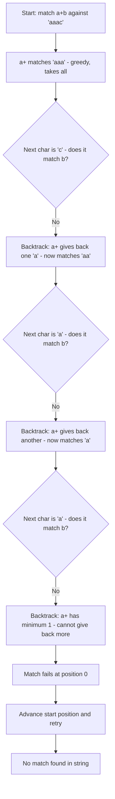

# Regular Expressions

## Pattern Matching and Text Transformation

**Version:** 1.0
**Year:** 2026

---

## Copyright Notice

Copyright (c) 2025-2026 Ryan Thomas Robson / Robworks Software LLC. Licensed under [CC BY-NC-ND 4.0](../../LICENSE-CONTENT). You may share this material for non-commercial purposes with attribution, but you may not distribute modified versions.

---

Most languages treat regular expressions as a library feature - you import a module, create a pattern object, and call methods on it. Perl is different. [**Regular expressions**](https://perldoc.perl.org/perlre) are woven directly into the language syntax. They have their own operators (`=~`, `!~`), their own quoting constructs (`m//`, `s///`, `qr//`), and their own set of special variables (`$1`, `$&`, `$+{name}`). This is not an accident - Perl was originally designed for text processing, and regex is its native tongue.

Perl's regex engine is so influential that it became the basis for [**PCRE**](https://www.pcre.org/) (Perl-Compatible Regular Expressions), the library used by Python, PHP, JavaScript, and dozens of other languages. When you learn Perl regex, you are learning the original that shaped every modern regex implementation.

This guide takes you from basic matching through advanced features like lookaround assertions and compiled patterns. Every concept builds on the previous one, so read it in order if this is your first pass through Perl regex.

---

## Matching with m//

The [**`=~` binding operator**](https://perldoc.perl.org/perlop#Binding-Operators) connects a string to a pattern. The basic form tests whether a string matches:

```perl
my $str = "Hello, World!";

if ($str =~ /World/) {
    print "Found it!\n";
}
```

The `/World/` part is a regex pattern. The `=~` operator binds `$str` to that pattern and returns true if the pattern matches anywhere in the string.

### The m// Operator

The slashes are shorthand for [**`m//`**](https://perldoc.perl.org/perlop#m/PATTERN/msixpodualngc) (match). You can use `m` with any delimiter:

```perl
# These are all equivalent
$str =~ /World/
$str =~ m/World/
$str =~ m{World}
$str =~ m|World|
$str =~ m!World!
```

Alternate delimiters are useful when your pattern contains slashes - matching a file path like `/usr/local/bin` is cleaner as `m{/usr/local/bin}` than as `/\/usr\/local\/bin/`.

### Negation with !~

The [**`!~` operator**](https://perldoc.perl.org/perlop#Binding-Operators) is the opposite of `=~`. It returns true when the pattern does **not** match:

```perl
if ($input !~ /^\d+$/) {
    print "Not a valid number\n";
}
```

### Default Variable Matching

When you omit the `=~` operator, Perl matches against [**`$_`**](https://perldoc.perl.org/perlvar#$_), the default variable:

```perl
for ('apple', 'banana', 'cherry') {
    print "$_ has an 'a'\n" if /a/;
}
```

This is idiomatic in loops and `grep`/`map` blocks where `$_` is set automatically.

### Match Variables

After a successful match, Perl sets several special variables:

| Variable | Contains |
|----------|----------|
| `$&` | The entire matched text |
| `` $` `` | Everything before the match |
| `$'` | Everything after the match |

```perl
my $str = "The quick brown fox";
if ($str =~ /quick/) {
    print "Before: '$`'\n";    # "The "
    print "Match: '$&'\n";     # "quick"
    print "After: '$''\n";     # " brown fox"
}
```

!!! warning "Performance Cost of $&"
    Using `$&`, `` $` ``, or `$'` anywhere in your program forces Perl to compute them for **every** regex match in the entire program - even matches that do not use these variables. In Perl 5.20+, use `/p` modifier and `${^MATCH}`, `${^PREMATCH}`, `${^POSTMATCH}` instead. Or better yet, use captures (covered below).

```terminal
title: Basic Pattern Matching
steps:
  - command: "perl -e 'my $s = \"Perl is powerful\"; if ($s =~ /power/) { print \"Matched!\\n\" } else { print \"No match\\n\" }'"
    output: "Matched!"
    narration: "The =~ operator tests whether 'power' appears anywhere in the string. It does not need to match the entire string - a substring match is enough."
  - command: "perl -e 'my $s = \"Error: file not found\"; if ($s =~ /error/i) { print \"Found error\\n\" }'"
    output: "Found error"
    narration: "The /i modifier makes the match case-insensitive. 'Error' in the string matches 'error' in the pattern."
  - command: "perl -e 'my $s = \"cats and dogs\"; $s =~ s/cats/birds/; print \"$s\\n\";'"
    output: "birds and dogs"
    narration: "The s/// operator substitutes the first occurrence of the pattern with the replacement string. The original variable is modified in place."
  - command: "perl -e 'my $s = \"aaa bbb aaa\"; $s =~ s/aaa/zzz/g; print \"$s\\n\";'"
    output: "zzz bbb zzz"
    narration: "Without /g, only the first 'aaa' would change. The /g modifier replaces all occurrences globally."
```

---

## Character Classes

A **character class** matches one character from a defined set. Square brackets define a custom class:

```perl
/[aeiou]/       # matches any single vowel
/[0-9]/         # matches any digit
/[A-Za-z]/      # matches any ASCII letter
/[a-zA-Z0-9_]/  # matches word characters
```

### Ranges and Negation

Hyphens inside brackets define ranges. A caret `^` at the start negates the class:

```perl
/[^aeiou]/      # matches any character that is NOT a vowel
/[^0-9]/        # matches any non-digit
/[a-fA-F0-9]/   # matches a hexadecimal digit
```

!!! tip "Literal Hyphen in Character Classes"
    To include a literal hyphen, place it first, last, or escape it: `[-abc]`, `[abc-]`, or `[a\-c]`. Placing it between characters creates a range.

### POSIX Character Classes

POSIX classes use a double-bracket syntax inside a character class:

```perl
/[[:alpha:]]/    # alphabetic characters
/[[:digit:]]/    # digits (same as [0-9])
/[[:alnum:]]/    # alphanumeric
/[[:space:]]/    # whitespace characters
/[[:upper:]]/    # uppercase letters
/[[:lower:]]/    # lowercase letters
/[[:punct:]]/    # punctuation characters
```

POSIX classes respect locale settings, which makes them more portable than hardcoded ranges for internationalized text. In practice, most Perl code uses the shorthand escapes below.

### Shorthand Character Classes

Perl provides single-character shortcuts for the most common classes:

| Shorthand | Matches | Equivalent |
|-----------|---------|------------|
| `\d` | A digit | `[0-9]` (ASCII) or Unicode digit |
| `\D` | A non-digit | `[^0-9]` |
| `\w` | A "word" character | `[a-zA-Z0-9_]` |
| `\W` | A non-word character | `[^a-zA-Z0-9_]` |
| `\s` | Whitespace | `[ \t\n\r\f]` |
| `\S` | Non-whitespace | `[^ \t\n\r\f]` |
| `.` | Any character except newline | `[^\n]` (unless `/s` modifier) |

```perl
# Match a simple date format
if ($str =~ /\d{4}-\d{2}-\d{2}/) {
    print "Looks like a date\n";
}

# Match a Perl variable name
if ($str =~ /[\$\@\%]\w+/) {
    print "Looks like a variable\n";
}
```

!!! warning "Unicode and \\d"
    Under `use utf8` or the `/u` flag, `\d` matches any Unicode digit - including Arabic-Indic, Devanagari, and other scripts. For strict ASCII digits, use `[0-9]` explicitly.

```quiz
question: "What does the pattern /\\b\\w+\\b/ match, and why do the \\b anchors matter?"
type: multiple-choice
options:
  - text: "It matches a complete word. The \\b anchors ensure the match starts and ends at a word boundary, preventing partial matches inside longer words."
    correct: true
    feedback: "Correct! \\b matches the zero-width boundary between a word character (\\w) and a non-word character. Without the \\b anchors, \\w+ alone would still match word characters - but it could match a substring inside a longer token. The boundaries ensure you get whole words."
  - text: "It matches any sequence of characters including spaces. \\b matches a blank space."
    feedback: "\\b does not match a space. It matches a zero-width position (a boundary) between a \\w character and a \\W character. It consumes no characters itself."
  - text: "It matches a backspace character followed by one or more word characters. \\b is the backspace escape."
    feedback: "\\b means backspace only inside a character class like [\\b]. Outside brackets, \\b is a word boundary assertion."
  - text: "It matches exactly one word character. The \\b anchors cancel out the + quantifier."
    feedback: "The \\b anchors do not affect quantifiers. \\w+ still matches one or more word characters. The anchors just constrain where the match can start and end."
```

---

## Quantifiers

Quantifiers control how many times a preceding element must appear for the pattern to match.

### Basic Quantifiers

| Quantifier | Meaning | Example |
|------------|---------|---------|
| `*` | 0 or more | `/bo*/` matches "b", "bo", "boo", "booo" |
| `+` | 1 or more | `/bo+/` matches "bo", "boo", "booo" (not "b") |
| `?` | 0 or 1 | `/colou?r/` matches "color" and "colour" |
| `{n}` | Exactly n | `/\d{4}/` matches exactly 4 digits |
| `{n,}` | n or more | `/\d{2,}/` matches 2 or more digits |
| `{n,m}` | Between n and m | `/\d{2,4}/` matches 2 to 4 digits |

```perl
# Phone number: 3 digits, separator, 3 digits, separator, 4 digits
if ($phone =~ /\d{3}[-.\s]\d{3}[-.\s]\d{4}/) {
    print "Valid phone format\n";
}

# One or more whitespace-separated words
if ($line =~ /\w+(\s+\w+)*/) {
    print "Contains words\n";
}
```

### Greedy vs Non-Greedy

By default, quantifiers are **greedy** - they match as much text as possible while still allowing the overall pattern to succeed. Adding `?` after a quantifier makes it **non-greedy** (also called lazy) - it matches as little as possible.

```perl
my $html = "<b>bold</b> and <i>italic</i>";

# Greedy: .* grabs as much as possible
$html =~ /<.*>/;
# $& is "<b>bold</b> and <i>italic</i>"

# Non-greedy: .*? grabs as little as possible
$html =~ /<.*?>/;
# $& is "<b>"
```

This is one of the most common sources of regex bugs. If your pattern matches more text than expected, a greedy quantifier is usually the cause.

| Greedy | Non-greedy | Meaning |
|--------|------------|---------|
| `*` | `*?` | 0 or more (prefer fewer) |
| `+` | `+?` | 1 or more (prefer fewer) |
| `?` | `??` | 0 or 1 (prefer 0) |
| `{n,m}` | `{n,m}?` | n to m (prefer n) |

### Possessive Quantifiers

[**Possessive quantifiers**](https://perldoc.perl.org/perlre#Possessive-Quantifiers) (Perl 5.10+) add `+` after the quantifier. They behave like greedy quantifiers but never backtrack - once they consume characters, they do not give them back:

```perl
# Possessive: \d++ grabs all digits and refuses to backtrack
"12345abc" =~ /\d++\d/;  # FAILS - \d++ takes all digits, nothing left for \d

# Greedy: \d+ grabs all digits, then backtracks one for the final \d
"12345abc" =~ /\d+\d/;   # Matches "12345"
```

Possessive quantifiers are a performance optimization. Use them when you know backtracking would be pointless - the engine fails faster instead of trying every possible combination.

### How the Engine Backtracks

The following diagram shows how Perl's regex engine processes the greedy pattern `a+b` against the string "aaac". The engine matches greedily, then backtracks when it cannot find `b`:



This backtracking behavior is what makes greedy quantifiers expensive on long strings with no match. Possessive quantifiers (`a++b`) would fail immediately at the first step - `a++` takes all three `a` characters and refuses to backtrack, so the engine knows instantly that `b` cannot match.

```quiz
question: "Given the string '<b>bold</b>', what does the greedy pattern /<.*>/ match?"
type: multiple-choice
options:
  - text: "'<b>bold</b>' - the entire string from the first < to the last >"
    correct: true
    feedback: "Correct! The .* quantifier is greedy, so it matches as many characters as possible. It grabs everything from the first < all the way to the end, then backtracks just enough to find the last > in the string."
  - text: "'<b>' - just the first tag"
    feedback: "That would be the result of the non-greedy pattern /<.*?>/. The greedy .* matches as much as possible, which extends past the first > to the last one."
  - text: "'<b>bold</b' - everything except the final >"
    feedback: "The pattern requires a closing >. The greedy .* grabs everything, then backtracks to the last > it can find."
  - text: "No match - the pattern is invalid because .* is ambiguous"
    feedback: "The pattern is valid. Greedy quantifiers always match - they just match more text than you might expect."
```

---

## Anchors

**Anchors** match a position in the string, not a character. They constrain where a pattern can match without consuming any text.

| Anchor | Position |
|--------|----------|
| `^` | Start of string (or start of line with `/m`) |
| `$` | End of string (or end of line with `/m`) |
| `\b` | Word boundary (between `\w` and `\W`) |
| `\B` | Not a word boundary |
| `\A` | Absolute start of string (ignores `/m`) |
| `\z` | Absolute end of string (ignores `/m`) |
| `\Z` | End of string or before final newline |

```perl
# Match only if the entire string is digits
if ($str =~ /^\d+$/) {
    print "All digits\n";
}

# Match 'cat' only as a whole word, not inside 'concatenate'
if ($str =~ /\bcat\b/) {
    print "Found the word 'cat'\n";
}

# Validate that a string starts with a letter
if ($str =~ /\A[a-zA-Z]/) {
    print "Starts with a letter\n";
}
```

### ^ and $ with Multiline Mode

By default, `^` and `$` match the start and end of the entire string. With the [**`/m` modifier**](https://perldoc.perl.org/perlre#/m), they match the start and end of each line:

```perl
my $text = "first line\nsecond line\nthird line\n";

# Without /m - matches only at string start
my @starts = ($text =~ /^(\w+)/g);
# @starts = ("first")

# With /m - matches at start of each line
my @starts = ($text =~ /^(\w+)/gm);
# @starts = ("first", "second", "third")
```

When you need to anchor to the absolute start or end regardless of `/m`, use `\A` and `\z`:

```perl
# Always matches absolute start - even with /m
if ($str =~ /\A#!/) {
    print "Starts with shebang\n";
}
```

### Word Boundaries

The [**`\b` anchor**](https://perldoc.perl.org/perlre#Assertions) matches the zero-width position between a word character (`\w`) and a non-word character (`\W`), or between `\w` and the start/end of the string.

```perl
my $str = "caterpillar has a cat in it";

$str =~ /cat/;       # matches "cat" in "caterpillar" (first occurrence)
$str =~ /\bcat\b/;   # matches "cat" as a standalone word

# Practical: highlight whole words only
$str =~ s/\bcat\b/[CAT]/g;
# "caterpillar has a [CAT] in it"
```

---

## Captures and Backreferences

Parentheses in a regex do two things: they **group** sub-patterns and they **capture** the matched text into numbered variables.

### Numbered Captures

Each pair of parentheses creates a capture group. After a successful match, `$1` holds the text matched by the first group, `$2` the second, and so on:

```perl
my $date = "2025-01-15";
if ($date =~ /(\d{4})-(\d{2})-(\d{2})/) {
    print "Year: $1\n";    # 2025
    print "Month: $2\n";   # 01
    print "Day: $3\n";     # 15
}
```

Captures are numbered by the position of their **opening** parenthesis, counting from left to right:

```perl
# Group numbering:
#   (   1   (  2  )   (  3  )   )
# /( \w+ ) ( \d+ ) ( \w+ )/x
```

### Captures in List Context

In list context, a match returns all captured groups as a list:

```perl
my ($year, $month, $day) = ("2025-01-15" =~ /(\d{4})-(\d{2})-(\d{2})/);
print "$month/$day/$year\n";  # 01/15/2025
```

Combined with `/g`, this extracts all occurrences:

```perl
my @words = ("hello world foo bar" =~ /(\w+)/g);
# @words = ("hello", "world", "foo", "bar")
```

### Named Captures

[**Named captures**](https://perldoc.perl.org/perlre#(?%3CNAME%3Epattern)) (Perl 5.10+) use `(?<name>...)` syntax and store results in `$+{name}`:

```perl
my $line = "192.168.1.100 - admin [15/Jan/2025:09:23:45] GET /index.html";

if ($line =~ /(?<ip>[\d.]+)\s+-\s+(?<user>\w+)\s+\[(?<time>[^\]]+)\]\s+(?<method>\w+)\s+(?<path>\S+)/) {
    print "IP: $+{ip}\n";        # 192.168.1.100
    print "User: $+{user}\n";    # admin
    print "Time: $+{time}\n";    # 15/Jan/2025:09:23:45
    print "Method: $+{method}\n"; # GET
    print "Path: $+{path}\n";    # /index.html
}
```

Named captures make complex patterns self-documenting. The numbered variables (`$1`, `$2`) still work alongside named ones.

### Backreferences

**Backreferences** refer to a previously captured group within the same pattern. Use `\1`, `\2`, etc. inside the pattern itself:

```perl
# Match repeated words ("the the", "is is")
if ($text =~ /\b(\w+)\s+\1\b/i) {
    print "Duplicate word: $1\n";
}

# Match matching quotes
if ($str =~ /(["']).*?\1/) {
    print "Found quoted string\n";
}
```

Named backreferences use `\k<name>`:

```perl
if ($text =~ /\b(?<word>\w+)\s+\k<word>\b/i) {
    print "Duplicate: $+{word}\n";
}
```

### Non-Capturing Groups

When you need grouping for alternation or quantifiers but do not need the captured text, use [**`(?:...)`**](https://perldoc.perl.org/perlre#(?:pattern)):

```perl
# Capturing: wastes a capture slot on something we don't need
if ($url =~ /(https?)(:\/\/.+)/) { ... }

# Non-capturing: groups without capturing
if ($url =~ /(?:https?):\/\/(.+)/) {
    print "Host and path: $1\n";  # $1 is now the useful part
}
```

Non-capturing groups are a habit worth building. They keep your capture numbering clean and avoid unnecessary work.

```code-walkthrough
language: perl
title: Log Line Parser with Named Captures
code: |
  use strict;
  use warnings;

  my @log = (
      "2025-01-15 09:23:45 ERROR Database connection failed",
      "2025-01-15 09:24:01 INFO  Retrying connection",
      "2025-01-15 09:24:03 WARN  Connection pool exhausted",
      "2025-01-15 09:24:10 ERROR Out of memory",
  );

  for my $line (@log) {
      if ($line =~ /^(?<date>\d{4}-\d{2}-\d{2})\s+(?<time>\d{2}:\d{2}:\d{2})\s+(?<level>\w+)\s+(?<msg>.+)$/) {
          printf "[%s] %s: %s\n", $+{level}, $+{time}, $+{msg};
      }
  }
annotations:
  - line: 12
    text: "The pattern uses named captures (?<name>...) so each field is self-documenting. No need to remember that $1 is the date and $3 is the level."
  - line: 12
    text: "^ and $ anchor the pattern to the full line. Without anchors, a partial match could succeed on malformed input."
  - line: 12
    text: "\\d{4}-\\d{2}-\\d{2} matches a date like 2025-01-15. The {n} quantifier requires exactly n digits."
  - line: 12
    text: "\\s+ between fields matches one or more whitespace characters - handles both single spaces and variable-width padding like the extra space after INFO."
  - line: 12
    text: ".+ at the end captures the rest of the line as the message. The + ensures at least one character (a blank message would not match)."
  - line: 13
    text: "$+{level}, $+{time}, and $+{msg} access named captures. The %+ hash is populated automatically after a successful match."
```

---

## Alternation and Grouping

The [**`|` operator**](https://perldoc.perl.org/perlre#Alternation) means "or" - it matches the pattern on the left or the pattern on the right:

```perl
# Match any of these keywords
if ($line =~ /error|warning|critical/) {
    print "Problem detected\n";
}
```

### Precedence

Alternation has low precedence - lower than concatenation. This means `/abc|def/` matches "abc" or "def", not "ab(c or d)ef". Use grouping to control scope:

```perl
# Without grouping: matches "gray" or "grey"... but also wrong readings
/gray|grey/

# With grouping: clearly matches "gray" or "grey"
/gr(?:a|e)y/

# Common pattern: match file extensions
/\.(?:jpg|jpeg|png|gif|webp)$/i
```

### Alternation Ordering

The regex engine tries alternatives left to right and takes the first match. This matters when alternatives overlap:

```perl
# "catfish" matches "cat" (first alternative wins)
"catfish" =~ /cat|catfish/;    # $& is "cat"

# Put longer alternatives first
"catfish" =~ /catfish|cat/;    # $& is "catfish"
```

!!! tip "Alternation vs Character Class"
    For single characters, `[abc]` is more efficient than `a|b|c`. Character classes are optimized internally; alternation requires the engine to try each branch.

---

## Substitution with s///

The [**`s///` operator**](https://perldoc.perl.org/perlop#s/PATTERN/REPLACEMENT/msixpodualngcer) finds a pattern and replaces it:

```perl
my $str = "Hello, World!";
$str =~ s/World/Perl/;
print $str;  # "Hello, Perl!"
```

The left side is a regex pattern. The right side is a replacement string (not a pattern). Captures from the left side are available in the replacement:

```perl
my $date = "01/15/2025";
$date =~ s|(\d{2})/(\d{2})/(\d{4})|$3-$1-$2|;
print $date;  # "2025-01-15"
```

### Common s/// Modifiers

```perl
# /g - replace ALL occurrences (not just the first)
my $str = "aaa bbb aaa";
$str =~ s/aaa/zzz/g;
# "zzz bbb zzz"

# /i - case-insensitive match
$str =~ s/hello/Hi/gi;

# /r - return modified copy, leave original unchanged (5.14+)
my $original = "Hello, World!";
my $modified = $original =~ s/World/Perl/r;
# $original is still "Hello, World!"
# $modified is "Hello, Perl!"

# /e - evaluate replacement as Perl code
my $text = "price: 100 dollars";
$text =~ s/(\d+)/$1 * 1.1/e;
# "price: 110 dollars"
```

The `/r` modifier is particularly valuable in pipelines where you want to transform without mutating:

```perl
my @lowered = map { s/[A-Z]/lc($&)/ger } @strings;
```

### Chaining Substitutions

Multiple `s///` calls can be chained, especially with `/r`:

```perl
my $clean = $input
    =~ s/^\s+//r       # trim leading whitespace
    =~ s/\s+$//r       # trim trailing whitespace
    =~ s/\s+/ /gr;     # collapse internal whitespace
```

```terminal
title: Substitution Techniques
steps:
  - command: "perl -e 'my $s = \"John Smith, Age 30\"; $s =~ s/(\\w+) (\\w+)/$2, $1/; print \"$s\\n\";'"
    output: "Smith, John, Age 30"
    narration: "Captures in the pattern are available as $1, $2 in the replacement. Here we swap first and last name by rearranging the captured groups."
  - command: "perl -e 'my $s = \"price is 50 dollars\"; $s =~ s/(\\d+)/sprintf(\"%.2f\", $1 * 1.08)/e; print \"$s\\n\";'"
    output: "price is 54.00 dollars"
    narration: "The /e modifier evaluates the replacement as Perl code. Here it multiplies the captured number by 1.08 and formats it with sprintf. Powerful for computed replacements."
  - command: "perl -e 'my $orig = \"Hello World\"; my $new = $orig =~ s/World/Perl/r; print \"orig: $orig\\n\"; print \"new: $new\\n\";'"
    output: "orig: Hello World\nnew: Hello Perl"
    narration: "The /r modifier returns a modified copy instead of changing the original. The original string is untouched. Available since Perl 5.14."
  - command: "perl -e 'my $s = \"foo123bar456baz\"; $s =~ s/\\d+/[NUM]/g; print \"$s\\n\";'"
    output: "foo[NUM]bar[NUM]baz"
    narration: "The /g modifier replaces all matches, not just the first one. Without /g, only '123' would be replaced."
```

---

## Modifiers

[**Pattern modifiers**](https://perldoc.perl.org/perlre#Modifiers) change how the regex engine interprets a pattern. You have already seen several - here is the complete set:

| Modifier | Effect |
|----------|--------|
| `/i` | Case-insensitive matching |
| `/g` | Global - match/replace all occurrences |
| `/m` | Multiline - `^` and `$` match line boundaries |
| `/s` | Single-line - `.` matches `\n` |
| `/x` | Extended - ignore whitespace, allow comments |
| `/e` | Evaluate replacement as code (s/// only) |
| `/r` | Return modified copy (s/// only, 5.14+) |
| `/p` | Preserve match variables (`${^MATCH}`, etc.) |
| `/a` | ASCII - `\d`, `\w`, `\s` match ASCII only |

### The /x Modifier for Readable Patterns

Complex patterns become unreadable fast. The [**`/x` modifier**](https://perldoc.perl.org/perlre#/x-and-/xx) lets you add whitespace and comments:

```perl
# Without /x - good luck reading this
my $email_re = qr/^[a-zA-Z0-9._%+-]+@[a-zA-Z0-9.-]+\.[a-zA-Z]{2,}$/;

# With /x - same pattern, now readable
my $email_re = qr/
    ^                       # start of string
    [a-zA-Z0-9._%+-]+      # local part (before @)
    @                       # literal @ sign
    [a-zA-Z0-9.-]+         # domain name
    \.                      # literal dot
    [a-zA-Z]{2,}           # TLD (2+ letters)
    $                       # end of string
/x;
```

With `/x`, whitespace is ignored (use `\ ` or `\s` to match a literal space) and `#` starts a comment that runs to end of line. This is essential for any pattern longer than about 30 characters.

### Combining Modifiers

Modifiers can be stacked:

```perl
# Case-insensitive global substitution
$str =~ s/error/WARNING/gi;

# Multiline, extended - parse a multi-line log block
$block =~ m/
    ^                   # start of line (thanks to /m)
    (\d{4}-\d{2}-\d{2}) # date
    \s+
    (\w+)               # log level
    \s+
    (.+)                # message
    $                   # end of line
/xm;

# Single-line mode - match across newlines
$html =~ m/<div.*?<\/div>/s;
```

!!! warning "Confusing Names: /m and /s"
    `/m` (multiline) changes `^` and `$` to match line boundaries. `/s` (single-line) changes `.` to match newlines. Despite their names, they are independent - you can use both at once (`/ms`) when you need `.` to cross lines AND `^`/`$` to match per-line.

```command-builder
base: "perl -pe"
description: Build a Perl substitution one-liner for stream editing
options:
  - flag: ""
    type: select
    label: "Pattern"
    explanation: "The search pattern to find"
    choices:
      - ["'s/foo/bar/'", "Replace 'foo' with 'bar' (first occurrence per line)"]
      - ["'s/foo/bar/g'", "Replace 'foo' with 'bar' (all occurrences)"]
      - ["'s/^\\s+//'", "Remove leading whitespace"]
      - ["'s/\\s+$//'", "Remove trailing whitespace"]
      - ["'s/\\t/    /g'", "Convert tabs to spaces"]
      - ["'s/(\\w+)/\\U$1/g'", "Convert all words to uppercase"]
  - flag: "-i"
    type: toggle
    label: "In-place editing"
    explanation: "Modify the file directly instead of printing to stdout. Use -i.bak to keep a backup."
    choices:
      - [".bak", "Edit in-place with .bak backup"]
  - flag: ""
    type: select
    label: "Input source"
    explanation: "File to process"
    choices:
      - ["input.txt", "input.txt"]
      - ["*.log", "All .log files"]
      - ["data.csv", "data.csv"]
```

---

## Lookahead and Lookbehind

[**Lookaround assertions**](https://perldoc.perl.org/perlre#Lookaround-Assertions) check whether a pattern exists before or after the current position without including it in the match. They are zero-width - they assert a condition without consuming characters.

### Lookahead

**Positive lookahead** `(?=...)` succeeds if the pattern ahead matches:

```perl
# Match "Perl" only if followed by a space and a version number
"Perl 5.40" =~ /Perl(?=\s\d)/;
# Matches "Perl" (not "Perl 5")
```

**Negative lookahead** `(?!...)` succeeds if the pattern ahead does NOT match:

```perl
# Match a number not followed by a percent sign
"50 items, 30% discount" =~ /\d+(?!%)/;
# Matches "50" (skips "30" because it is followed by %)
```

### Lookbehind

**Positive lookbehind** `(?<=...)` succeeds if the pattern behind matches:

```perl
# Match a number preceded by a dollar sign
"Price: $42.99" =~ /(?<=\$)\d+/;
# Matches "42" (the $ is not part of the match)
```

**Negative lookbehind** `(?<!...)` succeeds if the pattern behind does NOT match:

```perl
# Match "cat" not preceded by "bob"
"bobcat and cat" =~ /(?<!bob)cat/;
# Matches the second "cat"
```

!!! warning "Lookbehind Length Restriction"
    In Perl, lookbehind patterns must have a fixed or bounded length. You cannot use `*` or `+` inside a lookbehind: `(?<=\d+)` is not allowed. Use `(?<=\d)` or `(?<=\d{1,10})` instead. Perl 5.30+ relaxed this for some variable-length lookbehinds, but fixed-length is safest.

### Practical Lookaround Examples

```perl
# Add commas to a number: 1234567 -> 1,234,567
my $num = "1234567";
$num =~ s/(\d)(?=(\d{3})+(?!\d))/$1,/g;
print $num;  # "1,234,567"

# Extract values from key=value pairs, only if key is "host"
my $config = "host=db.example.com port=5432 host=cache.local";
my @hosts = ($config =~ /(?<=host=)\S+/g);
# @hosts = ("db.example.com", "cache.local")

# Password validation: at least one digit and one uppercase
if ($pass =~ /(?=.*\d)(?=.*[A-Z]).{8,}/) {
    print "Password meets requirements\n";
}
```

The password example stacks two positive lookaheads at position 0. Each one scans forward independently to verify a condition, then the final `.{8,}` actually consumes the string. This "stacked lookahead" technique is common for validating multiple conditions simultaneously.

```quiz
question: "What does the pattern /(?<=\\$)\\d+/ match in the string 'Cost: $150 and $25'?"
type: multiple-choice
options:
  - text: "'150' on the first match - it matches digits that are preceded by a dollar sign, but the dollar sign itself is not part of the match"
    correct: true
    feedback: "Correct! The positive lookbehind (?<=\\$) asserts that a literal $ must appear before the digits, but it is zero-width - it does not consume the $. So \\d+ matches '150' (and with /g would also find '25'). The dollar sign is escaped with \\ because $ is a regex metacharacter."
  - text: "'$150' - the lookbehind includes the dollar sign in the match"
    feedback: "Lookaround assertions are zero-width. They check a condition without consuming characters. The dollar sign is asserted but not captured into the match."
  - text: "No match - you cannot escape $ inside a lookbehind"
    feedback: "You absolutely can. \\$ matches a literal dollar sign in any part of a regex, including inside lookbehind assertions."
  - text: "'1' - lookbehind only matches a single character after the assertion"
    feedback: "The lookbehind constrains where the match starts, but \\d+ still matches one or more digits greedily. It matches the full sequence '150'."
```

---

## split with Regex

The [**`split`**](https://perldoc.perl.org/perlfunc#split) function divides a string into a list using a regex as the delimiter:

```perl
my @fields = split /,/, "Alice,30,Engineer";
# @fields = ("Alice", "30", "Engineer")

my @words = split /\s+/, "  hello   world  ";
# @words = ("hello", "world")
```

### The Limit Parameter

A third argument limits how many fields are returned:

```perl
my @parts = split /:/, "one:two:three:four", 3;
# @parts = ("one", "two", "three:four")
# Third element contains the unsplit remainder
```

### Special Cases

```perl
# split with no arguments splits $_ on whitespace (like awk)
for ("  Alice   30   Engineer  ") {
    my @fields = split;
    # @fields = ("Alice", "30", "Engineer")
}

# Single-character string splits into characters
my @chars = split //, "hello";
# @chars = ("h", "e", "l", "l", "o")

# split on literal string (not regex)
my @parts = split /\./, "www.example.com";
# @parts = ("www", "example", "com")
```

### Capturing Separators

When the split pattern contains captures, the captured separators are included in the output list:

```perl
my @tokens = split /(\s+)/, "hello   world";
# @tokens = ("hello", "   ", "world")
# The captured whitespace appears between the fields

# Useful for preserving formatting
my @parts = split /(,\s*)/, "a, b,c,  d";
# @parts = ("a", ", ", "b", ",", "c", ",  ", "d")
```

!!! tip "split vs Regex Match"
    Use `split` when you know the delimiters and want the content between them. Use a regex match with captures when you know the field format and want to extract specific parts. For parsing a CSV line, `split /,/` is simpler. For extracting a timestamp from a log line, a pattern with captures is clearer.

```exercise
title: Apache Log Line Parser
difficulty: beginner
scenario: |
  Write a Perl script that parses Apache combined log format lines and extracts useful fields.

  Each log line looks like this:
  ```
  192.168.1.50 - frank [10/Oct/2025:13:55:36 -0700] "GET /index.html HTTP/1.1" 200 2326
  ```

  Your script should:
  1. Store 3-4 sample log lines in an array
  2. For each line, use a regex to extract: IP address, username, date/time, HTTP method, path, status code, and byte count
  3. Print a summary for each line showing: IP, method, path, and status code
  4. After processing all lines, print the total bytes served

  Use named captures or numbered captures - your choice.
hints:
  - "The IP address is at the start: (\\d+\\.\\d+\\.\\d+\\.\\d+) or ([\\d.]+)"
  - "Username is between the two hyphens/spaces: - (\\w+|-) \\["
  - "The date is inside square brackets: \\[([^\\]]+)\\]"
  - "The request line is in double quotes: \"(\\w+) (\\S+) \\S+\""
  - "Status and bytes follow the closing quote: (\\d{3}) (\\d+)"
solution: |
  ```perl
  use strict;
  use warnings;

  my @log = (
      '192.168.1.50 - frank [10/Oct/2025:13:55:36 -0700] "GET /index.html HTTP/1.1" 200 2326',
      '10.0.0.1 - - [10/Oct/2025:13:56:01 -0700] "POST /api/data HTTP/1.1" 201 512',
      '192.168.1.50 - frank [10/Oct/2025:13:56:15 -0700] "GET /style.css HTTP/1.1" 200 1045',
      '172.16.0.5 - admin [10/Oct/2025:13:57:00 -0700] "DELETE /api/item/7 HTTP/1.1" 403 128',
  );

  my $total_bytes = 0;

  for my $line (@log) {
      if ($line =~ /^(?<ip>[\d.]+) \S+ (?<user>\S+) \[(?<date>[^\]]+)\] "(?<method>\w+) (?<path>\S+) \S+" (?<status>\d{3}) (?<bytes>\d+)/) {
          printf "%-15s  %-6s  %-20s  %s\n",
              $+{ip}, $+{method}, $+{path}, $+{status};
          $total_bytes += $+{bytes};
      }
  }

  print "\nTotal bytes served: $total_bytes\n";
  ```

  Output:
  ```
  192.168.1.50     GET     /index.html           200
  10.0.0.1         POST    /api/data             201
  192.168.1.50     GET     /style.css            200
  172.16.0.5       DELETE  /api/item/7           403

  Total bytes served: 4011
  ```
```

---

## Compiled Patterns with qr//

The [**`qr//` operator**](https://perldoc.perl.org/perlop#qr/STRING/msixpodualn) compiles a regex pattern into a reusable object. This is useful when you need to store patterns in variables, build them dynamically, or reuse them across multiple matches:

```perl
my $date_re = qr/\d{4}-\d{2}-\d{2}/;
my $time_re = qr/\d{2}:\d{2}:\d{2}/;

if ($log_line =~ /^$date_re\s+$time_re/) {
    print "Starts with a timestamp\n";
}
```

### Compiled Patterns as Building Blocks

Complex patterns become manageable when assembled from named parts:

```perl
my $ip_octet = qr/(?:25[0-5]|2[0-4]\d|[01]?\d\d?)/;
my $ipv4     = qr/$ip_octet\.$ip_octet\.$ip_octet\.$ip_octet/;
my $port     = qr/(?::\d{1,5})?/;

if ($addr =~ /^$ipv4$port$/) {
    print "Valid IPv4 address (with optional port)\n";
}
```

### Modifiers on qr//

Modifiers applied to `qr//` travel with the compiled pattern:

```perl
my $word = qr/hello/i;       # case-insensitive
"HELLO WORLD" =~ /$word/;    # matches, /i is baked in

my $verbose_date = qr/
    (\d{4})     # year
    -
    (\d{2})     # month
    -
    (\d{2})     # day
/x;
```

### Dynamic Pattern Construction

Build patterns from runtime data - but be careful about metacharacters:

```perl
# DANGEROUS - user input could contain regex metacharacters
my $search = "file.txt";
$str =~ /$search/;  # The . matches ANY character

# SAFE - quotemeta escapes metacharacters
$str =~ /\Q$search\E/;  # \Q...\E treats content as literal

# Building a pattern from a list of words
my @keywords = qw(error warning critical fatal);
my $pattern = join '|', map { quotemeta } @keywords;
my $re = qr/\b(?:$pattern)\b/i;

if ($log =~ $re) {
    print "Found a problem keyword\n";
}
```

The [**`\Q...\E`**](https://perldoc.perl.org/perlre#Escape-sequences) escape sequence (or the `quotemeta` function) is essential when interpolating user-supplied strings into patterns. Without it, a search for "file.txt" would match "filextxt" because `.` is a regex metacharacter.

```exercise
title: Multi-Format Date Normalizer
difficulty: intermediate
scenario: |
  Write a Perl script that normalizes dates from multiple input formats into ISO 8601 (YYYY-MM-DD).

  Your script should handle these formats:
  - **MM/DD/YYYY** (US format): `01/15/2025`
  - **DD-MM-YYYY** (European format): `15-01-2025`
  - **YYYY.MM.DD** (dotted ISO): `2025.01.15`

  Requirements:
  1. Use `qr//` to compile a pattern for each format
  2. Store the compiled patterns in a data structure (array of arrayrefs or hash)
  3. Process a list of mixed-format date strings
  4. For each date, try each pattern and output the normalized ISO 8601 form
  5. Print a warning for dates that do not match any known format

  Test with these dates:
  ```
  03/25/2025    12-06-2025    2025.11.30
  99/99/9999    15-01-2025    07/04/2025
  ```
hints:
  - "Compile each pattern with qr//: my $us_re = qr{^(\\d{2})/(\\d{2})/(\\d{4})$};"
  - "For US format MM/DD/YYYY, captures are: $1=month, $2=day, $3=year"
  - "For European DD-MM-YYYY: $1=day, $2=month, $3=year"
  - "For dotted YYYY.MM.DD: $1=year, $2=month, $3=day"
  - "Store formats as arrayrefs: [$pattern, sub { ... }] where the sub rearranges captures into YYYY-MM-DD"
solution: |
  ```perl
  use strict;
  use warnings;

  # Define formats: [name, compiled pattern, normalizer function]
  my @formats = (
      ['US (MM/DD/YYYY)',
       qr{^(\d{2})/(\d{2})/(\d{4})$},
       sub { "$3-$1-$2" }],               # year-month-day

      ['European (DD-MM-YYYY)',
       qr{^(\d{2})-(\d{2})-(\d{4})$},
       sub { "$3-$2-$1" }],               # year-month-day

      ['Dotted (YYYY.MM.DD)',
       qr{^(\d{4})\.(\d{2})\.(\d{2})$},
       sub { "$1-$2-$3" }],               # already in order
  );

  my @dates = qw(03/25/2025 12-06-2025 2025.11.30 99/99/9999 15-01-2025 07/04/2025);

  for my $date (@dates) {
      my $found = 0;

      for my $fmt (@formats) {
          my ($name, $re, $normalize) = @$fmt;
          if ($date =~ $re) {
              my $iso = $normalize->();
              printf "%-14s -> %s  (%s)\n", $date, $iso, $name;
              $found = 1;
              last;
          }
      }

      unless ($found) {
          printf "%-14s -> UNKNOWN FORMAT\n", $date;
      }
  }
  ```

  Output:
  ```
  03/25/2025     -> 2025-03-25  (US (MM/DD/YYYY))
  12-06-2025     -> 2025-06-12  (European (DD-MM-YYYY))
  2025.11.30     -> 2025-11-30  (Dotted (YYYY.MM.DD))
  99/99/9999     -> 9999-99-99  (US (MM/DD/YYYY))
  15-01-2025     -> 2025-01-15  (European (DD-MM-YYYY))
  07/04/2025     -> 2025-07-04  (US (MM/DD/YYYY))
  ```

  Note: 99/99/9999 matches the US format structurally (digits and slashes) but produces
  an invalid date. Real validation would check that month is 01-12 and day is valid for
  that month. Regex handles structure - semantic validation is a separate step.
```

---

## Common Patterns and Pitfalls

Regex is a powerful tool, but it has well-known failure modes. Knowing where regex breaks down is as important as knowing how to write patterns.

### Email Validation - Do Not Roll Your Own

The "simple" email regex everyone writes is wrong:

```perl
# Looks reasonable, misses edge cases
my $email_re = qr/^[\w.+-]+@[\w.-]+\.\w{2,}$/;
```

This rejects valid addresses like `"quoted string"@example.com` and `user+tag@[192.168.1.1]`. The RFC 5322 email spec is notoriously complex. Use [**Email::Valid**](https://metacpan.org/pod/Email::Valid) instead:

```perl
use Email::Valid;
if (Email::Valid->address('user@example.com')) {
    print "Valid\n";
}
```

### IP Address Validation

A naive IP pattern matches invalid addresses:

```perl
# Matches 999.999.999.999 - not a valid IP
/\d{1,3}\.\d{1,3}\.\d{1,3}\.\d{1,3}/
```

A correct pattern validates octet ranges:

```perl
my $octet = qr/(?:25[0-5]|2[0-4]\d|[01]?\d\d?)/;
my $ipv4  = qr/^$octet\.$octet\.$octet\.$octet$/;

# But even better - use a module
use Data::Validate::IP;
```

### Catastrophic Backtracking

Certain patterns cause the regex engine to try an exponential number of paths. The classic example:

```perl
# DO NOT USE - exponential backtracking on non-matching input
/(a+)+b/
```

On a string like `"aaaaaaaaaaaaaaaaac"`, the engine tries every way to partition the `a` characters between the inner and outer `+` quantifiers before concluding there is no `b`. Each additional `a` doubles the work.

!!! danger "Regex Denial of Service"
    Never use untrusted user input as a regex pattern without sanitizing it. A carefully crafted pattern can hang your program. Always use `\Q...\E` or `quotemeta()` when interpolating user strings into patterns.

Signs of backtracking trouble:

- Nested quantifiers: `(a+)+`, `(a*)*`, `(\w+\s*)+`
- Overlapping alternatives: `(a|a)+`
- Long strings that almost-but-do-not-quite match

Fixes:

- Use possessive quantifiers: `(a++)` instead of `(a+)+`
- Use atomic groups: `(?>a+)` prevents backtracking into the group
- Restructure the pattern to eliminate ambiguity

### When to Use Modules Instead of Hand-Rolled Regex

| Task | Module | Why |
|------|--------|-----|
| Email validation | `Email::Valid` | RFC 5322 is too complex for a single regex |
| URL parsing | `URI` | Handles schemes, encoding, relative paths |
| HTML parsing | `HTML::Parser`, `Mojo::DOM` | HTML is not a regular language |
| CSV parsing | `Text::CSV` | Handles quoting, escaping, edge cases |
| JSON parsing | `JSON::PP`, `Cpanel::JSON::XS` | Regex cannot handle nested structures |
| Date parsing | `Time::Piece`, `DateTime` | Calendar math needs more than pattern matching |

!!! tip "The Right Tool"
    Regex is perfect for pattern matching in strings - extracting fields, validating simple formats, search-and-replace. It is the wrong tool for parsing recursive structures (HTML, JSON, XML) or validating complex business rules. When you find yourself writing a regex longer than two lines, consider whether a module would be more maintainable.

---

## Putting It All Together

Regular expressions in Perl are not just a feature - they are a design philosophy. The language was built around the idea that text processing should be concise and expressive. Here is what you have covered:

- **`=~` and `m//`** bind strings to patterns and test for matches
- **Character classes** define sets of characters to match against
- **Quantifiers** control repetition - greedy, non-greedy, and possessive
- **Anchors** constrain where patterns match without consuming text
- **Captures** extract parts of the match into numbered or named variables
- **Alternation** provides or-logic within patterns
- **`s///`** replaces matched text with new content
- **Modifiers** (`/i`, `/g`, `/m`, `/s`, `/x`) change how the engine operates
- **Lookaround assertions** check context without consuming characters
- **`split`** breaks strings apart using regex delimiters
- **`qr//`** compiles and stores patterns for reuse
- **Defensive practices** protect against backtracking, metacharacter injection, and hand-rolled validation

The key to writing good regex is the same as writing good code: clarity over cleverness. Use `/x` for complex patterns. Use named captures for self-documentation. Use modules when the problem outgrows a single pattern. And always test your patterns against both matching and non-matching input.

---

## Further Reading

- [perlre - Perl Regular Expressions](https://perldoc.perl.org/perlre) - complete reference for Perl regex syntax and features
- [perlretut - Perl Regular Expressions Tutorial](https://perldoc.perl.org/perlretut) - official tutorial that walks through regex fundamentals
- [perlreref - Perl Regular Expressions Reference](https://perldoc.perl.org/perlreref) - concise quick-reference card for regex syntax
- [perlop - Quote-Like Operators](https://perldoc.perl.org/perlop#Regexp-Quote-Like-Operators) - documentation for `m//`, `s///`, `qr//`, and `tr///`
- [Mastering Regular Expressions, 3rd Edition](https://www.oreilly.com/library/view/mastering-regular-expressions/0596528124/) - Jeffrey Friedl's definitive book on regex engines and optimization
- [PCRE2 Specification](https://www.pcre.org/current/doc/html/) - the Perl-compatible regex library used by most modern languages

---

**Previous:** [Control Flow](control-flow.md) | **Next:** [Subroutines and References](subroutines-references.md) | [Back to Index](README.md)
