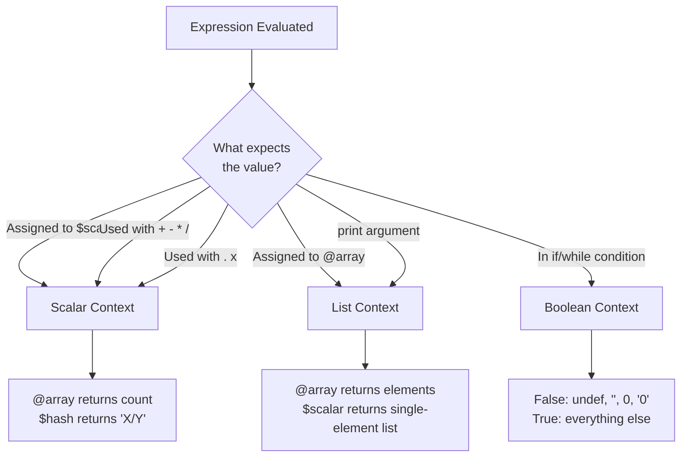

# Scalars, Strings, and Numbers

## Perl's Building Blocks: One Thing at a Time

**Version:** 1.0\
**Year:** 2025

---

## Copyright Notice

Copyright (c) 2025-2026 Ryan Thomas Robson / Robworks Software LLC. Licensed under [CC BY-NC-ND 4.0](../../LICENSE-CONTENT). You may share this material for non-commercial purposes with attribution, but you may not distribute modified versions.

---

## Variables and Sigils

Every variable in Perl starts with a punctuation character called a [**sigil**](https://perldoc.perl.org/perldata#Variable-names). The sigil tells you what kind of data the variable holds:

| Sigil | Type | Example |
|-------|------|---------|
| `$` | Scalar (single value) | `$name` |
| `@` | Array (ordered list) | `@items` |
| `%` | Hash (key-value pairs) | `%config` |

This guide focuses entirely on the `$` sigil - the **scalar**. A scalar holds exactly one value: a string, a number, a reference, or the special value `undef`. Perl does not have separate types for integers, floats, and strings the way most languages do. A scalar is whatever you need it to be, and Perl converts between types automatically based on context.

### Declaring Variables

You declare a lexical variable with the [**`my`**](https://perldoc.perl.org/functions/my) keyword:

```perl
my $username = "ringo";
my $port     = 8080;
my $pi       = 3.14159;
my $empty;               # declared but undefined (value is undef)
```

The `my` keyword limits the variable's visibility to the enclosing block (a pair of curly braces, a file, or an `eval`). This is called **lexical scoping**, and it prevents variables from leaking into unrelated code.

### use strict and use warnings

Every Perl script you write should start with these two lines:

```perl
use strict;
use warnings;
```

[**`use strict`**](https://perldoc.perl.org/strict) forces you to declare variables before using them. Without it, a typo like `$uesrname` silently creates a new global variable instead of raising an error.

[**`use warnings`**](https://perldoc.perl.org/warnings) alerts you to common mistakes: using an uninitialized variable, treating a string as a number when it does not look like one, or using a deprecated feature. These are not fatal errors - your program still runs - but ignoring them is asking for trouble.

```perl
use strict;
use warnings;

my $name = "Perl";
print "Hello, $name!\n";

# Without 'my', strict would stop this cold:
# $oops = 42;  # Global symbol "$oops" requires explicit package name
```

!!! warning "Always use strict and warnings"
    Code examples in documentation sometimes omit `use strict` and `use warnings` for brevity. Your actual scripts should always include them. The minor inconvenience of declaring variables saves hours of debugging.

### Naming Conventions

Variable names follow these rules:

- Must start with a letter or underscore after the sigil
- Can contain letters, digits, and underscores
- Are case-sensitive (`$Name` and `$name` are different variables)
- By convention, use lowercase with underscores: `$first_name`, `$max_retry_count`

```perl
my $user_name   = "admin";     # good - clear and readable
my $userName    = "admin";     # works but not idiomatic Perl
my $x           = "admin";     # too terse - what does $x mean?
my $2nd_attempt = 1;           # INVALID - can't start with a digit
```

```terminal
title: Your First Perl Variables
steps:
  - command: "perl -e 'my $name = \"World\"; print \"Hello, $name!\\n\";'"
    output: "Hello, World!"
    narration: "The my keyword declares a lexical variable. The $ sigil marks it as a scalar. Double quotes interpolate the variable."
  - command: "perl -e 'my $count = 42; my $pi = 3.14159; print \"$count and $pi\\n\";'"
    output: "42 and 3.14159"
    narration: "Scalars hold any single value - integers, floats, strings. Perl figures out the type from context."
  - command: "perl -e 'my $x = 10; my $y = 3; print $x + $y, \" \", $x . $y, \"\\n\";'"
    output: "13 103"
    narration: "The + operator treats values as numbers, the . operator treats them as strings. Same variables, different context."
  - command: "perl -e 'use strict; use warnings; print $oops;'"
    output: "Global symbol \"$oops\" requires explicit package name ... \nExecution ... aborted due to compilation errors."
    narration: "With use strict, undeclared variables cause a fatal error. This catches typos before they become bugs."
```

---

## Strings

Perl has two quoting styles for strings, and the difference matters.

### Single-Quoted Strings

**Single-quoted strings** are literal. Perl takes the characters exactly as written, with two exceptions: `\\` produces a single backslash, and `\'` produces a single quote.

```perl
my $path = '/usr/local/bin';
my $msg  = 'The variable $name is not interpolated here';
my $escaped = 'It\'s a backslash: \\';

print $path, "\n";     # /usr/local/bin
print $msg, "\n";      # The variable $name is not interpolated here
print $escaped, "\n";  # It's a backslash: \
```

Use single quotes when you want the string stored exactly as typed - file paths, regex patterns, or any string that should not have variable substitution.

### Double-Quoted Strings

**Double-quoted strings** interpret escape sequences and interpolate variables:

```perl
my $user = "admin";
my $home = "/home/$user";       # /home/admin
my $msg  = "Hello, ${user}!\n"; # Hello, admin! (with newline)
```

Common escape sequences in double-quoted strings:

| Sequence | Meaning |
|----------|---------|
| `\n` | Newline |
| `\t` | Tab |
| `\r` | Carriage return |
| `\\` | Literal backslash |
| `\"` | Literal double quote |
| `\$` | Literal dollar sign (prevents interpolation) |
| `\@` | Literal at sign (prevents interpolation) |
| `\x{4F60}` | Unicode character by hex code point |
| `\0` | Null byte |

The curly braces in `${user}` are optional when the variable name is unambiguous, but they help when the variable is followed by text that could be mistaken for part of the name:

```perl
my $fruit = "apple";
print "I like ${fruit}s\n";  # I like apples
print "I like $fruits\n";    # Perl looks for $fruits, not $fruit
```

### Heredocs

For multi-line strings, Perl provides [**heredocs**](https://perldoc.perl.org/perldata#Here-Documents) (here-documents). The syntax is `<<IDENTIFIER`, and the string continues until a line containing only the identifier:

```perl
my $html = <<HTML;
<html>
<head><title>$title</title></head>
<body>
  <h1>Welcome</h1>
</body>
</html>
HTML
```

The identifier can be any word. By convention, it describes the content: `HTML`, `SQL`, `EOF`, `END`. The rules for quoting apply to the identifier:

| Syntax | Interpolation | Example |
|--------|--------------|---------|
| `<<EOF` | Yes (like double quotes) | `<<EOF` |
| `<<"EOF"` | Yes (like double quotes) | `<<"EOF"` |
| `<<'EOF'` | No (like single quotes) | `<<'EOF'` |

Perl 5.26 introduced the **indented heredoc** with `<<~`, which strips leading whitespace from each line based on the indentation of the closing identifier:

```perl
sub generate_config {
    my $config = <<~CONF;
        server {
            listen 80;
            root /var/www;
        }
        CONF
    return $config;
}
```

Without the tilde, every line would include the leading spaces. With `<<~CONF`, Perl removes the common leading whitespace, producing clean output.

```quiz
question: "What is the output of: my $x = 'Hello'; print \"$x World\\n\";"
type: multiple-choice
options:
  - text: "$x World"
    feedback: "Single quotes would produce this, but this code uses double quotes. In double quotes, $x is interpolated to its value."
  - text: "Hello World"
    correct: true
    feedback: "Correct! Double quotes interpolate variables. The $x is replaced with its value 'Hello', producing 'Hello World'."
  - text: "An error because $x was declared with single quotes"
    feedback: "How a string was assigned doesn't affect how it's used later. The string 'Hello' is stored in $x regardless of the quote style used during assignment."
  - text: "Hello\\nWorld on two lines"
    feedback: "The \\n is inside double quotes, so it becomes a newline. But the output is 'Hello World' followed by a newline, all on one line."
```

```code-walkthrough
language: perl
title: String Interpolation and Heredocs
code: |
  use strict;
  use warnings;

  my $user = "admin";
  my $home = "/home/$user";

  my $config = <<~EOF;
      Host: localhost
      User: $user
      Home: $home
      Literal: \$PATH
  EOF

  print $config;
annotations:
  - line: 4
    text: "Assign a simple string. This becomes the building block for interpolation below."
  - line: 5
    text: "Variable interpolation works in double-quoted strings. $user is replaced with 'admin', giving '/home/admin'."
  - line: 7
    text: "The <<~EOF heredoc (with tilde) strips leading indentation. Without the tilde, all whitespace would be preserved literally."
  - line: 11
    text: "Backslash-dollar (\\$) escapes the sigil. This prints the literal text '$PATH' instead of interpolating a variable."
  - line: 14
    text: "The heredoc contains the interpolated result. Prints 4 lines: Host, User, Home, and the literal $PATH string."
```

---

## Numbers

Perl does not distinguish between integers and floating-point numbers at the language level. A scalar holds a number, and Perl stores it internally as whatever format the operation requires - an integer (`IV`), an unsigned integer (`UV`), or a double-precision float (`NV`).

### Integer Literals

You can write integers in several bases:

```perl
my $decimal = 255;        # base 10
my $hex     = 0xFF;       # base 16 (hexadecimal)
my $octal   = 0377;       # base 8 (octal, leading zero)
my $binary  = 0b11111111; # base 2 (binary)
```

All four variables above hold the same value: 255.

### Underscores in Numbers

For readability, Perl lets you use underscores as visual separators within numeric literals. The underscores are ignored by the parser:

```perl
my $population = 7_900_000_000;  # 7.9 billion
my $hex_color  = 0xFF_AA_00;     # easier to read hex
my $binary     = 0b1111_0000;    # nibble boundaries
my $precise    = 3.141_592_653;  # group decimal places
```

### Floating-Point Numbers

Floating-point numbers use the standard decimal notation or scientific notation:

```perl
my $pi      = 3.14159;
my $avogadro = 6.022e23;   # 6.022 * 10^23
my $tiny     = 1.6e-19;    # 1.6 * 10^-19
my $negative = -273.15;
```

!!! danger "Floating-point precision"
    Like every language that uses IEEE 754 doubles, Perl has floating-point precision limits. The expression `0.1 + 0.2 == 0.3` evaluates to false because `0.1 + 0.2` is actually `0.30000000000000004`. For financial calculations or exact decimal arithmetic, use the `Math::BigFloat` module from CPAN.

### Numeric Operators

Perl provides the standard arithmetic operators:

| Operator | Meaning | Example | Result |
|----------|---------|---------|--------|
| `+` | Addition | `7 + 3` | `10` |
| `-` | Subtraction | `7 - 3` | `4` |
| `*` | Multiplication | `7 * 3` | `21` |
| `/` | Division | `7 / 3` | `2.33333...` |
| `%` | Modulus | `7 % 3` | `1` |
| `**` | Exponentiation | `2 ** 10` | `1024` |

Perl also has shorthand assignment operators: `+=`, `-=`, `*=`, `/=`, `%=`, `**=`, and the auto-increment/decrement operators `++` and `--`.

```perl
my $count = 10;
$count += 5;    # $count is now 15
$count *= 2;    # $count is now 30
$count++;       # $count is now 31
$count--;       # $count is now 30
```

### Numeric Comparison Operators

Perl has separate comparison operators for numbers and strings. Using the wrong one is a common source of bugs:

| Operation | Numeric | String |
|-----------|---------|--------|
| Equal | `==` | `eq` |
| Not equal | `!=` | `ne` |
| Less than | `<` | `lt` |
| Greater than | `>` | `gt` |
| Less than or equal | `<=` | `le` |
| Greater than or equal | `>=` | `ge` |
| Comparison (spaceship) | `<=>` | `cmp` |

```perl
# Numeric comparison - compares values as numbers
42 == 42.0;       # true
"42" == "42.0";   # true (both strings become the number 42)

# String comparison - compares character by character
"42" eq "42.0";   # false ("42" and "42.0" are different strings)
"abc" lt "abd";   # true ("c" comes before "d")
```

!!! tip "The spaceship and cmp operators"
    `<=>` and `cmp` return -1, 0, or 1 depending on whether the left operand is less than, equal to, or greater than the right operand. These are primarily used with `sort`: `sort { $a <=> $b } @numbers` sorts numerically, while `sort { $a cmp $b } @strings` sorts lexically.

---

## Context

**Context** is one of the most important concepts in Perl. It determines how expressions behave - the same expression can produce different results depending on what surrounds it. There are three primary contexts.

### Scalar Context

When Perl expects a single value, it imposes **scalar context**. Assignment to a scalar variable is the most common trigger:

```perl
my @colors = ("red", "green", "blue");
my $count  = @colors;  # scalar context: @colors returns 3 (element count)
```

An array in scalar context does not return its first element or a stringified version of its contents. It returns the number of elements it contains.

### List Context

When Perl expects multiple values, it imposes **list context**. Assignment to an array or a list of variables triggers it:

```perl
my @colors = ("red", "green", "blue");  # list context on the right side
my ($first, $second) = @colors;         # list context: $first="red", $second="green"
```

### Boolean Context

Conditional expressions (`if`, `while`, `unless`, `until`) impose **boolean context**. Perl evaluates the expression and determines whether it is true or false according to simple rules covered in the Undef and Truthiness section below.

```perl
my @items = (1, 2, 3);
if (@items) {           # boolean context: @items returns 3, which is true
    print "Not empty\n";
}
```

### The scalar() Function

You can force scalar context explicitly with the [**`scalar()`**](https://perldoc.perl.org/functions/scalar) function:

```perl
my @colors = ("red", "green", "blue");
print "Colors: ", scalar(@colors), "\n";  # Colors: 3
```

Without `scalar()`, `print` imposes list context on `@colors`, and you would get the elements printed as a concatenated string. With `scalar()`, you get the count.

### How Perl Determines Context

The surrounding code - the operator, function, or assignment target - dictates context. This flowchart summarizes the decision process:



```quiz
question: "What does Perl's 'context' mean for the expression: my @arr = (1,2,3); my $x = @arr;"
type: multiple-choice
options:
  - text: "$x becomes the string '1 2 3'"
    feedback: "That would happen with string interpolation (\"@arr\"), not scalar assignment. In scalar context, an array returns its element count."
  - text: "$x becomes the first element, 1"
    feedback: "That's how some other languages work. In Perl, an array in scalar context returns its length, not its first element. Use $arr[0] for the first element."
  - text: "$x becomes the number of elements, 3"
    correct: true
    feedback: "Correct! An array evaluated in scalar context returns its element count. This is one of the most important context rules in Perl. The assignment to a scalar ($x) forces scalar context on @arr."
  - text: "$x becomes a reference to the array"
    feedback: "References require the backslash operator (\\@arr). Evaluating @arr in scalar context gives the element count."
```

---

## String Operations

Perl provides a rich set of built-in functions for working with strings. These are some of the most frequently used in day-to-day programming.

### length

[**`length`**](https://perldoc.perl.org/functions/length) returns the number of characters in a string:

```perl
my $str = "Hello, World!";
print length($str);  # 13
```

For byte length on Unicode strings, use `bytes::length()` or `use bytes` within a scope. For character semantics (which is almost always what you want), plain `length` works correctly with `use utf8`.

### substr

[**`substr`**](https://perldoc.perl.org/functions/substr) extracts or replaces a portion of a string:

```perl
my $str = "Hello, World!";

# Extract: substr(STRING, OFFSET, LENGTH)
my $word = substr($str, 7, 5);  # "World"

# Negative offset counts from the end
my $last = substr($str, -6);     # "orld!"

# Replace: substr as an lvalue
substr($str, 0, 5) = "Goodbye";  # $str is now "Goodbye, World!"

# Four-argument form: substr(STRING, OFFSET, LENGTH, REPLACEMENT)
my $old = substr($str, 0, 7, "Hello");  # $old = "Goodbye", $str = "Hello, World!"
```

### index and rindex

[**`index`**](https://perldoc.perl.org/functions/index) finds the first occurrence of a substring and returns its position (0-based). [**`rindex`**](https://perldoc.perl.org/functions/rindex) finds the last occurrence. Both return -1 if the substring is not found:

```perl
my $path = "/home/admin/docs/admin/notes.txt";
print index($path, "admin");    # 6  (first occurrence)
print rindex($path, "admin");   # 18 (last occurrence)
print index($path, "nobody");   # -1 (not found)

# Optional third argument: starting position
print index($path, "admin", 7); # 18 (start searching from position 7)
```

### chomp and chop

[**`chomp`**](https://perldoc.perl.org/functions/chomp) removes the trailing input record separator (usually a newline) from a string and returns the number of characters removed. [**`chop`**](https://perldoc.perl.org/functions/chop) unconditionally removes the last character:

```perl
my $line = "data\n";
chomp $line;          # $line is now "data", returns 1
chomp $line;          # $line is still "data", returns 0 (no newline to remove)

my $str = "Hello!";
chop $str;            # $str is now "Hello", returns "!"
```

Use `chomp` when processing input (it is safe to call even when there is no trailing newline). Reserve `chop` for when you specifically need to remove the last character regardless of what it is.

### Case Conversion

Perl provides four functions for changing string case:

| Function | Effect | Example |
|----------|--------|---------|
| [**`lc`**](https://perldoc.perl.org/functions/lc) | Lowercase entire string | `lc("HELLO")` returns `"hello"` |
| [**`uc`**](https://perldoc.perl.org/functions/uc) | Uppercase entire string | `uc("hello")` returns `"HELLO"` |
| [**`lcfirst`**](https://perldoc.perl.org/functions/lcfirst) | Lowercase first character | `lcfirst("HELLO")` returns `"hELLO"` |
| [**`ucfirst`**](https://perldoc.perl.org/functions/ucfirst) | Uppercase first character | `ucfirst("hello")` returns `"Hello"` |

```perl
my $name = "perl";
print ucfirst($name);   # Perl
print uc($name);         # PERL
```

### Concatenation and Repetition

The **dot operator** (`.`) concatenates strings. The **`x` operator** repeats a string:

```perl
my $greeting = "Hello" . ", " . "World!";   # "Hello, World!"
my $line     = "-" x 40;                     # forty dashes
my $padding  = " " x 8;                      # eight spaces

# .= appends to an existing string
my $log = "Step 1 done";
$log .= "; Step 2 done";  # "Step 1 done; Step 2 done"
```

```terminal
title: String Manipulation in Action
steps:
  - command: "perl -e 'my $s = \"Hello, World!\"; print length($s), \"\\n\";'"
    output: "13"
    narration: "length() returns the number of characters. The string has 13 characters including the comma, space, and exclamation mark."
  - command: "perl -e 'my $s = \"Hello, World!\"; print substr($s, 7, 5), \"\\n\";'"
    output: "World"
    narration: "substr(STRING, OFFSET, LENGTH) extracts a substring. Offset 7 starts at 'W', length 5 gives 'World'."
  - command: "perl -e 'my $s = \"Hello, World!\"; print index($s, \"World\"), \"\\n\";'"
    output: "7"
    narration: "index() finds the position of a substring. 'World' starts at position 7. Returns -1 if not found."
  - command: "perl -e 'my $line = \"data\\n\"; chomp $line; print \"[$line]\\n\";'"
    output: "[data]"
    narration: "chomp removes the trailing newline (the input record separator). Essential when reading lines from files or STDIN."
  - command: "perl -e 'print \"abc\" x 3, \"\\n\"; print \"-\" x 40, \"\\n\";'"
    output: "abcabcabc\n----------------------------------------"
    narration: "The x operator repeats a string. Useful for padding, separators, and building formatted output."
```

```exercise
title: Name and Greeting Formatter
difficulty: beginner
scenario: |
  Write a Perl script that:

  1. Stores a first name and last name in separate variables
  2. Creates a full name by concatenating them with a space
  3. Prints a greeting using the full name
  4. Prints the name in all uppercase
  5. Prints the length of the full name
  6. Extracts and prints just the first 3 characters of the first name
hints:
  - "Declare variables with my: my $first = 'Ada';"
  - "Concatenate with the dot operator: my $full = $first . ' ' . $last;"
  - "Use uc() for uppercase and length() for string length"
  - "Use substr($first, 0, 3) to get the first 3 characters"
solution: |
  ```perl
  use strict;
  use warnings;

  my $first = "Ada";
  my $last  = "Lovelace";

  my $full = $first . " " . $last;

  print "Hello, $full!\n";
  print "Uppercase: ", uc($full), "\n";
  print "Name length: ", length($full), "\n";
  print "Short name: ", substr($first, 0, 3), "\n";
  ```

  Output:
  ```
  Hello, Ada Lovelace!
  Uppercase: ADA LOVELACE
  Name length: 13
  Short name: Ada
  ```
```

---

## Undef and Truthiness

### What undef Is

[**`undef`**](https://perldoc.perl.org/functions/undef) is Perl's representation of "no value." A variable that has been declared but not assigned holds `undef`:

```perl
my $x;               # $x is undef
my $y = undef;       # explicit, same result
```

Using `undef` in a numeric context produces `0`. In a string context, it produces the empty string `""`. In both cases, if `use warnings` is active, Perl emits a "Use of uninitialized value" warning.

```perl
use warnings;
my $x;
print $x + 1;   # prints 1, but warns: Use of uninitialized value $x in addition
print $x . "!"; # prints !, but warns: Use of uninitialized value $x in concatenation
```

### Perl's Truth Rules

Perl does not have a dedicated boolean type. Any scalar value is either true or false. The rules are simple - exactly four values are false:

| Value | Why it is false |
|-------|----------------|
| `undef` | No value |
| `""` (empty string) | Empty |
| `0` (the number zero) | Zero |
| `"0"` (the string containing only a zero) | Stringifies to zero |

**Everything else is true.** This includes `"0.0"`, `" "` (a space), `"00"` (two zeros), negative numbers, and strings like `"false"`. If this seems surprising, remember: only the four values in the table above are false.

```perl
# All of these are TRUE in Perl:
if ("false")   { print "The string 'false' is true!\n"; }
if ("0.0")     { print "The string '0.0' is true!\n"; }
if (-1)        { print "Negative numbers are true!\n"; }
if ("00")      { print "The string '00' is true!\n"; }
if (" ")       { print "A space is true!\n"; }

# All of these are FALSE:
if (0)     { }   # false - the number zero
if ("")    { }   # false - empty string
if (undef) { }   # false - no value
if ("0")   { }   # false - the string "0"
```

!!! tip "The 'not' operator"
    The `!` operator (or the `not` keyword) inverts a boolean value. `!0` is `1` (true), and `!1` is `""` (false, the empty string). The `!!` double-negation trick forces any value into `1` or `""`.

### The defined() Function

The [**`defined()`**](https://perldoc.perl.org/functions/defined) function tells you whether a scalar has a value (even if that value is false):

```perl
my $zero  = 0;
my $empty = "";
my $nope;         # undef

print defined($zero)  ? "yes" : "no";  # yes - 0 is defined
print defined($empty) ? "yes" : "no";  # yes - "" is defined
print defined($nope)  ? "yes" : "no";  # no  - undef is not defined
```

Use `defined()` when you need to distinguish between "a value was provided" and "no value exists." A function returning `0` is different from a function returning `undef` - the first succeeded with a zero result, the second might indicate an error.

### The Defined-Or Operator

Perl 5.10 introduced the **defined-or** operator `//`, which returns the left operand if it is defined, otherwise the right operand:

```perl
my $port = $config_port // 8080;  # use $config_port if defined, otherwise 8080
```

This is different from `||` (logical or), which tests for truth rather than definedness. If `$config_port` is `0` (a valid port? no, but a valid number), `||` would skip it because `0` is false, while `//` would keep it because `0` is defined:

```perl
my $val = 0;
my $a = $val || 42;   # $a = 42 (0 is false, so || uses the right side)
my $b = $val // 42;   # $b = 0  (0 is defined, so // uses the left side)
```

---

## Numeric Functions

Perl provides built-in functions for common mathematical operations. For anything beyond the basics, the `POSIX` module and CPAN modules like `Math::Trig` extend the repertoire.

### abs, int, sqrt

```perl
print abs(-42);       # 42 - absolute value
print int(3.999);     # 3  - truncates toward zero (does NOT round)
print int(-3.999);    # -3 - truncates toward zero
print sqrt(144);      # 12 - square root
```

[**`abs`**](https://perldoc.perl.org/functions/abs) returns the absolute value. [**`int`**](https://perldoc.perl.org/functions/int) truncates toward zero - it drops the decimal part without rounding. [**`sqrt`**](https://perldoc.perl.org/functions/sqrt) returns the square root.

!!! warning "int() does not round"
    A common mistake is using `int()` to round numbers. `int(2.9)` returns `2`, not `3`. To round to the nearest integer, use `int($n + 0.5)` for positive numbers, or `sprintf("%.0f", $n)` for general rounding, or the `POSIX::round` function.

### rand and srand

[**`rand`**](https://perldoc.perl.org/functions/rand) returns a random floating-point number from 0 (inclusive) to the given value (exclusive). Without an argument, it returns a value between 0 and 1:

```perl
my $roll  = int(rand(6)) + 1;    # random integer 1-6 (simulates a die)
my $coin  = rand() < 0.5 ? "heads" : "tails";
my $pct   = rand(100);           # 0 <= $pct < 100
```

[**`srand`**](https://perldoc.perl.org/functions/srand) seeds the random number generator. Perl calls it automatically the first time you use `rand`, but you can call it explicitly for reproducible sequences:

```perl
srand(42);          # set seed for reproducible results
print rand(), "\n"; # same value every time with seed 42
```

!!! danger "Not cryptographically secure"
    `rand()` uses a predictable pseudo-random number generator. For security-sensitive work (tokens, passwords, nonces), use `Crypt::URandom` or read from `/dev/urandom` directly.

### hex and oct

[**`hex`**](https://perldoc.perl.org/functions/hex) converts a hexadecimal string to a number. [**`oct`**](https://perldoc.perl.org/functions/oct) converts a string with a base prefix (`0x`, `0b`, `0`) to a number:

```perl
print hex("ff");     # 255
print hex("0xFF");   # 255

print oct("377");    # 255 (octal)
print oct("0xFF");   # 255 (hex, via prefix)
print oct("0b11111111"); # 255 (binary, via prefix)
```

Despite its name, `oct` handles hex and binary prefixes too. It examines the prefix to determine the base.

### sprintf for Formatting

[**`sprintf`**](https://perldoc.perl.org/functions/sprintf) returns a formatted string without printing it (unlike `printf`, which prints directly). The format codes follow C conventions:

```perl
# Decimal places
my $pi = sprintf("%.4f", 3.14159265);   # "3.1416"

# Padding
my $padded = sprintf("%010d", 42);       # "0000000042"

# Multiple values
my $msg = sprintf("%-20s %5d %8.2f", "Widget", 100, 29.95);
# "Widget                 100    29.95"

# Hex and octal output
my $hex = sprintf("%x", 255);    # "ff"
my $oct = sprintf("%o", 255);    # "377"
my $bin = sprintf("%b", 255);    # "11111111"
```

Common format specifiers:

| Code | Type | Example |
|------|------|---------|
| `%d` | Decimal integer | `sprintf("%d", 42)` returns `"42"` |
| `%f` | Floating point | `sprintf("%.2f", 3.14)` returns `"3.14"` |
| `%e` | Scientific notation | `sprintf("%e", 12345)` returns `"1.234500e+04"` |
| `%s` | String | `sprintf("%-10s", "hi")` returns `"hi        "` |
| `%x` | Hexadecimal (lowercase) | `sprintf("%x", 255)` returns `"ff"` |
| `%o` | Octal | `sprintf("%o", 8)` returns `"10"` |
| `%b` | Binary | `sprintf("%b", 10)` returns `"1010"` |

```command-builder
base: perl -e
description: Build a Perl one-liner with string and number operations
options:
  - flag: ""
    type: select
    label: "Operation"
    explanation: "Choose a string or number operation to perform"
    choices:
      - ["'print length(\"hello world\"), \"\\n\"'", "String length"]
      - ["'print substr(\"hello world\", 0, 5), \"\\n\"'", "Extract substring"]
      - ["'print uc(\"hello world\"), \"\\n\"'", "Uppercase string"]
      - ["'print sprintf(\"%.2f\", 3.14159), \"\\n\"'", "Format number (2 decimals)"]
```

---

## Special Variables

Perl has dozens of built-in special variables that control the interpreter's behavior and provide access to runtime information. These are documented in [**perlvar**](https://perldoc.perl.org/perlvar). Here are the ones you will encounter most often when working with scalars.

### $_ - The Default Variable

[**`$_`**](https://perldoc.perl.org/perlvar#$_) is the **default variable**. Many Perl functions and constructs operate on `$_` when you do not specify an explicit argument:

```perl
# Without $_
for my $item (@list) {
    print $item, "\n";
}

# With $_ (implicit)
for (@list) {
    print $_, "\n";     # $_ holds each element in turn
}

# Even shorter - print defaults to $_
for (@list) {
    print;              # prints $_ followed by nothing (no newline!)
}
```

Functions that default to `$_` include `chomp`, `chop`, `print`, `length`, `lc`, `uc`, `defined`, `ref`, and many others. Loop constructs like `for`, `foreach`, `while (<FILEHANDLE>)`, and `map`/`grep` set `$_` implicitly.

```perl
# $_ in a while-read loop
while (<STDIN>) {
    chomp;              # chomp($_)
    next if /^#/;       # skip comments - regex matches against $_
    print length, "\n"; # length($_)
}
```

!!! tip "When to use `$_` and when not to"
    `$_` makes short code concise, especially one-liners and `map`/`grep` blocks. In longer code, named variables are clearer. If you find yourself wondering "what does `$_` refer to here?", use an explicit variable instead.

### $! - System Error

[**`$!`**](https://perldoc.perl.org/perlvar#$!) holds the current system error message (from the C `errno` variable). Check it immediately after a system call fails:

```perl
open(my $fh, '<', '/etc/shadow') or die "Cannot open: $!\n";
# If the open fails: "Cannot open: Permission denied"
```

In numeric context, `$!` gives the errno number. In string context, it gives the human-readable message.

### $@ - Eval Error

[**`$@`**](https://perldoc.perl.org/perlvar#$@) holds the error message from the most recent `eval` block or `die`:

```perl
eval {
    die "Something went wrong";
};
if ($@) {
    print "Caught error: $@\n";
    # "Caught error: Something went wrong at script.pl line 2."
}
```

### $/ - Input Record Separator

[**`$/`**](https://perldoc.perl.org/perlvar#$/) defines what Perl considers a "line" when reading from a filehandle. It defaults to `"\n"`. Change it to read records delimited by something other than newlines, or set it to `undef` to read an entire file at once:

```perl
# Slurp entire file into a single string
my $contents;
{
    local $/;   # temporarily undefine $/ within this block
    open(my $fh, '<', 'data.txt') or die "Cannot open: $!\n";
    $contents = <$fh>;
    close $fh;
}
```

The `local` keyword temporarily overrides `$/` for the duration of the block. When the block exits, `$/` reverts to its previous value. This is the idiomatic way to modify global special variables safely.

### $\ - Output Record Separator

[**`$\`**](https://perldoc.perl.org/perlvar#$%5C) is appended to every `print` output. It defaults to `undef` (nothing appended). Set it to `"\n"` if you want every `print` to automatically add a newline:

```perl
{
    local $\ = "\n";
    print "First line";    # prints "First line\n"
    print "Second line";   # prints "Second line\n"
}
```

### $. - Line Number

[**`$.`**](https://perldoc.perl.org/perlvar#$.) tracks the current line number of the most recently read filehandle:

```perl
open(my $fh, '<', 'config.txt') or die "Cannot open: $!\n";
while (<$fh>) {
    print "$.: $_" if /error/i;  # prints line number and matching line
}
close $fh;
```

`$.` resets when you explicitly close a filehandle, but not when you open a new one without closing the old. Use `close` explicitly to keep `$.` predictable.

```exercise
title: Temperature Converter
difficulty: intermediate
scenario: |
  Write a Perl script that converts temperatures between Celsius and Fahrenheit.

  Requirements:
  1. Accept a temperature value and a unit (C or F) from command-line arguments
  2. Convert to the other unit using: F = C * 9/5 + 32 and C = (F - 32) * 5/9
  3. Print the result formatted to one decimal place
  4. Handle edge cases: no arguments, invalid numbers, invalid unit
  5. Use sprintf for formatting

  Example usage:
  ```
  perl convert.pl 100 C    # Output: 100.0°C = 212.0°F
  perl convert.pl 32 F     # Output: 32.0°F = 0.0°C
  perl convert.pl           # Output: Usage: convert.pl <temp> <C|F>
  ```
hints:
  - "Access command-line arguments with @ARGV: my ($temp, $unit) = @ARGV;"
  - "Check argument count: die \"Usage: ...\\n\" unless @ARGV == 2;"
  - "Validate the unit: die \"Invalid unit\\n\" unless $unit =~ /^[CF]$/i;"
  - "Format with sprintf: sprintf('%.1f', $result)"
solution: |
  ```perl
  use strict;
  use warnings;

  die "Usage: convert.pl <temp> <C|F>\n" unless @ARGV == 2;

  my ($temp, $unit) = @ARGV;
  $unit = uc($unit);

  die "Invalid unit: use C or F\n" unless $unit eq 'C' || $unit eq 'F';
  die "Invalid temperature: not a number\n" unless $temp =~ /^-?\d+\.?\d*$/;

  if ($unit eq 'C') {
      my $f = $temp * 9 / 5 + 32;
      printf "%.1f°C = %.1f°F\n", $temp, $f;
  } else {
      my $c = ($temp - 32) * 5 / 9;
      printf "%.1f°F = %.1f°C\n", $temp, $c;
  }
  ```

  The script validates input before processing. The `die` function prints
  the message to STDERR and exits with a non-zero status, which is the
  standard Unix way to signal an error.
```

---

## Further Reading

- [perldata](https://perldoc.perl.org/perldata) - Perl data types documentation
- [perlop](https://perldoc.perl.org/perlop) - Perl operators and precedence
- [perlvar](https://perldoc.perl.org/perlvar) - Complete list of Perl special variables
- [perlfunc](https://perldoc.perl.org/perlfunc) - Perl built-in functions reference
- [perlnumber](https://perldoc.perl.org/perlnumber) - Perl number semantics
- [Learning Perl, 8th Edition](https://www.oreilly.com/library/view/learning-perl-8th/9781492094944/) - Chapters 2-3 cover scalars, strings, and numbers in depth
- [Programming Perl, 4th Edition](https://www.oreilly.com/library/view/programming-perl-4th/9781449321451/) - The "Camel Book," comprehensive language reference

---

**Next:** [Arrays, Hashes, and Lists](arrays-hashes-lists.md) | [Back to Index](README.md)
