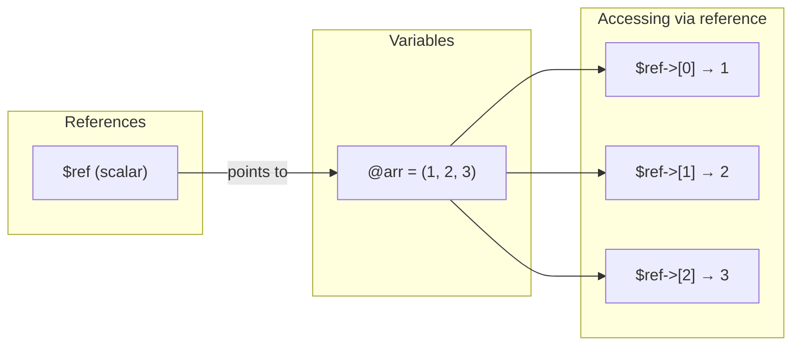
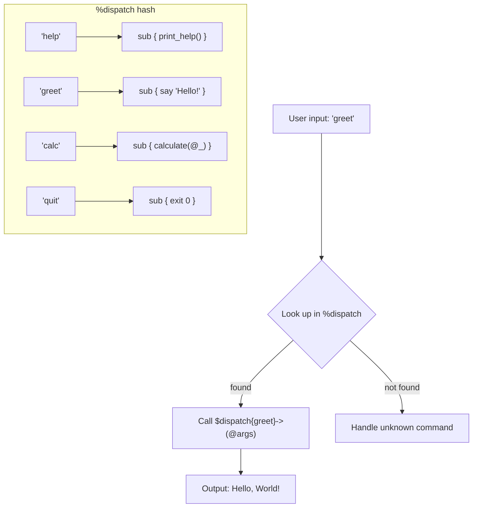

# Subroutines and References

## Building Reusable Code and Complex Data

**Version:** 1.1
**Year:** 2026

---

## Copyright Notice

Copyright (c) 2025-2026 Ryan Thomas Robson / Robworks Software LLC. Licensed under [CC BY-NC-ND 4.0](../../LICENSE-CONTENT). You may share this material for non-commercial purposes with attribution, but you may not distribute modified versions.

---

Once your programs grow beyond a screenful of code, you need a way to organize logic into reusable pieces. [**Subroutines**](https://perldoc.perl.org/perlsub) are Perl's tool for this - named blocks of code you can call from anywhere. And once you start passing data between subroutines, you run straight into Perl's flat-list problem: arrays and hashes flatten when passed as arguments. [**References**](https://perldoc.perl.org/perlref) solve this by letting a single scalar point to an entire data structure. Together, subroutines and references unlock closures, callbacks, dispatch tables, and every complex data pattern Perl supports.

---

## Subroutines

A subroutine is declared with [**`sub`**](https://perldoc.perl.org/perlfunc#sub-NAME-BLOCK):

```perl
sub greet {
    print "Hello, world!\n";
}
```

Call it by name with parentheses:

```perl
greet();
```

You can also call a subroutine with the `&` sigil - `&greet()` - but this is rarely needed in modern Perl. The `&` form has special behavior: calling `&greet` without parentheses passes the current `@_` to the sub, which is almost never what you want. Stick with `greet()`.

```perl
# These are equivalent
greet();
&greet();

# This is different - passes the caller's @_ into greet
&greet;
```

!!! tip "Forward Declarations"
    If you call a subroutine before its definition appears in the file, Perl will find it as long as it is defined somewhere in the same package. You do not need forward declarations for simple cases. However, if you use prototypes or want to call a sub without parentheses like a built-in, you need to declare or define it before the call site.

---

## Arguments and @_

When you call a subroutine with arguments, Perl places them in the special array [**`@_`**](https://perldoc.perl.org/perlvar#@_):

```perl
sub greet_user {
    my $name = $_[0];
    print "Hello, $name!\n";
}

greet_user("Alice");   # Hello, Alice!
```

Two idiomatic patterns dominate argument handling:

**The `shift` idiom** - pull arguments off one at a time:

```perl
sub greet_user {
    my $name = shift;
    print "Hello, $name!\n";
}
```

When called without arguments, [**`shift`**](https://perldoc.perl.org/perlfunc#shift-ARRAY) operates on `@_` inside a subroutine. This is the most common pattern for subs with one or two arguments.

**List assignment** - unpack all arguments at once:

```perl
sub add {
    my ($x, $y) = @_;
    return $x + $y;
}

print add(3, 7);   # 10
```

Use list assignment when you have multiple parameters - it documents the expected arguments clearly.

### @_ Is an Alias

Here is the critical detail: `@_` does not contain copies of the arguments. Each element of `@_` is an **alias** to the original variable. Modifying `$_[0]` changes the caller's variable:

```perl
sub double_in_place {
    $_[0] *= 2;
}

my $val = 5;
double_in_place($val);
print $val;   # 10 - the original changed!
```

This aliasing behavior is efficient (no copying), but dangerous if you are not expecting it. The `my ($x, $y) = @_` pattern creates local copies, which is why it is preferred for safety.

!!! danger "Modifying Literal Arguments"
    If you call `double_in_place(5)` with a literal, Perl will throw an error: "Modification of a read-only value attempted." You can only modify `$_[0]` when the caller passed a variable.

### No Argument Checking

Perl does not enforce argument counts. Call a sub with too few arguments and the extras are `undef`. Call with too many and the extras sit unused in `@_`:

```perl
sub needs_two {
    my ($a, $b) = @_;
    return $a + $b;
}

needs_two(1);         # $b is undef - warning under 'use warnings'
needs_two(1, 2, 3);   # 3 is silently ignored
```

This flexibility is intentional - it enables variadic subs and optional arguments - but it means you should validate arguments yourself when correctness matters.

```terminal
title: Subroutine Basics
steps:
  - command: "perl -e 'sub greet { my $name = shift; print \"Hello, $name!\\n\"; } greet(\"Alice\");'"
    output: "Hello, Alice!"
    narration: "The shift idiom pulls the first argument from @_. Inside a subroutine, shift without arguments operates on @_ by default."
  - command: "perl -e 'sub add { my ($x, $y) = @_; return $x + $y; } print add(3, 7), \"\\n\";'"
    output: "10"
    narration: "List assignment unpacks all arguments at once. return sends a value back to the caller. This is the standard pattern for multi-argument subs."
  - command: "perl -e 'sub double { $_[0] *= 2; } my $n = 5; double($n); print \"$n\\n\";'"
    output: "10"
    narration: "Modifying $_[0] changes the caller's variable because @_ aliases the originals. This is efficient but surprising if you are not expecting it."
  - command: "perl -e 'use warnings; sub needs_two { my ($a, $b) = @_; return $a + $b; } print needs_two(4), \"\\n\";'"
    output: "Use of uninitialized value $b in addition (+) at -e line 1.\n4"
    narration: "Perl does not enforce argument counts. Calling with too few arguments leaves the rest as undef, which triggers a warning under 'use warnings'."
```

```quiz
question: "What happens when you modify $_[0] inside a subroutine?"
type: multiple-choice
options:
  - text: "It changes a local copy - the caller's variable is unaffected"
    feedback: "This would be true if you used my ($x) = @_ first, but $_[0] directly aliases the caller's argument. Modifying it changes the original."
  - text: "It changes the caller's variable because @_ aliases the original values"
    correct: true
    feedback: "Correct! @_ does not contain copies. Each element is an alias to the actual argument. This is why my ($x, $y) = @_ is preferred - it creates safe local copies."
  - text: "It causes a runtime error because @_ is read-only"
    feedback: "@_ is not read-only. You can modify its elements freely, and those modifications affect the caller's variables. Only literals (like the number 5) are read-only."
  - text: "It modifies @_ but the change is lost when the subroutine returns"
    feedback: "The change persists after the sub returns because $_[0] is an alias to the caller's variable, not a temporary copy."
```

---

## Return Values

Subroutines return values with [**`return`**](https://perldoc.perl.org/perlfunc#return-EXPR):

```perl
sub square {
    my $n = shift;
    return $n * $n;
}

my $result = square(5);   # 25
```

If you omit `return`, the sub returns the value of the **last evaluated expression**:

```perl
sub square {
    my $n = shift;
    $n * $n;    # implicitly returned
}
```

Both styles are common. Explicit `return` is clearer for complex subs. Implicit return is idiomatic for short, simple subs.

### Returning Lists

A sub can return a list:

```perl
sub min_max {
    my @nums = sort { $a <=> $b } @_;
    return ($nums[0], $nums[-1]);
}

my ($low, $high) = min_max(42, 7, 19, 3, 88);
print "Low: $low, High: $high\n";   # Low: 3, High: 88
```

### Context-Sensitive Returns with wantarray

[**`wantarray`**](https://perldoc.perl.org/perlfunc#wantarray) tells your sub how the caller is using its return value:

```perl
sub timestamp {
    my @parts = (2025, 6, 15, 14, 30, 0);
    if (wantarray) {
        return @parts;                          # list context
    } else {
        return sprintf "%04d-%02d-%02d %02d:%02d:%02d", @parts;  # scalar context
    }
}

my @components = timestamp();    # (2025, 6, 15, 14, 30, 0)
my $formatted  = timestamp();    # "2025-06-15 14:30:00"
```

`wantarray` returns true in list context, false in scalar context, and `undef` in void context (where the return value is discarded). Despite the name, it detects list context, not specifically array context.

### Returning Nothing

`return` with no argument returns an empty list in list context or `undef` in scalar context. This is the correct way to signal "no meaningful value":

```perl
sub find_user {
    my $name = shift;
    return unless exists $users{$name};   # return undef/empty list
    return $users{$name};
}
```

!!! warning "return undef vs. bare return"
    `return undef` always returns a single `undef` value - even in list context, where it produces a one-element list `(undef)`. A bare `return` adapts to context: `undef` in scalar, empty list `()` in list. Prefer bare `return` for "nothing found" situations.

---

## Named Parameters

For subs with many parameters, positional arguments become unreadable. Named parameters use a hash:

```perl
sub create_user {
    my (%opts) = @_;
    my $name  = $opts{name}  // 'Anonymous';
    my $email = $opts{email} // '';
    my $role  = $opts{role}  // 'user';

    print "Created $name ($role) - $email\n";
}

create_user(name => 'Alice', email => 'alice@example.com', role => 'admin');
create_user(name => 'Bob');   # defaults for email and role
```

The `//=` operator (defined-or assignment) is perfect for defaults:

```perl
sub connect_db {
    my (%opts) = @_;
    $opts{host}    //= 'localhost';
    $opts{port}    //= 5432;
    $opts{timeout} //= 30;

    print "Connecting to $opts{host}:$opts{port} (timeout: $opts{timeout}s)\n";
}
```

### Hashref Parameters

You can also pass a hashref for slightly different syntax at the call site:

```perl
sub create_user {
    my ($opts) = @_;
    my $name = $opts->{name} // 'Anonymous';
    # ...
}

create_user({ name => 'Alice', role => 'admin' });
```

The tradeoff: hashref syntax requires braces at the call site, but it makes the argument clearly a single unit and lets you pass it through other functions unchanged.

```code-walkthrough
language: perl
title: Configuration Parser with Named Parameters
code: |
  use strict;
  use warnings;

  sub read_config {
      my (%opts) = @_;
      my $file   = $opts{file}   // 'config.ini';
      my $strict = $opts{strict} // 0;

      my %config;
      open my $fh, '<', $file or do {
          die "Cannot open $file: $!" if $strict;
          warn "Cannot open $file: $!, using defaults\n";
          return %config;
      };

      while (my $line = <$fh>) {
          chomp $line;
          next if $line =~ /^\s*#/;
          next if $line =~ /^\s*$/;
          if ($line =~ /^\s*(\w+)\s*=\s*(.+?)\s*$/) {
              $config{$1} = $2;
          }
      }
      close $fh;
      return %config;
  }

  my %settings = read_config(
      file   => '/etc/app.conf',
      strict => 1,
  );
annotations:
  - line: 5
    text: "Named parameters arrive as a flat list of key-value pairs, which Perl assigns directly into the %opts hash."
  - line: 6
    text: "The // (defined-or) operator provides defaults. If the caller did not pass 'file', $opts{file} is undef and the default 'config.ini' is used."
  - line: 7
    text: "The strict option controls error behavior - die on failure vs. warn and continue. Named params make this self-documenting at the call site."
  - line: 10
    text: "The do { ... } block lets you run multiple statements after 'or'. If strict mode is on, die. Otherwise, warn and return an empty config."
  - line: 18
    text: "Skip comment lines (starting with #) and blank lines. The \\s* allows leading whitespace."
  - line: 20
    text: "Regex captures the key (\\w+) and value (.+?) from lines like 'host = localhost'. The \\s* around = allows flexible spacing."
  - line: 28
    text: "At the call site, named parameters read clearly - you see exactly what each argument means without counting positions."
```

---

## References

So far, every variable you have worked with holds data directly. An array holds a list of scalars. A hash holds key-value pairs. But what if you need to store an array inside another array, or pass a hash to a subroutine without flattening it?

A [**reference**](https://perldoc.perl.org/perlref) is a scalar value that **points to** another variable. Think of it as an address - the reference itself is small (one scalar), but it gives you access to the full data structure it points to.

### Creating References with \

The backslash operator `\` creates a reference to any variable:

```perl
my $name = "Alice";
my $ref  = \$name;       # scalar reference

my @colors = ('red', 'green', 'blue');
my $aref   = \@colors;   # array reference

my %config = (host => 'localhost', port => 8080);
my $href   = \%config;   # hash reference

sub greet { print "Hello!\n" }
my $cref = \&greet;       # code reference
```

Each reference is a scalar - it fits in a `$` variable, an array element, or a hash value. This is the key insight: references let you nest complex structures inside scalar slots.

### Reference Types

| Type | Created with | Points to |
|------|-------------|-----------|
| Scalar ref | `\$scalar` | A scalar variable |
| Array ref | `\@array` or `[...]` | An array |
| Hash ref | `\%hash` or `{...}` | A hash |
| Code ref | `\&sub` or `sub {...}` | A subroutine |
| Regex ref | `qr/.../` | A compiled regex |
| Ref ref | `\$ref` (when `$ref` is already a ref) | Another reference |

### How References Work in Memory



The reference `$ref` is a single scalar that holds the memory address of `@arr`. Dereferencing `$ref` gives you access to the original array's elements. Changing `$ref->[0]` changes `$arr[0]` - they are the same data.

### What a Reference Looks Like

If you print a reference directly, you get a string like `ARRAY(0x55a1234)` - the type and memory address:

```perl
my @arr = (1, 2, 3);
my $ref = \@arr;
print $ref;        # ARRAY(0x55a1234) - not useful for display
print ref $ref;    # ARRAY - the type
```

References are always true in boolean context, even if they point to an empty array or hash.

---

## Dereferencing

Dereferencing means following the reference back to the data it points to. Perl offers two main syntaxes.

### Arrow Notation

The [**arrow operator `->`**](https://perldoc.perl.org/perlop#The-Arrow-Operator) is the cleanest way to dereference:

```perl
my $aref = [10, 20, 30];
print $aref->[0];    # 10
print $aref->[2];    # 30

my $href = { name => 'Alice', age => 30 };
print $href->{name};   # Alice
print $href->{age};    # 30

my $cref = sub { return 42 };
print $cref->();       # 42
```

Arrow notation reads left to right and handles nested structures naturally:

```perl
my $data = {
    users => [
        { name => 'Alice', scores => [95, 87, 92] },
        { name => 'Bob',   scores => [78, 84, 90] },
    ],
};

print $data->{users}[0]{name};         # Alice
print $data->{users}[1]{scores}[2];    # 90
```

Between adjacent brackets (`[]` or `{}`), the arrow is optional. The first arrow after a variable name is always required.

### Block Syntax

For cases where you need to dereference the entire structure at once, use block syntax with sigils:

```perl
my $aref = [10, 20, 30];

# Get the whole array
my @array = @{$aref};

# Get the whole hash
my $href = { a => 1, b => 2 };
my %hash = %{$href};

# Single element (less common than arrow notation)
my $val = ${$aref}[0];     # same as $aref->[0]
my $val = ${$href}{a};     # same as $href->{a}
```

Block syntax is essential when you need to use array/hash operations on a reference:

```perl
my $aref = [5, 3, 8, 1];

# Sort the referenced array
my @sorted = sort { $a <=> $b } @{$aref};

# Push onto a referenced array
push @{$aref}, 99;

# Get keys from a referenced hash
my $href = { x => 1, y => 2, z => 3 };
my @keys = keys %{$href};
```

!!! tip "When to Use Which"
    Use arrow notation (`$ref->[0]`, `$ref->{key}`) for accessing individual elements - it is the most readable. Use block syntax (`@{$ref}`, `%{$ref}`) when you need the whole array or hash for operations like `sort`, `push`, `keys`, or iteration.

```terminal
title: References and Dereferencing
steps:
  - command: "perl -e 'my $x = 42; my $ref = \\$x; print \"Ref: $ref\\n\"; print \"Val: $$ref\\n\";'"
    output: "Ref: SCALAR(0x...)\nVal: 42"
    narration: "A scalar reference holds the address of $x. Printing the reference shows its type and address. Dereferencing with $$ retrieves the original value."
  - command: "perl -e 'my @arr = (10, 20, 30); my $ref = \\@arr; print $ref->[1], \"\\n\";'"
    output: "20"
    narration: "The backslash creates a reference to @arr. Arrow notation $ref->[1] accesses element 1 of the referenced array. This is the most common dereference syntax."
  - command: "perl -e 'my $href = { name => \"Alice\", age => 30 }; print $href->{name}, \"\\n\"; print join(\", \", keys %{$href}), \"\\n\";'"
    output: "Alice\nname, age"
    narration: "Arrow notation for single values, block syntax (%{$href}) when you need the whole hash. keys requires a hash, not a hashref, so block syntax unwraps it."
  - command: "perl -e 'my $data = { users => [{ name => \"Alice\" }, { name => \"Bob\" }] }; print $data->{users}[1]{name}, \"\\n\";'"
    output: "Bob"
    narration: "Nested access chains naturally with arrows. The arrow between adjacent brackets is optional, so ->{users}[1]{name} and ->{users}->[1]->{name} are identical."
```

---

## Anonymous Data Structures

You do not always need a named variable to create a reference. Anonymous constructors create data structures and return a reference directly.

### Anonymous Arrays: [ ]

Square brackets create an anonymous array and return a reference to it:

```perl
my $colors = ['red', 'green', 'blue'];
print $colors->[0];   # red
```

This is equivalent to:

```perl
my @temp = ('red', 'green', 'blue');
my $colors = \@temp;
```

But without the temporary variable.

### Anonymous Hashes: { }

Curly braces in a value context create an anonymous hash and return a reference:

```perl
my $user = { name => 'Alice', age => 30 };
print $user->{name};   # Alice
```

### Anonymous Subs: sub { }

A `sub` without a name creates an anonymous code reference:

```perl
my $double = sub { return $_[0] * 2 };
print $double->(5);   # 10
```

Anonymous subs are the foundation of closures and callbacks.

### The Difference Between () and []/{}

This distinction is fundamental:

```perl
# Parentheses create a LIST (flattens into surrounding context)
my @arr = (1, 2, 3);

# Square brackets create an ARRAYREF (a single scalar value)
my $ref = [1, 2, 3];

# These are NOT the same
my @flat = (1, 2, (3, 4), 5);   # @flat = (1, 2, 3, 4, 5) - flattened!
my @nested = (1, 2, [3, 4], 5); # @nested has 4 elements, third is a ref
```

Parentheses are for grouping and list context. Brackets are for creating references. This is why nested data structures require references - parentheses would just flatten everything into one big list.

```quiz
question: "What is the difference between \\@array and [@array]?"
type: multiple-choice
options:
  - text: "They are identical - both create a reference to the same array"
    feedback: "They are not identical. \\@array points to the original @array, while [@array] creates a new anonymous array containing copies of @array's elements."
  - text: "\\@array creates a reference to the existing array; [@array] creates a reference to a new copy"
    correct: true
    feedback: "Correct! \\@array gives you a reference to the original - modifying through the ref changes @array. [@array] copies the elements into a brand new anonymous array. Changes through this ref do not affect the original @array."
  - text: "[@array] is a syntax error - you cannot use @ inside square brackets"
    feedback: "This is valid Perl. [@array] creates an anonymous array containing copies of @array's elements and returns a reference to it."
  - text: "\\@array creates a deep copy; [@array] creates a shallow reference"
    feedback: "It is the opposite. \\@array is a direct reference (no copy). [@array] copies the top-level elements into a new array. Neither performs a deep copy."
```

---

## The ref() Function

The [**`ref()`**](https://perldoc.perl.org/perlfunc#ref-EXPR) function tells you what type of reference a scalar holds:

```perl
my $sref = \42;
my $aref = [1, 2, 3];
my $href = { a => 1 };
my $cref = sub { 1 };
my $rref = \$aref;

print ref $sref;   # SCALAR
print ref $aref;   # ARRAY
print ref $href;   # HASH
print ref $cref;   # CODE
print ref $rref;   # REF

# Not a reference
my $plain = "hello";
print ref $plain;  # '' (empty string)
```

`ref()` returns an empty string for non-references, which is false in boolean context. This makes it useful as a type check:

```perl
sub process {
    my $arg = shift;

    if (!ref $arg) {
        print "Got a plain scalar: $arg\n";
    } elsif (ref $arg eq 'ARRAY') {
        print "Got an array with ", scalar @{$arg}, " elements\n";
    } elsif (ref $arg eq 'HASH') {
        print "Got a hash with keys: ", join(', ', keys %{$arg}), "\n";
    } elsif (ref $arg eq 'CODE') {
        print "Got a coderef, calling it: ", $arg->(), "\n";
    }
}

process("hello");
process([1, 2, 3]);
process({ x => 10 });
process(sub { "result" });
```

For blessed objects, `ref()` returns the class name instead of the underlying type. Use [**`Scalar::Util::reftype`**](https://perldoc.perl.org/Scalar::Util#reftype) to get the underlying reference type regardless of blessing.

---

## Closures

A **closure** is a subroutine that captures variables from its enclosing lexical scope. When the enclosing scope ends, the captured variables survive as long as the closure exists:

```perl
sub make_counter {
    my $count = 0;
    return sub { return ++$count };
}

my $counter = make_counter();
print $counter->();   # 1
print $counter->();   # 2
print $counter->();   # 3
```

Each call to `make_counter` creates a fresh `$count` variable. The returned sub holds a reference to that specific `$count`. Even after `make_counter` returns and its scope ends, the `$count` variable lives on because the closure still references it.

### Independent Closures

Each call produces an independent closure with its own captured variable:

```perl
my $counter_a = make_counter();
my $counter_b = make_counter();

print $counter_a->();   # 1
print $counter_a->();   # 2
print $counter_b->();   # 1  - independent counter
print $counter_a->();   # 3
```

### Closure Factory Pattern

Closures are powerful for creating families of related functions:

```perl
sub make_multiplier {
    my $factor = shift;
    return sub { return $_[0] * $factor };
}

my $double = make_multiplier(2);
my $triple = make_multiplier(3);

print $double->(5);    # 10
print $triple->(5);    # 15
```

### Closures for Callbacks

Closures naturally carry context into callbacks:

```perl
sub fetch_data {
    my (%opts) = @_;
    my $url     = $opts{url};
    my $retries = $opts{retries} // 3;

    my $on_success = $opts{on_success} // sub { print "Data: $_[0]\n" };
    my $on_error   = $opts{on_error}   // sub { warn "Error: $_[0]\n" };

    # ... fetch logic would go here ...
    # Call $on_success->($data) or $on_error->($message)
}

my @results;
fetch_data(
    url        => 'https://api.example.com/data',
    on_success => sub { push @results, $_[0] },   # closure captures @results
    on_error   => sub { warn "Failed: $_[0]\n" },
);
```

The `on_success` callback is a closure that captures `@results` from the calling scope. When the callback fires, it pushes data into the original array.

```exercise
title: Math Utility Library
difficulty: beginner
scenario: |
  Build a collection of math utility subroutines plus a closure factory.

  Write the following subs:

  1. `max(@nums)` - returns the largest number from a list
  2. `min(@nums)` - returns the smallest number from a list
  3. `sum(@nums)` - returns the sum of all numbers
  4. `average(@nums)` - returns the arithmetic mean (sum / count)
  5. `make_multiplier($factor)` - returns a closure that multiplies its argument by $factor

  Then demonstrate them:
  - Call each function with the list (4, 7, 2, 9, 1, 5)
  - Create a doubler and tripler using make_multiplier
  - Print all results
hints:
  - "For max: start with the first element, loop through the rest comparing"
  - "Or use sort: (sort { $b <=> $a } @nums)[0]"
  - "sum can use a loop: my $total = 0; $total += $_ for @nums; return $total;"
  - "average is just sum(@nums) / scalar(@nums) - but check for empty list first"
  - "make_multiplier returns sub { return $_[0] * $factor }"
solution: |
  ```perl
  use strict;
  use warnings;

  sub max {
      my $max = shift;
      for (@_) { $max = $_ if $_ > $max }
      return $max;
  }

  sub min {
      my $min = shift;
      for (@_) { $min = $_ if $_ < $min }
      return $min;
  }

  sub sum {
      my $total = 0;
      $total += $_ for @_;
      return $total;
  }

  sub average {
      return undef unless @_;
      return sum(@_) / scalar @_;
  }

  sub make_multiplier {
      my $factor = shift;
      return sub { return $_[0] * $factor };
  }

  my @nums = (4, 7, 2, 9, 1, 5);
  printf "Numbers: %s\n", join(', ', @nums);
  printf "Max:     %d\n", max(@nums);
  printf "Min:     %d\n", min(@nums);
  printf "Sum:     %d\n", sum(@nums);
  printf "Average: %.2f\n", average(@nums);

  my $double = make_multiplier(2);
  my $triple = make_multiplier(3);
  printf "Double 7: %d\n", $double->(7);
  printf "Triple 7: %d\n", $triple->(7);
  ```

  Output:
  ```
  Numbers: 4, 7, 2, 9, 1, 5
  Max:     9
  Min:     1
  Sum:     28
  Average: 4.67
  Double 7: 14
  Triple 7: 21
  ```

  The make_multiplier function demonstrates closures - each returned sub
  captures its own $factor value. The $double and $triple closures are
  independent, each holding a different $factor.
```

---

## Passing Complex Data

One of the first walls you hit in Perl is the **flattening problem**. Arrays and hashes flatten into a single list when passed to a subroutine:

```perl
sub print_both {
    my (@first, @second) = @_;   # BUG: @first absorbs everything!
    print "First: @first\n";
    print "Second: @second\n";   # always empty
}

my @a = (1, 2, 3);
my @b = (4, 5, 6);
print_both(@a, @b);
# First: 1 2 3 4 5 6   - @first consumed all six values
# Second:               - @second got nothing
```

The caller passes `(1, 2, 3, 4, 5, 6)` - a single flat list. The sub has no way to know where `@a` ended and `@b` began.

### The Solution: Pass References

References keep data structures intact through the call:

```perl
sub print_both {
    my ($first_ref, $second_ref) = @_;
    print "First: @{$first_ref}\n";
    print "Second: @{$second_ref}\n";
}

my @a = (1, 2, 3);
my @b = (4, 5, 6);
print_both(\@a, \@b);
# First: 1 2 3
# Second: 4 5 6
```

Each reference is a single scalar, so the list assignment works correctly. Inside the sub, you dereference to access the data.

### Returning Complex Structures

The same applies to return values. Return references when you need to return multiple arrays or hashes:

```perl
sub split_even_odd {
    my @even;
    my @odd;
    for (@_) {
        if ($_ % 2 == 0) { push @even, $_ }
        else              { push @odd,  $_ }
    }
    return (\@even, \@odd);
}

my ($even_ref, $odd_ref) = split_even_odd(1..10);
print "Even: @{$even_ref}\n";   # Even: 2 4 6 8 10
print "Odd:  @{$odd_ref}\n";    # Odd:  1 3 5 7 9
```

!!! warning "Do Not Return References to Temporaries Created with my - Except When You Can"
    Actually, Perl handles this correctly. The `my @even` array in `split_even_odd` survives after the sub returns because the returned reference keeps it alive. This is the same mechanism that makes closures work. Perl uses reference counting - the data lives as long as something references it.

---

## Callbacks and Higher-Order Functions

A **higher-order function** is a subroutine that takes another subroutine as an argument or returns one. You have already used one - `sort` with a custom comparator:

```perl
my @sorted = sort { $a <=> $b } @numbers;
```

The `{ $a <=> $b }` block is an anonymous sub passed to `sort`.

### Passing Coderefs as Arguments

```perl
sub apply_to_list {
    my ($func, @items) = @_;
    return map { $func->($_) } @items;
}

my @doubled = apply_to_list(sub { $_[0] * 2 }, 1, 2, 3, 4);
print "@doubled\n";   # 2 4 6 8

my @lengths = apply_to_list(sub { length $_[0] }, 'hello', 'world', 'perl');
print "@lengths\n";   # 5 5 4
```

### Custom Comparators for sort

The `sort` built-in accepts a named sub or code block as a comparator:

```perl
# Sort strings by length, then alphabetically
my @words = qw(perl python go javascript ruby);
my @sorted = sort {
    length($a) <=> length($b)
    ||
    $a cmp $b
} @words;

print "@sorted\n";   # go perl ruby python javascript
```

You can also pass a named sub:

```perl
sub by_length { length($a) <=> length($b) }
my @sorted = sort by_length @words;
```

### Dispatch Tables

A **dispatch table** is a hash that maps names to coderefs. It replaces long `if`/`elsif` chains with a clean lookup:

```perl
my %dispatch = (
    add => sub { return $_[0] + $_[1] },
    sub => sub { return $_[0] - $_[1] },
    mul => sub { return $_[0] * $_[1] },
    div => sub { return $_[1] != 0 ? $_[0] / $_[1] : 'Error: division by zero' },
);

my $op = 'add';
if (exists $dispatch{$op}) {
    my $result = $dispatch{$op}->(10, 3);
    print "$op: $result\n";   # add: 13
}
```

Dispatch tables scale better than conditionals - adding a new operation means adding one hash entry, not modifying a chain of `if` statements.

### Dispatch Table Architecture



The dispatch table maps string keys to code references. The lookup is O(1) regardless of how many commands you support, and each handler is self-contained.

```exercise
title: Dispatch Table Command Router
difficulty: intermediate
scenario: |
  Build a mini command-line application powered by a dispatch table.

  Your program should:
  1. Define a %dispatch hash mapping command names to handler coderefs
  2. Support these commands:
     - `help` - prints available commands
     - `greet <name>` - prints "Hello, <name>!"
     - `calc <op> <a> <b>` - performs add/sub/mul/div on two numbers
     - `quit` - prints "Goodbye!" and exits
  3. Process a hardcoded list of commands (simulate user input)
  4. Handle unknown commands gracefully

  Each handler should be a coderef stored in the dispatch hash.
hints:
  - "Define handlers: my %dispatch = (help => sub { ... }, greet => sub { ... });"
  - "Parse commands: my ($cmd, @args) = split /\\s+/, $input;"
  - "Look up and call: $dispatch{$cmd}->(@args) if exists $dispatch{$cmd};"
  - "The calc handler can use its own nested dispatch table for operations"
solution: |
  ```perl
  use strict;
  use warnings;

  my %calc_ops = (
      add => sub { $_[0] + $_[1] },
      sub => sub { $_[0] - $_[1] },
      mul => sub { $_[0] * $_[1] },
      div => sub { $_[1] != 0 ? $_[0] / $_[1] : 'Error: div by zero' },
  );

  my %dispatch;
  %dispatch = (
      help => sub {
          print "Available commands: ", join(', ', sort keys %dispatch), "\n";
      },
      greet => sub {
          my $name = $_[0] // 'World';
          print "Hello, $name!\n";
      },
      calc => sub {
          my ($op, $a, $b) = @_;
          unless ($op && defined $a && defined $b) {
              print "Usage: calc <op> <a> <b>\n";
              return;
          }
          if (exists $calc_ops{$op}) {
              printf "%s %s %s = %s\n", $a, $op, $b, $calc_ops{$op}->($a, $b);
          } else {
              print "Unknown operation: $op (try: add, sub, mul, div)\n";
          }
      },
      quit => sub {
          print "Goodbye!\n";
      },
  );

  # Simulate user input
  my @commands = (
      'help',
      'greet Alice',
      'calc add 10 3',
      'calc mul 7 6',
      'calc div 10 0',
      'unknown_command',
      'quit',
  );

  for my $input (@commands) {
      print "> $input\n";
      my ($cmd, @args) = split /\s+/, $input;
      if (exists $dispatch{$cmd}) {
          $dispatch{$cmd}->(@args);
      } else {
          print "Unknown command: $cmd (type 'help' for options)\n";
      }
      last if $cmd eq 'quit';
  }
  ```

  Output:
  ```
  > help
  Available commands: calc, greet, help, quit
  > greet Alice
  Hello, Alice!
  > calc add 10 3
  10 add 3 = 13
  > calc mul 7 6
  7 mul 6 = 42
  > calc div 10 0
  10 div 0 = Error: div by zero
  > unknown_command
  Unknown command: unknown_command (type 'help' for options)
  > quit
  Goodbye!
  ```

  The dispatch table makes adding new commands trivial - just add another
  key-value pair. The nested %calc_ops table shows that dispatch tables
  compose naturally.
```

---

## Practical Patterns

The concepts covered in this guide combine into patterns you will use repeatedly in real Perl programs.

### Memoization

**Memoization** caches the return value of a function based on its arguments so repeated calls with the same inputs return instantly:

```perl
sub memoize {
    my $func = shift;
    my %cache;
    return sub {
        my $key = join("\0", @_);
        unless (exists $cache{$key}) {
            $cache{$key} = $func->(@_);
        }
        return $cache{$key};
    };
}

# Expensive calculation wrapped with memoization
my $fibonacci = memoize(sub {
    my $n = shift;
    return $n if $n <= 1;
    # Note: this recursive version needs the $fibonacci variable
    # to be in scope, which requires a different setup for recursion.
    # For demonstration, here is an iterative version:
    my ($a, $b) = (0, 1);
    for (2..$n) { ($a, $b) = ($b, $a + $b) }
    return $b;
});

print $fibonacci->(10), "\n";   # 55
print $fibonacci->(10), "\n";   # 55 - returned from cache
```

The `memoize` function is a higher-order function that returns a closure. The closure captures both the original `$func` and the `%cache` hash. For production use, the [**`Memoize`**](https://perldoc.perl.org/Memoize) core module does this with more features.

### Builder Pattern

Chain method-like calls using closures that return themselves:

```perl
sub query_builder {
    my %query = (table => '', conditions => [], columns => ['*'], limit => undef);

    my $self;
    $self = {
        from => sub {
            $query{table} = shift;
            return $self;
        },
        select => sub {
            $query{columns} = [@_];
            return $self;
        },
        where => sub {
            push @{$query{conditions}}, shift;
            return $self;
        },
        limit => sub {
            $query{limit} = shift;
            return $self;
        },
        build => sub {
            my $sql = "SELECT " . join(', ', @{$query{columns}});
            $sql .= " FROM $query{table}";
            if (@{$query{conditions}}) {
                $sql .= " WHERE " . join(' AND ', @{$query{conditions}});
            }
            $sql .= " LIMIT $query{limit}" if defined $query{limit};
            return $sql;
        },
    };

    return $self;
}

my $q = query_builder();
my $sql = $q->{from}->('users')
            ->{select}->('name', 'email')
            ->{where}->('active = 1')
            ->{where}->('age > 18')
            ->{limit}->(10)
            ->{build}->();

print "$sql\n";
# SELECT name, email FROM users WHERE active = 1 AND age > 18 LIMIT 10
```

This pattern previews object-oriented Perl - the hash of closures sharing `%query` is essentially an object with methods.

### Configuration Parser

Here is a practical example that combines subroutines, references, named parameters, and closures:

```perl
use strict;
use warnings;

sub create_parser {
    my (%opts) = @_;
    my $comment_char = $opts{comment}   // '#';
    my $separator    = $opts{separator} // '=';
    my $validators   = $opts{validators} // {};

    return sub {
        my ($input) = @_;
        my %config;
        my @errors;

        my @lines = ref $input eq 'ARRAY' ? @{$input} : split /\n/, $input;

        for my $i (0..$#lines) {
            my $line = $lines[$i];
            $line =~ s/^\s+|\s+$//g;                        # trim
            next if $line eq '' || $line =~ /^\Q$comment_char/;  # skip blanks/comments

            unless ($line =~ /^(\w+)\s*\Q$separator\E\s*(.+)$/) {
                push @errors, "Line ${\($i+1)}: malformed entry";
                next;
            }

            my ($key, $value) = ($1, $2);

            if (exists $validators->{$key}) {
                unless ($validators->{$key}->($value)) {
                    push @errors, "Line ${\($i+1)}: invalid value for $key";
                    next;
                }
            }

            $config{$key} = $value;
        }

        return (\%config, \@errors);
    };
}

# Create a parser with validation rules
my $parse = create_parser(
    comment    => '#',
    separator  => '=',
    validators => {
        port    => sub { $_[0] =~ /^\d+$/ && $_[0] > 0 && $_[0] < 65536 },
        debug   => sub { $_[0] =~ /^(true|false|0|1)$/ },
    },
);

my @config_lines = (
    '# Server configuration',
    'host = localhost',
    'port = 8080',
    'debug = true',
    'workers = 4',
);

my ($config, $errors) = $parse->(\@config_lines);

print "Config:\n";
for my $key (sort keys %{$config}) {
    printf "  %-10s = %s\n", $key, $config->{$key};
}

if (@{$errors}) {
    print "\nErrors:\n";
    print "  $_\n" for @{$errors};
}
```

Output:

```
Config:
  debug      = true
  host       = localhost
  port       = 8080
  workers    = 4
```

This example uses nearly every concept from this guide: subroutines with named parameters, references for passing arrays, anonymous subs as validators, closures to capture configuration, and hashrefs for returning complex results.

```command-builder
base: perl -e
description: Build a Perl one-liner that uses inline subroutines
options:
  - flag: ""
    type: select
    label: "Pattern"
    explanation: "Choose an inline subroutine pattern"
    choices:
      - ["'sub square { $_[0]**2 } print square(8), \"\\n\"'", "Simple sub call"]
      - ["'my @nums = (1..10); print join(\", \", map { $_**2 } @nums), \"\\n\"'", "map with transform block"]
      - ["'my @words = qw(hello world perl code); print join(\" \", grep { length($_) > 4 } @words), \"\\n\"'", "grep with filter block"]
      - ["'my @data = qw(banana apple cherry date); print join(\", \", sort { length($a) <=> length($b) } @data), \"\\n\"'", "sort with custom comparator"]
```

---

## Quick Reference

| Concept | Syntax | Description |
|---------|--------|-------------|
| Declare sub | `sub name { ... }` | Named subroutine |
| Call sub | `name(@args)` | Call with arguments |
| Arguments | `my ($x, $y) = @_` | Unpack arguments (copies) |
| shift idiom | `my $x = shift` | Pull first argument |
| Return value | `return $val` | Explicit return |
| Scalar ref | `my $ref = \$x` | Reference to scalar |
| Array ref | `my $ref = \@arr` | Reference to array |
| Hash ref | `my $ref = \%h` | Reference to hash |
| Code ref | `my $ref = \&sub` | Reference to subroutine |
| Anon arrayref | `[1, 2, 3]` | Anonymous array reference |
| Anon hashref | `{ k => 'v' }` | Anonymous hash reference |
| Anon sub | `sub { ... }` | Anonymous code reference |
| Deref arrow | `$ref->[0]`, `$ref->{k}` | Access element via reference |
| Deref block | `@{$ref}`, `%{$ref}` | Dereference entire structure |
| Ref type | `ref $ref` | Returns 'ARRAY', 'HASH', etc. |
| Closure | `sub { ... $captured }` | Sub capturing outer variables |
| Dispatch | `$hash{$key}->(@args)` | Call coderef from hash |

---

## Further Reading

- [perlsub](https://perldoc.perl.org/perlsub) - subroutine declaration, calling conventions, prototypes, and signatures
- [perlref](https://perldoc.perl.org/perlref) - references, dereferencing, and reference-related syntax
- [perlreftut](https://perldoc.perl.org/perlreftut) - Mark Jason Dominus's reference tutorial - the clearest introduction
- [perldsc](https://perldoc.perl.org/perldsc) - data structures cookbook with recipes for arrays of arrays, hashes of hashes, etc.
- [perllol](https://perldoc.perl.org/perllol) - manipulating arrays of arrays (lists of lists)
- [perlsub - Closures](https://perldoc.perl.org/perlsub#Closures) - official closures documentation
- [Memoize](https://perldoc.perl.org/Memoize) - core module for automatic memoization
- [Learning Perl, Chapters 4 and 13](https://www.oreilly.com/library/view/learning-perl-8th/9781492094944/) - subroutines and references in the "Llama Book"
- [Intermediate Perl](https://www.oreilly.com/library/view/intermediate-perl-2nd/9781449343781/) - the "Alpaca Book," entirely focused on references, data structures, and OOP
- [Higher-Order Perl](https://hop.perl.plover.com/) - Mark Jason Dominus's free book on closures, iterators, and functional techniques

---

**Previous:** [Regular Expressions](regular-expressions.md) | **Next:** [File I/O and System Interaction](file-io-and-system.md) | [Back to Index](README.md)
