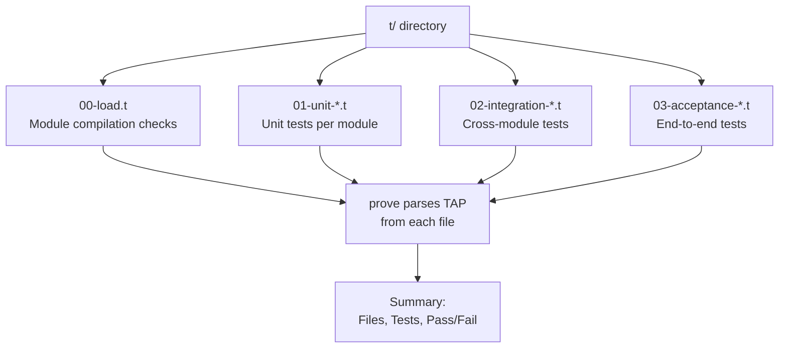
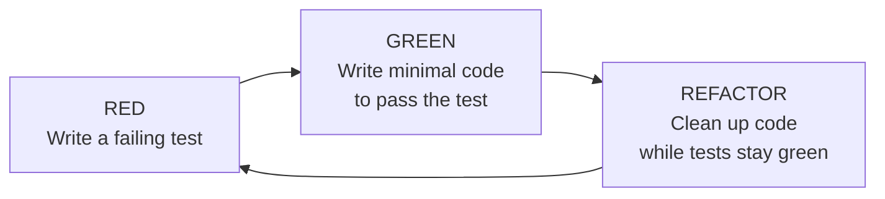

# Testing

## Perl's Testing Culture

**Version:** 1.0\
**Year:** 2025

---

## Copyright Notice

Copyright (c) 2025-2026 Ryan Thomas Robson / Robworks Software LLC. Licensed under [CC BY-NC-ND 4.0](../../LICENSE-CONTENT). You may share this material for non-commercial purposes with attribution, but you may not distribute modified versions.

---

Perl has one of the oldest and most deeply embedded testing cultures in programming. Every CPAN distribution ships with tests. The `prove` command and TAP protocol originated in Perl. When you install a module with `cpanm`, the test suite runs automatically before the module lands on your system.

---

## Test::More Basics

[**`Test::More`**](https://perldoc.perl.org/Test::More) is the standard testing module that ships with Perl. It provides functions that compare actual results against expected values and produce structured output.

### Your First Test File

Test files live in a `t/` directory and have the `.t` extension. They are plain Perl scripts:

```perl
# t/basic.t
use strict;
use warnings;
use Test::More tests => 4;

ok(1 + 1 == 2, 'addition works');
is(lc('HELLO'), 'hello', 'lc lowercases a string');
like('user@example.com', qr/@/, 'email contains @');
isnt('foo', 'bar', 'foo is not bar');
```

The `tests => 4` declaration tells the harness how many tests to expect. If the script exits early or runs extra tests, the harness flags it as a failure.

### Core Test Functions

| Function | Purpose |
|----------|---------|
| `ok($test, $name)` | Passes if `$test` is true |
| `is($got, $expected, $name)` | Passes if `$got eq $expected` |
| `isnt($got, $unexpected, $name)` | Passes if `$got ne $unexpected` |
| `like($got, qr/regex/, $name)` | Passes if `$got` matches the regex |
| `unlike($got, qr/regex/, $name)` | Passes if `$got` does not match |
| `is_deeply($got, $expected, $name)` | Deep comparison of structures |
| `can_ok($module, @methods)` | Checks a module has the methods |
| `isa_ok($obj, $class)` | Checks an object's class |

### ok vs. is vs. is_deeply

`ok` only reports pass/fail. `is` shows both the expected and received values on failure. `is_deeply` handles nested arrays, hashes, and mixed structures:

```perl
# ok - minimal failure output: just "not ok"
ok($result == 42, 'answer is 42');

# is - shows got vs. expected on failure
is($result, 42, 'answer is 42');
#   got: 41
#   expected: 42

# is_deeply - deep comparison for nested structures
is_deeply($config, { host => 'localhost', port => 8080 }, 'config defaults');
```

!!! tip "Always prefer is() over ok()"
    When comparing values, `is()` provides dramatically better failure messages than `ok()`. The line `ok($x == 5)` tells you only that the check failed. `is($x, 5)` tells you what `$x` actually was.

### Plan Strategies

```perl
use Test::More tests => 10;       # exact count - strictest
use Test::More;                    # no plan - call done_testing() at end
use Test::More skip_all => 'No database available' unless $ENV{TEST_DB};
```

The `done_testing()` function tells the harness you finished successfully. Use it when the number of tests varies at runtime.

```terminal
title: Writing and Running Your First Tests
steps:
  - command: "mkdir -p /tmp/myproject/t /tmp/myproject/lib && cat > /tmp/myproject/lib/MathUtils.pm << 'MODEOF'\npackage MathUtils;\nuse strict;\nuse warnings;\nuse Exporter 'import';\nour @EXPORT_OK = qw(add subtract multiply);\nsub add      { $_[0] + $_[1] }\nsub subtract { $_[0] - $_[1] }\nsub multiply { $_[0] * $_[1] }\n1;\nMODEOF\necho 'Module created'"
    output: "Module created"
    narration: "Create a simple module to test. MathUtils exports three arithmetic functions."
  - command: "cat > /tmp/myproject/t/math.t << 'TESTEOF'\nuse strict;\nuse warnings;\nuse Test::More tests => 6;\nuse lib './lib';\nuse MathUtils qw(add subtract multiply);\n\nis(add(2, 3), 5, 'add positive numbers');\nis(add(-1, 1), 0, 'add negative and positive');\nis(subtract(10, 3), 7, 'subtract');\nis(subtract(3, 10), -7, 'subtract produces negative');\nis(multiply(4, 5), 20, 'multiply');\nis(multiply(0, 99), 0, 'multiply by zero');\nTESTEOF\necho 'Test file created'"
    output: "Test file created"
    narration: "Create a test file in t/ with six is() calls. Each compares a function result against the expected value."
  - command: "cd /tmp/myproject && perl t/math.t"
    output: "1..6\nok 1 - add positive numbers\nok 2 - add negative and positive\nok 3 - subtract\nok 4 - subtract produces negative\nok 5 - multiply\nok 6 - multiply by zero"
    narration: "Running the test directly produces TAP output. The 1..6 is the plan, each ok line is a result."
  - command: "cd /tmp/myproject && prove -v t/math.t"
    output: "t/math.t ..\nok 1 - add positive numbers\nok 2 - add negative and positive\nok 3 - subtract\nok 4 - subtract produces negative\nok 5 - multiply\nok 6 - multiply by zero\nok\nAll tests successful.\nResult: PASS"
    narration: "prove parses the TAP and produces a summary. The -v flag shows individual results."
```

```quiz
question: "A test fails with this output: 'not ok 1 - answer is 42'. No other diagnostic information is shown. Which test function was most likely used?"
type: multiple-choice
options:
  - text: "ok($result == 42, 'answer is 42')"
    correct: true
    feedback: "Correct. ok() only reports pass/fail with no diagnostics on failure. You see 'not ok' but not what $result actually was, making debugging harder."
  - text: "is($result, 42, 'answer is 42')"
    feedback: "is() would show 'got: ...' and 'expected: 42' in the failure output. The absence of diagnostic detail points to ok(), not is()."
  - text: "is_deeply($result, 42, 'answer is 42')"
    feedback: "is_deeply() also provides detailed diagnostics showing the expected vs. actual value. The lack of diagnostic output rules it out."
  - text: "like($result, qr/42/, 'answer is 42')"
    feedback: "like() tests against a regex and would show what the value was and what pattern it failed to match."
```

---

## The TAP Protocol

**Test Anything Protocol (TAP)** is the text-based format that Perl test scripts produce, now used across many languages.

### TAP Format

```
1..4
ok 1 - addition works
not ok 2 - subtraction is broken
#          got: '7'
#     expected: '6'
ok 3 - multiplication
ok 4 # skip no database configured
```

| Element | Meaning |
|---------|---------|
| `1..N` | Plan line - expect N tests |
| `ok N` / `not ok N` | Pass / fail |
| `# text` | Diagnostic comment |
| `# skip` / `# TODO` | Skipped / expected failure |

### SKIP and TODO

`SKIP` marks tests that cannot run in the current environment. `TODO` marks tests that are expected to fail:

```perl
SKIP: {
    skip 'No network available', 2 unless $ENV{TEST_NETWORK};
    ok(ping('example.com'), 'can reach example.com');
    ok(fetch('https://example.com'), 'can fetch page');
}

TODO: {
    local $TODO = 'Unicode normalization not yet implemented';
    is(normalize("\x{e9}"), "e\x{301}", 'decomposes e-acute');
}
```

Both count as passed in the harness. A TODO test that unexpectedly passes is reported as a bonus.

---

## prove: The Test Runner

[**`prove`**](https://perldoc.perl.org/prove) is Perl's standard test harness. It finds test files, runs them, parses TAP output, and summarizes results.

### Basic Usage

```bash
prove                     # run all tests in t/
prove t/specific.t        # run one test file
prove -v                  # verbose - show individual test results
prove -l                  # add lib/ to @INC
prove -r t/               # recurse into subdirectories
prove -j4                 # run 4 tests in parallel
```

### Test Organization

```
myproject/
  lib/
    MyApp.pm
    MyApp/
      Config.pm
      Database.pm
  t/
    00-load.t           # verify modules compile
    01-config.t         # unit tests for Config
    02-database.t       # unit tests for Database
    03-integration.t    # integration tests
  cpanfile
```

Prefix test files with numbers for execution order. Use `00-load.t` to verify modules compile. Group tests by module or feature, and separate unit tests from integration tests.



### Common prove Flags

| Flag | Effect |
|------|--------|
| `-v` | Verbose output |
| `-l` | Add `lib/` to `@INC` |
| `-r` | Recurse into subdirectories |
| `-j N` | Run N test files in parallel |
| `--shuffle` | Randomize test file order |
| `--state=save` | Re-run failures first next time |
| `--timer` | Show elapsed time per file |

```terminal
title: prove Options and Test Organization
steps:
  - command: "cd /tmp/myproject && cat > t/00-load.t << 'EOF'\nuse strict;\nuse warnings;\nuse Test::More tests => 1;\nuse_ok('MathUtils');\nEOF\nprove -lv t/"
    output: "t/00-load.t ..\n1..1\nok 1 - use MathUtils;\nok\nt/math.t ..\n1..6\nok 1 - add positive numbers\nok 2 - add negative and positive\nok 3 - subtract\nok 4 - subtract produces negative\nok 5 - multiply\nok 6 - multiply by zero\nok\nAll tests successful.\nFiles=2, Tests=7,  0 wallclock secs\nResult: PASS"
    narration: "prove runs all .t files in t/. The -l flag adds lib/ to @INC. The -v flag shows each test result."
  - command: "cd /tmp/myproject && prove -l --timer t/"
    output: "t/00-load.t .. ok       12 ms\nt/math.t ..... ok       15 ms\nAll tests successful.\nFiles=2, Tests=7,  0 wallclock secs\nResult: PASS"
    narration: "The --timer flag shows per-file timing. Useful for identifying slow tests in large suites."
  - command: "cd /tmp/myproject && prove -l -j2 --shuffle t/"
    output: "t/math.t ..... ok\nt/00-load.t .. ok\nAll tests successful.\nFiles=2, Tests=7,  0 wallclock secs\nResult: PASS"
    narration: "The -j2 flag runs files in parallel. The --shuffle flag randomizes order. Both catch hidden inter-test dependencies."
```

```command-builder
base: prove
description: Build a prove command to run Perl tests with specific options
options:
  - flag: ""
    type: text
    label: "Test path"
    explanation: "Path to a test file or directory (default: t/)"
    placeholder: "t/"
  - flag: "-l"
    type: flag
    label: "Add lib/ to @INC"
    explanation: "Add lib/ to the module search path so project modules load without use lib"
  - flag: "-v"
    type: flag
    label: "Verbose output"
    explanation: "Show individual test results instead of just a per-file summary"
  - flag: "-r"
    type: flag
    label: "Recurse subdirectories"
    explanation: "Search for .t files in subdirectories"
  - flag: "-j"
    type: text
    label: "Parallel jobs"
    explanation: "Number of test files to run simultaneously (tests must be independent)"
    placeholder: "4"
  - flag: "--shuffle"
    type: flag
    label: "Randomize order"
    explanation: "Run test files in random order to catch hidden dependencies"
  - flag: "--timer"
    type: flag
    label: "Show timing"
    explanation: "Display elapsed time for each test file"
```

---

## Subtests

[**Subtests**](https://perldoc.perl.org/Test::More#subtest) group related tests under a single test point. A subtest counts as one test in the parent plan, regardless of how many assertions it contains:

```perl
use Test::More;

subtest 'addition' => sub {
    is(add(1, 2), 3, 'positive');
    is(add(-1, -2), -3, 'negative');
    is(add(0, 0), 0, 'zeros');
};

done_testing();
```

Subtests produce nested TAP and provide natural setup/teardown boundaries - variables declared inside do not leak out.

---

## Test2::Suite - The Modern API

[**`Test2::Suite`**](https://metacpan.org/pod/Test2::Suite) is the next generation of Perl testing tools, providing a cleaner API and better diagnostics while remaining TAP-compatible.

### Test2::V0

The `Test2::V0` bundle imports the most common functions:

```perl
use Test2::V0;

is(add(2, 3), 5, 'addition');
like($email, qr/@/, 'has at-sign');

# Deep comparison with structured validators
is($config, hash {
    field host => 'localhost';
    field port => 8080;
    end();     # no extra keys allowed
}, 'config structure matches');

done_testing();
```

### Advanced Comparisons

Test2::V0 provides structured validators for arrays, hashes, and objects:

```perl
use Test2::V0;

is(\@results, array {
    item 0 => 'first';
    item 1 => match qr/^\d+$/;
    end();
}, 'array matches pattern');

is($user, object {
    call name => 'Alice';
    call age  => 30;
}, 'user has expected attributes');
```

!!! tip "Test2::V0 vs. Test::More"
    For new projects, `Test2::V0` is the recommended choice. It provides better error messages and structured validators. `Test::More` is still widely used and works fine - you do not need to rewrite existing test suites.

```code-walkthrough
language: perl
title: Test Suite for a Configuration Module
code: |
  use strict;
  use warnings;
  use Test2::V0;
  use lib './lib';
  use App::Config;

  subtest 'load valid config' => sub {
      my $cfg = App::Config->new(path => 't/fixtures/good.json');
      ok($cfg, 'constructor returns object');
      isa_ok($cfg, 'App::Config');
      is($cfg->host, 'localhost', 'default host');
      is($cfg->port, 8080, 'default port');
  };

  subtest 'missing file' => sub {
      my $died = dies {
          App::Config->new(path => '/nonexistent');
      };
      like($died, qr/Cannot open/, 'dies with file error');
  };

  subtest 'merge with overrides' => sub {
      my $cfg = App::Config->new(path => 't/fixtures/good.json');
      $cfg->merge({ port => 9090, debug => 1 });
      is($cfg->port, 9090, 'port overridden');
      is($cfg->host, 'localhost', 'host unchanged');
      is($cfg->as_hash, hash {
          field host  => 'localhost';
          field port  => 9090;
          field debug => 1;
          etc();
      }, 'merged config structure');
  };

  done_testing();
annotations:
  - line: 3
    text: "Test2::V0 imports the modern testing API including is(), ok(), like(), dies(), hash {}, and more."
  - line: 7
    text: "Each subtest groups related assertions. If any assertion inside fails, the whole subtest fails."
  - line: 9
    text: "ok() checks the constructor returned a defined value. isa_ok() verifies the object's class."
  - line: 16
    text: "dies {} captures a fatal error and returns the message. Returns undef if no error occurred."
  - line: 19
    text: "like() with a regex validates error text without depending on exact wording."
  - line: 27
    text: "hash {} with field assertions checks specific keys. etc() allows extra keys. Use end() to reject unexpected keys."
```

---

## Exception Testing

[**`Test::Exception`**](https://metacpan.org/pod/Test::Exception) provides functions for testing that code throws or does not throw:

```perl
use Test::Exception;

dies_ok  { divide(1, 0) }  'division by zero dies';
lives_ok { divide(10, 2) } 'valid division lives';
throws_ok { divide(1, 0) } qr/division by zero/i, 'correct error message';
```

| Function | Tests that... |
|----------|--------------|
| `dies_ok { }` | Code dies |
| `lives_ok { }` | Code does not die |
| `throws_ok { } qr//` | Code dies with matching message |
| `throws_ok { } 'Class'` | Code dies with object of given class |

With Test2::V0, use `dies` and `lives` instead:

```perl
use Test2::V0;
my $err = dies { divide(1, 0) };
like($err, qr/division by zero/i, 'correct error');
ok(lives { divide(10, 2) }, 'valid division succeeds');
```

---

## Mocking

### Test::MockModule

[**`Test::MockModule`**](https://metacpan.org/pod/Test::MockModule) replaces subroutines within a module for the duration of a test. Originals are restored when the mock object goes out of scope:

```perl
use Test::MockModule;
my $mock = Test::MockModule->new('WebClient');
$mock->mock('fetch', sub { { status => 200, body => '{"ok":true}' } });

my $result = WebClient->fetch('https://api.example.com/status');
is($result->{status}, 200, 'mocked status code');
# Original fetch restored when $mock goes out of scope
```

### Test::MockObject

[**`Test::MockObject`**](https://metacpan.org/pod/Test::MockObject) creates fake objects from scratch:

```perl
my $fake_db = Test::MockObject->new();
$fake_db->mock('query', sub { [{ id => 1, name => 'Alice' }] });
my $users = UserService->new(db => $fake_db)->list_users();
is(scalar @$users, 1, 'got one user from mock');
```

!!! warning "Do not over-mock"
    Mock external boundaries (databases, network calls, filesystems) but test your own code with real objects. If you find yourself mocking internal methods, the code may need refactoring.

---

## Test Fixtures

**Test fixtures** are known data sets that put tests in a predictable state. Store test data in `t/fixtures/` and use helper functions for setup/teardown:

```perl
# File-based fixtures
my $input = read_text('t/fixtures/sample.csv');
is_deeply(MyParser->parse($input), decode_json(read_text('t/fixtures/expected.json')));

# Setup helper for database tests
sub fresh_database {
    my $db = TestDB->new(':memory:');
    $db->deploy_schema();
    $db->load_fixtures('t/fixtures/seed.sql');
    return $db;   # cleaned up when $db goes out of scope
}
```

---

## Test Coverage with Devel::Cover

[**`Devel::Cover`**](https://metacpan.org/pod/Devel::Cover) instruments your code and reports which lines, branches, conditions, and subroutines your tests exercise.

```bash
cover -delete                                      # clean previous data
HARNESS_PERL_SWITCHES=-MDevel::Cover prove -l t/   # run tests under coverage
cover -report html                                 # generate HTML report
```

| Metric | What it measures |
|--------|-----------------|
| Statement | Was each line executed? |
| Branch | Was each side of every `if`/`unless`/`while` taken? |
| Condition | Was each sub-expression in `&&`/`||` tested both ways? |
| Subroutine | Was each function called at least once? |

Target 80-90% statement coverage. Focus on public API methods, error handling paths, and boundary conditions.

!!! tip "Coverage is a floor, not a ceiling"
    High coverage does not mean your tests are good. Coverage tells you where tests are missing, not where they are sufficient.

---

## Test-Driven Development

**Test-driven development (TDD)** writes a failing test before the code that makes it pass:



### TDD in Practice

**RED** - Write the test first:

```perl
use Test::More;
use lib './lib';
use StringUtils qw(capitalize_words);

is(capitalize_words('hello world'), 'Hello World', 'basic');
is(capitalize_words('ALREADY UP'), 'Already Up', 'handles uppercase');
is(capitalize_words(''), '', 'empty string');
done_testing();
```

Running `prove -l t/string_utils.t` fails because `capitalize_words` does not exist.

**GREEN** - Write the minimal implementation:

```perl
sub capitalize_words {
    my $str = shift // '';
    return join ' ', map { ucfirst(lc($_)) } split /\s+/, $str;
}
```

**REFACTOR** - The tests pass. Review the code, clean up, move on to the next feature. This cycle guarantees test coverage for every behavior.

```quiz
question: "What does this TAP output indicate?\n\n1..5\nok 1 - connects\nok 2 - queries\nnot ok 3 - updates\nok 4 # skip database read-only\nok 5 - disconnects"
type: multiple-choice
options:
  - text: "3 tests passed, 1 failed, 1 was skipped - the suite fails"
    correct: true
    feedback: "Correct. Test 3 is a plain 'not ok' with no TODO marker, so it counts as a real failure. Test 4 was skipped (counts as passed). The suite fails because of test 3."
  - text: "All 5 tests passed because skipped tests always pass"
    feedback: "Skipped tests do count as passed, but test 3 has 'not ok' with no TODO or skip marker. That is a real failure."
  - text: "4 tests passed, 1 was skipped - the suite passes"
    feedback: "Test 3 produced 'not ok' without a TODO directive. That is a genuine failure, not a skip. The suite fails."
  - text: "The plan says 5 tests but only 4 ran, so the suite fails"
    feedback: "All 5 tests ran. Test 4 was skipped (it still appears in the output as 'ok 4 # skip'). The failure is due to test 3."
```

---

## CI/CD Integration

Automated testing in CI catches regressions before they reach production.

### GitHub Actions Configuration

```yaml
# .github/workflows/test.yml
name: Test Suite
on:
  push:
    branches: [main]
  pull_request:
    branches: [main]

jobs:
  test:
    runs-on: ubuntu-latest
    strategy:
      matrix:
        perl-version: ['5.32', '5.36', '5.38']
    name: Perl ${{ matrix.perl-version }}
    steps:
      - uses: actions/checkout@v4
      - uses: shogo82148/actions-setup-perl@v1
        with:
          perl-version: ${{ matrix.perl-version }}
      - run: cpanm --installdeps --notest .
      - run: prove -l -j4 t/
      - name: Coverage report
        if: matrix.perl-version == '5.38'
        run: |
          cpanm --notest Devel::Cover
          cover -test
          cover -report html
```

The matrix strategy tests against multiple Perl versions. Coverage runs on one version to avoid redundant reports.

!!! danger "Never skip failing tests in CI"
    If tests fail in CI, fix them. Do not add `|| true` to mask failures or mark tests as TODO to avoid investigation. Each ignored failure erodes trust in the test suite.

---

## Exercises

```exercise
title: Write Tests for a Calculator Module
difficulty: beginner
scenario: |
  Given this Calculator module in `lib/Calculator.pm`:

  ```perl
  package Calculator;
  use strict;
  use warnings;
  use Exporter 'import';
  use Carp qw(croak);
  our @EXPORT_OK = qw(add subtract multiply divide);
  sub add      { $_[0] + $_[1] }
  sub subtract { $_[0] - $_[1] }
  sub multiply { $_[0] * $_[1] }
  sub divide {
      croak "Division by zero" if $_[1] == 0;
      return $_[0] / $_[1];
  }
  1;
  ```

  Write `t/calculator.t` that verifies the module loads with `use_ok`, tests each function with at least two cases (including zero and negative numbers), verifies `divide(1, 0)` dies with "Division by zero", and uses `done_testing()`.
hints:
  - "Start with: use Test::More; use lib './lib'; use Calculator qw(add subtract multiply divide);"
  - "Test exception: eval { divide(1, 0) }; like($@, qr/Division by zero/, 'dies on zero');"
  - "Test zero: is(multiply(5, 0), 0, 'multiply by zero');"
solution: |
  ```perl
  # t/calculator.t
  use strict;
  use warnings;
  use Test::More;
  use lib './lib';
  use_ok('Calculator', qw(add subtract multiply divide));
  is(add(2, 3), 5, 'add positive numbers');
  is(add(-3, -7), -10, 'add negatives');
  is(subtract(10, 4), 6, 'basic subtraction');
  is(subtract(3, 8), -5, 'negative result');
  is(multiply(3, 7), 21, 'basic multiplication');
  is(multiply(5, 0), 0, 'multiply by zero');
  is(divide(10, 2), 5, 'basic division');
  eval { divide(1, 0) };
  like($@, qr/Division by zero/, 'dies on division by zero');
  done_testing();
  ```

  Run with `prove -lv t/calculator.t`. All 9 tests should pass.
```

```exercise
title: TDD a String Utility Module
difficulty: intermediate
scenario: |
  Use TDD to build a `StringAnalyzer` module. Write all tests first in `t/string_analyzer.t`, then create `lib/StringAnalyzer.pm` to make them pass.

  Functions to implement:
  1. `word_count($str)` - number of words (split on whitespace)
  2. `char_frequency($str)` - hashref of `{ char => count }` (case-insensitive, letters only)
  3. `palindrome($str)` - true if the string is a palindrome (case-insensitive, ignoring non-alphanumeric)
  4. `truncate_at_word($str, $max)` - truncate at nearest word boundary, append "..." if truncated

  Write at least 12 assertions covering normal cases, empty strings, `palindrome` with punctuation ("A man, a plan, a canal: Panama"), and `truncate_at_word` when no truncation is needed.
hints:
  - "Start: use Test2::V0; use lib './lib'; use StringAnalyzer qw(word_count char_frequency palindrome truncate_at_word);"
  - "char_frequency: my %freq; $freq{$_}++ for grep { /[a-z]/ } split //, lc($str); return \\%freq;"
  - "palindrome: (my $clean = lc $str) =~ s/[^a-z0-9]//g; return $clean eq reverse $clean;"
solution: |
  ```perl
  # t/string_analyzer.t
  use strict;
  use warnings;
  use Test2::V0;
  use lib './lib';
  use StringAnalyzer qw(word_count char_frequency palindrome truncate_at_word);

  subtest 'word_count' => sub {
      is(word_count('hello world'), 2, 'two words');
      is(word_count(''), 0, 'empty string');
      is(word_count('  spaces  '), 1, 'extra whitespace');
  };
  subtest 'char_frequency' => sub {
      is(char_frequency('aab'), { a => 2, b => 1 }, 'basic');
      is(char_frequency('Hello'), { h => 1, e => 1, l => 2, o => 1 }, 'case insensitive');
      is(char_frequency(''), {}, 'empty');
  };
  subtest 'palindrome' => sub {
      ok(palindrome('racecar'), 'simple');
      ok(palindrome('A man, a plan, a canal: Panama'), 'with punctuation');
      ok(!palindrome('hello'), 'not a palindrome');
      ok(palindrome(''), 'empty');
  };
  subtest 'truncate_at_word' => sub {
      is(truncate_at_word('hello world foo', 11), 'hello world', 'exact');
      is(truncate_at_word('hello world foo', 13), 'hello world...', 'mid-word');
      is(truncate_at_word('short', 100), 'short', 'no truncation');
  };
  done_testing();
  ```

  ```perl
  # lib/StringAnalyzer.pm
  package StringAnalyzer;
  use strict;
  use warnings;
  use Exporter 'import';
  our @EXPORT_OK = qw(word_count char_frequency palindrome truncate_at_word);

  sub word_count     { scalar grep { length } split /\s+/, (shift // '') }
  sub char_frequency {
      my %f; $f{$_}++ for grep { /[a-z]/ } split //, lc(shift // ''); \%f;
  }
  sub palindrome {
      (my $c = lc(shift // '')) =~ s/[^a-z0-9]//g; $c eq reverse $c;
  }
  sub truncate_at_word {
      my ($s, $max) = @_; $s //= '';
      return $s if length($s) <= $max;
      my $cut = rindex(substr($s, 0, $max), ' ');
      ($cut > 0 ? substr($s, 0, $cut) : substr($s, 0, $max)) . '...';
  }
  1;
  ```

  Write the tests first, watch them fail, then implement each function.
```

---

## Quick Reference

| Task | Command / Code |
|------|---------------|
| Run all tests | `prove -l t/` |
| Verbose single test | `prove -lv t/specific.t` |
| Parallel tests | `prove -l -j4 t/` |
| Compare values | `is($got, $expected, $name)` |
| Compare structures | `is_deeply(\%got, \%expected, $name)` |
| Regex match | `like($got, qr/pattern/, $name)` |
| Test exception | `eval { code() }; like($@, qr/error/)` |
| Skip / TODO | `skip 'reason', $count` / `local $TODO = 'reason'` |
| Coverage | `cover -test && cover -report html` |

---

## Further Reading

- [Test::More](https://perldoc.perl.org/Test::More) - standard testing module documentation
- [Test2::Suite](https://metacpan.org/pod/Test2::Suite) - modern testing framework
- [prove](https://perldoc.perl.org/prove) - test harness command reference
- [TAP specification](https://testanything.org/) - Test Anything Protocol standard
- [Test::Exception](https://metacpan.org/pod/Test::Exception) - exception testing functions
- [Test::MockModule](https://metacpan.org/pod/Test::MockModule) - mock module subroutines
- [Devel::Cover](https://metacpan.org/pod/Devel::Cover) - code coverage analysis
- [Perl Testing: A Developer's Notebook](https://www.oreilly.com/library/view/perl-testing-a/0596100922/) - practical guide to testing in Perl

---

**Previous:** [Error Handling and Debugging](error-handling-debugging.md) | **Next:** [Text Processing and One-Liners](text-processing-oneliners.md) | [Back to Index](README.md)
