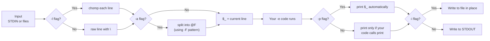

# Text Processing and One-Liners

## Perl on the Command Line

**Version:** 1.1
**Year:** 2026

---

## Copyright Notice

Copyright (c) 2025-2026 Ryan Thomas Robson / Robworks Software LLC. Licensed under [CC BY-NC-ND 4.0](../../LICENSE-CONTENT). You may share this material for non-commercial purposes with attribution, but you may not distribute modified versions.

---

Perl was built for text processing. Before it was a web language, before CPAN existed, Perl was a tool for extracting information from files and generating reports. That heritage lives on in the command-line flags that turn Perl into a filter, a transformer, and a replacement for entire `sed`/`awk` pipelines - all in a single line. Every one-liner maps to a real script, and every script can be compressed into a one-liner. Understanding both directions makes you faster at solving text problems.

!!! tip "See also"
    Perl one-liners often replace `grep`, `sed`, and `awk`. For the Unix text processing tools that Perl builds on, see [Text Processing](../../Linux Essentials/text-processing.md).

---

## Command-Line Flags

The [**`perl` interpreter**](https://perldoc.perl.org/perlrun) accepts flags that change how it reads input and executes code. These flags are the foundation of one-liner programming.

### -e: Execute Code

The [**`-e` flag**](https://perldoc.perl.org/perlrun#-e-commandline) runs a string of Perl code directly from the command line:

```bash
perl -e 'print "Hello, World!\n"'
```

### -n: Implicit Read Loop

The [**`-n` flag**](https://perldoc.perl.org/perlrun#-n) wraps your code in a `while (<>) { ... }` loop. Each line from STDIN or named files is read into `$_` automatically:

```bash
# Print lines containing "error" - equivalent to grep
perl -ne 'print if /error/' access.log
```

The implicit loop reads every line. Your code runs once per line. If your code does not print anything, nothing is output - you are a filter that discards by default.

### -p: Read Loop with Print

The [**`-p` flag**](https://perldoc.perl.org/perlrun#-p) works like `-n` but automatically prints `$_` after each iteration. Your code transforms lines; the flag handles the output:

```bash
# Replace "foo" with "bar" on every line - equivalent to sed
perl -pe 's/foo/bar/g' data.txt
```

The difference between `-n` and `-p` is simple: `-n` requires you to print explicitly, `-p` prints for you.

### -l: Automatic Line Handling

The [**`-l` flag**](https://perldoc.perl.org/perlrun#-l) strips the trailing newline from each input line and adds a newline to each `print` output:

```bash
perl -ne 'print length($_)' file.txt    # without -l: includes \n in count
perl -lne 'print length($_)' file.txt   # with -l: accurate character count
```

### -a and -F: Autosplit Mode

The [**`-a` flag**](https://perldoc.perl.org/perlrun#-a) splits each input line on whitespace into the [**`@F` array**](https://perldoc.perl.org/perlvar#@F) (zero-indexed). The [**`-F` flag**](https://perldoc.perl.org/perlrun#-Fpattern) changes the split delimiter:

```bash
perl -lane 'print $F[1]' data.txt                  # split on whitespace
perl -F: -lane 'print "$F[0] -> $F[5]"' /etc/passwd  # split on colons
perl -F, -lane 'print $F[2]' data.csv                # split on commas
```

### -i: In-Place Editing

The [**`-i` flag**](https://perldoc.perl.org/perlrun#-i) edits files in place. With `-i.bak`, Perl saves the original as a backup before writing the modified version:

```bash
perl -i.bak -pe 's/old/new/g' config.txt   # backup to config.txt.bak
perl -i -pe 's/old/new/g' config.txt        # no backup (dangerous)
```

!!! danger "Always Use a Backup Extension"
    Running `-i` without a backup extension is irreversible. Always use `-i.bak` until you have verified the transformation is correct.

### Flag Pipeline

The following diagram shows how common flags combine to process text:



```terminal
title: Command-Line Flags in Action
steps:
  - command: "echo -e 'Alice 90\\nBob 85\\nCarol 95' | perl -lane 'print $F[1]'"
    output: "90\n85\n95"
    narration: "The -a flag splits each line on whitespace into @F. The -l flag strips the trailing newline. $F[1] is the second field (scores)."
  - command: "echo -e 'error: disk full\\ninfo: all clear\\nerror: timeout' | perl -ne 'print if /^error/'"
    output: "error: disk full\nerror: timeout"
    narration: "The -n flag reads each line into $_ without printing. The print statement only fires when the regex matches, making this a pattern filter."
  - command: "echo -e 'hello world\\nfoo bar' | perl -pe 's/\\b(\\w)/uc($1)/ge'"
    output: "Hello World\nFoo Bar"
    narration: "The -p flag reads each line and prints it after your code runs. The s/// with /ge capitalizes the first letter of every word."
  - command: "echo -e 'one:two:three\\nfour:five:six' | perl -F: -lane 'print $F[-1]'"
    output: "three\nsix"
    narration: "The -F flag sets the split pattern to colon. Combined with -a, each line splits on colons. $F[-1] grabs the last field."
```

---

## $_ and @F in One-Liners

Two variables dominate one-liner programming: `$_` and `@F`.

### $_ Is Your Line

With `-n` or `-p`, `$_` holds the current line. Perl defaults to `$_` for regex matching, `print`, `chomp`, `length`, and dozens of other functions:

```bash
# These are equivalent:
perl -ne 'print $_ if $_ =~ /error/'
perl -ne 'print if /error/'
```

### @F Is Your Row

With `-a`, `@F` holds the fields of the current line after splitting. It uses zero-based indexing: `$F[0]` is the first field, `$F[-1]` is the last:

```bash
# /etc/passwd: user:pass:uid:gid:gecos:home:shell
perl -F: -lane 'print "$F[0] uses $F[-1]"' /etc/passwd

# Modify @F and reconstruct the line
perl -F: -lane '$F[6] = "/bin/bash"; print join(":", @F)' /etc/passwd
```

```quiz
question: "What is the difference between perl -ne 'print' and perl -pe '' when processing a file?"
type: multiple-choice
options:
  - text: "They produce the same output. -n with explicit print and -p with no code both print every input line unchanged."
    correct: true
    feedback: "Correct. The -n flag reads each line into $_ but does not print automatically. Adding an explicit print outputs $_. The -p flag reads each line into $_ and prints it automatically after your code runs. With no code to modify $_, both produce identical output."
  - text: "-ne 'print' prints each line twice, while -pe '' prints each line once."
    feedback: "-ne 'print' calls print once per line - printing $_ once. There is no automatic print with -n, so each line appears exactly once."
  - text: "-pe '' produces no output because the code block is empty."
    feedback: "The -p flag prints $_ automatically after your code runs, regardless of whether your code is empty. An empty code block means the line passes through untouched."
  - text: "-ne 'print' adds a newline after each line, while -pe '' does not."
    feedback: "Neither flag adds newlines on its own. The newline from the input line is already in $_ (unless you use -l). Both output the line exactly as read."
```

---

## Field Processing

Field processing is where Perl one-liners replace `awk`. The `-a` and `-F` flags handle splitting; your code handles selection, transformation, and output.

### Selecting and Filtering Fields

```bash
# Print columns 1 and 3 from whitespace-delimited data
perl -lane 'print "$F[0] $F[2]"'

# Print all fields except the first
perl -lane 'print join(" ", @F[1..$#F])'

# Print lines where the third field exceeds 100
perl -lane 'print if $F[2] > 100'
```

### Transforming and Rearranging

```bash
# Multiply the second field by 1.1 (10% increase)
perl -lane '$F[1] *= 1.1; print join("\t", @F)'

# Uppercase the first field, leave the rest
perl -lane '$F[0] = uc($F[0]); print join(" ", @F)'

# Swap first and second columns
perl -lane 'print "$F[1] $F[0] @F[2..$#F]"'
```

---

## In-Place Editing

The `-i` flag transforms Perl from a filter into an editor. Combined with `-p`, it reads a file, applies your transformation, and writes the result back.

### Basic In-Place Edit

```bash
# Replace all instances of "localhost" with "0.0.0.0"
perl -i.bak -pe 's/localhost/0.0.0.0/g' nginx.conf
```

This creates `nginx.conf.bak` (the original) and writes the modified content to `nginx.conf`.

### Multiple Files and Safe Workflow

```bash
# Fix a typo across all config files
perl -i.bak -pe 's/recieve/receive/g' *.conf
```

The safe workflow: run without `-i` first to preview, then add `-i.bak` to apply, then `diff` to verify, then delete backups:

```bash
perl -pe 's/DEBUG/INFO/g' app.conf          # preview
perl -i.bak -pe 's/DEBUG/INFO/g' app.conf   # apply
diff app.conf app.conf.bak                   # verify
rm app.conf.bak                              # clean up
```

```terminal
title: In-Place Editing with Backup
steps:
  - command: "echo -e 'host=localhost\\nport=3306\\nhost=localhost' > /tmp/test.conf && cat /tmp/test.conf"
    output: "host=localhost\nport=3306\nhost=localhost"
    narration: "Starting with a config file that has two lines containing 'localhost'. The goal is to replace them in place."
  - command: "perl -i.bak -pe 's/localhost/127.0.0.1/g' /tmp/test.conf && cat /tmp/test.conf"
    output: "host=127.0.0.1\nport=3306\nhost=127.0.0.1"
    narration: "The -i.bak flag saved the original as test.conf.bak and wrote the modified version. Both occurrences of 'localhost' were replaced."
  - command: "cat /tmp/test.conf.bak"
    output: "host=localhost\nport=3306\nhost=localhost"
    narration: "The .bak file contains the untouched original. If the replacement was wrong, you can restore from this backup."
  - command: "diff /tmp/test.conf /tmp/test.conf.bak"
    output: "1,3c1,3\n< host=127.0.0.1\n< port=3306\n< host=127.0.0.1\n---\n> host=localhost\n> port=3306\n> host=localhost"
    narration: "diff confirms exactly what changed. In a real workflow, verify the diff before deleting the backup."
```

---

## BEGIN and END Blocks

[**`BEGIN` and `END` blocks**](https://perldoc.perl.org/perlmod#BEGIN%2C-UNITCHECK%2C-CHECK%2C-INIT-and-END) run before and after the main loop, respectively. In one-liners, they handle initialization and summary output.

### BEGIN: Setup Before the Loop

```bash
# Print a header before processing
perl -lane 'BEGIN { print "Name\tScore" } print "$F[0]\t$F[1]"' grades.txt
```

`BEGIN` runs once, before the first line is read. Use it for headers, variable initialization, or loading modules.

### END: Summary After the Loop

```bash
# Sum the second column and print the total
perl -lane '$sum += $F[1]; END { print "Total: $sum" }' sales.txt

# Count matching lines
perl -ne '$count++ if /ERROR/; END { print "Errors: $count\n" }' app.log
```

`END` runs once, after the last line has been processed. Use it for totals, averages, and summary reports.

### Combining BEGIN and END

```bash
# Full report: header, data, footer
perl -lane 'BEGIN { print "USER\tSHELL" } print "$F[0]\t$F[-1]"; END { print "Total: $." }' /etc/passwd
```

!!! tip "The $. Variable in END Blocks"
    `$.` holds the current line number. In an `END` block, it holds the line number of the last line read - effectively the total line count.

---

## Multi-Line Processing

Not every problem fits the line-by-line model. The [**`-0` flag**](https://perldoc.perl.org/perlrun#-0) changes how Perl defines a "record":

```bash
# Paragraph mode (-00): records separated by blank lines
perl -00 -ne 'print if /keyword/' document.txt

# Slurp mode (-0777): read entire file at once
perl -0777 -ne 'print scalar(() = /error/gi), " errors\n"' app.log

# Multi-line substitution: remove C-style comments
perl -0777 -pe 's{/\*.*?\*/}{}gs' source.c

# Custom record separator
perl -ne 'BEGIN { $/ = "---\n" } chomp; print "RECORD: $_\n" if length' data.txt
```

The `/s` modifier makes `.` match newlines, so `.*?` can span line boundaries.

---

## Log Parsing Patterns

Log files are where Perl one-liners earn their keep. The combination of regex, field splitting, and aggregation handles most log analysis tasks without a dedicated tool.

### Counting and Ranking

```bash
# Count HTTP status codes
perl -lane '$c{$F[8]}++; END { print "$_: $c{$_}" for sort keys %c }' access.log

# Top 10 IPs by request count
perl -lane '$ip{$F[0]}++; END { print "$ip{$_} $_" for (sort { $ip{$b} <=> $ip{$a} } keys %ip)[0..9] }' access.log
```

### Timestamps and Aggregation

```bash
# Print the first and last timestamp from a log
perl -ne '
  if (/\[(\d{2}\/\w+\/\d{4}:\d{2}:\d{2}:\d{2})/) { $first //= $1; $last = $1 }
  END { print "First: $first\nLast: $last\n" }
' access.log

# Filter log lines between 09:00 and 10:00
perl -ne 'print if m{\[.*/\d{4}:09:\d{2}:\d{2}}' access.log

# Average response time (last field, in microseconds)
perl -lane '$sum += $F[-1]; $n++; END { printf "Avg: %.2f ms (%d reqs)\n", $sum/$n/1000, $n }' access.log
```

```code-walkthrough
language: bash
title: Apache Log Analyzer One-Liner Chain
code: |
  # Step 1: Extract status codes and count them
  perl -lane '$s{$F[8]}++; END { print "$_: $s{$_}" for sort keys %s }' access.log

  # Step 2: Filter to 5xx errors only
  perl -lane 'print if $F[8] =~ /^5/' access.log

  # Step 3: Extract IPs causing 5xx errors and rank them
  perl -lane '$ip{$F[0]}++ if $F[8] =~ /^5/; END { print "$ip{$_}\t$_" for sort { $ip{$b} <=> $ip{$a} } keys %ip }' access.log

  # Step 4: Full report - combine steps into a single pass
  perl -lane '
    $total++;
    $status{$F[8]}++;
    $err_ip{$F[0]}++ if $F[8] =~ /^5/;
    END {
      print "Total requests: $total";
      print "\nStatus breakdown:";
      printf "  %s: %d (%.1f%%)\n", $_, $status{$_}, $status{$_}/$total*100
        for sort keys %status;
      if (%err_ip) {
        print "\nTop error sources:";
        my @sorted = sort { $err_ip{$b} <=> $err_ip{$a} } keys %err_ip;
        printf "  %-15s %d errors\n", $_, $err_ip{$_} for @sorted[0..4];
      }
    }
  ' access.log
annotations:
  - line: 2
    text: "$F[8] is the HTTP status code in common log format. The hash %s accumulates counts. The END block prints sorted results."
  - line: 5
    text: "A simple filter: print the entire line only when the status code starts with 5 (server errors). No aggregation needed."
  - line: 8
    text: "Conditional counting: the hash only increments when the status is a 5xx error. The END block sorts by count descending."
  - line: 11
    text: "Single-pass analysis: all counters update on every line. This avoids reading the file three times."
  - line: 18
    text: "printf with %% (literal percent sign) calculates each status code as a percentage of total requests."
  - line: 23
    text: "Array slice [0..4] limits output to the top 5 error sources. If fewer than 5 IPs caused errors, Perl handles the short list gracefully."
```

---

## CSV and TSV Manipulation

For simple CSV (no embedded commas or quotes), Perl one-liners are fast and effective. For complex CSV with quoting, use the `Text::CSV` module instead.

### Basic CSV Operations

```bash
# Extract the third column from a CSV
perl -F, -lane 'print $F[2]' data.csv

# Convert CSV to TSV
perl -F, -lane 'print join("\t", @F)' data.csv

# Convert TSV to CSV
perl -F'\t' -lane 'print join(",", @F)' data.tsv

# Skip the header line
perl -F, -lane 'print $F[2] if $. > 1' data.csv
```

### Modifying Columns and Aggregating

```bash
# Add a row number as the first column
perl -F, -lane 'print join(",", $., @F)' data.csv

# Remove the second column (index 1)
perl -F, -lane 'splice(@F, 1, 1); print join(",", @F)' data.csv

# Print rows where column 3 exceeds a threshold
perl -F, -lane 'print if $F[2] > 1000' sales.csv

# Group by column 1, sum column 2
perl -F, -lane '$t{$F[0]} += $F[1]; END { print "$_: $t{$_}" for sort keys %t }' expenses.csv
```

!!! warning "CSV Edge Cases"
    Simple comma splitting fails when fields contain commas, newlines, or quotes. A field like `"Smith, Jr."` splits incorrectly with `-F,`. For production CSV parsing, use `perl -MText::CSV -e '...'` or write a proper script with [**`Text::CSV`**](https://metacpan.org/pod/Text::CSV).

```quiz
question: "In perl -F: -lane 'print $F[2]' /etc/passwd, what does $F[2] contain for a line like root:x:0:0:root:/root:/bin/bash?"
type: multiple-choice
options:
  - text: "0 - the UID field. The -F flag splits on colons, and $F[2] is the third field (zero-indexed), which is the UID."
    correct: true
    feedback: "Correct. -F: sets the split delimiter to colon. The line splits into fields: $F[0]='root', $F[1]='x', $F[2]='0', $F[3]='0', $F[4]='root', $F[5]='/root', $F[6]='/bin/bash'. The UID is at index 2."
  - text: "x - the password placeholder. $F[2] is the second field."
    feedback: "@F uses zero-based indexing. $F[0] is 'root', $F[1] is 'x', and $F[2] is '0'. The index 2 means the third field."
  - text: "root:/root:/bin/bash - everything from the third colon onward."
    feedback: "The -a flag splits the entire line, not just up to a limit. Every colon produces a separate field. $F[2] is a single field, not the remainder."
  - text: "An error, because -F expects a regex, not a plain character."
    feedback: "-F accepts both plain strings and regex patterns. A single character like : is a valid delimiter. No error is produced."
```

---

## Building One-Liners Incrementally

Complex one-liners grow through small, testable steps: inspect the data, split fields, add the filter, aggregate results, format output.

### Example: Finding the Busiest Hour

```bash
# Step 1: See the data
head -1 access.log
# 192.168.1.50 - - [15/Jan/2025:09:23:45 +0000] "GET /index.html HTTP/1.1" 200 2326

# Step 2: Extract the hour
perl -ne 'print "$1\n" if /\[.*?:(\d{2}):\d{2}:\d{2}/' access.log | head

# Step 3: Aggregate by hour
perl -ne '$h{$1}++ if /\[.*?:(\d{2}):\d{2}:\d{2}/; END { print "$_: $h{$_}\n" for sort keys %h }' access.log

# Step 4: Sort by count (most requests first)
perl -ne '$h{$1}++ if /\[.*?:(\d{2}):\d{2}:\d{2}/; END { printf "%s:00 - %d requests\n", $_, $h{$_} for sort { $h{$b} <=> $h{$a} } keys %h }' access.log
```

Each step is independently testable. If step 3 gives wrong numbers, you debug step 2's regex.

---

## Converting Between One-Liners and Scripts

### One-Liner to Script

This one-liner counts words per line:

```bash
perl -lne '$w += scalar(split); END { print $w }'
```

The equivalent script:

```perl
#!/usr/bin/env perl
use strict;
use warnings;

my $w = 0;
while (<>) {
    chomp;                        # -l flag
    $w += scalar(split);          # -a not used, but split works on $_
}
print "$w\n";                     # END block
```

The mapping:

| Flag | Script equivalent |
|------|-------------------|
| `-n` | `while (<>) { ... }` |
| `-p` | `while (<>) { ... } continue { print }` |
| `-l` | `chomp` on input, `"\n"` on output |
| `-a` | `@F = split` at the start of the loop |
| `-F:` | `@F = split /:/, $_` |
| `-i.bak` | Open input, rename, open output |
| `BEGIN {}` | Code before the loop |
| `END {}` | Code after the loop |

### Script to One-Liner

Start with the loop body. Strip variable declarations. Use `$_` defaults. Collapse to one line:

```bash
# Script version: while (<>) { chomp; my @f = split /,/; print join(",", @f), "\n" if $f[2] > 100 }
# One-liner:
perl -F, -lane 'print join(",", @F) if $F[2] > 100'
```

!!! tip "When to Convert"
    Keep it as a one-liner if it fits in a single readable line (roughly 80-120 characters). Convert to a script when it needs error handling, multiple data sources, or will be run by others.

---

## Comparison with sed and awk

### sed vs Perl

`sed` excels at simple substitutions. Perl handles everything `sed` does, plus complex logic:

| Task | sed | Perl |
|------|-----|------|
| Substitution | `sed 's/old/new/g'` | `perl -pe 's/old/new/g'` |
| Delete lines | `sed '/pattern/d'` | `perl -ne 'print unless /pattern/'` |
| Line range | `sed -n '5,10p'` | `perl -ne 'print if 5..10'` |
| Conditional sub | Awkward | `perl -pe 's/old/new/ if /context/'` |
| Math on captures | Not possible | `perl -pe 's/(\d+)/$1*2/ge'` |

The `/e` modifier - evaluating the replacement as code - is where Perl surpasses `sed` entirely.

### awk vs Perl

`awk` is a field-oriented processor. Perl's `-a` flag provides the same model with full language access:

| Task | awk | Perl |
|------|-----|------|
| Print field 2 | `awk '{print $2}'` | `perl -lane 'print $F[1]'` |
| Sum a column | `awk '{s+=$3} END{print s}'` | `perl -lane '$s+=$F[2]; END{print $s}'` |
| Field separator | `awk -F:` | `perl -F:` |

The key difference: `awk` fields start at 1 (`$1` is the first field, `$0` is the entire line), while Perl's `@F` starts at 0 (`$F[0]` is the first field, `$_` is the entire line).

### When to Use Which

Use `sed` for simple substitutions on one file. Use `awk` for quick column extraction. Use Perl when you need conditional logic, computed replacements, multiple operations in one pass, or code that will grow into a script.

```exercise
title: Extract and Count Patterns from a Log
difficulty: beginner
scenario: |
  You have a web server access log at `/var/log/access.log` (simulated below). Write a Perl one-liner that:

  1. Extracts the HTTP method (GET, POST, PUT, DELETE) from each line
  2. Counts how many times each method appears
  3. Prints the results sorted by count (highest first)

  Sample log format:
  ```
  192.168.1.10 - - [15/Jan/2025:09:23:45 +0000] "GET /index.html HTTP/1.1" 200 2326
  10.0.0.5 - - [15/Jan/2025:09:24:01 +0000] "POST /api/users HTTP/1.1" 201 128
  192.168.1.10 - - [15/Jan/2025:09:24:15 +0000] "GET /style.css HTTP/1.1" 200 1045
  10.0.0.5 - - [15/Jan/2025:09:25:00 +0000] "DELETE /api/users/7 HTTP/1.1" 204 0
  192.168.1.20 - - [15/Jan/2025:09:25:30 +0000] "GET /about.html HTTP/1.1" 200 3200
  10.0.0.5 - - [15/Jan/2025:09:26:00 +0000] "PUT /api/users/3 HTTP/1.1" 200 256
  192.168.1.10 - - [15/Jan/2025:09:26:45 +0000] "GET /contact.html HTTP/1.1" 200 1800
  ```

  Test your one-liner with:
  ```bash
  echo '<paste sample data>' | perl <your one-liner>
  ```

  Expected output (order by count descending):
  ```
  4 GET
  1 POST
  1 PUT
  1 DELETE
  ```
hints:
  - "Extract the method with a regex: /\"(GET|POST|PUT|DELETE)/ and use $1"
  - "Store counts in a hash: $method{$1}++"
  - "Sort by value descending: sort { $count{$b} <=> $count{$a} } keys %count"
  - "Use an END block to print the results after processing all lines"
solution: |
  ```bash
  perl -ne '
    $m{$1}++ if /"(\w+)\s/;
    END { printf "%d %s\n", $m{$_}, $_ for sort { $m{$b} <=> $m{$a} } keys %m }
  ' access.log
  ```

  The regex `/"(\w+)\s/` captures the first word after a double quote,
  which is the HTTP method. The hash `%m` accumulates counts. The END
  block sorts by count descending and prints each method with its count.

  A more explicit version that only matches known methods:
  ```bash
  perl -ne '
    $m{$1}++ if /"(GET|POST|PUT|DELETE|PATCH|HEAD|OPTIONS)\s/;
    END { printf "%d %s\n", $m{$_}, $_ for sort { $m{$b} <=> $m{$a} } keys %m }
  ' access.log
  ```
```

```command-builder
base: perl
description: Build a Perl one-liner with common flags for text processing
options:
  - flag: "-e"
    type: text
    label: "Code to execute"
    explanation: "The Perl code to run. Wrap in single quotes."
    placeholder: "'print if /pattern/'"
  - flag: ""
    type: select
    label: "Loop mode"
    explanation: "How to handle input lines"
    choices:
      - ["-n", "Read loop without auto-print (-n)"]
      - ["-p", "Read loop with auto-print (-p)"]
      - ["", "No loop (process arguments or generate output)"]
  - flag: "-l"
    type: toggle
    label: "Auto-chomp and add newlines (-l)"
    explanation: "Strip newline from input, add newline to output. Useful with -n."
  - flag: "-a"
    type: toggle
    label: "Autosplit into @F (-a)"
    explanation: "Split each input line on whitespace into @F array."
  - flag: "-F"
    type: text
    label: "Field separator"
    explanation: "Custom split pattern for -a mode (e.g., : or , or '/\\t/')"
    placeholder: ":"
  - flag: "-i"
    type: text
    label: "In-place edit extension"
    explanation: "Edit files in place. Provide backup extension (e.g., .bak) or leave empty for no backup."
    placeholder: ".bak"
  - flag: ""
    type: text
    label: "Input file(s)"
    explanation: "File or files to process. Leave empty for STDIN."
    placeholder: "access.log"
```

```exercise
title: CSV-to-JSON Converter One-Liner
difficulty: intermediate
scenario: |
  Write a Perl one-liner (or short chain) that converts a simple CSV file into JSON format.

  Input (data.csv):
  ```
  name,age,city
  Alice,30,Portland
  Bob,25,Seattle
  Carol,35,Denver
  ```

  Expected output:
  ```json
  [
    {"name": "Alice", "age": "30", "city": "Portland"},
    {"name": "Bob", "age": "25", "city": "Seattle"},
    {"name": "Carol", "age": "35", "city": "Denver"}
  ]
  ```

  Requirements:
  1. The first line is the header row (field names)
  2. Each subsequent line becomes a JSON object using those field names as keys
  3. All values are strings (no numeric conversion needed)
  4. Output valid JSON with proper commas between objects (no trailing comma)

  You may use multiple `-e` flags or a single `-e` with semicolons. The solution should work with any number of columns and any number of data rows.
hints:
  - "Store the header fields in a BEGIN-like way: chomp and split the first line when $. == 1"
  - "Use $. (the line number variable) to detect the header: if ($. == 1) { @h = split /,/; next }"
  - "Build each JSON object: join(', ', map { qq(\"$h[$_]\": \"$F[$_]\") } 0..$#h)"
  - "Collect all objects in an array, then print in the END block with proper formatting"
  - "Handle commas between objects: join(\",\\n\", @objects)"
solution: |
  ```bash
  perl -F, -lane '
    if ($. == 1) { @h = @F; next }
    push @rows, "  {" . join(", ", map { "\"$h[$_]\": \"$F[$_]\"" } 0..$#h) . "}";
    END {
      print "[\n" . join(",\n", @rows) . "\n]";
    }
  ' data.csv
  ```

  How it works:
  - `-F,` splits on commas, `-l` strips newlines, `-a` populates `@F`, `-n` loops
  - Line 1 (`$. == 1`): store header fields in `@h`, skip to the next line
  - Subsequent lines: `map` pairs each header with its corresponding field value,
    wrapping both in quotes. The `join` combines them into a JSON object string.
  - `END` block: joins all objects with comma-newline separators and wraps
    in square brackets.

  For production use with quoted fields, use `Text::CSV` and `JSON::PP`
  modules instead of manual splitting.
```

---

## Further Reading

- [perlrun](https://perldoc.perl.org/perlrun) - complete reference for Perl command-line flags and environment variables
- [perlvar](https://perldoc.perl.org/perlvar) - special variables including `$_`, `@F`, `$.`, and `$/`
- [Perl One-Liners Cookbook](https://www.oreilly.com/library/view/perl-one-liners/9781457185830/) - Peteris Krumins' collection of practical one-liners with explanations
- [Minimal Perl](https://www.manning.com/books/minimal-perl-for-unix-and-linux-people) - Tim Maher's guide to Perl as a Unix command-line tool
- [perlre](https://perldoc.perl.org/perlre) - regex reference for the patterns used throughout one-liners
- [Text::CSV documentation](https://metacpan.org/pod/Text::CSV) - robust CSV parsing for when simple splitting is not enough

---

**Previous:** [Testing](testing.md) | **Next:** [Networking and Daemons](networking-daemons.md) | [Back to Index](README.md)
