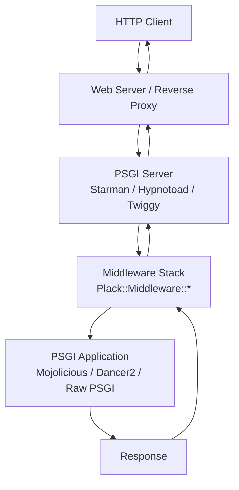
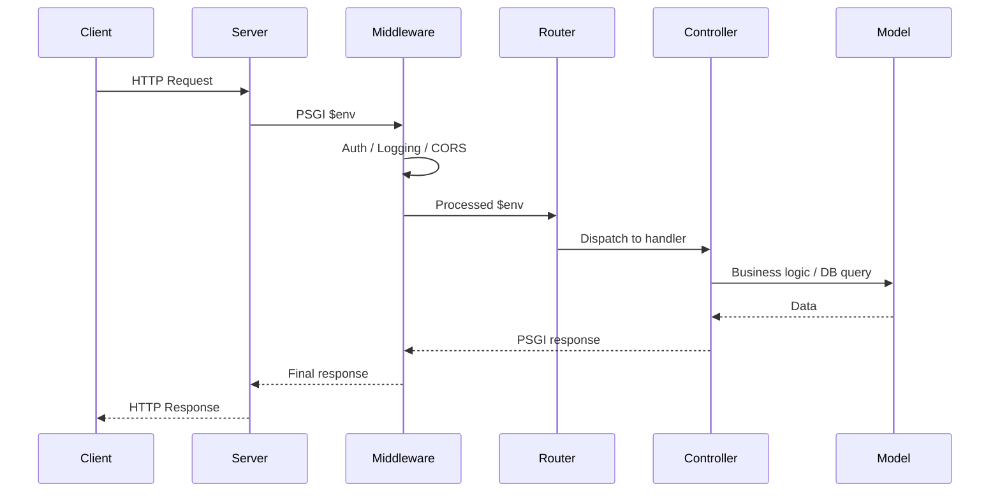

# Web Frameworks and APIs

## Modern Perl Web Development

**Version:** 1.0\
**Year:** 2025

---

## Copyright Notice

Copyright (c) 2025-2026 Ryan Thomas Robson / Robworks Software LLC. Licensed under [CC BY-NC-ND 4.0](../../LICENSE-CONTENT). You may share this material for non-commercial purposes with attribution, but you may not distribute modified versions.

---

Perl has a mature web ecosystem that runs everything from small internal APIs to high-traffic production services. Two frameworks dominate modern Perl web development: [**Mojolicious**](https://docs.mojolicious.org/) for full-featured applications and [**Dancer2**](https://metacpan.org/pod/Dancer2) for lightweight microservices. Both sit on top of [**PSGI**](https://metacpan.org/pod/PSGI), a specification that decouples your application code from the web server, much like Python's WSGI or Ruby's Rack.

This guide covers the foundation layer (PSGI/Plack), the two major frameworks, RESTful API design patterns, and everything you need to go from a hello-world route to a deployed, production-ready web application.

---

## PSGI and Plack

Before PSGI, Perl web applications were tied to specific deployment mechanisms - CGI, mod_perl, FastCGI - and switching between them meant rewriting glue code. [**PSGI**](https://metacpan.org/pod/PSGI) (Perl Web Server Gateway Interface) defines a standard interface between web servers and Perl applications. Your application is a code reference that receives a request environment hash and returns a three-element array reference:

```perl
my $app = sub {
    my ($env) = @_;
    return [
        200,                                    # HTTP status
        ['Content-Type' => 'text/plain'],       # headers
        ['Hello, PSGI!'],                       # body
    ];
};
```

[**Plack**](https://metacpan.org/pod/Plack) is the reference implementation of PSGI. It provides `plackup` (a development server), middleware components, and adapters for production servers like [**Starman**](https://metacpan.org/pod/Starman) and [**Twiggy**](https://metacpan.org/pod/Twiggy).

```bash
plackup app.psgi                                       # development
plackup -s Starman --workers 4 --port 5000 app.psgi    # production
```

### The PSGI Stack



The PSGI environment hash (`$env`) contains request data:

| Key | Description | Example |
|-----|-------------|---------|
| `REQUEST_METHOD` | HTTP method | `GET`, `POST` |
| `PATH_INFO` | Request path | `/api/users/42` |
| `QUERY_STRING` | URL parameters | `page=2&limit=10` |
| `HTTP_HOST` | Host header | `example.com` |
| `CONTENT_TYPE` | Request content type | `application/json` |
| `psgi.input` | Request body stream | IO handle |

```quiz
question: "What does a PSGI application return?"
type: multiple-choice
options:
  - text: "An HTTP::Response object"
    feedback: "HTTP::Response is from LWP. PSGI uses a simpler, framework-agnostic format - a plain array reference with three elements."
  - text: "A three-element array reference containing status code, headers (as an array ref of pairs), and body (as an array ref of strings)"
    correct: true
    feedback: "Correct. The PSGI specification defines the response as [STATUS, [HEADERS], [BODY]]. This minimal contract means any PSGI-compatible server can run any PSGI application without framework-specific adapters."
  - text: "A hash reference with keys 'status', 'headers', and 'body'"
    feedback: "A hash reference is a reasonable guess, but PSGI uses an array reference for efficiency and simplicity. The order is fixed: status, headers, body."
  - text: "A string containing the raw HTTP response"
    feedback: "Raw HTTP strings would couple the application to HTTP formatting details. PSGI abstracts that away - the server handles serialization."
```

---

## Mojolicious

[**Mojolicious**](https://docs.mojolicious.org/) is a real-time web framework with zero non-core dependencies. It includes an HTTP client, WebSocket support, a template engine, a built-in development server, and a hot-reloading production server called Hypnotoad.

### Installation

```bash
cpanm Mojolicious
```

### Mojolicious::Lite

For small applications and prototyping, [**Mojolicious::Lite**](https://docs.mojolicious.org/Mojolicious/Lite) provides a single-file DSL:

```perl
use Mojolicious::Lite -signatures;

get '/' => sub ($c) {
    $c->render(text => 'Hello, Mojolicious!');
};

get '/greet/:name' => sub ($c) {
    my $name = $c->param('name');
    $c->render(text => "Hello, $name!");
};

app->start;
```

```terminal
title: Mojolicious Hello World and Routes
steps:
  - command: "perl -e 'use Mojolicious::Lite -signatures; get \"/\" => sub ($c) { $c->render(text => \"Hello, Mojolicious!\") }; get \"/greet/:name\" => sub ($c) { $c->render(text => \"Hello, \" . $c->param(\"name\") . \"!\") }; app->start;' daemon -l http://*:3000 &"
    output: "[2025-01-15 10:30:00] [info] Listening at \"http://*:3000\""
    narration: "Mojolicious::Lite creates a full web application in a single file. The daemon command starts a built-in HTTP server. In development, use morbo instead for hot reloading."
  - command: "curl -s http://localhost:3000/"
    output: "Hello, Mojolicious!"
    narration: "The root route responds with plain text. Mojolicious handles HTTP parsing, routing, and response formatting."
  - command: "curl -s http://localhost:3000/greet/Perl"
    output: "Hello, Perl!"
    narration: "The :name placeholder in the route captures the path segment. $c->param('name') retrieves it. Mojolicious supports placeholders, wildcards, and regex constraints."
  - command: "kill %1 2>/dev/null"
    output: ""
    narration: "Stop the background server. In production, you would use hypnotoad or a process manager."
```

### Routes and Controllers

Routes map HTTP methods and paths to handler code. Beyond simple placeholders, Mojolicious supports route constraints, optional parameters, and nested routes:

```perl
get '/user/:id' => [id => qr/\d+/] => sub ($c) {
    $c->render(json => {user_id => $c->param('id')});
};

get '/page/:num' => {num => 1} => sub ($c) {
    $c->render(text => "Page " . $c->param('num'));
};
```

For larger applications, move handlers into controller classes:

```perl
# lib/MyApp/Controller/Users.pm
package MyApp::Controller::Users;
use Mojo::Base 'Mojolicious::Controller', -signatures;

sub show ($self) {
    my $user = $self->app->model->get_user($self->param('id'));
    return $self->reply->not_found unless $user;
    $self->render(json => $user);
}
1;
```

### Templates

Mojolicious includes [**Embedded Perl (EP)**](https://docs.mojolicious.org/Mojo/Template) templates:

```perl
get '/dashboard' => sub ($c) {
    $c->stash(title => 'Dashboard', items => ['Tasks', 'Messages']);
    $c->render(template => 'dashboard');
};

__DATA__
@@ dashboard.html.ep
<h1><%= $title %></h1>
<ul>
% for my $item (@$items) {
  <li><%= $item %></li>
% }
</ul>
```

| Tag | Purpose |
|-----|---------|
| `<%= expr %>` | Output expression (HTML-escaped) |
| `<%== expr %>` | Output raw (no escaping) |
| `% code` | Perl code line |

### WebSockets

Mojolicious has first-class WebSocket support:

```perl
websocket '/ws' => sub ($c) {
    $c->on(message => sub ($c, $msg) {
        $c->send("Echo: $msg");
    });
};
```

---

## Dancer2

[**Dancer2**](https://metacpan.org/pod/Dancer2) is a lightweight framework inspired by Ruby's Sinatra. It emphasizes simplicity and convention over configuration.

```bash
cpanm Dancer2
dancer2 gen -a MyApp
```

```terminal
title: Dancer2 App Setup
steps:
  - command: "cpanm -q Dancer2 2>&1 | tail -1"
    output: "Successfully installed Dancer2-1.1.0"
    narration: "Dancer2 installs from CPAN with cpanm. It pulls in a few dependencies but is lighter than a full Mojolicious install."
  - command: "dancer2 gen -a TaskApp && ls TaskApp/"
    output: "Makefile.PL  bin  config.yml  cpanfile  environments  lib  public  t  views"
    narration: "dancer2 gen scaffolds a complete project structure. bin/ has the startup script, lib/ has your application code, views/ has templates, and config.yml has settings."
  - command: "cat TaskApp/lib/TaskApp.pm"
    output: "package TaskApp;\nuse Dancer2;\n\nget '/' => sub {\n    template 'index' => { 'title' => 'TaskApp' };\n};\n\n1;"
    narration: "The main application module uses the Dancer2 DSL. Routes are defined with get, post, put, del, and any. The template function renders a view."
```

### Routes and Plugins

Dancer2 routes use a concise DSL:

```perl
package MyApp;
use Dancer2;

get '/hello/:name' => sub {
    my $name = route_parameters->get('name');
    return "Hello, $name!";
};

post '/data' => sub {
    my $payload = body_parameters->get('key');
    return "Received: $payload";
};
```

The plugin ecosystem provides extensions for databases, authentication, sessions, and templates. [**Template Toolkit**](https://metacpan.org/pod/Dancer2::Template::TemplateToolkit) is the most common template engine:

```perl
# config.yml: template: "template_toolkit"

get '/user/:id' => sub {
    template 'user' => { user => get_user(route_parameters->get('id')) };
};
```

```quiz
question: "When would you choose Dancer2 over Mojolicious?"
type: multiple-choice
options:
  - text: "When you need WebSocket support out of the box"
    feedback: "Mojolicious has built-in WebSocket support. Dancer2 does not include native WebSocket handling."
  - text: "When you want a minimal framework with a Sinatra-like DSL and plan to add features through plugins"
    correct: true
    feedback: "Correct. Dancer2 follows the micro-framework philosophy - start small and add what you need through plugins. It has a lower learning curve and is well-suited for REST APIs and microservices."
  - text: "When you need a built-in HTTP client for making upstream API calls"
    feedback: "Mojolicious includes Mojo::UserAgent, a non-blocking HTTP client. Dancer2 has no built-in HTTP client."
  - text: "When you need zero non-core dependencies"
    feedback: "Mojolicious is the framework with zero non-core dependencies. Dancer2 depends on several CPAN modules."
```

---

## RESTful API Design

### Resource-Oriented Routes

Map HTTP methods to CRUD operations on resources:

| Method | Path | Action |
|--------|------|--------|
| `GET` | `/api/tasks` | List all tasks |
| `POST` | `/api/tasks` | Create a task |
| `GET` | `/api/tasks/:id` | Get one task |
| `PUT` | `/api/tasks/:id` | Replace a task |
| `DELETE` | `/api/tasks/:id` | Remove a task |

### JSON Handling

Mojolicious has built-in JSON support through [**Mojo::JSON**](https://docs.mojolicious.org/Mojo/JSON):

```perl
post '/api/tasks' => sub ($c) {
    my $data = $c->req->json;
    return $c->render(json => {error => 'Invalid JSON'}, status => 400)
        unless $data;
    $c->render(json => create_task($data), status => 201);
};
```

Dancer2 auto-serializes with [**Dancer2::Serializer::JSON**](https://metacpan.org/pod/Dancer2::Serializer::JSON):

```perl
# config.yml: serializer: JSON
post '/api/tasks' => sub {
    my $data = request->data;    # auto-deserialized
    status 201;
    return create_task($data);   # auto-serialized to JSON
};
```

### Request Lifecycle



```code-walkthrough
language: perl
title: RESTful Task API with Mojolicious
code: |
  use Mojolicious::Lite -signatures;
  use Mojo::JSON qw(true false);

  my %tasks;
  my $next_id = 1;

  get '/api/tasks' => sub ($c) {
      my @all = map { $tasks{$_} } sort keys %tasks;
      $c->render(json => \@all);
  };

  post '/api/tasks' => sub ($c) {
      my $data = $c->req->json;
      return $c->render(
          json   => {error => 'title is required'},
          status => 400,
      ) unless $data && $data->{title};

      my $id = $next_id++;
      $tasks{$id} = {
          id        => $id,
          title     => $data->{title},
          completed => false,
      };
      $c->res->headers->location("/api/tasks/$id");
      $c->render(json => $tasks{$id}, status => 201);
  };

  get '/api/tasks/:id' => [id => qr/\d+/] => sub ($c) {
      my $task = $tasks{$c->param('id')};
      return $c->reply->not_found unless $task;
      $c->render(json => $task);
  };

  del '/api/tasks/:id' => [id => qr/\d+/] => sub ($c) {
      my $id = $c->param('id');
      return $c->reply->not_found unless $tasks{$id};
      delete $tasks{$id};
      $c->rendered(204);
  };

  app->start;
annotations:
  - line: 1
    text: "Mojolicious::Lite imports the DSL functions (get, post, del, app) and enables Perl signatures with -signatures."
  - line: 4
    text: "In-memory storage for demonstration. A production API would use a database. $next_id is an auto-incrementing counter."
  - line: 7
    text: "GET /api/tasks returns all tasks as a JSON array. The sort ensures consistent ordering by ID."
  - line: 13
    text: "$c->req->json parses the request body as JSON. If the body is not valid JSON, it returns undef."
  - line: 23
    text: "Mojo::JSON exports true and false, which serialize to JSON true/false instead of 1/0. This matters for API consumers expecting proper JSON booleans."
  - line: 25
    text: "Setting the Location header on creation responses is a REST convention. It tells the client where to find the newly created resource."
  - line: 29
    text: "Route constraint [id => qr/\\d+/] ensures the placeholder only matches digits. Requests like /api/tasks/abc get a 404 instead of hitting the handler."
  - line: 35
    text: "del is the Mojolicious DSL keyword for DELETE routes (delete is a Perl built-in). 204 No Content is the standard response for successful deletion with no body."
```

---

## Middleware

**Middleware** wraps your application to add cross-cutting concerns - logging, authentication, CORS headers, compression - without cluttering route handlers.

### Plack Middleware

[**Plack::Middleware**](https://metacpan.org/pod/Plack::Middleware) provides a library of reusable components:

```perl
use Plack::Builder;
builder {
    enable 'AccessLog';
    enable 'ContentLength';
    enable 'Deflater';
    enable 'Static', path => qr{^/static/}, root => './public/';
    MyApp->to_app;
};
```

### Framework Hooks

Both frameworks provide lifecycle hooks that serve as framework-native middleware:

```perl
# Mojolicious
app->hook(before_dispatch => sub ($c) {
    $c->app->log->info($c->req->method . ' ' . $c->req->url);
});

# Dancer2
hook before => sub {
    if (request->path =~ m{^/api/} && !is_authenticated()) {
        send_error('Unauthorized', 401);
    }
};
```

---

## Session Management and Authentication

### Sessions

Mojolicious sessions are cookie-based by default, signed using the application secret:

```perl
app->secrets(['change-this-to-a-random-string']);

post '/login' => sub ($c) {
    my $user = authenticate($c->req->json);
    return $c->render(json => {error => 'Invalid credentials'}, status => 401)
        unless $user;
    $c->session(user_id => $user->{id});
    $c->session(expires => time + 3600);
    $c->render(json => {message => 'Logged in'});
};
```

Dancer2 sessions are configured through `config.yml`:

```yaml
session: YAML    # or Cookie, Memcached, Redis
```

```perl
post '/login' => sub {
    session user_id => authenticate(request->data)->{id};
    return {message => 'Logged in'};
};
```

### Token-Based Authentication (JWT)

For APIs, JSON Web Tokens avoid server-side session storage. The [**Mojo::JWT**](https://metacpan.org/pod/Mojo::JWT) module handles encoding and decoding:

```perl
use Mojo::JWT;
my $SECRET = $ENV{JWT_SECRET} || die "JWT_SECRET required\n";

sub generate_token {
    my ($user_id) = @_;
    return Mojo::JWT->new(
        secret  => $SECRET,
        claims  => {sub => $user_id, iat => time},
        expires => time + 3600,
    )->encode;
}
```

### Authentication Middleware with under

Protect API routes with Mojolicious's `under`, which acts as a route prefix guard:

```perl
under '/api' => sub ($c) {
    my $auth = $c->req->headers->authorization // '';
    my ($token) = $auth =~ /^Bearer\s+(.+)$/;
    my $claims = eval { Mojo::JWT->new(secret => $SECRET)->decode($token // '') };

    unless ($claims) {
        $c->render(json => {error => 'Unauthorized'}, status => 401);
        return undef;
    }
    $c->stash(user_id => $claims->{sub});
    return 1;
};
```

!!! tip "Mojolicious 'under' Routes"
    `under` creates a route prefix that acts as middleware. If the handler returns a false value, the request chain stops. This is the idiomatic way to add authentication guards in Mojolicious.

---

## Database Integration

### DBI Direct

[**DBI**](https://metacpan.org/pod/DBI) is the standard database interface for Perl:

```perl
use DBI;
my $dbh = DBI->connect('dbi:Pg:dbname=myapp', 'appuser', 'secret',
    {RaiseError => 1, AutoCommit => 1});

get '/api/users' => sub ($c) {
    my $users = $dbh->selectall_arrayref(
        'SELECT id, name, email FROM users', {Slice => {}});
    $c->render(json => $users);
};
```

### Mojo::Pg

[**Mojo::Pg**](https://metacpan.org/pod/Mojo::Pg) integrates PostgreSQL with Mojolicious, providing connection pooling, migrations, and non-blocking queries:

```perl
use Mojo::Pg;
helper pg => sub { state $pg = Mojo::Pg->new($ENV{DATABASE_URL}) };
app->pg->auto_migrate(1)->migrations->from_data;

post '/api/tasks' => sub ($c) {
    my $task = $c->pg->db->insert('tasks',
        {title => $c->req->json->{title}},
        {returning => '*'})->hash;
    $c->render(json => $task, status => 201);
};
```

### DBIx::Class

[**DBIx::Class**](https://metacpan.org/pod/DBIx::Class) is Perl's ORM with relationship mapping and a Perl-level query interface:

```perl
package MyApp::Schema::Result::Task;
use base 'DBIx::Class::Core';
__PACKAGE__->table('tasks');
__PACKAGE__->add_columns(
    id    => {data_type => 'integer', is_auto_increment => 1},
    title => {data_type => 'text', is_nullable => 0},
);
__PACKAGE__->set_primary_key('id');
1;
```

| Approach | Best For | Trade-off |
|----------|----------|-----------|
| DBI direct | Simple queries, full SQL control | Manual SQL, no abstraction |
| Mojo::Pg | Mojolicious apps, PostgreSQL | Postgres-specific |
| DBIx::Class | Complex schemas, relationships | Learning curve, startup overhead |

---

## Deployment

### Development Servers

```bash
morbo myapp.pl                        # Mojolicious - auto-reloads on changes
plackup -R lib/ bin/app.psgi          # Dancer2 / any PSGI app
```

### Production Servers

[**Hypnotoad**](https://docs.mojolicious.org/Mojo/Server/Hypnotoad) is Mojolicious's preforking server with zero-downtime restarts:

```bash
hypnotoad myapp.pl             # start
hypnotoad myapp.pl             # run again for zero-downtime restart
hypnotoad -s myapp.pl          # stop
```

```perl
app->config(hypnotoad => {
    listen  => ['http://*:8080'],
    workers => 4,
    proxy   => 1,
});
```

[**Starman**](https://metacpan.org/pod/Starman) is a high-performance preforking PSGI server for any framework:

```bash
starman --workers 4 --port 5000 bin/app.psgi
```

### Reverse Proxy

Place Nginx in front for TLS termination, static files, and load balancing:

```nginx
upstream myapp { server 127.0.0.1:8080; }
server {
    listen 443 ssl;
    server_name example.com;
    location /static/ { alias /var/www/myapp/public/; expires 30d; }
    location / {
        proxy_pass http://myapp;
        proxy_set_header Host $host;
        proxy_set_header X-Forwarded-For $proxy_add_x_forwarded_for;
        proxy_set_header X-Forwarded-Proto $scheme;
    }
}
```

!!! danger "Enable Proxy Mode"
    When behind a reverse proxy, enable proxy mode so your app trusts `X-Forwarded-For` and `X-Forwarded-Proto` headers. In Mojolicious: `proxy => 1` in the hypnotoad config. In Dancer2: `behind_proxy: 1` in `config.yml`.

### Docker

```dockerfile
FROM perl:5.38-slim
RUN cpanm --notest Mojolicious Mojo::Pg
WORKDIR /app
COPY . .
EXPOSE 8080
CMD ["hypnotoad", "-f", "myapp.pl"]
```

The `-f` flag keeps Hypnotoad in the foreground, which Docker requires. Pair with `docker-compose.yml` for database services:

```yaml
services:
  web:
    build: .
    ports: ["8080:8080"]
    environment:
      DATABASE_URL: postgresql://user:pass@db:5432/myapp
    depends_on: [db]
  db:
    image: postgres:16
    environment: { POSTGRES_USER: user, POSTGRES_PASSWORD: pass, POSTGRES_DB: myapp }
```

---

## Exercises

```exercise
title: Build a URL Shortener API
difficulty: beginner
scenario: |
  Build a URL shortener API with Mojolicious::Lite:

  1. `POST /api/shorten` - accept JSON with a `url` field, generate a 6-character random code, store the mapping, return the short code
  2. `GET /api/:code` - look up the code and return JSON with the original URL
  3. `GET /api/:code/redirect` - redirect (302) to the original URL
  4. Return 404 if a code is not found, 400 if `url` is missing

  Generate codes with:
  ```perl
  sub generate_code {
      my @chars = ('a'..'z', 'A'..'Z', '0'..'9');
      return join '', map { $chars[rand @chars] } 1..6;
  }
  ```
hints:
  - "Start with: use Mojolicious::Lite -signatures; my %urls;"
  - "Parse the request body: my $data = $c->req->json;"
  - "Redirect: $c->redirect_to($urls{$code});"
  - "Return JSON 404: $c->render(json => {error => 'Not found'}, status => 404);"
solution: |
  ```perl
  use Mojolicious::Lite -signatures;
  my %urls;

  sub generate_code {
      my @chars = ('a'..'z', 'A'..'Z', '0'..'9');
      return join '', map { $chars[rand @chars] } 1..6;
  }

  post '/api/shorten' => sub ($c) {
      my $data = $c->req->json;
      return $c->render(json => {error => 'url is required'}, status => 400)
          unless $data && $data->{url};
      my $code = generate_code();
      $urls{$code} = $data->{url};
      $c->render(json => {code => $code,
          short_url => $c->url_for("/api/$code")->to_abs->to_string},
          status => 201);
  };

  get '/api/:code' => sub ($c) {
      my $code = $c->param('code');
      return $c->render(json => {error => 'Not found'}, status => 404)
          unless $urls{$code};
      $c->render(json => {code => $code, url => $urls{$code}});
  };

  get '/api/:code/redirect' => sub ($c) {
      my $code = $c->param('code');
      return $c->render(json => {error => 'Not found'}, status => 404)
          unless $urls{$code};
      $c->redirect_to($urls{$code});
  };
  app->start;
  ```

  The solution validates input with guard clauses and uses
  Mojolicious's built-in redirect_to for the 302 response.
```

```exercise
title: Task Management API with Authentication
difficulty: intermediate
scenario: |
  Build a task management REST API with user authentication using Mojolicious:

  **Authentication:**
  - `POST /api/register` - accept `username` and `password`, store the user, return 201
  - `POST /api/login` - validate credentials, return a session token
  - Protected routes require an `Authorization: Bearer <token>` header

  **Task CRUD (all protected):**
  - `GET /api/tasks` - list tasks for the authenticated user only
  - `POST /api/tasks` - create a task with `title` and optional `due_date`
  - `PUT /api/tasks/:id` - update (only if the task belongs to the user)
  - `DELETE /api/tasks/:id` - delete (only if owned by the user)

  Use `under '/api/tasks'` for the auth middleware. Return 401 for unauthorized, 403 for forbidden, 404 for not found.
hints:
  - "Store users in a hash: my %users; keyed by username"
  - "Store tokens in a hash mapping token to username: my %tokens;"
  - "Use 'under' for auth: under '/api/tasks' => sub ($c) { ... };"
  - "Check ownership: return 403 unless $task->{owner} eq $username;"
solution: |
  ```perl
  use Mojolicious::Lite -signatures;
  use Mojo::JSON qw(true false);
  my (%users, %tokens, %tasks);
  my $next_id = 1;

  sub gen_token { join '', map { ('a'..'z','0'..'9')[rand 36] } 1..32 }

  post '/api/register' => sub ($c) {
      my $d = $c->req->json;
      return $c->render(json => {error => 'fields required'}, status => 400)
          unless $d->{username} && $d->{password};
      return $c->render(json => {error => 'taken'}, status => 409)
          if $users{$d->{username}};
      $users{$d->{username}} = $d;
      $c->render(json => {username => $d->{username}}, status => 201);
  };

  post '/api/login' => sub ($c) {
      my $d = $c->req->json;
      my $u = $users{$d->{username} // ''};
      return $c->render(json => {error => 'Invalid'}, status => 401)
          unless $u && $u->{password} eq ($d->{password} // '');
      my $t = gen_token(); $tokens{$t} = $d->{username};
      $c->render(json => {token => $t});
  };

  under '/api/tasks' => sub ($c) {
      my ($t) = ($c->req->headers->authorization // '') =~ /^Bearer\s+(.+)$/;
      my $user = $tokens{$t // ''};
      unless ($user) { $c->render(json => {error => 'Unauthorized'}, status => 401); return undef }
      $c->stash(username => $user); return 1;
  };

  get '/api/tasks' => sub ($c) {
      my @mine = grep { $_->{owner} eq $c->stash('username') } values %tasks;
      $c->render(json => \@mine);
  };

  post '/api/tasks' => sub ($c) {
      my $d = $c->req->json;
      return $c->render(json => {error => 'title required'}, status => 400) unless $d->{title};
      my $id = $next_id++;
      $tasks{$id} = {id => $id, title => $d->{title}, completed => false, owner => $c->stash('username')};
      $c->render(json => $tasks{$id}, status => 201);
  };

  del '/api/tasks/:id' => [id => qr/\d+/] => sub ($c) {
      my $task = $tasks{$c->param('id')};
      return $c->reply->not_found unless $task;
      return $c->render(json => {error => 'Forbidden'}, status => 403)
          unless $task->{owner} eq $c->stash('username');
      delete $tasks{$c->param('id')}; $c->rendered(204);
  };
  app->start;
  ```

  The `under` block creates an authentication gate. All routes
  after it require a valid token. Ownership is checked per-handler.
```

---

## Scaffolding with mojo generate

The `mojo generate` command creates boilerplate for Mojolicious projects:

```command-builder
base: mojo generate
description: Scaffold a Mojolicious project structure
options:
  - flag: ""
    type: select
    label: "Project type"
    explanation: "Choose the type of project to generate"
    choices:
      - ["app MyApp", "Full MVC application with controllers, templates, and tests"]
      - ["lite-app myapp.pl", "Single-file Lite application"]
      - ["plugin MyPlugin", "Mojolicious plugin skeleton"]
      - ["makefile", "Generate a Makefile.PL for distribution"]
  - flag: ""
    type: select
    label: "Post-generation step"
    explanation: "What to do after generating the project"
    choices:
      - ["&& cd MyApp && morbo script/my_app", "Start the development server"]
      - ["&& cd MyApp && prove -l t/", "Run the generated tests"]
      - ["&& cd MyApp && tree -L 2", "View the directory structure"]
```

---

## Putting It All Together

Perl's web ecosystem gives you a clear stack from the protocol layer to the application layer:

- **PSGI/Plack** provides the universal interface between servers and applications
- **Mojolicious** is a batteries-included framework with built-in HTTP client, WebSockets, templates, and production server
- **Dancer2** is a micro-framework that stays out of your way and lets you choose your components
- **RESTful patterns** map HTTP methods to CRUD operations on resources with proper status codes
- **Middleware** adds cross-cutting concerns without coupling them to your route logic
- **Sessions and authentication** can use cookies, tokens (JWT), or server-side storage
- **Database integration** ranges from raw DBI to Mojo::Pg to DBIx::Class for full ORM
- **Deployment** means a reverse proxy (Nginx) in front of a preforking server (Hypnotoad or Starman), optionally containerized with Docker

Start with Mojolicious::Lite for prototyping, graduate to full Mojolicious when you need controllers and models, and reach for Dancer2 when you want a Sinatra-style micro-framework. The PSGI layer means you can mix and match servers without changing application code.

---

## Further Reading

- [Mojolicious documentation](https://docs.mojolicious.org/) - official guides, cookbook, and API reference
- [Mojolicious::Lite tutorial](https://docs.mojolicious.org/Mojolicious/Guides/Tutorial) - step-by-step introduction
- [Dancer2 documentation](https://metacpan.org/pod/Dancer2) - framework reference and plugin list
- [Dancer2 manual](https://metacpan.org/pod/Dancer2::Manual) - comprehensive usage guide
- [PSGI/Plack specification](https://metacpan.org/pod/PSGI) - the interface standard
- [Mojo::Pg documentation](https://metacpan.org/pod/Mojo::Pg) - PostgreSQL integration for Mojolicious
- [DBIx::Class manual](https://metacpan.org/pod/DBIx::Class::Manual::DocMap) - ORM documentation

---

**Previous:** [Networking and Daemons](networking-daemons.md) | **Next:** [Developer Roadmap](perl_developer_roadmap.md) | [Back to Index](README.md)
