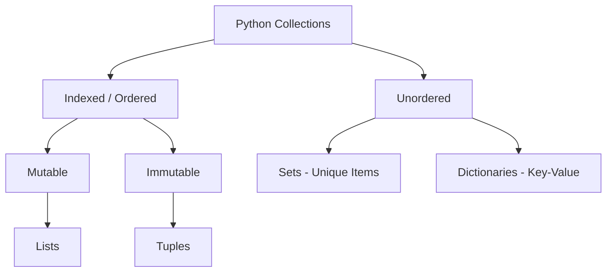

# Data Structures and Logic (Python)

**Version:** 0.2
**Year:** 2026

---

## Copyright Notice

Copyright (c) 2025-2026 Ryan Thomas Robson / Robworks Software LLC. Licensed under [CC BY-NC-ND 4.0](../../LICENSE-CONTENT). You may share this material for non-commercial purposes with attribution, but you may not distribute modified versions.

---

Modern sysadmin tasks involve more than parsing single lines of text. You need to store collections of data, transform them, and make decisions based on their contents. Python's built-in data structures and clean control flow are designed for exactly these scenarios - from parsing log files to building configuration management tools.

## Core Data Structures

Python has four primary collection types, each with unique properties and use cases.



---

## Lists

A [**list**](https://docs.python.org/3/tutorial/introduction.html#lists) is an ordered, mutable sequence. It's the most versatile collection and the one you'll reach for most often.

```python
# A list of server names
servers = ["web01", "web02", "db01", "db02"]

# Adding elements
servers.append("cache01")           # Add to end
servers.insert(0, "lb01")           # Insert at position

# Accessing by index (0-indexed)
primary_db = servers[2]             # "web02" (shifted after insert)
last = servers[-1]                  # "cache01" (negative index = from end)

# Slicing [start:stop:step] - stop is exclusive
web_servers = servers[1:3]          # ["web01", "web02"]
every_other = servers[::2]          # Every second element
reversed_list = servers[::-1]       # Reversed copy

# Removing elements
servers.remove("db02")              # Remove by value (first occurrence)
popped = servers.pop()              # Remove and return last element
```

### Iterating Over Lists

```python
# Basic iteration
for server in servers:
    print(f"Checking {server}...")

# With index using enumerate()
for i, server in enumerate(servers):
    print(f"[{i}] {server}")

# Iterate over two lists in parallel
names = ["web01", "web02", "db01"]
ips = ["10.0.0.1", "10.0.0.2", "10.0.1.1"]

for name, ip in zip(names, ips):
    print(f"{name} -> {ip}")
```

### List Comprehensions

A **list comprehension** creates a new list by applying an expression to each item in an iterable, optionally filtering items. It's a concise alternative to a `for` loop with `append`.

```python
# Standard for loop
log_files = []
for f in os.listdir("/var/log"):
    if f.endswith(".log"):
        log_files.append(f)

# Equivalent list comprehension
log_files = [f for f in os.listdir("/var/log") if f.endswith(".log")]

# Transform values: convert strings to uppercase
hostnames = [s.upper() for s in servers]

# Nested comprehension: flatten a list of lists
groups = [["web01", "web02"], ["db01"], ["cache01", "cache02"]]
all_servers = [s for group in groups for s in group]
```

!!! tip "When to use list comprehensions"
    If the comprehension fits on one line or is easy to read at a glance, use it. If you need multiple conditions, nested transformations, or side effects (like printing), use a regular `for` loop. Readability beats cleverness.

---

## Dictionaries

A [**dictionary**](https://docs.python.org/3/tutorial/datastructures.html#dictionaries) maps keys to values. Keys must be unique and immutable (strings, numbers, tuples). Dictionaries are Python's answer to hash maps, associative arrays, and lookup tables.

```python
# Server configuration
config = {
    "hostname": "app01",
    "ip_address": "10.0.0.5",
    "role": "application",
    "uptime_days": 142
}

# Access values
print(config["ip_address"])              # "10.0.0.5"

# Safe access with .get() (returns None instead of raising KeyError)
backup = config.get("backup_enabled")    # None
backup = config.get("backup_enabled", False)  # False (custom default)

# Add or update
config["environment"] = "production"
config["uptime_days"] = 143

# Remove a key
del config["uptime_days"]
removed = config.pop("environment")      # Remove and return value
```

### Iterating Over Dictionaries

```python
# Keys only (default)
for key in config:
    print(key)

# Keys and values together
for key, value in config.items():
    print(f"{key}: {value}")

# Values only
for value in config.values():
    print(value)
```

### Dictionary Comprehensions

```python
# Build a lookup table from two lists
names = ["web01", "web02", "db01"]
ips = ["10.0.0.1", "10.0.0.2", "10.0.1.1"]

host_map = {name: ip for name, ip in zip(names, ips)}
# {"web01": "10.0.0.1", "web02": "10.0.0.2", "db01": "10.0.1.1"}

# Filter while building
prod_hosts = {name: ip for name, ip in host_map.items() if name.startswith("web")}
```

### Useful Patterns

```python
from collections import Counter, defaultdict

# Count occurrences
status_codes = [200, 200, 404, 500, 200, 404, 200]
counts = Counter(status_codes)
# Counter({200: 4, 404: 2, 500: 1})
print(counts.most_common(2))   # [(200, 4), (404, 2)]

# Group items by key
logs = [
    {"level": "ERROR", "msg": "Disk full"},
    {"level": "INFO", "msg": "Service started"},
    {"level": "ERROR", "msg": "Connection timeout"},
]

by_level = defaultdict(list)
for entry in logs:
    by_level[entry["level"]].append(entry["msg"])
# {"ERROR": ["Disk full", "Connection timeout"], "INFO": ["Service started"]}
```

---

## Tuples

A **tuple** is like a list but **immutable** - once created, you cannot add, remove, or change its elements. Use tuples for data that should not be accidentally modified.

```python
# Coordinates, version numbers, database rows
coordinates = (40.7128, -74.0060)
version = (3, 12, 1)

# Tuple unpacking (assign multiple variables in one line)
lat, lon = coordinates
major, minor, patch = version

# Functions often return tuples
import shutil
total, used, free = shutil.disk_usage("/")

# Swap variables without a temp variable
a, b = 1, 2
a, b = b, a   # a=2, b=1
```

---

## Sets

A **set** is an unordered collection of **unique** elements. Sets are optimized for membership testing and mathematical set operations.

```python
# Deduplicate a list of IPs from a log file
all_ips = ["10.0.0.1", "10.0.0.2", "10.0.0.1", "10.0.0.3", "10.0.0.2"]
unique_ips = set(all_ips)   # {"10.0.0.1", "10.0.0.2", "10.0.0.3"}

# Set operations
allowed = {"10.0.0.1", "10.0.0.2", "10.0.0.3"}
active = {"10.0.0.2", "10.0.0.4", "10.0.0.5"}

authorized = allowed & active          # Intersection: {"10.0.0.2"}
all_known = allowed | active           # Union: all 5 IPs
unauthorized = active - allowed        # Difference: {"10.0.0.4", "10.0.0.5"}

# Fast membership testing (O(1) vs O(n) for lists)
if "10.0.0.4" in allowed:
    print("IP is allowed")
```

---

## Control Flow

### Conditionals

Python uses `if`, `elif`, and `else` with the boolean operators `and`, `or`, and `not`.

```python
load_average = 4.5
disk_full = True

if load_average > 5.0 and disk_full:
    print("CRITICAL: High load and low disk space!")
elif load_average > 5.0:
    print("WARNING: High CPU load.")
elif disk_full:
    print("WARNING: Disk is full.")
else:
    print("System health is OK.")
```

### Truthiness

Python evaluates these values as **False** (everything else is **True**):

| Value | Type |
|-------|------|
| `False` | bool |
| `None` | NoneType |
| `0`, `0.0` | numeric |
| `""`, `[]`, `{}`, `set()`, `()` | empty sequences/collections |

This means you can write concise checks:

```python
errors = []
if errors:
    print(f"Found {len(errors)} errors")
else:
    print("No errors")

# None handling
result = config.get("timeout")
timeout = result if result is not None else 30
# Or more concisely (but be careful - this also replaces 0):
timeout = config.get("timeout") or 30
```

!!! warning "Mutable default arguments"
    Never use a mutable object (list, dict) as a function's default argument. Python creates the default once and reuses it across all calls, so modifications accumulate unexpectedly.

    ```python
    # WRONG - the same list is shared across all calls
    def add_server(name, servers=[]):
        servers.append(name)
        return servers

    # RIGHT - use None and create a new list each time
    def add_server(name, servers=None):
        if servers is None:
            servers = []
        servers.append(name)
        return servers
    ```

### For Loops

The `for` loop iterates over any iterable - lists, dicts, strings, files, ranges.

```python
# Loop with range (0 to 4)
for i in range(5):
    print(f"Attempt {i + 1}")

# Loop over a string
for char in "hello":
    print(char)

# Loop over a file line by line
with open("/etc/hosts") as f:
    for line in f:
        if not line.startswith("#"):
            print(line.strip())
```

### While Loops

Use `while` when you don't know in advance how many iterations you need.

```python
import time

retries = 0
max_retries = 5

while retries < max_retries:
    if check_service("web01"):
        print("Service is up!")
        break
    retries += 1
    print(f"Attempt {retries}/{max_retries} failed, retrying in 5s...")
    time.sleep(5)
else:
    # The else clause runs if the loop completes without break
    print("Service did not recover after all retries.")
```

---

## Exception Handling Patterns

Beyond basic `try`/`except` (covered in the introduction), you'll use these patterns frequently:

```python
# Catch multiple exception types
try:
    data = json.loads(raw_input)
    value = data["key"]
except (json.JSONDecodeError, KeyError) as e:
    print(f"Invalid data: {e}")

# finally runs no matter what (cleanup)
try:
    conn = connect_to_db()
    result = conn.execute(query)
finally:
    conn.close()

# Raise your own exceptions
def deploy(version):
    if not version.startswith("v"):
        raise ValueError(f"Version must start with 'v', got: {version}")
```

---

```terminal
scenario: "Explore Python data structures interactively"
steps:
  - command: "python3 -c \"servers = ['web01', 'web02', 'db01']; print(servers)\""
    output: "['web01', 'web02', 'db01']"
    narration: "Create a list of server names. Lists are ordered and mutable - you can add, remove, and reorder elements."
  - command: "python3 -c \"servers = ['web01', 'web02', 'db01']; servers.append('cache01'); print(servers)\""
    output: "['web01', 'web02', 'db01', 'cache01']"
    narration: "Append adds an element to the end of the list. The list grows dynamically."
  - command: "python3 -c \"config = {'host': 'db01', 'port': 5432, 'ssl': True}; print(config['host']); print(config.get('timeout', 30))\""
    output: "db01\n30"
    narration: "Dictionaries map keys to values. Use bracket notation for keys you know exist, and .get() with a default for optional keys."
  - command: "python3 -c \"ips = ['10.0.0.1', '10.0.0.2', '10.0.0.1', '10.0.0.3']; print(set(ips))\""
    output: "{'10.0.0.1', '10.0.0.2', '10.0.0.3'}"
    narration: "Converting a list to a set removes duplicates automatically. Sets are unordered, so the output order may vary."
  - command: "python3 -c \"names = ['web01', 'db01']; ips = ['10.0.0.1', '10.0.1.1']; print(dict(zip(names, ips)))\""
    output: "{'web01': '10.0.0.1', 'db01': '10.0.1.1'}"
    narration: "zip() pairs elements from two lists. Wrapping in dict() creates a lookup table. This pattern is common when combining related data from different sources."
  - command: "python3 -c \"from collections import Counter; codes = [200, 200, 404, 500, 200, 404]; print(Counter(codes).most_common())\""
    output: "[(200, 3), (404, 2), (500, 1)]"
    narration: "Counter from the collections module counts occurrences and provides most_common() for ranked results. Useful for log analysis and reporting."
```

---

## Interactive Quizzes

```quiz
question: "Which data structure would be most appropriate for storing a collection of unique usernames from a large CSV file?"
type: multiple-choice
options:
  - text: "List"
    feedback: "Lists allow duplicates. You would need to check for existence before each append, which is O(n) per check."
  - text: "Tuple"
    feedback: "Tuples are immutable - you can't add elements to them as you read the file."
  - text: "Set"
    correct: true
    feedback: "Correct! A set automatically handles deduplication and membership testing in O(1) time. Just use add() for each username and duplicates are ignored."
  - text: "Dictionary"
    feedback: "Dictionary keys must be unique, but if you only need values (not key-value pairs), a set is simpler and more semantically correct."
```

```quiz
question: "What is the result of `['a', 'b', 'c', 'd'][1:3]`?"
type: multiple-choice
options:
  - text: "['a', 'b']"
    feedback: "Slicing starts at index 1, not index 0."
  - text: "['b', 'c']"
    correct: true
    feedback: "Correct! Slicing is inclusive of the start index (1) and exclusive of the stop index (3). Index 1 is 'b' and index 2 is 'c'."
  - text: "['b', 'c', 'd']"
    feedback: "Index 3 ('d') is the stop index, so it's excluded from the slice."
  - text: "['a', 'b', 'c']"
    feedback: "Slicing starts at index 1 ('b'), not index 0 ('a')."
```

```quiz
question: "Why should you never use a mutable object (like a list) as a function's default argument?"
type: multiple-choice
options:
  - text: "It causes a syntax error."
    feedback: "Python accepts mutable defaults without error - the problem is behavioral, not syntactic."
  - text: "Python creates the default once and reuses it across all calls, so modifications accumulate."
    correct: true
    feedback: "Correct! Default arguments are evaluated once at function definition time, not at each call. A mutable default like [] is shared across all invocations, so appending to it in one call affects subsequent calls."
  - text: "Mutable objects cannot be used as function arguments."
    feedback: "You can pass mutable objects as arguments. The issue is specifically with mutable default values."
  - text: "It makes the function slower."
    feedback: "The performance impact is negligible. The problem is that the function behaves incorrectly by sharing state between calls."
```

---

```exercise
title: "Parse and Analyze Server Logs"
description: "Write a Python script that reads a list of log entries, counts occurrences by status level, and identifies the most frequent error messages."
requirements:
  - "Given a list of log entry dictionaries (each with 'level', 'message', and 'timestamp' keys), count entries per level"
  - "Use Counter from the collections module for counting"
  - "Group error messages (level == 'ERROR') into a list"
  - "Print the top 3 most common log levels and all unique error messages"
  - "Handle the case where the log list is empty"
hints:
  - "Counter([entry['level'] for entry in logs]) counts all levels in one line"
  - "Use a list comprehension to filter: [e['message'] for e in logs if e['level'] == 'ERROR']"
  - "Counter.most_common(3) returns the top 3 as a list of (value, count) tuples"
  - "Check 'if not logs:' before processing to handle the empty case"
solution: |
  from collections import Counter

  def analyze_logs(logs):
      if not logs:
          print("No log entries to analyze.")
          return

      # Count entries per level
      levels = Counter(entry["level"] for entry in logs)
      print("Log level counts:")
      for level, count in levels.most_common():
          print(f"  {level}: {count}")

      # Collect unique error messages
      errors = [entry["message"] for entry in logs if entry["level"] == "ERROR"]
      unique_errors = set(errors)

      if unique_errors:
          print(f"\nUnique error messages ({len(unique_errors)}):")
          for msg in sorted(unique_errors):
              print(f"  - {msg}")
      else:
          print("\nNo errors found.")

  # Example usage
  sample_logs = [
      {"level": "INFO", "message": "Service started", "timestamp": "2026-03-25T10:00:00"},
      {"level": "ERROR", "message": "Connection timeout", "timestamp": "2026-03-25T10:01:00"},
      {"level": "INFO", "message": "Request processed", "timestamp": "2026-03-25T10:02:00"},
      {"level": "ERROR", "message": "Disk full", "timestamp": "2026-03-25T10:03:00"},
      {"level": "WARNING", "message": "High memory", "timestamp": "2026-03-25T10:04:00"},
      {"level": "ERROR", "message": "Connection timeout", "timestamp": "2026-03-25T10:05:00"},
  ]

  analyze_logs(sample_logs)
```

---

## Further Reading

- [Python Tutorial: Data Structures](https://docs.python.org/3/tutorial/datastructures.html) - official guide to lists, dicts, sets, tuples, and their methods
- [Real Python: List Comprehensions](https://realpython.com/list-comprehension-python/) - when to use them and when not to
- [Python Collections Module](https://docs.python.org/3/library/collections.html) - Counter, defaultdict, OrderedDict, and other specialized containers
- [Real Python: Dictionaries](https://realpython.com/python-dicts/) - comprehensive guide to dictionary patterns and best practices

---

**Previous:** [Introduction to Python](python_dev0_introduction.md) | **Next:** [Working with Files and APIs](files-and-apis.md) | [Back to Index](README.md)
