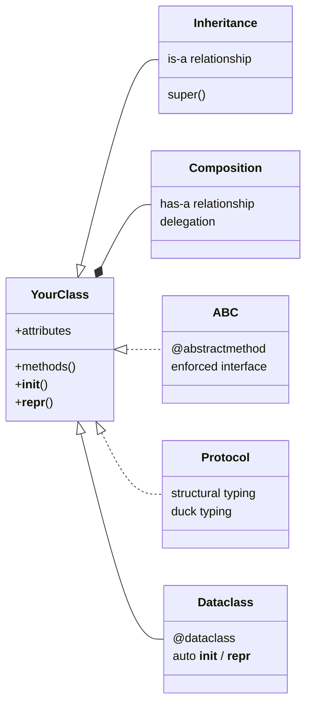
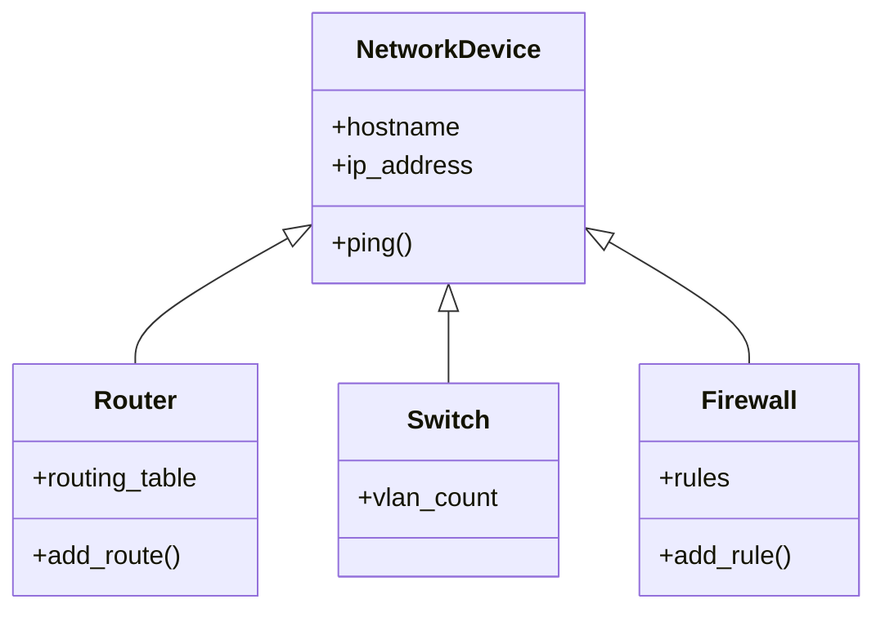

# Object-Oriented Programming

**Version:** 0.1
**Year:** 2026

---

## Copyright Notice

Copyright (c) 2025-2026 Ryan Thomas Robson / Robworks Software LLC. Licensed under [CC BY-NC-ND 4.0](../../LICENSE-CONTENT). You may share this material for non-commercial purposes with attribution, but you may not distribute modified versions.

---

Most Python you have written so far has been procedural - functions calling functions, data passed as dictionaries or tuples. That works well for scripts, but as your tools grow beyond a few hundred lines, you start running into problems: related data and functions scatter across modules, configuration dictionaries grow unwieldy keys, and refactoring means hunting through every caller. **Object-oriented programming** (OOP) gives you a way to bundle related data and behavior into a single unit - a **class** - and to define clear contracts between the parts of your system.



This guide covers the full OOP toolkit Python offers - from basic classes through inheritance, composition, and the modern alternatives (dataclasses and protocols) that often replace traditional patterns.

---

## Classes and Objects

A **class** is a blueprint. An **object** (or **instance**) is a thing built from that blueprint. You define a class with the `class` keyword and create instances by calling it like a function.

```python
class Server:
    def __init__(self, hostname, port=22):
        self.hostname = hostname
        self.port = port
        self.is_healthy = True

    def address(self):
        return f"{self.hostname}:{self.port}"

web = Server("web-01.prod", 443)
print(web.address())  # web-01.prod:443
```

The **`__init__`** method runs when you create an instance. The first parameter, **`self`**, is the instance being created - Python passes it automatically.

**Instance attributes** (like `self.hostname`) belong to a specific object. **Class attributes** are shared across all instances:

```python
class Server:
    default_timeout = 30  # class attribute - shared by all instances

    def __init__(self, hostname):
        self.hostname = hostname  # instance attribute - unique per object
```

```code-walkthrough
title: Anatomy of a Server Class
description: A class that models a server with health checking.
language: python
code: |
    class Server:
        default_timeout = 30

        def __init__(self, hostname, port=22):
            self.hostname = hostname
            self.port = port
            self.is_healthy = True
            self.checks_run = 0

        def address(self):
            return f"{self.hostname}:{self.port}"

        def check(self):
            self.checks_run += 1
            # In real code, you'd ping the server here
            return self.is_healthy

        def __repr__(self):
            status = "UP" if self.is_healthy else "DOWN"
            return f"Server({self.hostname!r}, port={self.port}, {status})"
annotations:
    - line: 1
      text: "Class names use CamelCase by Python convention (PEP 8)."
    - line: 2
      text: "A class attribute. Every Server instance shares this value unless overridden on the instance."
    - line: 4
      text: "__init__ is the initializer (not technically a constructor). self is the new instance."
    - line: 5
      text: "Instance attributes are set on self. Each Server gets its own hostname."
    - line: 10
      text: "Methods are functions defined inside the class. self is always the first parameter."
    - line: 14
      text: "Methods can modify instance state. self.checks_run += 1 updates this specific server."
    - line: 18
      text: "__repr__ returns a developer-friendly string. The !r format spec adds quotes around strings."
```

!!! tip "Class vs instance attributes"
    Class attributes are useful for defaults and constants. But be careful with mutable class attributes like lists or dicts - all instances share the same object. Define mutable defaults in `__init__` instead.

---

## Dunder Methods

**Dunder methods** (short for "double underscore") let your classes hook into Python's built-in operations. You have already seen `__init__` and `__repr__`. Here are the ones you will use most often.

### String Representations

**`__repr__`** returns an unambiguous string for developers (shown in the REPL and debugger). **`__str__`** returns a human-readable string (used by `print()` and `str()`).

```python
class Server:
    def __init__(self, hostname, port=22):
        self.hostname = hostname
        self.port = port

    def __repr__(self):
        return f"Server({self.hostname!r}, port={self.port})"

    def __str__(self):
        return f"{self.hostname}:{self.port}"
```

If you only define one, define `__repr__`. When `__str__` is not defined, Python falls back to `__repr__`.

### Equality and Hashing

By default, `==` compares object identity (memory address). Override **`__eq__`** to compare by value:

```python
class Server:
    def __init__(self, hostname, port=22):
        self.hostname = hostname
        self.port = port

    def __eq__(self, other):
        if not isinstance(other, Server):
            return NotImplemented
        return self.hostname == other.hostname and self.port == other.port

    def __hash__(self):
        return hash((self.hostname, self.port))
```

Returning `NotImplemented` (not `NotImplementedError`) tells Python to try the other operand's `__eq__` instead. Defining **`__hash__`** alongside `__eq__` lets you use instances as dictionary keys and in sets.

!!! info "The __eq__ / __hash__ contract"
    If you define `__eq__` without `__hash__`, Python sets `__hash__` to `None`, making your objects unhashable. If two objects are equal, they must have the same hash. The reverse is not required - different objects can share a hash.

### Collection-Like Behavior

**`__len__`** and **`__contains__`** let your objects work with `len()` and the `in` operator:

```python
class Cluster:
    def __init__(self, name, servers=None):
        self.name = name
        self.servers = servers or []

    def __len__(self):
        return len(self.servers)

    def __contains__(self, server):
        return server in self.servers
```

### Context Managers

**`__enter__`** and **`__exit__`** let your objects work with `with` statements. This is the same pattern you used in the [Files and APIs](files-and-apis.md) guide when opening files:

```python
class DatabaseConnection:
    def __init__(self, dsn):
        self.dsn = dsn
        self.connection = None

    def __enter__(self):
        self.connection = connect(self.dsn)  # acquire resource
        return self.connection

    def __exit__(self, exc_type, exc_val, exc_tb):
        if self.connection:
            self.connection.close()  # always release
        return False  # don't suppress exceptions
```

```terminal
title: Dunder Methods in Action
scenario: "Explore how __repr__, __str__, __eq__, and __hash__ behave in the Python REPL."
steps:
    - command: "python3 -c \"\nclass Server:\n    def __init__(self, hostname, port=22):\n        self.hostname = hostname\n        self.port = port\n    def __repr__(self):\n        return f'Server({self.hostname!r}, port={self.port})'\n    def __str__(self):\n        return f'{self.hostname}:{self.port}'\n    def __eq__(self, other):\n        if not isinstance(other, Server):\n            return NotImplemented\n        return self.hostname == other.hostname and self.port == other.port\n    def __hash__(self):\n        return hash((self.hostname, self.port))\n\nweb1 = Server('web-01.prod', 443)\nweb2 = Server('web-01.prod', 443)\nweb3 = Server('db-01.prod', 5432)\nprint('repr:', repr(web1))\nprint('str: ', str(web1))\nprint('eq:  ', web1 == web2)\nprint('ne:  ', web1 == web3)\nprint('set: ', {web1, web2, web3})\n\""
      output: "repr: Server('web-01.prod', port=443)\nstr:  web-01.prod:443\neq:   True\nne:   False\nset:  2 unique servers (web1 and web2 deduplicated)"
      narration: "web1 and web2 are equal (same hostname and port), so the set deduplicates them down to two unique entries. The repr shows the developer-friendly format while str shows the human-readable one. Set display order varies between Python runs due to hash randomization."
```

---

## Properties

A **property** lets you add logic to attribute access without changing the caller's syntax. Use the **`@property`** decorator to create a getter and **`@name.setter`** to add validation:

```python
class Server:
    def __init__(self, hostname, port=22):
        self.hostname = hostname
        self.port = port  # goes through the setter

    @property
    def port(self):
        return self._port

    @port.setter
    def port(self, value):
        if not 1 <= value <= 65535:
            raise ValueError(f"Port must be 1-65535, got {value}")
        self._port = value
```

The backing attribute uses a leading underscore (`self._port`) by convention. Callers still write `server.port = 8080` - the validation is invisible to them. This is why Python does not need Java-style getters and setters by default: start with a plain attribute, and switch to `@property` later if you need validation. The calling code never changes.

---

## Inheritance

**Inheritance** lets you create a new class that reuses and extends an existing one. The new class (the **subclass** or **child**) inherits all attributes and methods from the parent (the **base class** or **superclass**).

```python
class NetworkDevice:
    def __init__(self, hostname, ip_address):
        self.hostname = hostname
        self.ip_address = ip_address

    def ping(self):
        return f"Pinging {self.ip_address}..."

    def __repr__(self):
        return f"{type(self).__name__}({self.hostname!r})"


class Router(NetworkDevice):
    def __init__(self, hostname, ip_address, routing_table=None):
        super().__init__(hostname, ip_address)
        self.routing_table = routing_table or {}

    def add_route(self, network, gateway):
        self.routing_table[network] = gateway


class Switch(NetworkDevice):
    def __init__(self, hostname, ip_address, vlan_count=1):
        super().__init__(hostname, ip_address)
        self.vlan_count = vlan_count
```

**`super()`** calls the parent class's method. Always use it instead of hardcoding the parent name - it handles multiple inheritance correctly.



Use **`isinstance()`** to check types. It respects inheritance - a `Router` is also a `NetworkDevice`:

```python
r = Router("core-rtr-01", "10.0.0.1")
isinstance(r, Router)         # True
isinstance(r, NetworkDevice)  # True
```

### Multiple Inheritance and MRO

Python supports **multiple inheritance**, but it creates complexity. Python uses the **Method Resolution Order** (MRO) - a linearization algorithm called C3 - to decide which parent's method wins:

```python
class Loggable:
    def log(self, message):
        print(f"[{type(self).__name__}] {message}")

class Monitorable:
    def health_check(self):
        return True

class ManagedServer(Loggable, Monitorable):
    pass
```

!!! warning "Use multiple inheritance sparingly"
    Multiple inheritance works well for small **mixin** classes that add a single capability (like `Loggable` above). Avoid deep multiple inheritance hierarchies - they create confusing method resolution chains. If you find yourself building diamond-shaped class trees, switch to composition.

---

## Composition vs Inheritance

**Inheritance** models an "is-a" relationship: a Router *is a* NetworkDevice. **Composition** models a "has-a" relationship: a Deployment *has a* Server and a Config. The difference matters because inheritance locks you into a rigid hierarchy, while composition lets you swap parts independently.

```python
# Inheritance approach - rigid coupling
class WebDeployment(Server):
    def __init__(self, hostname, config_path):
        super().__init__(hostname, port=443)
        self.config_path = config_path
```

The problem: what if a deployment spans multiple servers? Or needs a different kind of server? Inheritance forces a single parent.

```python
# Composition approach - flexible parts
class Deployment:
    def __init__(self, name, servers, config):
        self.name = name
        self.servers = servers
        self.config = config

    def healthy_servers(self):
        return [s for s in self.servers if s.check()]

    def deploy(self):
        targets = self.healthy_servers()
        for server in targets:
            print(f"Deploying {self.name} to {server.address()}")
```

```code-walkthrough
title: From Inheritance to Composition
description: Refactoring a tightly coupled hierarchy into composable parts.
language: python
code: |
    class Config:
        def __init__(self, env, settings=None):
            self.env = env
            self.settings = settings or {}

        def get(self, key, default=None):
            return self.settings.get(key, default)


    class Server:
        def __init__(self, hostname, port=22):
            self.hostname = hostname
            self.port = port
            self.is_healthy = True

        def check(self):
            return self.is_healthy

        def address(self):
            return f"{self.hostname}:{self.port}"


    class Deployment:
        def __init__(self, name, servers, config):
            self.name = name
            self.servers = servers
            self.config = config

        def healthy_servers(self):
            return [s for s in self.servers if s.check()]

        def deploy(self):
            timeout = self.config.get("timeout", 30)
            for server in self.healthy_servers():
                print(f"[{self.name}] -> {server.address()} (timeout={timeout}s)")


    prod_config = Config("production", {"timeout": 60, "retries": 3})
    servers = [Server("web-01.prod", 443), Server("web-02.prod", 443)]
    deploy = Deployment("frontend-v2.1", servers, prod_config)
    deploy.deploy()
annotations:
    - line: 1
      text: "Config is a standalone class. It doesn't inherit from Server or Deployment."
    - line: 10
      text: "Server is also standalone. It knows nothing about deployments or configs."
    - line: 23
      text: "Deployment composes Server and Config. It holds references to them, not inheritance."
    - line: 29
      text: "healthy_servers filters using each server's own check method - delegation, not inheritance."
    - line: 32
      text: "The deployment reads config through the Config object's interface. If you swap Config for a YAMLConfig or EnvConfig, Deployment doesn't change."
    - line: 38
      text: "Assembly happens at the call site. You can mix and match any servers with any config."
```

A useful heuristic: if you can describe the relationship with "has-a" or "uses-a", prefer composition. If the relationship is genuinely "is-a" and you need polymorphism (treating different types uniformly), inheritance is appropriate.

---

## Abstract Base Classes

An **abstract base class** (ABC) defines a contract: subclasses must implement certain methods. Any attempt to instantiate a class with missing abstract methods raises `TypeError`.

```python
from abc import ABC, abstractmethod
from pathlib import Path


class StorageBackend(ABC):
    @abstractmethod
    def read(self, key):
        """Return the value for key, or raise KeyError."""

    @abstractmethod
    def write(self, key, value):
        """Store value under key."""

    def exists(self, key):
        """Check if key exists. Concrete method - subclasses inherit this."""
        try:
            self.read(key)
            return True
        except KeyError:
            return False


class FileStorage(StorageBackend):
    def __init__(self, base_dir: Path):
        self.base_dir = base_dir

    def read(self, key):
        path = self.base_dir / key
        if not path.exists():
            raise KeyError(key)
        return path.read_text()

    def write(self, key, value):
        path = self.base_dir / key
        path.write_text(value)
```

ABCs are useful when you need to guarantee an interface - for example, ensuring every storage backend implements `read` and `write`. But they add ceremony. For lightweight contracts, Python offers a more flexible alternative: protocols.

---

## Dataclasses

The **`@dataclass`** decorator (from the [**`dataclasses`**](https://docs.python.org/3/library/dataclasses.html) module, Python 3.7+) auto-generates `__init__`, `__repr__`, and `__eq__` based on class attributes. This eliminates the boilerplate for classes that are primarily data containers.

```python
from dataclasses import dataclass, field


@dataclass
class HealthResult:
    server: str
    status: str
    response_ms: float
    checks: list[str] = field(default_factory=list)
```

That single decorator generates an `__init__` with parameters matching the fields, a `__repr__` that shows all values, and an `__eq__` that compares field-by-field. You would need roughly 20 lines to write all of that by hand.

### Defaults and Post-Init

Use **`field(default_factory=...)`** for mutable defaults (never use a bare `[]` or `{}` as a default). The **`__post_init__`** method runs after the generated `__init__`:

```python
from dataclasses import dataclass, field
from datetime import datetime


@dataclass
class DeployRecord:
    service: str
    version: str
    servers: list[str] = field(default_factory=list)
    timestamp: str = field(default="", repr=False)

    def __post_init__(self):
        if not self.timestamp:
            self.timestamp = datetime.now().isoformat()
```

### Frozen Dataclasses

Set **`frozen=True`** to make instances immutable. Any attempt to set an attribute after creation raises `FrozenInstanceError`:

```python
@dataclass(frozen=True)
class Endpoint:
    host: str
    port: int
    protocol: str = "https"
```

Frozen dataclasses are automatically hashable, so you can use them as dictionary keys or in sets.

!!! tip "When to use a dataclass vs a regular class"
    Use `@dataclass` when your class is primarily a data container - configuration records, API responses, results. Use a regular class when behavior is more important than data, or when you need fine-grained control over initialization and attribute access.

```terminal
title: Dataclass Auto-Generated Methods
scenario: "Compare writing a class manually versus using @dataclass to see what the decorator generates for you."
steps:
    - command: "python3 -c \"\nfrom dataclasses import dataclass, field\n\n@dataclass\nclass HealthResult:\n    server: str\n    status: str\n    response_ms: float\n    checks: list = field(default_factory=list)\n\nr1 = HealthResult('web-01', 'healthy', 12.5)\nr2 = HealthResult('web-01', 'healthy', 12.5)\nr3 = HealthResult('db-01', 'degraded', 340.0, ['disk', 'memory'])\nprint('repr:', r1)\nprint('eq:  ', r1 == r2)\nprint('ne:  ', r1 == r3)\n\""
      output: "repr: HealthResult(server='web-01', status='healthy', response_ms=12.5, checks=[])\neq:   True\nne:   False"
      narration: "__repr__ shows all fields with their values. __eq__ compares field-by-field, so r1 and r2 are equal (same server, status, and response_ms). No manual __init__, __repr__, or __eq__ needed."
    - command: "python3 -c \"\nfrom dataclasses import dataclass\n\n@dataclass(frozen=True)\nclass Endpoint:\n    host: str\n    port: int\n    protocol: str = 'https'\n\ne = Endpoint('api.example.com', 443)\nprint(repr(e))\nprint('hash:', hash(e))\ntry:\n    e.port = 8080\nexcept Exception as err:\n    print(f'error: {type(err).__name__}: {err}')\n\""
      output: "Endpoint(host='api.example.com', port=443, protocol='https')\nhash: <integer - varies per Python session>\nerror: FrozenInstanceError: cannot assign to field 'port'"
      narration: "Frozen dataclasses are immutable and hashable. Trying to change a field after creation raises FrozenInstanceError. This makes them safe to use as dictionary keys."
```

---

## Protocols (Structural Typing)

**Protocols** (from `typing`, Python 3.8+) define interfaces through structure rather than inheritance. A class satisfies a protocol if it has the right methods - it does not need to explicitly inherit from the protocol class. This is **structural typing**, also known as "duck typing with type checker support."

```python
from typing import Protocol


class Readable(Protocol):
    def read(self) -> str: ...


def load_config(source: Readable) -> dict:
    import json
    return json.loads(source.read())
```

Any object with a `read() -> str` method satisfies `Readable` - files, `io.StringIO`, your custom classes - without any of them knowing `Readable` exists.

### Protocols vs ABCs

| | ABC | Protocol |
|--|-----|----------|
| Relationship | Nominal ("inherits from") | Structural ("has the methods") |
| Subclass declaration | Required (`class Foo(MyABC)`) | Not required |
| Runtime enforcement | `TypeError` on instantiation | No runtime enforcement |
| Type checker support | Yes | Yes |
| Best for | Enforcing contracts in your own codebase | Defining interfaces for code you don't control |

```python
from typing import Protocol


class Notifier(Protocol):
    def send(self, message: str) -> bool: ...


class EmailNotifier:
    def __init__(self, smtp_host):
        self.smtp_host = smtp_host

    def send(self, message: str) -> bool:
        print(f"Email via {self.smtp_host}: {message}")
        return True


class SlackNotifier:
    def __init__(self, webhook_url):
        self.webhook_url = webhook_url

    def send(self, message: str) -> bool:
        print(f"Slack webhook: {message}")
        return True


def alert(notifiers: list[Notifier], message: str):
    for n in notifiers:
        n.send(message)
```

Neither `EmailNotifier` nor `SlackNotifier` inherits from `Notifier`. They just happen to have a `send(message: str) -> bool` method. A type checker like [**mypy**](https://mypy-lang.org/) or [**pyright**](https://github.com/microsoft/pyright) verifies compatibility at check time without any runtime cost.

---

## Practical OOP Patterns

### Strategy Pattern

The **strategy pattern** lets you swap an algorithm at runtime by passing in an object that implements the behavior. This is composition in action:

```python
from typing import Protocol


class RetryStrategy(Protocol):
    def should_retry(self, attempt: int, error: Exception) -> bool: ...
    def delay(self, attempt: int) -> float: ...


class ExponentialBackoff:
    def __init__(self, max_retries=3, base_delay=1.0):
        self.max_retries = max_retries
        self.base_delay = base_delay

    def should_retry(self, attempt, error):
        return attempt < self.max_retries

    def delay(self, attempt):
        return self.base_delay * (2 ** attempt)


class NoRetry:
    def should_retry(self, attempt, error):
        return False

    def delay(self, attempt):
        return 0


class APIClient:
    def __init__(self, base_url, retry_strategy=None):
        self.base_url = base_url
        self.retry = retry_strategy or NoRetry()

    def request(self, endpoint):
        attempt = 0
        while True:
            try:
                print(f"GET {self.base_url}/{endpoint} (attempt {attempt + 1})")
                # In real code: response = requests.get(...)
                return {"status": "ok"}
            except Exception as e:
                if not self.retry.should_retry(attempt, e):
                    raise
                delay = self.retry.delay(attempt)
                print(f"  Retrying in {delay}s...")
                attempt += 1
```

The caller picks the strategy:

```python
# Production - retry with backoff
client = APIClient("https://api.example.com", ExponentialBackoff(max_retries=5))

# Tests - fail fast
client = APIClient("https://api.example.com", NoRetry())
```

### Repository Pattern

The **repository pattern** abstracts data access behind a consistent interface. Your business logic calls `repo.get(id)` without knowing whether the data comes from a file, a database, or memory:

```python
from dataclasses import dataclass, field


@dataclass
class User:
    username: str
    role: str = "viewer"


class UserRepository:
    """In-memory repository for demonstration. Swap in a database-backed
    version by implementing the same get/save/list_all interface."""

    def __init__(self):
        self._store: dict[str, User] = {}

    def save(self, user: User):
        self._store[user.username] = user

    def get(self, username: str) -> User:
        if username not in self._store:
            raise KeyError(f"No user: {username}")
        return self._store[username]

    def list_all(self) -> list[User]:
        return list(self._store.values())
```

In production, you would create a `PostgresUserRepository` with the same `get`, `save`, and `list_all` methods. The calling code never changes. This is composition and protocols working together - define a `Repository` protocol, and any backend that implements the methods satisfies the contract.

!!! warning "Singletons are usually a code smell"
    The singleton pattern (ensuring a class has only one instance) is frequently misused in Python. Module-level variables already provide singletons naturally - just put the instance in a module. If you find yourself writing a `__new__` override to prevent multiple instances, step back and ask whether a module-level object or dependency injection would be simpler.

---

```quiz
question: "If a class defines __repr__ but not __str__, what does print() display?"
type: multiple-choice
options:
    - text: "The object's memory address (e.g., <__main__.Server object at 0x...>)"
      feedback: "This is what you'd see if neither __repr__ nor __str__ is defined. When __repr__ exists, print() falls back to it."
    - text: "The return value of __repr__"
      correct: true
      feedback: "Correct. When __str__ is not defined, Python falls back to __repr__ for print(), str(), and f-strings."
    - text: "An empty string"
      feedback: "Python doesn't return an empty string. It falls back to __repr__ when __str__ is missing."
    - text: "A TypeError, because __str__ is required for print()"
      feedback: "__str__ is not required. Python's fallback chain is __str__ -> __repr__ -> default object representation."
```

```quiz
question: "A Deployment needs a Server and a Config. What relationship is most appropriate?"
type: multiple-choice
options:
    - text: "Deployment should inherit from Server"
      feedback: "A deployment is not a server - it uses servers. Inheritance here would lock Deployment to a single server and conflate unrelated concerns."
    - text: "Deployment should store Server and Config as instance attributes"
      correct: true
      feedback: "Correct. This is composition - Deployment 'has-a' Server and 'has-a' Config. You can swap implementations, use multiple servers, and test each part independently."
    - text: "Server and Config should inherit from Deployment"
      feedback: "This inverts the dependency. A Server exists independently of any deployment."
    - text: "Use multiple inheritance: class Deployment(Server, Config)"
      feedback: "A Deployment is neither a Server nor a Config. Multiple inheritance here would create a confusing class that tries to be everything at once."
```

```quiz
question: "What does @dataclass(frozen=True) prevent?"
type: multiple-choice
options:
    - text: "Subclassing the dataclass"
      feedback: "Frozen dataclasses can still be subclassed. frozen=True prevents attribute assignment after __init__."
    - text: "Setting attribute values after the object is created"
      correct: true
      feedback: "Correct. Frozen dataclasses raise FrozenInstanceError if you try to set an attribute after creation. This makes them immutable and automatically hashable."
    - text: "Using default values for fields"
      feedback: "Frozen dataclasses support default values just like regular dataclasses."
    - text: "Serializing the object with pickle"
      feedback: "Frozen dataclasses can be pickled. The frozen flag prevents attribute mutation, not serialization."
```

---

```exercise
title: Server Health Monitor
difficulty: intermediate
scenario: |
    Build a monitoring system for a server fleet:

    1. Create a `Server` class with `hostname` (str) and `port` (int) attributes. Add `__repr__` (showing hostname and port) and `__eq__` / `__hash__` (comparing by hostname and port). Include a `check()` method that returns `True` (simulating a health check).

    2. Create a `HealthResult` dataclass with fields: `server` (str), `healthy` (bool), and `response_ms` (float).

    3. Create a `LoadBalancer` class that uses composition - it holds a list of `Server` objects. Add methods: `add_server(server)`, `remove_server(server)`, `healthy_servers()` (returns list of servers where `check()` is True), and `check_all()` (returns a list of `HealthResult` dataclasses). Implement `__len__` to return the number of servers.

    4. Test your code: create 3 servers, add them to a load balancer, mark one as unhealthy by setting `is_healthy = False`, then call `check_all()` and print the results.
hints:
    - "Server.__eq__ should check both hostname and port. Return NotImplemented if other is not a Server."
    - "Use @dataclass for HealthResult - it only needs three fields and auto-generated methods."
    - "LoadBalancer stores servers in a list. healthy_servers() filters with a list comprehension."
    - "For check_all(), iterate over self.servers and create a HealthResult for each one."
solution: |
    from dataclasses import dataclass


    class Server:
        def __init__(self, hostname, port=443):
            self.hostname = hostname
            self.port = port
            self.is_healthy = True

        def check(self):
            return self.is_healthy

        def address(self):
            return f"{self.hostname}:{self.port}"

        def __repr__(self):
            return f"Server({self.hostname!r}, port={self.port})"

        def __eq__(self, other):
            if not isinstance(other, Server):
                return NotImplemented
            return self.hostname == other.hostname and self.port == other.port

        def __hash__(self):
            return hash((self.hostname, self.port))


    @dataclass
    class HealthResult:
        server: str
        healthy: bool
        response_ms: float


    class LoadBalancer:
        def __init__(self, name):
            self.name = name
            self.servers = []

        def add_server(self, server):
            self.servers.append(server)

        def remove_server(self, server):
            self.servers.remove(server)

        def healthy_servers(self):
            return [s for s in self.servers if s.check()]

        def check_all(self):
            results = []
            for server in self.servers:
                healthy = server.check()
                results.append(HealthResult(server.address(), healthy, 0.0))
            return results

        def __len__(self):
            return len(self.servers)


    # Test the system
    web1 = Server("web-01.prod", 443)
    web2 = Server("web-02.prod", 443)
    web3 = Server("web-03.prod", 443)

    lb = LoadBalancer("frontend")
    lb.add_server(web1)
    lb.add_server(web2)
    lb.add_server(web3)

    web2.is_healthy = False  # simulate failure

    print(f"Load balancer '{lb.name}' has {len(lb)} servers")
    print(f"Healthy: {lb.healthy_servers()}")
    print()
    for result in lb.check_all():
        status = "OK" if result.healthy else "DOWN"
        print(f"  {result.server}: {status} ({result.response_ms}ms)")
```

---

```exercise
title: Configuration Registry with Protocols
difficulty: intermediate
scenario: |
    Build a typed configuration system using protocols and frozen dataclasses:

    1. Create a `ConfigSource` protocol with a `load() -> dict` method.

    2. Implement two config sources:
       - `DictConfig` that wraps a plain dictionary and returns it from `load()`.
       - `EnvConfig` that takes a prefix string and builds a dict from `os.environ` entries matching that prefix (strip the prefix from keys, lowercase them). For example, prefix `"APP_"` with `APP_DEBUG=1` and `APP_PORT=8080` produces `{"debug": "1", "port": "8080"}`.

    3. Create a `@dataclass(frozen=True)` called `AppSettings` with fields: `debug` (bool), `port` (int), and `name` (str, default `"app"`). Add a `@classmethod` called `from_dict(cls, data: dict)` that creates an `AppSettings` from a dictionary, coercing types (`"1"`, `"true"`, `"yes"` map to `True` for bool; string digits map to int).

    4. Test your system: create an `AppSettings` from a `DictConfig`, print it, and verify it is immutable.
hints:
    - "The Protocol class comes from typing: from typing import Protocol"
    - "EnvConfig and DictConfig don't inherit from ConfigSource. They just implement load()."
    - "For the @classmethod, use cls(...) to create the instance. Parse bool with value.lower() in ('1', 'true', 'yes')."
    - "Frozen dataclasses raise FrozenInstanceError on attribute assignment - use this to verify immutability."
solution: |
    import os
    from dataclasses import dataclass, FrozenInstanceError
    from typing import Protocol


    class ConfigSource(Protocol):
        def load(self) -> dict: ...


    class DictConfig:
        def __init__(self, data: dict):
            self._data = data

        def load(self) -> dict:
            return dict(self._data)


    class EnvConfig:
        def __init__(self, prefix: str):
            self.prefix = prefix

        def load(self) -> dict:
            result = {}
            for key, value in os.environ.items():
                if key.startswith(self.prefix):
                    clean_key = key[len(self.prefix):].lower()
                    result[clean_key] = value
            return result


    @dataclass(frozen=True)
    class AppSettings:
        debug: bool
        port: int
        name: str = "app"

        @classmethod
        def from_dict(cls, data: dict) -> "AppSettings":
            raw_debug = str(data.get("debug", "false"))
            debug = raw_debug.lower() in ("1", "true", "yes")
            port = int(data.get("port", 8080))
            name = str(data.get("name", "app"))
            return cls(debug=debug, port=port, name=name)


    # Test the system
    source = DictConfig({"debug": "true", "port": "3000", "name": "web"})
    settings = AppSettings.from_dict(source.load())
    print(settings)
    print(f"debug={settings.debug}, port={settings.port}, name={settings.name}")

    try:
        settings.port = 9999
    except FrozenInstanceError as e:
        print(f"Immutable: {e}")
```

---

## Further Reading

- [Python Data Model](https://docs.python.org/3/reference/datamodel.html) - the official reference for all dunder methods and special attributes
- [dataclasses Module](https://docs.python.org/3/library/dataclasses.html) - full documentation for `@dataclass`, `field()`, and related functions
- [typing.Protocol](https://docs.python.org/3/library/typing.html#typing.Protocol) - structural subtyping and protocol classes
- [Real Python: OOP in Python](https://realpython.com/python3-object-oriented-programming/) - practical OOP tutorial with additional examples
- [Brandon Rhodes: The Composition Over Inheritance Principle](https://python-patterns.guide/gang-of-four/composition-over-inheritance/) - in-depth exploration of when to choose composition

---

**Previous:** [Testing and Tooling](testing-and-tooling.md) | **Next:** [Functions and Modules](functions-and-modules.md) | [Back to Index](README.md)
