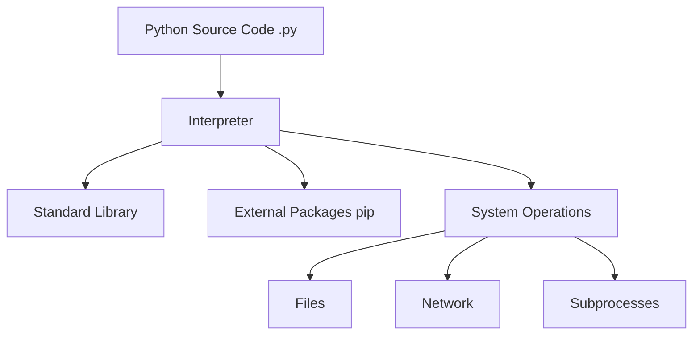

# Introduction to Python for Sysadmins

**Version:** 0.2
**Year:** 2026

---

## Copyright Notice

Copyright (c) 2025-2026 Ryan Thomas Robson / Robworks Software LLC. Licensed under [CC BY-NC-ND 4.0](../../LICENSE-CONTENT). You may share this material for non-commercial purposes with attribution, but you may not distribute modified versions.

---

Python has become the de facto standard for systems automation and tool building. Its clean syntax and extensive standard library make it an ideal choice for replacing complex shell scripts and integrating with modern APIs. If you can write a Bash one-liner, you can learn Python - and the payoff is scripts that are easier to read, test, and maintain.



---

## Python 2 vs Python 3

Python 2 reached end of life on January 1, 2020. No security patches, no bug fixes, nothing. Every new project should use Python 3, and most distributions now ship Python 3 as the default `python3` binary.

The practical differences you'll encounter:

| Feature | Python 2 | Python 3 |
|---------|---------|---------|
| Print | `print "hello"` (statement) | `print("hello")` (function) |
| Division | `5 / 2` returns `2` | `5 / 2` returns `2.5` |
| Strings | ASCII by default | Unicode by default |
| Input | `raw_input()` | `input()` |

If you encounter a legacy script that starts with `#!/usr/bin/python` (without the `3`), check which version it targets before running it.

!!! tip "Always use `python3` explicitly"
    On many systems, `python` may point to Python 2 or may not exist at all. Always use `python3` and `pip3` (or `python3 -m pip`) in your scripts and documentation. This avoids ambiguity on systems where both versions are installed.

---

## Environment Setup

One of the most important concepts in Python development is the **virtual environment**. It creates an isolated space for each project's dependencies, so installing a library for one script doesn't break another.

### Why Virtual Environments Matter

Without a virtual environment, `pip install` puts packages in the system Python's `site-packages` directory. This causes problems:

- Two projects need different versions of the same library.
- A `pip install --upgrade` breaks a working script because another script depended on the old version.
- System tools written in Python (like `apt` on Ubuntu) can break if you modify the system Python's packages.

### Using `venv`

[**`venv`**](https://docs.python.org/3/library/venv.html) is the standard tool for creating virtual environments. It ships with Python 3 - no installation needed.

```bash
# Create a virtual environment in a directory named 'venv'
python3 -m venv venv

# Activate the environment (your prompt changes to show it's active)
source venv/bin/activate

# Now pip installs go into this environment only
pip install requests

# See what's installed in this environment
pip list

# Save dependencies to a file (for reproducibility)
pip freeze > requirements.txt

# Deactivate when finished
deactivate
```

```terminal
scenario: "Set up a virtual environment, install a package, and manage dependencies"
steps:
  - command: "python3 -m venv venv"
    output: ""
    narration: "Create a virtual environment directory named 'venv' in the current project folder. This copies the Python interpreter and creates an isolated site-packages directory."
  - command: "source venv/bin/activate"
    output: "(venv) $"
    narration: "Activate the environment. Your shell prompt changes to show you're working inside the virtual environment. All python3 and pip commands now use this environment."
  - command: "pip install requests"
    output: "Collecting requests\n  Downloading requests-2.31.0-py3-none-any.whl (62 kB)\nCollecting urllib3<3,>=1.21.1\nCollecting certifi>=2017.4.17\nCollecting charset-normalizer<4,>=2\nCollecting idna<4,>=2.5\nInstalling collected packages: urllib3, certifi, charset-normalizer, idna, requests\nSuccessfully installed certifi-2024.2.2 charset-normalizer-3.3.2 idna-3.6 requests-2.31.0 urllib3-2.2.1"
    narration: "Install the requests library. Notice pip also installs its dependencies (urllib3, certifi, etc.). These are installed only within this virtual environment, not system-wide."
  - command: "pip freeze"
    output: "certifi==2024.2.2\ncharset-normalizer==3.3.2\nidna==3.6\nrequests==2.31.0\nurllib3==2.2.1"
    narration: "pip freeze lists every installed package with exact versions. Redirect this to requirements.txt so others can recreate your environment."
  - command: "pip freeze > requirements.txt"
    output: ""
    narration: "Save the dependency list. Another developer (or your production server) can now run pip install -r requirements.txt to get the exact same packages."
  - command: "deactivate"
    output: "$"
    narration: "Exit the virtual environment and return to your system Python. The packages you installed are still inside the venv directory but are no longer on your PATH."
```

!!! warning "System Python vs user Python"
    On Ubuntu 23.04+, `pip install` outside a virtual environment is blocked by default (PEP 668). You'll see an "externally-managed-environment" error. This is by design - it prevents you from accidentally breaking system tools. Always use a virtual environment for project dependencies.

---

## Basic Syntax

Python uses **indentation** to define blocks of code, rather than braces or keywords. This enforces readability but can trip you up if you mix tabs and spaces (don't - use spaces, and configure your editor for 4-space indentation).

```python
# A simple script to check disk usage
import shutil

def check_disk(path):
    total, used, free = shutil.disk_usage(path)
    percent_used = (used / total) * 100

    if percent_used > 90:
        print(f"WARNING: Disk usage at {percent_used:.2f}% on {path}")
    else:
        print(f"Disk usage is healthy: {percent_used:.2f}%")

check_disk("/")
```

### Key Differences from Shell Scripting

| Shell | Python | Notes |
|-------|--------|-------|
| `name="Junie"` | `name = "Junie"` | No `$` prefix, spaces around `=` |
| `echo "$name"` | `print(name)` or `print(f"{name}")` | f-strings for formatting |
| Arrays are awkward | Lists, dicts, sets built in | First-class data structures |
| `source util.sh` | `import util` | Module system with namespaces |
| `$1`, `$2` | `sys.argv[1]`, `sys.argv[2]` | Or use `argparse` for flags |
| `[[ -f file ]]` | `os.path.isfile("file")` | Or `pathlib.Path("file").is_file()` |

### The REPL

Python ships with an interactive interpreter - the **REPL** (Read-Eval-Print Loop). It's invaluable for testing snippets, exploring modules, and debugging.

```bash
$ python3
>>> import os
>>> os.cpu_count()
8
>>> os.getenv("HOME")
'/home/admin'
>>> help(os.path.isfile)
>>> exit()
```

---

## Variables and Types

Python is **dynamically typed** - you don't declare variable types. The interpreter infers them from the assigned value.

```python
hostname = "web01"           # str
port = 8080                  # int
load_average = 2.45          # float
is_active = True             # bool
tags = ["prod", "us-east"]   # list
config = {"debug": False}    # dict
```

### Type Checking at Runtime

```python
# Check a variable's type
type(hostname)    # <class 'str'>
type(port)        # <class 'int'>

# Convert between types
str(port)         # "8080"
int("8080")       # 8080
float("2.45")     # 2.45
```

### Common Built-in Functions

These are functions you'll use constantly:

| Function | Purpose | Example |
|----------|---------|---------|
| `len()` | Length of a collection or string | `len("hello")` returns `5` |
| `range()` | Generate a sequence of numbers | `range(5)` produces `0, 1, 2, 3, 4` |
| `type()` | Check a value's type | `type(42)` returns `<class 'int'>` |
| `str()`, `int()`, `float()` | Type conversion | `int("42")` returns `42` |
| `sorted()` | Return a sorted copy | `sorted([3, 1, 2])` returns `[1, 2, 3]` |
| `enumerate()` | Loop with index | `for i, v in enumerate(items)` |
| `zip()` | Loop over multiple lists | `for a, b in zip(names, ips)` |
| `input()` | Read user input | `name = input("Enter name: ")` |

---

## Error Handling

Things go wrong: files are missing, networks are down, users provide bad input. Python uses `try`/`except` blocks to handle errors gracefully instead of crashing.

```python
import json

def load_config(path):
    try:
        with open(path) as f:
            return json.load(f)
    except FileNotFoundError:
        print(f"Config file not found: {path}")
        return {}
    except json.JSONDecodeError as e:
        print(f"Invalid JSON in {path}: {e}")
        return {}

config = load_config("settings.json")
```

The pattern is: `try` the operation, `except` specific errors you expect, and handle them meaningfully. Avoid bare `except:` (catches everything including keyboard interrupts) - always catch specific exception types.

---

## Making Scripts Executable

To run a Python script like a regular command (without typing `python3` every time):

```python
#!/usr/bin/env python3
"""Check disk usage and warn if above threshold."""

import shutil
import sys

def main():
    path = sys.argv[1] if len(sys.argv) > 1 else "/"
    total, used, free = shutil.disk_usage(path)
    percent = (used / total) * 100

    if percent > 90:
        print(f"CRITICAL: {path} at {percent:.1f}%")
        sys.exit(2)
    elif percent > 75:
        print(f"WARNING: {path} at {percent:.1f}%")
        sys.exit(1)
    else:
        print(f"OK: {path} at {percent:.1f}%")
        sys.exit(0)

if __name__ == "__main__":
    main()
```

```bash
# Make it executable
chmod +x check_disk.py

# Run it directly
./check_disk.py /home
```

The `#!/usr/bin/env python3` shebang line tells the OS to use whichever `python3` is on the PATH. The `if __name__ == "__main__"` guard ensures `main()` only runs when the script is executed directly, not when it's imported as a module by another script.

```code-walkthrough
title: "Anatomy of a Python Script"
description: "The structure and conventions of a well-organized Python CLI script."
code: |
  #!/usr/bin/env python3
  """Check disk usage and warn if above threshold."""

  import shutil
  import sys

  def main():
      path = sys.argv[1] if len(sys.argv) > 1 else "/"
      total, used, free = shutil.disk_usage(path)
      percent = (used / total) * 100

      if percent > 90:
          print(f"CRITICAL: {path} at {percent:.1f}%")
          sys.exit(2)
      elif percent > 75:
          print(f"WARNING: {path} at {percent:.1f}%")
          sys.exit(1)
      else:
          print(f"OK: {path} at {percent:.1f}%")
          sys.exit(0)

  if __name__ == "__main__":
      main()
annotations:
  - line: 1
    text: "The shebang line. '#!/usr/bin/env python3' uses env to find python3 on the PATH, making the script portable across systems where Python is installed in different locations."
  - line: 2
    text: "A docstring at the top of the file documents what the script does. This shows up in help() and in tools that generate documentation."
  - line: 4
    text: "Standard library imports come first, one per line, in alphabetical order. This is the convention enforced by tools like isort."
  - line: 7
    text: "Wrapping logic in a main() function keeps the global namespace clean and makes the script testable - you can import and call main() from a test."
  - line: 8
    text: "A conditional expression (ternary) provides a default value if no argument is given. sys.argv[0] is always the script name, sys.argv[1] is the first argument."
  - line: 9
    text: "Tuple unpacking assigns all three return values from disk_usage() in one line. This is more readable than accessing them by index."
  - line: 14
    text: "Exit codes follow the Nagios/monitoring convention: 0 = OK, 1 = WARNING, 2 = CRITICAL. This makes the script usable as a monitoring check."
  - line: 22
    text: "The __name__ guard. When Python runs a file directly, __name__ is set to '__main__'. When the file is imported by another script, __name__ is set to the module name - so main() won't run on import."
```

---

## Interactive Quizzes

```quiz
question: "What is the primary reason for using a virtual environment in Python?"
type: multiple-choice
options:
  - text: "To make Python scripts run faster."
    feedback: "Virtual environments are for dependency isolation, not performance."
  - text: "To isolate project dependencies and avoid version conflicts."
    correct: true
    feedback: "Correct! Virtual environments ensure that each project has its own set of libraries, preventing conflicts where one project needs version A and another needs version B."
  - text: "To encrypt the source code for security."
    feedback: "Virtual environments don't provide encryption - they isolate package installations."
  - text: "To compile Python into a binary executable."
    feedback: "Tools like PyInstaller handle compilation. Virtual environments manage dependencies."
```

```quiz
question: "How does Python define blocks of code (function bodies, loop bodies, conditionals)?"
type: multiple-choice
options:
  - text: "Using curly braces { }."
    feedback: "C, Java, and JavaScript use braces. Python uses indentation."
  - text: "Using BEGIN and END keywords."
    feedback: "Ruby and Pascal use BEGIN/END. Python relies on whitespace."
  - text: "Using consistent indentation (whitespace)."
    correct: true
    feedback: "Correct! Python uses indentation (conventionally 4 spaces) to define block structure. This enforced consistency is one of the reasons Python code tends to be readable."
  - text: "Using semicolons at the end of every line."
    feedback: "Semicolons are optional statement separators in Python and are rarely used."
```

```quiz
question: "What does `if __name__ == '__main__':` do in a Python script?"
type: multiple-choice
options:
  - text: "It's required syntax to start a Python program."
    feedback: "Python scripts run fine without it. It's a convention, not a requirement."
  - text: "It ensures the code only runs when the script is executed directly, not when imported as a module."
    correct: true
    feedback: "Correct! When Python runs a file directly, __name__ is set to '__main__'. When the file is imported, __name__ is set to the module name. This guard lets you write files that work both as scripts and as importable modules."
  - text: "It runs the code with elevated privileges."
    feedback: "Python doesn't have a built-in privilege escalation mechanism. Use sudo or setuid for that."
  - text: "It compiles the script before execution."
    feedback: "Python compiles to bytecode automatically. The __name__ guard controls execution flow, not compilation."
```

---

```exercise
title: "Write a CLI Disk Usage Checker"
scenario: |
  You need a monitoring script that checks disk usage across multiple filesystems. Write a Python script that:

  1. Accepts one or more filesystem paths as command-line arguments (default to `/` if none provided)
  2. For each path, displays the usage percentage formatted to one decimal place
  3. Exits with code 2 if any path exceeds 90%, code 1 if any exceeds 75%, code 0 otherwise
  4. Handles the case where a path doesn't exist (prints an error message and skips it)
  5. Uses a shebang line and `__name__` guard
hints:
  - "Use shutil.disk_usage(path) to get total, used, and free bytes"
  - "sys.argv[1:] gives you all arguments after the script name - default to ['/'] if empty"
  - "Track the worst exit code across all paths and use it as the final exit code"
  - "Wrap disk_usage() in a try/except to catch OSError for invalid paths"
solution: |
  #!/usr/bin/env python3
  """Check disk usage for one or more paths."""

  import shutil
  import sys

  def check_path(path):
      """Return (message, exit_code) for a single path."""
      try:
          total, used, free = shutil.disk_usage(path)
      except OSError as e:
          return f"ERROR: {path} - {e}", 2

      percent = (used / total) * 100
      if percent > 90:
          return f"CRITICAL: {path} at {percent:.1f}%", 2
      elif percent > 75:
          return f"WARNING: {path} at {percent:.1f}%", 1
      else:
          return f"OK: {path} at {percent:.1f}%", 0

  def main():
      paths = sys.argv[1:] or ["/"]
      worst_code = 0

      for path in paths:
          message, code = check_path(path)
          print(message)
          worst_code = max(worst_code, code)

      sys.exit(worst_code)

  if __name__ == "__main__":
      main()
```

---

## Further Reading

- [Python Official Documentation](https://docs.python.org/) - the definitive reference for all standard library modules
- [Real Python: Virtual Environments](https://realpython.com/python-virtual-environments-a-primer/) - in-depth guide to venv, virtualenv, and environment management
- [Automate the Boring Stuff with Python](https://automatetheboringstuff.com/) - practical guide focused on automation tasks
- [PEP 8 Style Guide](https://peps.python.org/pep-0008/) - the official Python style conventions

---

**Next:** [Data Structures and Logic](data-structures-and-logic.md) | [Back to Index](README.md)
