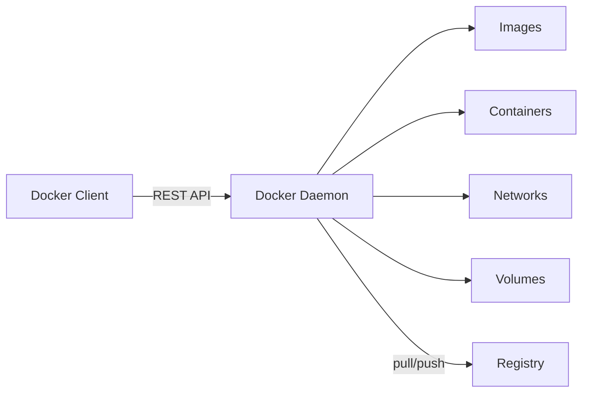
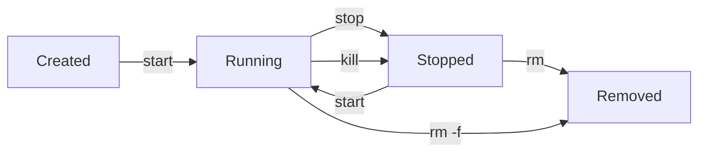

# Docker Fundamentals

Docker provides a way to package and run an application in an isolated environment called a **container**. The isolation and security allow you to run many containers simultaneously on a given host. Unlike virtual machines, containers share the host kernel and start in milliseconds rather than minutes - making them the standard unit of deployment for modern applications.

---

## Understanding the Architecture

Docker uses a client-server architecture. The [**Docker client**](https://docs.docker.com/engine/reference/commandline/cli/) talks to the [**Docker daemon**](https://docs.docker.com/engine/reference/commandline/dockerd/), which does the heavy lifting of building, running, and distributing your containers.

- **Docker Daemon (`dockerd`)**: Listens for Docker API requests and manages Docker objects such as images, containers, networks, and volumes. It runs as a background service on the host.
- **Docker Client (`docker`)**: The primary way users interact with Docker. When you run commands like `docker run`, the client sends these commands to `dockerd` via the Docker API.
- **Docker Registries**: Stores and distributes Docker images. [**Docker Hub**](https://hub.docker.com/) is the default public registry. Organizations often run private registries using [**Harbor**](https://goharbor.io/) or cloud-provider registries (ECR, GCR, ACR).



---

## Images and Containers

### Images

An **image** is a read-only template with instructions for creating a Docker container. Images are built in layers - each instruction in a Dockerfile creates a new layer stacked on top of the previous ones. When you change a layer, only that layer and everything above it gets rebuilt.

```bash
# List images on your system
docker images

# Pull an image from Docker Hub without running it
docker pull nginx:1.25

# Remove an image
docker rmi nginx:1.25
```

!!! tip "Image layer caching"
    Docker caches each layer independently. If nothing changed in a layer, Docker reuses the cached version. This is why Dockerfiles copy dependency files (like `package.json` or `requirements.txt`) before copying application code - dependencies change less frequently, so that layer stays cached across most builds.

### Containers

A **container** is a runnable instance of an image. You can create, start, stop, and delete containers using the Docker CLI. Each container gets its own filesystem, networking, and process tree - isolated from the host and from other containers.

Containers are **ephemeral** by default. When you remove a container, any data written inside it is gone. This is by design - it forces you to think about persistence explicitly through volumes.

---

## Container Lifecycle

A container moves through several states during its life:



```bash
# Create a container without starting it
docker create --name my-app nginx

# Start a stopped or created container
docker start my-app

# Stop gracefully (sends SIGTERM, then SIGKILL after timeout)
docker stop my-app

# Kill immediately (sends SIGKILL)
docker kill my-app

# Remove a stopped container
docker rm my-app

# Force-remove a running container (stop + rm in one step)
docker rm -f my-app
```

---

## Running Containers

The `docker run` command combines `create` and `start` into a single step. It pulls the image if not present, creates a container, and starts it.

```bash
# Run Nginx in the background, map port 8080 on host to 80 in container
docker run -d --name my-web -p 8080:80 nginx

# Run an interactive Ubuntu shell (removed on exit)
docker run -it --rm ubuntu bash

# Run with environment variables
docker run -d --name my-db \
  -e POSTGRES_USER=admin \
  -e POSTGRES_PASSWORD=secret \
  -p 5432:5432 \
  postgres:16
```

- `-d`: **Detached mode** - runs in the background and prints the container ID.
- `-it`: **Interactive terminal** - allocates a pseudo-TTY and keeps STDIN open. Use this for shells.
- `--rm`: Automatically remove the container when it exits. Good for throwaway tasks.
- `--name`: Assigns a human-readable name instead of Docker's random names.
- `-p HOST:CONTAINER`: Maps a host port to a container port.
- `-e KEY=VALUE`: Sets an environment variable inside the container.

### Inspecting Running Containers

```bash
# List running containers
docker ps

# List all containers (including stopped)
docker ps -a

# View detailed container metadata (networking, mounts, config)
docker inspect my-web

# See resource usage (CPU, memory, network I/O)
docker stats
```

---

## Working Inside Containers

You frequently need to run commands inside a running container for debugging, database administration, or one-off tasks.

```bash
# Open a shell in a running container
docker exec -it my-web bash

# Run a single command without an interactive shell
docker exec my-db psql -U admin -c "SELECT version();"

# View container logs (stdout/stderr)
docker logs my-web

# Follow logs in real time (like tail -f)
docker logs -f --tail 100 my-web
```

!!! warning "Running as root inside containers"
    By default, processes inside a container run as root. This means a container breakout vulnerability gives the attacker root access on the host. Always add a `USER` directive in your Dockerfile to run as a non-root user, and use `--read-only` to mount the container filesystem as read-only where possible.

---

## Dockerfile: Building Your Own Image

A [**Dockerfile**](https://docs.docker.com/engine/reference/builder/) is a text file with instructions for assembling an image. Each instruction creates a layer.

### Basic Dockerfile

```dockerfile
# Start from an official Python image
FROM python:3.12-slim

# Set the working directory
WORKDIR /app

# Copy dependency file first (layer caching)
COPY requirements.txt .
RUN pip install --no-cache-dir -r requirements.txt

# Copy application code
COPY . .

# Expose the port the app runs on
EXPOSE 8000

# Run the application
CMD ["python", "app.py"]
```

### Key Instructions

| Instruction | Purpose |
|------------|---------|
| `FROM` | Sets the base image. Every Dockerfile starts with this. |
| `WORKDIR` | Sets the working directory for subsequent instructions. |
| `COPY` | Copies files from the build context into the image. |
| `RUN` | Executes a command during the build (installing packages, compiling code). |
| `EXPOSE` | Documents which port the container listens on. Does not actually publish it. |
| `CMD` | Default command when the container starts. Only the last `CMD` takes effect. |
| `ENTRYPOINT` | Like `CMD`, but arguments passed to `docker run` are appended rather than replacing it. |
| `ENV` | Sets environment variables available during build and at runtime. |
| `USER` | Switches to a non-root user for subsequent instructions and at runtime. |
| `ARG` | Defines build-time variables (not available at runtime). |

### The `.dockerignore` File

Just like `.gitignore`, a `.dockerignore` file prevents unnecessary files from being sent to the Docker daemon during builds. This speeds up builds and prevents secrets from leaking into images.

```
.git
node_modules
__pycache__
*.pyc
.env
.vscode
README.md
```

### Building and Tagging

```bash
# Build from the current directory
docker build -t my-app .

# Build with a specific tag (version)
docker build -t my-app:1.0.0 .

# Build and specify a different Dockerfile
docker build -f Dockerfile.prod -t my-app:prod .
```

---

## Multi-Stage Builds

Multi-stage builds let you use multiple `FROM` statements in a single Dockerfile. This is the standard pattern for producing small, secure production images - you compile or build in one stage, then copy only the artifacts into a minimal final stage.

```dockerfile
# Stage 1: Build
FROM golang:1.22 AS builder
WORKDIR /src
COPY go.mod go.sum ./
RUN go mod download
COPY . .
RUN CGO_ENABLED=0 go build -o /app

# Stage 2: Production
FROM alpine:3.19
RUN apk --no-cache add ca-certificates
COPY --from=builder /app /app
USER nobody
ENTRYPOINT ["/app"]
```

The final image contains only the compiled binary and ca-certificates - no Go toolchain, no source code. A Go application image built this way is typically 10-20 MB instead of 800+ MB.

```code-walkthrough
title: "Multi-Stage Dockerfile Anatomy"
description: "How a multi-stage build separates build tools from the production image."
code: |
  FROM golang:1.22 AS builder
  WORKDIR /src
  COPY go.mod go.sum ./
  RUN go mod download
  COPY . .
  RUN CGO_ENABLED=0 go build -o /app

  FROM alpine:3.19
  RUN apk --no-cache add ca-certificates
  COPY --from=builder /app /app
  USER nobody
  ENTRYPOINT ["/app"]
annotations:
  - line: 1
    text: "The first FROM starts the build stage. 'AS builder' names it so later stages can reference it. This image includes the full Go toolchain (~800 MB)."
  - line: 2
    text: "WORKDIR creates and switches to /src. All subsequent commands run from this directory."
  - line: 3
    text: "Copy dependency manifests first. If go.mod and go.sum haven't changed, Docker reuses the cached layer from the next step - skipping a potentially slow download."
  - line: 4
    text: "Download all dependencies. This layer is cached independently, so adding new application code won't re-trigger this step."
  - line: 5
    text: "Now copy the full source code. This layer invalidates on every code change, but the dependency layer above stays cached."
  - line: 6
    text: "CGO_ENABLED=0 produces a statically linked binary with no C library dependency - required for running on minimal images like alpine or scratch."
  - line: 8
    text: "The second FROM starts a fresh stage from alpine (~5 MB). Nothing from the builder stage carries over unless explicitly copied."
  - line: 9
    text: "Install CA certificates so the binary can make HTTPS calls. The --no-cache flag avoids storing the package index in the image."
  - line: 10
    text: "COPY --from=builder copies the compiled binary from the first stage. This is the key to multi-stage builds - cherry-pick only what the production image needs."
  - line: 11
    text: "Switch to the 'nobody' user. The final image runs without root privileges, limiting the blast radius of any container escape."
  - line: 12
    text: "ENTRYPOINT sets the binary as the container's main process. Unlike CMD, arguments passed to 'docker run' are appended to the entrypoint rather than replacing it."
```

---

## Volumes and Persistence

Containers are ephemeral - when you remove one, its filesystem is gone. **Volumes** are Docker's mechanism for persistent data that outlives any individual container.

### Volume Types

| Type | Syntax | Use Case |
|------|--------|----------|
| Named volume | `-v mydata:/var/lib/data` | Production data (databases, uploads). Docker manages the storage location. |
| Bind mount | `-v /host/path:/container/path` | Development (mount source code for live reloading). |
| tmpfs mount | `--tmpfs /tmp` | Scratch space that should never touch disk (secrets, session data). |

```bash
# Create and use a named volume
docker volume create pgdata
docker run -d --name db -v pgdata:/var/lib/postgresql/data postgres:16

# Bind mount for development
docker run -d --name dev-app -v $(pwd):/app -p 3000:3000 node:20

# List volumes
docker volume ls

# Remove unused volumes
docker volume prune
```

!!! danger "Bind mounts expose the host filesystem"
    Bind mounts give the container direct access to host directories. A misconfigured bind mount (e.g., `-v /:/host`) can expose the entire host filesystem. In production, prefer named volumes. Reserve bind mounts for development workflows where you need live code reloading.

---

## Networking

Docker creates isolated networks so containers can communicate with each other without exposing ports to the host.

### Network Types

| Driver | Description |
|--------|-------------|
| `bridge` | Default driver. On user-defined bridge networks, containers reach each other by container name; the built-in `bridge` network does not provide name resolution. |
| `host` | Removes network isolation - the container shares the host's network stack. |
| `none` | Disables networking entirely. |
| `overlay` | Spans multiple Docker hosts. Used with Docker Swarm for multi-node clusters. |

```bash
# Create a custom bridge network
docker network create my-net

# Run containers on the same network
docker run -d --name api --network my-net my-api-image
docker run -d --name db --network my-net postgres:16

# The api container can now reach the database at hostname "db"
# No port publishing needed for container-to-container communication
```

Containers on the default `bridge` network cannot resolve each other by name - they can only communicate by IP address. Custom bridge networks enable DNS-based service discovery, which is why you should always create a named network for multi-container setups.

---

## Resource Limits

Without limits, a single container can consume all available CPU and memory on the host, starving other containers and system processes.

```bash
# Limit memory to 512MB and CPU to 1.5 cores
docker run -d --name api \
  --memory=512m \
  --cpus=1.5 \
  my-api-image

# Set a memory reservation (soft limit) and hard limit
docker run -d --name worker \
  --memory=1g \
  --memory-reservation=512m \
  my-worker-image
```

If a container exceeds its memory limit, Docker kills it with an out-of-memory (OOM) error. You can see this in `docker inspect`:

```bash
docker inspect my-app --format='{{.State.OOMKilled}}'
```

---

## Debugging Containers

When a container crashes or behaves unexpectedly, these commands help you diagnose the problem.

```bash
# Check why a container stopped
docker inspect my-app --format='{{.State.ExitCode}} {{.State.Error}}'

# View the last 200 lines of logs
docker logs --tail 200 my-app

# See what changed in the container's filesystem since it started
docker diff my-app

# Export a stopped container's filesystem for inspection
docker export my-app | tar -tf - | head -50

# Start a fresh container from the same image for comparison
docker run -it --rm my-app-image sh
```

Common exit codes:

| Code | Meaning |
|------|---------|
| `0` | Clean exit |
| `1` | Application error |
| `137` | Killed by OOM or `docker kill` (128 + SIGKILL=9) |
| `139` | Segmentation fault (128 + SIGSEGV=11) |
| `143` | Graceful stop via `docker stop` (128 + SIGTERM=15) |

---

## Putting It All Together

```terminal
scenario: "Build and deploy a Python web application with Docker"
steps:
  - command: "ls"
    output: "Dockerfile  app.py  requirements.txt"
    narration: "You have a Python application with its Dockerfile and dependency file ready."
  - command: "cat Dockerfile"
    output: "FROM python:3.12-slim\nWORKDIR /app\nRUN adduser --disabled-password --no-create-home appuser\nCOPY requirements.txt .\nRUN pip install --no-cache-dir -r requirements.txt\nCOPY . .\nUSER appuser\nEXPOSE 8000\nCMD [\"uvicorn\", \"app:app\", \"--host\", \"0.0.0.0\", \"--port\", \"8000\"]"
    narration: "The Dockerfile uses a slim base image, creates a dedicated non-root user, installs dependencies first for layer caching, copies application code, switches to that user, and runs the app with uvicorn."
  - command: "docker build -t my-api:1.0 ."
    output: "[+] Building 12.3s (9/9) FINISHED\n => [1/5] FROM python:3.12-slim\n => [2/5] WORKDIR /app\n => [3/5] COPY requirements.txt .\n => [4/5] RUN pip install --no-cache-dir -r requirements.txt\n => [5/5] COPY . .\n => exporting to image\n => naming to docker.io/library/my-api:1.0"
    narration: "Docker builds the image layer by layer. Each step is cached - if you change only app.py, steps 1-4 use the cache and only step 5 runs again."
  - command: "docker images my-api"
    output: "REPOSITORY   TAG   IMAGE ID       CREATED          SIZE\nmy-api       1.0   a3b8f2c1d4e5   12 seconds ago   187MB"
    narration: "The image is 187MB. Using python:3.12-slim instead of the full python:3.12 image saves about 700MB."
  - command: "docker run -d --name api -p 8000:8000 --memory=256m my-api:1.0"
    output: "f7a2b3c4d5e6f7a2b3c4d5e6f7a2b3c4d5e6f7a2b3c4d5e6f7a2b3c4"
    narration: "Start the container in detached mode with a port mapping and a 256MB memory limit. Docker prints the full container ID."
  - command: "docker ps"
    output: "CONTAINER ID   IMAGE        COMMAND                  STATUS          PORTS                    NAMES\nf7a2b3c4d5e6   my-api:1.0   \"uvicorn app:app --h…\"   Up 3 seconds    0.0.0.0:8000->8000/tcp   api"
    narration: "The container is running. Port 8000 on your machine now forwards to the container."
  - command: "curl -s http://localhost:8000/health"
    output: "{\"status\": \"ok\"}"
    narration: "The API responds. Any HTTP client on the host can reach the container through the published port."
  - command: "docker logs api"
    output: "INFO:     Started server process [1]\nINFO:     Waiting for application startup.\nINFO:     Application startup complete.\nINFO:     Uvicorn running on http://0.0.0.0:8000\nINFO:     172.17.0.1:54321 - \"GET /health HTTP/1.1\" 200"
    narration: "Container logs capture everything the process writes to stdout and stderr. You can see the startup messages and the health check request."
  - command: "docker stop api && docker rm api"
    output: "api\napi"
    narration: "Stop the container gracefully (SIGTERM → SIGKILL after 10s), then remove it. The image remains for future use."
```

---

## Interactive Quizzes

```quiz
question: "What is the primary difference between an image and a container?"
type: multiple-choice
options:
  - text: "Images are running instances of containers."
    feedback: "It's the other way around. Containers are running instances of images."
  - text: "A container is a read-only template, while an image is its running instance."
    feedback: "An image is the template; a container is the instance."
  - text: "An image is a read-only template, while a container is its runnable instance."
    correct: true
    feedback: "Correct! Think of an image as a blueprint and a container as the building created from that blueprint. You can create many containers from the same image."
  - text: "There is no difference; the terms are interchangeable."
    feedback: "They are distinct concepts. An image is static and read-only; a container is a running process with its own writable layer."
```

```quiz
question: "Why does a well-written Dockerfile copy `requirements.txt` before copying the rest of the application code?"
type: multiple-choice
options:
  - text: "Python requires it to be copied first."
    feedback: "This is a Docker optimization pattern, not a Python requirement."
  - text: "To take advantage of Docker's layer caching - dependencies change less often than code."
    correct: true
    feedback: "Correct! If requirements.txt hasn't changed, Docker reuses the cached pip install layer. This means rebuilding after a code change takes seconds instead of minutes."
  - text: "To reduce the final image size."
    feedback: "The copy order doesn't affect final image size - the same files end up in the image either way. It affects build speed through caching."
  - text: "To prevent security vulnerabilities."
    feedback: "While Dockerfile best practices improve security, this particular pattern is about build performance through layer caching."
```

```quiz
question: "A container exits with code 137. What happened?"
type: multiple-choice
options:
  - text: "The application crashed with an unhandled exception."
    feedback: "Application exceptions typically produce exit code 1. Code 137 indicates an external signal."
  - text: "The container ran out of memory or was killed with docker kill."
    correct: true
    feedback: "Correct! Exit code 137 = 128 + 9 (SIGKILL). The two most common causes are the OOM killer terminating the process for exceeding its memory limit, or an explicit docker kill command."
  - text: "The Dockerfile had a syntax error."
    feedback: "Dockerfile syntax errors prevent the image from building at all. They don't produce runtime exit codes."
  - text: "Docker could not find the specified image."
    feedback: "Missing images produce an error before the container starts, not an exit code."
```

---

```exercise
title: "Containerize a Python Application"
scenario: |
  You have a Flask API application with `app.py` and `requirements.txt`. Your tasks:

  1. Create a Dockerfile that uses `python:3.12-slim` as the base image
  2. Install dependencies from `requirements.txt` using pip with `--no-cache-dir`
  3. Copy application code after installing dependencies (for layer caching)
  4. Run the app as a non-root user (create a dedicated user with `adduser`)
  5. Create a `.dockerignore` that excludes `.git`, `__pycache__`, `.env`, and `venv/`
  6. Build the image tagged as `flask-app:1.0`
  7. Run the container with port 5000 mapped and a 256MB memory limit
hints:
  - "Start with FROM, then WORKDIR, then COPY just the requirements file"
  - "Use RUN adduser --disabled-password appuser and USER appuser to drop root privileges"
  - "Use EXPOSE to document the port, but -p at runtime to actually publish it"
  - "The .dockerignore syntax is identical to .gitignore"
solution: |
  # Dockerfile
  FROM python:3.12-slim

  WORKDIR /app

  # Create a non-root user
  RUN adduser --disabled-password --no-create-home appuser

  # Install dependencies first (layer caching)
  COPY requirements.txt .
  RUN pip install --no-cache-dir -r requirements.txt

  # Copy application code
  COPY . .

  # Switch to non-root user
  USER appuser

  EXPOSE 5000
  CMD ["python", "-m", "flask", "run", "--host=0.0.0.0"]

  # .dockerignore
  # .git
  # __pycache__
  # *.pyc
  # .env
  # venv/
  # .vscode

  # Build and run:
  # docker build -t flask-app:1.0 .
  # docker run -d -p 5000:5000 --memory=256m flask-app:1.0
```

---

## Further Reading

- [Docker Documentation](https://docs.docker.com/) - official guides covering installation, configuration, and advanced features
- [Dockerfile Best Practices](https://docs.docker.com/develop/develop-images/dockerfile_best-practices/) - official recommendations for writing efficient, secure Dockerfiles
- [Docker Hub](https://hub.docker.com/) - the default public registry with official and community images
- [Dive](https://github.com/wagoodman/dive) - a tool for exploring Docker image layers and finding wasted space

---

**Next:** [Docker Compose](compose.md) | [Back to Index](README.md)
