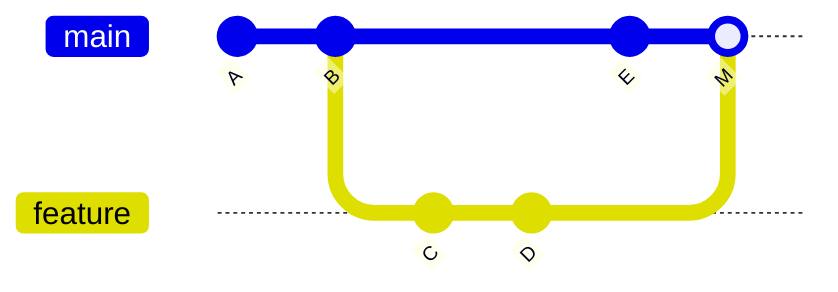

# Branches and Merging

Branching is where Git's design pays off. In older systems like SVN, creating a branch meant copying the entire directory tree - it was slow, expensive, and merging was painful enough that teams avoided branches. In Git, a branch is a 41-byte file containing a commit hash. Creating one is instant. Merging is a first-class operation. This changes how you work: branches become disposable tools for isolating work, not heavyweight decisions.

---

## What Is a Branch?

A **branch** in Git is a movable pointer to a commit. That's it. The file `.git/refs/heads/main` contains the 40-character SHA-1 hash of the commit that `main` currently points to. When you make a new commit on `main`, Git updates that pointer to the new commit.

```
main ──→ e4f5a6b ──→ c3d4e5f ──→ a1b2c3d
```

When you create a new branch, Git creates a new pointer at the current commit. Both branches now point to the same commit - no files are copied:

```
main ──────→ e4f5a6b
feature/auth ─→ e4f5a6b
```

As you make commits on each branch, their pointers diverge:

```
main ────→ f7g8h9i ──→ e4f5a6b
                         ↑
feature/auth ──→ x1y2z3a ──→ e4f5a6b
```

`HEAD` points to whichever branch you currently have checked out. It's how Git knows which branch to advance when you commit.

```quiz
question: "What is a branch in Git?"
type: multiple-choice
options:
  - text: "A copy of the entire project directory"
    feedback: "That's how SVN implements branches. In Git, a branch is just a pointer (reference) to a commit - a 41-byte file. No files are copied."
  - text: "A movable pointer to a commit"
    correct: true
    feedback: "Correct! A branch is a lightweight, movable reference to a commit object. Creating a branch writes a 41-byte file (the commit hash plus a newline) to .git/refs/heads/. When you commit, the current branch pointer moves forward to the new commit."
  - text: "A separate repository for parallel development"
    feedback: "Branches exist within a single repository. They're references to commits in the same object database, not separate repositories."
  - text: "A tag that moves when you make new commits"
    feedback: "Close - branches and tags are both references to commits. The key difference is that branches move automatically when you commit, while tags stay fixed. But a branch is specifically a movable pointer to a commit."
```

```code-walkthrough
title: Branches as Files in .git/refs/heads/
description: Examining the actual files that represent branches in a Git repository.
code: |
  $ ls .git/refs/heads/
  main
  feature/auth
  bugfix/login-timeout

  $ cat .git/refs/heads/main
  e4f5a6b7c8d9e0f1a2b3c4d5e6f7a8b9c0d1e2f3

  $ cat .git/refs/heads/feature/auth
  x1y2z3a4b5c6d7e8f9a0b1c2d3e4f5a6b7c8d9e0

  $ cat .git/HEAD
  ref: refs/heads/main

  $ git log --oneline main -1
  e4f5a6b Add rate limiting middleware

  $ git log --oneline feature/auth -1
  x1y2z3a Add OAuth2 callback handler
language: bash
annotations:
  - line: 1
    text: "Each branch is a file (or directory for branches with slashes) under .git/refs/heads/."
  - line: 5
    text: "The file contains nothing but the 40-character SHA-1 hash of the commit the branch points to. This is all a branch is."
  - line: 8
    text: "Different branches point to different commits. When you commit on a branch, Git updates this file with the new commit's hash."
  - line: 11
    text: "HEAD is a symbolic reference - it contains the name of the current branch, not a commit hash directly. This is how Git knows which branch to advance on commit."
  - line: 14
    text: "The commit hash in .git/refs/heads/main matches what git log shows. Branches are just named pointers into the commit graph."
```

---

## Creating Branches

```bash
# Create a new branch at the current commit
git branch feature/search

# Create and switch to it in one step
git switch -c feature/search

# Create a branch at a specific commit
git branch hotfix/login a1b2c3d

# Create a branch from another branch
git branch feature/search-v2 feature/search
```

### Listing Branches

```bash
# List local branches (* marks current)
git branch

# List all branches (including remote-tracking)
git branch -a

# List branches with last commit info
git branch -v

# List branches merged into current branch
git branch --merged

# List branches NOT merged into current branch
git branch --no-merged
```

---

## Switching Branches: `git switch` vs `git checkout`

Git 2.23 introduced `git switch` as a clearer alternative to `git checkout` for changing branches:

```bash
# Modern (Git 2.23+)
git switch main
git switch feature/auth
git switch -c new-branch          # Create and switch

# Legacy (still works)
git checkout main
git checkout feature/auth
git checkout -b new-branch        # Create and switch
```

`git checkout` is overloaded - it switches branches, restores files, creates branches, and detaches HEAD. `git switch` does one thing: switch branches. Use `git switch` for branch operations and `git restore` for file operations.

!!! warning "Uncommitted changes and switching"
    If you have uncommitted changes that would conflict with the branch you're switching to, Git refuses the switch to prevent data loss. You have three options: commit the changes, stash them (`git stash`), or discard them (`git restore .`).

---

## Renaming and Deleting Branches

```bash
# Rename current branch
git branch -m new-name

# Rename a specific branch
git branch -m old-name new-name

# Delete a branch (only if fully merged)
git branch -d feature/old

# Force delete (even if not merged - you'll lose unmerged commits)
git branch -D feature/abandoned
```

!!! tip "Recovering a deleted branch"
    Deleted a branch by accident? The commits still exist in the object database. Use `git reflog` to find the commit hash, then recreate the branch: `git branch recovered-branch a1b2c3d`. The [Rewriting History](rewriting-history.md) guide covers the reflog in depth.

---

## Merging

Merging combines the work from two branches. When you run `git merge`, Git takes the commits from one branch and integrates them into the current branch.

### Fast-Forward Merge

A **fast-forward merge** happens when the target branch has no new commits since the source branch diverged. Git simply moves the branch pointer forward - no new commit is created:

**Before:**
```
main:    A ── B
                \
feature:         C ── D
```

```bash
git switch main
git merge feature
```

**After:**
```
main:    A ── B ── C ── D
```

Git moved `main` forward to point at `D`. The history is linear - no merge commit.

### Three-Way Merge

A **three-way merge** happens when both branches have new commits since they diverged. Git finds their common ancestor, compares both branches against it, and creates a new **merge commit** with two parents:

**Before:**
```
main:    A ── B ── E
                \
feature:         C ── D
```

```bash
git switch main
git merge feature
```

**After:**
```
main:    A ── B ── E ── M
                \      /
feature:         C ── D
```

`M` is the merge commit. It has two parents: `E` (from main) and `D` (from feature). The merge commit records that these two lines of development were combined.



### Forcing a Merge Commit

Sometimes you want a merge commit even when a fast-forward is possible, to preserve the record that a branch existed:

```bash
git merge --no-ff feature
```

This is common in workflows where you want the history to show that features were developed on separate branches, even if the history could be linear.

---

## Merge Conflicts

A **merge conflict** happens when both branches modified the same part of the same file. Git can automatically merge changes to different files or different parts of the same file, but when two branches change the same lines, Git can't decide which version to keep.

### What Causes Conflicts

- Both branches edited the same line(s) of the same file
- One branch deleted a file that the other modified
- Both branches added a file with the same name but different content

### Reading Conflict Markers

When a conflict occurs, Git marks the conflicting sections in the file:

```
<<<<<<< HEAD
const timeout = 3000;
=======
const timeout = 5000;
>>>>>>> feature/timeout-update
```

- `<<<<<<< HEAD` to `=======`: your current branch's version
- `=======` to `>>>>>>>`: the incoming branch's version

With `merge.conflictstyle = diff3` configured, Git also shows the original (base) version:

```
<<<<<<< HEAD
const timeout = 3000;
||||||| merged common ancestors
const timeout = 1000;
=======
const timeout = 5000;
>>>>>>> feature/timeout-update
```

This third section (the base) is invaluable - it shows what the code looked like before either change, making it much easier to understand the intent of both modifications.

### Resolution Process

1. Run `git merge` and see the conflict
2. Open the conflicted file(s)
3. Edit to resolve - keep one version, combine both, or write something new
4. Remove all conflict markers (`<<<<<<<`, `=======`, `>>>>>>>`)
5. Stage the resolved file(s) with `git add`
6. Complete the merge with `git commit`

```bash
git merge feature/timeout-update
# CONFLICT: Merge conflict in config.js

# Edit config.js to resolve the conflict
# ... make your edits ...

git add config.js
git commit    # Opens editor with pre-populated merge commit message
```

To abort a merge in progress and return to the pre-merge state:

```bash
git merge --abort
```

```terminal
title: Triggering and Resolving a Merge Conflict
steps:
  - command: "git init conflict-demo && cd conflict-demo"
    output: "Initialized empty Git repository in /home/user/conflict-demo/.git/"
    narration: "Create a fresh repository to demonstrate merge conflicts."
  - command: "echo 'timeout = 1000' > config.txt && git add config.txt && git commit -m 'Set initial timeout'"
    output: "[main (root-commit) a1b2c3d] Set initial timeout"
    narration: "Start with a config file. Both branches will modify this same line, creating a conflict."
  - command: "git switch -c feature/fast-timeout"
    output: "Switched to a new branch 'feature/fast-timeout'"
    narration: "Create a feature branch. It starts at the same commit as main."
  - command: "echo 'timeout = 500' > config.txt && git add config.txt && git commit -m 'Reduce timeout for faster response'"
    output: "[feature/fast-timeout b2c3d4e] Reduce timeout for faster response"
    narration: "On the feature branch, change the timeout to 500."
  - command: "git switch main"
    output: "Switched to branch 'main'"
    narration: "Switch back to main. The file still has timeout = 1000 here."
  - command: "echo 'timeout = 3000' > config.txt && git add config.txt && git commit -m 'Increase timeout for slow networks'"
    output: "[main c3d4e5f] Increase timeout for slow networks"
    narration: "On main, change the timeout to 3000. Now both branches modified the same line differently."
  - command: "git merge feature/fast-timeout"
    output: |
      Auto-merging config.txt
      CONFLICT (content): Merge conflict in config.txt
      Automatic merge failed; fix conflicts and then commit the result.
    narration: "Git can't automatically merge because both branches changed the same line. It marks the conflict in the file and pauses for you to resolve it."
  - command: "cat config.txt"
    output: |
      <<<<<<< HEAD
      timeout = 3000
      =======
      timeout = 500
      >>>>>>> feature/fast-timeout
    narration: "The conflict markers show both versions. HEAD (main) has 3000, the feature branch has 500. You need to decide what the final value should be."
  - command: "echo 'timeout = 2000' > config.txt"
    output: ""
    narration: "Resolve the conflict by choosing a compromise value. In a real project, you'd discuss with the team. Remove all conflict markers and write the final content."
  - command: "git add config.txt && git commit -m 'Merge feature/fast-timeout: compromise on 2000ms timeout'"
    output: "[main d4e5f6a] Merge feature/fast-timeout: compromise on 2000ms timeout"
    narration: "Stage the resolved file and commit to complete the merge. The merge commit records that both branches were integrated."
  - command: "git log --oneline --graph --all"
    output: |
      *   d4e5f6a (HEAD -> main) Merge feature/fast-timeout: compromise on 2000ms timeout
      |\
      | * b2c3d4e (feature/fast-timeout) Reduce timeout for faster response
      * | c3d4e5f Increase timeout for slow networks
      |/
      * a1b2c3d Set initial timeout
    narration: "The graph shows the merge clearly: two branches diverged from a1b2c3d, developed independently, and were merged at d4e5f6a."
```

```quiz
question: "What is the key difference between git merge and git rebase?"
type: multiple-choice
options:
  - text: "Merge creates a new commit combining two branches; rebase replays commits onto a new base"
    correct: true
    feedback: "Correct! Merge creates a merge commit with two parents, preserving the full branching history. Rebase moves your commits to start from a new base point, creating a linear history. Both integrate changes, but the resulting history shape differs. Rebase is covered in the Rewriting History guide."
  - text: "Merge is for local branches; rebase is for remote branches"
    feedback: "Both can work with any branches. The choice is about history shape: merge preserves branch topology, rebase linearizes it."
  - text: "Rebase is safer because it doesn't modify history"
    feedback: "It's the opposite - rebase rewrites commit history (new commit hashes), which is why you should never rebase commits that have been pushed to shared branches. Merge is the non-destructive option."
  - text: "They produce the same result with different syntax"
    feedback: "The end result (file contents) may be the same, but the commit history is different. Merge preserves branch structure; rebase creates linear history."
```

---

## Branch Management Practices

### Naming Conventions

Most teams use prefixed branch names to categorize work:

| Prefix | Purpose | Example |
|--------|---------|---------|
| `feature/` | New functionality | `feature/user-search` |
| `bugfix/` or `fix/` | Bug fixes | `bugfix/login-timeout` |
| `hotfix/` | Urgent production fixes | `hotfix/security-patch` |
| `release/` | Release preparation | `release/2.1.0` |
| `chore/` | Maintenance tasks | `chore/upgrade-deps` |

Keep branch names lowercase, use hyphens for spaces, and include a ticket number if your team uses issue trackers: `feature/PROJ-123-user-search`.

### Short-Lived Branches

Branches work best when they're short-lived. A branch that lives for months accumulates merge conflicts and diverges from the mainline. Aim for branches that last days, not weeks. If a feature is large, break it into smaller branches that merge incrementally.

---

## Exercises

```exercise
title: Merge Conflict Resolution
difficulty: intermediate
scenario: |
  You're working on a project where two developers modified the same files on different branches.
  Simulate a multi-file merge conflict and resolve it.

  1. Create a new repository with two files: `server.py` and `config.json`
  2. Create a branch called `feature/database` and modify both files
  3. Switch back to main and modify both files differently
  4. Merge the feature branch and resolve conflicts in both files
  5. Verify the merge commit has two parents using `git log --graph`
hints:
  - "Create meaningful changes in both files on both branches to ensure conflicts"
  - "After the merge fails, use git status to see which files are conflicted"
  - "Resolve each file separately, then git add each one"
  - "Don't forget to remove ALL conflict markers before staging"
solution: |
  ```bash
  # Setup
  git init multi-conflict && cd multi-conflict

  # Initial files
  cat > server.py << 'EOF'
  HOST = "localhost"
  PORT = 8080
  DEBUG = False
  EOF

  cat > config.json << 'EOF'
  {
    "database": "sqlite",
    "cache": "none"
  }
  EOF

  git add server.py config.json
  git commit -m "Initial server and config"

  # Feature branch changes
  git switch -c feature/database

  cat > server.py << 'EOF'
  HOST = "0.0.0.0"
  PORT = 8080
  DEBUG = False
  DB_POOL_SIZE = 5
  EOF

  cat > config.json << 'EOF'
  {
    "database": "postgresql",
    "cache": "redis",
    "pool_size": 5
  }
  EOF

  git add -A && git commit -m "Configure PostgreSQL and Redis"

  # Main branch changes
  git switch main

  cat > server.py << 'EOF'
  HOST = "localhost"
  PORT = 9090
  DEBUG = True
  EOF

  cat > config.json << 'EOF'
  {
    "database": "mysql",
    "cache": "memcached"
  }
  EOF

  git add -A && git commit -m "Switch to MySQL and update port"

  # Merge (will conflict on both files)
  git merge feature/database

  # Resolve server.py: keep PostgreSQL config with new port
  cat > server.py << 'EOF'
  HOST = "0.0.0.0"
  PORT = 9090
  DEBUG = True
  DB_POOL_SIZE = 5
  EOF

  # Resolve config.json: use PostgreSQL with Redis
  cat > config.json << 'EOF'
  {
    "database": "postgresql",
    "cache": "redis",
    "pool_size": 5
  }
  EOF

  git add server.py config.json
  git commit -m "Merge feature/database: PostgreSQL with updated port"

  # Verify
  git log --oneline --graph --all
  ```
```

```exercise
title: Branch Management
difficulty: beginner
scenario: |
  Practice creating, renaming, deleting, and recovering branches.

  1. Create a new repository with an initial commit
  2. Create three branches: `feature/alpha`, `feature/beta`, `feature/gamma`
  3. Make a commit on `feature/alpha`
  4. Rename `feature/beta` to `feature/beta-v2`
  5. Delete `feature/gamma` (safe delete)
  6. Try to delete `feature/alpha` with safe delete (it should fail - why?)
  7. Switch to main and merge `feature/alpha`, then delete it
  8. Recover `feature/gamma` using the reflog
hints:
  - "git branch -d only deletes branches that are fully merged into the current branch"
  - "Use git reflog to find the commit hash of the deleted branch"
  - "git branch branch-name commit-hash recreates a branch at a specific commit"
  - "git branch -v shows the last commit on each branch"
solution: |
  ```bash
  git init branch-demo && cd branch-demo
  echo "initial" > file.txt
  git add file.txt && git commit -m "Initial commit"

  # Create branches
  git branch feature/alpha
  git branch feature/beta
  git branch feature/gamma

  # Make commit on alpha
  git switch feature/alpha
  echo "alpha work" >> file.txt
  git add file.txt && git commit -m "Alpha feature work"

  # Rename beta
  git branch -m feature/beta feature/beta-v2

  # Delete gamma (safe - it's at the same commit as main)
  git switch main
  git branch -d feature/gamma

  # Try to delete alpha (fails - has unmerged commits)
  git branch -d feature/alpha
  # error: branch 'feature/alpha' is not fully merged

  # Merge alpha first, then delete
  git merge feature/alpha
  git branch -d feature/alpha   # Now succeeds

  # Recover gamma from reflog
  git reflog
  # Find the commit hash where gamma was
  git branch feature/gamma-recovered HEAD~1  # Or use the specific hash
  ```
```

---

## Further Reading

- [Pro Git - Chapter 3: Git Branching](https://git-scm.com/book/en/v2/Git-Branching-Branches-in-a-Nutshell) - comprehensive coverage of branching and merging
- [Official git-merge documentation](https://git-scm.com/docs/git-merge) - complete reference for merge strategies and options
- [Official git-switch documentation](https://git-scm.com/docs/git-switch) - the modern branch-switching command
- [Official git-branch documentation](https://git-scm.com/docs/git-branch) - creating, listing, renaming, and deleting branches

---

**Previous:** [Commits and History](commits-and-history.md) | **Next:** [Remote Repositories](remote-repositories.md) | [Back to Index](README.md)
