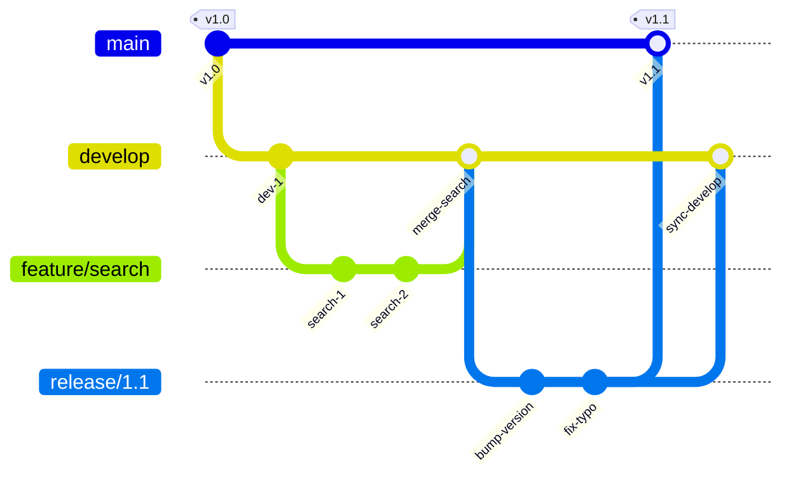
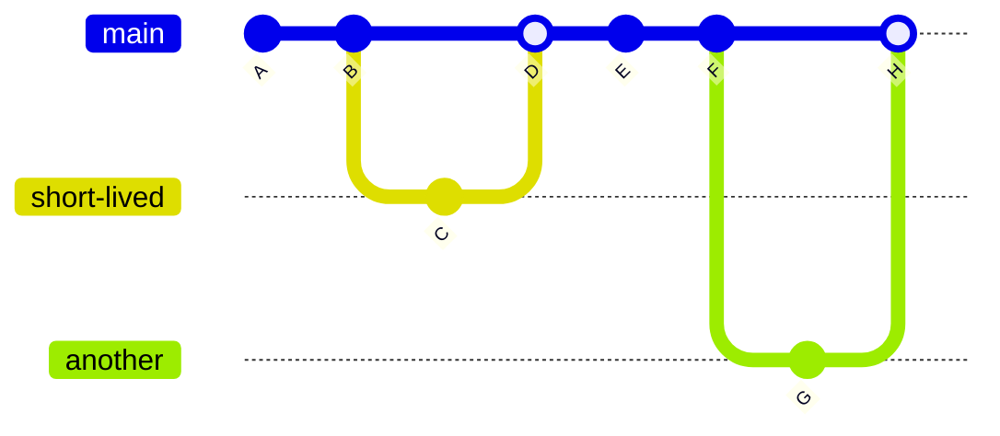
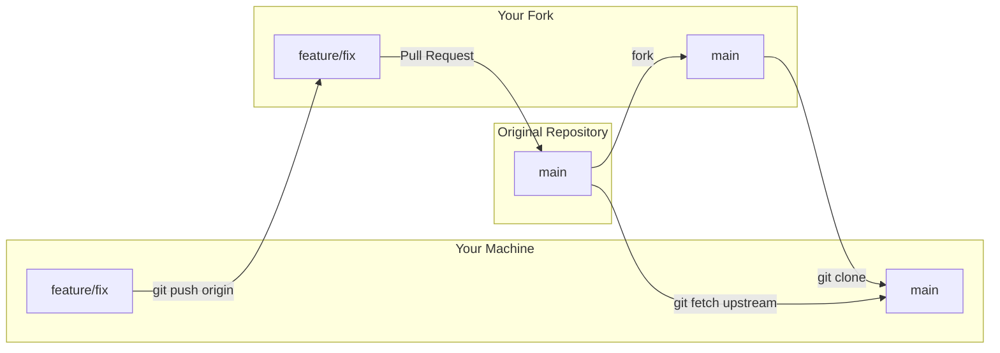

# Collaboration Workflows

Git is flexible enough to support many collaboration models. The right workflow depends on your team size, release cadence, and how much process you want. This guide covers the major workflow patterns, how pull requests fit in, and how to choose the right model for your situation.

---

## Centralized Workflow

The simplest model: everyone pushes to `main`. No feature branches, no pull requests. Each developer pulls, makes changes, and pushes directly.

```bash
git pull origin main
# ... make changes ...
git add . && git commit -m "Add new feature"
git push origin main
```

**When it works:** Small teams (2-3 people) working on different parts of the codebase with minimal overlap. Quick prototypes and internal tools.

**When it breaks:** As the team grows, push conflicts increase. There's no code review before changes hit main. One bad push breaks everyone.

---

## Feature Branch Workflow

The most common workflow in modern development. Each change gets its own branch, work happens in isolation, and code merges into main through a review process.

```bash
git switch -c feature/user-search
# ... develop the feature ...
git push -u origin feature/user-search
# Open a pull request / merge request
# Team reviews, approves, merges
```

**Key principles:**

- `main` is always deployable
- All work happens on branches
- Branches are short-lived (days, not months)
- Changes merge through reviewed pull requests
- Branches are deleted after merging

```terminal
title: Feature Branch Workflow End-to-End
steps:
  - command: "git switch -c feature/user-search"
    output: "Switched to a new branch 'feature/user-search'"
    narration: "Start every piece of work on a new branch from main. The branch name describes what you're building."
  - command: "echo 'search module' > search.py && git add search.py && git commit -m 'Add user search module'"
    output: "[feature/user-search a1b2c3d] Add user search module"
    narration: "Make commits on the feature branch. Each commit should be a logical unit of work."
  - command: "echo 'search tests' > test_search.py && git add test_search.py && git commit -m 'Add search tests'"
    output: "[feature/user-search b2c3d4e] Add search tests"
    narration: "Add tests. The branch now has two focused commits."
  - command: "git push -u origin feature/user-search"
    output: |
      Enumerating objects: 7, done.
      To github.com:user/project.git
       * [new branch]      feature/user-search -> feature/user-search
      branch 'feature/user-search' set up to track 'origin/feature/user-search'.
    narration: "Push the branch and open a pull request on your platform. The -u flag sets up tracking so future pushes are just 'git push'."
  - command: "git switch main && git merge --no-ff feature/user-search"
    output: |
      Merge made by the 'ort' strategy.
       search.py      | 1 +
       test_search.py | 1 +
       2 files changed, 2 insertions(+)
    narration: "After review and approval, merge into main. The --no-ff flag creates a merge commit so the branch history is visible in the graph. In practice, this merge often happens through the platform's merge button."
  - command: "git branch -d feature/user-search && git push origin --delete feature/user-search"
    output: |
      Deleted branch feature/user-search (was b2c3d4e).
      To github.com:user/project.git
       - [deleted]         feature/user-search
    narration: "Delete the branch locally and remotely. The work is preserved in the merge commit on main."
```

---

## Gitflow

[**Gitflow**](https://nvie.com/posts/a-successful-git-branching-model/) is a structured branching model designed for projects with scheduled releases. It defines specific branch roles:

| Branch | Purpose | Lifetime |
|--------|---------|----------|
| `main` | Production-ready code, every commit is a release | Permanent |
| `develop` | Integration branch for features | Permanent |
| `feature/*` | Individual features | Short (merge into develop) |
| `release/*` | Release preparation, bug fixes, versioning | Short (merge into main and develop) |
| `hotfix/*` | Urgent production fixes | Short (merge into main and develop) |



**When it works:** Projects with formal release schedules, multiple environments (staging, production), and regulatory requirements for release tracking.

**When it breaks:** Teams practicing continuous deployment. The overhead of maintaining `develop`, creating release branches, and double-merging is unnecessary when you ship from main directly. The original author of Gitflow has acknowledged this - for web applications with continuous delivery, simpler models are better.

```quiz
question: "What problem does Gitflow solve that the feature-branch workflow doesn't?"
type: multiple-choice
options:
  - text: "It provides a structured release process with dedicated release branches and hotfix paths"
    correct: true
    feedback: "Correct! Gitflow adds release branches (for stabilization before a release), hotfix branches (for urgent production fixes), and a develop branch (for ongoing integration). These support formal release management that simple feature branching doesn't address."
  - text: "It prevents merge conflicts"
    feedback: "Gitflow doesn't prevent merge conflicts - it may actually increase them due to more branches and merge paths. Its benefit is structured release management."
  - text: "It's faster because fewer branches are involved"
    feedback: "Gitflow has MORE branches than feature branching (develop, release/*, hotfix/* in addition to feature/*). Its benefit is process structure, not simplicity."
  - text: "It eliminates the need for code review"
    feedback: "Gitflow doesn't change the review process. You still review feature branches before merging into develop. Gitflow adds release management structure on top of feature branching."
```

---

## Trunk-Based Development

The opposite philosophy from Gitflow. All developers commit to a single branch (`main` / `trunk`), branches are extremely short-lived (hours, not days), and feature flags control what's visible to users.



**Key principles:**

- Branches last hours, not days
- Everyone merges to main multiple times per day
- Feature flags gate incomplete features
- Automated tests run on every commit to main
- Continuous integration catches conflicts immediately

**When it works:** Teams with strong CI/CD, comprehensive automated tests, and the discipline to keep branches tiny. Google, Facebook, and many high-velocity teams use this.

**When it breaks:** Teams without good test coverage or CI. Without automated quality gates, rapid main-line commits can break production frequently.

```quiz
question: "Which workflow fits a small team shipping continuously?"
type: multiple-choice
options:
  - text: "Gitflow with develop, release, and hotfix branches"
    feedback: "Gitflow is designed for scheduled releases. For continuous shipping, the release branch overhead is unnecessary."
  - text: "Feature branch workflow or trunk-based development"
    correct: true
    feedback: "Correct! A small team shipping continuously benefits from either short-lived feature branches (merged quickly after review) or trunk-based development (direct commits to main with feature flags). Both keep the feedback loop tight and avoid long-lived branches."
  - text: "Centralized workflow (everyone pushes to main directly)"
    feedback: "While simple, the centralized workflow lacks code review and branch protection. Feature branching or TBD adds review while keeping the workflow lightweight."
  - text: "Forking workflow with upstream and origin"
    feedback: "The forking workflow is designed for open-source projects where contributors don't have push access. For a small team, it adds unnecessary complexity."
```

---

## Forking Workflow

The standard model for open-source contributions. Contributors don't have push access to the original repository. Instead:

1. Fork the repository (creates a copy under your account)
2. Clone your fork
3. Add the original repo as `upstream`
4. Create feature branches on your fork
5. Push to your fork
6. Open a pull request from your fork to the original



This workflow protects the original repository. The maintainer reviews every contribution before it enters the codebase. The contributor doesn't need any special permissions.

```quiz
question: "A 15-person e-commerce team deploys to production several times per day. They have extensive automated test suites and use feature flags to control rollouts. Which workflow is the best fit?"
type: multiple-choice
options:
  - text: "Gitflow with develop, release, and hotfix branches"
    feedback: "Gitflow's release branches and dual-merge process (into both main and develop) add overhead that slows down a team deploying multiple times per day. It's designed for scheduled releases, not continuous deployment."
  - text: "Trunk-based development"
    correct: true
    feedback: "Correct! A large team with strong CI/CD, comprehensive automated tests, and feature flags is the textbook case for trunk-based development. Short-lived branches (hours, not days) merge to main frequently, and feature flags gate incomplete work."
  - text: "Forking workflow"
    feedback: "The forking workflow is designed for open-source projects where contributors lack push access. For an internal team that already has repository access, forking adds unnecessary indirection."
  - text: "Centralized workflow with everyone pushing to main directly"
    feedback: "While trunk-based development also centers on main, it still uses short-lived branches and CI gates. The centralized workflow has no review process or automated quality checks, which is risky at this team size and deployment frequency."
```

---

## Pull Requests / Merge Requests

A **pull request** (GitHub, Bitbucket) or **merge request** (GitLab) is a platform feature - not a Git concept - that wraps the merge process with review, discussion, CI checks, and approval.

### What a PR Contains

- The source branch and target branch
- A title and description
- The diff of all changes
- A timeline of commits, comments, and reviews
- CI/CD check results
- Approval status

### Code Review Best Practices

**For authors:**

- Keep PRs small and focused (under 400 lines of diff is ideal)
- Write a clear description explaining what and why
- Reference related issues
- Self-review before requesting review
- Respond to feedback constructively

**For reviewers:**

- Review promptly (within one business day)
- Focus on correctness, clarity, and maintainability
- Distinguish between blocking issues and suggestions
- Ask questions rather than making demands
- Approve when "good enough" - don't block on style preferences

### Branch Protection

Most platforms support branch protection rules for shared branches:

- **Require pull request reviews** before merging (minimum number of approvals)
- **Require status checks** (CI must pass)
- **Require up-to-date branches** (must be rebased/merged with main)
- **Restrict who can push** (prevent direct pushes to main)
- **Require signed commits**
- **Prohibit force pushes**

---

## Release Management

### Semantic Versioning

[**Semantic versioning**](https://semver.org/) (SemVer) uses three numbers: `MAJOR.MINOR.PATCH`:

- **MAJOR**: Breaking changes (incompatible API changes)
- **MINOR**: New features (backward-compatible)
- **PATCH**: Bug fixes (backward-compatible)

### Tagging Releases

```bash
# Create an annotated tag for a release
git tag -a v2.1.0 -m "Release 2.1.0: Add user search, fix login timeout"

# Push tags to remote
git push origin v2.1.0
# or push all tags
git push origin --tags
```

### Release Branches

When you need to stabilize a release while development continues:

```bash
# Create release branch
git switch -c release/2.1 main

# Bug fixes go on the release branch
git commit -m "Fix edge case in search pagination"

# When ready, merge into main and tag
git switch main
git merge release/2.1
git tag -a v2.1.0 -m "Release 2.1.0"

# Merge back into develop (if using Gitflow)
git switch develop
git merge release/2.1
```

---

## Monorepos vs Polyrepos

| | Monorepo | Polyrepo |
|--|----------|----------|
| **Structure** | All projects in one repository | Each project in its own repository |
| **Dependencies** | Shared code is directly importable | Shared code is versioned and published |
| **Atomic changes** | One commit can change multiple projects | Cross-project changes require coordinated releases |
| **CI/CD** | Must scope builds to affected code | Each repo has its own pipeline |
| **Scale** | Needs Git optimization (sparse checkout, etc.) | Each repo stays small |
| **Examples** | Google, Meta, Microsoft (Windows) | Most open-source projects, microservices |

The [Monorepos and Scaling Git](monorepos-and-scaling.md) guide covers the Git-specific challenges and solutions for monorepos.

---

## Choosing a Workflow

| Team Size | Release Model | Recommended Workflow |
|-----------|---------------|---------------------|
| 1-3 | Continuous | Feature branch (simple) or trunk-based |
| 4-10 | Continuous | Feature branch with PR reviews |
| 4-10 | Scheduled releases | Gitflow or modified feature branch |
| 10+ | Continuous | Trunk-based with feature flags |
| Open source | Maintainer-gated | Forking workflow |

There's no universally correct workflow. Start simple (feature branches with PRs), and add structure (release branches, hotfix process) only when the team's needs demand it.

```exercise
title: Design a Branching Strategy for a Team
difficulty: advanced
scenario: |
  You are the new tech lead for a team of 8 developers building a SaaS billing platform. The product has these constraints:

  - Quarterly compliance audits require traceability from code changes to tagged releases
  - A staging environment must mirror the next release for QA testing
  - Production hotfixes must ship within hours without waiting for the next release
  - The team currently deploys every 2-4 weeks on a fixed schedule

  Design a branching strategy for this team. Specify:

  1. Which permanent and temporary branch types you would use
  2. The merge direction between branches (what merges into what)
  3. How a hotfix reaches production and gets back-merged
  4. How you would tag releases for audit traceability
  5. Why you chose this approach over simpler alternatives (feature branch workflow, trunk-based)
hints:
  - "The fixed release schedule and compliance requirements point toward a workflow with explicit release preparation stages"
  - "Hotfixes need to reach both production (main) and the ongoing development line - missing either creates drift"
  - "Annotated tags (git tag -a) store the tagger, date, and message - useful for audit trails"
  - "Consider whether trunk-based development can meet compliance needs - some regulated teams use it with feature flags and release tags on main"
solution: |
  A Gitflow-based strategy fits these constraints well:

  **Permanent branches:**
  - `main` - production code, every commit is a tagged release or hotfix
  - `develop` - integration branch where completed features accumulate

  **Temporary branches:**
  - `feature/*` - one per work item, branched from and merged back into `develop`
  - `release/*` - branched from `develop` when a release cycle begins, merged into both `main` and `develop` when complete
  - `hotfix/*` - branched from `main`, merged into both `main` and `develop` (or the active release branch)

  **Merge flow:**
  ```
  feature/* --> develop --> release/* --> main
                                     \-> develop
  main --> hotfix/* --> main (tagged)
                   \-> develop
  ```

  **Hotfix process:**
  ```bash
  git switch -c hotfix/billing-fix main
  # Fix the issue, commit
  git switch main
  git merge --no-ff hotfix/billing-fix
  git tag -a v2.3.1 -m "Hotfix: billing calculation error"
  git push origin main --tags
  git switch develop
  git merge --no-ff hotfix/billing-fix
  git branch -d hotfix/billing-fix
  ```

  **Release tagging:**
  ```bash
  git tag -a v2.4.0 -m "Release 2.4.0: Q2 billing features"
  ```
  Annotated tags record author, date, and description - providing the audit trail compliance requires.

  **Why not simpler alternatives:**
  - Feature branch workflow lacks a staging integration point (no `develop` or `release/*` branch for QA)
  - Trunk-based development can work for regulated teams but requires sophisticated feature flags and the discipline to keep main always releasable - the fixed 2-4 week schedule doesn't demand that velocity
  - Gitflow's release branches give QA a stable target while development continues on `develop`
```

---

## Exercise

```exercise
title: Feature Branch Workflow End-to-End
difficulty: intermediate
scenario: |
  Simulate a complete feature branch workflow for a two-person team.

  1. Create a repository with a README on main
  2. Developer A creates `feature/login`, adds login code, pushes
  3. Developer B creates `feature/dashboard`, adds dashboard code, pushes
  4. Developer A's feature is reviewed and merged into main (use --no-ff)
  5. Developer B rebases their branch onto the updated main
  6. Developer B's feature is reviewed and merged into main
  7. Tag the result as v1.0.0
  8. Verify the final graph shows both feature branches merging into main
hints:
  - "Use git merge --no-ff to create a merge commit even when fast-forward is possible"
  - "After merging A's feature, B should: git fetch origin && git rebase origin/main"
  - "Use git tag -a v1.0.0 -m 'message' for an annotated tag"
  - "git log --oneline --graph --all shows the branch structure"
solution: |
  ```bash
  git init workflow-demo && cd workflow-demo
  echo "# Project" > README.md
  git add README.md && git commit -m "Initial commit"

  # Developer A: login feature
  git switch -c feature/login
  echo "login code" > login.py
  git add login.py && git commit -m "Add login module"
  echo "login tests" > test_login.py
  git add test_login.py && git commit -m "Add login tests"

  # Merge A's feature
  git switch main
  git merge --no-ff feature/login -m "Merge feature/login"
  git branch -d feature/login

  # Developer B: dashboard feature (started from earlier main)
  git switch -c feature/dashboard HEAD~1  # Branch from before merge
  echo "dashboard" > dashboard.py
  git add dashboard.py && git commit -m "Add dashboard"

  # B rebases onto updated main
  git rebase main

  # Merge B's feature
  git switch main
  git merge --no-ff feature/dashboard -m "Merge feature/dashboard"
  git branch -d feature/dashboard

  # Tag the release
  git tag -a v1.0.0 -m "Release 1.0.0: Login and Dashboard"

  git log --oneline --graph --all
  ```
```

---

## Further Reading

- [Pro Git - Chapter 5: Distributed Git](https://git-scm.com/book/en/v2/Distributed-Git-Distributed-Workflows) - workflow models and contribution patterns
- [Atlassian Git Workflow Comparison](https://www.atlassian.com/git/tutorials/comparing-workflows) - visual comparisons of workflow models
- [Martin Fowler: Patterns for Managing Source Code Branches](https://martinfowler.com/articles/branching-patterns.html) - comprehensive branching pattern analysis
- [Trunk-Based Development](https://trunkbaseddevelopment.com/) - methodology reference for trunk-based workflows
- [Semantic Versioning](https://semver.org/) - version numbering specification
- [A Successful Git Branching Model (Gitflow)](https://nvie.com/posts/a-successful-git-branching-model/) - the original Gitflow post

---

**Previous:** [Transfer Protocols and Plumbing](transfer-protocols.md) | **Next:** [GitHub, GitLab, and Bitbucket](platforms.md) | [Back to Index](README.md)
