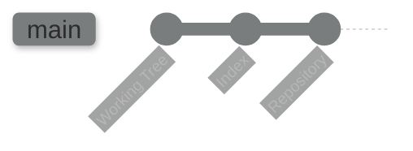

# Git: Getting Through It

The perspective that you pproach git is crucial to your ability to fully comprehend and understand it. This guide aims to help shift that perspective from basic commands to full foundational comprehension.

## Overview

[**Git**](https://git-scm.com/doc) is an incredible - if not often flawed - tool. Originally planned as a file system, its purpose and usability as a version control system became quickly apparent, and now we have one of the most popular and efficient development tools in use today. The beauty of it is actually in its simplicity, however, though this may not always feel apparent. I hope, thorugh this guide, you can gain an understanding that opens this simplicity up to you, allowing you to comprehend its use and its value inherently, while acknowledging where its flaws may present themselves.

A brief glossary of some terms you should ensure that you know before going further:

- **working tree**: Any directory on your filesystem with an associated Git repository (typically indicated by a `.git` sub-directory). It includes all the files and subdirectories in that directory.
- **the git index**: Unlike other tools, Git does not commit changes directly from the working tree into the repository. Instead, changes are first registered in the index, which acts as a staging area where changes are confirmed before committing.
- **commit**: A snapshot of your working tree at a particular point in time. The state of `HEAD` at the time of a commit becomes that commit's parent, creating the revision history.
- **repository**: A collection of commits, each an archive of what the project's working tree looked like at a past date. It also defines `HEAD`, which identifies the branch or commit the current working tree stemmed from. It includes branches and tags to identify certain commits by name.
- **branch**: A name for a commit (also called a reference). The parentage of a commit defines its history and the typical notion of a "branch of development."
- **tag**: A name for a commit, similar to a branch, except it always refers to the same commit and can have a description.
- **master**: The mainline of development in most repositories, typically the default branch, but it's not unique in any technical way.
- **HEAD**: Refers to what is currently checked out. If a branch is checked out, `HEAD` symbolically refers to that branch, and it updates after each commit. If a specific commit is checked out, `HEAD` refers to that commit only, known as a detached `HEAD`.

```quiz
question: "What does HEAD refer to in Git?"
type: multiple-choice
options:
  - text: "The first commit in the repository"
    feedback: "The first commit has no special pointer. HEAD points to the current position, which is usually the latest commit on the checked-out branch."
  - text: "A pointer to the currently checked-out commit (usually via a branch reference)"
    correct: true
    feedback: "Correct! HEAD is a symbolic reference that usually points to a branch name, which in turn points to a commit. When you switch branches, HEAD changes to point to the new branch. In 'detached HEAD' state, it points directly to a commit instead of a branch."
  - text: "The remote's latest commit"
    feedback: "The remote's latest commit is tracked by remote-tracking branches (like origin/main). HEAD is your local position in the repository."
  - text: "The most recent tag in the repository"
    feedback: "Tags are independent of HEAD. HEAD points to whatever commit you currently have checked out."
```

```quiz
question: "What happens when you're in a 'detached HEAD' state?"
type: multiple-choice
options:
  - text: "Your repository is corrupted and needs repair"
    feedback: "Detached HEAD is a normal, valid state. It just means HEAD points to a commit directly instead of through a branch reference."
  - text: "HEAD points directly to a commit instead of a branch, so new commits won't belong to any branch"
    correct: true
    feedback: "Correct! In detached HEAD, new commits have no branch pointing to them. If you switch away, those commits become unreachable (orphaned) unless you create a branch first: git branch new-branch-name. This state is common when checking out a tag or specific commit."
  - text: "You've been disconnected from the remote repository"
    feedback: "Detached HEAD is purely a local state about how HEAD references a commit. It has nothing to do with remote connectivity."
  - text: "Git has detected a merge conflict that must be resolved"
    feedback: "Merge conflicts are a separate situation. Detached HEAD means you've checked out a specific commit rather than a branch."
```

### Flow of Events

After initializing (creating) a repository, the actual work is performed in what is referred to as the **working tree**. At certain times, modifications are added to the index and then _committed_ to the repository. Next, you'll see a basic diagram of the usual lifecycle of a project in git:



```quiz
question: "What are Git's 'three trees' (the three main areas where file changes live)?"
type: multiple-choice
options:
  - text: "Local repository, remote repository, and backup"
    feedback: "The three trees are all local. Remote repositories and backups are separate concepts."
  - text: "Working directory, staging area (index), and repository (committed history)"
    correct: true
    feedback: "Correct! The working directory has your actual files. The staging area (index) holds changes you've marked for the next commit. The repository stores the complete committed history. Understanding this three-stage flow is key to using Git effectively."
  - text: "Main branch, feature branch, and release branch"
    feedback: "Those are branching strategies, not Git's three trees. The three trees refer to the working directory, staging area, and repository."
  - text: "Source code, build artifacts, and configuration files"
    feedback: "The three trees aren't about file types. They're about the stages of tracking changes: working directory → staging area → repository."
```

```terminal
title: Git Init to Commit Workflow
steps:
  - command: "git init myproject && cd myproject"
    output: "Initialized empty Git repository in /home/user/myproject/.git/"
    narration: "Create a new repository. Git creates a .git directory with all the repository internals (objects, refs, config)."
  - command: "echo '# My Project' > README.md && git status"
    output: |
      On branch main
      Untracked files:
        (use "git add <file>..." to include in what will be committed)
              README.md
    narration: "After creating a file, git status shows it as Untracked. Git sees the file but isn't tracking changes to it yet."
  - command: "git add README.md && git status"
    output: |
      Changes to be committed:
        (use "git rm --cached <file>..." to unstage)
              new file:   README.md
    narration: "git add moves the file from the working directory to the staging area (index). It's now staged and ready to be committed."
  - command: "git commit -m 'Initial commit'"
    output: |
      [main (root-commit) a1b2c3d] Initial commit
       1 file changed, 1 insertion(+)
       create mode 100644 README.md
    narration: "git commit takes everything in the staging area and creates a permanent snapshot in the repository. The commit hash (a1b2c3d) uniquely identifies this snapshot."
  - command: "git log --oneline"
    output: "a1b2c3d (HEAD -> main) Initial commit"
    narration: "git log shows the commit history. HEAD -> main means HEAD points to the main branch, which points to this commit."
```

```quiz
question: "What is the key difference between git merge and git rebase?"
type: multiple-choice
options:
  - text: "Merge creates a new commit combining two branches; rebase replays commits onto a new base"
    correct: true
    feedback: "Correct! Merge creates a merge commit with two parents, preserving the full branching history. Rebase moves your commits to start from a new base point, creating a linear history. Both integrate changes, but the resulting history shape differs."
  - text: "Merge is for local branches; rebase is for remote branches"
    feedback: "Both can work with any branches. The choice is about history shape: merge preserves branch topology, rebase linearizes it."
  - text: "Rebase is safer because it doesn't modify history"
    feedback: "It's the opposite - rebase rewrites commit history (new commit hashes), which is why you should never rebase commits that have been pushed to shared branches. Merge is the non-destructive option."
  - text: "They produce the same result with different syntax"
    feedback: "The end result (file contents) may be the same, but the commit history is different. Merge preserves branch structure; rebase creates linear history."
```

```exercise
title: Resolve a Merge Conflict
difficulty: intermediate
scenario: |
  You're working on a feature branch and need to merge it into main, but both branches
  modified the same file. Simulate and resolve this conflict:

  1. Create a new repository with a file
  2. Create a feature branch and modify the file
  3. Switch to main and modify the same line differently
  4. Merge the feature branch and resolve the conflict
hints:
  - "Create the conflict: make different changes to the same line on two branches"
  - "When merge fails, Git marks conflicts with <<<<<<< HEAD, =======, and >>>>>>> markers"
  - "Edit the file to keep the content you want, removing all conflict markers"
  - "After fixing, git add the file and git commit to complete the merge"
solution: |
  ```bash
  # Setup
  git init conflict-demo && cd conflict-demo
  echo "Hello World" > greeting.txt
  git add greeting.txt && git commit -m "Initial commit"

  # Create diverging changes
  git checkout -b feature
  echo "Hello from feature branch" > greeting.txt
  git add greeting.txt && git commit -m "Feature change"

  git checkout main
  echo "Hello from main branch" > greeting.txt
  git add greeting.txt && git commit -m "Main change"

  # Merge (this will conflict)
  git merge feature
  # CONFLICT (content): Merge conflict in greeting.txt

  # View the conflict markers
  cat greeting.txt
  # <<<<<<< HEAD
  # Hello from main branch
  # =======
  # Hello from feature branch
  # >>>>>>> feature

  # Resolve: edit the file to your desired content
  echo "Hello from both branches (merged)" > greeting.txt

  # Complete the merge
  git add greeting.txt
  git commit -m "Merge feature branch, resolve greeting conflict"
  ```

  The conflict markers show both versions. Edit the file to combine or choose
  the content you want, remove all marker lines (`<<<<<<<`, `=======`, `>>>>>>>`),
  then stage and commit.
```

---

## Further Reading

- [Official Git Documentation](https://git-scm.com/doc) - reference manual, videos, and external links
- [Pro Git Book](https://git-scm.com/book/en/v2) - comprehensive free book covering Git fundamentals to advanced topics
