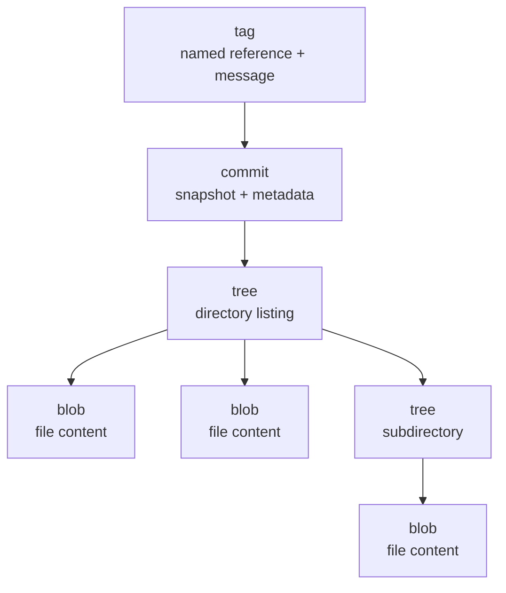
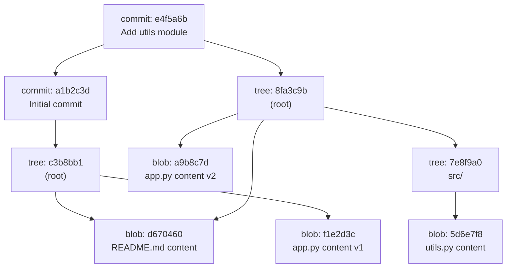

# The Object Model

Everything you've learned so far - commits, branches, staging, merging - is built on top of a surprisingly simple storage system. Git is, at its core, a **content-addressable filesystem**: a key-value store where the key is a SHA-1 hash of the content and the value is the content itself. Understanding this layer explains why Git behaves the way it does and gives you the tools to inspect and repair repositories at the lowest level.

---

## Content-Addressable Storage

The term **content-addressable** means that the address (name) of every piece of data is derived from the data itself. Git computes a SHA-1 hash of each object's content, and that hash becomes the object's identity. Two files with identical content produce the same hash and are stored once. Change a single byte and the hash - and therefore the identity - changes completely.

This has profound implications:

- **Deduplication is automatic.** If the same file appears in 1,000 commits, Git stores one copy.
- **Integrity is guaranteed.** If any bit of a stored object changes (disk corruption, tampering), the hash no longer matches and Git detects it immediately.
- **History is tamper-evident.** Since each commit's hash includes its parent hash, changing any commit changes every subsequent hash in the chain. You can't alter history silently.

!!! tip "SHA-1 and SHA-256"
    Git has historically used SHA-1 (160-bit, 40 hex characters). While SHA-1 has known collision vulnerabilities in theory, Git includes additional hardening against known attacks. Git is transitioning to SHA-256 (256-bit, 64 hex characters) with a compatibility layer. New repository formats can opt into SHA-256, but most repositories still use SHA-1.

---

## The Four Object Types

Every object in Git's database is one of four types:



### Blob (Binary Large Object)

A **blob** stores the content of a single file - nothing else. No filename, no permissions, no metadata. Just the raw bytes. Two files with identical content, regardless of their names or locations, produce the same blob.

```bash
# Hash a string as a blob
echo "Hello, Git" | git hash-object --stdin
# 41e40e5a20c7e8657a8a92e2ce0bfa39a9e0d40c

# Hash a file
git hash-object README.md
```

### Tree

A **tree** represents a directory. It contains entries, each pointing to a blob (file) or another tree (subdirectory), along with the file's name and permission mode:

```
100644 blob a1b2c3d4...  README.md
100644 blob e5f6a7b8...  app.py
040000 tree c9d0e1f2...  src
```

Permission modes:

| Mode | Meaning |
|------|---------|
| `100644` | Regular file |
| `100755` | Executable file |
| `120000` | Symbolic link |
| `040000` | Subdirectory (tree) |

### Commit

A **commit** ties everything together. It references:

- A **tree** (the root directory snapshot)
- Zero or more **parent** commits
- **Author** and **committer** identity with timestamps
- A **message**

The first commit in a repository has no parent. A merge commit has two or more parents. Every other commit has exactly one parent.

### Annotated Tag

An **annotated tag** is a named reference to a commit (or any object) with additional metadata: a tagger identity, timestamp, and message. Unlike lightweight tags (which are just refs), annotated tags are full objects stored in the database.

```bash
# Create an annotated tag
git tag -a v1.0 -m "First stable release"

# Show the tag object
git cat-file -p v1.0
```

```quiz
question: "What type of Git object stores file content?"
type: multiple-choice
options:
  - text: "Tree"
    feedback: "Trees store directory listings - file names, permissions, and references to blobs or other trees. The actual file content is in blob objects."
  - text: "Blob"
    correct: true
    feedback: "Correct! A blob stores the raw content of a single file with no metadata (no name, no path, no permissions). The filename and permissions are stored in the tree object that references the blob."
  - text: "Commit"
    feedback: "Commits reference a tree (the root directory snapshot) and contain metadata (author, message, parents). They don't store file content directly."
  - text: "Ref"
    feedback: "Refs aren't objects at all - they're named pointers to objects (usually commits). File content is stored in blob objects."
```

```quiz
question: "How does Git know that two files with identical content are the same?"
type: multiple-choice
options:
  - text: "It compares file names and sizes"
    feedback: "Git doesn't use file names to identify content. Two files with different names but identical content produce the same SHA-1 hash and are stored as a single blob object."
  - text: "They produce the same SHA-1 hash, so they reference the same blob object"
    correct: true
    feedback: "Correct! Git hashes file content with SHA-1. Identical content always produces the same hash, so both files point to the same blob in the object database. This is automatic deduplication - Git never stores the same content twice."
  - text: "It maintains a lookup table of duplicate files"
    feedback: "Git doesn't need a lookup table. The content-addressable storage handles deduplication inherently - identical content produces identical hashes, which point to the same object."
  - text: "It tracks which files were copied from which"
    feedback: "Git doesn't track copy operations. It identifies identical content through SHA-1 hashing. If two blobs hash to the same value, they're the same object regardless of how the files were created."
```

---

## The `.git/objects` Directory

All objects are stored in `.git/objects/`. Git uses the first two characters of the hash as a directory name and the remaining 38 as the filename:

```
.git/objects/
├── 41/
│   └── e40e5a20c7e8657a8a92e2ce0bfa39a9e0d40c  (a blob)
├── 8f/
│   └── a3c9b1d2e4f5a6b7c8d9e0f1a2b3c4d5e6f7a8  (a tree)
├── e4/
│   └── f5a6b7c8d9e0f1a2b3c4d5e6f7a8b9c0d1e2f3  (a commit)
├── info/
└── pack/
    ├── pack-abc123.idx
    └── pack-abc123.pack
```

Individual objects are called **loose objects**. As a repository grows, Git periodically packs loose objects into **packfiles** (`.pack` with an `.idx` index) for efficiency. Packfiles use delta compression - storing only the differences between similar objects. The [Refs, the Reflog, and the DAG](refs-reflog-dag.md) guide covers packfiles in depth.

Each loose object is stored as: `type size\0content`, compressed with zlib.

---

## Plumbing Commands

Git has two categories of commands: **porcelain** (user-facing: `commit`, `merge`, `push`) and **plumbing** (low-level: `hash-object`, `cat-file`, `write-tree`). Plumbing commands let you interact directly with the object database.

### `git hash-object` - Store Content

```bash
# Hash content from stdin (just compute the hash, don't store)
echo "Hello" | git hash-object --stdin
# ce013625030ba8dba906f756967f9e9ca394464a

# Hash and store into the object database
echo "Hello" | git hash-object --stdin -w

# Hash a file
git hash-object README.md
```

### `git cat-file` - Read Objects

```bash
# Show object type
git cat-file -t a1b2c3d
# blob, tree, commit, or tag

# Show object size
git cat-file -s a1b2c3d
# 42

# Pretty-print object content
git cat-file -p a1b2c3d
```

### `git ls-tree` - List Tree Contents

```bash
# List the root tree of HEAD
git ls-tree HEAD

# List recursively (all files in all subdirectories)
git ls-tree -r HEAD

# List a specific directory
git ls-tree HEAD src/
```

### `git write-tree` - Create a Tree from the Index

```bash
# Write the current index as a tree object
git write-tree
# Returns the hash of the new tree
```

### `git commit-tree` - Create a Commit Object

```bash
# Create a commit from a tree, with a parent and message
echo "My commit message" | git commit-tree <tree-hash> -p <parent-hash>
# Returns the hash of the new commit
```

---

## Building a Commit with Plumbing Commands

This is the most illuminating exercise in the entire course. Instead of using `git add` and `git commit`, you'll create a commit entirely with low-level plumbing commands - the same operations Git performs internally.

```terminal
title: Creating a Commit Using Only Plumbing Commands
steps:
  - command: "git init plumbing-demo && cd plumbing-demo"
    output: "Initialized empty Git repository in /home/user/plumbing-demo/.git/"
    narration: "Start with an empty repository. We'll build a commit from scratch using only plumbing commands."
  - command: "echo 'Hello, Git internals!' | git hash-object --stdin -w"
    output: "d670460b4b4aece5915caf5c68d12f560a9fe3e4"
    narration: "Create a blob object containing our file content. The -w flag writes it to the object database. The hash is the blob's address."
  - command: "git cat-file -t d670460"
    output: "blob"
    narration: "Verify the object type. It's a blob - raw content, no filename."
  - command: "git cat-file -p d670460"
    output: "Hello, Git internals!"
    narration: "Pretty-print the blob. It contains exactly the content we hashed, nothing more."
  - command: "git update-index --add --cacheinfo 100644,d670460b4b4aece5915caf5c68d12f560a9fe3e4,hello.txt"
    output: ""
    narration: "Add the blob to the index (staging area) with a filename and permission mode. 100644 is a regular file. This is what git add does internally."
  - command: "git write-tree"
    output: "c3b8bb102afeca86037d5b5dd89ceeb0090eae9d"
    narration: "Create a tree object from the current index. The tree records the directory structure: one entry pointing the name 'hello.txt' to our blob."
  - command: "git cat-file -p c3b8bb1"
    output: "100644 blob d670460b4b4aece5915caf5c68d12f560a9fe3e4\thello.txt"
    narration: "The tree has one entry: file mode 100644, type blob, the blob hash, and the filename 'hello.txt'. This is a snapshot of the directory."
  - command: "echo 'First commit via plumbing' | git commit-tree c3b8bb1"
    output: "a1b2c3d4e5f6a7b8c9d0e1f2a3b4c5d6e7f8a9b0"
    narration: "Create a commit object pointing to our tree. Since this is the first commit, it has no parent. Your hash will differ - it includes the current timestamp."
  - command: "git cat-file -p a1b2c3d"
    output: |
      tree c3b8bb102afeca86037d5b5dd89ceeb0090eae9d
      author Jane Developer <jane@example.com> 1700000000 -0500
      committer Jane Developer <jane@example.com> 1700000000 -0500

      First commit via plumbing
    narration: "The commit object: a tree reference, author/committer identity, and the message. No parent line because this is the root commit."
  - command: "git update-ref refs/heads/main a1b2c3d4e5f6a7b8c9d0e1f2a3b4c5d6e7f8a9b0"
    output: ""
    narration: "Point the main branch at our new commit. This is the plumbing equivalent of what git commit does to update the branch pointer."
  - command: "git log --oneline"
    output: "a1b2c3d (HEAD -> main) First commit via plumbing"
    narration: "Our repository now has a valid commit, created entirely with plumbing commands. git log sees it as a normal commit because it IS a normal commit - same objects, same structure."
```

---

## Tracing the Object Graph

Every commit points to a tree, every tree points to blobs and subtrees, and everything is connected by SHA-1 hashes. You can trace the entire object graph starting from any commit:

```exercise
title: Trace from Commit to Blob
difficulty: intermediate
scenario: |
  Use git cat-file to follow the object graph from a commit all the way down
  to individual file contents.

  1. Create a repository with a directory structure: `src/app.py` and `README.md`
  2. Make a commit
  3. Use `git cat-file -p HEAD` to see the commit object (note the tree hash)
  4. Use `git cat-file -p <tree-hash>` to see the root tree (note the blob and subtree hashes)
  5. Follow the `src` subtree to find the `app.py` blob
  6. Use `git cat-file -p <blob-hash>` to read the file content
  7. Verify the blob hash with `git hash-object src/app.py`
hints:
  - "Start with git cat-file -p HEAD to see the commit's tree reference"
  - "The root tree will show README.md as a blob and src as a tree (040000)"
  - "Follow the src tree hash with another git cat-file -p to see app.py's blob reference"
  - "The blob hash from git hash-object should match the one in the tree"
solution: |
  ```bash
  git init trace-demo && cd trace-demo
  mkdir src
  echo "# Trace Demo" > README.md
  echo "print('hello')" > src/app.py
  git add . && git commit -m "Initial structure"

  # Step 1: Commit -> Tree
  git cat-file -p HEAD
  # tree <root-tree-hash>
  # author ...
  # Initial structure

  # Step 2: Root tree -> entries
  git cat-file -p <root-tree-hash>
  # 100644 blob <readme-hash>  README.md
  # 040000 tree <src-tree-hash>  src

  # Step 3: src tree -> app.py blob
  git cat-file -p <src-tree-hash>
  # 100644 blob <app-hash>  app.py

  # Step 4: Read the blob
  git cat-file -p <app-hash>
  # print('hello')

  # Step 5: Verify
  git hash-object src/app.py
  # Should match <app-hash>
  ```
```

---

## Object Graph Visualization

The relationships between objects form a directed acyclic graph (DAG). Here's what a small repository's object graph looks like:



Notice that `B1` (README.md) is referenced by both trees - the file didn't change between commits, so Git reuses the same blob. This is content-addressable deduplication in action.

---

## Further Reading

- [Pro Git - Chapter 10.2: Git Objects](https://git-scm.com/book/en/v2/Git-Internals-Git-Objects) - comprehensive walkthrough of blob, tree, commit, and tag objects
- [Git Internals PDF (Scott Chacon)](https://github.com/pluralsight/git-internals-pdf) - deep dive into the object model
- [Official git-cat-file documentation](https://git-scm.com/docs/git-cat-file) - inspecting objects
- [Official git-hash-object documentation](https://git-scm.com/docs/git-hash-object) - creating objects

---

**Previous:** [Configuring Git](configuring-git.md) | **Next:** [Refs, the Reflog, and the DAG](refs-reflog-dag.md) | [Back to Index](README.md)
