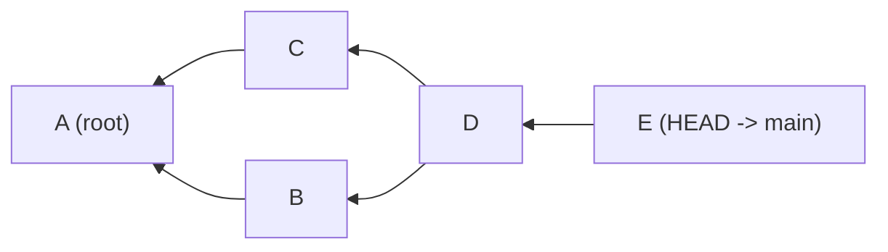

# Refs, the Reflog, and the DAG

The [Object Model](object-model.md) guide showed you that everything in Git is stored as objects identified by SHA-1 hashes. But nobody wants to type `e4f5a6b7c8d9e0f1a2b3c4d5e6f7a8b9c0d1e2f3` to reference a commit. **References** (refs) are human-readable names that point to objects. They're the layer that makes Git usable. This guide covers how refs work, how the reflog tracks every change, how commits form a directed acyclic graph, and how Git manages storage efficiency with garbage collection and packfiles.

---

## References

A **reference** (ref) is a file that contains a SHA-1 hash pointing to a Git object - usually a commit. Branches, tags, and remote-tracking branches are all refs.

### The `.git/refs/` Directory

```
.git/refs/
├── heads/          # Local branches
│   ├── main
│   └── feature/auth
├── tags/           # Tags
│   ├── v1.0
│   └── v2.0
├── remotes/        # Remote-tracking branches
│   └── origin/
│       ├── main
│       └── feature/auth
└── stash           # Stash ref
```

Each file contains a single line: the 40-character hash of the commit (or tag object) it points to.

```bash
# Read a ref directly
cat .git/refs/heads/main
# e4f5a6b7c8d9e0f1a2b3c4d5e6f7a8b9c0d1e2f3

# Or use the plumbing command
git rev-parse main
# e4f5a6b7c8d9e0f1a2b3c4d5e6f7a8b9c0d1e2f3
```

### Packed Refs

When a repository has many refs, Git packs them into a single file for efficiency:

```bash
cat .git/packed-refs
```

```
# pack-refs with: peeled fully-peeled sorted
e4f5a6b7c8d9e0f1a2b3c4d5e6f7a8b9c0d1e2f3 refs/heads/main
a1b2c3d4e5f6a7b8c9d0e1f2a3b4c5d6e7f8a9b0 refs/tags/v1.0
^c9d0e1f2a3b4c5d6e7f8a9b0b1c2d3e4f5a6b7c8
```

Lines starting with `^` show the commit that an annotated tag points to (the "peeled" value). Loose refs in `.git/refs/` take precedence over packed refs.

### Plumbing Commands for Refs

```bash
# Update a ref to point to a commit
git update-ref refs/heads/new-branch a1b2c3d

# Delete a ref
git update-ref -d refs/heads/old-branch

# List all refs
git for-each-ref
```

---

## Symbolic References

Most refs contain a commit hash. A **symbolic reference** contains the name of another ref instead. The most important symbolic ref is `HEAD`.

### HEAD

`HEAD` is a symbolic ref that points to the current branch:

```bash
cat .git/HEAD
# ref: refs/heads/main
```

When you commit, Git:
1. Reads HEAD to find the current branch (`refs/heads/main`)
2. Creates the new commit with the current branch tip as parent
3. Updates the branch ref to point to the new commit

When HEAD points directly to a commit hash (not a branch name), you're in **detached HEAD** state:

```bash
cat .git/HEAD
# e4f5a6b7c8d9e0f1a2b3c4d5e6f7a8b9c0d1e2f3
```

### Other Symbolic References

| Reference | Created by | Contains |
|-----------|-----------|----------|
| `HEAD` | Always present | Current branch or commit |
| `ORIG_HEAD` | `merge`, `rebase`, `reset` | HEAD before the operation (for easy undo) |
| `MERGE_HEAD` | `merge` (during conflict) | The commit being merged in |
| `FETCH_HEAD` | `fetch` | The tips of fetched branches |
| `CHERRY_PICK_HEAD` | `cherry-pick` (during conflict) | The commit being cherry-picked |
| `REBASE_HEAD` | `rebase` (during conflict) | The current commit being rebased |

```bash
# Read/write symbolic refs with plumbing
git symbolic-ref HEAD
# refs/heads/main

git symbolic-ref HEAD refs/heads/feature/auth
# Now on feature/auth (don't do this normally - use git switch)
```

```terminal
title: Inspecting Refs and Packed Refs
steps:
  - command: "git init refs-demo && cd refs-demo && echo 'init' > file.txt && git add file.txt && git commit -m 'Initial commit'"
    output: "[main (root-commit) a1b2c3d] Initial commit"
    narration: "Create a repository with one commit. Git creates refs/heads/main pointing to this commit."
  - command: "cat .git/refs/heads/main"
    output: "a1b2c3d4e5f6a7b8c9d0e1f2a3b4c5d6e7f8a9b0"
    narration: "The main branch is a file containing one line: the commit hash. This is all a branch is."
  - command: "cat .git/HEAD"
    output: "ref: refs/heads/main"
    narration: "HEAD is a symbolic reference pointing to the current branch name. When you commit, Git follows this chain: HEAD -> refs/heads/main -> commit hash."
  - command: "git branch feature/test && cat .git/refs/heads/feature/test"
    output: "a1b2c3d4e5f6a7b8c9d0e1f2a3b4c5d6e7f8a9b0"
    narration: "Creating a branch creates a new file under refs/heads/ with the same commit hash. Branches with slashes become directory paths."
  - command: "git tag v1.0 -a -m 'Version 1.0' && git cat-file -t v1.0"
    output: "tag"
    narration: "An annotated tag creates a tag object (type 'tag') in the database. The ref in refs/tags/v1.0 points to this tag object, which in turn points to the commit."
  - command: "git pack-refs --all && cat .git/packed-refs"
    output: |
      # pack-refs with: peeled fully-peeled sorted
      a1b2c3d4e5f6a7b8c9d0e1f2a3b4c5d6e7f8a9b0 refs/heads/feature/test
      a1b2c3d4e5f6a7b8c9d0e1f2a3b4c5d6e7f8a9b0 refs/heads/main
      b2c3d4e5f6a7b8c9d0e1f2a3b4c5d6e7f8a9b0c1 refs/tags/v1.0
      ^a1b2c3d4e5f6a7b8c9d0e1f2a3b4c5d6e7f8a9b0
    narration: "git pack-refs consolidates loose ref files into a single packed-refs file. The ^ line under the tag shows the commit the annotated tag points to (the peeled value)."
```

---

## The Directed Acyclic Graph (DAG)

Commits in Git form a **directed acyclic graph** (DAG). Each commit points to its parent(s), creating directed edges. The graph is acyclic - you can never follow parent pointers and arrive back at the same commit.

### What Makes It a DAG

- **Directed**: Each edge goes one way - from child commit to parent commit
- **Acyclic**: No cycles - you can't follow parent links and loop back
- **Graph** (not a tree): Merge commits have multiple parents, creating diamond shapes



In this graph, `D` is a merge commit with two parents (`B` and `C`). Both `B` and `C` have `A` as their parent. The graph has a diamond shape - this can't happen in a simple tree.

### Reachability

A commit is **reachable** from a ref if you can get to it by following parent pointers. In the graph above, all commits are reachable from `main` (which points to `E`). A commit that is unreachable from any ref is eligible for garbage collection.

This is why deleting a branch can "lose" commits. If the branch was the only ref that could reach certain commits, those commits become unreachable. They still exist in the object database (and in the reflog for a time), but they're invisible to normal commands like `git log`.

```quiz
question: "What makes Git's commit history a DAG rather than a simple tree?"
type: multiple-choice
options:
  - text: "Merge commits have multiple parents, creating diamond-shaped paths"
    correct: true
    feedback: "Correct! In a tree, each node has exactly one parent (except the root). In Git's DAG, merge commits have two or more parents, creating multiple paths between commits. This forms a graph with diamonds, not a simple tree."
  - text: "Branches can point to the same commit"
    feedback: "Multiple branches pointing to the same commit doesn't change the shape of the graph. The DAG is defined by parent-child commit relationships, and merge commits with multiple parents create the graph structure."
  - text: "Git stores objects in a non-hierarchical database"
    feedback: "The object storage mechanism is separate from the commit graph structure. The DAG is about how commits reference their parents, specifically that merge commits can have multiple parents."
  - text: "Tags can reference any commit, not just the latest"
    feedback: "Tags adding references to specific commits doesn't change the commit graph structure. The DAG property comes from merge commits having multiple parent edges."
```

---

## The Reflog

The **reflog** records every time a ref (branch tip or HEAD) changes. It's a per-repository, per-ref log of all movements. Reflog entries are local only - they're never pushed or shared.

### Viewing the Reflog

```bash
# HEAD reflog (every checkout, commit, reset, rebase, etc.)
git reflog

# Reflog for a specific branch
git reflog show main

# With timestamps
git reflog --date=iso

# With relative dates
git reflog --date=relative
```

### Reflog Entry Format

```
e5f6a7b HEAD@{0}: commit: Add error handling
c3d4e5f HEAD@{1}: checkout: moving from main to feature/auth
c3d4e5f HEAD@{2}: merge feature/search: Fast-forward
a1b2c3d HEAD@{3}: commit: Initial commit
```

Each entry records: the resulting hash, the ref position (`HEAD@{n}`), the operation type, and a description.

### Using Reflog References

The `@{n}` syntax works in any Git command:

```bash
# Show where HEAD was 3 moves ago
git show HEAD@{3}

# Diff between current state and 5 moves ago
git diff HEAD@{5} HEAD

# Create a branch at an old position
git branch recovery HEAD@{7}

# Time-based references
git diff HEAD@{yesterday} HEAD
git log HEAD@{2.weeks.ago}..HEAD
```

### Reflog Expiration

Reflog entries don't live forever:

- Entries for **reachable** commits expire after **90 days** (default)
- Entries for **unreachable** commits expire after **30 days** (default)

After expiration, `git gc` removes the entries. Configure with:

```bash
git config --global gc.reflogExpire 180.days
git config --global gc.reflogExpireUnreachable 90.days
```

```code-walkthrough
title: Reading the Reflog
description: Understanding reflog entries and how they record every HEAD movement.
code: |
  $ git reflog -10

  f7a8b9c (HEAD -> main) HEAD@{0}: merge feature/auth: Merge made by the 'ort' strategy.
  e6d5c4b HEAD@{1}: commit: Add rate limiting
  d5c4b3a HEAD@{2}: checkout: moving from feature/auth to main
  c4b3a29 HEAD@{3}: commit: Add OAuth callback handler
  b3a2918 HEAD@{4}: commit: Add login endpoint
  a2918f7 HEAD@{5}: checkout: moving from main to feature/auth
  a2918f7 HEAD@{6}: commit: Initial project setup
  9187e6d HEAD@{7}: commit (initial): First commit
language: text
annotations:
  - line: 3
    text: "HEAD@{0} is always the current state. This merge brought feature/auth into main using the 'ort' merge strategy (the default in modern Git)."
  - line: 4
    text: "A regular commit on main before the merge."
  - line: 5
    text: "Checkout entries show branch switches. You moved from feature/auth back to main."
  - line: 6
    text: "Commits made on the feature branch appear in the reflog too - the reflog tracks HEAD, not just main."
  - line: 8
    text: "Another checkout. The reflog preserves the full timeline of your work, regardless of which branch you were on."
  - line: 10
    text: "The initial commit is marked (initial). HEAD@{7} points to this commit. You can use these references to recover from mistakes."
```

---

## Garbage Collection

Git's object database grows over time. Unreachable objects - commits orphaned by rebase, old trees from amended commits, blobs from files no longer in any tree - accumulate. **Garbage collection** (`git gc`) cleans them up.

### What `git gc` Does

1. **Packs loose objects** into packfiles (delta-compressed, more efficient)
2. **Removes unreachable objects** that are past the reflog expiration window
3. **Packs refs** (consolidates loose ref files into `packed-refs`)
4. **Prunes the reflog** (removes expired entries)

```bash
# Run garbage collection
git gc

# Aggressive GC (more thorough compression, slower)
git gc --aggressive

# See what would be pruned
git prune --dry-run

# Check for corruption and find unreachable objects
git fsck
```

### When GC Runs

Git runs `gc --auto` automatically after certain operations (like receiving a push). Auto GC only runs if there are more than ~6,700 loose objects or more than ~50 packfiles.

```quiz
question: "When does garbage collection delete unreachable objects?"
type: multiple-choice
options:
  - text: "Immediately when a commit becomes unreachable (e.g., after rebase)"
    feedback: "Git doesn't delete objects immediately. Unreachable objects are kept for at least 30 days (by default) through the reflog, giving you time to recover from mistakes."
  - text: "Only after their reflog entries expire (30 days for unreachable, 90 for reachable) and git gc runs"
    correct: true
    feedback: "Correct! Objects remain in the database until their reflog entries expire AND garbage collection runs. Default expiration is 30 days for unreachable objects and 90 days for reachable ones. This gives you a generous recovery window."
  - text: "When the repository exceeds a size limit"
    feedback: "Git doesn't have a repository size limit that triggers deletion. GC is triggered by object count thresholds (auto GC) or manual execution, and it only removes objects past the reflog expiration window."
  - text: "When you push to a remote"
    feedback: "Pushing doesn't trigger GC on your local repo. Git may run gc --auto after certain operations, but only if the loose object count exceeds the threshold. Unreachable objects are only removed after their reflog entries expire."
```

---

## Finding Unreachable Objects

`git fsck` (filesystem check) examines the object database for integrity and reports unreachable objects:

```bash
# Check integrity and find unreachable objects
git fsck

# Find dangling (unreachable) objects only
git fsck --unreachable

# Find and recover lost commits
git fsck --lost-found
```

`--lost-found` writes unreachable commits and blobs to `.git/lost-found/`. This is the last resort for recovering data that's been lost from the reflog.

```terminal
title: Using git fsck to Find Dangling Objects
steps:
  - command: "git init fsck-demo && cd fsck-demo"
    output: "Initialized empty Git repository in /home/user/fsck-demo/.git/"
    narration: "Create a fresh repository for demonstrating fsck."
  - command: "echo 'commit 1' > file.txt && git add file.txt && git commit -m 'First commit'"
    output: "[main (root-commit) a1b2c3d] First commit"
    narration: "Create an initial commit."
  - command: "echo 'commit 2' > file.txt && git add file.txt && git commit -m 'Second commit'"
    output: "[main b2c3d4e] Second commit"
    narration: "Add a second commit."
  - command: "echo 'commit 3' > file.txt && git add file.txt && git commit -m 'Third commit'"
    output: "[main c3d4e5f] Third commit"
    narration: "And a third. Now reset to throw away commits 2 and 3."
  - command: "git reset --hard HEAD~2"
    output: "HEAD is now at a1b2c3d First commit"
    narration: "Hard reset back to the first commit. Commits 2 and 3 are now unreachable from any branch."
  - command: "git fsck --unreachable"
    output: |
      unreachable commit c3d4e5f6a7b8c9d0e1f2a3b4c5d6e7f8a9b0c1d2
      unreachable commit b2c3d4e5f6a7b8c9d0e1f2a3b4c5d6e7f8a9b0c1
      unreachable blob 7d6c5b4a392817e6d5c4b3a29187e6d5c4b3a291
      unreachable blob 8e7d6c5b4a392817e6d5c4b3a29187e6d5c4b3a2
    narration: "fsck reports all unreachable objects: the two commits and the blob objects they referenced. These still exist in the object database."
  - command: "git cat-file -p c3d4e5f"
    output: |
      tree 9a8b7c6d5e4f3a2b1c0d9e8f7a6b5c4d3e2f1a0b
      parent b2c3d4e5f6a7b8c9d0e1f2a3b4c5d6e7f8a9b0c1
      author Jane Developer <jane@example.com> 1700000000 -0500
      committer Jane Developer <jane@example.com> 1700000000 -0500

      Third commit
    narration: "Even though the commit is unreachable, we can still read it with cat-file. Recovery is possible as long as the object hasn't been garbage collected."
  - command: "git branch recovered c3d4e5f"
    output: ""
    narration: "Create a branch pointing to the unreachable commit. Now it's reachable again and safe from garbage collection."
  - command: "git log --oneline --all"
    output: |
      c3d4e5f (recovered) Third commit
      b2c3d4e Second commit
      a1b2c3d (HEAD -> main) First commit
    narration: "Both branches are visible. The recovered branch has all three commits. The reflog would also work for recovery, but fsck finds objects even after the reflog expires."
```

---

## Packfiles

When you first create objects, Git stores them as individual **loose objects** - one zlib-compressed file per object in `.git/objects/`. As the repository grows, this becomes inefficient. Git uses **packfiles** to compress many objects into a single file.

### How Packfiles Work

A packfile (`.pack`) stores objects sequentially, using **delta compression**. Instead of storing each version of a file as a full blob, Git stores one version in full (the base) and subsequent versions as deltas (differences) against the base.

Git typically uses the most recent version as the base (since that's what you check out most often) and stores older versions as deltas. This is the opposite of what you might expect - older versions take slightly longer to reconstruct.

Each packfile has an accompanying index file (`.idx`) that maps object hashes to their position in the packfile, enabling fast lookups.

```bash
# List packfiles
ls .git/objects/pack/

# Examine a packfile's contents
git verify-pack -v .git/objects/pack/pack-*.idx | head -20

# Repack the repository
git repack -a -d

# Count loose and packed objects
git count-objects -v
```

### Multi-Pack Index

Large repositories (especially those receiving frequent pushes) can accumulate many packfiles. The **multi-pack index** (MIDX, Git 2.34+) creates a single index across all packfiles, speeding up object lookups:

```bash
# Generate multi-pack index
git multi-pack-index write

# Verify multi-pack index
git multi-pack-index verify
```

```terminal
title: Examining Packfiles
steps:
  - command: "git count-objects -v"
    output: |
      count: 0
      size: 0
      in-pack: 347
      packs: 1
      size-pack: 128
      prune-packable: 0
      garbage: 0
      size-garbage: 0
    narration: "count-objects shows the split between loose objects (count: 0) and packed objects (in-pack: 347). This repo has everything in one packfile."
  - command: "ls -la .git/objects/pack/"
    output: |
      -r--r--r--  1 user  group   18256 Jan 15 10:30 pack-abc123def456.idx
      -r--r--r--  1 user  group  131072 Jan 15 10:30 pack-abc123def456.pack
    narration: "One .pack file (the objects) and one .idx file (the lookup index). The pack file is read-only - Git never modifies it in place."
  - command: "git verify-pack -v .git/objects/pack/pack-abc123def456.idx | head -10"
    output: |
      e4f5a6b7c8d9e0f1a2b3c4d5e6f7a8b9c0d1e2f3 commit 234 158 12
      a1b2c3d4e5f6a7b8c9d0e1f2a3b4c5d6e7f8a9b0 commit 226 152 170
      8fa3c9b1d2e4f5a6b7c8d9e0f1a2b3c4d5e6f7a8 tree   128  92 322
      d670460b4b4aece5915caf5c68d12f560a9fe3e4 blob    21  32 414
      c9d0e1f2a3b4c5d6e7f8a9b0b1c2d3e4f5a6b7c8 blob   856 423 446 1 d670460b4b...
    narration: "verify-pack shows each object in the pack: hash, type, original size, packed size, offset. The last entry has a delta base hash - it's stored as a delta against another blob, compressed from 856 bytes to 423."
```

---

## `git maintenance` - Automatic Optimization

Git 2.29+ includes `git maintenance` for scheduling background optimization tasks:

```bash
# Register the current repo for maintenance
git maintenance register

# Run all maintenance tasks now
git maintenance run

# Start a background maintenance scheduler
git maintenance start

# Stop the scheduler
git maintenance stop
```

Maintenance tasks include: `gc` (garbage collection), `commit-graph` (update commit graph file), `prefetch` (background fetch from remotes), `loose-objects` (pack loose objects), and `incremental-repack` (consolidate packfiles).

---

## Exercise

```exercise
title: Create and Recover Orphaned Commits
difficulty: intermediate
scenario: |
  Practice finding and recovering unreachable objects before garbage collection removes them.

  1. Create a repository with 5 commits on main
  2. Create a branch at commit 3, make 2 additional commits on it
  3. Delete the branch (the 2 additional commits are now orphaned)
  4. Use `git fsck` to find the unreachable commits
  5. Use `git cat-file` to examine the orphaned commit(s)
  6. Recover them by creating a new branch at the unreachable commit
  7. Verify the full commit chain is restored
hints:
  - "git branch -D forces branch deletion even if not merged"
  - "git fsck --unreachable shows all unreachable objects"
  - "The most recent orphaned commit will have the other as its parent"
  - "Create a new branch at the orphaned commit to make it reachable again"
solution: |
  ```bash
  git init orphan-exercise && cd orphan-exercise

  # Create 5 commits on main
  for i in 1 2 3 4 5; do
    echo "main commit $i" > file.txt
    git add file.txt && git commit -m "Main commit $i"
  done

  # Branch at commit 3 and add 2 commits
  git switch -c side-branch HEAD~2
  echo "side work 1" > side.txt && git add side.txt && git commit -m "Side commit 1"
  echo "side work 2" >> side.txt && git add side.txt && git commit -m "Side commit 2"

  # Note the last commit hash
  SIDE_TIP=$(git rev-parse HEAD)

  # Delete the branch
  git switch main
  git branch -D side-branch

  # Find orphaned commits
  git fsck --unreachable | grep commit

  # Examine them
  git cat-file -p $SIDE_TIP

  # Recover
  git branch recovered $SIDE_TIP
  git log --oneline --all --graph
  ```
```

---

## Further Reading

- [Pro Git - Chapter 10.3: Git References](https://git-scm.com/book/en/v2/Git-Internals-Git-References) - refs, symbolic refs, and HEAD
- [Pro Git - Chapter 10.4: Packfiles](https://git-scm.com/book/en/v2/Git-Internals-Packfiles) - delta compression and pack format
- [Official git-gc documentation](https://git-scm.com/docs/git-gc) - garbage collection options and configuration
- [Official git-fsck documentation](https://git-scm.com/docs/git-fsck) - filesystem check and integrity verification
- [Official git-reflog documentation](https://git-scm.com/docs/git-reflog) - reflog usage and expiration

---

**Previous:** [The Object Model](object-model.md) | **Next:** [Transfer Protocols and Plumbing](transfer-protocols.md) | [Back to Index](README.md)
