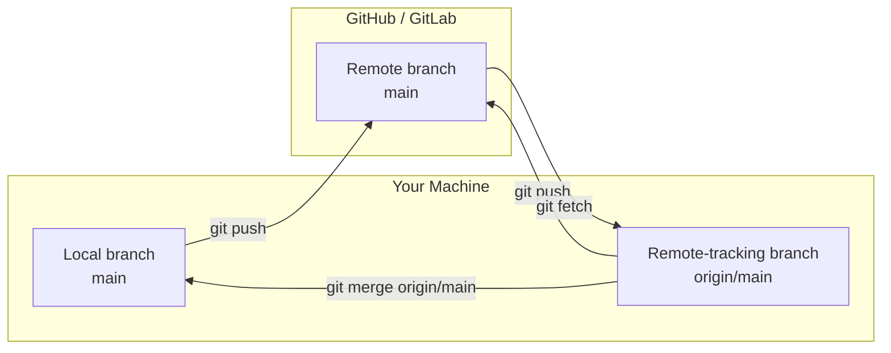

# Remote Repositories

So far, everything has been local - one repository on your machine. In practice, you work with code that lives on a server, collaborate with other developers, and synchronize changes between multiple copies of the same repository. **Remotes** are Git's mechanism for connecting these repositories together.

---

## What Is a Remote?

A **remote** is a bookmark to another Git repository. It's a short name (like `origin`) mapped to a URL where another copy of your repository lives. Remotes don't maintain a live connection - they're just URLs that Git uses when you explicitly fetch or push.

When you clone a repository, Git automatically creates a remote called `origin` pointing to the URL you cloned from. You can add more remotes, rename them, or remove them.

```bash
# List remotes
git remote

# List remotes with URLs
git remote -v
```

```
origin  git@github.com:yourname/project.git (fetch)
origin  git@github.com:yourname/project.git (push)
```

The fetch and push URLs are usually the same, but they can differ (for example, fetching over HTTPS but pushing over SSH).

---

## Cloning a Repository

`git clone` creates a local copy of a remote repository. It does more than download files:

1. Creates a new directory
2. Initializes a `.git` directory
3. Creates a remote called `origin` pointing to the source URL
4. Fetches all branches and their history
5. Creates **remote-tracking branches** (`origin/main`, `origin/feature/x`)
6. Checks out the default branch (usually `main`) and creates a local tracking branch

```bash
# Clone via SSH (preferred - uses your SSH key)
git clone git@github.com:user/repo.git

# Clone via HTTPS (prompts for credentials)
git clone https://github.com/user/repo.git

# Clone into a specific directory
git clone git@github.com:user/repo.git my-project

# Clone only the most recent history (faster for large repos)
git clone --depth 1 git@github.com:user/repo.git
```

After cloning, `git remote -v` shows the origin:

```bash
git remote -v
# origin  git@github.com:user/repo.git (fetch)
# origin  git@github.com:user/repo.git (push)
```

---

## Remote-Tracking Branches

When you clone or fetch, Git creates **remote-tracking branches** - read-only references that remember where branches are on the remote. They're named `<remote>/<branch>`:

```
origin/main
origin/feature/auth
origin/release/2.0
```

You can't commit to remote-tracking branches directly. They're updated only by `git fetch` or `git pull`. Think of them as bookmarks: "this is where `main` was on `origin` the last time I checked."

```bash
# List remote-tracking branches
git branch -r

# List all branches (local + remote-tracking)
git branch -a
```

The relationship between local branches, remote-tracking branches, and remote branches:



---

## Fetch vs Pull

This distinction trips up most beginners. They're related but different operations.

### `git fetch`

`git fetch` downloads new commits, branches, and tags from a remote - but does **not** change your working directory or local branches. It only updates your remote-tracking branches.

```bash
# Fetch from origin
git fetch origin

# Fetch from all remotes
git fetch --all

# Fetch and prune deleted remote branches
git fetch --prune
```

After fetching, you can inspect what changed before integrating:

```bash
# See what's new on origin/main
git log main..origin/main --oneline

# See the diff
git diff main origin/main
```

### `git pull`

`git pull` is `git fetch` followed by `git merge` (by default). It downloads and immediately integrates remote changes into your current branch:

```bash
# Equivalent operations:
git pull origin main
# is the same as:
git fetch origin
git merge origin/main
```

### Why `fetch` + `merge` Is Often Safer

`git pull` merges automatically, which can create unexpected merge commits or conflicts when you're not ready. With `fetch` + `merge`, you can:

1. Fetch to see what changed
2. Inspect the incoming commits
3. Decide how to integrate (merge, rebase, or wait)

```bash
git fetch origin
git log --oneline main..origin/main    # Review new commits
git merge origin/main                   # Integrate when ready
```

!!! tip "Configure pull behavior"
    You can make `git pull` rebase instead of merge:

    ```bash
    git config --global pull.rebase true
    ```

    Or require explicit choice every time (no silent merges):

    ```bash
    git config --global pull.ff only
    ```

    With `pull.ff = only`, `git pull` refuses to create a merge commit. If a fast-forward isn't possible, it fails and tells you to choose between merge and rebase explicitly.

```quiz
question: "What does git fetch do vs git pull?"
type: multiple-choice
options:
  - text: "fetch downloads files; pull uploads files"
    feedback: "Both are download operations. Uploading is git push. The difference is what happens after downloading."
  - text: "fetch downloads new data from the remote without changing your working files; pull downloads AND merges into your current branch"
    correct: true
    feedback: "Correct! git fetch updates your remote-tracking branches (origin/main, etc.) with new commits from the remote, but your local branches and working directory are untouched. git pull does the same fetch, then immediately merges the remote changes into your current branch."
  - text: "They're the same operation with different names"
    feedback: "They're related but different. fetch only downloads and updates remote-tracking branches. pull downloads AND integrates (merge or rebase) into your current branch."
  - text: "fetch is for branches; pull is for tags"
    feedback: "Both operations can handle branches and tags. The difference is whether the downloaded changes are automatically merged into your current branch (pull) or just stored in remote-tracking branches (fetch)."
```

---

## Pushing Changes

`git push` uploads your local commits to a remote repository:

```bash
# Push current branch to its upstream
git push

# Push a specific branch to a specific remote
git push origin main

# Push and set upstream tracking (first push of a new branch)
git push -u origin feature/auth

# Push all branches
git push --all

# Push tags
git push --tags
```

### Push Rejection

If the remote has commits that you don't have locally, Git rejects the push to prevent overwriting others' work:

```
! [rejected]        main -> main (fetch first)
error: failed to push some refs to 'git@github.com:user/repo.git'
hint: Updates were rejected because the remote contains work that you do not
hint: have locally. Integrate the remote changes (e.g., 'git pull ...') before
hint: pushing again.
```

The fix: fetch, integrate (merge or rebase), then push again:

```bash
git fetch origin
git merge origin/main    # or: git rebase origin/main
git push origin main
```

!!! danger "Never force push shared branches"
    `git push --force` overwrites the remote branch with your local version, potentially destroying other people's commits. Only force push to branches that you alone work on (and even then, prefer `--force-with-lease` which fails if someone else has pushed since your last fetch).

---

## Tracking Branches and Upstream Configuration

A **tracking branch** (or **upstream branch**) is a local branch configured to follow a remote branch. When you `git clone`, `main` automatically tracks `origin/main`. For new branches, you set tracking explicitly:

```bash
# Set upstream when pushing a new branch
git push -u origin feature/auth

# Set upstream for an existing branch
git branch --set-upstream-to=origin/feature/auth feature/auth

# Check tracking configuration
git branch -vv
```

`git branch -vv` shows each branch's upstream:

```
  feature/auth  a1b2c3d [origin/feature/auth: ahead 2] Add OAuth handler
* main          e4f5a6b [origin/main] Latest commit message
```

"ahead 2" means your local branch has 2 commits not yet pushed. "behind 3" would mean the remote has 3 commits you haven't fetched.

```quiz
question: "What is a tracking branch?"
type: multiple-choice
options:
  - text: "A branch that automatically syncs with the remote in real-time"
    feedback: "Git doesn't sync automatically. A tracking branch just knows which remote branch it corresponds to, so commands like git push and git pull work without specifying the remote and branch every time."
  - text: "A local branch configured to know which remote branch it corresponds to"
    correct: true
    feedback: "Correct! A tracking branch has an upstream configured, so git push, git pull, and git status know which remote branch to compare against. It's a convenience configuration, not an automatic sync mechanism."
  - text: "A special branch created by git fetch"
    feedback: "git fetch creates remote-tracking branches (origin/main), not tracking branches. A tracking branch is a local branch with an upstream configuration pointing to a remote-tracking branch."
  - text: "A branch that tracks file changes"
    feedback: "All branches track file changes through commits. A tracking branch specifically refers to the upstream relationship between a local branch and a remote branch."
```

---

## Managing Remotes

### Adding a Remote

Common when working with forks - you have your fork as `origin` and the original repo as `upstream`:

```bash
# Add a new remote
git remote add upstream git@github.com:original-author/repo.git

# Verify
git remote -v
# origin    git@github.com:yourname/repo.git (fetch)
# origin    git@github.com:yourname/repo.git (push)
# upstream  git@github.com:original-author/repo.git (fetch)
# upstream  git@github.com:original-author/repo.git (push)
```

### Renaming and Removing

```bash
# Rename a remote
git remote rename origin github

# Remove a remote
git remote remove upstream

# Show details about a remote
git remote show origin
```

`git remote show origin` displays useful information: the fetch/push URLs, tracked branches, and whether local branches are ahead or behind.

```command-builder
title: "git remote Command Builder"
description: "Build a git remote command for managing remote connections."
base: "git remote"
groups:
  - name: "Subcommand"
    options:
      - flag: "-v"
        description: "List remotes with fetch/push URLs"
      - flag: "add <name> <url>"
        description: "Add a new remote with a short name and URL"
      - flag: "rename <old> <new>"
        description: "Rename an existing remote"
      - flag: "remove <name>"
        description: "Remove a remote and its tracking branches"
      - flag: "show <name>"
        description: "Display details about a specific remote"
      - flag: "set-url <name> <url>"
        description: "Change the URL for an existing remote"
      - flag: "prune <name>"
        description: "Remove stale remote-tracking branches"
```

---

## SSH vs HTTPS Authentication

Git supports two main protocols for communicating with remote repositories.

### HTTPS

- URL format: `https://github.com/user/repo.git`
- Prompts for username/password (or token)
- Works through most firewalls and proxies
- Requires credential helper to avoid retyping passwords

```bash
# Configure credential caching (in memory for 15 minutes)
git config --global credential.helper cache

# macOS keychain
git config --global credential.helper osxkeychain

# Windows credential manager
git config --global credential.helper manager
```

!!! warning "Use tokens, not passwords"
    GitHub, GitLab, and Bitbucket no longer accept account passwords for HTTPS Git operations. Use a **personal access token** (PAT) instead of your password. Generate one in your platform's settings under Developer Settings or Access Tokens.

### SSH

- URL format: `git@github.com:user/repo.git`
- Uses SSH key pairs (no passwords after setup)
- More secure than HTTPS with passwords
- Requires SSH key generation and registration with the platform

```terminal
title: Setting Up SSH Authentication
steps:
  - command: "ssh-keygen -t ed25519 -C 'your.email@example.com'"
    output: |
      Generating public/private ed25519 key pair.
      Enter file in which to save the key (/home/user/.ssh/id_ed25519):
      Enter passphrase (empty for no passphrase):
      Your identification has been saved in /home/user/.ssh/id_ed25519
      Your public key has been saved in /home/user/.ssh/id_ed25519.pub
    narration: "Generate an Ed25519 SSH key pair. Ed25519 is the recommended algorithm - it's faster and more secure than RSA. Add a passphrase for extra security."
  - command: "eval $(ssh-agent -s) && ssh-add ~/.ssh/id_ed25519"
    output: |
      Agent pid 12345
      Identity added: /home/user/.ssh/id_ed25519 (your.email@example.com)
    narration: "Start the SSH agent and add your key. The agent keeps your key in memory so you don't have to enter the passphrase every time."
  - command: "cat ~/.ssh/id_ed25519.pub"
    output: "ssh-ed25519 AAAAC3NzaC1lZDI1NTE5AAAAIG8r... your.email@example.com"
    narration: "Copy this public key and add it to your GitHub/GitLab/Bitbucket account under SSH Keys in settings. Never share the private key (id_ed25519 without .pub)."
  - command: "ssh -T git@github.com"
    output: "Hi username! You've successfully authenticated, but GitHub does not provide shell access."
    narration: "Test the connection. If you see your username in the greeting, SSH authentication is working. You can now clone and push using SSH URLs."
```

### Switching a Remote from HTTPS to SSH

```bash
# Check current URL
git remote -v
# origin  https://github.com/user/repo.git (fetch)

# Switch to SSH
git remote set-url origin git@github.com:user/repo.git

# Verify
git remote -v
# origin  git@github.com:user/repo.git (fetch)
```

---

## Working with Forks

In open-source projects, you typically don't have push access to the original repository. The workflow is:

1. **Fork** the repository on the platform (creates your copy under your account)
2. **Clone** your fork locally (this becomes `origin`)
3. **Add the original repository** as a remote called `upstream`
4. **Fetch** from upstream to stay current
5. **Create branches** for your work (based on `upstream/main`)
6. **Push** to your fork (`origin`)
7. **Open a pull request** from your fork to the original repository

```bash
# Clone your fork
git clone git@github.com:yourname/project.git
cd project

# Add the original repo as upstream
git remote add upstream git@github.com:original-author/project.git

# Stay current with upstream
git fetch upstream
git merge upstream/main    # or rebase

# Work on a feature
git switch -c feature/my-contribution
# ... make changes, commit ...

# Push to your fork
git push -u origin feature/my-contribution

# Open a pull request on the platform
```

```terminal
title: Cloning, Inspecting Remotes, and Fetch/Merge Workflow
steps:
  - command: "git clone git@github.com:yourname/project.git && cd project"
    output: |
      Cloning into 'project'...
      remote: Enumerating objects: 156, done.
      remote: Counting objects: 100% (156/156), done.
      remote: Compressing objects: 100% (89/89), done.
      Receiving objects: 100% (156/156), 45.2 KiB | 1.2 MiB/s, done.
      Resolving deltas: 100% (67/67), done.
    narration: "Cloning downloads the entire repository history. Git automatically sets up origin pointing to the clone URL and creates a local main branch tracking origin/main."
  - command: "git remote -v"
    output: |
      origin	git@github.com:yourname/project.git (fetch)
      origin	git@github.com:yourname/project.git (push)
    narration: "After cloning, you have one remote: origin. This is your fork."
  - command: "git remote add upstream git@github.com:original-author/project.git && git remote -v"
    output: |
      origin	git@github.com:yourname/project.git (fetch)
      origin	git@github.com:yourname/project.git (push)
      upstream	git@github.com:original-author/project.git (fetch)
      upstream	git@github.com:original-author/project.git (push)
    narration: "Add the original repository as upstream. Now you have two remotes: origin (your fork) and upstream (the original)."
  - command: "git fetch upstream"
    output: |
      remote: Enumerating objects: 12, done.
      remote: Counting objects: 100% (12/12), done.
      From github.com:original-author/project
       * [new branch]      main     -> upstream/main
       * [new branch]      develop  -> upstream/develop
    narration: "Fetch downloads new commits from upstream without changing your local branches. Remote-tracking branches (upstream/main, upstream/develop) are updated."
  - command: "git log --oneline main..upstream/main"
    output: |
      f7a8b9c Fix memory leak in connection pool
      e6d5c4b Add retry logic for API timeouts
    narration: "Compare your main with upstream/main. These two commits exist on upstream but not in your local main. Review them before merging."
  - command: "git merge upstream/main"
    output: |
      Updating a1b2c3d..f7a8b9c
      Fast-forward
       src/pool.py | 15 ++++++++-------
       src/api.py  |  8 +++++++-
       2 files changed, 15 insertions(+), 8 deletions(-)
    narration: "Merge the upstream changes into your local main. This was a fast-forward merge - your main had no divergent commits. Now your local main is up to date with upstream."
```

---

## Exercise

```exercise
title: Two-Remote Workflow
difficulty: intermediate
scenario: |
  Simulate a fork-based workflow with two remotes. You'll set up origin (your fork)
  and upstream (the original project), fetch from both, and push to one.

  Since we can't create real GitHub forks in this exercise, simulate it with two
  local bare repositories:

  1. Create a bare repository to act as "upstream" (`upstream-repo.git`)
  2. Clone it to act as "your fork" (`origin-repo.git`)
  3. Clone your fork into a working directory (`my-work`)
  4. In `my-work`, add the upstream bare repo as a remote
  5. Make a commit in the upstream bare repo (simulate someone else's work)
  6. Fetch from upstream in your working directory
  7. Merge upstream changes into your local main
  8. Create a feature branch, make commits, push to origin
hints:
  - "Create a bare repo with git init --bare upstream-repo.git"
  - "Clone from the bare repo to create a fork: git clone upstream-repo.git origin-repo.git --bare"
  - "To simulate upstream changes, clone upstream-repo.git into a temp dir, commit, and push back"
  - "After fetching, use git log main..upstream/main to see new upstream commits"
solution: |
  ```bash
  # Setup the "upstream" (original project)
  git init --bare upstream-repo.git
  git clone upstream-repo.git temp-upstream
  cd temp-upstream
  echo "# Project" > README.md
  git add README.md && git commit -m "Initial commit"
  git push origin main
  cd ..

  # Create your "fork"
  git clone --bare upstream-repo.git origin-repo.git

  # Clone your fork as your working directory
  git clone origin-repo.git my-work
  cd my-work

  # Add upstream remote
  git remote add upstream ../upstream-repo.git
  git remote -v

  # Simulate upstream activity (someone else's commit)
  cd ../temp-upstream
  echo "upstream change" >> README.md
  git add README.md && git commit -m "Upstream: improve documentation"
  git push origin main
  cd ../my-work

  # Fetch and merge upstream changes
  git fetch upstream
  git log --oneline main..upstream/main
  git merge upstream/main

  # Your feature work
  git switch -c feature/my-change
  echo "my contribution" > CONTRIBUTING.md
  git add CONTRIBUTING.md && git commit -m "Add contributing guidelines"

  # Push to your fork (origin)
  git push -u origin feature/my-change

  # Verify
  git log --oneline --all --graph
  ```
```

---

## Further Reading

- [Pro Git - Chapter 2.5: Working with Remotes](https://git-scm.com/book/en/v2/Git-Basics-Working-with-Remotes) - fetching, pulling, pushing, and remote management
- [Pro Git - Chapter 5: Distributed Git](https://git-scm.com/book/en/v2/Distributed-Git-Distributed-Workflows) - distributed workflows and contributing to projects
- [GitHub SSH Documentation](https://docs.github.com/en/authentication/connecting-to-github-with-ssh) - setting up SSH keys for GitHub
- [GitLab SSH Documentation](https://docs.gitlab.com/ee/user/ssh.html) - SSH setup for GitLab
- [Official git-remote documentation](https://git-scm.com/docs/git-remote) - complete reference for remote management
- [Official git-fetch documentation](https://git-scm.com/docs/git-fetch) - fetch options and configuration

---

**Previous:** [Branches and Merging](branches-and-merging.md) | **Next:** [Rewriting History](rewriting-history.md) | [Back to Index](README.md)
