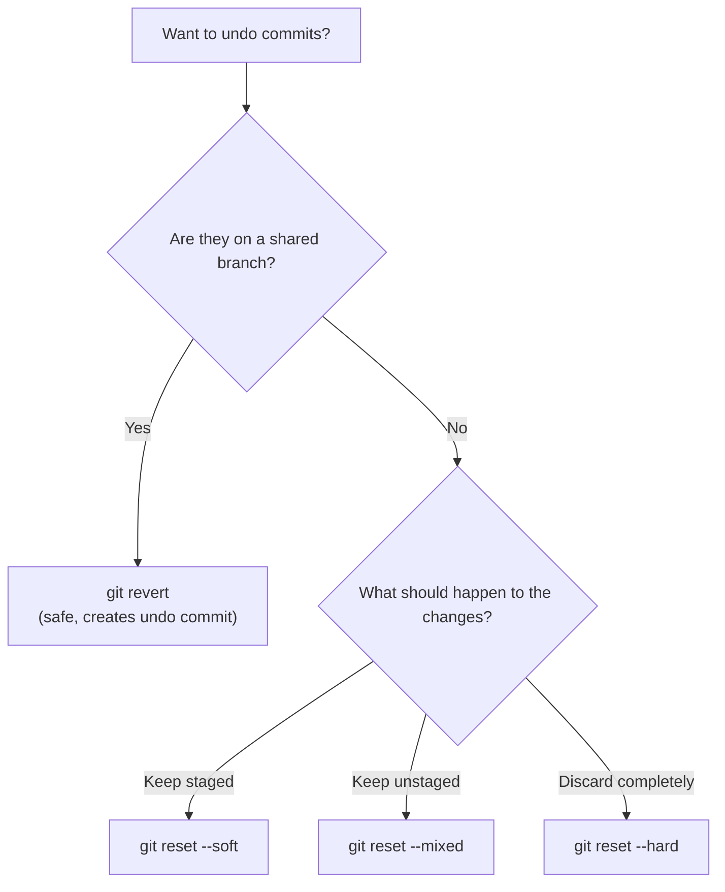

# Rewriting History

Git's commit history is immutable in a cryptographic sense - every commit is identified by a hash of its contents, parents, and metadata. But Git gives you tools to create *new* commits that replace old ones, effectively rewriting the visible history. This is one of Git's most powerful capabilities and one of its most dangerous. Understanding when rewriting is safe, what tools are available, and how to recover from mistakes is essential.

---

## The Golden Rule

**Never rewrite commits that have been pushed to a shared branch.**

When you rewrite history, you create new commit objects with new hashes. Anyone who based work on the old commits now has a diverged history. They'll get confusing merge conflicts when they try to pull, and the team will waste time untangling the mess.

Rewrite freely on:

- Local branches that only you work on
- Feature branches before they're merged
- Commits you haven't pushed yet

Leave shared history alone. Use `git revert` (which creates new commits) instead of rewriting when working on branches others depend on.

---

## Amending the Last Commit

The simplest form of rewriting. `git commit --amend` replaces the most recent commit:

```bash
# Fix the commit message
git commit --amend -m "Correct message"

# Add a forgotten file (keep the same message)
git add forgotten-file.py
git commit --amend --no-edit

# Change both the content and message
git add extra-fix.py
git commit --amend -m "Updated message with extra fix"
```

Under the hood, `--amend` creates a brand-new commit with a new hash and points the branch at it. The old commit still exists in the object database (reachable via the reflog) until garbage collection removes it.

---

## Interactive Rebase

`git rebase -i` (interactive rebase) is the Swiss army knife for history cleanup. It lets you reorder, squash, split, edit, and drop commits from a branch.

### Starting an Interactive Rebase

```bash
# Rebase the last 4 commits
git rebase -i HEAD~4

# Rebase all commits since branching from main
git rebase -i main
```

Git opens your editor with a list of commits (oldest first):

```
pick a1b2c3d Add user model
pick b2c3d4e Add user controller
pick c3d4e5f Fix typo in user model
pick d4e5f6a Add user tests
```

### Rebase Commands

Change the word `pick` to one of these to control what happens to each commit:

| Command | Short | Effect |
|---------|-------|--------|
| `pick` | `p` | Keep the commit as-is |
| `reword` | `r` | Keep the commit, edit the message |
| `edit` | `e` | Pause at this commit so you can amend it |
| `squash` | `s` | Combine with the previous commit, edit the combined message |
| `fixup` | `f` | Combine with the previous commit, discard this commit's message |
| `drop` | `d` | Delete the commit entirely |

You can also reorder lines to reorder commits, or delete a line to drop a commit.

### Example: Squashing Cleanup Commits

You made three commits but the middle one is just a typo fix. Squash it into the first:

```
pick a1b2c3d Add user model
fixup c3d4e5f Fix typo in user model
pick b2c3d4e Add user controller
pick d4e5f6a Add user tests
```

Notice the reordering: the typo fix is moved directly below the commit it fixes, then marked as `fixup` so its message is discarded. The result is three clean commits instead of four.

### Example: Editing a Commit

Mark a commit as `edit` to pause the rebase at that point:

```
edit a1b2c3d Add user model
pick b2c3d4e Add user controller
```

Git stops after replaying `a1b2c3d`. You can now:

```bash
# Make changes to files
git add .
git commit --amend    # Modify the commit

# Continue the rebase
git rebase --continue
```

### Autosquash

If you know while committing that a change should be squashed into an earlier commit, use `--fixup`:

```bash
# Create a fixup commit targeting a specific commit
git commit --fixup=a1b2c3d

# Later, rebase with autosquash to automatically reorder and squash
git rebase -i --autosquash main
```

Git creates a commit with a message like `fixup! Add user model`. When you run `rebase -i --autosquash`, it automatically reorders the fixup commit and marks it as `fixup`.

To always autosquash during interactive rebase:

```bash
git config --global rebase.autoSquash true
```

```terminal
title: Interactive Rebase - Squashing and Reordering
steps:
  - command: "git init rebase-demo && cd rebase-demo"
    output: "Initialized empty Git repository in /home/user/rebase-demo/.git/"
    narration: "Create a fresh repository for the interactive rebase demo."
  - command: "echo 'v1' > app.py && git add app.py && git commit -m 'Add application'"
    output: "[main (root-commit) a1b2c3d] Add application"
    narration: "Create the initial commit."
  - command: "echo 'v2' > app.py && git add app.py && git commit -m 'Update application logic'"
    output: "[main b2c3d4e] Update application logic"
    narration: "Second commit with an update."
  - command: "echo 'v2 fixed' > app.py && git add app.py && git commit -m 'Fix typo in application'"
    output: "[main c3d4e5f] Fix typo in application"
    narration: "Third commit - just a typo fix. This should be squashed into the previous commit for a cleaner history."
  - command: "echo 'tests' > test.py && git add test.py && git commit -m 'Add tests'"
    output: "[main d4e5f6a] Add tests"
    narration: "Fourth commit adding tests. Our goal: squash the typo fix into the update commit."
  - command: "git log --oneline"
    output: |
      d4e5f6a (HEAD -> main) Add tests
      c3d4e5f Fix typo in application
      b2c3d4e Update application logic
      a1b2c3d Add application
    narration: "Four commits. We want to combine 'Fix typo' into 'Update application logic' to produce three clean commits."
  - command: "GIT_SEQUENCE_EDITOR='sed -i s/pick c3d4e5f/fixup c3d4e5f/' git rebase -i HEAD~3"
    output: "Successfully rebased and updated refs/heads/main."
    narration: "Interactive rebase with the typo fix marked as 'fixup'. Git combines it with the preceding commit and discards its message. In practice, you'd edit this in your text editor."
  - command: "git log --oneline"
    output: |
      f6a7b8c (HEAD -> main) Add tests
      e5f6a7b Update application logic
      a1b2c3d Add application
    narration: "Three clean commits. The typo fix was absorbed into 'Update application logic'. Notice the commit hashes changed - rebase creates new commit objects."
```

---

## Cherry-Pick

`git cherry-pick` copies a specific commit from one branch to another. It creates a new commit with the same changes but a different hash and parent:

```bash
# Apply a specific commit to the current branch
git cherry-pick a1b2c3d

# Cherry-pick without committing (stage the changes instead)
git cherry-pick --no-commit a1b2c3d

# Cherry-pick a range of commits
git cherry-pick a1b2c3d..d4e5f6a
```

Cherry-pick is useful when you need a specific fix from another branch but don't want to merge the entire branch. But use it sparingly - duplicated commits (same changes, different hashes) can cause confusion when the branches are eventually merged.

---

## Revert vs Reset

Both undo changes, but in fundamentally different ways.

### `git revert` - Safe Undo (Creates New Commits)

`git revert` creates a new commit that undoes the changes from a specified commit. The original commit remains in history:

```bash
# Revert a specific commit
git revert a1b2c3d

# Revert without auto-committing (stage the undo changes)
git revert --no-commit a1b2c3d

# Revert a merge commit (must specify which parent to keep)
git revert -m 1 a1b2c3d
```

**Use revert on shared branches.** It's safe because it adds to history rather than rewriting it. Everyone can pull the revert without conflicts.

### `git reset` - Rewrite History (Moves HEAD)

`git reset` moves the branch pointer backward, effectively removing commits from the branch's visible history. The three modes control what happens to the changes from those commits:

| Mode | HEAD moves? | Index changes? | Working dir changes? | Effect |
|------|------------|----------------|---------------------|--------|
| `--soft` | Yes | No | No | Commits removed, changes stay staged |
| `--mixed` (default) | Yes | Yes | No | Commits removed, changes unstaged but in working dir |
| `--hard` | Yes | Yes | Yes | Commits removed, changes discarded entirely |

```bash
# Soft reset: uncommit but keep changes staged
git reset --soft HEAD~1

# Mixed reset: uncommit and unstage, keep changes in working dir
git reset HEAD~1

# Hard reset: uncommit and discard all changes
git reset --hard HEAD~1

# Reset to a specific commit
git reset --hard a1b2c3d
```

```quiz
question: "What is the difference between git reset --soft, --mixed, and --hard?"
type: multiple-choice
options:
  - text: "--soft keeps changes staged, --mixed unstages them, --hard discards them"
    correct: true
    feedback: "Correct! All three modes move the branch pointer backward. --soft leaves your changes in the staging area (ready to recommit). --mixed (the default) puts changes in the working directory but unstaged. --hard throws away the changes entirely. The reflog can help you recover from --hard if needed."
  - text: "They affect how many commits are removed: soft removes 1, mixed removes some, hard removes all"
    feedback: "All three modes move HEAD by the same amount (whatever you specify, like HEAD~1). The difference is what happens to the changes from the removed commits: staged, unstaged, or discarded."
  - text: "--soft is safe, --mixed is moderate, --hard is dangerous - they represent risk levels"
    feedback: "While --hard is more dangerous (it discards working directory changes), they're not named for risk levels. They describe what happens to the affected changes: kept staged (soft), kept unstaged (mixed), or discarded (hard)."
  - text: "They only affect the commit message, not the file contents"
    feedback: "All three modes actually move the branch pointer and affect file state. --soft keeps changes staged, --mixed unstages them, and --hard discards them from the working directory entirely."
```

!!! danger "git reset --hard deletes uncommitted work"
    `--hard` discards changes from your working directory. If those changes were never committed or stashed, they're gone permanently. Always check `git status` and `git stash` before using `--hard`.



---

## The Reflog: Your Safety Net

The **reflog** (reference log) records every time a branch tip or HEAD changes. Every commit, reset, rebase, checkout, merge, and amend is recorded. Even after you rewrite history, the old commits are findable through the reflog.

```bash
# View the reflog for HEAD
git reflog

# View reflog for a specific branch
git reflog show main

# View with dates
git reflog --date=iso
```

Sample output:

```
e5f6a7b (HEAD -> main) HEAD@{0}: rebase (finish): returning to refs/heads/main
d4e5f6a HEAD@{1}: rebase (start): checkout HEAD~3
d4e5f6a HEAD@{2}: commit: Add tests
c3d4e5f HEAD@{3}: commit: Fix typo in application
b2c3d4e HEAD@{4}: commit: Update application logic
a1b2c3d HEAD@{5}: commit (initial): Add application
```

Each entry has a reference like `HEAD@{3}` that you can use in any Git command:

```bash
# See what HEAD pointed to 3 moves ago
git show HEAD@{3}

# Reset to where HEAD was before a bad rebase
git reset --hard HEAD@{1}

# Create a branch at an old position
git branch recovery HEAD@{5}
```

!!! tip "Reflog entries expire"
    By default, reflog entries for reachable commits expire after 90 days and unreachable commits after 30 days. If you need to recover something, don't wait months. You can adjust the expiration: `git config gc.reflogExpire 180.days`.

```terminal
title: Recovering from a Bad Reset Using the Reflog
steps:
  - command: "git init reflog-demo && cd reflog-demo"
    output: "Initialized empty Git repository in /home/user/reflog-demo/.git/"
    narration: "Create a demo repository."
  - command: "for i in 1 2 3 4 5; do echo \"commit $i\" > file.txt && git add file.txt && git commit -m \"Commit $i\"; done"
    output: |
      [main (root-commit) a1a1a1a] Commit 1
      [main b2b2b2b] Commit 2
      [main c3c3c3c] Commit 3
      [main d4d4d4d] Commit 4
      [main e5e5e5e] Commit 5
    narration: "Create 5 commits to have some history to work with."
  - command: "git log --oneline"
    output: |
      e5e5e5e (HEAD -> main) Commit 5
      d4d4d4d Commit 4
      c3c3c3c Commit 3
      b2b2b2b Commit 2
      a1a1a1a Commit 1
    narration: "Five commits. Now simulate a mistake: accidentally reset --hard back to commit 2."
  - command: "git reset --hard HEAD~3"
    output: "HEAD is now at b2b2b2b Commit 2"
    narration: "Oops! We just threw away commits 3, 4, and 5 with --hard. The working directory now matches commit 2. But the commits still exist in the object database."
  - command: "git log --oneline"
    output: |
      b2b2b2b (HEAD -> main) Commit 2
      a1a1a1a Commit 1
    narration: "git log only shows 2 commits now. Commits 3-5 seem gone. But the reflog remembers."
  - command: "git reflog -8"
    output: |
      b2b2b2b (HEAD -> main) HEAD@{0}: reset: moving to HEAD~3
      e5e5e5e HEAD@{1}: commit: Commit 5
      d4d4d4d HEAD@{2}: commit: Commit 4
      c3c3c3c HEAD@{3}: commit: Commit 3
      b2b2b2b (HEAD -> main) HEAD@{4}: commit: Commit 2
      a1a1a1a HEAD@{5}: commit (initial): Commit 1
    narration: "The reflog shows every HEAD movement. HEAD@{1} is where we were before the reset - at Commit 5 (e5e5e5e). We can use this to recover."
  - command: "git reset --hard HEAD@{1}"
    output: "HEAD is now at e5e5e5e Commit 5"
    narration: "Reset back to where HEAD was before the bad reset. All 5 commits are restored."
  - command: "git log --oneline"
    output: |
      e5e5e5e (HEAD -> main) Commit 5
      d4d4d4d Commit 4
      c3c3c3c Commit 3
      b2b2b2b Commit 2
      a1a1a1a Commit 1
    narration: "All commits are back. The reflog is your safety net for almost any history rewriting mistake."
```

---

## Rebasing onto Another Branch

Beyond interactive rebase for cleanup, `git rebase` is used to move a branch to start from a different base:

```bash
# Rebase current branch onto main
git rebase main
```

**Before rebase:**
```
main:    A ── B ── C
               \
feature:        D ── E
```

**After `git switch feature && git rebase main`:**
```
main:    A ── B ── C
                     \
feature:              D' ── E'
```

`D'` and `E'` are new commits (new hashes) with the same changes as `D` and `E`, but they now build on `C` instead of `B`. The original `D` and `E` become unreachable.

### Rebase vs Merge

| | Merge | Rebase |
|--|-------|--------|
| **History** | Preserves branch topology | Creates linear history |
| **Commits** | Adds a merge commit | Rewrites existing commits |
| **Safety** | Non-destructive | Rewrites history (dangerous for shared branches) |
| **Conflicts** | Resolve once | May resolve per-commit |
| **Use when** | Integrating shared branches | Cleaning up local/feature branches before merge |

```quiz
question: "When is it safe to rebase?"
type: multiple-choice
options:
  - text: "Only on local branches whose commits haven't been pushed to a shared remote"
    correct: true
    feedback: "Correct! Rebase rewrites commits (creating new hashes). If others have based work on the original commits, rebase will cause diverged histories and painful merge conflicts. Rebase freely on unpushed local branches; use merge for shared branches."
  - text: "Anytime, as long as you force push afterward"
    feedback: "Force pushing after a rebase overwrites the remote history, potentially destroying other people's work. Only force push to branches that exclusively belong to you."
  - text: "Only on the main branch to keep it clean"
    feedback: "The opposite is true - main is typically a shared branch that should never be rebased. Rebase feature branches onto main before merging, not the other way around."
  - text: "Rebase is always safe because Git keeps the old commits in the reflog"
    feedback: "While the reflog does let you recover locally, other developers who pulled the old commits will have diverged histories. The safety issue isn't about your local recovery - it's about the team's shared state."
```

---

## Exercises

```exercise
title: Clean Up a Messy Branch with Interactive Rebase
difficulty: intermediate
scenario: |
  You've been working on a feature branch with quick, messy commits. Before merging,
  clean up the history so reviewers see a clear, logical progression.

  1. Create a repository with an initial commit on main
  2. Create a feature branch with these commits (in order):
     - "WIP: start auth module"
     - "Add login endpoint"
     - "fix typo"
     - "Add logout endpoint"
     - "forgot to add test file"
     - "Add auth tests"
  3. Use interactive rebase to produce this clean history:
     - "Add authentication module with login endpoint"
     - "Add logout endpoint"
     - "Add auth tests"
  4. Verify the cleaned history with git log
hints:
  - "Use git rebase -i HEAD~6 to edit all 6 commits"
  - "Squash 'fix typo' into 'Add login endpoint' using fixup"
  - "Squash 'WIP: start auth module' into 'Add login endpoint' using squash (and reword)"
  - "Squash 'forgot to add test file' into 'Add auth tests' using fixup"
  - "Reorder lines so related commits are adjacent before squashing"
solution: |
  ```bash
  git init rebase-exercise && cd rebase-exercise
  echo "init" > app.py && git add app.py && git commit -m "Initial commit"

  git switch -c feature/auth

  echo "auth v1" > auth.py && git add auth.py && git commit -m "WIP: start auth module"
  echo "login" > auth.py && git add auth.py && git commit -m "Add login endpoint"
  echo "logn" > auth.py && git add auth.py && git commit -m "fix typo"
  echo "login\nlogout" > auth.py && git add auth.py && git commit -m "Add logout endpoint"
  echo "test" > test_auth.py && git add test_auth.py && git commit -m "forgot to add test file"
  echo "tests complete" > test_auth.py && git add test_auth.py && git commit -m "Add auth tests"

  # Interactive rebase - edit the todo list to:
  # squash WIP into login, fixup typo into login, fixup forgotten file into tests
  git rebase -i HEAD~6

  # In the editor, rearrange to:
  # pick   <Add login endpoint>
  # squash <WIP: start auth module>    (combine, edit message)
  # fixup  <fix typo>                  (combine, discard message)
  # pick   <Add logout endpoint>
  # pick   <Add auth tests>
  # fixup  <forgot to add test file>   (combine, discard message)

  # When the message editor opens for the squash, write:
  # "Add authentication module with login endpoint"

  git log --oneline
  # Should show 4 commits: Initial, auth module, logout, tests
  ```
```

```exercise
title: Revert vs Reset on Shared and Private Branches
difficulty: intermediate
scenario: |
  Practice choosing between revert and reset depending on whether a branch is shared.

  1. Create a repository with 3 commits on main
  2. Simulate a "shared branch" scenario: revert the second commit on main using `git revert`
  3. Verify the revert created a new commit (4 total) and the original commit still exists
  4. Create a private feature branch with 3 additional commits
  5. Use `git reset --soft HEAD~2` to uncommit the last 2 commits (keeping changes staged)
  6. Recommit the staged changes as a single clean commit
  7. Compare the branch histories - main has 4 commits (including revert), feature has 2 clean commits
hints:
  - "git revert creates a new commit that undoes changes - use it on shared branches"
  - "git reset --soft HEAD~2 removes 2 commits but keeps all changes staged"
  - "After soft reset, git commit creates one commit from all the staged changes"
  - "git log --oneline --all --graph shows both branches"
solution: |
  ```bash
  git init revert-reset && cd revert-reset

  # 3 commits on main
  echo "v1" > file.txt && git add file.txt && git commit -m "Version 1"
  echo "v2-bad" > file.txt && git add file.txt && git commit -m "Bad change"
  echo "v3" >> file.txt && git add file.txt && git commit -m "Version 3"

  # Revert the bad commit on shared main
  git revert HEAD~1    # Reverts "Bad change"
  git log --oneline    # 4 commits: v1, bad, v3, revert

  # Private feature branch
  git switch -c feature/cleanup
  echo "feat1" > feature.txt && git add feature.txt && git commit -m "WIP feature part 1"
  echo "feat2" >> feature.txt && git add feature.txt && git commit -m "WIP feature part 2"
  echo "feat3" >> feature.txt && git add feature.txt && git commit -m "WIP feature part 3"

  # Squash last 2 into 1 using soft reset
  git reset --soft HEAD~2
  git commit -m "Complete feature implementation"

  git log --oneline --all --graph
  ```
```

---

## Further Reading

- [Pro Git - Chapter 7.6: Rewriting History](https://git-scm.com/book/en/v2/Git-Tools-Rewriting-History) - interactive rebase, amending, filter-branch
- [Pro Git - Chapter 3.6: Rebasing](https://git-scm.com/book/en/v2/Git-Branching-Rebasing) - rebase fundamentals and the golden rule
- [Official git-rebase documentation](https://git-scm.com/docs/git-rebase) - complete reference for rebase modes and options
- [Official git-reset documentation](https://git-scm.com/docs/git-reset) - the three reset modes explained
- [Official git-reflog documentation](https://git-scm.com/docs/git-reflog) - reflog usage and expiration

---

**Previous:** [Remote Repositories](remote-repositories.md) | **Next:** [Stashing and the Worktree](stashing-and-worktree.md) | [Back to Index](README.md)
