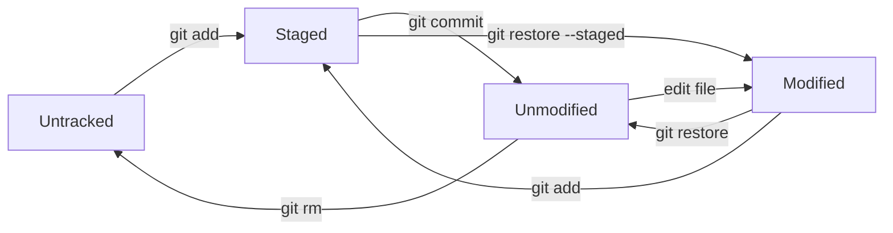

# The Three Trees: Working Directory, Index, and Repository

Git organizes your work into three distinct areas, commonly called the "three trees." Understanding how changes flow between them is the single most important concept in Git. Every command you run either moves data between these areas, inspects the differences between them, or manipulates what they contain.

---

## The Three Areas

### Working Directory (Working Tree)

The **working directory** is the actual directory of files on your filesystem. When you open a file in your editor, you're editing the working copy. This is the only area you interact with directly - the other two are managed by Git.

Your working directory contains every tracked file at its current state, plus any new files you've created that Git doesn't know about yet.

### Staging Area (Index)

The **staging area** - also called the **index** - is a holding zone between your working directory and the repository. When you run `git add`, you're copying the current state of a file into the index. The index represents what will go into your next commit.

The index is actually a binary file at `.git/index`. It doesn't store file contents directly - it stores references to blob objects and metadata (file paths, permissions, timestamps). You can think of it as a manifest of what the next commit will look like.

Why have a staging area at all? Because it gives you precise control over commits. If you've changed five files but only two changes are related, you can stage just those two and commit them with a focused message. The other three changes stay in your working directory, ready for a separate commit.

### Repository (Committed History)

The **repository** is the `.git` directory at the root of your project. It contains the complete history of every committed snapshot, all branches and tags, configuration, and the object database. When you run `git commit`, Git takes everything in the staging area, creates a permanent snapshot, and adds it to the repository.

Once something is committed, it's safe. Git's content-addressable storage means committed data is checksummed and extremely difficult to lose (even if you try).

```quiz
question: "What are Git's 'three trees' (the three main areas where file changes live)?"
type: multiple-choice
options:
  - text: "Local repository, remote repository, and backup"
    feedback: "The three trees are all local. Remote repositories and backups are separate concepts."
  - text: "Working directory, staging area (index), and repository (committed history)"
    correct: true
    feedback: "Correct! The working directory has your actual files. The staging area (index) holds changes you've marked for the next commit. The repository stores the complete committed history. Understanding this three-stage flow is key to using Git effectively."
  - text: "Main branch, feature branch, and release branch"
    feedback: "Those are branching strategies, not Git's three trees. The three trees refer to the working directory, staging area, and repository."
  - text: "Source code, build artifacts, and configuration files"
    feedback: "The three trees aren't about file types. They're about the stages of tracking changes: working directory, staging area, repository."
```

---

## The File Lifecycle

Every file in a Git repository is in one of these states:

| State | Where it lives | What it means |
|-------|---------------|---------------|
| **Untracked** | Working directory only | Git sees the file but isn't tracking it |
| **Tracked, unmodified** | Working directory = repository | File matches the last commit, no changes |
| **Modified** | Working directory differs from index | You've changed the file but haven't staged the changes |
| **Staged** | Index differs from repository | Changes are queued for the next commit |
| **Committed** | Repository | Changes are permanently recorded |

A file can be in multiple states simultaneously. If you modify a file, stage it, then modify it again, the file is both staged (the first set of changes) and modified (the second set). This is normal and useful - it means your next commit captures only the changes you explicitly staged.



---

## Creating a Repository: `git init`

Every Git project starts with initialization. `git init` creates the `.git` directory with all the internal structures Git needs:

```bash
git init myproject
cd myproject
```

Or initialize in an existing directory:

```bash
cd existing-project
git init
```

After `git init`, your directory looks like this:

```
myproject/
└── .git/
    ├── HEAD            # Points to the current branch
    ├── config          # Repository-specific configuration
    ├── description     # Used by GitWeb (rarely relevant)
    ├── hooks/          # Sample hook scripts
    ├── info/           # Global exclude patterns
    ├── objects/        # All content (blobs, trees, commits, tags)
    └── refs/           # Branch and tag pointers
        ├── heads/      # Local branches
        └── tags/       # Tags
```

The important pieces: `HEAD` tells Git what branch you're on. `objects/` stores all your data. `refs/` stores branch and tag pointers. The [Object Model](object-model.md) and [Refs, the Reflog, and the DAG](refs-reflog-dag.md) guides cover these in depth.

---

## Checking Status: `git status`

`git status` is the command you'll run most often. It shows you exactly where things stand across all three areas:

```bash
git status
```

The output groups files by state:

- **Changes to be committed** - files in the staging area (ready for commit)
- **Changes not staged for commit** - tracked files that have been modified but not staged
- **Untracked files** - files Git doesn't know about

For a compact view:

```bash
git status -s
```

This shows two-column status codes. The left column is the staging area status, the right column is the working tree status:

| Code | Meaning |
|------|---------|
| `??` | Untracked |
| `A ` | New file, staged |
| `M ` | Modified, staged |
| ` M` | Modified, not staged |
| `MM` | Modified, staged, then modified again |
| `D ` | Deleted, staged |
| ` D` | Deleted, not staged |

---

## Staging Changes: `git add`

`git add` copies the current state of files from the working directory into the staging area:

```bash
# Stage a specific file
git add README.md

# Stage multiple files
git add file1.txt file2.txt

# Stage all changes in a directory
git add src/

# Stage all changes in the entire working tree
git add .

# Stage parts of a file interactively
git add -p README.md
```

`git add -p` (patch mode) is particularly powerful. It shows you each change in a file and lets you choose which ones to stage. This means you can make several unrelated edits to one file and commit them separately.

!!! tip "Stage with intention"
    Get in the habit of staging specific files rather than using `git add .` for everything. This forces you to review what you're about to commit and produces cleaner, more focused commits.

---

## Unstaging and Restoring: `git restore`

Made a mistake? `git restore` (introduced in Git 2.23) provides clear commands for undoing changes:

```bash
# Discard changes in working directory (restore from index)
git restore README.md

# Unstage a file (restore the index from HEAD, keep working changes)
git restore --staged README.md

# Restore a file from a specific commit
git restore --source=HEAD~2 README.md
```

!!! danger "git restore discards changes"
    `git restore README.md` (without `--staged`) permanently discards your uncommitted working directory changes to that file. There is no undo. If you haven't committed or stashed those changes, they are gone. Use `git stash` first if you're unsure.

Before Git 2.23, the same operations used `git checkout` and `git reset`:

| Modern command | Legacy equivalent |
|----------------|-------------------|
| `git restore file` | `git checkout -- file` |
| `git restore --staged file` | `git reset HEAD file` |

The modern `restore` commands are clearer about what they do, but you'll see the legacy forms in older documentation and tutorials.

---

## Removing Files: `git rm`

To remove a tracked file from both the working directory and the staging area:

```bash
git rm old-file.txt
```

This deletes the file from disk and stages the deletion. Your next commit will record the removal.

To stop tracking a file but keep it on disk (useful for files that should have been in `.gitignore`):

```bash
git rm --cached config.local
```

The file stays in your working directory but Git stops tracking it. Add it to `.gitignore` to prevent accidentally re-adding it.

---

## The Init-to-Commit Workflow

Here's the complete workflow from creating a repository through your first commit, with each step showing the state of the three trees:

```terminal
title: Git Init to Commit Workflow
steps:
  - command: "git init myproject && cd myproject"
    output: "Initialized empty Git repository in /home/user/myproject/.git/"
    narration: "Create a new repository. Git creates a .git directory with all the repository internals (objects, refs, config). All three trees are empty."
  - command: "echo '# My Project' > README.md && git status"
    output: |
      On branch main
      No commits yet
      Untracked files:
        (use "git add <file>..." to include in what will be committed)
              README.md
      nothing added to commit but untracked files present
    narration: "After creating a file, git status shows it as Untracked. The file exists in the working directory but Git isn't tracking it. The staging area and repository are still empty."
  - command: "git add README.md && git status"
    output: |
      On branch main
      No commits yet
      Changes to be committed:
        (use "git rm --cached <file>..." to unstage)
              new file:   README.md
    narration: "git add copies the file into the staging area (index). It's now staged and ready to be committed. The working directory and staging area both have the file, but the repository is still empty."
  - command: "git commit -m 'Initial commit'"
    output: |
      [main (root-commit) a1b2c3d] Initial commit
       1 file changed, 1 insertion(+)
       create mode 100644 README.md
    narration: "git commit takes everything in the staging area and creates a permanent snapshot in the repository. Now all three trees contain README.md with the same content."
  - command: "echo 'A sample project.' >> README.md && git status"
    output: |
      On branch main
      Changes not staged for commit:
        (use "git add <file>..." to update what will be committed)
        (use "git restore <file>..." to discard changes in working directory)
              modified:   README.md
    narration: "After modifying the file, git status shows it as Modified. The working directory has the new content, but the staging area and repository still have the old version."
  - command: "git add README.md && git commit -m 'Add project description'"
    output: |
      [main e4f5g6h] Add project description
       1 file changed, 1 insertion(+)
    narration: "Stage and commit in sequence. Now all three trees are in sync again with the updated content."
  - command: "git log --oneline"
    output: |
      e4f5g6h (HEAD -> main) Add project description
      a1b2c3d Initial commit
    narration: "git log shows the commit history. HEAD -> main means HEAD points to the main branch, which points to the latest commit. Each commit has a unique hash."
  - command: "git restore --staged README.md"
    output: ""
    narration: "If you had staged a change and want to unstage it, git restore --staged moves it out of the staging area back to just a working directory change. The file on disk is unchanged."
```

---

## HEAD: Your Current Position

**HEAD** is a special reference that points to whatever you currently have checked out - usually a branch, which in turn points to a commit. Think of HEAD as "you are here" on the commit graph.

When HEAD points to a branch name (the normal case), it's a **symbolic reference**:

```
HEAD → main → e4f5g6h
```

When you make a new commit, the branch pointer moves forward and HEAD follows it.

```quiz
question: "What does HEAD refer to in Git?"
type: multiple-choice
options:
  - text: "The first commit in the repository"
    feedback: "The first commit has no special pointer. HEAD points to the current position, which is usually the latest commit on the checked-out branch."
  - text: "A pointer to the currently checked-out commit (usually via a branch reference)"
    correct: true
    feedback: "Correct! HEAD is a symbolic reference that usually points to a branch name, which in turn points to a commit. When you switch branches, HEAD changes to point to the new branch. In 'detached HEAD' state, it points directly to a commit instead of a branch."
  - text: "The remote's latest commit"
    feedback: "The remote's latest commit is tracked by remote-tracking branches (like origin/main). HEAD is your local position in the repository."
  - text: "The most recent tag in the repository"
    feedback: "Tags are independent of HEAD. HEAD points to whatever commit you currently have checked out."
```

### Detached HEAD

If you check out a specific commit (by hash, tag, or remote branch) rather than a branch name, HEAD points directly to that commit. This is called **detached HEAD** state:

```bash
git checkout a1b2c3d    # Detached HEAD
git checkout v1.0       # Also detached HEAD (tag, not branch)
```

In detached HEAD, you can look around and even make commits, but those commits aren't on any branch. If you switch away without creating a branch, those commits become unreachable and will eventually be garbage collected.

```quiz
question: "What happens when you're in a 'detached HEAD' state?"
type: multiple-choice
options:
  - text: "Your repository is corrupted and needs repair"
    feedback: "Detached HEAD is a normal, valid state. It just means HEAD points to a commit directly instead of through a branch reference."
  - text: "HEAD points directly to a commit instead of a branch, so new commits won't belong to any branch"
    correct: true
    feedback: "Correct! In detached HEAD, new commits have no branch pointing to them. If you switch away, those commits become unreachable (orphaned) unless you create a branch first: git branch new-branch-name. This state is common when checking out a tag or specific commit."
  - text: "You've been disconnected from the remote repository"
    feedback: "Detached HEAD is purely a local state about how HEAD references a commit. It has nothing to do with remote connectivity."
  - text: "Git has detected a merge conflict that must be resolved"
    feedback: "Merge conflicts are a separate situation. Detached HEAD means you've checked out a specific commit rather than a branch."
```

To get out of detached HEAD and keep any commits you made:

```bash
git branch my-new-branch    # Create a branch at the current commit
git switch my-new-branch     # Switch to it (HEAD is now attached)
```

---

## The `.gitignore` File

Not every file in your working directory should be tracked. Build artifacts, dependency directories, editor configs, OS files, and secrets should be excluded. The `.gitignore` file tells Git which files to ignore.

Create `.gitignore` in your repository root:

```bash
# Compiled output
*.o
*.pyc
__pycache__/

# Dependencies
node_modules/
vendor/

# Build directories
dist/
build/
*.egg-info/

# IDE and editor files
.idea/
.vscode/
*.swp
*~

# OS files
.DS_Store
Thumbs.db

# Environment and secrets
.env
.env.local
*.key
*.pem
```

### Pattern Syntax

| Pattern | Matches | Example |
|---------|---------|---------|
| `*.log` | All `.log` files in any directory | `error.log`, `src/debug.log` |
| `/build` | `build` directory in the repo root only | `build/`, but not `src/build/` |
| `build/` | Any directory named `build` | `build/`, `src/build/` |
| `doc/*.txt` | `.txt` files in `doc/` (not subdirs) | `doc/notes.txt`, but not `doc/sub/notes.txt` |
| `doc/**/*.txt` | `.txt` files anywhere under `doc/` | `doc/notes.txt`, `doc/sub/notes.txt` |
| `!important.log` | Exception - track this file even if `*.log` matches | Negation must come after the pattern it overrides |
| `#` | Comment line | Ignored by Git |

!!! tip "Global gitignore"
    For OS-specific files (`.DS_Store`, `Thumbs.db`) and editor files (`.idea/`, `*.swp`) that apply to all your projects, use a global gitignore instead of adding them to every repository:

    ```bash
    git config --global core.excludesFile ~/.gitignore_global
    ```

    Then put your personal patterns in `~/.gitignore_global`. This keeps each repository's `.gitignore` focused on project-specific patterns.

### Checking What's Ignored

To verify your `.gitignore` patterns work:

```bash
# Check if a specific file would be ignored
git check-ignore -v debug.log

# List all ignored files
git status --ignored
```

```terminal
title: Building and Testing a .gitignore
steps:
  - command: "mkdir gitignore-demo && cd gitignore-demo && git init"
    output: "Initialized empty Git repository in /home/user/gitignore-demo/.git/"
    narration: "Create a fresh repository to test .gitignore patterns."
  - command: "touch app.py test.pyc debug.log .env README.md"
    output: ""
    narration: "Create a mix of files: source code (app.py), compiled bytecode (.pyc), a log file, an environment file with secrets, and documentation."
  - command: "git status -s"
    output: |
      ?? .env
      ?? README.md
      ?? app.py
      ?? debug.log
      ?? test.pyc
    narration: "Without a .gitignore, Git sees all five files as untracked. We don't want to track .pyc files, logs, or .env."
  - command: "printf '*.pyc\\n*.log\\n.env\\n' > .gitignore && cat .gitignore"
    output: |
      *.pyc
      *.log
      .env
    narration: "Create a .gitignore that excludes Python bytecode, log files, and the .env file."
  - command: "git status -s"
    output: |
      ?? .gitignore
      ?? README.md
      ?? app.py
    narration: "Now Git only shows three files: the .gitignore itself, README.md, and app.py. The .pyc, .log, and .env files are invisible to Git."
  - command: "git check-ignore -v test.pyc debug.log .env app.py"
    output: |
      .gitignore:1:*.pyc	test.pyc
      .gitignore:2:*.log	debug.log
      .gitignore:3:.env	.env
    narration: "git check-ignore shows which pattern in which file caused each match. app.py doesn't appear because it isn't ignored. The -v flag adds the source file and line number."
  - command: "git add .gitignore README.md app.py && git commit -m 'Initial commit with .gitignore'"
    output: |
      [main (root-commit) b2c3d4e] Initial commit with .gitignore
       3 files changed, 4 insertions(+)
       create mode 100644 .gitignore
       create mode 100644 README.md
       create mode 100644 app.py
    narration: "Commit the tracked files. The ignored files are safely excluded. Always commit your .gitignore so the whole team shares the same exclusion rules."
```

```code-walkthrough
title: ".gitignore Pattern Matching"
description: A realistic .gitignore for a Python web application, showing glob patterns, directory rules, negation, and comments.
code: |
  # Python
  __pycache__/
  *.py[cod]
  *.egg-info/
  dist/
  build/

  # Virtual environments
  venv/
  .venv/
  env/

  # Environment and secrets
  .env
  .env.*
  !.env.example

  # IDE
  .idea/
  .vscode/settings.json
  *.swp

  # OS
  .DS_Store
  Thumbs.db

  # Logs and databases
  *.log
  *.sqlite3

  # Coverage reports
  htmlcov/
  .coverage
language: bash
annotations:
  - line: 2
    text: "Trailing slash means 'directory only.' This ignores any directory named __pycache__ at any depth, but wouldn't ignore a file named __pycache__."
  - line: 3
    text: "Character class [cod] matches *.pyc, *.pyo, and *.pyd - all Python bytecode variants - in one pattern."
  - line: 4
    text: "*.egg-info/ ignores Python package metadata directories created during development installs."
  - line: 13
    text: ".env.* matches .env.local, .env.production, etc. Combined with .env above, this catches all environment files."
  - line: 14
    text: "The ! prefix negates a previous pattern. This tracks .env.example even though .env.* would ignore it. Negations must come after the pattern they override. This lets you include a template file showing required environment variables."
  - line: 17
    text: "You can ignore specific files within a directory. This ignores VS Code settings but not other .vscode files like extensions.json."
  - line: 27
    text: "*.sqlite3 prevents accidentally committing development databases. Production databases should never be in a Git repository."
```

---

## Putting It All Together

```exercise
title: File Lifecycle Practice
difficulty: beginner
scenario: |
  Practice the complete file lifecycle by tracking, modifying, staging, unstaging, and committing a series of files. This exercise walks through every state a file can be in.

  1. Create a new repository
  2. Create three files: `index.html`, `style.css`, `app.js`
  3. Stage and commit all three
  4. Modify `index.html` and `style.css`
  5. Stage only `index.html`
  6. Verify that `index.html` is staged and `style.css` is modified but not staged
  7. Unstage `index.html` using `git restore --staged`
  8. Verify both files are back to modified-but-not-staged
  9. Stage both files and commit them together
  10. Create a file called `temp.txt`, add it, then remove it with `git rm`
hints:
  - "Use git status after every operation to see the state changes"
  - "git add stages changes; git restore --staged unstages them"
  - "git rm removes a file from both the working directory and the staging area"
  - "git status -s gives a compact two-column view showing staging (left) and working tree (right) status"
solution: |
  ```bash
  # Step 1: Create repository
  git init lifecycle-demo && cd lifecycle-demo

  # Steps 2-3: Create and commit files
  echo '<html><body>Hello</body></html>' > index.html
  echo 'body { margin: 0; }' > style.css
  echo 'console.log("hello");' > app.js
  git add index.html style.css app.js
  git commit -m "Add initial HTML, CSS, and JS files"

  # Step 4: Modify two files
  echo '<html><body>Hello World</body></html>' > index.html
  echo 'body { margin: 0; padding: 0; }' > style.css

  # Step 5: Stage only index.html
  git add index.html

  # Step 6: Check status
  git status
  # Changes to be committed:
  #   modified:   index.html
  # Changes not staged for commit:
  #   modified:   style.css

  # Step 7: Unstage index.html
  git restore --staged index.html

  # Step 8: Verify both are unstaged
  git status
  # Changes not staged for commit:
  #   modified:   index.html
  #   modified:   style.css

  # Step 9: Stage both and commit
  git add index.html style.css
  git commit -m "Update HTML content and CSS padding"

  # Step 10: Create, add, then remove a file
  echo "temporary" > temp.txt
  git add temp.txt
  git commit -m "Add temp file"
  git rm temp.txt
  git commit -m "Remove temp file"

  # Final check
  git log --oneline
  # Shows all four commits in order
  ```
```

---

## Further Reading

- [Pro Git - Chapter 2: Git Basics](https://git-scm.com/book/en/v2/Git-Basics-Getting-a-Git-Repository) - covers init, clone, status, add, commit, rm, and gitignore
- [Official git-status documentation](https://git-scm.com/docs/git-status) - complete reference for status output formats
- [Official gitignore documentation](https://git-scm.com/docs/gitignore) - full pattern syntax specification
- [github/gitignore](https://github.com/github/gitignore) - a collection of `.gitignore` templates for many languages and frameworks

---

**Previous:** [Introduction: Why Git, and Why Version Control](introduction.md) | **Next:** [Commits and History](commits-and-history.md) | [Back to Index](README.md)
