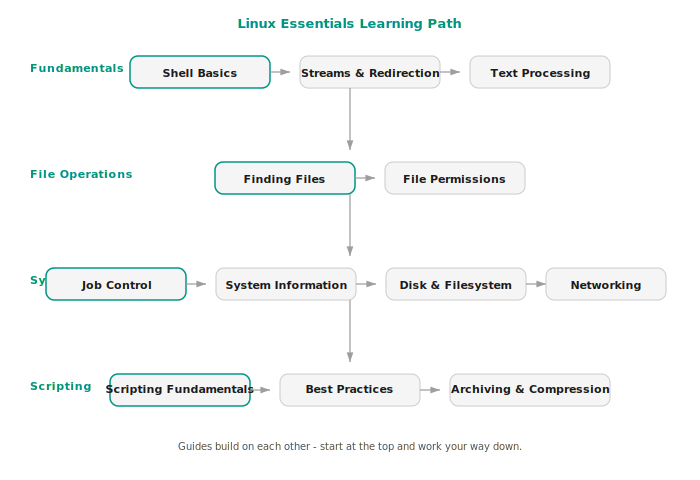

# Linux CLI Essentials

A comprehensive guide to working effectively on the Linux command line. These guides take you from "I can type commands" to understanding how the shell actually works and using it productively.

Each topic is covered in its own guide. Start anywhere - they're self-contained, but the order below follows a natural learning path.

---

## Guides

<a class="topic-card" href="shell-basics/" data-guide="shell-basics" data-topic="Linux Essentials">
1
Start Here

Shell Basics

Beginner
45 min

What the shell is, how it starts up, and how it processes your input. Covers shell types, configuration files, the PATH variable, variables, quoting rules, and shell expansions.

&#10003;
</a>
<a class="topic-card" href="streams-and-redirection/" data-guide="streams-and-redirection" data-topic="Linux Essentials">
2

Streams and Redirection

Beginner
30 min

How programs communicate through STDIN, STDOUT, and STDERR. Covers redirection, here documents, file descriptor manipulation, pipelines, and process substitution.

&#10003;
</a>
<a class="topic-card" href="text-processing/" data-guide="text-processing" data-topic="Linux Essentials">
3

Text Processing

Intermediate
45 min

The core toolkit for searching, transforming, and analyzing text. Covers grep, sed, awk, cut, sort, uniq, tr, wc, head, tail, and tee.

&#10003;
</a>
<a class="topic-card" href="regular-expressions/" data-guide="regular-expressions" data-topic="Linux Essentials">
4

Regular Expressions

Intermediate
40 min

The pattern-matching language used across Linux tools. Covers metacharacters, character classes, quantifiers, backreferences, BRE vs ERE vs PCRE, lookahead/lookbehind, and practical patterns.

&#10003;
</a>
<a class="topic-card" href="finding-files/" data-guide="finding-files" data-topic="Linux Essentials">
5

Finding Files

Beginner
25 min

Searching directory trees and operating on the results. Covers find (name, type, size, time, permission tests, logical operators, and actions) and xargs.

&#10003;
</a>
<a class="topic-card" href="file-permissions/" data-guide="file-permissions" data-topic="Linux Essentials">
6

File Permissions

Beginner
30 min

The Linux permission model explained. Covers chmod (symbolic and octal modes), chown, chgrp, umask, and special permission bits (setuid, setgid, sticky bit).

&#10003;
</a>
<a class="topic-card" href="job-control/" data-guide="job-control" data-topic="Linux Essentials">
7

Job Control

Intermediate
30 min

Managing processes from the terminal. Covers foreground/background processes, signals, kill/killall/pkill, nohup, disown, ps, top/htop, and terminal multiplexers.

&#10003;
</a>
<a class="topic-card" href="scripting-fundamentals/" data-guide="scripting-fundamentals" data-topic="Linux Essentials">
8

Scripting Fundamentals

Intermediate
45 min

Writing reliable bash scripts. Covers exit codes, conditionals, loops, functions, and error handling with set -euo pipefail and trap.

&#10003;
</a>
<a class="topic-card" href="disk-and-filesystem/" data-guide="disk-and-filesystem" data-topic="Linux Essentials">
9

Disk and Filesystem

Intermediate
30 min

Managing storage. Covers df, du, mount/umount, /etc/fstab, lsblk, partition management with fdisk/parted, mkfs, and fsck.

&#10003;
</a>
<a class="topic-card" href="package-management/" data-guide="package-management" data-topic="Linux Essentials">
10

Package Management

Intermediate
35 min

Installing, updating, and removing software. Covers apt and dnf workflows, low-level tools (dpkg, rpm), repository management, universal formats, and version pinning.

&#10003;
</a>
<a class="topic-card" href="system-services/" data-guide="system-services" data-topic="Linux Essentials">
11

System Services

Intermediate
35 min

Managing services with systemd. Covers systemctl, unit file anatomy, writing custom services, journalctl log filtering, targets, and systemd timers.

&#10003;
</a>
<a class="topic-card" href="user-and-group-management/" data-guide="user-and-group-management" data-topic="Linux Essentials">
12

User and Group Management

Intermediate
35 min

Managing users, groups, and access control. Covers useradd/usermod/userdel, /etc/passwd and /etc/shadow, group management, the sudo system, PAM basics, and user auditing.

&#10003;
</a>
<a class="topic-card" href="ssh-configuration/" data-guide="ssh-configuration" data-topic="Linux Essentials">
13

SSH Configuration

Advanced
45 min

Deep dive into SSH configuration and key management. Covers key generation, ssh-agent, ~/.ssh/config patterns, SSH certificates, sshd_config hardening, and port forwarding.

&#10003;
</a>
<a class="topic-card" href="log-management/" data-guide="log-management" data-topic="Linux Essentials">
14

Log Management

Intermediate
30 min

Finding, filtering, and managing system logs. Covers /var/log/ structure, journalctl filtering, rsyslog configuration, logrotate setup, and structured log parsing.

&#10003;
</a>
<a class="topic-card" href="networking/" data-guide="networking" data-topic="Linux Essentials">
15

Networking

Intermediate
35 min

Essential networking from the command line. Covers ping/traceroute/mtr, curl/wget, ssh, scp/rsync, ss/ip, dig/nslookup, and nc (netcat).

&#10003;
</a>
<a class="topic-card" href="system-information/" data-guide="system-information" data-topic="Linux Essentials">
16

System Information

Beginner
25 min

Understanding what's running on a system. Covers uname, uptime, free, lscpu, lsof, vmstat, the /proc and /sys virtual filesystems, and dmesg.

&#10003;
</a>
<a class="topic-card" href="archiving-and-compression/" data-guide="archiving-and-compression" data-topic="Linux Essentials">
17

Archiving and Compression

Beginner
20 min

Bundling and compressing files. Covers tar (with gzip, bzip2, and xz), standalone compression tools, zip/unzip, and guidance on when to use each format.

&#10003;
</a>
<a class="topic-card" href="best-practices/" data-guide="best-practices" data-topic="Linux Essentials">
18

Best Practices

Intermediate
30 min

Conventions that prevent real bugs. Covers set -euo pipefail, quoting variables, [[ ]] vs [ ], $() vs backticks, mktemp, shellcheck, and a script template.

&#10003;
</a>
<a class="topic-card" href="cron-and-scheduled-tasks/" data-guide="cron-and-scheduled-tasks" data-topic="Linux Essentials">
19

Cron and Scheduled Tasks

Intermediate
30 min

Automating recurring tasks. Covers cron daemon, crontab syntax, system crontab files, cron environment gotchas, anacron, and systemd timers as a modern alternative.

&#10003;
</a>
<a class="topic-card" href="firewall-fundamentals/" data-guide="firewall-fundamentals" data-topic="Linux Essentials">
20

Firewall and Networking Security

Advanced
40 min

Protecting your system from unauthorized network access. Covers the Netfilter framework, iptables, nftables, ufw, firewalld, default-deny policies, and stateful inspection.

&#10003;
</a>

