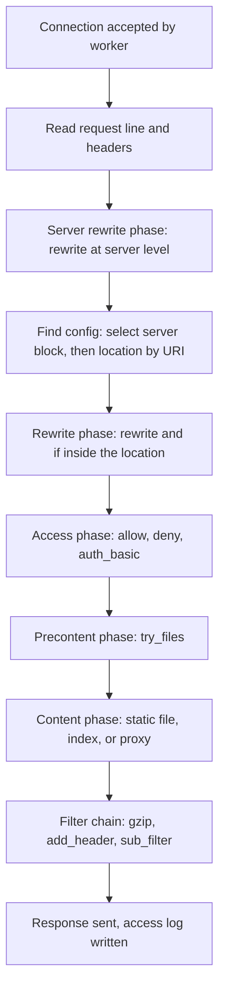

# Nginx Fundamentals

[**Nginx**](https://nginx.org/) (pronounced "engine-x") serves more of the internet's busiest sites than any other web server. It started as a solution to the C10K problem - handling ten thousand simultaneous connections on a single machine - and the architecture that solved that problem is still what makes it fast today.

This guide covers how Nginx works internally, how to install it, how its configuration language is structured, and how it turns an incoming HTTP request into a file on disk. Once you understand the request lifecycle, everything else Nginx does (proxying, load balancing, caching) is a variation on the same flow.

---

## Event-Driven Architecture

Most traditional web servers dedicate a thread or process to each connection. That model is easy to reason about, but every connection carries the memory cost of its own stack and every context switch costs CPU. Ten thousand idle keepalive connections mean ten thousand mostly-sleeping threads.

Nginx inverts the model. A small, fixed number of **worker processes** each run a single-threaded event loop. Instead of blocking on a slow client, a worker registers interest in the socket with the kernel (`epoll` on Linux, `kqueue` on BSD and macOS) and moves on to other work. When the kernel reports that a socket is readable or writable, the worker picks that connection back up.

| Model | Concurrency unit | Memory per connection | Behavior under 10k connections |
|-------|------------------|-----------------------|--------------------------------|
| Process-per-connection | OS process | ~1-4 MB | Memory exhaustion, heavy context switching |
| Thread-per-connection | OS thread | ~256 KB - 1 MB | Scheduler pressure, lock contention |
| Event-driven (Nginx) | Connection struct in an event loop | ~2-10 KB | Flat memory, near-constant CPU per request |

The practical consequence: Nginx memory usage scales with *active* work rather than with connection count. Slow mobile clients, long-polling requests, and keepalive connections are nearly free.

### Master and Worker Processes

Running Nginx starts two kinds of process.

- **Master process**: runs as `root`, binds the privileged ports (80 and 443), reads and validates configuration, and manages the worker pool. It handles no client traffic.
- **Worker processes**: drop to an unprivileged user (`www-data`, `nginx`, or `http` depending on the distribution) and do all request handling. Each worker accepts connections independently.

```bash
ps -eo pid,ppid,user,args | grep '[n]ginx'
```

```
   1201      1 root     nginx: master process /usr/sbin/nginx -g daemon on; master_process on;
   1202   1201 www-data nginx: worker process
   1203   1201 www-data nginx: worker process
   1204   1201 www-data nginx: worker process
   1205   1201 www-data nginx: worker process
```

This split is what makes a zero-downtime reload possible. On `nginx -s reload`, the master validates the new configuration, starts fresh workers with it, and tells the old workers to stop accepting new connections and exit once their in-flight requests finish. No connection is dropped and the listening socket is never closed.

!!! tip "Set worker_processes to auto"
    `worker_processes auto;` makes Nginx spawn one worker per CPU core, which is almost always the right number. More workers than cores does not increase throughput on an event-driven server; it just adds scheduler churn.

The theoretical connection ceiling is `worker_processes * worker_connections`. Check the value you actually have before doing that arithmetic: Nginx's compiled-in default is `512`, Debian and Ubuntu ship `768`, and the RHEL-family package ships `1024`. On an 8-core Ubuntu box that is 8 * 768 = 6144 simultaneous connections. Note that proxied requests consume two connections (one from the client, one to the upstream), so a pure reverse proxy halves that ceiling.

---

## Installing Nginx

Every major distribution ships an Nginx package, though often several releases behind. The official Nginx repositories track the current stable and mainline branches.

On Debian and Ubuntu:

```bash
sudo apt update
sudo apt install nginx

# Verify and start
nginx -v
sudo systemctl enable --now nginx
```

On RHEL, Rocky, and Alma:

```bash
sudo dnf install nginx
sudo systemctl enable --now nginx

# SELinux and firewalld are enabled by default on these distributions
sudo firewall-cmd --permanent --add-service=http --add-service=https
sudo firewall-cmd --reload
```

On macOS with Homebrew:

```bash
brew install nginx

# Homebrew installs an unprivileged config listening on port 8080
brew services start nginx
```

Package layouts differ in ways that matter later:

| Path | Debian / Ubuntu | RHEL family | Homebrew (Apple Silicon) |
|------|-----------------|-------------|--------------------------|
| Main config | `/etc/nginx/nginx.conf` | `/etc/nginx/nginx.conf` | `/opt/homebrew/etc/nginx/nginx.conf` |
| Virtual hosts | `sites-available/` + `sites-enabled/` | `conf.d/` | `servers/` |
| Default document root | `/var/www/html` | `/usr/share/nginx/html` | `/opt/homebrew/var/www` |
| Runtime user | `www-data` | `nginx` | current user |
| Logs | `/var/log/nginx/` | `/var/log/nginx/` | `/opt/homebrew/var/log/nginx/` |

Confirm the build before you rely on a module. `nginx -V` prints the compile-time flags, and a directive from a module that was not compiled in produces an `unknown directive` error at config-test time rather than at runtime.

```bash
nginx -V 2>&1 | tr ' ' '\n' | grep -- '--with'
```

!!! warning "The distribution package is not the same build as the official one"
    Distribution packages compile in a different module set than nginx.org's packages. `--with-http_realip_module` and `--with-http_stub_status_module` are common on distribution builds; `--with-http_geoip_module` and third-party modules usually are not. Check `nginx -V` on the machine you will actually deploy to.

---

## Configuration Syntax

An Nginx configuration file is a tree of **directives**. A directive is either simple (a name, arguments, and a semicolon) or a block (a name and a brace-enclosed set of nested directives). A block directive defines a **context**, and contexts nest.

```nginx
worker_processes auto;          # simple directive, main context

events {                        # block directive, opens the events context
    worker_connections 1024;
}
```

The contexts you will meet in this guide:

| Context | Opened by | Purpose |
|---------|-----------|---------|
| main | (the file itself) | Process-level settings: user, worker count, PID file, error log |
| `events` | `events { }` | Connection processing: worker connections, event method |
| `http` | `http { }` | Everything HTTP: MIME types, logging, compression, timeouts |
| `server` | `server { }` | One virtual host: which addresses and names it answers for |
| `location` | `location { }` | A URI path prefix or pattern within a virtual host |
| `upstream` | `upstream { }` | A named pool of backend servers |

Directives inherit downward. A directive set in `http` applies to every `server` inside it, and a `server` directive applies to every `location` inside that. Redefining a directive in a narrower context replaces the inherited value for that context only.

```nginx
http {
    gzip on;                    # applies everywhere below

    server {
        server_name example.com;
        # gzip is on here, inherited from http

        location /downloads/ {
            gzip off;           # overrides for this location only
        }
    }
}
```

One important exception: **array-valued directives do not merge across levels**. If a context defines `add_header` at all, it discards every `add_header` inherited from its parent instead of adding to the list. The same rule applies to `proxy_set_header`. Repeating the inherited headers in the child context is the standard workaround.

```code-walkthrough
title: "A Minimal nginx.conf"
description: "Every context and the directives that make a working static file server."
code: |
  user www-data;
  worker_processes auto;
  error_log /var/log/nginx/error.log warn;

  events {
      worker_connections 1024;
  }

  http {
      include       /etc/nginx/mime.types;
      default_type  application/octet-stream;
      sendfile      on;
      keepalive_timeout 65;
      access_log /var/log/nginx/access.log;

      server {
          listen 80 default_server;
          server_name example.com www.example.com;
          root /var/www/example;
          index index.html;

          location / {
              try_files $uri $uri/ =404;
          }
      }
  }
annotations:
  - line: 1
    text: "The user directive names the unprivileged account that worker processes run as. Only the master stays root. This account needs read access to your document root."
  - line: 2
    text: "One worker per CPU core. Nginx reads the core count at startup, so a machine resize takes effect on the next restart."
  - line: 3
    text: "Error log path and minimum severity. Levels run debug, info, notice, warn, error, crit, alert, emerg - each one includes everything more severe."
  - line: 5
    text: "The events context holds connection-processing settings. It is required even when empty."
  - line: 6
    text: "Maximum simultaneous connections per worker. The system-wide ceiling is this number times worker_processes, capped by the open file descriptor limit."
  - line: 9
    text: "The http context wraps all HTTP configuration. Directives here are the defaults for every virtual host below."
  - line: 10
    text: "mime.types maps file extensions to Content-Type headers. Without it, browsers receive every file as a download instead of rendering it."
  - line: 11
    text: "The fallback Content-Type for extensions not listed in mime.types. application/octet-stream tells the browser to download rather than render."
  - line: 12
    text: "sendfile on lets the kernel copy file data straight from the page cache to the socket, skipping a round trip through user space. It is the single biggest win for static file serving."
  - line: 13
    text: "How long an idle keepalive connection stays open, in seconds. Longer values reduce TCP handshakes; shorter values free worker connection slots sooner."
  - line: 16
    text: "server opens a virtual host. A single Nginx instance commonly runs dozens of these."
  - line: 17
    text: "listen sets the address and port. default_server makes this block handle any request whose Host header matches no other server_name on this port."
  - line: 18
    text: "server_name lists the hostnames this block answers for. Nginx matches the request's Host header against these values."
  - line: 19
    text: "root sets the filesystem directory that URIs resolve against. Declaring it at server level lets every location inherit it."
  - line: 20
    text: "index names the file to serve when the URI ends in a slash. Multiple filenames can be listed and are tried in order."
  - line: 22
    text: "location / matches every request that no more specific location claims first."
  - line: 23
    text: "try_files checks each argument in order and serves the first match. $uri is the file, $uri/ is the directory (which triggers index), and =404 is the fallback response if neither exists."
```

---

## The Request Processing Lifecycle

When a request arrives, Nginx runs it through a fixed sequence of phases. Understanding the order explains most configuration surprises, especially "why is my `if` block not doing what I expect" and "why did the wrong `location` win".



### Step 1: Server Block Selection

Nginx first narrows to the `server` blocks whose `listen` directive matches the connection's IP address and port. Among those, it compares the request's `Host` header against `server_name` in this order:

1. Exact match: `server_name example.com;`
2. Longest leading wildcard: `server_name *.example.com;`
3. Longest trailing wildcard: `server_name www.example.*;`
4. First matching regular expression, in file order: `server_name ~^www\d+\.example\.com$;`
5. The `default_server` block for that listen address, or the first `server` block if none is marked

A request with no matching `Host` header at all lands on the default server. This is why an unconfigured domain pointed at your IP address serves whichever site happens to be first.

### Step 2: Location Matching

Within the selected server block, Nginx picks exactly one `location` to handle the request. The matching rules are not "first match wins" or "longest match wins" - they are a specific hybrid.

| Modifier | Syntax | Matching behavior |
|----------|--------|-------------------|
| Exact | `location = /health` | Matches the URI exactly. Checked first; wins immediately. |
| Preferential prefix | `location ^~ /static/` | Prefix match that stops regex evaluation if it is the longest prefix match. |
| Regex (case-sensitive) | `location ~ \.php$` | Checked in file order after prefixes. First match wins. |
| Regex (case-insensitive) | `location ~* \.jpe?g$` | Same as above, ignoring case. |
| Plain prefix | `location /images/` | Longest prefix match. Used only if no regex matches. |

The full algorithm:

1. Check all exact (`=`) matches. On a hit, stop and use it.
2. Find the longest plain prefix match, and remember it.
3. If that longest prefix used `^~`, stop and use it.
4. Evaluate regex locations in the order they appear in the file. The first one that matches wins.
5. If no regex matched, use the remembered longest prefix match.

```nginx
server {
    listen 80;
    server_name example.com;
    root /var/www/example;

    location = / {
        # Only the bare "/" request. Not /about, not /index.html.
        return 200 "home\n";
    }

    location ^~ /assets/ {
        # Wins over the regex below, so /assets/logo.png is served as a
        # static file rather than being handed to the image handler.
        expires 30d;
    }

    location ~* \.(jpg|jpeg|png|gif|webp)$ {
        # Applies to images anywhere except under /assets/.
        expires 7d;
        access_log off;
    }

    location / {
        try_files $uri $uri/ =404;
    }
}
```

Given that configuration, `/assets/photo.jpg` matches `^~ /assets/` and gets a 30-day cache header; `/uploads/photo.jpg` falls through to the regex and gets 7 days.

!!! warning "Do not use if inside a location"
    The `if` directive runs during the rewrite phase, before content handlers are chosen, and its behavior inside a `location` block is genuinely undefined for anything except `return` and `rewrite ... last`. The [**`if`** directive reference](https://nginx.org/en/docs/http/ngx_http_rewrite_module.html#if) documents which cases are safe. Reach for `try_files`, `map`, or a more specific `location` instead.

---

## Serving Static Files

Static file serving is the content phase in its simplest form: map a URI to a path on disk, then hand the file to the kernel.

### root versus alias

These two directives both point a URI at the filesystem, and confusing them is the most common Nginx configuration bug.

`root` **appends** the full URI to the path. `alias` **replaces** the matched location prefix with the path.

```nginx
# Request: /static/css/site.css
# These two blocks are alternatives - defining both at once is a
# duplicate location error.

location /static/ {
    root /var/www;
    # Serves /var/www/static/css/site.css  (root + full URI)
}
```

```nginx
location /static/ {
    alias /var/www/assets/;
    # Serves /var/www/assets/css/site.css  (alias replaces "/static/")
}
```

Prefer `root` wherever the directory structure allows it. When you do need `alias`, keep the trailing slashes on both the location and the alias path consistent - a location ending in `/` paired with an alias that does not (or the reverse) produces paths with a missing or doubled separator.

### try_files

`try_files` is the workhorse of static serving. It takes a list of filesystem paths and tries each in order, serving the first that exists. The final argument is the fallback and is treated differently: a `=code` returns that status, and anything else is treated as an internal redirect to a new URI.

```nginx
# Static site: file, then directory index, then 404
location / {
    try_files $uri $uri/ =404;
}

# Single-page application: file, then directory, then hand everything
# else to index.html so the client-side router can handle it
location / {
    try_files $uri $uri/ /index.html;
}

# Versioned asset directory: file, then a 404 rather than a fallback page
location /assets/ {
    try_files $uri =404;
}
```

Serving pre-compressed files is a job for `gzip_static`, not `try_files`. A `try_files $uri.gz $uri;` list ignores the client's `Accept-Encoding` and never sets `Content-Encoding`, so a browser that did not ask for gzip receives compressed bytes labelled by the `.gz` extension and downloads a binary blob instead of rendering the stylesheet. `gzip_static` does the negotiation and the header for you.

```nginx
location /assets/ {
    gzip_static on;    # serves site.css.gz to clients that accept gzip
    try_files $uri =404;
}
```

The last argument is always the fallback, never a candidate to test. `try_files $uri $uri/;` does not check for a directory and then give up - it checks `$uri`, then internally redirects to `$uri/` regardless of whether that directory exists. For a missing path that redirect loops back into the same location and Nginx gives up with a 500 and `rewrite or internal redirection cycle` in the error log. Terminate the list with an explicit `=404` or a URI you know resolves.

### Directory Listings and Index Files

`index` names the file to serve for a URI ending in `/`. When no index file exists, Nginx returns 403 Forbidden unless `autoindex` is on, in which case it generates a directory listing.

```nginx
location /files/ {
    autoindex on;
    autoindex_exact_size off;   # human-readable sizes (4.2M not 4404019)
    autoindex_localtime on;     # server local time instead of UTC
}
```

Autoindex is useful for internal file drops and dangerous on public sites, because it exposes every filename in the directory including backups and editor swap files.

### Cache Headers and Compression

Static assets should carry cache headers, and text assets should be compressed.

```nginx
http {
    gzip on;
    gzip_vary on;
    gzip_min_length 1024;
    gzip_types text/plain text/css text/xml application/json
               application/javascript application/rss+xml image/svg+xml;

    server {
        listen 80;
        root /var/www/example;

        # Fingerprinted assets: cache forever
        location ~* \.[0-9a-f]{8}\.(css|js)$ {
            expires 1y;
            add_header Cache-Control "public, immutable";
            access_log off;
        }

        # Images: a week, revalidate after
        location ~* \.(jpg|jpeg|png|gif|webp|ico|svg)$ {
            expires 7d;
            add_header Cache-Control "public";
        }

        # HTML: always revalidate. expires -1 emits Cache-Control: no-cache
        # on its own, and add_header appends rather than replaces, so adding
        # one here would send the header twice.
        location ~* \.html$ {
            expires -1;
        }
    }
}
```

Note that `gzip_types` never needs `text/html` - it is always compressed when gzip is on, and listing it produces a warning. Already-compressed formats (JPEG, PNG, WebP, MP4, zip) should stay off the list; recompressing them burns CPU for no size reduction.

### Performance Directives

Three directives account for most of the throughput difference between a default configuration and a tuned one.

| Directive | Default | What it does |
|-----------|---------|--------------|
| `sendfile on;` | off | Kernel copies file data straight to the socket, bypassing user-space buffers |
| `tcp_nopush on;` | off | Batches response headers and the first chunk of the file into one packet. Requires `sendfile on` |
| `tcp_nodelay on;` | on | Disables Nagle's algorithm on keepalive connections so small responses are not delayed |

```nginx
http {
    sendfile on;
    tcp_nopush on;
    tcp_nodelay on;
    open_file_cache max=10000 inactive=30s;
    open_file_cache_valid 60s;
    open_file_cache_min_uses 2;
    open_file_cache_errors on;
}
```

`open_file_cache` keeps file descriptors, sizes, and modification times in memory so repeat requests skip the `open()` and `stat()` syscalls. On a site serving a few thousand distinct files, it measurably reduces per-request latency.

!!! danger "sendfile and network filesystems do not mix"
    `sendfile` bypasses the user-space buffer, so the kernel reads the file directly. On NFS and some FUSE mounts that path is unreliable: transfers can stall or return truncated responses, and modifying a file while it is being sent produces corrupt output because the buffer Nginx would normally hold no longer exists. Set `sendfile off;` for any location whose root is on a network mount.

---

## Testing, Reloading, and Signals

Never restart Nginx to pick up a configuration change, and never apply a change you have not tested. `nginx -t` parses the full configuration tree and reports the file and line number of any error.

```bash
sudo nginx -t
```

```
nginx: the configuration file /etc/nginx/nginx.conf syntax is ok
nginx: configuration file /etc/nginx/nginx.conf test is successful
```

Once it passes, reload. The master validates the config again, forks new workers, and retires the old ones as their requests complete.

```bash
sudo nginx -s reload
# or, equivalently, through the service manager:
sudo systemctl reload nginx
```

| Signal | Command | Effect |
|--------|---------|--------|
| `HUP` | `nginx -s reload` | Reload configuration with no dropped connections |
| `QUIT` | `nginx -s quit` | Graceful shutdown: finish in-flight requests, then exit |
| `TERM` | `nginx -s stop` | Immediate shutdown, in-flight requests are dropped |
| `USR1` | `nginx -s reopen` | Reopen log files. Used by logrotate after renaming them |
| `USR2` | `kill -USR2 $(cat /run/nginx.pid)` | Start a new master from the new binary for a live upgrade |

A reload that fails leaves the old workers running with the old configuration, so the site stays up. A `systemctl restart` on a broken config takes the site down. That difference is the whole reason to test-then-reload.

```command-builder
base: "nginx"
description: "Build an nginx command line for testing, inspecting, or signaling a running server."
options:
  - flag: "-c"
    type: text
    label: "Alternate config file"
    placeholder: "/etc/nginx/staging.conf"
    explanation: "Use a configuration file other than the compiled-in default. Handy for validating a candidate config before installing it."
  - flag: "-p"
    type: text
    label: "Prefix directory"
    placeholder: "/opt/nginx"
    explanation: "Override the prefix that relative paths in the configuration resolve against."
  - flag: ""
    type: select
    label: "Action"
    choices:
      - ["-t", "Test configuration syntax"]
      - ["-T", "Test and dump the full merged config"]
      - ["-s reload", "Reload configuration (zero downtime)"]
      - ["-s reopen", "Reopen log files"]
      - ["-s quit", "Graceful shutdown"]
      - ["-s stop", "Immediate shutdown"]
      - ["-v", "Print version"]
      - ["-V", "Print version and compile-time flags"]
    explanation: "The operation to perform. Signal actions (-s) are sent to the running master process via its PID file."
```

`nginx -T` is the one to reach for when a directive is not behaving. It prints every configuration file after all `include` directives are resolved, which makes it obvious when a stale file in `conf.d/` is overriding what you just edited.

---

## Reading the Logs

Nginx writes two logs. The **access log** records one line per completed request; the **error log** records everything Nginx itself has to say.

The default access log format is `combined`:

```
203.0.113.42 - - [14/Sep/2027:09:31:07 +0000] "GET /assets/site.css HTTP/1.1" 200 4821 "https://example.com/" "Mozilla/5.0 (X11; Linux x86_64)"
```

Custom formats are defined in the `http` context with `log_format` and referenced by name. Adding request timing is worth doing on day one, because without it you cannot tell a slow backend from a slow client.

```nginx
http {
    log_format timed '$remote_addr - $remote_user [$time_local] '
                     '"$request" $status $body_bytes_sent '
                     '"$http_referer" "$http_user_agent" '
                     'rt=$request_time uct=$upstream_connect_time '
                     'urt=$upstream_response_time';

    access_log /var/log/nginx/access.log timed;
}
```

Error log entries carry a severity and, for request-scoped problems, the client and the resolved filesystem path:

```
2027/09/14 09:31:22 [error] 1202#1202: *4821 open() "/var/www/example/missing.css" failed (2: No such file or directory), client: 203.0.113.42, server: example.com, request: "GET /missing.css HTTP/1.1", host: "example.com"
```

That single line gives you the exact path Nginx tried to open, which resolves nearly every `root` versus `alias` mistake immediately.

!!! tip "Raise the error log level temporarily, not permanently"
    `error_log /var/log/nginx/error.log debug;` is invaluable for diagnosing location matching and rewrite behavior, and it will fill a disk on a busy server. Scope it to one `server` block while debugging and put it back to `warn` afterwards.

---

## Putting It All Together

```terminal
scenario: "Install Nginx and serve a static site on a fresh Ubuntu server"
steps:
  - command: "sudo apt update && sudo apt install -y nginx"
    output: "Setting up nginx (1.24.0-2ubuntu7) ...\nCreated symlink /etc/systemd/system/multi-user.target.wants/nginx.service -> /lib/systemd/system/nginx.service."
    narration: "The package installs Nginx and enables the service so it survives reboots. It runs as www-data, which already exists on a Debian or Ubuntu system as part of the base install."
  - command: "nginx -v"
    output: "nginx version: nginx/1.24.0 (Ubuntu)"
    narration: "Confirm the version. Distribution builds lag the mainline branch, which matters if you need a recently added directive."
  - command: "ps -eo pid,ppid,user,args | grep '[n]ginx'"
    output: "   1201      1 root     nginx: master process /usr/sbin/nginx -g daemon on; master_process on;\n   1202   1201 www-data nginx: worker process\n   1203   1201 www-data nginx: worker process"
    narration: "One root master and one worker per CPU core. Only the master keeps root privileges, and only to bind port 80."
  - command: "sudo mkdir -p /var/www/example && echo '<h1>It works</h1>' | sudo tee /var/www/example/index.html"
    output: "<h1>It works</h1>"
    narration: "Create a document root with a single page. The www-data user needs read access on this directory and every parent of it."
  - command: "sudo tee /etc/nginx/sites-available/example.com >/dev/null <<'CONF'\nserver {\n    listen 80;\n    server_name example.com www.example.com;\n    root /var/www/example;\n    index index.html;\n\n    location / {\n        try_files $uri $uri/ =404;\n    }\n}\nCONF"
    output: ""
    narration: "Write the virtual host. try_files serves the file if it exists, falls back to a directory index, then returns 404 rather than an internal error."
  - command: "sudo ln -s /etc/nginx/sites-available/example.com /etc/nginx/sites-enabled/"
    output: ""
    narration: "The symlink into sites-enabled is what activates the host. Removing the link disables the site without deleting the config."
  - command: "sudo nginx -t"
    output: "nginx: the configuration file /etc/nginx/nginx.conf syntax is ok\nnginx: configuration file /etc/nginx/nginx.conf test is successful"
    narration: "Always test before reloading. A failed test costs nothing; a failed restart takes the site offline."
  - command: "sudo nginx -s reload"
    output: ""
    narration: "The master forks workers with the new config and retires the old ones once their in-flight requests finish. No connection is dropped."
  - command: "curl -s -H 'Host: example.com' -i http://localhost/"
    output: "HTTP/1.1 200 OK\nServer: nginx/1.24.0 (Ubuntu)\nContent-Type: text/html\nContent-Length: 18\nConnection: keep-alive\n\n<h1>It works</h1>"
    narration: "Sending an explicit Host header selects the new server block without needing DNS. Content-Type comes from mime.types matching the .html extension."
  - command: "curl -s -o /dev/null -w '%{http_code}\\n' -H 'Host: example.com' http://localhost/nope.html"
    output: "404"
    narration: "The =404 fallback in try_files returns a clean not-found instead of the redirect-cycle 500 that a list ending in $uri/ would produce."
  - command: "sudo tail -2 /var/log/nginx/access.log"
    output: "127.0.0.1 - - [14/Sep/2027:09:31:07 +0000] \"GET / HTTP/1.1\" 200 18 \"-\" \"curl/8.5.0\"\n127.0.0.1 - - [14/Sep/2027:09:31:12 +0000] \"GET /nope.html HTTP/1.1\" 404 162 \"-\" \"curl/8.5.0\""
    narration: "Both requests are logged in combined format: client, timestamp, request line, status, bytes sent, referer, and user agent."
```

---

## Interactive Quizzes

```quiz
question: "Why does Nginx handle 10,000 idle keepalive connections with far less memory than a thread-per-connection server?"
type: multiple-choice
options:
  - text: "It closes idle connections immediately instead of keeping them open."
    feedback: "Nginx keeps keepalive connections open for keepalive_timeout seconds. The efficiency comes from how it tracks them, not from closing them early."
  - text: "Each worker runs an event loop and tracks connections as small structs, rather than dedicating a thread or process to each one."
    correct: true
    feedback: "Correct! A connection costs a few kilobytes in an event loop instead of a full thread stack. The kernel notifies the worker when a socket is ready, so idle connections consume no CPU at all."
  - text: "It spawns one worker process per connection but keeps each one very small."
    feedback: "That is the process-per-connection model Nginx was designed to avoid. Nginx runs a fixed pool, typically one worker per CPU core."
  - text: "It stores connection state on disk instead of in memory."
    feedback: "Connection state stays in memory. Touching disk per connection would be far slower than the thread-based model."
```

```quiz
question: "A request for /assets/logo.png arrives at a server that has both `location ^~ /assets/` and `location ~* \\.png$`. Which one handles it?"
type: multiple-choice
options:
  - text: "The regex location, because regex always beats prefix matching."
    feedback: "Regex beats a plain prefix match, but ^~ specifically tells Nginx to stop before evaluating regex locations."
  - text: "The ^~ prefix location, because ^~ stops regex evaluation when it is the longest prefix match."
    correct: true
    feedback: "Correct! The ^~ modifier means 'if this is the longest prefix match, use it and do not consider regex locations at all'. Without ^~, the regex would win."
  - text: "Whichever appears first in the configuration file."
    feedback: "File order decides ties between regex locations only. Prefix matching is evaluated by length and modifier, independent of position."
  - text: "Neither. Overlapping locations cause a configuration test failure."
    feedback: "Overlapping locations are normal and valid. Nginx has a defined precedence order to resolve them."
```

```quiz
question: "With `location /static/ { alias /var/www/assets/; }`, which file does a request for /static/css/site.css serve?"
type: multiple-choice
options:
  - text: "/var/www/assets/static/css/site.css"
    feedback: "That is how root behaves - it appends the whole URI. alias replaces the matched location prefix instead."
  - text: "/var/www/assets/css/site.css"
    correct: true
    feedback: "Correct! alias substitutes the location prefix (/static/) with the alias path, so only the remainder of the URI (css/site.css) is appended."
  - text: "/static/css/site.css"
    feedback: "The URI is never used as a filesystem path directly. Either root or alias maps it onto disk."
  - text: "/var/www/assets/site.css"
    feedback: "The full remainder of the URI after the location prefix is preserved, including intermediate directories."
```

```quiz
question: "You edited a config file and want the change live without dropping requests. What is the correct sequence?"
type: multiple-choice
options:
  - text: "sudo systemctl restart nginx"
    feedback: "A restart stops the master and all workers, dropping in-flight requests. If the new config is broken, the service fails to come back up."
  - text: "sudo nginx -t, then sudo nginx -s reload"
    correct: true
    feedback: "Correct! The test catches syntax errors before they matter, and the reload starts new workers while old ones finish their in-flight requests. If a reload's config check fails, the old workers keep serving."
  - text: "sudo nginx -s stop, then sudo nginx"
    feedback: "This works but takes the site down between the two commands, and skips the syntax check entirely."
  - text: "sudo kill -9 $(cat /run/nginx.pid)"
    feedback: "SIGKILL cannot be caught, so the master dies without shutting down workers cleanly and every in-flight request is dropped."
```

---

```exercise
title: "Serve a Static Site With Cache Rules"
difficulty: beginner
scenario: |
  You are configuring Nginx on a fresh Ubuntu server to host a static marketing site out of `/var/www/promo`. The build produces fingerprinted asset filenames like `app.4f3a91c2.css`.

  Your tasks:

  1. Write a virtual host in `/etc/nginx/sites-available/promo.conf` that listens on port 80 and answers for `promo.example.com`
  2. Serve files from `/var/www/promo` with `index.html` as the directory index
  3. Return a clean 404 (not a 500) for URIs that match no file
  4. Give fingerprinted `.css` and `.js` files a one-year immutable cache header and stop logging them
  5. Give images a seven-day cache header
  6. Make sure HTML is always revalidated by the browser
  7. Confirm the three static-serving performance directives are on in the `http` context, without introducing a duplicate directive error
  8. Activate the site and apply it without dropping any connections
hints:
  - "A fingerprint is eight hex characters between the name and the extension: use a case-insensitive regex location anchored with $"
  - "Order matters: the regex for fingerprinted assets must appear before any broader regex that would also match .css or .js"
  - "try_files takes a final =404 argument to control the fallback status"
  - "The performance directives are sendfile, tcp_nopush, and tcp_nodelay - the last two only help when the first is on"
  - "Check the stock /etc/nginx/nginx.conf before adding anything: Ubuntu already sets some of these in the http context, and setting a flag directive twice in the same context is an nginx -t error"
  - "Activation on Debian and Ubuntu means a symlink from sites-available into sites-enabled"
solution: |
  # Ubuntu's stock /etc/nginx/nginx.conf already has these in the http
  # context, and conf.d/*.conf is included from that same context - so a
  # new file repeating them fails with:
  #   nginx: [emerg] "sendfile" directive is duplicate
  # Edit the existing lines in nginx.conf instead of adding a file:
  #
  #   sendfile on;      # already present, leave it
  #   tcp_nopush on;    # already present, leave it
  #   tcp_nodelay on;   # already present, leave it

  # /etc/nginx/sites-available/promo.conf
  server {
      listen 80;
      server_name promo.example.com;

      root /var/www/promo;
      index index.html;

      # Fingerprinted assets never change content, so cache them forever
      location ~* \.[0-9a-f]{8}\.(css|js)$ {
          expires 1y;
          add_header Cache-Control "public, immutable";
          access_log off;
      }

      # Images: a week
      location ~* \.(jpg|jpeg|png|gif|webp|svg|ico)$ {
          expires 7d;
          add_header Cache-Control "public";
      }

      # HTML must revalidate so deploys are picked up immediately.
      # expires -1 sends Cache-Control: no-cache by itself.
      location ~* \.html$ {
          expires -1;
      }

      location / {
          try_files $uri $uri/ =404;
      }
  }

  # Activate and apply
  # sudo ln -s /etc/nginx/sites-available/promo.conf /etc/nginx/sites-enabled/
  # sudo nginx -t
  # sudo nginx -s reload
```

---

## Further Reading

- [Nginx Documentation](https://nginx.org/en/docs/) - official reference for every directive, module, and variable
- [Beginner's Guide](https://nginx.org/en/docs/beginners_guide.html) - the upstream introduction to configuration structure and static serving
- [Inside NGINX: How We Designed for Performance and Scale](https://blog.nginx.org/blog/inside-nginx-how-we-designed-for-performance-scale) - detailed walkthrough of the process model and event loop
- [NGINXConfig by DigitalOcean](https://www.digitalocean.com/community/tools/nginx) - generates a starting configuration from a set of questions
- [Nginx Admin's Handbook](https://github.com/trimstray/nginx-admins-handbook) - community-maintained reference covering tuning and hardening

---

**Next:** [Nginx Configuration](configuration.md) | [Back to Index](README.md)
