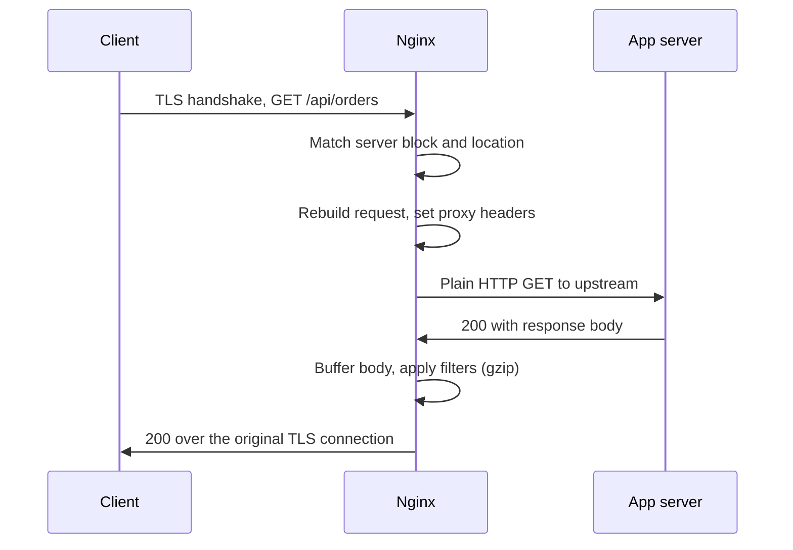

# Nginx Reverse Proxy and Load Balancing

A reverse proxy accepts requests on behalf of servers that sit behind it. Nginx terminates TLS, serves static assets from disk, and forwards what remains to an application process that never talks to the internet directly. Add more than one of those application processes and the same configuration becomes a load balancer.

The [Nginx Configuration](configuration.md) guide introduces `proxy_pass` and `upstream`. This one covers what goes wrong in production: URI rewriting surprises, forwarded headers the backend cannot trust, buffering that breaks streaming responses, and failover behavior that quietly retries a payment twice.

---

## What a Reverse Proxy Actually Does

Nginx does not forward the client's TCP connection. It terminates the client connection, builds a **new** HTTP request, and opens its own connection to the backend. Everything about the original request that the backend needs to know has to be copied across deliberately.



Two consequences follow from that rebuild, and most reverse proxy bugs trace back to one of them:

- The backend sees Nginx's IP address as the client, and the connection as plain HTTP, unless you tell it otherwise.
- The URI the backend receives is not necessarily the URI the client requested.

---

## proxy_pass and the Trailing Slash

`proxy_pass` takes an address, optionally followed by a URI. Whether that URI is present changes how Nginx builds the request path, and the difference is a single character.

**Without a URI part**, the full client request URI is passed through unchanged:

```nginx
location /api/ {
    proxy_pass http://127.0.0.1:8080;
}
# Client requests /api/orders  ->  backend receives /api/orders
```

**With a URI part** (even just `/`), Nginx replaces the part of the URI that matched the location with that URI:

```nginx
location /api/ {
    proxy_pass http://127.0.0.1:8080/;
}
# Client requests /api/orders  ->  backend receives /orders
```

The replacement is literal string substitution, which produces doubled or missing slashes when the two sides disagree:

| Location | proxy_pass | Client requests | Backend receives |
|----------|-----------|-----------------|------------------|
| `/api/` | `http://backend` | `/api/orders` | `/api/orders` |
| `/api/` | `http://backend/` | `/api/orders` | `/orders` |
| `/api/` | `http://backend/v2/` | `/api/orders` | `/v2/orders` |
| `/api` | `http://backend/` | `/api/orders` | `//orders` |
| `/api/` | `http://backend/v2` | `/api/orders` | `/v2orders` |

Keep the trailing slashes matched on both sides or on neither side. The last two rows are the ones that reach production and produce a confusing 404 from the application framework rather than from Nginx.

!!! warning "proxy_pass takes no static URI part inside a regex location"
    A regex location has no matched prefix to substitute, so `proxy_pass http://backend/v2/;` inside `location ~ ^/api/(.*)` is a configuration error. The documented form is `proxy_pass http://backend;` with no URI at all, which forwards the request URI unchanged. When you need to rewrite it, build the URI from a capture: `proxy_pass http://backend/$1;`. The same restriction on static URI parts applies inside named locations, `if` blocks, and `limit_except`.

### Variables in proxy_pass

Using a variable in the address changes Nginx's behavior in ways that are easy to miss. The address is evaluated per request rather than at startup, so when it resolves to a **hostname** Nginx needs a `resolver` directive to look it up, and a lookup failure produces a 502 at request time instead of a config error at reload. (A variable that holds a literal IP address or the name of an `upstream` block needs no resolver.)

```nginx
resolver 127.0.0.11 valid=30s ipv6=off;   # Docker's embedded DNS

location /api/ {
    set $upstream_host api.internal;
    proxy_pass http://$upstream_host:8080;
}
```

The upside is that Nginx will pick up a changed DNS record without a reload, which matters in container environments where backend addresses move. The downside is that the URI is no longer normalized before being forwarded, and an unresolvable name takes the location down rather than failing the config test.

---

## Forwarded Headers

By default the backend sees a request that appears to originate from Nginx over plain HTTP. Four headers fix that, and each has a failure mode.

```nginx
location / {
    proxy_pass http://backend;

    proxy_set_header Host              $host;
    proxy_set_header X-Real-IP         $remote_addr;
    proxy_set_header X-Forwarded-For   $proxy_add_x_forwarded_for;
    proxy_set_header X-Forwarded-Proto $scheme;
}
```

| Header | Value | Why |
|--------|-------|-----|
| `Host` | `$host` | The hostname the client asked for. Frameworks use it to generate absolute URLs and to route multi-tenant requests. Without it the backend sees the upstream address. |
| `X-Real-IP` | `$remote_addr` | The immediate peer's address, as a single value. |
| `X-Forwarded-For` | `$proxy_add_x_forwarded_for` | Appends `$remote_addr` to any inbound `X-Forwarded-For`, building a chain. |
| `X-Forwarded-Proto` | `$scheme` | `http` or `https`. Without it a TLS-terminating proxy makes the app generate `http://` links and redirect loops. |

`$host` and `$http_host` are not interchangeable. `$http_host` is the raw `Host` header, including any port and absent entirely if the client sent none. `$host` is the header lowercased with the port stripped, falling back to the matched `server_name` when there is no header at all. Prefer `$host` unless the backend genuinely needs the port.

!!! danger "X-Forwarded-For is attacker-controlled unless you strip it"
    `$proxy_add_x_forwarded_for` **appends** to whatever the client sent. A client that sends `X-Forwarded-For: 127.0.0.1` gets that value preserved at the front of the chain, so a backend that reads the first entry as "the real client" can be trivially spoofed into believing a request came from localhost. If Nginx is your outermost proxy, overwrite instead of appending with `proxy_set_header X-Forwarded-For $remote_addr;`. If Nginx sits behind a CDN or another load balancer, use the `realip` module to define which upstream proxies you trust.

```nginx
# Nginx sits behind a trusted load balancer at 10.0.0.0/8
set_real_ip_from 10.0.0.0/8;
real_ip_header X-Forwarded-For;
real_ip_recursive on;
# $remote_addr is now the real client, and the trusted hops are stripped
```

### The Inheritance Trap

`proxy_set_header` is one of the array-valued directives that **replaces** rather than merges. Defining a single `proxy_set_header` inside a `location` discards every one inherited from the enclosing `server` or `http` block.

```nginx
server {
    proxy_set_header Host $host;
    proxy_set_header X-Real-IP $remote_addr;

    location /api/ {
        proxy_pass http://backend;
        proxy_set_header X-Api-Version 2;
        # Host and X-Real-IP are NOT sent here - this one directive
        # replaced the whole inherited set
    }
}
```

Put the common headers in a snippet and `include` it in every location that adds its own:

```nginx
# /etc/nginx/snippets/proxy-headers.conf
proxy_set_header Host              $host;
proxy_set_header X-Real-IP         $remote_addr;
proxy_set_header X-Forwarded-For   $proxy_add_x_forwarded_for;
proxy_set_header X-Forwarded-Proto $scheme;
```

```nginx
location /api/ {
    proxy_pass http://backend;
    include snippets/proxy-headers.conf;
    proxy_set_header X-Api-Version 2;
}
```

---

## Upstream Blocks

An `upstream` block names a pool of backends that `proxy_pass` can target by name.

```nginx
upstream api_backend {
    zone api_backend 64k;
    least_conn;

    server 10.0.0.11:8080 weight=3 max_fails=2 fail_timeout=15s;
    server 10.0.0.12:8080 max_fails=2 fail_timeout=15s;
    server 10.0.0.13:8080 backup;

    keepalive 32;
}
```

### Server Parameters

| Parameter | Default | Effect |
|-----------|---------|--------|
| `weight=n` | `1` | Relative share of requests. `weight=3` receives three times the traffic of a `weight=1` peer. |
| `max_fails=n` | `1` | Failed attempts within `fail_timeout` before the server is considered unavailable. `max_fails=0` disables the check entirely. |
| `fail_timeout=time` | `10s` | Both the window in which failures are counted and how long the server stays out of rotation. |
| `backup` | off | Receives traffic only when every non-backup server is unavailable. |
| `down` | off | Marks a server as permanently unavailable. Useful for draining a node before maintenance. |
| `max_conns=n` | `0` (unlimited) | Caps simultaneous active connections to that server. |

### The zone Directive

Without `zone`, each worker process keeps its own private copy of the load balancing state and failure counters. With eight workers, a backend has to fail `max_fails` times *per worker* before it is fully out of rotation, and `least_conn` balances against connection counts that only one worker can see.

`zone` puts that state in shared memory so all workers agree. It has been available in open source Nginx since 1.9.0 and costs a few kilobytes. Use it on any upstream with more than one server.

---

## Load Balancing Algorithms

```nginx
upstream backend {
    least_conn;                 # the method goes before the server list
    server 10.0.0.11:8080;
    server 10.0.0.12:8080;
}
```

| Method | Directive | Behavior and when to use it |
|--------|-----------|------------------------------|
| Round robin | (default, no directive) | Requests distributed in order, respecting `weight`. Correct default when backends are identical and requests cost about the same. |
| Least connections | `least_conn` | Sends to the peer with the fewest active connections. Better when request durations vary widely, for example a mix of fast reads and slow report generation. |
| IP hash | `ip_hash` | Hashes the client address so a given client always reaches the same peer. Session persistence without shared session storage. |
| Generic hash | `hash $request_uri consistent` | Hashes an arbitrary key. With `consistent`, uses ketama hashing so adding a peer remaps only a fraction of keys. Good for cache-node affinity. |
| Random | `random two least_conn` | Picks two peers at random and sends to the better of the two. Behaves well across multiple load balancers that cannot see each other's connection counts. |

`ip_hash` uses the first three octets of an IPv4 address (so a `/24` of clients lands on one peer) and the whole address for IPv6. Two caveats matter in practice: adding or removing a server rehashes most clients and scatters their sessions, and every client behind one corporate NAT gateway lands on the same backend. Real session storage in Redis or the database is a better answer than IP affinity wherever you can manage it.

!!! tip "Several familiar directives are commercial-only"
    `sticky` cookie persistence, `least_time`, `queue`, `slow_start`, and the active `health_check` directive are [NGINX Plus](https://docs.nginx.com/nginx/admin-guide/load-balancer/http-load-balancer/) features. They will fail `nginx -t` with `unknown directive` on open source builds. Everything else in this guide works on the open source release.

---

## Health Checks and Failover

Open source Nginx does **passive** health checking. It does not poll backends on a timer; it observes real requests and takes a peer out of rotation after `max_fails` failures within `fail_timeout`.

```nginx
upstream backend {
    zone backend 64k;
    server 10.0.0.11:8080 max_fails=3 fail_timeout=30s;
    server 10.0.0.12:8080 max_fails=3 fail_timeout=30s;
}
```

After 3 failures inside 30 seconds, that peer is skipped for 30 seconds, then a single request is allowed through to probe it. If that request succeeds the peer returns to the pool; if it fails the timer restarts.

What counts as a failure is defined by `proxy_next_upstream`, which does double duty: it decides both when to retry the current request on another peer and what increments the failure counter.

```nginx
location / {
    proxy_pass http://backend;
    proxy_next_upstream error timeout http_502 http_503 http_504;
    proxy_next_upstream_tries 2;
    proxy_next_upstream_timeout 10s;
}
```

| Value | Meaning |
|-------|---------|
| `error` | Connection failure, or a failure while sending the request or reading the response header. Default. |
| `timeout` | A connect, send, or read timeout was reached. Default. |
| `invalid_header` | The backend returned a malformed or empty response. |
| `http_502` / `http_503` / `http_504` | Treat those status codes as failures worth retrying. |
| `http_500` / `http_403` / `http_404` | Retry on these too. Rarely a good idea - a 404 is usually a correct answer, not a sick backend. |
| `non_idempotent` | Also retry POST, LOCK, and PATCH. Off by default, deliberately. |
| `off` | Never retry. |

!!! danger "Do not add non_idempotent without an idempotency key"
    Retries default to GET, HEAD, PUT, DELETE, and OPTIONS because those are safe to repeat. Adding `non_idempotent` lets Nginx replay a POST on a second backend when the first times out - and a timeout does not mean the first backend failed to process it. The classic outcome is a duplicate charge or a duplicate order. Only enable it if the backend deduplicates on an idempotency key.

Always bound the retries. `proxy_next_upstream_tries 0` (the default) means "try every peer in the pool", so one slow request can burn `proxy_connect_timeout` against every backend in turn before answering the client.

---

## Upstream Keepalive

By default Nginx opens a new TCP connection to the backend for every request and closes it afterwards. Under load that is a measurable amount of handshake overhead and a steady supply of sockets in `TIME_WAIT`.

The `keepalive` directive maintains a cache of idle connections per worker. It needs two companion directives in the location, and omitting them silently disables the benefit.

```nginx
upstream backend {
    zone backend 64k;
    server 10.0.0.11:8080;
    server 10.0.0.12:8080;

    keepalive 32;              # idle connections cached per worker
    keepalive_timeout 60s;     # how long an idle connection is kept
    keepalive_requests 1000;   # requests before the connection is recycled
}

server {
    location / {
        proxy_pass http://backend;
        proxy_http_version 1.1;        # keepalive requires HTTP/1.1
        proxy_set_header Connection "";  # clear the inherited "close"
        include snippets/proxy-headers.conf;
    }
}
```

`proxy_http_version 1.1;` matters because HTTP/1.0 has no persistent connections. Nginx used 1.0 for proxying by default until 1.29.7, which changed the default to 1.1. Distribution packages lag mainline by a long way, so set it explicitly rather than assuming the build in front of you has the newer default. `proxy_set_header Connection "";` is required because Nginx otherwise forwards a `Connection: close` header that tells the backend to hang up after one response.

The `keepalive` number is idle connections *per worker*, not a total or a limit on concurrency. With 8 workers and `keepalive 32` you may hold up to 256 idle upstream connections, so the backend's own connection limit needs headroom above that.

---

## WebSocket and Streaming Proxying

A WebSocket handshake is an HTTP request carrying `Upgrade: websocket` and `Connection: Upgrade`. Nginx will not forward hop-by-hop headers unless told to, so the upgrade has to be reconstructed.

The naive version hardcodes the header:

```nginx
proxy_set_header Connection "upgrade";   # breaks plain requests
```

That sends `Connection: upgrade` on *every* request through the location, including ordinary REST calls that never asked to upgrade, which confuses some backends and defeats upstream keepalive. The correct pattern maps the header so it is only set when the client actually requested an upgrade:

```nginx
# http context, defined once
map $http_upgrade $connection_upgrade {
    default upgrade;
    ''      close;
}

server {
    location /ws/ {
        proxy_pass http://backend;

        proxy_http_version 1.1;
        proxy_set_header Upgrade    $http_upgrade;
        proxy_set_header Connection $connection_upgrade;
        include snippets/proxy-headers.conf;

        proxy_read_timeout 3600s;   # a quiet socket is not a dead socket
        proxy_send_timeout 3600s;
    }
}
```

`proxy_read_timeout` defaults to 60 seconds and applies *between* reads, not to the connection's total lifetime. A WebSocket that sits idle for longer than that is closed by Nginx, which the client experiences as a random disconnect. Either raise the timeout or have the application send periodic pings.

### Server-Sent Events and Streaming

Nginx buffers responses by default: it reads the backend's response as fast as the backend can produce it, stores it, and feeds it to the client at whatever rate the client can accept. That protects the backend from slow clients and is the right default for normal responses.

It is exactly wrong for streaming. With buffering on, a server-sent events endpoint or a streamed LLM response accumulates in Nginx's buffers and arrives at the client in chunks, or not until the response ends.

```nginx
location /events/ {
    proxy_pass http://backend;
    proxy_http_version 1.1;
    proxy_set_header Connection "";

    proxy_buffering off;        # forward each chunk as it arrives
    proxy_cache off;
    proxy_read_timeout 24h;
}
```

| Directive | Default | What to know |
|-----------|---------|--------------|
| `proxy_buffering` | `on` | Off means chunks stream through immediately, at the cost of holding a backend connection open for slow clients. |
| `proxy_buffer_size` | `4k` or `8k` | Buffer for the response *header* only. Raise it when a backend sends large cookies and you see `upstream sent too big header`. |
| `proxy_buffers` | `8 4k` or `8 8k` | Count and size of body buffers per connection. |
| `proxy_busy_buffers_size` | `8k` or `16k` | How much buffered data can be sent to the client while the rest is still being read. |
| `proxy_max_temp_file_size` | `1024m` | Responses larger than the buffers spill to disk. Set to `0` to disable spooling and force streaming. |

A backend can also opt out per response by sending `X-Accel-Buffering: no`, which is the cleanest option when only some endpoints stream.

```code-walkthrough
title: "A Production Reverse Proxy Configuration"
description: "An upstream pool with failover, keepalive, and a separate WebSocket location."
code: |
  upstream api_backend {
      zone api_backend 64k;
      least_conn;

      server 10.0.0.11:8080 weight=3 max_fails=2 fail_timeout=15s;
      server 10.0.0.12:8080 max_fails=2 fail_timeout=15s;
      server 10.0.0.13:8080 backup;

      keepalive 32;
  }

  map $http_upgrade $connection_upgrade {
      default upgrade;
      ''      close;
  }

  server {
      listen 443 ssl;
      server_name api.example.com;

      location / {
          proxy_pass http://api_backend;

          proxy_http_version 1.1;
          proxy_set_header Connection "";

          proxy_set_header Host              $host;
          proxy_set_header X-Real-IP         $remote_addr;
          proxy_set_header X-Forwarded-For   $proxy_add_x_forwarded_for;
          proxy_set_header X-Forwarded-Proto $scheme;

          proxy_connect_timeout 5s;
          proxy_send_timeout    60s;
          proxy_read_timeout    60s;

          proxy_next_upstream error timeout http_502 http_503;
          proxy_next_upstream_tries 2;
      }

      location /ws/ {
          proxy_pass http://api_backend;
          proxy_http_version 1.1;
          proxy_set_header Upgrade    $http_upgrade;
          proxy_set_header Connection $connection_upgrade;
          proxy_read_timeout 3600s;
      }
  }
annotations:
  - line: 1
    text: "The upstream name becomes the host in proxy_pass. It is resolved at config load, so a typo is caught by nginx -t rather than at request time."
  - line: 2
    text: "zone puts load balancing state and failure counters in shared memory so all workers agree on which peers are down. Without it each worker tracks failures independently."
  - line: 3
    text: "The balancing method goes before the server list. least_conn suits backends whose request durations vary."
  - line: 5
    text: "weight=3 gives this peer three times the share of a weight=1 peer. max_fails and fail_timeout define the passive health check: 2 failures within 15 seconds takes it out for 15 seconds."
  - line: 6
    text: "A peer with no weight defaults to 1. Health check parameters are per-server, so they can differ across the pool."
  - line: 7
    text: "backup receives no traffic until every non-backup peer is unavailable. It is a capacity reserve, not part of normal rotation."
  - line: 9
    text: "Cache of idle connections to this upstream, per worker process. Requires the two directives at lines 24 and 25 to have any effect."
  - line: 12
    text: "map defines a variable computed from another variable. It belongs in the http context, and it is evaluated lazily only where the variable is used."
  - line: 14
    text: "When the client sent no Upgrade header, $connection_upgrade becomes 'close' instead of 'upgrade' - so ordinary requests are not told to upgrade."
  - line: 22
    text: "proxy_pass with no URI part passes the client's URI through unchanged. Adding even a trailing slash would strip the matched location prefix."
  - line: 24
    text: "HTTP/1.0 has no persistent connections, and Nginx proxied with 1.0 by default until 1.29.7 changed it to 1.1. Set it explicitly, because distribution packages lag well behind that release."
  - line: 25
    text: "Clears the Connection header Nginx would otherwise forward as 'close', which would make the backend hang up after each response and defeat the keepalive cache."
  - line: 27
    text: "$host is the requested hostname with the port stripped, falling back to server_name. Without this the backend sees the upstream address as its Host."
  - line: 29
    text: "$proxy_add_x_forwarded_for appends the peer address to any inbound X-Forwarded-For. Safe only when a trusted proxy sits in front; as the outermost proxy, set $remote_addr instead."
  - line: 32
    text: "How long to wait to establish a TCP connection to a backend. Keep it short - a peer that is down should fail fast so the retry can proceed."
  - line: 36
    text: "Which conditions justify retrying on the next peer, and which increment the failure counter. Note that POST is not retried unless non_idempotent is added."
  - line: 37
    text: "Bounds the retries. The default of 0 means 'try every peer', so a single request can wait out a connect timeout against the whole pool."
  - line: 41
    text: "The WebSocket location targets the same pool. Session affinity is not needed because the connection stays pinned to one peer once established."
  - line: 44
    text: "The mapped value, not a hardcoded 'upgrade'. This is what keeps the same upstream usable for both WebSocket and plain HTTP traffic."
  - line: 45
    text: "proxy_read_timeout applies between reads, not to total duration. The 60 second default disconnects any WebSocket idle for a minute."
```

---

## Debugging a Proxy

The upstream variables belong in your log format from day one. Without them you cannot distinguish a slow backend from a slow client, or see that a request was retried.

```nginx
log_format upstream_log '$remote_addr - [$time_local] "$request" '
                        '$status $body_bytes_sent '
                        'upstream=$upstream_addr '
                        'up_status=$upstream_status '
                        'rt=$request_time uct=$upstream_connect_time '
                        'urt=$upstream_response_time';

access_log /var/log/nginx/access.log upstream_log;
```

When a request is retried, `$upstream_addr` and `$upstream_status` contain a comma-separated list of every peer tried, which makes failover visible in the log:

```
upstream=10.0.0.11:8080, 10.0.0.12:8080 up_status=502, 200 rt=0.243 urt=0.019, 0.201
```

The status codes Nginx generates itself are the fastest way to narrow a problem:

| Code | Meaning | Usual cause |
|------|---------|-------------|
| `502 Bad Gateway` | Nginx reached the backend but the response was unusable | Backend crashed, refused the connection, or sent a malformed response |
| `504 Gateway Timeout` | The backend accepted the connection but did not answer in time | `proxy_read_timeout` exceeded; a slow query or a deadlocked worker |
| `499` | Client closed the connection before Nginx answered | The user navigated away, or a client-side timeout is shorter than the backend's response time |
| `413 Request Entity Too Large` | Body exceeded `client_max_body_size` | The 1 MB default blocks most file uploads |
| `upstream sent too big header` | Response header exceeded `proxy_buffer_size` | Large cookies or a long redirect chain in the header |

A wave of 499s is worth taking seriously: it means clients are giving up, so the real problem is latency, not the disconnects themselves.

```command-builder
base: "curl -s -o /dev/null"
description: "Build a curl command for probing a proxied endpoint and the headers it produces."
options:
  - flag: "-w"
    type: text
    label: "Timing output format"
    placeholder: "'%{http_code} connect=%{time_connect} ttfb=%{time_starttransfer} total=%{time_total}\\n'"
    explanation: "Prints timing breakdown. A high time_starttransfer with a low time_connect points at the backend rather than the network."
  - flag: "-H"
    type: text
    label: "Host header override"
    placeholder: "'Host: api.example.com'"
    explanation: "Selects a server block without needing DNS, so you can test a virtual host against the server's own IP address."
  - flag: ""
    type: select
    label: "Request shape"
    choices:
      - ["-X POST -d '{}'", "POST with a JSON body"]
      - ["-H 'Accept-Encoding: gzip'", "Request a compressed response"]
      - ["-H 'Connection: Upgrade' -H 'Upgrade: websocket'", "Attempt a WebSocket upgrade"]
      - ["--http1.1", "Force HTTP/1.1"]
      - ["-N", "Disable buffering (for streaming endpoints)"]
    explanation: "The kind of request to send. The upgrade variant is the quickest way to confirm a WebSocket location returns 101 rather than 200."
  - flag: ""
    type: text
    label: "URL"
    placeholder: "https://api.example.com/health"
    explanation: "The endpoint to probe. Use the proxy's address, not the backend's, so the request goes through the configuration you are testing."
```

---

## Putting It All Together

```terminal
scenario: "Load balance two backends, then watch Nginx fail over when one dies"
steps:
  - command: "cat /etc/nginx/conf.d/api.conf"
    output: "upstream api_backend {\n    zone api_backend 64k;\n    server 127.0.0.1:8081 max_fails=2 fail_timeout=10s;\n    server 127.0.0.1:8082 max_fails=2 fail_timeout=10s;\n    keepalive 16;\n}\n\nserver {\n    listen 80;\n    server_name api.example.com;\n\n    location / {\n        proxy_pass http://api_backend;\n        proxy_http_version 1.1;\n        proxy_set_header Connection \"\";\n        proxy_set_header Host $host;\n        proxy_next_upstream error timeout http_502;\n    }\n}"
    narration: "Two backends in a shared-memory zone, with passive health checks and upstream keepalive enabled."
  - command: "sudo nginx -t && sudo nginx -s reload"
    output: "nginx: the configuration file /etc/nginx/nginx.conf syntax is ok\nnginx: configuration file /etc/nginx/nginx.conf test is successful"
    narration: "Test then reload. The reload swaps workers without dropping the connections already in flight."
  - command: "for i in 1 2 3 4; do curl -s -H 'Host: api.example.com' http://localhost/whoami; done"
    output: "backend-8081\nbackend-8082\nbackend-8081\nbackend-8082"
    narration: "Round robin is the default, so requests alternate between the two peers in order."
  - command: "curl -s -o /dev/null -w 'connect=%{time_connect} ttfb=%{time_starttransfer}\\n' -H 'Host: api.example.com' http://localhost/whoami"
    output: "connect=0.000181 ttfb=0.002104"
    narration: "A fast connect and a fast time-to-first-byte. When these diverge later, the gap tells you whether the delay is in the network or the backend."
  - command: "kill $(cat /run/backend-8081.pid)"
    output: ""
    narration: "Take the first backend down. Nginx has no idea yet - open source health checking is passive, so it only learns from real requests."
  - command: "for i in 1 2 3 4; do curl -s -H 'Host: api.example.com' http://localhost/whoami; done"
    output: "backend-8082\nbackend-8082\nbackend-8082\nbackend-8082"
    narration: "Every request is answered. The first attempt on the dead peer failed, proxy_next_upstream retried on 8082, and after two such failures the peer left the rotation for 10 seconds."
  - command: "sudo tail -2 /var/log/nginx/access.log"
    output: "127.0.0.1 - [14/Sep/2027:11:02:41 +0000] \"GET /whoami HTTP/1.1\" 200 13 upstream=127.0.0.1:8081, 127.0.0.1:8082 up_status=502, 200 rt=0.004 urt=0.001, 0.002\n127.0.0.1 - [14/Sep/2027:11:02:41 +0000] \"GET /whoami HTTP/1.1\" 200 13 upstream=127.0.0.1:8082 up_status=200 rt=0.002 urt=0.002"
    narration: "The first line records both peers and both statuses, which is what a retry looks like in the log. The second shows the dead peer already skipped entirely."
  - command: "sudo tail -1 /var/log/nginx/error.log"
    output: "2027/09/14 11:02:41 [error] 1202#1202: *17 connect() failed (111: Connection refused) while connecting to upstream, client: 127.0.0.1, server: api.example.com, request: \"GET /whoami HTTP/1.1\", upstream: \"http://127.0.0.1:8081/whoami\", host: \"api.example.com\""
    narration: "The error log names the exact upstream URL that failed and why. Connection refused means nothing was listening, as opposed to a timeout, which means something accepted but never answered."
  - command: "systemctl start backend@8081 && sleep 12 && for i in 1 2; do curl -s -H 'Host: api.example.com' http://localhost/whoami; done"
    output: "backend-8081\nbackend-8082"
    narration: "Once fail_timeout expires Nginx probes the peer with a single request. It succeeds, so the peer rejoins the pool and round robin resumes."
```

---

## Interactive Quizzes

```quiz
question: "With `location /api/ { proxy_pass http://backend/; }`, what URI does the backend receive for a request to /api/orders?"
type: multiple-choice
options:
  - text: "/api/orders"
    feedback: "That is the behavior without a URI part. The trailing slash on proxy_pass makes it a URI part, which replaces the matched location prefix."
  - text: "/orders"
    correct: true
    feedback: "Correct! The trailing slash counts as a URI part, so Nginx replaces the matched prefix (/api/) with it, leaving /orders. Removing that one slash would forward /api/orders unchanged."
  - text: "//orders"
    feedback: "That doubled slash is what you get when the location has no trailing slash but proxy_pass does: location /api with proxy_pass http://backend/."
  - text: "/backend/orders"
    feedback: "The upstream name is used as the connection target, never as part of the forwarded path."
```

```quiz
question: "You add `proxy_set_header X-Request-Id $request_id;` inside a location that previously inherited Host and X-Forwarded-For from the server block. What happens?"
type: multiple-choice
options:
  - text: "All three headers are sent - the new one is added to the inherited set."
    feedback: "proxy_set_header is array-valued, and array-valued directives replace rather than merge across contexts."
  - text: "Only X-Request-Id is sent; the inherited headers are discarded."
    correct: true
    feedback: "Correct! Defining any proxy_set_header in a narrower context replaces the entire inherited set. The backend suddenly sees the upstream address as its Host. Keep shared headers in a snippet and include it wherever you add one."
  - text: "Nginx fails the config test with a duplicate directive error."
    feedback: "proxy_set_header can legally appear many times in one context. The problem is silent, not a config error."
  - text: "The inherited headers are sent but X-Request-Id is ignored."
    feedback: "The new header is definitely sent. It is the inherited ones that disappear."
```

```quiz
question: "Your upstream has `keepalive 32;` but connections to the backend still close after every request. What is most likely missing?"
type: multiple-choice
options:
  - text: "A `zone` directive in the upstream block."
    feedback: "zone shares load balancing state across workers, which matters for health checks and least_conn. It has no bearing on connection reuse."
  - text: "`proxy_http_version 1.1;` and `proxy_set_header Connection \"\";` in the location."
    correct: true
    feedback: "Correct! HTTP/1.0 has no persistent connections, and Nginx proxied with 1.0 by default until version 1.29.7. It also forwards a Connection: close header that tells the backend to hang up. Set both explicitly, since distribution packages lag well behind the release that changed the default."
  - text: "A higher `keepalive_timeout` in the http context."
    feedback: "That directive governs client-facing connections. The upstream equivalent is keepalive_timeout inside the upstream block, and it is not the usual cause."
  - text: "`proxy_buffering on;`"
    feedback: "Buffering controls how the response body is relayed to the client, not whether the upstream connection is reused."
```

```quiz
question: "Why is `proxy_next_upstream ... non_idempotent` dangerous by default?"
type: multiple-choice
options:
  - text: "It retries requests on the same backend, amplifying load during an outage."
    feedback: "Retries go to the next peer in the pool, not the same one. The danger is about which requests get repeated."
  - text: "It lets Nginx replay POST requests on another backend after a timeout, and a timeout does not prove the first backend failed to process the request."
    correct: true
    feedback: "Correct! The first backend may have completed the write and simply answered too slowly. Replaying it produces duplicate charges or duplicate orders. Only enable it when the backend deduplicates on an idempotency key."
  - text: "It disables passive health checks."
    feedback: "The failure counters keep working. non_idempotent only widens which request methods are eligible for a retry."
  - text: "It forces every request through the backup server."
    feedback: "The backup parameter is unrelated. Backup peers are used only when all primary peers are unavailable."
```

---

```exercise
title: "Proxy an API With Failover and WebSockets"
difficulty: intermediate
scenario: |
  You are putting Nginx in front of a Node application that runs on three hosts: `10.0.1.21:3000`, `10.0.1.22:3000`, and `10.0.1.23:3000`. The third host is smaller and should only take traffic when the other two are unavailable. The app serves a REST API under `/` and a WebSocket endpoint under `/socket/`.

  Your tasks:

  1. Define an upstream named `app_pool` with shared state across workers
  2. Balance by active connection count, since report endpoints are much slower than reads
  3. Take a host out of rotation after 3 failures in 20 seconds, and keep the third host in reserve
  4. Reuse upstream connections, with all the directives that actually requires
  5. Forward the client's hostname, address, and original protocol to the app, keeping the headers in one reusable place
  6. Retry on connection errors, timeouts, and 502/503, but never more than two peers, and never replay a POST
  7. Proxy `/socket/` so that WebSocket upgrades work and idle sockets survive at least 30 minutes, without sending an upgrade header on ordinary requests
  8. Log the peer that answered and the time it took
hints:
  - "zone belongs inside the upstream block and needs a name and a size"
  - "Upstream keepalive needs three things: the keepalive directive, HTTP/1.1, and an emptied Connection header"
  - "proxy_set_header replaces the inherited set, so put the shared headers in a snippet and include it in both locations"
  - "The default retry set already excludes POST - the trap is adding non_idempotent, not forgetting a directive"
  - "A map in the http context turns $http_upgrade into the right Connection value for both kinds of request"
  - "$upstream_addr and $upstream_response_time are the log variables that make failover visible"
solution: |
  # /etc/nginx/snippets/proxy-headers.conf
  proxy_set_header Host              $host;
  proxy_set_header X-Real-IP         $remote_addr;
  proxy_set_header X-Forwarded-For   $proxy_add_x_forwarded_for;
  proxy_set_header X-Forwarded-Proto $scheme;

  # http context
  map $http_upgrade $connection_upgrade {
      default upgrade;
      ''      close;
  }

  log_format upstream_log '$remote_addr - [$time_local] "$request" $status '
                          'upstream=$upstream_addr up_status=$upstream_status '
                          'rt=$request_time urt=$upstream_response_time';

  upstream app_pool {
      zone app_pool 64k;
      least_conn;

      server 10.0.1.21:3000 max_fails=3 fail_timeout=20s;
      server 10.0.1.22:3000 max_fails=3 fail_timeout=20s;
      server 10.0.1.23:3000 backup;

      keepalive 32;
  }

  server {
      listen 80;
      server_name app.example.com;

      access_log /var/log/nginx/app.access.log upstream_log;

      location / {
          proxy_pass http://app_pool;

          # Upstream keepalive: all three are required
          proxy_http_version 1.1;
          proxy_set_header Connection "";

          include snippets/proxy-headers.conf;

          proxy_connect_timeout 5s;
          proxy_read_timeout 60s;

          # non_idempotent is deliberately absent, so POST is never replayed
          proxy_next_upstream error timeout http_502 http_503;
          proxy_next_upstream_tries 2;
      }

      location /socket/ {
          proxy_pass http://app_pool;

          proxy_http_version 1.1;
          proxy_set_header Upgrade    $http_upgrade;
          proxy_set_header Connection $connection_upgrade;
          include snippets/proxy-headers.conf;

          proxy_read_timeout 1800s;
          proxy_send_timeout 1800s;
      }
  }

  # sudo nginx -t
  # sudo nginx -s reload
```

---

## Further Reading

- [ngx_http_proxy_module](https://nginx.org/en/docs/http/ngx_http_proxy_module.html) - reference for every `proxy_*` directive and variable
- [ngx_http_upstream_module](https://nginx.org/en/docs/http/ngx_http_upstream_module.html) - upstream blocks, server parameters, and the `$upstream_*` variables
- [NGINX Reverse Proxy guide](https://docs.nginx.com/nginx/admin-guide/web-server/reverse-proxy/) - the admin guide's treatment of buffering and header handling
- [WebSocket proxying](https://nginx.org/en/docs/http/websocket.html) - the upstream documentation for the `map` and upgrade pattern
- [ngx_http_realip_module](https://nginx.org/en/docs/http/ngx_http_realip_module.html) - restoring the true client address behind a trusted proxy

---

**Previous:** [Nginx Configuration](configuration.md) | [Back to Index](README.md)
