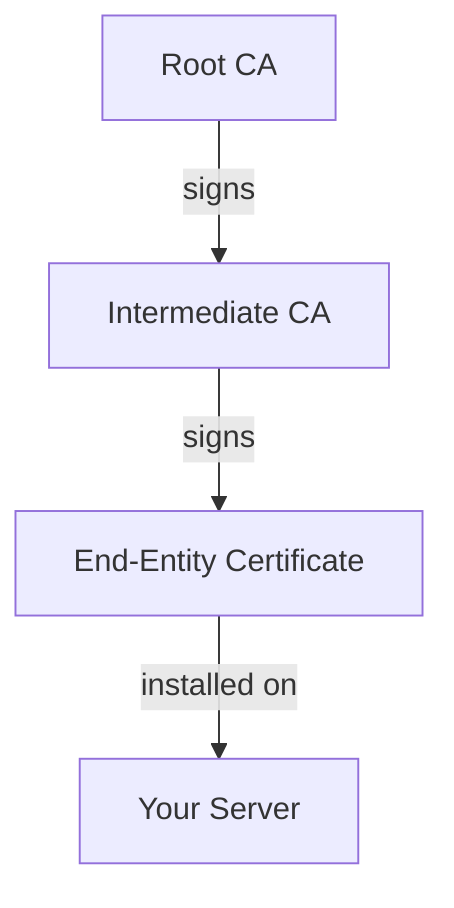
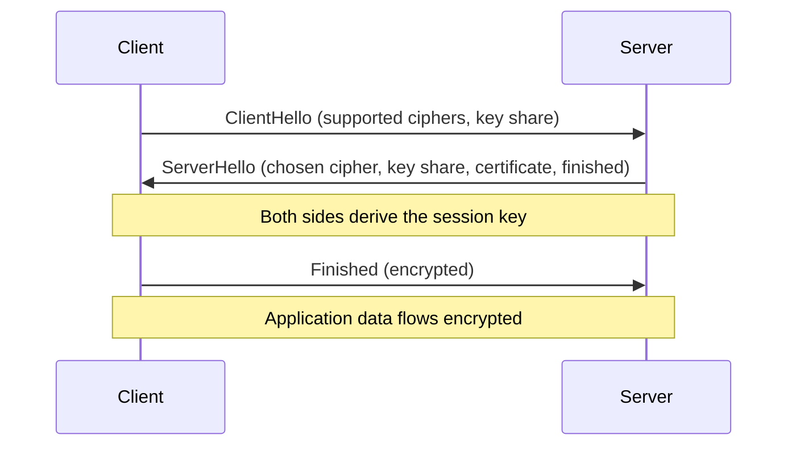

# TLS/SSL Fundamentals

Understanding Transport Layer Security (TLS) is critical for any systems administrator. TLS encrypts communication between clients and servers, preventing eavesdropping, tampering, and impersonation. Every HTTPS connection, email relay, database connection, and API call you secure depends on these fundamentals.

SSL (Secure Sockets Layer) is the predecessor to TLS. The protocol was renamed to TLS starting with version 1.0, but "SSL" persists in common usage, tool names (`openssl`), and certificate product names. In practice, when someone says "SSL certificate," they mean a certificate used with TLS.

---

## Cryptographic Foundations

TLS relies on two types of cryptography working together.

### Symmetric Encryption

Both sides share the same secret key. Fast, efficient, and used for the actual data transfer once a connection is established. Common algorithms include **AES-128** and **AES-256** (Advanced Encryption Standard with 128-bit or 256-bit keys).

The problem: how do two parties agree on a shared secret over an untrusted network?

### Asymmetric Encryption

Uses a mathematically linked key pair: a **public key** (shared openly) and a **private key** (kept secret). Data encrypted with the public key can only be decrypted with the private key, and vice versa. Common algorithms include **RSA** (2048+ bit keys) and **ECDSA** (256+ bit keys, faster and smaller).

Asymmetric encryption is slower than symmetric, so TLS uses it only during the handshake to securely exchange a symmetric key. After that, all data flows using the faster symmetric cipher.

---

## Public Key Infrastructure (PKI)

**PKI** is the trust framework that makes TLS work at scale. Without it, you would have to manually verify every server's public key before connecting - impractical for billions of websites.

### How Trust Works

A **Certificate Authority (CA)** is an organization trusted by browsers and operating systems to vouch for the identity of certificate holders. When a CA signs a certificate, it's saying "we verified that this entity controls this domain."

Trust flows through a chain:



- **Root CA**: The anchor of trust. Root certificates are pre-installed in browsers and operating systems. Root CAs sign intermediate CA certificates but rarely sign end-entity certificates directly - keeping the root key offline and secure.
- **Intermediate CA**: Signed by the root, used to sign end-entity certificates. If an intermediate CA is compromised, the root can revoke it without replacing every certificate it ever issued.
- **End-Entity Certificate**: The certificate installed on your server, containing your public key and domain name.

!!! tip "Why intermediate certificates matter"
    Your server must send both its end-entity certificate and the intermediate certificate(s) that chain back to the root. If you only send the end-entity certificate, clients cannot build the trust chain and will show a "connection not trusted" error. This is the single most common TLS misconfiguration.

---

## The TLS Handshake

Every TLS connection begins with a handshake that authenticates the server, negotiates encryption parameters, and establishes a shared secret. TLS 1.3 simplified this from a two-round-trip process (TLS 1.2) to a single round trip.

### TLS 1.3 Handshake



1. **ClientHello**: The client sends its supported TLS versions, cipher suites, and a key share (Diffie-Hellman parameters).
2. **ServerHello**: The server chooses a cipher suite, sends its own key share, its certificate, and a "finished" message - all in one flight.
3. **Key Derivation**: Both sides independently compute the same session key from the exchanged key shares.
4. **Encrypted Communication**: All subsequent data is encrypted with the symmetric session key.

### TLS 1.2 vs 1.3

| Feature | TLS 1.2 | TLS 1.3 |
|---------|---------|---------|
| Handshake round trips | 2 | 1 |
| Cipher suites | Many (including weak ones) | 5 strong suites only |
| Forward secrecy | Optional | Mandatory |
| RSA key exchange | Supported | Removed |
| 0-RTT resumption | No | Yes (with caveats) |

**Forward secrecy** means that even if the server's private key is compromised in the future, past recorded traffic cannot be decrypted. TLS 1.3 enforces this by removing RSA key exchange (where the session key is encrypted with the server's long-term key) and requiring ephemeral Diffie-Hellman key exchange.

---

## Cipher Suites

A **cipher suite** is a combination of algorithms used during a TLS connection. The name encodes each algorithm's role:

```
TLS_ECDHE_RSA_WITH_AES_256_GCM_SHA384
│    │     │        │    │   │    │
│    │     │        │    │   │    └─ Hash for PRF
│    │     │        │    │   └────── Mode (authenticated)
│    │     │        │    └────────── Key size
│    │     │        └─────────────── Symmetric cipher
│    │     └──────────────────────── Authentication
│    └────────────────────────────── Key exchange
└─────────────────────────────────── Protocol
```

TLS 1.3 simplified this naming. Instead of encoding every algorithm, suites are named like `TLS_AES_256_GCM_SHA384` because key exchange is always ephemeral Diffie-Hellman and authentication is determined by the certificate type.

### Recommended Configuration

Use the [**Mozilla SSL Configuration Generator**](https://ssl-config.mozilla.org/) to generate cipher suite configurations for your server software. The "Intermediate" profile balances security with compatibility:

```
# TLS 1.2 + 1.3 (Mozilla Intermediate)
ssl_protocols TLSv1.2 TLSv1.3;
ssl_ciphers ECDHE-ECDSA-AES128-GCM-SHA256:ECDHE-RSA-AES128-GCM-SHA256:ECDHE-ECDSA-AES256-GCM-SHA384:ECDHE-RSA-AES256-GCM-SHA384;
ssl_prefer_server_ciphers off;
```

---

## Working with OpenSSL

[**OpenSSL**](https://www.openssl.org/) is the industry-standard command-line toolkit for managing certificates and keys.

### Generating a Private Key

```bash
# RSA key (2048-bit minimum, 4096-bit for higher security)
openssl genrsa -out server.key 4096

# ECDSA key (faster, smaller - preferred for new deployments)
openssl ecparam -genkey -name prime256v1 -out server.key
```

### Creating a Certificate Signing Request (CSR)

A CSR contains your public key and identity information. You send it to a CA to get a signed certificate.

```bash
# Interactive (prompts for country, organization, common name, etc.)
openssl req -new -key server.key -out server.csr

# Non-interactive with Subject Alternative Names (modern standard)
openssl req -new -key server.key -out server.csr \
  -subj "/CN=example.com" \
  -addext "subjectAltName=DNS:example.com,DNS:www.example.com"
```

!!! warning "Always use Subject Alternative Names"
    The Common Name (CN) field is deprecated for domain validation. Modern browsers require the domain to appear in the Subject Alternative Name (SAN) extension. A certificate with only a CN and no SANs will trigger browser warnings.

### Inspecting Certificates

```bash
# View full certificate details
openssl x509 -in cert.pem -text -noout

# Check expiration date
openssl x509 -in cert.pem -enddate -noout

# Verify a certificate against a CA bundle
openssl verify -CAfile ca-bundle.pem cert.pem

# Check if a certificate matches a private key (modulus hash must match)
openssl x509 -noout -modulus -in cert.pem | openssl md5
openssl rsa -noout -modulus -in server.key | openssl md5
```

### Testing a Remote Server

```bash
# Connect to a server and display its certificate chain
openssl s_client -connect example.com:443 -servername example.com

# Check specific TLS version support
openssl s_client -connect example.com:443 -tls1_2
openssl s_client -connect example.com:443 -tls1_3

# Show only the certificate dates
echo | openssl s_client -connect example.com:443 2>/dev/null | openssl x509 -noout -dates
```

```code-walkthrough
language: bash
title: Inspecting a Remote TLS Certificate with OpenSSL
code: |
  openssl s_client \
    -connect example.com:443 \
    -servername example.com \
    </dev/null 2>/dev/null \
    | openssl x509 -noout -subject -issuer -dates -ext subjectAltName
annotations:
  - line: 1
    text: "s_client opens a TLS connection to a remote server. It acts as a generic TLS client, useful for testing and debugging."
  - line: 2
    text: "-connect specifies the host and port to connect to. Port 443 is the standard HTTPS port. You can test any TLS-enabled service (e.g., :587 for SMTP with STARTTLS)."
  - line: 3
    text: "-servername sends the SNI (Server Name Indication) header. Without it, servers hosting multiple domains on the same IP may return the wrong certificate."
  - line: 4
    text: "</dev/null closes stdin immediately so s_client exits after the handshake instead of waiting for input. 2>/dev/null suppresses connection status messages, keeping only the certificate output."
  - line: 5
    text: "The output of s_client (the PEM-encoded certificate) is piped to openssl x509 for parsing. -noout suppresses the raw PEM dump. -subject, -issuer, -dates, and -ext subjectAltName extract the key fields: who the cert belongs to, who signed it, when it expires, and which domains it covers."
```

### Common Certificate Formats

| Format | Extensions | Encoding | Common Use |
|--------|-----------|----------|------------|
| PEM | `.pem`, `.crt`, `.key` | Base64 ASCII | Linux, Nginx, Apache |
| DER | `.der`, `.cer` | Binary | Java, Windows |
| PKCS#12 | `.p12`, `.pfx` | Binary container | Windows, Java keystores |

```bash
# Convert PEM to DER
openssl x509 -in cert.pem -outform DER -out cert.der

# Convert PEM to PKCS#12 (bundles cert + key into one file)
openssl pkcs12 -export -in cert.pem -inkey server.key -out cert.p12

# Extract from PKCS#12 back to PEM
openssl pkcs12 -in cert.p12 -out cert.pem -nodes
```

---

## Server Name Indication (SNI)

**SNI** is a TLS extension that allows a client to specify which hostname it's connecting to during the handshake. Without SNI, a server with multiple TLS certificates on one IP address wouldn't know which certificate to present.

SNI is supported by all modern clients. The only environments where it causes issues are very old systems (Android 2.x, IE on Windows XP) and certain IoT devices.

---

## Certificate Transparency

**Certificate Transparency (CT)** is a public logging system that records every certificate issued by participating CAs. It allows domain owners to detect misissued certificates - for example, if a compromised CA issues a certificate for your domain to an attacker.

All major CAs now submit certificates to CT logs as a requirement for browser trust. You can search CT logs for certificates issued for your domain using tools like [**crt.sh**](https://crt.sh/).

---

## Historical Vulnerabilities

Understanding past TLS vulnerabilities explains why modern configurations disable older protocols:

| Vulnerability | Year | Affected | Impact |
|--------------|------|----------|--------|
| BEAST | 2011 | TLS 1.0 CBC ciphers | Could decrypt HTTPS cookies |
| CRIME | 2012 | TLS compression | Could recover secret tokens |
| Heartbleed | 2014 | OpenSSL 1.0.1-1.0.1f | Leaked server memory (keys, passwords) |
| POODLE | 2014 | SSLv3 | Could decrypt SSLv3 traffic |
| DROWN | 2016 | SSLv2 (even if only enabled alongside TLS) | Could decrypt TLS sessions |

The response to each vulnerability was to disable the affected protocol version or feature. This is why modern configurations use only TLS 1.2 and 1.3 with no compression and no CBC-mode ciphers.

---

```terminal
scenario: "Inspect a live TLS certificate chain"
steps:
  - command: "echo | openssl s_client -connect github.com:443 -servername github.com 2>/dev/null | head -20"
    output: "CONNECTED(00000003)\n---\nCertificate chain\n 0 s:C = US, ST = California, L = San Francisco, O = GitHub, Inc., CN = github.com\n   i:C = US, O = DigiCert Inc, CN = DigiCert TLS Hybrid ECC SHA384 2020 CA1\n 1 s:C = US, O = DigiCert Inc, CN = DigiCert TLS Hybrid ECC SHA384 2020 CA1\n   i:C = US, O = DigiCert Inc, OU = www.digicert.com, CN = DigiCert Global Root CA\n---"
    narration: "Connect to GitHub's server and display the certificate chain. You can see two certificates: the end-entity cert for github.com (signed by DigiCert's intermediate CA) and the intermediate CA cert (signed by DigiCert's root CA)."
  - command: "echo | openssl s_client -connect github.com:443 2>/dev/null | openssl x509 -noout -subject -issuer -dates"
    output: "subject=C = US, ST = California, L = San Francisco, O = GitHub, Inc., CN = github.com\nissuer=C = US, O = DigiCert Inc, CN = DigiCert TLS Hybrid ECC SHA384 2020 CA1\nnotBefore=Mar 15 00:00:00 2026 GMT\nnotAfter=Mar 15 23:59:59 2027 GMT"
    narration: "Extract the subject (who the certificate is for), issuer (who signed it), and validity dates. This certificate is valid for one year."
  - command: "echo | openssl s_client -connect github.com:443 2>/dev/null | openssl x509 -noout -text | grep -A 3 'Subject Alternative Name'"
    output: "            X509v3 Subject Alternative Name:\n                DNS:github.com, DNS:www.github.com"
    narration: "Check the Subject Alternative Names. These are the domains the certificate is valid for. Modern browsers validate against SANs, not the Common Name field."
  - command: "openssl s_client -connect github.com:443 -tls1_3 < /dev/null 2>&1 | grep 'Protocol\\|Cipher'"
    output: "    Protocol  : TLSv1.3\n    Cipher    : TLS_AES_128_GCM_SHA256"
    narration: "Verify that the server supports TLS 1.3. The negotiated cipher suite is TLS_AES_128_GCM_SHA256 - AES-128 in GCM mode with SHA-256."
  - command: "openssl genrsa -out test.key 2048 2>/dev/null && openssl req -new -x509 -key test.key -out test.crt -days 365 -subj '/CN=localhost' -addext 'subjectAltName=DNS:localhost,IP:127.0.0.1'"
    output: ""
    narration: "Generate a self-signed certificate for local testing. The -x509 flag skips the CSR step and produces a certificate directly. This cert includes SANs for both 'localhost' and 127.0.0.1."
  - command: "openssl x509 -in test.crt -noout -text | grep -A 2 'Subject Alternative'"
    output: "            X509v3 Subject Alternative Name:\n                DNS:localhost, IP Address:127.0.0.1"
    narration: "Verify the self-signed certificate has the correct SANs. IP addresses in SANs use the IP: prefix, not DNS:."
```

---

## Interactive Quizzes

```quiz
question: "Why does TLS use both asymmetric and symmetric encryption instead of just one?"
type: multiple-choice
options:
  - text: "Symmetric encryption is not secure enough on its own."
    feedback: "AES-256 symmetric encryption is extremely secure. The problem is securely sharing the key, not the algorithm's strength."
  - text: "Asymmetric encryption is used for the initial key exchange because it solves the key distribution problem, then symmetric encryption takes over because it's much faster."
    correct: true
    feedback: "Correct! Asymmetric encryption solves the chicken-and-egg problem of sharing a secret over an untrusted network. Once both sides have the shared secret, they switch to symmetric encryption, which is orders of magnitude faster for bulk data transfer."
  - text: "Asymmetric encryption doesn't work with HTTP."
    feedback: "There is no such limitation. The choice is purely about performance and key distribution."
  - text: "TLS 1.3 removed symmetric encryption."
    feedback: "TLS 1.3 still uses symmetric encryption (AES-GCM or ChaCha20) for all application data."
```

```quiz
question: "What is forward secrecy and why does TLS 1.3 mandate it?"
type: multiple-choice
options:
  - text: "It means encrypting data before sending it forward to the server."
    feedback: "Forward secrecy is about protecting past sessions, not the direction of data flow."
  - text: "It ensures that compromising the server's private key cannot decrypt previously recorded traffic."
    correct: true
    feedback: "Correct! With forward secrecy, each session uses unique ephemeral keys that are discarded after the session ends. Even if an attacker steals the server's private key, they cannot decrypt past sessions because the session keys no longer exist."
  - text: "It encrypts the server's private key for future use."
    feedback: "Forward secrecy protects past communications, not future key storage."
  - text: "It prevents man-in-the-middle attacks."
    feedback: "Certificate validation prevents MITM attacks. Forward secrecy specifically protects past sessions from future key compromise."
```

```quiz
question: "Which OpenSSL command tests whether a certificate matches its private key?"
type: multiple-choice
options:
  - text: "openssl verify -match cert.pem key.pem"
    feedback: "There is no -match flag. Matching requires comparing the modulus of both files."
  - text: "Compare the modulus hash of both: openssl x509 -noout -modulus -in cert.pem | openssl md5 and openssl rsa -noout -modulus -in key.pem | openssl md5"
    correct: true
    feedback: "Correct! If the MD5 hashes of the modulus from the certificate and the private key are identical, they are a matching pair. The modulus is the shared mathematical component of both the public and private key."
  - text: "openssl s_client -cert cert.pem -key key.pem"
    feedback: "s_client connects to a remote server. It doesn't verify local cert/key pairing."
  - text: "openssl x509 -check cert.pem key.pem"
    feedback: "There is no -check flag that takes both files. You need to compare the modulus of each separately."
```

---

```exercise
title: "Generate and Verify a Self-Signed Certificate"
scenario: |
  You need a self-signed certificate for local development and testing. Complete these steps:

  1. Generate a 4096-bit RSA private key
  2. Create a self-signed certificate valid for 365 days with CN=localhost
  3. Include SANs for both DNS:localhost and IP:127.0.0.1
  4. Verify the certificate details: subject, issuer (should match subject for self-signed), dates, and SANs
  5. Confirm the certificate and key match by comparing their modulus hashes
  6. Test the certificate by starting a local HTTPS server with `openssl s_server`
hints:
  - "Use openssl req -new -x509 to combine key generation and certificate creation in one step, or generate the key first with openssl genrsa"
  - "SANs are added with -addext 'subjectAltName=DNS:localhost,IP:127.0.0.1'"
  - "For a self-signed cert, the subject and issuer fields will be identical"
  - "openssl s_server -cert cert.pem -key key.pem -accept 4443 starts a test HTTPS server"
solution: |
  # Step 1: Generate private key
  openssl genrsa -out server.key 4096

  # Step 2: Create self-signed certificate with SANs
  openssl req -new -x509 \
    -key server.key \
    -out server.crt \
    -days 365 \
    -subj "/CN=localhost" \
    -addext "subjectAltName=DNS:localhost,IP:127.0.0.1"

  # Step 3: Verify certificate details
  openssl x509 -in server.crt -noout -text | grep -A 2 "Subject:"
  openssl x509 -in server.crt -noout -text | grep -A 2 "Issuer:"
  openssl x509 -in server.crt -noout -dates
  openssl x509 -in server.crt -noout -text | grep -A 2 "Subject Alternative"

  # Step 4: Verify cert/key match
  openssl x509 -noout -modulus -in server.crt | openssl md5
  openssl rsa -noout -modulus -in server.key | openssl md5
  # Both MD5 hashes should be identical

  # Step 5: Start a test HTTPS server
  openssl s_server -cert server.crt -key server.key -accept 4443
  # In another terminal: curl -k https://localhost:4443
  # The -k flag skips CA verification (needed for self-signed certs)
```

---

## Further Reading

- [OpenSSL Official Documentation](https://www.openssl.org/docs/) - reference for all commands and configuration options
- [Mozilla SSL Configuration Generator](https://ssl-config.mozilla.org/) - generates recommended TLS configurations for Nginx, Apache, HAProxy, and more
- [SSL Labs Server Test](https://www.ssllabs.com/ssltest/) - free online tool that grades your server's TLS configuration
- [Certificate Transparency Search (crt.sh)](https://crt.sh/) - search public CT logs for certificates issued for any domain
- [Cloudflare Learning Center: What is TLS?](https://www.cloudflare.com/learning/ssl/transport-layer-security-tls/) - accessible explanation of TLS concepts

---

**Next:** [Certificate Management](certificate-management.md) | [Back to Index](README.md)
