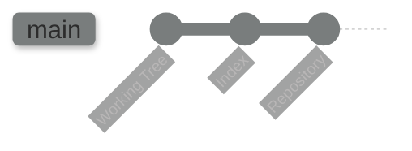

# Git: Getting Through It

The perspective that you pproach git is crucial to your ability to fully comprehend and understand it. This guide aims to help shift that perspective from basic commands to full foundational comprehension.

## Overview

Git is an incredible - if not often flawed - tool. Originally planned as a file system, its purpose and usability as a version control system became quickly apparent, and now we have one of the most popular and efficient development tools in use today. The beauty of it is actually in its simplicity, however, though this may not always feel apparent. I hope, thorugh this guide, you can gain an understanding that opens this simplicity up to you, allowing you to comprehend its use and its value inherently, while acknowledging where its flaws may present themselves.

A brief glossary of some terms you should ensure that you know before going further:
    
- **working tree**: Any directory on your filesystem with an associated Git repository (typically indicated by a `.git` sub-directory). It includes all the files and subdirectories in that directory.
- **the git index**: Unlike other tools, Git does not commit changes directly from the working tree into the repository. Instead, changes are first registered in the index, which acts as a staging area where changes are confirmed before committing.
- **commit**: A snapshot of your working tree at a particular point in time. The state of `HEAD` at the time of a commit becomes that commit’s parent, creating the revision history.
- **repository**: A collection of commits, each an archive of what the project’s working tree looked like at a past date. It also defines `HEAD`, which identifies the branch or commit the current working tree stemmed from. It includes branches and tags to identify certain commits by name.
- **branch**: A name for a commit (also called a reference). The parentage of a commit defines its history and the typical notion of a “branch of development.”
- **tag**: A name for a commit, similar to a branch, except it always refers to the same commit and can have a description.
- **master**: The mainline of development in most repositories, typically the default branch, but it’s not unique in any technical way.
- **HEAD**: Refers to what is currently checked out. If a branch is checked out, `HEAD` symbolically refers to that branch, and it updates after each commit. If a specific commit is checked out, `HEAD` refers to that commit only, known as a detached `HEAD`.

### Flow of Events

After initializing (creating) a repository, the actual work is performed in what is referred to as the **working tree**. At certain times, modifications are added to the index and then _committed_ to the repository. Next, you'll see a basic diagram of the usual lifecycle of a project in git:

